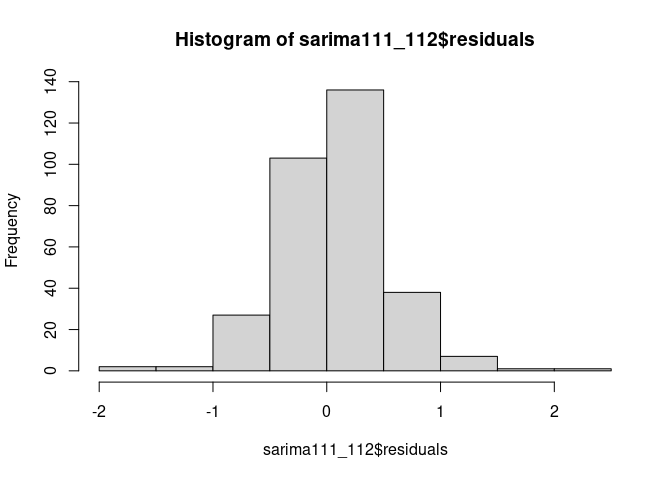
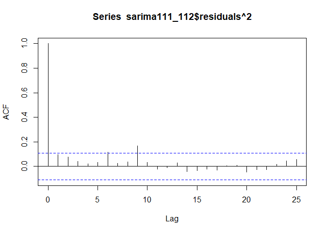

Untitled
================
Dittrich Levente
2023-08-11

- [Kezdeti beállítások](#kezdeti-beállítások)
  - [Használt packagek](#használt-packagek)
  - [Adatok lekérése](#adatok-lekérése)
  - [Adatok átalakítása](#adatok-átalakítása)
- [Adatvizualizáció](#adatvizualizáció)
- [Box-Jenkins módszer](#box-jenkins-módszer)
  - [1. lépés - Stacionaritás
    tesztelése](#1-lépés---stacionaritás-tesztelése)
  - [2. lépés - Stacionerré alakítás](#2-lépés---stacionerré-alakítás)
  - [3. lépés - Fehérzaj tesztelése](#3-lépés---fehérzaj-tesztelése)
  - [4. lépés - Korrelogramok](#4-lépés---korrelogramok)
    - [Szezonalitás korrigálása](#szezonalitás-korrigálása)
  - [5. lépés - Modellillesztés](#5-lépés---modellillesztés)
  - [6. lépés - Fehérzaj tesztelés](#6-lépés---fehérzaj-tesztelés)
- [Arch modell](#arch-modell)

Portfolióm ezen fejezetében a magyar inflációra építek ARIMA modellt,
illetve amennyiben a szórása nem állandó az idősornak, akkor GARCH
modellel fogom korrigálni ezt.

Mivel az inflációt többféle képpen szokás bemutatni, mint például az
éves átlagos inflációt, az előző havihoz képest, az előző év azonos
időszakához képest, az előző év decemberéhez képest az árszínvonal
változást, ezért ezek közül választanom kell. Moderált mennyiségű
töprengés után arra jutottam, hogy az [előző hónap azonos időszakához
képesti
inflációt](https://ec.europa.eu/eurostat/databrowser/view/PRC_HICP_MANR__custom_3761882/bookmark/table?lang=en&bookmarkId=4ad27e6f-358a-4a3d-82a0-587d69a833eb)
választom.

Az adatokat az Eurostattól kérem le, mert van erre package R-ben, nem
kell letölteni külön az adatokat. Mivel ez folyamatosan frissül, ezért a
reprodukálhatóság érdekében a jelenlegi legfrissebb adatot, a 2023
májusit veszem utolsó adatnak.

# Kezdeti beállítások

## Használt packagek

``` r
library(eurostat)
library(knitr)
library(tidyverse)
library(aTSA)
library(lmtest)
library(FinTS)
```

## Adatok lekérése

Az `eurostat` package-el egyenesen az Eurostat oldaláról tölhetem le az
adatsort. Az adatsor első 6 adatát szemügyre véve több fontos
tulajdonság látszik.

``` r
euInf = get_eurostat("prc_hicp_manr")
kable(head(euInf))
```

| unit  | coicop | geo | time       | values |
|:------|:-------|:----|:-----------|-------:|
| RCH_A | CP00   | AT  | 2023-07-01 |    7.0 |
| RCH_A | CP00   | BE  | 2023-07-01 |    1.6 |
| RCH_A | CP00   | CY  | 2023-07-01 |    2.4 |
| RCH_A | CP00   | DE  | 2023-07-01 |    6.5 |
| RCH_A | CP00   | EA  | 2023-07-01 |    5.3 |
| RCH_A | CP00   | EE  | 2023-07-01 |    6.3 |

A következők az oszlopok az adattáblában:

| Eredeti név | Magyar név | Leírás                                                                              |
|:------------|:-----------|:------------------------------------------------------------------------------------|
| unit        | egység     | az adatok egysége, ez minden esetben az előző év azonos időszakához viszonyított(%) |
| coicop      | fajta      | az infláció részletes csoportjai                                                    |
| geo         | terület    | az országok kódjai                                                                  |
| time        | idő        | a hónap első napja                                                                  |
| values      | értékek    | maguk az értékek                                                                    |

## Adatok átalakítása

Az 5 db változóra 3 043 278 megfigyelés tartozik. Ez azért lehet, mert
nagyon sok alcsoport és azoknak is al-al csoportjai vannak, szám szerint
összesen 476db minden egyes területi egységre minden negyedévben 1997
január óta. Nekem nincsen szükségem minden adatra, mivel a magyar
fogyasztói árváltozást szeretném vizsgálni, és annak sem alfajait, hanem
az egész fogyasztői kosár inflációját.

Az Eurostat oldalán a metaadatokat elolvasva derül ki, hogy a *CP00*
kódú változóra van szükségem. Így tehát szűröm a dataframet terület,
fajta, valamit idő szerint, a reprodukálhatóság miatt.

``` r
df = euInf %>%
  filter(geo == "HU", coicop == "CP00", time <= "2023-05-01")
```

Még egy fontos észrevétel: az adatoknál a legfrisebb adat van felül, ez
esetenként problémát okozhat, ezért idő szerint növekvő sorrendbe
rendezem az adatokat.

``` r
df = df %>%
  arrange(time)
```

# Adatvizualizáció

Az adatokat ábrázolva a következőt látjuk:

``` r
ggplot(df, aes(time, values))+
  geom_line()+
  theme_minimal()+
  labs(x = "Idő", y = "Infláció az előző év azonos időszakához képest")+
  scale_y_continuous(labels = function(x) paste0(x, "%"))
```

<!-- -->

A 90-es évek végén magas inflációval kezdődik az idősor, amely
többé-kevésbé csökkenő trendet mutat, némi *random walk*-kal egészen
2015-ig. A 2014-15-ös években még defláció is fellépett. Ebben az
időszakban a fejlett országok között sokan kűzdüttek deflációval, mint
például [Japán](https://www.bbc.com/news/business-32081871) és az
[Európai Unió tagállamai](https://www.bbc.com/news/business-30707644).
Az utóbbi országokban a csökkenő energiaárak okozták a fejtörést a
központi bankoknak.

Ezek után az infláció emelkedni kezdett, de még 5% alatt maradva,
egészen 2021 szeptemberéig. Ekkor lépett 5% fölé az előző év azonos
időszakához viszonyított fogyasztói kosár árváltozása és kezdett nőni
exponenciálisan a továbbiakban. Ennek véleményem szerint több oka is
lehet.  

A makroökonómiában használatos AS-AD görbét alapul véve az energiaárak
emelkedése hatalmas sokkot okozhatott a keresleti oldalon. Úgy gondolom,
hogy az elszálló inflációnak keresleti oldali okai is vannak, mégpedig a
túlfűtött gazdaság, ami a hosszútávú egyensúlyi kibocsátásnál, vagyis a
rendelkezésre álló tőke, munka, termelékenység függvényénél nagyobb volt
a gazdaság teljesítménye, mivel hatalmas mennyiségű pénzt öntöttek bele,
ami növelte a fogyasztást, beruházásokat és a kormányzati költéseket is.
A költségvetési hiányban látszódó kormányzati “pénzszórás” (transzferek)
2021-22-ben jelentősen növelte a forgásban lévő pénzmennyiséget és
fogyasztást.  

Szintén problémának vélem az energiaár-növekedést pénzpiaci, illetve
nemzetközi gazdasági szempontból, mivel a különböző energiahordozókért
rendszerint nem forintban törleszti az állam a számlát, hanem más
devizában. Ez azt implikálja, hogy amikor nő az energiaár, akkor megnő a
kereslet a tegyük fel, hogy az euró felé. Ekkor az állam a forintját
eladva eurót vesz, ami csökkenti a forint iránti keresletet az euróval
szemben, ami a forint árfolyamát gyengíti. Az [MNB inflációs
jelentésében](https://www.mnb.hu/letoltes/hun-ir-digitalis-21.pdf) (78.
oldal teteje) szerepel, hogy 1%-nyi árfolyam felértékelődés 0,3%-nyi
infláció csökkenést okoz. Ez a hatás a leértékelődésnél is jelen van.
Magyarország kis, nyitott gazdaság, sok importált termékkel, a
kereskedők nagyon gyorsan tudják az áraikat növelni(hogy megmaradjon a
várt profitjuk), az árfolyamnövekedéssel párhuzamosan. Sőt, mivel a
gazdaságban ilyen időkben nagyobb a bizonytalanság, így az árakat nem is
feltétlenül pontosan az árfolyam változásával arányosan emelik, hanem a
várakozásaiknak megfelelően, ami sokszor még nagyobb leértékelődést
prognosztizál és egy esetleges euró/forint árfolyam erősödésnél pedig
nem csökkentik az áraikat. Egy másik, inkább teoretikusabb felvetés az
angol *greedflation* szóösszetétel, ami magyarul kapzsisági inflációnak
lehetne hívni. Ez abban nyílvánul meg, hogy egyes szereplők növelik az
áraikat, annak ellenére, hogy költségeik nem nőttek, vagy kisebb
mértékben, mivel a fogyasztók az áremelkedéssel már több helyen
találkoztak, így kevesebb ellenállásba, kereslet csökkenésbe ütközik az
áremelés a még nagyobb profit érdekében.  

Nézőpontom szerint ez egy komplex probléma, amit a kormány és a jegybank
megfelelő kooperációja nagyon magasan képzett szakértői gárdával tudna
bizonyos mértékig ellensúlyozni.

# Box-Jenkins módszer

A következőkben a Box-Jenkins módszer lépésein fogok végighaladni.

## 1. lépés - Stacionaritás tesztelése

Az erős stacionaritás azt jelenti, hogy az idősorok minden véges
dimenziós eloszlása eltolásinvariás. Ez egy olyan erős követelmény, amit
inkább a valószínűségszámításban használnak gyakran, azonban
ökonometriában túl szigorú követelmény, ezért szokás gyenge
stacionaritással dolgozni. Ez azt jelenti, hogy az idősor szórása és
várható értéke időben állandó. A stacionaritás teszteléséhez egy
Augmented Dickey-Fuller tesztet fogok végezni.

Az ADF teszt hipotézisei:

- H0: Az idősor nem stacioner, $\phi = 0$
- H1: Az idősor stacionárius, $\phi \neq 0$

A teszt nem csak egyféle módon végzi a tesztet, random-walkkal, valamint
random walkkal és trenddel is megnézi a stacionaritást.

``` r
adf.test(df$values)
```

    ## Augmented Dickey-Fuller Test 
    ## alternative: stationary 
    ##  
    ## Type 1: no drift no trend 
    ##      lag    ADF p.value
    ## [1,]   0 -0.109  0.6124
    ## [2,]   1 -1.059  0.3003
    ## [3,]   2 -1.464  0.1557
    ## [4,]   3 -1.573  0.1169
    ## [5,]   4 -1.411  0.1747
    ## [6,]   5 -1.932  0.0527
    ## Type 2: with drift no trend 
    ##      lag    ADF p.value
    ## [1,]   0 -0.451   0.891
    ## [2,]   1 -1.719   0.438
    ## [3,]   2 -2.263   0.224
    ## [4,]   3 -2.484   0.137
    ## [5,]   4 -2.346   0.191
    ## [6,]   5 -3.023   0.036
    ## Type 3: with drift and trend 
    ##      lag    ADF p.value
    ## [1,]   0  1.127   0.990
    ## [2,]   1 -0.831   0.958
    ## [3,]   2 -1.467   0.801
    ## [4,]   3 -1.812   0.656
    ## [5,]   4 -1.659   0.720
    ## [6,]   5 -2.344   0.431
    ## ---- 
    ## Note: in fact, p.value = 0.01 means p.value <= 0.01

Nagyon magasak a p-értékek, az idősor biztosan nem stacioner, egyik
esetben sem.

## 2. lépés - Stacionerré alakítás

``` r
df$dValues = c(NA, diff(df$values))
adf.test(df$dValues)
```

    ## Augmented Dickey-Fuller Test 
    ## alternative: stationary 
    ##  
    ## Type 1: no drift no trend 
    ##      lag    ADF p.value
    ## [1,]   0 -10.44    0.01
    ## [2,]   1  -7.75    0.01
    ## [3,]   2  -6.40    0.01
    ## [4,]   3  -6.00    0.01
    ## [5,]   4  -5.28    0.01
    ## [6,]   5  -5.37    0.01
    ## Type 2: with drift no trend 
    ##      lag    ADF p.value
    ## [1,]   0 -10.43    0.01
    ## [2,]   1  -7.73    0.01
    ## [3,]   2  -6.38    0.01
    ## [4,]   3  -5.99    0.01
    ## [5,]   4  -5.27    0.01
    ## [6,]   5  -5.36    0.01
    ## Type 3: with drift and trend 
    ##      lag    ADF p.value
    ## [1,]   0 -10.78    0.01
    ## [2,]   1  -8.06    0.01
    ## [3,]   2  -6.65    0.01
    ## [4,]   3  -6.23    0.01
    ## [5,]   4  -5.61    0.01
    ## [6,]   5  -5.66    0.01
    ## ---- 
    ## Note: in fact, p.value = 0.01 means p.value <= 0.01

A stacionaritás elérése érdekében differenciáztam az idősort. A
differenciált idősor esetében minden esetben el lehet utasítani a
nullhipotézist, vagyis nincsen egységgyök a modellben, stacioner
viselkedésű.

A differenciált idősor ábrázolva így néz ki:

``` r
ggplot(df, aes(time, dValues))+
  geom_line()+
  theme_minimal()+
  labs(x = "Idő", y = "Differeciázott infláció")+
  scale_y_continuous(labels = function(x) paste0(x, "%"))
```

    ## Warning: Removed 1 row containing missing values (`geom_line()`).

<!-- -->

A grafikonon látszik, hogy 2020-tól a differenciált idősor volatilitása
egyre nagyobbak lesz.

## 3. lépés - Fehérzaj tesztelése

Az ARIMA modell építése előtt meg kell nézni, hogy fehérzaj-e az idősor.
Amennyiben igen, akkor nem tudunk modell építeni, az adatok egyszerű
zajok.

A Breusch-Godfrey teszt nullhipotézise szerint az $\hat{u_t}$-re felírt
segédregresszóból $R^2 = 0$, vagyis a VECM egyenleteinek hibatagjai
fehérzajok.

``` r
bgtest(df$dValues ~ 1, order = 24)
```

    ## 
    ##  Breusch-Godfrey test for serial correlation of order up to 24
    ## 
    ## data:  df$dValues ~ 1
    ## LM test = 127.62, df = 24, p-value = 4.172e-16

Az alacsony p-érték miatt el lehet utasítani a nullhipotézist minden
szokványos szignifikanciaszinten. Az differenciált idősor nem fehérzaj.

## 4. lépés - Korrelogramok

Az autokorrelációs korrelogram a mozgóátlag(MA) folyamatokhoz szükséges
késleltetések meghatározásához szükséges az ARIMA modellbe.

``` r
acf(df$dValues[-1])
```

<!-- -->

Szignifikánsan 5 késleltetésig tér el 0-tól az autokorreláció, illetve a
12. késleltetésnél.

A parciális autokorrelációs korrelogram a mozgóátlag(MA) folyamatokhoz
szükséges késleltetések meghatározásához szükséges az ARIMA modellbe.

``` r
pacf(df$dValues[-1])
```

<!-- -->

Nullától szignifikánsan eltérő az első, illetve a 12. és 13.
késleltetés. A 12-13. késleltetés valószínűleg a havi adatok miatt
egyfajta szezonalitás. Ennek kezelésére lehet úgy differenciálni az
idősort, hogy nem az előző adathoz képest nézzük az eltérést, hanem az
előző évi azonos adathoz. Ezzel a módszerrel azonban nem 1, hanem még
12, azaz 13 db adat veszik el, amennyiben még a szezonalitásos
differenciázás után még differenciázni kell.

### Szezonalitás korrigálása

``` r
df2 = data.frame(
  time = df$time[-c(1:12)],
  values = diff(df$values,12)
)

plot.ts(df2$values)
```

<!-- -->

Már a grafikonon is látszik, hogy az idősor szórása és átlaga időben nem
állandó, ezért mégegyszer differenciálom, ezúttal az előző adathoz
képest.

``` r
df2$dvalues = c(NA, diff(df2$values))

plot.ts(diff(df2$values))
```

<!-- -->

``` r
adf.test(diff(df2$values))
```

    ## Augmented Dickey-Fuller Test 
    ## alternative: stationary 
    ##  
    ## Type 1: no drift no trend 
    ##      lag    ADF p.value
    ## [1,]   0 -12.27    0.01
    ## [2,]   1  -9.38    0.01
    ## [3,]   2  -7.84    0.01
    ## [4,]   3  -7.22    0.01
    ## [5,]   4  -6.27    0.01
    ## [6,]   5  -5.75    0.01
    ## Type 2: with drift no trend 
    ##      lag    ADF p.value
    ## [1,]   0 -12.26    0.01
    ## [2,]   1  -9.38    0.01
    ## [3,]   2  -7.84    0.01
    ## [4,]   3  -7.22    0.01
    ## [5,]   4  -6.29    0.01
    ## [6,]   5  -5.75    0.01
    ## Type 3: with drift and trend 
    ##      lag    ADF p.value
    ## [1,]   0 -12.25    0.01
    ## [2,]   1  -9.36    0.01
    ## [3,]   2  -7.82    0.01
    ## [4,]   3  -7.21    0.01
    ## [5,]   4  -6.21    0.01
    ## [6,]   5  -5.71    0.01
    ## ---- 
    ## Note: in fact, p.value = 0.01 means p.value <= 0.01

Az ADF-teszt szerint mostmár gyengén stacioner az idősor. Visszatérhetek
az ACF és PACF vizsgálatához.

``` r
acf(df2$dvalues[-1])
```

<!-- -->

``` r
pacf(df2$dvalues[-1])
```

<!-- -->

Még mindig fenn áll a szezonalitás. Ez az adatok milyensége miatt lehet,
mivel eleve az előző év azonos időszakához van viszonyítva az
árszínvonal.

Mivel valószínűleg ezt nem tudom megoldani differenciázással, ezért a
modellezésnél az eredeti adatokat fogom használni.

## 5. lépés - Modellillesztés

Elsőként egy nagyobb modellel kezdenék, egy ARIMA(3,1,3)-al, azaz
egyszer differenciált, mind a mozgóátlag, mind az autóregresszív
paraméter 3 értékű. Ez azt jelenti, hogy 3 késleltetésig lesznek a
modellben mozgóátlag és autoregresszív folyamatok.

``` r
arima313 = arima(df$values, order = c(3,1,3))
coeftest(arima313)
```

    ## 
    ## z test of coefficients:
    ## 
    ##      Estimate Std. Error z value  Pr(>|z|)    
    ## ar1 -0.161708   0.104873 -1.5419  0.123090    
    ## ar2 -0.197049   0.079634 -2.4744  0.013344 *  
    ## ar3  0.619510   0.073513  8.4272 < 2.2e-16 ***
    ## ma1  0.584576   0.123945  4.7164 2.400e-06 ***
    ## ma2  0.617630   0.117599  5.2520 1.505e-07 ***
    ## ma3 -0.391672   0.120786 -3.2427  0.001184 ** 
    ## ---
    ## Signif. codes:  0 '***' 0.001 '**' 0.01 '*' 0.05 '.' 0.1 ' ' 1

Az ar1 paraméteren kívül minden együttható szignifikáns, lehet növelve
az AR és MA értékeit szintén szignifikánsak lesznek az együtthatók.

``` r
arima414 = arima(df$values, order = c(4,1,4))
coeftest(arima414)
```

    ## 
    ## z test of coefficients:
    ## 
    ##      Estimate Std. Error z value  Pr(>|z|)    
    ## ar1 -0.639465   0.369229 -1.7319  0.083293 .  
    ## ar2 -0.076386   0.251536 -0.3037  0.761372    
    ## ar3  0.703985   0.109542  6.4266 1.305e-10 ***
    ## ar4  0.093609   0.246904  0.3791  0.704591    
    ## ma1  1.071194   0.364828  2.9362  0.003323 ** 
    ## ma2  0.635400   0.405431  1.5672  0.117063    
    ## ma3 -0.309517   0.306610 -1.0095  0.312745    
    ## ma4 -0.166973   0.112266 -1.4873  0.136934    
    ## ---
    ## Signif. codes:  0 '***' 0.001 '**' 0.01 '*' 0.05 '.' 0.1 ' ' 1

A bővített modell együtthatói nem különösebben lettek szignifikánsak,
így bővíteni a modellt valószínüleg nem érdemes, szűkíteni pedig nem
szeretném, mivel az alapmodell együtthatói szignifikánsnak bizonyultak.

Még egy lehetőségem van a modellszelekcóra, mégpedig függvény
segítségével. A forecast csomag auto.arima függvényével megnézem, hogy
aszerint melyik a legjobban illeszkedő modell.

``` r
forecast::auto.arima(df$values)
```

    ## Registered S3 method overwritten by 'quantmod':
    ##   method            from
    ##   as.zoo.data.frame zoo

    ## Series: df$values 
    ## ARIMA(3,2,3) 
    ## 
    ## Coefficients:
    ##           ar1      ar2     ar3     ma1      ma2      ma3
    ##       -0.7776  -0.3133  0.4917  0.2284  -0.2595  -0.9229
    ## s.e.   0.0674   0.0753  0.0556  0.0541   0.0466   0.0305
    ## 
    ## sigma^2 = 0.3282:  log likelihood = -270.18
    ## AIC=554.36   AICc=554.73   BIC=580.63

Az auto.arima az ARIMA(3,2,3) modellt javasolja, ami annyiban tér el az
én modellemtől, hogy még egyszer differenciálva van.

``` r
arima323 = forecast::auto.arima(df$values)
coeftest(arima323)
```

    ## 
    ## z test of coefficients:
    ## 
    ##      Estimate Std. Error  z value  Pr(>|z|)    
    ## ar1 -0.777561   0.067394 -11.5376 < 2.2e-16 ***
    ## ar2 -0.313270   0.075268  -4.1621 3.154e-05 ***
    ## ar3  0.491678   0.055644   8.8361 < 2.2e-16 ***
    ## ma1  0.228416   0.054128   4.2199 2.444e-05 ***
    ## ma2 -0.259500   0.046591  -5.5697 2.551e-08 ***
    ## ma3 -0.922924   0.030496 -30.2635 < 2.2e-16 ***
    ## ---
    ## Signif. codes:  0 '***' 0.001 '**' 0.01 '*' 0.05 '.' 0.1 ' ' 1

Ebben az esetben minden együttható szignifikáns, feltehetően jobban
illeszkedik, mint az ARIMA(3,1,3).

Ideje összehasonlítani az így kapott modelleket, ám érdemes észben
tartani, hogy a (3,2,3) paraméterű modell 1-el kevesebb megfigyeléssel
rendelkezik a többinél az egyel több differenciálás miatt, ekkor
eltérhetnek egyes információs kritériumok oly módon, ami igencsak
félrevezető lehet.

Az információs kritériumok képletei a következők:

- $AIC = - 2 \times ln(\hat{L}) + 2 \times k$
- $BIC = - 2 \times ln(\hat{L}) + 2 \times ln(n) \times k$

Ahol $ln(\hat{L})$ a log-likelihood-ja a modellnek, $k$ a paraméterek
száma, $n$ pedig a megfigyelések száma.

Látható, hogy míg az AIC képletében nem szerepel közvetlenül a
megfigyelések száma, addig a BIC-ben igen, mégpedig pozitív előjellez,
azaz ha csökken a megfigyelések száma, úgy csökken a BIC értéke is.

``` r
IC = AIC(arima313,arima414, arima323)
IC$BIC = BIC(arima313,arima414, arima323)[,2]
kable(IC)
```

|          |  df |      AIC |      BIC |
|:---------|----:|---------:|---------:|
| arima313 |   7 | 545.5849 | 571.8751 |
| arima414 |   9 | 552.8951 | 586.6967 |
| arima323 |   7 | 554.3634 | 580.6314 |

Annak ellenére, hogy az auto.arima a (3,2,3) modellt javasolta, mind az
AIC, mind a BIC szerint a (3,1,3) a jobb, így ezt a modellt tekintem
végső ARIMA modellemnek.

## 6. lépés - Fehérzaj tesztelés

``` r
Box.test(arima313$residuals, type = "Ljung-Box")
```

    ## 
    ##  Box-Ljung test
    ## 
    ## data:  arima313$residuals
    ## X-squared = 0.026344, df = 1, p-value = 0.8711

``` r
shapiro.test(arima313$residuals)
```

    ## 
    ##  Shapiro-Wilk normality test
    ## 
    ## data:  arima313$residuals
    ## W = 0.97587, p-value = 3.62e-05

# Arch modell

``` r
hist(arima313$residuals)
```

<!-- -->

``` r
acf(df$dValues[-1]^2)
```

<!-- -->

``` r
pacf(df$dValues[-1]^2)
```

<!-- -->

``` r
ArchTest(df$dValues)
```

    ## 
    ##  ARCH LM-test; Null hypothesis: no ARCH effects
    ## 
    ## data:  df$dValues
    ## Chi-squared = 75.722, df = 12, p-value = 2.683e-11
