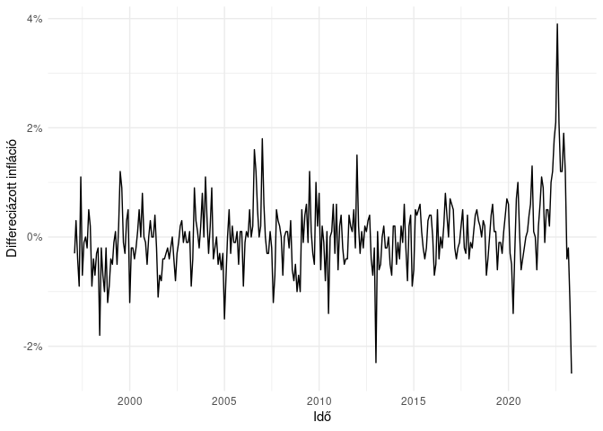
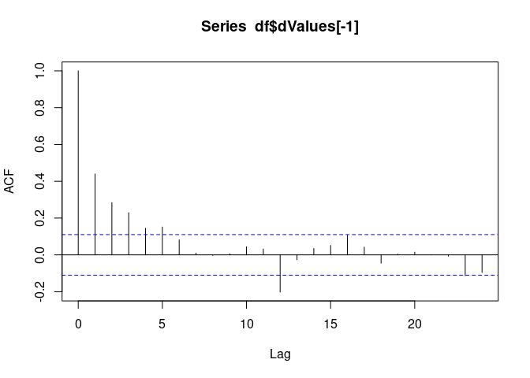
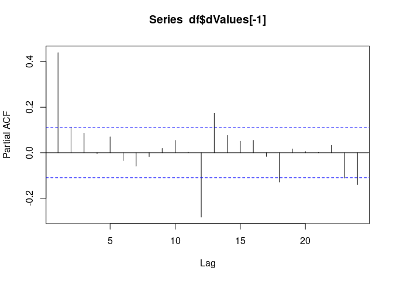
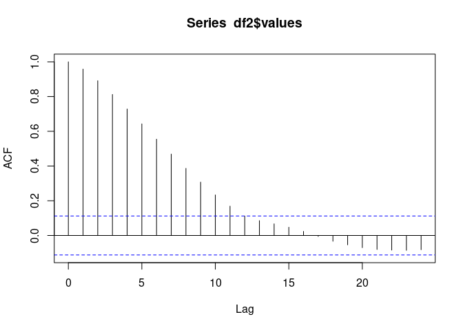
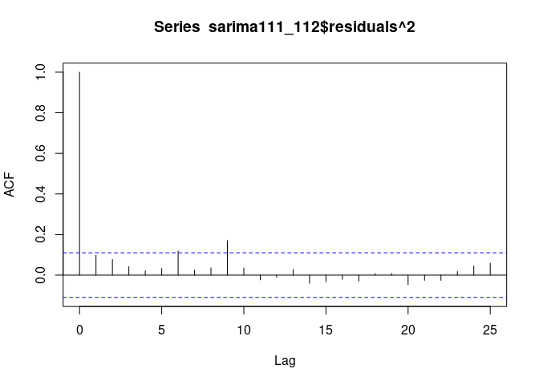
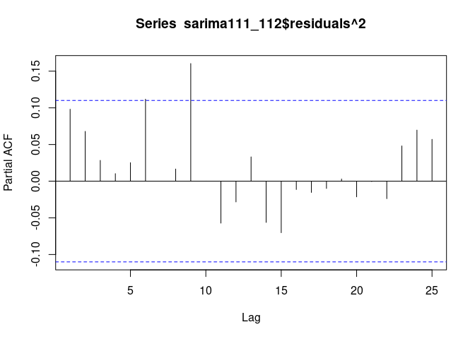

SARIMA modell ARCH hatások vizsgálatával
================
Dittrich Levente
2023-08-21

- [Kezdeti beállítások](#kezdeti-beállítások)
  - [Használt packagek](#használt-packagek)
  - [Adatok lekérése](#adatok-lekérése)
  - [Adatok átalakítása](#adatok-átalakítása)
- [Adatvizualizáció](#adatvizualizáció)
- [Box-Jenkins módszer](#box-jenkins-módszer)
  - [1. lépés - Stacionaritás
    tesztelése](#1-lépés---stacionaritás-tesztelése)
  - [2. lépés - Stacionerré alakítás](#2-lépés---stacionerré-alakítás)
  - [3. lépés - Fehérzaj tesztelése](#3-lépés---fehérzaj-tesztelése)
  - [4. lépés - Korrelogramok](#4-lépés---korrelogramok)
    - [SARIMA korrelogrammok](#sarima-korrelogrammok)
  - [5. lépés - Modellillesztés](#5-lépés---modellillesztés)
  - [6. lépés - Modell tesztelése](#6-lépés---modell-tesztelése)
- [Arch modell](#arch-modell)
- [Előrejelzés a modellel](#előrejelzés-a-modellel)

Portfolióm ezen fejezetében a magyar inflációra építek ARIMA modellt,
illetve amennyiben a szórása nem állandó az idősornak, akkor GARCH
modellel fogom korrigálni ezt.

Mivel az inflációt többféle képpen szokás bemutatni, mint például az
éves átlagos inflációt, az előző havihoz képest, az előző év azonos
időszakához képest, az előző év decemberéhez képest az árszínvonal
változást, ezért ezek közül választanom kell. Moderált mennyiségű
töprengés után arra jutottam, hogy az [előző hónap azonos időszakához
képesti
inflációt](https://ec.europa.eu/eurostat/databrowser/view/PRC_HICP_MANR__custom_3761882/bookmark/table?lang=en&bookmarkId=4ad27e6f-358a-4a3d-82a0-587d69a833eb)
választom.

Az adatokat az Eurostattól kérem le, mert van erre package R-ben, nem
kell letölteni külön az adatokat. Mivel ez folyamatosan frissül, ezért a
reprodukálhatóság érdekében a jelenlegi legfrissebb adatot, a 2023
májusit veszem utolsó adatnak.

# Kezdeti beállítások

## Használt packagek

``` r
library(eurostat)
library(knitr)
library(tidyverse)
library(aTSA)
library(lmtest)
library(FinTS)
```

## Adatok lekérése

Az `eurostat` package-el egyenesen az Eurostat oldaláról tölhetem le az
adatsort. Az adatsor első 6 adatát szemügyre véve több fontos
tulajdonság látszik.

``` r
euInf = get_eurostat("prc_hicp_manr")
kable(head(euInf))
```

| unit  | coicop | geo | time       | values |
|:------|:-------|:----|:-----------|-------:|
| RCH_A | AP     | AT  | 2023-07-01 |    5.3 |
| RCH_A | AP     | BE  | 2023-07-01 |    5.5 |
| RCH_A | AP     | BG  | 2023-07-01 |    7.7 |
| RCH_A | AP     | CH  | 2023-07-01 |    2.6 |
| RCH_A | AP     | CY  | 2023-07-01 |    0.0 |
| RCH_A | AP     | CZ  | 2023-07-01 |   20.8 |

A következők az oszlopok az adattáblában:

| Eredeti név | Magyar név | Leírás                                                                              |
|:------------|:-----------|:------------------------------------------------------------------------------------|
| unit        | egység     | az adatok egysége, ez minden esetben az előző év azonos időszakához viszonyított(%) |
| coicop      | fajta      | az infláció részletes csoportjai                                                    |
| geo         | terület    | az országok kódjai                                                                  |
| time        | idő        | a hónap első napja                                                                  |
| values      | értékek    | maguk az értékek                                                                    |

## Adatok átalakítása

Az 5 db változóra 3 043 278 megfigyelés tartozik. Ez azért lehet, mert
nagyon sok alcsoport és azoknak is al-al csoportjai vannak, szám szerint
összesen 476db minden egyes területi egységre minden negyedévben 1997
január óta. Nekem nincsen szükségem minden adatra, mivel a magyar
fogyasztói árváltozást szeretném vizsgálni, és annak sem alfajait, hanem
az egész fogyasztői kosár inflációját.

Az Eurostat oldalán a metaadatokat elolvasva derül ki, hogy a *CP00*
kódú változóra van szükségem. Így tehát szűröm a dataframet terület,
fajta, valamit idő szerint, a reprodukálhatóság miatt.

``` r
df = euInf %>%
  filter(geo == "HU", coicop == "CP00", time <= "2023-05-01")
```

Még egy fontos észrevétel: az adatoknál a legfrisebb adat van felül, ez
esetenként problémát okozhat, ezért idő szerint növekvő sorrendbe
rendezem az adatokat.

``` r
df = df %>%
  arrange(time)
```

# Adatvizualizáció

Az adatokat ábrázolva a következőt látjuk:

``` r
ggplot(df, aes(time, values))+
  geom_line()+
  theme_minimal()+
  labs(x = "Idő", y = "Infláció az előző év azonos időszakához képest")+
  scale_y_continuous(labels = function(x) paste0(x, "%"))
```

<!-- -->

A 90-es évek végén magas inflációval kezdődik az idősor, amely
többé-kevésbé csökkenő trendet mutat, némi *random walk*-kal egészen
2015-ig. A 2014-15-ös években még defláció is fellépett. Ebben az
időszakban a fejlett országok között sokan kűzdüttek deflációval, mint
például [Japán](https://www.bbc.com/news/business-32081871) és az
[Európai Unió tagállamai](https://www.bbc.com/news/business-30707644).
Az utóbbi országokban a csökkenő energiaárak okozták a fejtörést a
központi bankoknak.

Ezek után az infláció emelkedni kezdett, de még 5% alatt maradva,
egészen 2021 szeptemberéig. Ekkor lépett 5% fölé az előző év azonos
időszakához viszonyított fogyasztói kosár árváltozása és kezdett nőni
exponenciálisan a továbbiakban. Ennek véleményem szerint több oka is
lehet.  

A makroökonómiában használatos AS-AD görbét alapul véve az energiaárak
emelkedése hatalmas sokkot okozhatott a keresleti oldalon. Úgy gondolom,
hogy az elszálló inflációnak keresleti oldali okai is vannak, mégpedig a
túlfűtött gazdaság, ami a hosszútávú egyensúlyi kibocsátásnál, vagyis a
rendelkezésre álló tőke, munka, termelékenység függvényénél nagyobb volt
a gazdaság teljesítménye, mivel hatalmas mennyiségű pénzt öntöttek bele,
ami növelte a fogyasztást, beruházásokat és a kormányzati költéseket is.
A költségvetési hiányban látszódó kormányzati “pénzszórás” (transzferek)
2021-22-ben jelentősen növelte a forgásban lévő pénzmennyiséget és
fogyasztást.  

Szintén problémának vélem az energiaár-növekedést pénzpiaci, illetve
nemzetközi gazdasági szempontból, mivel a különböző energiahordozókért
rendszerint nem forintban törleszti az állam a számlát, hanem más
devizában. Ez azt implikálja, hogy amikor nő az energiaár, akkor megnő a
kereslet a tegyük fel, hogy az euró felé. Ekkor az állam a forintját
eladva eurót vesz, ami csökkenti a forint iránti keresletet az euróval
szemben, ami a forint árfolyamát gyengíti. Az [MNB inflációs
jelentésében](https://www.mnb.hu/letoltes/hun-ir-digitalis-21.pdf) (78.
oldal teteje) szerepel, hogy 1%-nyi árfolyam felértékelődés 0,3%-nyi
infláció csökkenést okoz. Ez a hatás a leértékelődésnél is jelen van.
Magyarország kis, nyitott gazdaság, sok importált termékkel, a
kereskedők nagyon gyorsan tudják az áraikat növelni(hogy megmaradjon a
várt profitjuk), az árfolyamnövekedéssel párhuzamosan. Sőt, mivel a
gazdaságban ilyen időkben nagyobb a bizonytalanság, így az árakat nem is
feltétlenül pontosan az árfolyam változásával arányosan emelik, hanem a
várakozásaiknak megfelelően, ami sokszor még nagyobb leértékelődést
prognosztizál és egy esetleges euró/forint árfolyam erősödésnél pedig
nem csökkentik az áraikat.  Egy másik, inkább teoretikusabb felvetés az
angol *greedflation* szóösszetétel, ami magyarul kapzsisági inflációnak
lehetne hívni. Ez abban nyílvánul meg, hogy egyes szereplők növelik az
áraikat, annak ellenére, hogy költségeik nem nőttek, vagy kisebb
mértékben, mivel a fogyasztók az áremelkedéssel már több helyen
találkoztak, így kevesebb ellenállásba, kereslet csökkenésbe ütközik az
áremelés a még nagyobb profit érdekében.  

Nézőpontom szerint ez egy komplex probléma, amit a kormány és a jegybank
megfelelő kooperációja nagyon magasan képzett szakértői gárdával tudna
bizonyos mértékig ellensúlyozni.

# Box-Jenkins módszer

A következőkben a Box-Jenkins módszer lépésein fogok végighaladni.

## 1. lépés - Stacionaritás tesztelése

Az erős stacionaritás azt jelenti, hogy az idősorok minden véges
dimenziós eloszlása eltolásinvariás. Ez egy olyan erős követelmény, amit
inkább a valószínűségszámításban használnak gyakran, azonban
ökonometriában túl szigorú követelmény, ezért szokás gyenge
stacionaritással dolgozni. Ez azt jelenti, hogy az idősor szórása és
várható értéke időben állandó. A stacionaritás teszteléséhez egy
Augmented Dickey-Fuller tesztet fogok végezni.

Az ADF teszt hipotézisei:

- H0: Az idősor nem stacioner, $\phi = 0$
- H1: Az idősor stacionárius, $\phi \neq 0$

A teszt nem csak egyféle módon végzi a tesztet, random-walkkal, valamint
random walkkal és trenddel is megnézi a stacionaritást.

``` r
adf.test(df$values)
```

    ## Augmented Dickey-Fuller Test 
    ## alternative: stationary 
    ##  
    ## Type 1: no drift no trend 
    ##      lag    ADF p.value
    ## [1,]   0 -0.109  0.6124
    ## [2,]   1 -1.059  0.3003
    ## [3,]   2 -1.464  0.1557
    ## [4,]   3 -1.573  0.1169
    ## [5,]   4 -1.411  0.1747
    ## [6,]   5 -1.932  0.0527
    ## Type 2: with drift no trend 
    ##      lag    ADF p.value
    ## [1,]   0 -0.451   0.891
    ## [2,]   1 -1.719   0.438
    ## [3,]   2 -2.263   0.224
    ## [4,]   3 -2.484   0.137
    ## [5,]   4 -2.346   0.191
    ## [6,]   5 -3.023   0.036
    ## Type 3: with drift and trend 
    ##      lag    ADF p.value
    ## [1,]   0  1.127   0.990
    ## [2,]   1 -0.831   0.958
    ## [3,]   2 -1.467   0.801
    ## [4,]   3 -1.812   0.656
    ## [5,]   4 -1.659   0.720
    ## [6,]   5 -2.344   0.431
    ## ---- 
    ## Note: in fact, p.value = 0.01 means p.value <= 0.01

Nagyon magasak a p-értékek, az idősor biztosan nem stacioner, egyik
esetben sem.

## 2. lépés - Stacionerré alakítás

``` r
df$dValues = c(NA, diff(df$values))
adf.test(df$dValues)
```

    ## Augmented Dickey-Fuller Test 
    ## alternative: stationary 
    ##  
    ## Type 1: no drift no trend 
    ##      lag    ADF p.value
    ## [1,]   0 -10.44    0.01
    ## [2,]   1  -7.75    0.01
    ## [3,]   2  -6.40    0.01
    ## [4,]   3  -6.00    0.01
    ## [5,]   4  -5.28    0.01
    ## [6,]   5  -5.37    0.01
    ## Type 2: with drift no trend 
    ##      lag    ADF p.value
    ## [1,]   0 -10.43    0.01
    ## [2,]   1  -7.73    0.01
    ## [3,]   2  -6.38    0.01
    ## [4,]   3  -5.99    0.01
    ## [5,]   4  -5.27    0.01
    ## [6,]   5  -5.36    0.01
    ## Type 3: with drift and trend 
    ##      lag    ADF p.value
    ## [1,]   0 -10.78    0.01
    ## [2,]   1  -8.06    0.01
    ## [3,]   2  -6.65    0.01
    ## [4,]   3  -6.23    0.01
    ## [5,]   4  -5.61    0.01
    ## [6,]   5  -5.66    0.01
    ## ---- 
    ## Note: in fact, p.value = 0.01 means p.value <= 0.01

A stacionaritás elérése érdekében differenciáztam az idősort. A
differenciált idősor esetében minden esetben el lehet utasítani a
nullhipotézist, vagyis nincsen egységgyök a modellben, stacioner
viselkedésű.

A differenciált idősor ábrázolva így néz ki:

``` r
ggplot(df, aes(time, dValues))+
  geom_line()+
  theme_minimal()+
  labs(x = "Idő", y = "Differeciázott infláció")+
  scale_y_continuous(labels = function(x) paste0(x, "%"))
```

    ## Warning: Removed 1 row containing missing values (`geom_line()`).

<!-- -->

A grafikonon látszik, hogy 2020-tól a differenciált idősor volatilitása
egyre nagyobbak lesz.

## 3. lépés - Fehérzaj tesztelése

Az ARIMA modell építése előtt meg kell nézni, hogy fehérzaj-e az idősor.
Amennyiben igen, akkor nem tudunk modell építeni, az adatok egyszerű
zajok.

A Breusch-Godfrey teszt nullhipotézise szerint az $\hat{u_t}$-re felírt
segédregresszóból $R^2 = 0$, vagyis a VECM egyenleteinek hibatagjai
fehérzajok.

``` r
bgtest(df$dValues ~ 1, order = 24)
```

    ## 
    ##  Breusch-Godfrey test for serial correlation of order up to 24
    ## 
    ## data:  df$dValues ~ 1
    ## LM test = 127.62, df = 24, p-value = 4.172e-16

Az alacsony p-érték miatt el lehet utasítani a nullhipotézist minden
szokványos szignifikanciaszinten. Az differenciált idősor nem fehérzaj.

## 4. lépés - Korrelogramok

Az autokorrelációs korrelogram a mozgóátlag(MA) folyamatokhoz szükséges
késleltetések meghatározásához szükséges az ARIMA modellbe.

``` r
acf(df$dValues[-1])
```

<!-- -->

Szignifikánsan 5 késleltetésig tér el 0-tól az autokorreláció, illetve a
12. késleltetésnél.

A parciális autokorrelációs korrelogram a mozgóátlag(MA) folyamatokhoz
szükséges késleltetések meghatározásához szükséges az ARIMA modellbe.

``` r
pacf(df$dValues[-1])
```

<!-- -->

Nullától szignifikánsan eltérő az első, illetve a 12. és 13.
késleltetés. A 12-13. késleltetés valószínűleg a havi adatok miatt
egyfajta szezonalitás. Ennek kezelésére lehet úgy differenciálni az
idősort, hogy nem az előző adathoz képest nézzük az eltérést, hanem az
előző évi azonos adathoz. Ezzel a módszerrel azonban nem 1, hanem még
12, azaz 13 db adat veszik el, amennyiben még a szezonalitásos
differenciázás után még differenciázni kell.

Ilyen esetekben SARIMA modelleket szoktak alkalmazni. Ez annyt tesz,
hogy Seasonal ARIMA, vagyis szezonális komponensek is vannak az ARIMA
modellben, amik nem a $t_{-1}$-hez vannak differenciálva, hanem
$t_{-12}$-höz ez esetben, mivel havi gyakoriságú adatokról van szó.

### SARIMA korrelogrammok

``` r
df2 = data.frame(
  time = df$time[-c(1:12)],
  values = diff(df$values,12)
)

plot.ts(df2$values)
```

<!-- -->

``` r
acf(df2$values)
```

<!-- -->

``` r
pacf(df2$values)
```

<!-- -->

Az ACF egészen a 11-edik késleltetésig szignifikánsan nagyobb nullánál.
Ez akár egy elhúzódó AR folyamat is lehet.

A PACF esetében az első két lag magasan autokorrelált, illetve a 13..

## 5. lépés - Modellillesztés

Elsőként egy nagyobb modellel kezdenék, egy
SARIMA(3,1,1)(2,1,2)\[12\]-vel

``` r
sarima311_211 = arima(df$values, order = c(3,1,1), seasonal = list(order = c(2,1,2), period = 12))
coeftest(sarima311_211)
```

    ## 
    ## z test of coefficients:
    ## 
    ##       Estimate Std. Error  z value  Pr(>|z|)    
    ## ar1   0.734820   0.440823   1.6669 0.0955287 .  
    ## ar2   0.012865   0.211052   0.0610 0.9513924    
    ## ar3   0.059600   0.117106   0.5089 0.6107907    
    ## ma1  -0.289144   0.440074  -0.6570 0.5111584    
    ## sar1  0.237782   0.071925   3.3060 0.0009465 ***
    ## sar2  0.069909   0.073381   0.9527 0.3407479    
    ## sma1 -1.962156   0.147820 -13.2739 < 2.2e-16 ***
    ## sma2  0.999877   0.150417   6.6474 2.983e-11 ***
    ## ---
    ## Signif. codes:  0 '***' 0.001 '**' 0.01 '*' 0.05 '.' 0.1 ' ' 1

Az AR folyamatok közül kizárólag az első szignifikáns, ahogyan a SAR
esetében is. Az MA nem szignifikáns, viszont mindkét SMA az. Érdemes
lehetne a SARIMA(1,1,0)(2,1,2)\[12\] modell koefficienseit megnézni.

``` r
sarima110_212 = arima(df$values, order = c(1,1,0), seasonal = list(order = c(2,1,2), period = 12))
coeftest(sarima110_212)
```

    ## 
    ## z test of coefficients:
    ## 
    ##       Estimate Std. Error  z value  Pr(>|z|)    
    ## ar1   0.571877   0.050992  11.2150 < 2.2e-16 ***
    ## sar1  0.293897   0.072837   4.0350 5.460e-05 ***
    ## sar2  0.103055   0.074400   1.3852     0.166    
    ## sma1 -1.959113   0.121656 -16.1037 < 2.2e-16 ***
    ## sma2  0.999845   0.123942   8.0670 7.204e-16 ***
    ## ---
    ## Signif. codes:  0 '***' 0.001 '**' 0.01 '*' 0.05 '.' 0.1 ' ' 1

A SAR második késleltetése nem szignifikáns még így sem, ezt kiveszem a
modellből.

``` r
sarima110_112 = arima(df$values, order = c(1,1,0), seasonal = list(order = c(1,1,2), period = 12))
coeftest(sarima110_112)
```

    ## 
    ## z test of coefficients:
    ## 
    ##       Estimate Std. Error z value  Pr(>|z|)    
    ## ar1   0.563756   0.052987 10.6394 < 2.2e-16 ***
    ## sar1  0.095058   0.221240  0.4297  0.667444    
    ## sma1 -1.624653   0.239653 -6.7792 1.209e-11 ***
    ## sma2  0.659874   0.253411  2.6040  0.009215 ** 
    ## ---
    ## Signif. codes:  0 '***' 0.001 '**' 0.01 '*' 0.05 '.' 0.1 ' ' 1

Ekkor a SAR1 sem lesz szignifikáns, különös. Megpróbálom visszatenni a
modellbe az MA(1) tagot, hátha egy mozgóátlag miatt nem szingifikáns a
SAR1.

``` r
sarima111_112 = arima(df$values, order = c(1,1,1), seasonal = list(order = c(1,1,2), period = 12))
coeftest(sarima111_112)
```

    ## 
    ## z test of coefficients:
    ## 
    ##       Estimate Std. Error z value  Pr(>|z|)    
    ## ar1   0.842431   0.053002 15.8942 < 2.2e-16 ***
    ## ma1  -0.407793   0.085030 -4.7958 1.620e-06 ***
    ## sar1  0.232411   0.072297  3.2147  0.001306 ** 
    ## sma1 -1.953156   0.323951 -6.0292 1.648e-09 ***
    ## sma2  0.991817   0.329922  3.0062  0.002645 ** 
    ## ---
    ## Signif. codes:  0 '***' 0.001 '**' 0.01 '*' 0.05 '.' 0.1 ' ' 1

Minden változó szingifikáns lett 1%-on. Ezt tekintem az általam elért
legjobb modellnek.

Még egy lehetőségem van a modellszelekcóra, mégpedig függvény
segítségével. A forecast csomag auto.arima függvényével megnézem, hogy
aszerint melyik a legjobban illeszkedő modell. Ehhez először
`Time-Series` típússá kell alakítanom az adatsort, majd futtatni az
`auto.arima()` függvényt.

``` r
ts = ts(df$values, start = c(1997,1), end = c(2023,5), frequency = 12)
autosarima = forecast::auto.arima(ts, seasonal = T)
```

    ## Registered S3 method overwritten by 'quantmod':
    ##   method            from
    ##   as.zoo.data.frame zoo

``` r
autosarima
```

    ## Series: ts 
    ## ARIMA(1,2,2)(1,0,2)[12] 
    ## 
    ## Coefficients:
    ##          ar1      ma1     ma2    sar1     sma1     sma2
    ##       0.7405  -1.3019  0.3251  0.0056  -0.6926  -0.0612
    ## s.e.  0.0958   0.1177  0.1069  0.5944   0.5928   0.4394
    ## 
    ## sigma^2 = 0.2509:  log likelihood = -232.15
    ## AIC=478.29   AICc=478.66   BIC=504.56

``` r
coeftest(autosarima)
```

    ## 
    ## z test of coefficients:
    ## 
    ##        Estimate Std. Error  z value  Pr(>|z|)    
    ## ar1   0.7405260  0.0958223   7.7281 1.091e-14 ***
    ## ma1  -1.3019349  0.1177215 -11.0594 < 2.2e-16 ***
    ## ma2   0.3251233  0.1069429   3.0402  0.002365 ** 
    ## sar1  0.0055917  0.5944184   0.0094  0.992494    
    ## sma1 -0.6925649  0.5928341  -1.1682  0.242715    
    ## sma2 -0.0611981  0.4393896  -0.1393  0.889229    
    ## ---
    ## Signif. codes:  0 '***' 0.001 '**' 0.01 '*' 0.05 '.' 0.1 ' ' 1

Érdekes módon az auto.arimás modell nem differenciál a szezonalitással,
viszont a SAR és SMA argumentumok az enyémmel azonosak. A sima ARIMA
részében érdekes módon kétszer differenciál, ami nem feltétlenül
indokolt, mivel egy differenciázás hatására is stacioner lesz az idősor.
Az AR rész megegyezik az én végső modellemével, viszont az MA rész
paramétere 2, amit viszont ha beleépítenék az én modellembe, akkor az
már nem lenne szignifikáns magyarázó változó.

Ideje megnézni az információs kritériumokat és az alapjám
összehasonlítani a modelleket:

Az információs kritériumok képletei a következők:

- $AIC = - 2 \times ln(\hat{L}) + 2 \times k$
- $BIC = - 2 \times ln(\hat{L}) + 2 \times ln(n) \times k$

Ahol $ln(\hat{L})$ a log-likelihood-ja a modellnek, $k$ a paraméterek
száma, $n$ pedig a megfigyelések száma.

``` r
IC = AIC(sarima311_211,sarima110_212,sarima110_112,sarima111_112,autosarima)
IC$BIC = BIC(sarima311_211,sarima110_212,sarima110_112,sarima111_112,autosarima)[,2]
kable(IC)
```

|               |  df |      AIC |      BIC |
|:--------------|----:|---------:|---------:|
| sarima311_211 |   9 | 521.7521 | 555.2053 |
| sarima110_212 |   6 | 531.1247 | 553.4268 |
| sarima110_112 |   5 | 534.9593 | 553.5444 |
| sarima111_112 |   6 | 516.9746 | 539.2767 |
| autosarima    |   7 | 478.2913 | 504.5593 |

Az autosarima nevű modellt figyelmen kívül hagyva a legjobb modell az
AIC és BIC szerint is az utolsó modellem, a SARIMA(1,1,1)(1,1,2)\[12\].

Az autosarima modell minden más modellnél jobb IC-okkal rendelkezik,
azonban a SAR és SMA együtthatói nem szignifikánsak. Mivel ez egy
algoritmus által alapból AICc optimalizálásra konfigurált modell, ezért
nem ezt tekintem végső modellemnek, hanem az általam készített
SARIMA(1,1,1)(1,1,2)\[12\]-t.

## 6. lépés - Modell tesztelése

A modell jóságának vizsgálatára megnézem, hogy a hibatagjai
fehérzajok-e. Erre a már korábban használt BG-tesztet fogom alkalmazni.

``` r
bgtest(sarima111_112$residuals ~ 1, order = 24)
```

    ## 
    ##  Breusch-Godfrey test for serial correlation of order up to 24
    ## 
    ## data:  sarima111_112$residuals ~ 1
    ## LM test = 13.263, df = 24, p-value = 0.9616

Nagyon magas a p-érték, H0-t elfogadjuk, a modell hibatagjai fehérzajnak
tekinthetők.

Érdemes lehet megnézni a hibatagok eloszlását is, erre egy Shapiro-Wilk
tesztet fogog végezni. A teszt nullhipotézise azt mondja ki, hogy a
hibatagok normális eloszlásúak.

``` r
shapiro.test(sarima111_112$residuals)
```

    ## 
    ##  Shapiro-Wilk normality test
    ## 
    ## data:  sarima111_112$residuals
    ## W = 0.96702, p-value = 1.279e-06

A p-érték nagyon alacsony, H0 elvethető, nem normális eloszlásúak a
hibatagok.

``` r
hist(sarima111_112$residuals)
```

<!-- -->

A hibatagok eloszlása csúcsosabbank tűnik a normális eloszlásnál,
valamit enyhén jobbra elnyúló is.

# Arch modell

A végső modellemet megfelelőnek találtam, na hibatag fehérzaj volt.
Azonban meg szeretném nézni azt, hogy vannak-e benne még ARCH/GARCH
hatások. Az ARCH mozaikszó azt jelenti, hogy Autoregressive Conditional
Heteroskedasticity. Az ARCH/GARCH modellekben a hibatagok szórása nem
állandó, hanem a múltbeli értéke hatással van rá.

Az ARIMA(p,q) modell éltalénos egyenlete a következő:

$Y_{t} = c + \sum_{i=1}^{p} \phi_{i} Y_{t-i} + \sum_{j=1}^{q} \theta_{j} u_{t-j} + u_{t}$

A SARIMA(p,q)\[P,Q\]m modell általános egyenlete:

$Y_{t} = c + \sum_{i=1}^{p} \phi_{i} Y_{t-i} + \sum_{j=1}^{q} \theta_{j} u_{t-j} + \sum_{k=1}^{P} \Phi_{j} Y_{t-k \times m} + \sum_{l=1}^{Q} \Theta_{l} u_{t-l \times m} + u_{t}$

Az előbbi két modell esetében feltételezve van az $u_{t} \sim N(0,1)$.
Az ARCH/GARCH modelleknél $u_{t} \sim N(0,\sigma_{t})$, innentől
kettéválik az ARCH és a GARCH. Az ARCH modellben $\sigma^{2}_{t}$ csak a
hibatag múltjától függ ($u_{t-i}$ négyzetes értékeitől), míg a GARCH
modellben $\sigma^{2}_{t}$ ezek mellett a saját múltbeli értékeitől is
függ. Ez olyan, mintha az ARCH modellben a $\sigma^{2}_{t}$ MA folyamata
lenne, míg a GARCH modellben $\sigma^{2}_{t}$ AR és MA folyamata is
szerepelne.

Az ARCH(q) modell általános egyenlete:

$\sigma^{2}_{t} = \omega + \sum_{i=1}^{q} \alpha_{i} u_{t}^{2}$

A GARCH(p,q) modell általános egyenlete a következő:

$\sigma^{2}_{t} = \omega + \sum_{i=1}^{q} \alpha_{i} u_{t}^{2} + \sum_{j=1}^{p} \beta_{j} \sigma^{2}_{t-j}$

Ezen felül rengeteg GARCH interpetáció létezik, főleg a $\sigma^{2}_{t}$
egyenlet második felének felírására. Ezek általában valami nagyon
specifikus adathalmazra vannak kiszámítva és ott használatosak, pl.
EGARCH-ot a pénzügyi idősorokon használnak, hogy pozitív és negatív
eszközmegtérülés közotti asszimetriát tudja kezelni a modell.

Az ARCH hatások jelenlétének gyors vizsgálatához a maradéktagok
négyzetének ACF és PACF görbéit érdemes szemügyre venni. Ezt a technikát
a sima keresztmetszeti modelleknél is lehet alkalmazni.

``` r
acf(sarima111_112$residuals^2)
```

<!-- -->

``` r
pacf(sarima111_112$residuals^2)
```

<!-- -->

Mind az ACF, mind a PACF esetében a 9. lag láthatóan nem nulla, ez ARCH
hatásra adhat okot.

Az ARCH hatás vizsgálatára van ARCH teszt is, melynek nullhipotézise azt
állítja, hogy vannak ARCH hatások az idősorban.

``` r
ArchTest(sarima111_112$residuals)
```

    ## 
    ##  ARCH LM-test; Null hypothesis: no ARCH effects
    ## 
    ## data:  sarima111_112$residuals
    ## Chi-squared = 19.021, df = 12, p-value = 0.08802

A teszt p-értéke 8,8%, ami azt jelenti, hogy 10%-os szignifikancia szint
mellett el lehetne fogadni a nullhipotézist, azonban 5%-on már nem.
Mivel nem gondolom a 10%-os szignifikanciasztintet elég megbízhatónak,
ezért nullhipotézist 5%-os szignifikanci szint mellett elutasítom. A
végső SARIMA modellben nincsen ARCH hatás.

# Előrejelzés a modellel

Mivel a modell 2023 májusáig tartalmaz adatokat és jelenleg autgusztus
van, ezért meg tudom nézni, hogy a modellem milyen jól jelzi előre a
júniusi és júliusi inflációt.
