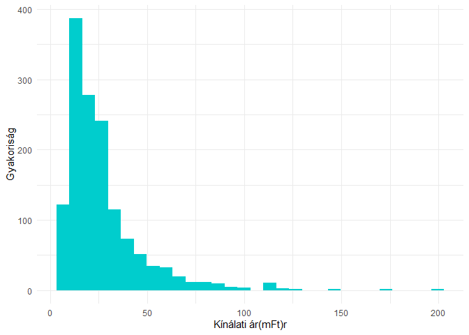
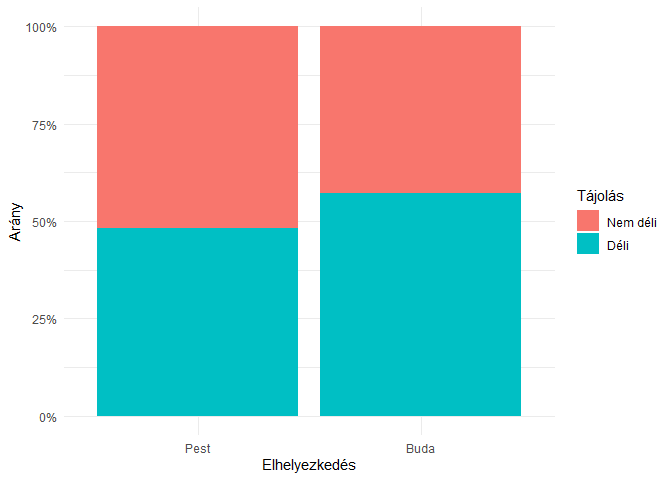
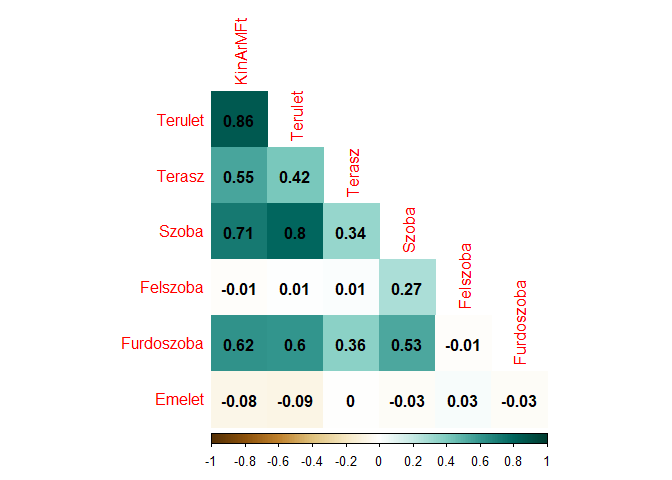
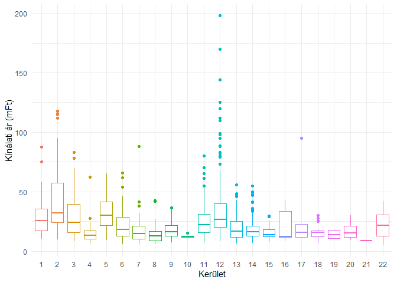
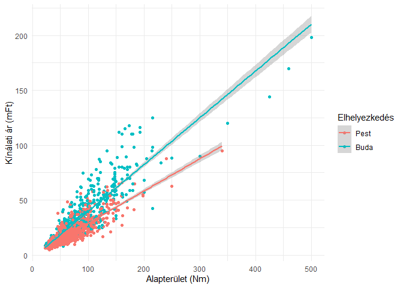
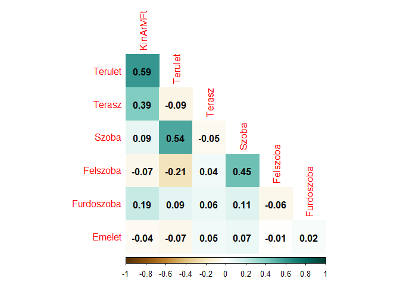
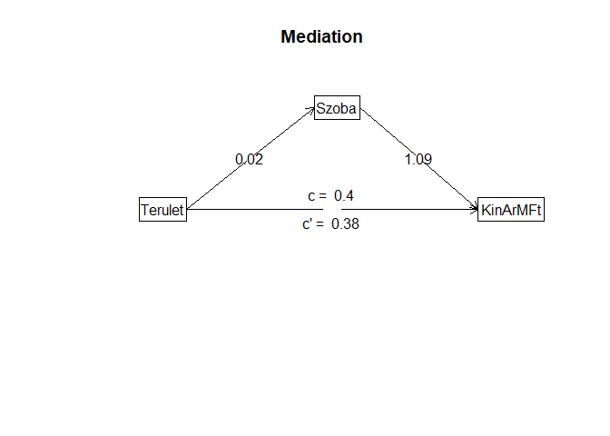
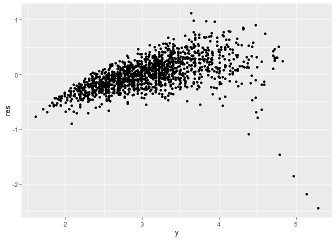

Budapesti lakásárak elemzése
================
Dittrich Levente
2023-06-09

- <a href="#kezdeti-beállítások" id="toc-kezdeti-beállítások">Kezdeti
  beállítások</a>
  - <a href="#használt-library-k" id="toc-használt-library-k">Használt
    library-k</a>
  - <a href="#adatok-beolvasása" id="toc-adatok-beolvasása">Adatok
    beolvasása</a>
  - <a href="#adatok-átalakítása" id="toc-adatok-átalakítása">Adatok
    átalakítása</a>
- <a href="#leíró-statisztika-adatvizualizációk"
  id="toc-leíró-statisztika-adatvizualizációk">Leíró statisztika,
  adatvizualizációk</a>
- <a href="#korreláció" id="toc-korreláció">Korreláció</a>
- <a href="#modellépítés" id="toc-modellépítés">Modellépítés</a>
  - <a href="#alapmodell" id="toc-alapmodell">Alapmodell</a>
  - <a href="#modellszelekció" id="toc-modellszelekció">Modellszelekció</a>
    - <a href="#multikollinearitás"
      id="toc-multikollinearitás">Multikollinearitás</a>
    - <a href="#mediációs-kitekintés" id="toc-mediációs-kitekintés">Mediációs
      kitekintés</a>
    - <a href="#változók-szelekciója" id="toc-változók-szelekciója">Változók
      szelekciója</a>
    - <a href="#heteroszkedaszticitás"
      id="toc-heteroszkedaszticitás">Heteroszkedaszticitás</a>
  - <a href="#végső-modell" id="toc-végső-modell">Végső modell</a>
- <a href="#kitekintés-végszó" id="toc-kitekintés-végszó">Kitekintés,
  végszó</a>

Ebben a portfolió fejezetben OLS regresszióval fogom megbecsülni a
budapesti lakások árát.

Az adatokat korábban szereztem az Ökonometria I. tárgyamon, eladó
budapesti lakások árát foglalja magában egyéb jellemzőiken kívül. A
mintavétel évét nem ismerem, azonban az átlagos négyzetméterár a
mintában 332 eFt, míg a [KSH
szerint](https://www.ksh.hu/stadat_files/lak/hu/lak0025.html) 2022-ben
az átlagos budapesti négyzetméterár előzetes adatok alapján 838 eFt.

# Kezdeti beállítások

## Használt library-k

``` r
library(tidyverse)
library(knitr)
library(psych)
library(corrplot)
library(ppcor)
library(car)
library(skedastic)
library(lmtest)
```

## Adatok beolvasása

Az adatok magyar .csv alapján a pontosvesszővel vannak elválasztva és a
tizedesjegyek sima vesszővel vannak jelölve. A beolvasott adatok első
hat megfigyelése a következőképpen néz ki:

``` r
df = read.csv("BP_Lakas.csv", sep = ";", dec = ",")
kable(head(df))
```

| KinArMFt | Terulet | Terasz | Szoba | Felszoba | Furdoszoba | Emelet | DeliTaj | Buda | Kerulet |
|---------:|--------:|-------:|------:|---------:|-----------:|-------:|--------:|-----:|--------:|
|     10.7 |      32 |      0 |     1 |        0 |          1 |      2 |       0 |    1 |       1 |
|     10.0 |      32 |      0 |     1 |        0 |          1 |      2 |       0 |    1 |       1 |
|     10.5 |      32 |      0 |     1 |        0 |          1 |      2 |       0 |    1 |       1 |
|     12.0 |      34 |      0 |     1 |        0 |          1 |      1 |       1 |    1 |       1 |
|     13.0 |      34 |      0 |     1 |        0 |          1 |      1 |       1 |    1 |       1 |
|     13.9 |      35 |      0 |     1 |        0 |          1 |      0 |       1 |    1 |       1 |

Látható, hogy 10 db változóm van, ezek a következők:

| Változó neve | Leírás                | Mértékegység  | Megjegyzés |
|:-------------|:----------------------|:--------------|:-----------|
| KinArMFt     | A lakás kínálati ára  | Millió Forint |            |
| Terulet      | A lakás alapterülete  | Négyzetméter  |            |
| Terasz       | A terasz alapterülete | Négyzetméter  |            |
| Szoba        | A szobák száma        | Darab         |            |
| Felszoba     | Félszobák száma       | Darab         |            |
| Furdoszoba   | Fürdőszobák száma     | Darab         |            |
| Emelet       | Hányadik emelet?      | Emelet        |            |
| Delitaj      | Déli tájolású-e?      | Logikai       | 1, ha igen |
| Buda         | Budai-e?              | Logikai       | 1, ha igen |
| Kerulet      | Kerület               | Kerület       | \[1;22\]   |

## Adatok átalakítása

Először is, átalakítom faktorrá(dummy változó) a *Delitaj*, *Buda* és
*Kerulet* változókat, mivel az első kettő logaikai, a harmadik pedig
kategorikus. A *Kerulet* változó annak ellenére kategorikus, hogy
számmal szerepel az adatbázisban, azonban szerepelhetnének római számmal
vagy névvel is. Abban az esetben pl. *21* helyett *Csepel* vagy *XXI*
szerepelne az adattáblában.

``` r
df[,c(8:10)] = lapply(df[,c(8:10)], factor)
```

# Leíró statisztika, adatvizualizációk

``` r
kable(describe(df[,-c(8:10)]))
```

|            | vars |    n |       mean |         sd | median |    trimmed |      mad | min | max | range |     skew |  kurtosis |        se |
|:-----------|-----:|-----:|-----------:|-----------:|-------:|-----------:|---------:|----:|----:|------:|---------:|----------:|----------:|
| KinArMFt   |    1 | 1406 | 26.4952347 | 19.6358286 |     21 | 22.9582593 | 12.00906 |   5 | 198 |   193 | 2.597186 | 10.580857 | 0.5236686 |
| Terulet    |    2 | 1406 | 76.9810242 | 42.1833066 |     68 | 71.2897780 | 29.65200 |  23 | 500 |   477 | 2.881761 | 17.851010 | 1.1249882 |
| Terasz     |    3 | 1406 |  5.3038407 | 12.1879247 |      0 |  2.5395204 |  0.00000 |   0 | 198 |   198 | 5.846486 | 58.182106 | 0.3250402 |
| Szoba      |    4 | 1406 |  2.5881935 |  1.2116176 |      2 |  2.4973357 |  1.48260 |   0 |  14 |    14 | 1.359284 |  6.584493 | 0.0323127 |
| Felszoba   |    5 | 1406 |  0.3947368 |  0.6233425 |      0 |  0.2886323 |  0.00000 |   0 |   5 |     5 | 1.662182 |  3.551691 | 0.0166239 |
| Furdoszoba |    6 | 1406 |  1.1237553 |  0.4205289 |      1 |  1.0328597 |  0.00000 |   0 |   5 |     5 | 2.535229 | 11.910064 | 0.0112151 |
| Emelet     |    7 | 1406 |  1.9103841 |  1.7282885 |      2 |  1.6989343 |  1.48260 |  -1 |  10 |    11 | 1.315364 |  2.673606 | 0.0460918 |

A leíró statisztikai mutatókat az egyes változók esetében nem
szándékozom külön külön értelmezni, azonban azt mindenképpen kiemelném,
hogy a lakásárak jobbra elnyúlóak és a normális eloszlásnál
csúcsosabbak, ezek az $\alpha_{3}$ és $\alpha_{4}$, valamint a medián és
átlag kapcsolatából látszanak. Emellett lakásárak eloszlását egy
hisztogrammon ábrázolva a következőtk kapjuk:

``` r
ggplot(df, aes(KinArMFt)) +
  geom_histogram(fill = "cyan3") +
  theme_minimal()+
  labs(x = "Kínálati ár(mFt)r", y = "Gyakoriság")
```

<!-- -->

A ábrán is látszik az erőteljes jobbra elnyúlás és a csúcsosság. Mivel
ez lesz az eredményváltozóm, érdemes lehet logaritmizálni, hogy normális
eloszlású legyen a válatozó.

``` r
ggplot(df, aes(log(KinArMFt)))+
  geom_histogram(fill = "cyan3")+
  theme_minimal()+
  labs(x = "Kínálati ár(mFt)", y = "Gyakoriság")
```

    ## `stat_bin()` using `bins = 30`. Pick better value with `binwidth`.

<!-- -->

A logaritmizált változó eloszlása már sokkal jobban hasonlít a normális
eloszláshoz.

A dummy változók vizualizására egy stacked barplotot alkalmaztam:

``` r
ggplot(df, aes(x = Buda, fill = DeliTaj))+
  geom_bar(position = "fill")+
  scale_y_continuous(labels = scales::percent)+
  scale_x_discrete(labels = c("0" = "Pest", "1" = "Buda"))+
  scale_fill_discrete(labels = c("0" = "Nem déli", "1" = "Déli"))+
  theme_minimal()+
  labs(x = "Elhelyezkedés", y = "Arány", fill = "Tájolás")
```

<!-- -->

Táblázatba rendezve:

``` r
dummy_table = table(df$DeliTaj,df$Buda)
rownames(dummy_table) = c("Nem déli", "Déli")
colnames(dummy_table) = c("Pest","Buda")
kable(addmargins(dummy_table))
```

|          | Pest | Buda |  Sum |
|:---------|-----:|-----:|-----:|
| Nem déli |  395 |  275 |  670 |
| Déli     |  369 |  367 |  736 |
| Sum      |  764 |  642 | 1406 |

Kevesebb budai eladó lakás van a mintában mint pesti, azonban köztük a
déli fekvésű ingatlanok aránya magasabb, mint a pesti ingatlanok
körében.

Az egyes eladó lakásokat kerületekre bontva szintén oszlopdiagrammon
ábrázoltam:

``` r
ggplot(df,aes(y = Kerulet, fill = Kerulet))+
  geom_bar(position = "dodge", stat = "count")+
  theme_minimal()+
  theme(legend.position = "none")+
  labs(x = "Ingatlanok száma", y = "Kerület")
```

<!-- -->

Kiemelkedő számban találhatóak 2., 12. és 13. kerületi eladó lakások,
illetve a 3., 6. és 14. kerületi lakások is szép számmal vannak.

Az egyes kerületek kínálait árainak dobozábrái a következőképpen néznek
ki:

``` r
ggplot(df, aes(y = KinArMFt, x = Kerulet, col = Kerulet))+
  geom_boxplot()+
  theme_minimal()+
  theme(legend.position = "none")+
  labs(y = "Kínálati ár (mFt)", x = "Kerület")
```

<!-- -->

Az egyes kerületek medián lakására láthatóan eltérő, sok outlier van 2.,
11., 12., 14. kerületekben a nagyon magas lakásár tartományban.

A kínálati ár és a terület pontdiagrammját ábrázolva az elhelyezkedés
szerint a következőt kapjuk:

``` r
ggplot(df, aes(Terulet,KinArMFt, col = Buda))+
  geom_point()+
  stat_smooth(method = lm)+
  theme_minimal()+
  labs(y = "Kínálati ár (mFt)", x = "Alapterület (Nm)", col = "Elhelyezkedés")+
  scale_color_discrete(labels = c("0" = "Pest", "1" = "Buda"))
```

<!-- -->

Látszik, hogy a budai lakások árai az alapterülethez képest meredekebben
emelkednek, mint a pestieké. Érdemes lehet esetleg interakciót
feltételezni az alapterület és az elhelyezkedés között a későbbi
modellben.

# Korreláció

Az adatok együttmozgásáról készítettem először korrelogrammot:

``` r
corrplot(cor(df[,1:7]), addCoef.col = "black", method = "color", col = COL2("BrBG"), diag = F, type = "lower")
```

<!-- -->

A kínálati árral erősen korrelál pozitív irányba a lakás alapterülete és
a szobák száma, illetve közepesen, szintén pozitív irányban a terasz
mérete és a fürdőszobák száma. Az emelet és a félszobák számának
korrelációja a kínálati árral szinte 0.  
Nem meglepő módon erősen korrelál a terület a szobák számával, pozitív
irányban.

A parciális korreláció ábrázolva:

``` r
corrplot(pcor(df[,1:7])$estimate, addCoef.col = "black", method = "color", col = COL2("BrBG"), diag = F, type = "lower")
```

<!-- -->

Az egyéb változók hatásától megtisztított korrelációkat ábrázolva
látszik, hogy a terület még így is pozitívan, közepesen korrelál a
kínálati árral és a szobák számával. A szobák száma szintén közepesen,
pozitívan korrelál a félszobák számával. Érdekes módon ebben az esetben
a parciális korreláció a terület és a félszoba között gyengén negatív.

# Modellépítés

Már az adatvizualizációknál szembe ötlött, hogy érdemes lenne
logaritmizálni az eredményváltozót, ezzel kezelve a jobbra elnyúlást.:  
Ha nem logaritmizálnám az eredményváltozót, akkor a becsült egyenlet a
következőképpen nézne ki:  
$\hat{Y} = \beta_{0} + \beta_{1}\times X_{1} + \beta_{2}\times X_{2} + \dots + \beta_{n}\times X_{n}$:  
Amennyiben azonban a logaritmizálom az eredményváltozót, úgy a becsült
egyenlet a következőképpen nézne ki:  
$log(\hat{Y})= \beta_{0} + \beta_{1}\times X_{1} + \beta_{2}\times X_{2} + \dots + \beta_{n}\times X_{n}$,
amiből ha kifejezzük $\hat{Y}$-t, akkor az kapjuk, hogy:  
$\hat{Y} = e^{\beta_{0} + \beta_{1}\times X_{1} + \beta_{2}\times X_{2} + \dots + \beta_{n}\times X_{n}}= e^{\beta_{0}} \times e^{\beta_{1}\times X_{1}} \times e^{\beta_{2}\times X_{2}} \times \dots \times e^{\beta_{n}\times X_{n}}$:  
Látható, hogy az egyes magyarázó változók hatásai marginális hatások
lesznek, azaz egy egységnyi $X_{n}$ változás hatására
$\beta_{n}$-szeresével változik $\hat{Y}$. Például ha $\beta_{n} = 0,1$,
akkor egységnyi $X_{n}$ növekedés hatására $\hat{Y}$ értéke 10%-kal nő.

## Alapmodell

Az alapmodellben minden változó szerepel, az eredményváltozó pedig
logaritmizálva van.

``` r
alapmodell = lm(log(KinArMFt) ~ Terulet + Terasz + Szoba + Felszoba + Furdoszoba + Emelet + DeliTaj + Buda + Kerulet,df)
summary(alapmodell)
```

    ## 
    ## Call:
    ## lm(formula = log(KinArMFt) ~ Terulet + Terasz + Szoba + Felszoba + 
    ##     Furdoszoba + Emelet + DeliTaj + Buda + Kerulet, data = df)
    ## 
    ## Residuals:
    ##      Min       1Q   Median       3Q      Max 
    ## -2.26934 -0.17954 -0.00606  0.17294  0.90029 
    ## 
    ## Coefficients: (1 not defined because of singularities)
    ##               Estimate Std. Error t value Pr(>|t|)    
    ## (Intercept)  1.9621604  0.0923880  21.238  < 2e-16 ***
    ## Terulet      0.0071705  0.0003457  20.740  < 2e-16 ***
    ## Terasz       0.0072086  0.0006968  10.345  < 2e-16 ***
    ## Szoba        0.1167159  0.0116078  10.055  < 2e-16 ***
    ## Felszoba     0.0005011  0.0137356   0.036 0.970901    
    ## Furdoszoba  -0.0317617  0.0225174  -1.411 0.158605    
    ## Emelet       0.0143593  0.0045026   3.189 0.001459 ** 
    ## DeliTaj1     0.0540916  0.0152216   3.554 0.000393 ***
    ## Buda1        0.3900818  0.0953391   4.092 4.53e-05 ***
    ## Kerulet2     0.0935029  0.0400189   2.336 0.019610 *  
    ## Kerulet3    -0.0739431  0.0436161  -1.695 0.090242 .  
    ## Kerulet4    -0.0705051  0.1027084  -0.686 0.492539    
    ## Kerulet5     0.5057620  0.0952182   5.312 1.27e-07 ***
    ## Kerulet6     0.1165212  0.0925376   1.259 0.208180    
    ## Kerulet7    -0.0622972  0.0966645  -0.644 0.519379    
    ## Kerulet8    -0.1838889  0.1018805  -1.805 0.071301 .  
    ## Kerulet9     0.0407383  0.0963088   0.423 0.672364    
    ## Kerulet10   -0.2161953  0.1525879  -1.417 0.156751    
    ## Kerulet11   -0.2034248  0.0461336  -4.409 1.12e-05 ***
    ## Kerulet12   -0.0782221  0.0403824  -1.937 0.052945 .  
    ## Kerulet13    0.1075107  0.0911766   1.179 0.238543    
    ## Kerulet14    0.0535830  0.0921621   0.581 0.561066    
    ## Kerulet15   -0.0337206  0.0985716  -0.342 0.732334    
    ## Kerulet16   -0.0388148  0.1319584  -0.294 0.768692    
    ## Kerulet17   -0.2188235  0.1521282  -1.438 0.150543    
    ## Kerulet18   -0.0483528  0.1014221  -0.477 0.633617    
    ## Kerulet19   -0.0690719  0.1523465  -0.453 0.650342    
    ## Kerulet20   -0.0972550  0.1642217  -0.592 0.553802    
    ## Kerulet21   -0.2051189  0.2152071  -0.953 0.340695    
    ## Kerulet22           NA         NA      NA       NA    
    ## ---
    ## Signif. codes:  0 '***' 0.001 '**' 0.01 '*' 0.05 '.' 0.1 ' ' 1
    ## 
    ## Residual standard error: 0.2762 on 1377 degrees of freedom
    ## Multiple R-squared:  0.7957, Adjusted R-squared:  0.7916 
    ## F-statistic: 191.6 on 28 and 1377 DF,  p-value: < 2.2e-16

A koefficienseket ebben az esetben még nem értelmezem, azonban az
R<sup>2</sup> szerint a modell magyarázó ereje 79,75% és korrigált
R<sup>2</sup> biztatóan magas. Látszik azonban, hogy nem minden
együttható bétája szignifikáns, ezeket az együtthatókat a következőkben
fogom megvizsgálni és egy esetében pedig NA-t ír az R. Ez azért lehet,
mert valószínüleg nem ad hozzá a modellhez semmi magyarázóerőt a 22.
kerület dummy.

A kerületeknél a dummy kódolás miatt az első kerületet vette alapul és a
béták értelmezésénél ahhoz vannak hasonlítva a kerületek. Látható, hogy
sok kerület nem tér el szignifikánsan az első kerülettől és mivel ez
21(=22-1) új változó bevonását jelenti, ezért az információs kritériumok
alapján fogom eldönteni, hogy jobb-e ha kiveszem őket belőle.

## Modellszelekció

### Multikollinearitás

Mindenek előtt megvizsgálom, hogy van-e multikollinearitás a modellben.
A VIF mutató azt mutatja meg, hogy hányszorosára nőtt a standard
hibájának négyzete az egyes változók esetében.

``` r
vif(alapmodell)
```

    ## Error in vif.default(alapmodell): there are aliased coefficients in the model

Nem fut le a VIF függvény, mégpedig azért, mert egzakt
multikollineraitás van a modellben. Ez megmagyarázza a 22. kerület NA
értékét is. Kénytelen vagyok a továbbiakban elhagyni a kerületeket a
modellből. A kerületek nélküli VIF mutatók a következők:

``` r
vif(lm(log(KinArMFt) ~ Terulet + Terasz + Szoba + Felszoba + Furdoszoba + Emelet + DeliTaj + Buda,df))
```

    ##    Terulet     Terasz      Szoba   Felszoba Furdoszoba     Emelet    DeliTaj 
    ##   3.682941   1.261302   3.552680   1.270590   1.633121   1.037153   1.038851 
    ##       Buda 
    ##   1.113975

Így már lefut a VIF, azonban van a terület és a szobák számánál így is
zavaró multikollinearitás van. Mivel nem káros még a multikollinearitás
ezért nem feltétlenül szükséges kezelni, azonban könnyen feltűnhet, hogy
az alapterülettel lehetne magyarázni a szobák számát.

### Mediációs kitekintés

Ekkor az alapterületnek van direkt, indirekt és teljes hatása. Legyen a
kínálati ár = $\hat{Y}$, az alapterület = $X_{t}$, a szobák száma =
$X_{sz}$. A direkt hatás egyszerűen $\beta_{t}$ az
$\hat{Y} = \beta_{0} + \beta_{t} \times X_{t} + \beta_{sz} \times X_{sz}$.
Az indirekt hatás az a $\beta_{t->sz}$, ami az
$X_{sz} \sim \beta_{0} + \beta_{t->sz} \times X_{t}$ egyenletből jön. A
teljes hatás pedig ezeknek az összege.

``` r
summary(mediate(KinArMFt ~ Terulet + (Szoba), data = df))
```

<!-- -->

    ## Call: mediate(y = KinArMFt ~ Terulet + (Szoba), data = df)
    ## 
    ## Direct effect estimates (traditional regression)    (c') X + M on Y 
    ##           KinArMFt   se     t   df      Prob
    ## Intercept    -5.21 0.63 -8.25 1403  3.63e-16
    ## Terulet       0.38 0.01 35.63 1403 1.42e-198
    ## Szoba         1.09 0.37  2.99 1403  2.88e-03
    ## 
    ## R = 0.86 R2 = 0.74   F = 2004.81 on 2 and 1403 DF   p-value:  0 
    ## 
    ##  Total effect estimates (c) (X on Y) 
    ##           KinArMFt   se     t   df     Prob
    ## Intercept    -4.31 0.56 -7.74 1404 1.85e-14
    ## Terulet       0.40 0.01 63.07 1404 0.00e+00
    ## 
    ##  'a'  effect estimates (X on M) 
    ##           Szoba   se     t   df      Prob
    ## Intercept  0.82 0.04 20.30 1404  1.47e-80
    ## Terulet    0.02 0.00 49.82 1404 1.07e-312
    ## 
    ##  'b'  effect estimates (M on Y controlling for X) 
    ##       KinArMFt   se    t   df    Prob
    ## Szoba     1.09 0.37 2.99 1403 0.00288
    ## 
    ##  'ab'  effect estimates (through all  mediators)
    ##         KinArMFt boot   sd lower upper
    ## Terulet     0.03 0.02 0.01     0  0.05

Az alapterület közvetlen hatása *0,38*, a szobáé *1,09* volt az árra. Az
alapterület hatása a szobára azonban *0,02* volt, amit ha mgszorzunk a
szobák számának hatásával, akkor megkapjuk a terület közvetett hatását,
ami \~ *0,02*. A teljes hatása az alapterületnek a közvetlen és a
közvetett hatások összege, vagyis *0,4*.

### Változók szelekciója

Visszatérve a modellszelekcióhoz, a félszobák és a fürdőszobák száma
szintén nem szignifikáns. Ezeken a változókon két Wald-tesztet fogok
elvégezni. A Wald-teszt egy olyan speciális F-próba, amivel meg tudjuk
nézni, hogy az elhagyott változók bétája a mintán kívül nulla. A teszt
hipotézisei a következők:

- H0: Az elhagyott változónak nincsen magyarázó ereje, a mintán kívül
  nulla az együtthatója
- H1: Az elhagyott változónak van magyarázó ereje, a mintán kívül nem
  nulla az együtthatója

Először a fürdőszobát hagytam el:

``` r
szukitett_modell1 = lm(log(KinArMFt) ~ Terulet + Terasz + Szoba + Felszoba + Furdoszoba + Emelet + DeliTaj + Buda, df)
szukitett_modell2 = lm(log(KinArMFt) ~ Terulet + Terasz + Szoba + Felszoba + Emelet + DeliTaj + Buda, df)
anova(szukitett_modell1, szukitett_modell2)
```

    ## Analysis of Variance Table
    ## 
    ## Model 1: log(KinArMFt) ~ Terulet + Terasz + Szoba + Felszoba + Furdoszoba + 
    ##     Emelet + DeliTaj + Buda
    ## Model 2: log(KinArMFt) ~ Terulet + Terasz + Szoba + Felszoba + Emelet + 
    ##     DeliTaj + Buda
    ##   Res.Df    RSS Df Sum of Sq      F Pr(>F)
    ## 1   1397 129.39                           
    ## 2   1398 129.51 -1   -0.1212 1.3086 0.2528

H0-t minden szokványos szignifikancia szint mellett sem lehet
elutasítani, tehát H0-t elfogadom. A fürdőszobának nincsen magyarázó
ereje, együtthatója a mintán kívül nulla.

A félszobát elhagyva:

``` r
szukitett_modell3 = lm(log(KinArMFt) ~ Terulet + Terasz + Szoba + Furdoszoba + Emelet + DeliTaj + Buda, df)
anova(szukitett_modell1, szukitett_modell3)
```

    ## Analysis of Variance Table
    ## 
    ## Model 1: log(KinArMFt) ~ Terulet + Terasz + Szoba + Felszoba + Furdoszoba + 
    ##     Emelet + DeliTaj + Buda
    ## Model 2: log(KinArMFt) ~ Terulet + Terasz + Szoba + Furdoszoba + Emelet + 
    ##     DeliTaj + Buda
    ##   Res.Df    RSS Df Sum of Sq      F Pr(>F)
    ## 1   1397 129.39                           
    ## 2   1398 129.39 -1 -0.002605 0.0281 0.8668

H0-t minden szokványos szignifikancia szint mellett sem lehet
elutasítani, tehát H0-t elfogadom. A fürdőszobának nincsen magyarázó
ereje, együtthatója a mintán kívül nulla.

A két változót elhagyhatom a modellből, így a következő modellt kapom:

``` r
szukitett_modell4 = lm(log(KinArMFt) ~ Terulet + Terasz + Szoba + Emelet + DeliTaj + Buda, df)
summary(szukitett_modell4)
```

    ## 
    ## Call:
    ## lm(formula = log(KinArMFt) ~ Terulet + Terasz + Szoba + Emelet + 
    ##     DeliTaj + Buda, data = df)
    ## 
    ## Residuals:
    ##      Min       1Q   Median       3Q      Max 
    ## -2.43393 -0.19249 -0.01349  0.18793  1.11647 
    ## 
    ## Coefficients:
    ##              Estimate Std. Error t value Pr(>|t|)    
    ## (Intercept) 1.9911968  0.0233815  85.161  < 2e-16 ***
    ## Terulet     0.0077428  0.0003347  23.135  < 2e-16 ***
    ## Terasz      0.0059721  0.0007395   8.076 1.44e-15 ***
    ## Szoba       0.1029205  0.0111958   9.193  < 2e-16 ***
    ## Emelet      0.0191358  0.0047807   4.003 6.59e-05 ***
    ## DeliTaj1    0.0567976  0.0165539   3.431 0.000619 ***
    ## Buda1       0.2792914  0.0170371  16.393  < 2e-16 ***
    ## ---
    ## Signif. codes:  0 '***' 0.001 '**' 0.01 '*' 0.05 '.' 0.1 ' ' 1
    ## 
    ## Residual standard error: 0.3043 on 1399 degrees of freedom
    ## Multiple R-squared:  0.7481, Adjusted R-squared:  0.747 
    ## F-statistic: 692.4 on 6 and 1399 DF,  p-value: < 2.2e-16

Minden változó szignifikáns, azonban a kiigazított R<sup>2</sup>
csökkent. Lehet érdemes lenne megpróbálni a kerületeket nagyobb
csoportokba sorolni és úgy visszatenni a modellbe, ám ehhez nincsen elég
mély budapesti ingatlan-ismeretem.

### Heteroszkedaszticitás

A standard modellfeltételek közé tartozik a homoszkedaszticitás.
Ilyenkor a hibatagok négyzeteinek szórása homogén. Ennek ellenőrzésér
White tesztet fogok végezni a fentebb létrehozott modellen. A White
teszt hipotézisei a következők:

- H0: a modell homoszkedaszticikus, a hibatagok négyzetét nem magyarázza
  semmi jól
- H1: a modell heteroszkedaszticikus, a hibatagok négyzetét jól
  magyarázzák a magyarázó változók és/vagy azok négyzetei

``` r
white(szukitett_modell4, interactions = T)
```

    ## # A tibble: 1 × 5
    ##   statistic   p.value parameter method       alternative
    ##       <dbl>     <dbl>     <dbl> <chr>        <chr>      
    ## 1     1012. 8.50e-196        27 White's Test greater

H0-t 1%-os szignifikanciaszinten is elutasíthatjuk, van
heteroszkedaszticitás. A hibatagok négyzetét ábrázolva az
eredményváltozó függvényében a következőt látjuk:

``` r
plotdf = data.frame(
  y = szukitett_modell4$model$`log(KinArMFt)`,
  res = szukitett_modell4$residuals^2
)

ggplot(plotdf,aes(y,res))+
  geom_point()+
  theme_minimal()+
  labs(y = "Hibatagok négyzete", x = "Log(lakásár)")
```

<!-- -->

Látszik, hogy a nagyon alacsony és nagyon magas értékek eltérnek a
többitől, a hibatagok szórása nem homogén. Ebből az következik, hogy
torzultak és inkonzisztensek lesznek a becsült standard hibák. Ebből az
is következik, hogy a próbafüggvényeknek nem lesz t- vagy F-eloszlása,
vagyis a parciális tesztek és a paraméterekre adott
konfidencia-intervallumok érvényüket vesztik.

A heteroszkedaszticitás kezelésére elegendő lehet a White-féle HCCME
módon korrigált standard hibákkal megnézni a koefficienseket:

``` r
coeftest(szukitett_modell4, vcov. = hccm(szukitett_modell4))
```

    ## 
    ## t test of coefficients:
    ## 
    ##              Estimate Std. Error t value  Pr(>|t|)    
    ## (Intercept) 1.9911968  0.0451850 44.0677 < 2.2e-16 ***
    ## Terulet     0.0077428  0.0009640  8.0320 2.018e-15 ***
    ## Terasz      0.0059721  0.0019968  2.9909 0.0028304 ** 
    ## Szoba       0.1029205  0.0216550  4.7527 2.214e-06 ***
    ## Emelet      0.0191358  0.0050929  3.7573 0.0001788 ***
    ## DeliTaj1    0.0567976  0.0159725  3.5560 0.0003891 ***
    ## Buda1       0.2792914  0.0174005 16.0507 < 2.2e-16 ***
    ## ---
    ## Signif. codes:  0 '***' 0.001 '**' 0.01 '*' 0.05 '.' 0.1 ' ' 1

A Terasz nevű változó a korrigált módon 0,1% helyett ‘csak’ 1%-on
szignifikáns, a többi változó válotzatlanul 0,1% alatt is. Mivel eddig
torzított volt a becslésem, ezért megnézem megint, hogy szignifikánsak-e
így a fürdőszoba és a félszoba változók.

``` r
coeftest(szukitett_modell1, vcov. = hccm(szukitett_modell1))
```

    ## 
    ## t test of coefficients:
    ## 
    ##                Estimate  Std. Error t value  Pr(>|t|)    
    ## (Intercept)  2.00921241  0.05888861 34.1189 < 2.2e-16 ***
    ## Terulet      0.00784336  0.00095109  8.2467 3.717e-16 ***
    ## Terasz       0.00610030  0.00203718  2.9945 0.0027975 ** 
    ## Szoba        0.10524038  0.02631020  4.0000 6.666e-05 ***
    ## Felszoba    -0.00246229  0.01765092 -0.1395 0.8890760    
    ## Furdoszoba  -0.02822510  0.03834487 -0.7361 0.4618023    
    ## Emelet       0.01923705  0.00511335  3.7621 0.0001754 ***
    ## DeliTaj1     0.05668467  0.01600589  3.5415 0.0004110 ***
    ## Buda1        0.27954814  0.01769619 15.7971 < 2.2e-16 ***
    ## ---
    ## Signif. codes:  0 '***' 0.001 '**' 0.01 '*' 0.05 '.' 0.1 ' ' 1

## Végső modell

A korrigált koefficiensek sem szignifikánsak, így az anélkülieket
tekintem a végső modellemnek. A végső modell korrigált együtthatói a
következők:

``` r
coeftest(szukitett_modell4, vcov. = hccm(szukitett_modell4))
```

    ## 
    ## t test of coefficients:
    ## 
    ##              Estimate Std. Error t value  Pr(>|t|)    
    ## (Intercept) 1.9911968  0.0451850 44.0677 < 2.2e-16 ***
    ## Terulet     0.0077428  0.0009640  8.0320 2.018e-15 ***
    ## Terasz      0.0059721  0.0019968  2.9909 0.0028304 ** 
    ## Szoba       0.1029205  0.0216550  4.7527 2.214e-06 ***
    ## Emelet      0.0191358  0.0050929  3.7573 0.0001788 ***
    ## DeliTaj1    0.0567976  0.0159725  3.5560 0.0003891 ***
    ## Buda1       0.2792914  0.0174005 16.0507 < 2.2e-16 ***
    ## ---
    ## Signif. codes:  0 '***' 0.001 '**' 0.01 '*' 0.05 '.' 0.1 ' ' 1

A koefficiensek értelmezése a következő:

- $\beta_{0}$: Ez a függvény tengelymetszete, amennyiben minden
  magyarázó változó értéke nulla, akkor $e^{1.991} \sim 7,32$ millió
  Forint lesz egy lakás ára
- $\beta_{1}$: ceteris paribus egy négyzetméternyi alapterület növekedés
  0,774%-kal növeli az árat
- $\beta_{2}$: c.p. egy négyzetméternyi terasz terület növekedés
  0,597%-kal növeli az árat
- $\beta_{3}$: c.p. ha egy szobával több van a lakásban, akkor az
  10%-kal növeli az árat
- $\beta_{4}$: c.p. ha a lakás egy emelettel magasabban van a lakás,
  akkor az ár 1,914%-kal nő az ár
- $\beta_{5}$: c.p. amennyiben déli tájolású egy lakás, akkor az az árat
  5,68%-kal nő az ár, ahhoz képest, mintha nem déli tájolású lenne.
- $\beta_{6}$: c.p. ha egy lakás Budán helyezkedik el, akkor 27,93%-kal
  magasabb lesz a lakás ára, mintha Pesten lenne

# Kitekintés, végszó

Egy olyan modell jött ki végül, aminek minden együtthatója legalább
1%-on szignifikáns, azonban bizonyosan vannak kihagyott változók. A
multikollinearitás miatt eltávolított kerületek sokat számíthatanak egy
lakás áránál. Az adattáblában a lakások állapota sem volt feltüntetve,
ami szintén fontos szempont lehet. Több szempontból lehetne bővíteni a
modellt a továbbiakban, valamint az esetleg figyelembe venni több évet
is panel modellel.
