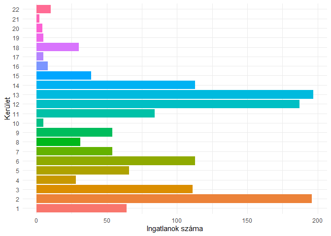

Budapesti lakásárak elemzése
================
Dittrich Levente
2023-06-07

- <a href="#kezdeti-beállítások" id="toc-kezdeti-beállítások">Kezdeti
  beállítások</a>
  - <a href="#használt-library-k" id="toc-használt-library-k">Használt
    library-k</a>
  - <a href="#adatok-beolvasása" id="toc-adatok-beolvasása">Adatok
    beolvasása</a>
  - <a href="#adatok-átalakítása" id="toc-adatok-átalakítása">Adatok
    átalakítása</a>
- <a href="#leíró-statisztika-adatvizualizációk"
  id="toc-leíró-statisztika-adatvizualizációk">Leíró statisztika,
  adatvizualizációk</a>
- <a href="#korreláció" id="toc-korreláció">Korreláció</a>
- <a href="#modellépítés" id="toc-modellépítés">Modellépítés</a>
  - <a href="#alapmodell" id="toc-alapmodell">Alapmodell</a>
  - <a href="#modellszelekció" id="toc-modellszelekció">Modellszelekció</a>

Ebben a portfolió fejezetben OLS regresszióval fogom megbecsülni a
budapesti lakások árát.

Az adatokat korábban szereztem az Ökonometria I. tárgyamon, eladó
budapesti lakások árát foglalja magában egyéb jellemzőiken kívül. A
mintavétel évét nem ismerem, azonban az átlagos négyzetméterár a
mintában 332 eFt, míg a [KSH
szerint](https://www.ksh.hu/stadat_files/lak/hu/lak0025.html) 2022-ben
az átlagos budapesti négyzetméterár előzetes adatok alapján 838 eFt.

# Kezdeti beállítások

## Használt library-k

``` r
library(tidyverse)
library(psych)
library(corrplot)
library(lmtest)
library(knitr)
```

## Adatok beolvasása

Az adatok magyar .csv alapján a pontosvesszővel vannak elválasztva és a
tizedesjegyek sima vesszővel vannak jelölve. A beolvasott adatok első
hat megfigyelése a következőképpen néz ki:

``` r
df = read.csv("BP_Lakas.csv", sep = ";", dec = ",")
kable(head(df))
```

| KinArMFt | Terulet | Terasz | Szoba | Felszoba | Furdoszoba | Emelet | DeliTaj | Buda | Kerulet |
|---------:|--------:|-------:|------:|---------:|-----------:|-------:|--------:|-----:|--------:|
|     10.7 |      32 |      0 |     1 |        0 |          1 |      2 |       0 |    1 |       1 |
|     10.0 |      32 |      0 |     1 |        0 |          1 |      2 |       0 |    1 |       1 |
|     10.5 |      32 |      0 |     1 |        0 |          1 |      2 |       0 |    1 |       1 |
|     12.0 |      34 |      0 |     1 |        0 |          1 |      1 |       1 |    1 |       1 |
|     13.0 |      34 |      0 |     1 |        0 |          1 |      1 |       1 |    1 |       1 |
|     13.9 |      35 |      0 |     1 |        0 |          1 |      0 |       1 |    1 |       1 |

Látható, hogy 10 db változóm van, ezek a következők:

| Változó neve | Leírás                | Mértékegység  | Megjegyzés |
|:-------------|:----------------------|:--------------|:-----------|
| KinArMFt     | A lakás kínálati ára  | Millió Forint |            |
| Terulet      | A lakás alapterülete  | Négyzetméter  |            |
| Terasz       | A terasz alapterülete | Négyzetméter  |            |
| Szoba        | A szobák száma        | Darab         |            |
| Felszoba     | Félszobák száma       | Darab         |            |
| Furdoszoba   | Fürdőszobák száma     | Darab         |            |
| Emelet       | Hányadik emelet?      | Emelet        |            |
| Delitaj      | Déli tájolású-e?      | Logikai       | 1, ha igen |
| Buda         | Budai-e?              | Logikai       | 1, ha igen |
| Kerulet      | Kerület               | Kerület       | \[1;22\]   |

## Adatok átalakítása

Először is, átalakítom faktorrá(dummy változó) a *Delitaj*, *Buda* és
*Kerulet* változókat, mivel az első kettő logaikai, a harmadik pedig
kategorikus. A *Kerulet* változó annak ellenére kategorikus, hogy
számmal szerepel az adatbázisban, azonban pl. XXI. Kerület szerepelhetne
Csepelként is.

``` r
df[,c(8:10)] = lapply(df[,c(8:10)], factor)
```

# Leíró statisztika, adatvizualizációk

``` r
kable(describe(df[,-c(8:10)]))
```

|            | vars |    n |       mean |         sd | median |    trimmed |      mad | min | max | range |     skew |  kurtosis |        se |
|:-----------|-----:|-----:|-----------:|-----------:|-------:|-----------:|---------:|----:|----:|------:|---------:|----------:|----------:|
| KinArMFt   |    1 | 1406 | 26.4952347 | 19.6358286 |     21 | 22.9582593 | 12.00906 |   5 | 198 |   193 | 2.597186 | 10.580857 | 0.5236686 |
| Terulet    |    2 | 1406 | 76.9810242 | 42.1833066 |     68 | 71.2897780 | 29.65200 |  23 | 500 |   477 | 2.881761 | 17.851010 | 1.1249882 |
| Terasz     |    3 | 1406 |  5.3038407 | 12.1879247 |      0 |  2.5395204 |  0.00000 |   0 | 198 |   198 | 5.846486 | 58.182106 | 0.3250402 |
| Szoba      |    4 | 1406 |  2.5881935 |  1.2116176 |      2 |  2.4973357 |  1.48260 |   0 |  14 |    14 | 1.359284 |  6.584493 | 0.0323127 |
| Felszoba   |    5 | 1406 |  0.3947368 |  0.6233425 |      0 |  0.2886323 |  0.00000 |   0 |   5 |     5 | 1.662182 |  3.551691 | 0.0166239 |
| Furdoszoba |    6 | 1406 |  1.1237553 |  0.4205289 |      1 |  1.0328597 |  0.00000 |   0 |   5 |     5 | 2.535229 | 11.910064 | 0.0112151 |
| Emelet     |    7 | 1406 |  1.9103841 |  1.7282885 |      2 |  1.6989343 |  1.48260 |  -1 |  10 |    11 | 1.315364 |  2.673606 | 0.0460918 |

A leíró statisztikai mutatókat az egyes változók esetében nem
szándékozom külön külön értelmezni, azonban azt mindenképpen kiemelném,
hogy a lakásárak jobbra elnyúlóak és a normális eloszlásnál
csúcsosabbak, ezek az $\alpha_{3}$ és $\alpha_{4}$, valamint a medián és
átlag kapcsolatából látszanak. Emellett lakásárak eloszlását egy
hisztogrammon ábrázolva a következőtk kapjuk:

``` r
ggplot(df, aes(KinArMFt))+
  geom_histogram(fill = "cyan3")+
  theme_minimal()+
  labs(x = "Kínálati ár(mFt)", y = "Gyakoriság")
```

<!-- -->

A ábrán is látszik az erőteljes jobbra elnyúlás és a csúcsosság.

A dummy változók vizualizására egy stacked barplotot alkalmaztam.

``` r
ggplot(df, aes(x = Buda, fill = DeliTaj))+
  geom_bar(position = "fill")+
  scale_y_continuous(labels = scales::percent)+
  scale_x_discrete(labels = c("0" = "Pest", "1" = "Buda"))+
  scale_fill_discrete(labels = c("0" = "Nem déli", "1" = "Déli"))+
  theme_minimal()+
  labs(x = "Elhelyezkedés", y = "Lakások száma", fill = "Tájolás")
```

<!-- -->

Táblázatba rendezve:

``` r
dummy_table = table(df$DeliTaj,df$Buda)
rownames(dummy_table) = c("Nem déli", "Déli")
colnames(dummy_table) = c("Pest","Buda")
kable(addmargins(dummy_table))
```

|          | Pest | Buda |  Sum |
|:---------|-----:|-----:|-----:|
| Nem déli |  395 |  275 |  670 |
| Déli     |  369 |  367 |  736 |
| Sum      |  764 |  642 | 1406 |

Kevesebb Budai eladó lakás van a mintában mint pesti, azonban köztük a
déli fekvésű ingatlanok aránya magasabb, mint a pesti ingatlanok
körében.

Az egyes eladó lakásokat kerületekre bontva szintén oszlopdiagrammon
ábrázoltam:

``` r
ggplot(df,aes(y = Kerulet, fill = Kerulet))+
  geom_bar(position = "dodge", stat = "count")+
  theme_minimal()+
  theme(legend.position = "none")+
  labs(x = "Ingatlanok száma", y = "Kerület")
```

<!-- --> Kiemelkedő
számban találhatóak 2., 12. és 13. kerületi eladó lakások, illetve a 3.,
6. és 14. kerületi lakások is szép számmal vannak.

# Korreláció

``` r
corrplot(cor(df[,1:7]), addCoef.col = "black", method = "color", col = COL2("BrBG"), diag = F, type = "lower")
```

<!-- -->

# Modellépítés

## Alapmodell

``` r
alapmodell = lm(KinArMFt ~ .,df)
summary(alapmodell)
```

    ## 
    ## Call:
    ## lm(formula = KinArMFt ~ ., data = df)
    ## 
    ## Residuals:
    ##     Min      1Q  Median      3Q     Max 
    ## -43.163  -3.835  -0.392   2.983  46.719 
    ## 
    ## Coefficients: (1 not defined because of singularities)
    ##               Estimate Std. Error t value Pr(>|t|)    
    ## (Intercept) -10.506086   2.621016  -4.008 6.44e-05 ***
    ## Terulet       0.281871   0.009808  28.738  < 2e-16 ***
    ## Terasz        0.335092   0.019769  16.950  < 2e-16 ***
    ## Szoba         0.935356   0.329309   2.840  0.00457 ** 
    ## Felszoba     -0.328405   0.389674  -0.843  0.39950    
    ## Furdoszoba    4.902468   0.638810   7.674 3.13e-14 ***
    ## Emelet       -0.078995   0.127736  -0.618  0.53640    
    ## DeliTaj1      1.255781   0.431831   2.908  0.00370 ** 
    ## Buda1         8.267640   2.704737   3.057  0.00228 ** 
    ## Kerulet2      4.538199   1.135324   3.997 6.75e-05 ***
    ## Kerulet3     -1.347837   1.237375  -1.089  0.27622    
    ## Kerulet4     -0.114208   2.913803  -0.039  0.96874    
    ## Kerulet5     11.458411   2.701307   4.242 2.37e-05 ***
    ## Kerulet6      2.356192   2.625260   0.898  0.36960    
    ## Kerulet7     -0.123170   2.742339  -0.045  0.96418    
    ## Kerulet8     -1.872243   2.890315  -0.648  0.51725    
    ## Kerulet9      1.472501   2.732250   0.539  0.59002    
    ## Kerulet10    -3.575215   4.328868  -0.826  0.40900    
    ## Kerulet11    -5.334889   1.308796  -4.076 4.84e-05 ***
    ## Kerulet12    -0.383267   1.145634  -0.335  0.73802    
    ## Kerulet13     3.382300   2.586650   1.308  0.19123    
    ## Kerulet14     1.623550   2.614607   0.621  0.53473    
    ## Kerulet15    -0.099624   2.796445  -0.036  0.97159    
    ## Kerulet16    -2.562947   3.743615  -0.685  0.49370    
    ## Kerulet17    -4.411935   4.315825  -1.022  0.30683    
    ## Kerulet18    -0.407510   2.877311  -0.142  0.88739    
    ## Kerulet19    -0.254555   4.322020  -0.059  0.95304    
    ## Kerulet20    -0.471522   4.658917  -0.101  0.91940    
    ## Kerulet21     2.522779   6.105355   0.413  0.67952    
    ## Kerulet22           NA         NA      NA       NA    
    ## ---
    ## Signif. codes:  0 '***' 0.001 '**' 0.01 '*' 0.05 '.' 0.1 ' ' 1
    ## 
    ## Residual standard error: 7.835 on 1377 degrees of freedom
    ## Multiple R-squared:  0.844,  Adjusted R-squared:  0.8408 
    ## F-statistic:   266 on 28 and 1377 DF,  p-value: < 2.2e-16

## Modellszelekció

``` r
szukitett_modell1 = lm(KinArMFt ~ Terulet + Terasz + Szoba + Felszoba + Furdoszoba + Emelet + DeliTaj + Buda,df)

AIC(alapmodell, szukitett_modell1)
```

    ##                   df      AIC
    ## alapmodell        30 9809.387
    ## szukitett_modell1 10 9988.164

``` r
BIC(alapmodell, szukitett_modell1)
```

    ##                   df       BIC
    ## alapmodell        30  9966.842
    ## szukitett_modell1 10 10040.649

``` r
szukitett_modell2 = lm(KinArMFt ~ Terulet + Terasz + Szoba + Felszoba + Furdoszoba + DeliTaj + Buda,df)

waldtest(szukitett_modell1,szukitett_modell2)
```

    ## Wald test
    ## 
    ## Model 1: KinArMFt ~ Terulet + Terasz + Szoba + Felszoba + Furdoszoba + 
    ##     Emelet + DeliTaj + Buda
    ## Model 2: KinArMFt ~ Terulet + Terasz + Szoba + Felszoba + Furdoszoba + 
    ##     DeliTaj + Buda
    ##   Res.Df Df      F Pr(>F)
    ## 1   1397                 
    ## 2   1398 -1 0.1697 0.6804

``` r
szukitett_modell3 = lm(KinArMFt ~ Terulet + Terasz + Szoba + Furdoszoba + Emelet + DeliTaj + Buda,df)

waldtest(szukitett_modell1,szukitett_modell3)
```

    ## Wald test
    ## 
    ## Model 1: KinArMFt ~ Terulet + Terasz + Szoba + Felszoba + Furdoszoba + 
    ##     Emelet + DeliTaj + Buda
    ## Model 2: KinArMFt ~ Terulet + Terasz + Szoba + Furdoszoba + Emelet + DeliTaj + 
    ##     Buda
    ##   Res.Df Df      F Pr(>F)
    ## 1   1397                 
    ## 2   1398 -1 0.9014 0.3426
