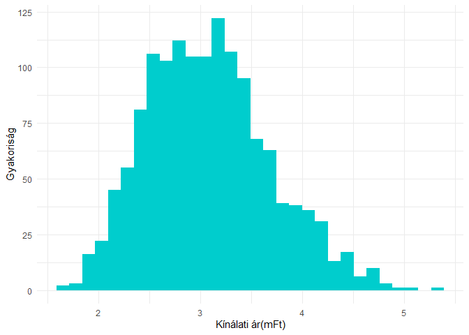

Budapesti lakásárak elemzése
================
Dittrich Levente
2023-06-07

- <a href="#kezdeti-beállítások" id="toc-kezdeti-beállítások">Kezdeti
  beállítások</a>
  - <a href="#használt-library-k" id="toc-használt-library-k">Használt
    library-k</a>
  - <a href="#adatok-beolvasása" id="toc-adatok-beolvasása">Adatok
    beolvasása</a>
  - <a href="#adatok-átalakítása" id="toc-adatok-átalakítása">Adatok
    átalakítása</a>
- <a href="#leíró-statisztika-adatvizualizációk"
  id="toc-leíró-statisztika-adatvizualizációk">Leíró statisztika,
  adatvizualizációk</a>
  - <a href="#korreláció" id="toc-korreláció">Korreláció</a>
- <a href="#modellépítés" id="toc-modellépítés">Modellépítés</a>

# Kezdeti beállítások

## Használt library-k

``` r
library(tidyverse)
library(psych)
library(corrplot)
library(lmtest)
library(knitr)
```

## Adatok beolvasása

``` r
df = read.csv("BP_Lakas.csv", sep = ";", dec = ",")
kable(head(df))
```

| KinArMFt | Terulet | Terasz | Szoba | Felszoba | Furdoszoba | Emelet | DeliTaj | Buda | Kerulet |
|---------:|--------:|-------:|------:|---------:|-----------:|-------:|--------:|-----:|--------:|
|     10.7 |      32 |      0 |     1 |        0 |          1 |      2 |       0 |    1 |       1 |
|     10.0 |      32 |      0 |     1 |        0 |          1 |      2 |       0 |    1 |       1 |
|     10.5 |      32 |      0 |     1 |        0 |          1 |      2 |       0 |    1 |       1 |
|     12.0 |      34 |      0 |     1 |        0 |          1 |      1 |       1 |    1 |       1 |
|     13.0 |      34 |      0 |     1 |        0 |          1 |      1 |       1 |    1 |       1 |
|     13.9 |      35 |      0 |     1 |        0 |          1 |      0 |       1 |    1 |       1 |

## Adatok átalakítása

``` r
df[,c(8:10)] = lapply(df[,c(8:10)], factor)
```

# Leíró statisztika, adatvizualizációk

``` r
kable(describe(df[,-c(8:10)]))
```

|            | vars |    n |       mean |         sd | median |    trimmed |      mad | min | max | range |     skew |  kurtosis |        se |
|:-----------|-----:|-----:|-----------:|-----------:|-------:|-----------:|---------:|----:|----:|------:|---------:|----------:|----------:|
| KinArMFt   |    1 | 1406 | 26.4952347 | 19.6358286 |     21 | 22.9582593 | 12.00906 |   5 | 198 |   193 | 2.597186 | 10.580857 | 0.5236686 |
| Terulet    |    2 | 1406 | 76.9810242 | 42.1833066 |     68 | 71.2897780 | 29.65200 |  23 | 500 |   477 | 2.881761 | 17.851010 | 1.1249882 |
| Terasz     |    3 | 1406 |  5.3038407 | 12.1879247 |      0 |  2.5395204 |  0.00000 |   0 | 198 |   198 | 5.846486 | 58.182106 | 0.3250402 |
| Szoba      |    4 | 1406 |  2.5881935 |  1.2116176 |      2 |  2.4973357 |  1.48260 |   0 |  14 |    14 | 1.359284 |  6.584493 | 0.0323127 |
| Felszoba   |    5 | 1406 |  0.3947368 |  0.6233425 |      0 |  0.2886323 |  0.00000 |   0 |   5 |     5 | 1.662182 |  3.551691 | 0.0166239 |
| Furdoszoba |    6 | 1406 |  1.1237553 |  0.4205289 |      1 |  1.0328597 |  0.00000 |   0 |   5 |     5 | 2.535229 | 11.910064 | 0.0112151 |
| Emelet     |    7 | 1406 |  1.9103841 |  1.7282885 |      2 |  1.6989343 |  1.48260 |  -1 |  10 |    11 | 1.315364 |  2.673606 | 0.0460918 |

``` r
summary(df[,8:9])
```

    ##  DeliTaj Buda   
    ##  0:670   0:764  
    ##  1:736   1:642

``` r
ggplot(df,aes(y = Kerulet, fill = Kerulet))+
  geom_bar(position = "dodge", stat = "count")+
  theme_minimal()+
  theme(legend.position = "none")+
  labs(x = "Ingatlanok száma", y = "Kerület")
```

<!-- -->

## Korreláció

``` r
corrplot(cor(df[,1:7]), addCoef.col = "black", method = "color", col = COL2("BrBG"), diag = F, type = "lower")
```

<!-- -->

# Modellépítés
