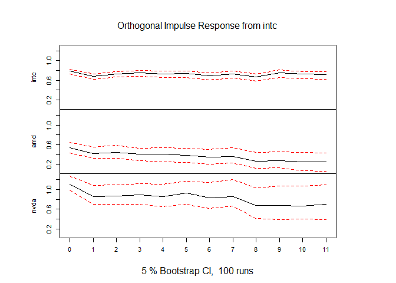
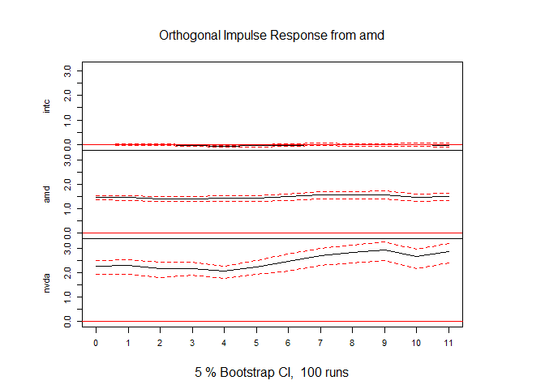
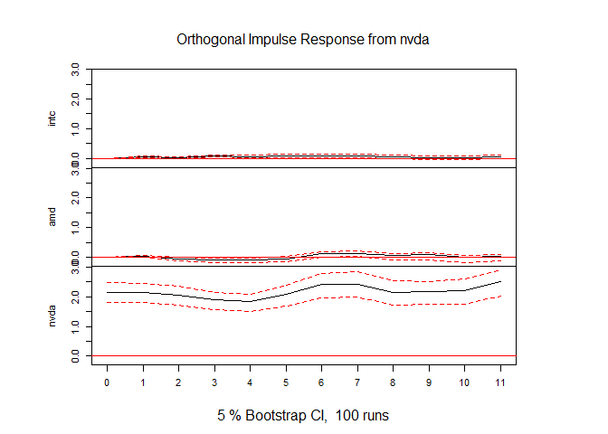

Budapesti lakásárak elemzése
================
Dittrich Levente
2023-06-15

- [Kezdeti beállítások](#kezdeti-beállítások)
  - [Használt package-ek](#használt-package-ek)
  - [Adatok megszerzése](#adatok-megszerzése)
  - [Adatok átalakítása](#adatok-átalakítása)
- [Adatvizualizáció](#adatvizualizáció)
- [Kointegréció tesztelése](#kointegréció-tesztelése)
- [Optimális késleltetés
  megtalálása](#optimális-késleltetés-megtalálása)
  - [Stacionaritás](#stacionaritás)
  - [Késleltetés meghatározása](#késleltetés-meghatározása)
- [Modellépítés](#modellépítés)
  - [Alapmodell](#alapmodell)
  - [Modellszűkítés](#modellszűkítés)
- [Granger okság](#granger-okság)
- [Impulzus-válaszfüggvények](#impulzus-válaszfüggvények)
- [Becslési variancia dekompozíció](#becslési-variancia-dekompozíció)

Ebben a portfolió fejezetben azt vizsgálom meg, hogy az
[AMD](https://finance.yahoo.com/quote/AMD?p=AMD&.tsrc=fin-srch),
[NVIDIA](https://finance.yahoo.com/quote/NVDA?p=NVDA&.tsrc=fin-srch) és
[Intel](https://finance.yahoo.com/quote/INTC?p=INTC&.tsrc=fin-srch)
vállalatok részvényeinak árfolyamára fogok VECM vagy VAR modellt
illeszteni, attól függően, hogy van-e közös hosszútávú pályájuk.

Mindhárom vállalat székhelye a kaliforniai Santa Claraban található,
azonban nem csak az a közös bennük, hanem a tevékenységük is hasonló.
Ezek a vállalatok mind mikro- és grafikus proceszorokkal foglalkoznak
elsősorban. A napi gyakoriságú részvényadatokat a Yahoo Finance-ről
töltöm le, viszont egy meghatározott intervallumban, így
reprodukálhatóak lesznek eredményeim.

# Kezdeti beállítások

## Használt package-ek

``` r
library(quantmod)
library(tidyverse)
library(knitr)
library(urca)
library(lmtest)
library(aTSA)
library(vars)
library(tsDyn)
library(aod)
```

Egy részvénynek egy napra több értékei is lehet, például az adott napi
maximum, minimum, a nyitó vagy záró értéke. A továbbiakban az egyes
részvények záró értékeivel fogok dolgozni.

## Adatok megszerzése

``` r
intel = getSymbols("INTC", src = "yahoo", auto.assign = F, from = "2010-01-01", to = "2023-06-01")
amd = getSymbols("AMD", src = "yahoo", auto.assign = F, from = "2010-01-01", to = "2023-06-01")
nvidia = getSymbols("NVDA", src = "yahoo", auto.assign = F, from = "2010-01-01", to = "2023-06-01")
```

## Adatok átalakítása

Érdemes az adatokat nem xts formátumban egyenként, hanem dataframe-ként
egyben tárolni, hogy később könnyebb legyen a munka.

``` r
df = data.frame(
  time = index(intel),
  intc = as.numeric(intel$INTC.Close),
  amd = as.numeric(amd$AMD.Close),
  nvda = as.numeric(nvidia$NVDA.Close)
)
rm(intel, amd, nvidia)
kable(head(df))
```

| time       |  intc |  amd |   nvda |
|:-----------|------:|-----:|-------:|
| 2010-01-04 | 20.88 | 9.70 | 4.6225 |
| 2010-01-05 | 20.87 | 9.71 | 4.6900 |
| 2010-01-06 | 20.80 | 9.57 | 4.7200 |
| 2010-01-07 | 20.60 | 9.47 | 4.6275 |
| 2010-01-08 | 20.83 | 9.43 | 4.6375 |
| 2010-01-11 | 20.95 | 9.14 | 4.5725 |

Az adatokat tartalmazó dataframe változói a következők:

| Változó neve | Leírás                                    | Mértékegység |
|:-------------|:------------------------------------------|:-------------|
| time         | Idő(az adott nap)                         | Dátum        |
| intc         | Az adott napi Intel részvény záró értéke  | \$           |
| amd          | Az adott napi AMD részvény záró értéke    | \$           |
| nvda         | Az adott napi NVIDIA részvény záró értéke | \$           |

3375 megfigyelés van mindhárom változóból, ez mindenképpen elegendő lesz
a modellépítéshez.

# Adatvizualizáció

``` r
ggplot(df, aes(x = time))+
  geom_line(aes(y = intc, col = "Intel"))+
  geom_line(aes(y = amd, col = "AMD"))+
  geom_line(aes(y = nvda, col = "NVIDIA"))+
  scale_y_continuous(labels = scales::dollar_format())+
  scale_color_manual(values = c("#ED1C24", "#0071C5", "#76B900"))+
  theme_minimal()+
  theme(legend.title = element_blank())+
  labs(x = "Idő", y = "Részvény árfolyam")
```

<!-- -->

Már a grafikonon is látszik, hogy valószínűleg nem stacionerek az
idősorok.

# Kointegréció tesztelése

Ahhoz, hogy tudja, hogy VEC(Vector Error Correction) vagy VAR(Vector
AutoRegression) modellt kell használjak, meg kell állapítanom, hogy
van-e közös hosszútávú pályájuk az idősoroknak. Kointegráció esetén VEC
modell a megfelelő, míg ha nincs közös távú hosszútávú pályája az
idósoroknak, akkor VAR modellt kell alkalmazzak.

Erre egy *Johansen-tesztet* fogok végezni. A teszt érdekessége, hogy
több nullhipotézist is felvet. Ez esetben a nullhipotézisek a
következők, melyekben *r* a közös hosszútávú pályák száma:

- H0: $r = 0$ \| H1: $r > 0$
- H0: $r \le 1$ \| H1: $r > 1$
- H0: $r \le 2$ \| H1: $r > 2$

Mivel összesen 3 db idősorom van, ezért maximum 2 db közös hosszútávú
pálya lehetséges (a kódban ez a *K* paraméter).

``` r
johansen_test = ca.jo(df[,-1], type = "eigen",  K = 2, ecdet = "const", spec = "longrun")
summary(johansen_test)
```

    ## 
    ## ###################### 
    ## # Johansen-Procedure # 
    ## ###################### 
    ## 
    ## Test type: maximal eigenvalue statistic (lambda max) , without linear trend and constant in cointegration 
    ## 
    ## Eigenvalues (lambda):
    ## [1] 5.063385e-03 2.381383e-03 8.799114e-04 4.502479e-19
    ## 
    ## Values of teststatistic and critical values of test:
    ## 
    ##           test 10pct  5pct  1pct
    ## r <= 2 |  2.97  7.52  9.24 12.97
    ## r <= 1 |  8.04 13.75 15.67 20.20
    ## r = 0  | 17.12 19.77 22.00 26.81
    ## 
    ## Eigenvectors, normalised to first column:
    ## (These are the cointegration relations)
    ## 
    ##               intc.l2      amd.l2     nvda.l2  constant
    ## intc.l2    1.00000000   1.0000000   1.0000000  1.000000
    ## amd.l2     0.06608674  -1.0293819   1.2081244  2.332413
    ## nvda.l2   -0.40668645   0.4136885  -0.4548912 -1.247798
    ## constant -26.42227831 -27.1668824 -57.8211496  1.023926
    ## 
    ## Weights W:
    ## (This is the loading matrix)
    ## 
    ##              intc.l2        amd.l2       nvda.l2      constant
    ## intc.d  0.0004994377 -0.0007538154 -0.0008416566  1.275210e-18
    ## amd.d  -0.0004713206  0.0046726538 -0.0010653154  4.234973e-20
    ## nvda.d -0.0060660953  0.0048779829 -0.0023863493 -1.978401e-19

A teszt egy jobboldali próba, ez azt jelenti, hogy akkor tudjuk
elfogadni a nullhipotéziseket, ha az adott próbafüggvény kisebb vagy
egyenlő a kritikus értéknél. $H0: r = 0$ Minden szokványos
szignifikanciaszinten elfogadható. $H0: r \le 1$ Minden szokványos
szignifikanciaszinten elfogadható. $H0: r \le 2$ Minden szokványos
szignifikanciaszinten elfogadható.

Ilyen esetben én a kettő közös hosszútávú pályát venném kiindulópontnak,
amennyiben nem lesz szignifikáns ECT2, akkor megfontolom az egy
hosszútávú pályára váltást.

# Optimális késleltetés megtalálása

Meg kellene határozzam az optimális késleltetést a VEC modellhez. Ez
több lépésben fog megtörténni, először az idősorok stacionaritását kell
tesztelnem. Amennyiben van egységgyök az idősorban, akkor stacionerré
kell alakítanom őket majd mintha VAR modellhez keresném, meg kell
határozzam az optimális késleltetést az információs kritériumokat
felhasználva.

## Stacionaritás

Az erős stacionaritás azt jelenti, hogy az idősorok minden véges
dimenziós eloszlása eltolásinvariás. Ez egy olyan erős követelmény, amit
inkább a valószínűségszámításban használnak gyakran, azonban
ökonometriában túl szigorú követelmény, ezért szokás gyenge
stacionaritással dolgozni. Ez azt jelenti, hogy az idősor szórása és
várható értéke időben állandó. A stacionaritás teszteléséhez egy
Augmented Dickey-Fuller tesztet fogok végezni.

Az ADF teszt hipotézisei:

- H0: Az idősor nem stacioner, $\phi = 0$
- H1: Az idősor stacionárius, $\phi \neq 0$

A teszt nem csak egyféle módon végzi a tesztet, random-walkkal, valamint
random walkkal és trenddel is megnézi a stacionaritást.

``` r
adf.test(df$intc)
```

    ## Augmented Dickey-Fuller Test 
    ## alternative: stationary 
    ##  
    ## Type 1: no drift no trend 
    ##       lag    ADF p.value
    ##  [1,]   0 -0.459   0.512
    ##  [2,]   1 -0.346   0.544
    ##  [3,]   2 -0.379   0.535
    ##  [4,]   3 -0.405   0.527
    ##  [5,]   4 -0.386   0.533
    ##  [6,]   5 -0.388   0.532
    ##  [7,]   6 -0.345   0.545
    ##  [8,]   7 -0.383   0.534
    ##  [9,]   8 -0.336   0.547
    ## Type 2: with drift no trend 
    ##       lag   ADF p.value
    ##  [1,]   0 -2.02   0.320
    ##  [2,]   1 -1.78   0.417
    ##  [3,]   2 -1.85   0.387
    ##  [4,]   3 -1.93   0.358
    ##  [5,]   4 -1.87   0.379
    ##  [6,]   5 -1.87   0.381
    ##  [7,]   6 -1.80   0.409
    ##  [8,]   7 -1.86   0.383
    ##  [9,]   8 -1.73   0.434
    ## Type 3: with drift and trend 
    ##       lag   ADF p.value
    ##  [1,]   0 -2.23   0.479
    ##  [2,]   1 -1.70   0.704
    ##  [3,]   2 -1.87   0.632
    ##  [4,]   3 -2.02   0.566
    ##  [5,]   4 -1.92   0.610
    ##  [6,]   5 -1.92   0.611
    ##  [7,]   6 -1.74   0.689
    ##  [8,]   7 -1.91   0.617
    ##  [9,]   8 -1.65   0.727
    ## ---- 
    ## Note: in fact, p.value = 0.01 means p.value <= 0.01

``` r
adf.test(df$amd)
```

    ## Augmented Dickey-Fuller Test 
    ## alternative: stationary 
    ##  
    ## Type 1: no drift no trend 
    ##       lag   ADF p.value
    ##  [1,]   0 0.647   0.830
    ##  [2,]   1 0.720   0.851
    ##  [3,]   2 0.787   0.870
    ##  [4,]   3 0.813   0.878
    ##  [5,]   4 0.779   0.868
    ##  [6,]   5 0.774   0.867
    ##  [7,]   6 0.747   0.859
    ##  [8,]   7 0.610   0.819
    ##  [9,]   8 0.642   0.829
    ## Type 2: with drift no trend 
    ##       lag      ADF p.value
    ##  [1,]   0 -0.11653   0.944
    ##  [2,]   1 -0.04887   0.952
    ##  [3,]   2  0.01145   0.957
    ##  [4,]   3  0.03446   0.958
    ##  [5,]   4  0.00386   0.956
    ##  [6,]   5 -0.00259   0.955
    ##  [7,]   6 -0.03059   0.953
    ##  [8,]   7 -0.15106   0.939
    ##  [9,]   8 -0.12257   0.943
    ## Type 3: with drift and trend 
    ##       lag   ADF p.value
    ##  [1,]   0 -1.92   0.612
    ##  [2,]   1 -1.86   0.638
    ##  [3,]   2 -1.80   0.662
    ##  [4,]   3 -1.78   0.671
    ##  [5,]   4 -1.81   0.660
    ##  [6,]   5 -1.81   0.660
    ##  [7,]   6 -1.82   0.653
    ##  [8,]   7 -1.95   0.599
    ##  [9,]   8 -1.92   0.612
    ## ---- 
    ## Note: in fact, p.value = 0.01 means p.value <= 0.01

``` r
adf.test(df$nvda)
```

    ## Augmented Dickey-Fuller Test 
    ## alternative: stationary 
    ##  
    ## Type 1: no drift no trend 
    ##       lag  ADF p.value
    ##  [1,]   0 2.76    0.99
    ##  [2,]   1 2.83    0.99
    ##  [3,]   2 3.04    0.99
    ##  [4,]   3 3.25    0.99
    ##  [5,]   4 3.41    0.99
    ##  [6,]   5 3.07    0.99
    ##  [7,]   6 2.75    0.99
    ##  [8,]   7 2.54    0.99
    ##  [9,]   8 2.59    0.99
    ## Type 2: with drift no trend 
    ##       lag  ADF p.value
    ##  [1,]   0 2.04    0.99
    ##  [2,]   1 2.11    0.99
    ##  [3,]   2 2.31    0.99
    ##  [4,]   3 2.51    0.99
    ##  [5,]   4 2.66    0.99
    ##  [6,]   5 2.35    0.99
    ##  [7,]   6 2.06    0.99
    ##  [8,]   7 1.86    0.99
    ##  [9,]   8 1.92    0.99
    ## Type 3: with drift and trend 
    ##       lag    ADF p.value
    ##  [1,]   0 0.2083    0.99
    ##  [2,]   1 0.2819    0.99
    ##  [3,]   2 0.4803    0.99
    ##  [4,]   3 0.6804    0.99
    ##  [5,]   4 0.8161    0.99
    ##  [6,]   5 0.5466    0.99
    ##  [7,]   6 0.2765    0.99
    ##  [8,]   7 0.0869    0.99
    ##  [9,]   8 0.1436    0.99
    ## ---- 
    ## Note: in fact, p.value = 0.01 means p.value <= 0.01

Egyik idősor esetében sem lehet elutasítani a nullhipotézist, minden
idősorom stacionárius.

``` r
adf.test(diff(df$intc))
```

    ## Augmented Dickey-Fuller Test 
    ## alternative: stationary 
    ##  
    ## Type 1: no drift no trend 
    ##       lag   ADF p.value
    ##  [1,]   0 -68.1    0.01
    ##  [2,]   1 -42.0    0.01
    ##  [3,]   2 -32.5    0.01
    ##  [4,]   3 -29.2    0.01
    ##  [5,]   4 -26.1    0.01
    ##  [6,]   5 -25.2    0.01
    ##  [7,]   6 -21.9    0.01
    ##  [8,]   7 -22.2    0.01
    ##  [9,]   8 -19.1    0.01
    ## Type 2: with drift no trend 
    ##       lag   ADF p.value
    ##  [1,]   0 -68.0    0.01
    ##  [2,]   1 -42.0    0.01
    ##  [3,]   2 -32.5    0.01
    ##  [4,]   3 -29.2    0.01
    ##  [5,]   4 -26.1    0.01
    ##  [6,]   5 -25.2    0.01
    ##  [7,]   6 -21.9    0.01
    ##  [8,]   7 -22.2    0.01
    ##  [9,]   8 -19.1    0.01
    ## Type 3: with drift and trend 
    ##       lag   ADF p.value
    ##  [1,]   0 -68.1    0.01
    ##  [2,]   1 -42.0    0.01
    ##  [3,]   2 -32.5    0.01
    ##  [4,]   3 -29.2    0.01
    ##  [5,]   4 -26.1    0.01
    ##  [6,]   5 -25.2    0.01
    ##  [7,]   6 -22.0    0.01
    ##  [8,]   7 -22.2    0.01
    ##  [9,]   8 -19.1    0.01
    ## ---- 
    ## Note: in fact, p.value = 0.01 means p.value <= 0.01

``` r
adf.test(diff(df$amd))
```

    ## Augmented Dickey-Fuller Test 
    ## alternative: stationary 
    ##  
    ## Type 1: no drift no trend 
    ##       lag   ADF p.value
    ##  [1,]   0 -59.4    0.01
    ##  [2,]   1 -42.4    0.01
    ##  [3,]   2 -34.5    0.01
    ##  [4,]   3 -29.2    0.01
    ##  [5,]   4 -26.0    0.01
    ##  [6,]   5 -23.4    0.01
    ##  [7,]   6 -20.4    0.01
    ##  [8,]   7 -19.5    0.01
    ##  [9,]   8 -18.1    0.01
    ## Type 2: with drift no trend 
    ##       lag   ADF p.value
    ##  [1,]   0 -59.4    0.01
    ##  [2,]   1 -42.4    0.01
    ##  [3,]   2 -34.5    0.01
    ##  [4,]   3 -29.2    0.01
    ##  [5,]   4 -26.0    0.01
    ##  [6,]   5 -23.4    0.01
    ##  [7,]   6 -20.4    0.01
    ##  [8,]   7 -19.5    0.01
    ##  [9,]   8 -18.1    0.01
    ## Type 3: with drift and trend 
    ##       lag   ADF p.value
    ##  [1,]   0 -59.4    0.01
    ##  [2,]   1 -42.4    0.01
    ##  [3,]   2 -34.6    0.01
    ##  [4,]   3 -29.3    0.01
    ##  [5,]   4 -26.0    0.01
    ##  [6,]   5 -23.4    0.01
    ##  [7,]   6 -20.4    0.01
    ##  [8,]   7 -19.5    0.01
    ##  [9,]   8 -18.2    0.01
    ## ---- 
    ## Note: in fact, p.value = 0.01 means p.value <= 0.01

``` r
adf.test(diff(df$nvda))
```

    ## Augmented Dickey-Fuller Test 
    ## alternative: stationary 
    ##  
    ## Type 1: no drift no trend 
    ##       lag   ADF p.value
    ##  [1,]   0 -58.3    0.01
    ##  [2,]   1 -42.7    0.01
    ##  [3,]   2 -35.7    0.01
    ##  [4,]   3 -31.0    0.01
    ##  [5,]   4 -24.5    0.01
    ##  [6,]   5 -20.1    0.01
    ##  [7,]   6 -17.5    0.01
    ##  [8,]   7 -16.9    0.01
    ##  [9,]   8 -15.4    0.01
    ## Type 2: with drift no trend 
    ##       lag   ADF p.value
    ##  [1,]   0 -58.4    0.01
    ##  [2,]   1 -42.7    0.01
    ##  [3,]   2 -35.8    0.01
    ##  [4,]   3 -31.1    0.01
    ##  [5,]   4 -24.6    0.01
    ##  [6,]   5 -20.2    0.01
    ##  [7,]   6 -17.6    0.01
    ##  [8,]   7 -17.0    0.01
    ##  [9,]   8 -15.5    0.01
    ## Type 3: with drift and trend 
    ##       lag   ADF p.value
    ##  [1,]   0 -58.5    0.01
    ##  [2,]   1 -42.8    0.01
    ##  [3,]   2 -35.9    0.01
    ##  [4,]   3 -31.3    0.01
    ##  [5,]   4 -24.7    0.01
    ##  [6,]   5 -20.4    0.01
    ##  [7,]   6 -17.8    0.01
    ##  [8,]   7 -17.1    0.01
    ##  [9,]   8 -15.7    0.01
    ## ---- 
    ## Note: in fact, p.value = 0.01 means p.value <= 0.01

A differenciált idősorok már stacionerek, nincsen egységgyök a
modellben. Minden esetben a p-értékek 1% alatt vannak, a
nullhipotéziseket el lehet vetni.

## Késleltetés meghatározása

A differenciált idősorokat a dataframe-be lementem és így nézem meg az
optimális lag-okat.

``` r
df$d_intc = c(NA, diff(df$intc))
df$d_amd = c(NA, diff(df$amd))
df$d_nvda = c(NA, diff(df$nvda))

VARselect(df[-1,5:7], lag.max = 30)
```

    ## $selection
    ## AIC(n)  HQ(n)  SC(n) FPE(n) 
    ##     30     11      1     30 
    ## 
    ## $criteria
    ##               1        2        3        4        5        6        7        8
    ## AIC(n) 1.942677 1.937631 1.928481 1.926575 1.914196 1.898654 1.894745 1.880049
    ## HQ(n)  1.950526 1.951368 1.948105 1.952086 1.945595 1.935939 1.937918 1.929109
    ## SC(n)  1.964620 1.976033 1.983339 1.997891 2.001970 2.002886 2.015435 2.017196
    ## FPE(n) 6.977403 6.942288 6.879052 6.865954 6.781488 6.676903 6.650859 6.553831
    ##               9       10       11       12       13       14       15       16
    ## AIC(n) 1.873669 1.862212 1.849318 1.851519 1.849803 1.850782 1.848125 1.847108
    ## HQ(n)  1.928616 1.923046 1.916039 1.924127 1.928299 1.935164 1.938394 1.943265
    ## SC(n)  2.027273 2.032274 2.035838 2.054496 2.069238 2.086674 2.100475 2.115916
    ## FPE(n) 6.512151 6.437970 6.355498 6.369505 6.358591 6.364819 6.347937 6.341491
    ##              17       18       19       20       21       22       23       24
    ## AIC(n) 1.835616 1.829742 1.826520 1.827104 1.814510 1.800410 1.800547 1.801087
    ## HQ(n)  1.937660 1.937673 1.940339 1.946809 1.940103 1.931890 1.937914 1.944342
    ## SC(n)  2.120882 2.131465 2.144701 2.161742 2.165606 2.167963 2.184558 2.201556
    ## FPE(n) 6.269042 6.232334 6.212295 6.215932 6.138154 6.052224 6.053069 6.056355
    ##              25       26       27       28       29       30
    ## AIC(n) 1.799938 1.798898 1.798040 1.793943 1.785402 1.775901
    ## HQ(n)  1.949080 1.953926 1.958956 1.960746 1.958092 1.954479
    ## SC(n)  2.216865 2.232282 2.247882 2.260242 2.268159 2.275116
    ## FPE(n) 6.049416 6.043142 6.037980 6.013313 5.962195 5.905839

Mind az AIC, mind az FPE nagyon nagy lag-okat javasol. Ezeknél az
információs kritériumoknál szigorúbb Hannan-Quinn információs kritérium
a 11-es késleltetést preferálja, míg az annál is szigorúbb
Bayes-Schwartz értéke az 1-es késleltetésnél a legkisebb. Ebben az
esetben a Hannan-Quinn infromációs kritérium szerint fogok dönteni,
11-es késleletés lesz az alapmodellemben a kettő darab hosszútávú közös
pálya mellett.

# Modellépítés

## Alapmodell

``` r
alapmodell = VECM(df[,2:4], lag = 11, r = 2)
```

    ## Warning in lineVar(data, lag, r = r, include = include, model = "VECM", : Estimation of more than 1 coint relationship is not possible with estim '2OLS'. Switched to Johansen 'ML'

``` r
summary(alapmodell)
```

    ## #############
    ## ###Model VECM 
    ## #############
    ## Full sample size: 3375   End sample size: 3363
    ## Number of variables: 3   Number of estimated slope parameters 108
    ## AIC 6161.923     BIC 6835.188    SSR 46727.5
    ## Cointegrating vector (estimated by ML):
    ##            intc amd       nvda
    ## r1 1.000000e+00   0 -0.3736951
    ## r2 5.551115e-17   1 -0.7300483
    ## 
    ## 
    ##               ECT1                ECT2                Intercept         
    ## Equation intc -0.0003(0.0011)     0.0011(0.0012)      0.0207(0.0336)    
    ## Equation amd  0.0051(0.0022)*     -0.0063(0.0024)**   -0.1225(0.0664).  
    ## Equation nvda 0.0008(0.0048)      -0.0060(0.0051)     0.0109(0.1420)    
    ##               intc -1            amd -1              nvda -1            
    ## Equation intc -0.1306(0.0186)*** -0.0548(0.0136)***  0.0231(0.0064)***  
    ## Equation amd  -0.1616(0.0367)*** -0.0173(0.0268)     0.0145(0.0125)     
    ## Equation nvda -0.3299(0.0786)*** 0.0180(0.0573)      -0.0056(0.0268)    
    ##               intc -2            amd -2              nvda -2            
    ## Equation intc 0.0448(0.0188)*    0.0127(0.0136)      -0.0038(0.0064)    
    ## Equation amd  0.0531(0.0370)     0.0289(0.0269)      -0.0437(0.0126)*** 
    ## Equation nvda 0.0506(0.0792)     -0.0348(0.0575)     -0.0381(0.0269)    
    ##               intc -3             amd -3             nvda -3            
    ## Equation intc 0.0628(0.0187)***   -0.0568(0.0136)*** 0.0182(0.0064)**   
    ## Equation amd  -0.0388(0.0369)     0.0259(0.0269)     -0.0167(0.0126)    
    ## Equation nvda 0.0591(0.0789)      0.1425(0.0576)*    -0.0852(0.0270)**  
    ##               intc -4             amd -4              nvda -4            
    ## Equation intc -0.0224(0.0189)     -0.0102(0.0140)     -0.0010(0.0070)    
    ## Equation amd  -0.0307(0.0373)     0.0194(0.0276)      -0.0003(0.0139)    
    ## Equation nvda 0.0256(0.0798)      -0.0380(0.0592)     -0.0309(0.0297)    
    ##               intc -5             amd -5              nvda -5           
    ## Equation intc -0.0134(0.0189)     -0.0012(0.0140)     0.0068(0.0070)    
    ## Equation amd  -0.0464(0.0373)     -0.0083(0.0277)     0.0097(0.0139)    
    ## Equation nvda -0.0631(0.0798)     -0.0551(0.0592)     0.1148(0.0298)*** 
    ##               intc -6            amd -6              nvda -6            
    ## Equation intc -0.0627(0.0189)*** 0.0179(0.0140)      -0.0021(0.0071)    
    ## Equation amd  -0.0974(0.0372)**  -0.0889(0.0276)**   0.0746(0.0139)***  
    ## Equation nvda -0.2353(0.0796)**  -0.0825(0.0591)     0.1425(0.0298)***  
    ##               intc -7             amd -7             nvda -7           
    ## Equation intc 0.0143(0.0189)      0.0267(0.0140).    0.0017(0.0071)    
    ## Equation amd  -0.0244(0.0373)     0.0444(0.0276)     0.0110(0.0140)    
    ## Equation nvda -0.0986(0.0798)     0.1487(0.0590)*    0.0115(0.0299)    
    ##               intc -8            amd -8             nvda -8           
    ## Equation intc -0.0538(0.0189)**  0.0028(0.0140)     -0.0134(0.0071).  
    ## Equation amd  -0.1141(0.0373)**  0.0669(0.0276)*    -0.0349(0.0139)*  
    ## Equation nvda -0.2454(0.0798)**  0.2980(0.0590)***  -0.1075(0.0298)***
    ##               intc -9             amd -9              nvda -9            
    ## Equation intc 0.0963(0.0189)***   -0.0057(0.0140)     -0.0034(0.0071)    
    ## Equation amd  -0.0255(0.0372)     -0.0243(0.0277)     0.0211(0.0140)     
    ## Equation nvda -0.1041(0.0796)     0.0253(0.0592)      0.0301(0.0299)     
    ##               intc -10            amd -10             nvda -10           
    ## Equation intc -0.0051(0.0189)     0.0225(0.0140)      -0.0093(0.0071)    
    ## Equation amd  0.0421(0.0374)      -0.0027(0.0277)     -0.0429(0.0140)**  
    ## Equation nvda 0.1181(0.0800)      -0.2010(0.0592)***  0.0159(0.0299)     
    ##               intc -11            amd -11             nvda -11           
    ## Equation intc -0.0112(0.0188)     -0.0403(0.0141)**   0.0184(0.0071)**   
    ## Equation amd  -0.0388(0.0370)     0.0318(0.0278)      -0.0036(0.0140)    
    ## Equation nvda -0.0821(0.0792)     -0.0406(0.0595)     0.1108(0.0300)***

A közös hosszútávú pálya koefficiensei csak az AMD esetében
szignifikánsak. Ezek jelentése a következő az AMD esetében:

- ECT1: amennyiben az AMD elmozdul az első közös hosszútávú pályától,
  akkor a következő időszakban 0,51%-al a távolodik még.
- ECT2: amennyiben az AMD elmozdul a második közös hosszútávú pályától,
  akkor az elmozdulás 0,63%-át hozza be a következő időszakban.

Érdemes kiemelni a kontextus miatt, hogy az Intel a x86 CPU-k piacának
nagy részét az [Intel
dominálja](https://www.statista.com/statistics/735904/worldwide-x86-intel-amd-market-share/),
míg a diszkrét GPU-k piacának nagy részét az [NVIDIA
uralja](https://www.pcworld.com/article/1526632/intel-is-already-tied-with-amd-for-desktop-gpu-sales.html).
A laptopokat is beleértve szintén az [Intel a legnagyobb
szereplő](https://www.statista.com/statistics/754557/worldwide-gpu-shipments-market-share-by-vendor/)
a GPU piacon. Azért érdemes külön választani a diszkrét és integrált
GPU-k piacát, mivel a 2010-es évek végétől kezdődő kriptovaluta
bányászatra elsősorban dedikált, asztali videókártyákat használnak, ami
egy időben okozott is hiányt, mivel a bányászok rengeteg GPU-t
vásároltak fel a piacról.

Valószínűnek tartom, hogy a két hosszútávú közös pálya a CPU és GPU
piacokat jelenti. Ha a szignifikanciaszinttől függetlenül nézzük a
pályák koefficienseit, akkor látható, hogy az első pályától való
eltérésnél az Intel közeledik, míg az AMD és az NVIDIA távolodik a
következő időszakban. A második hosszútávú közös pályát nézve pont
fordított a helyzet: az eltérés hatására az Intel távolodik, míg az AMD
és az NVIDIA ledolgozza az eltérés egy részét. Feltevésem szerint az
első hosszútávú pálya a processzorgyártók hosszútávú pályája, míg a
második közös hosszútávú pálya a GPU gyártóké.

Visszatérve az alapmodellre, nagyon érdekes, hogy az előző időszaki
Intel árfolyam mindegyik részvényre negatív hatással van. Végig a 11
késleltetésig nagyrészt vannak szignifikáns együtthatók, egyedül a
négyes késleltetésnél nincsen egyik egyenletben sem szingifikáns
koefficiens.

## Modellszűkítés

A modellszelekció miatt megnéztem több, más paraméterű modellt, ezek
közül kettőt emelnék ki:

Az egyik modellben egy közös hosszútávú pálya van 11 késleltetéssel:

``` r
szukitett_modell1 = VECM(df[,2:4], lag = 11, r = 1)
summary(szukitett_modell1)
```

    ## #############
    ## ###Model VECM 
    ## #############
    ## Full sample size: 3375   End sample size: 3363
    ## Number of variables: 3   Number of estimated slope parameters 105
    ## AIC 6167.099     BIC 6822.002    SSR 46780.28
    ## Cointegrating vector (estimated by 2OLS):
    ##    intc        amd     nvda
    ## r1    1 -0.9303583 0.161078
    ## 
    ## 
    ##               ECT                 Intercept           intc -1           
    ## Equation intc 0.0006(0.0008)      -0.0093(0.0198)     -0.1307(0.0186)***
    ## Equation amd  0.0022(0.0015)      -0.0086(0.0390)     -0.1624(0.0368)***
    ## Equation nvda -0.0022(0.0032)     0.1341(0.0835)      -0.3326(0.0786)***
    ##               amd -1              nvda -1            intc -2           
    ## Equation intc -0.0537(0.0136)***  0.0222(0.0063)***  0.0449(0.0188)*   
    ## Equation amd  -0.0202(0.0268)     0.0173(0.0125)     0.0520(0.0370)    
    ## Equation nvda 0.0117(0.0573)      0.0001(0.0267)     0.0475(0.0792)    
    ##               amd -2              nvda -2             intc -3            
    ## Equation intc 0.0139(0.0136)      -0.0047(0.0063)     0.0628(0.0187)***  
    ## Equation amd  0.0258(0.0268)      -0.0408(0.0125)**   -0.0397(0.0369)    
    ## Equation nvda -0.0416(0.0574)     -0.0323(0.0268)     0.0559(0.0789)     
    ##               amd -3             nvda -3             intc -4            
    ## Equation intc -0.0556(0.0136)*** 0.0173(0.0064)**    -0.0227(0.0189)    
    ## Equation amd  0.0227(0.0269)     -0.0137(0.0125)     -0.0310(0.0373)    
    ## Equation nvda 0.1357(0.0575)*    -0.0793(0.0268)**   0.0238(0.0798)     
    ##               amd -4              nvda -4             intc -5            
    ## Equation intc -0.0092(0.0140)     -0.0017(0.0070)     -0.0136(0.0189)    
    ## Equation amd  0.0167(0.0276)      0.0020(0.0139)      -0.0467(0.0373)    
    ## Equation nvda -0.0437(0.0591)     -0.0264(0.0297)     -0.0649(0.0798)    
    ##               amd -5              nvda -5            intc -6           
    ## Equation intc -0.0002(0.0140)     0.0062(0.0070)     -0.0628(0.0189)***
    ## Equation amd  -0.0111(0.0276)     0.0121(0.0139)     -0.0978(0.0372)** 
    ## Equation nvda -0.0608(0.0591)     0.1194(0.0297)***  -0.2374(0.0796)** 
    ##               amd -6              nvda -6             intc -7            
    ## Equation intc 0.0189(0.0140)      -0.0027(0.0070)     0.0141(0.0189)     
    ## Equation amd  -0.0916(0.0276)***  0.0769(0.0139)***   -0.0249(0.0373)    
    ## Equation nvda -0.0880(0.0591)     0.1470(0.0298)***   -0.1006(0.0798)    
    ##               amd -7             nvda -7            intc -8           
    ## Equation intc 0.0277(0.0140)*    0.0010(0.0071)     -0.0540(0.0189)** 
    ## Equation amd  0.0416(0.0276)     0.0134(0.0139)     -0.1146(0.0373)** 
    ## Equation nvda 0.1428(0.0590)*    0.0161(0.0298)     -0.2474(0.0798)** 
    ##               amd -8             nvda -8            intc -9            
    ## Equation intc 0.0038(0.0140)     -0.0141(0.0070)*   0.0960(0.0189)***  
    ## Equation amd  0.0642(0.0276)*    -0.0325(0.0139)*   -0.0257(0.0372)    
    ## Equation nvda 0.2923(0.0590)***  -0.1030(0.0297)*** -0.1056(0.0796)    
    ##               amd -9              nvda -9             intc -10           
    ## Equation intc -0.0047(0.0140)     -0.0041(0.0071)     -0.0055(0.0189)    
    ## Equation amd  -0.0272(0.0276)     0.0234(0.0139).     0.0424(0.0374)     
    ## Equation nvda 0.0193(0.0591)      0.0346(0.0298)      0.1173(0.0800)     
    ##               amd -10             nvda -10            intc -11           
    ## Equation intc 0.0235(0.0140).     -0.0099(0.0071)     -0.0117(0.0188)    
    ## Equation amd  -0.0056(0.0276)     -0.0407(0.0139)**   -0.0385(0.0370)    
    ## Equation nvda -0.2071(0.0592)***  0.0202(0.0298)      -0.0826(0.0792)    
    ##               amd -11             nvda -11           
    ## Equation intc -0.0392(0.0141)**   0.0178(0.0071)*    
    ## Equation amd  0.0289(0.0278)      -0.0014(0.0140)    
    ## Equation nvda -0.0466(0.0595)     0.1151(0.0299)***

A másik modellben pedig megmaradt a kettő közös hosszútávú pálya,
azonban a késleltetést a Bayes-Schwartz IC által preferált 1-es
késleltetésre cseréltem.

``` r
szukitett_modell2 = VECM(df[,2:4], lag = 1, r = 2)
```

    ## Warning in lineVar(data, lag, r = r, include = include, model = "VECM", : Estimation of more than 1 coint relationship is not possible with estim '2OLS'. Switched to Johansen 'ML'

``` r
summary(szukitett_modell2)
```

    ## #############
    ## ###Model VECM 
    ## #############
    ## Full sample size: 3375   End sample size: 3373
    ## Number of variables: 3   Number of estimated slope parameters 18
    ## AIC 6467.342     BIC 6589.813    SSR 49258.62
    ## Cointegrating vector (estimated by ML):
    ##    intc          amd       nvda
    ## r1    1 2.775558e-17 -0.4007844
    ## r2    0 1.000000e+00 -0.8199959
    ## 
    ## 
    ##               ECT1                ECT2                Intercept          
    ## Equation intc -0.0004(0.0012)     0.0010(0.0011)      0.0257(0.0367)     
    ## Equation amd  0.0043(0.0024).     -0.0042(0.0021)*    -0.1002(0.0722)    
    ## Equation nvda -0.0010(0.0051)     -0.0039(0.0046)     0.0567(0.1561)     
    ##               intc -1            amd -1              nvda -1           
    ## Equation intc -0.1521(0.0183)*** -0.0596(0.0135)***  0.0247(0.0063)*** 
    ## Equation amd  -0.1756(0.0360)*** -0.0330(0.0266)     0.0235(0.0124).   
    ## Equation nvda -0.3148(0.0779)*** -0.0152(0.0575)     0.0141(0.0267)

A modellek információs kritériumai:

| Modell      | ECT | Lag | AIC               | BIC         |
|:------------|:----|:----|:------------------|:------------|
| Alap        | 2   | 11  | 6161.923 \*       | 6835.188    |
| Szűkített 1 | 1   | 11  | 6167.099          | 6822.002    |
| Szűkített 2 | 2   | 1   | 6467.342          | 6589.813 \* |
|             |     |     | \* *Legkisebb IC* |             |

Az AIC szerint az alapmodell a jobb, míg a BIC szerint az egy
késleltetésű, ami érthető is, mivel akkor drasztikusan csökken a bevont
változók száma. Mivel egyértelműen nem tudom eldönteni, hogy szűkítsem-e
a modellt, ezért amellett döntök, hogy meghagyom az alapmodellt végleges
modellnek, mert egészen a 11 lagig vannak szignifikáns magyarázó
változók.

# Granger okság

A VEC modelleknél a Granger okság vizsgálata bonyolultabb, mint a VAR
modelleknél. Először is meg kell keressem, hogy az egyes egyenletek a
koefficinsek és a varaincia-kovariancia táblázatban hol helyezkednek el.

``` r
coef = coef(alapmodell)
knitr::kable(coef, format = "html")
```

<table>
<thead>
<tr>
<th style="text-align:left;">
</th>
<th style="text-align:right;">
ECT1
</th>
<th style="text-align:right;">
ECT2
</th>
<th style="text-align:right;">
Intercept
</th>
<th style="text-align:right;">
intc -1
</th>
<th style="text-align:right;">
amd -1
</th>
<th style="text-align:right;">
nvda -1
</th>
<th style="text-align:right;">
intc -2
</th>
<th style="text-align:right;">
amd -2
</th>
<th style="text-align:right;">
nvda -2
</th>
<th style="text-align:right;">
intc -3
</th>
<th style="text-align:right;">
amd -3
</th>
<th style="text-align:right;">
nvda -3
</th>
<th style="text-align:right;">
intc -4
</th>
<th style="text-align:right;">
amd -4
</th>
<th style="text-align:right;">
nvda -4
</th>
<th style="text-align:right;">
intc -5
</th>
<th style="text-align:right;">
amd -5
</th>
<th style="text-align:right;">
nvda -5
</th>
<th style="text-align:right;">
intc -6
</th>
<th style="text-align:right;">
amd -6
</th>
<th style="text-align:right;">
nvda -6
</th>
<th style="text-align:right;">
intc -7
</th>
<th style="text-align:right;">
amd -7
</th>
<th style="text-align:right;">
nvda -7
</th>
<th style="text-align:right;">
intc -8
</th>
<th style="text-align:right;">
amd -8
</th>
<th style="text-align:right;">
nvda -8
</th>
<th style="text-align:right;">
intc -9
</th>
<th style="text-align:right;">
amd -9
</th>
<th style="text-align:right;">
nvda -9
</th>
<th style="text-align:right;">
intc -10
</th>
<th style="text-align:right;">
amd -10
</th>
<th style="text-align:right;">
nvda -10
</th>
<th style="text-align:right;">
intc -11
</th>
<th style="text-align:right;">
amd -11
</th>
<th style="text-align:right;">
nvda -11
</th>
</tr>
</thead>
<tbody>
<tr>
<td style="text-align:left;">
Equation intc
</td>
<td style="text-align:right;">
-0.0002887
</td>
<td style="text-align:right;">
0.0011336
</td>
<td style="text-align:right;">
0.0206647
</td>
<td style="text-align:right;">
-0.1306407
</td>
<td style="text-align:right;">
-0.0548261
</td>
<td style="text-align:right;">
0.0230933
</td>
<td style="text-align:right;">
0.0448493
</td>
<td style="text-align:right;">
0.0127055
</td>
<td style="text-align:right;">
-0.0038036
</td>
<td style="text-align:right;">
0.0627727
</td>
<td style="text-align:right;">
-0.0568353
</td>
<td style="text-align:right;">
0.0182126
</td>
<td style="text-align:right;">
-0.0224372
</td>
<td style="text-align:right;">
-0.0101869
</td>
<td style="text-align:right;">
-0.0010459
</td>
<td style="text-align:right;">
-0.0133879
</td>
<td style="text-align:right;">
-0.0012052
</td>
<td style="text-align:right;">
0.0068455
</td>
<td style="text-align:right;">
-0.0626564
</td>
<td style="text-align:right;">
0.0178798
</td>
<td style="text-align:right;">
-0.0020523
</td>
<td style="text-align:right;">
0.0143140
</td>
<td style="text-align:right;">
0.0266619
</td>
<td style="text-align:right;">
0.0016722
</td>
<td style="text-align:right;">
-0.0537747
</td>
<td style="text-align:right;">
0.0028080
</td>
<td style="text-align:right;">
-0.0134435
</td>
<td style="text-align:right;">
0.0963068
</td>
<td style="text-align:right;">
-0.0057387
</td>
<td style="text-align:right;">
-0.0034314
</td>
<td style="text-align:right;">
-0.0050543
</td>
<td style="text-align:right;">
0.0224868
</td>
<td style="text-align:right;">
-0.0092940
</td>
<td style="text-align:right;">
-0.0112408
</td>
<td style="text-align:right;">
-0.0402887
</td>
<td style="text-align:right;">
0.0184204
</td>
</tr>
<tr>
<td style="text-align:left;">
Equation amd
</td>
<td style="text-align:right;">
0.0051499
</td>
<td style="text-align:right;">
-0.0062809
</td>
<td style="text-align:right;">
-0.1224576
</td>
<td style="text-align:right;">
-0.1616359
</td>
<td style="text-align:right;">
-0.0173300
</td>
<td style="text-align:right;">
0.0144505
</td>
<td style="text-align:right;">
0.0530602
</td>
<td style="text-align:right;">
0.0289443
</td>
<td style="text-align:right;">
-0.0436750
</td>
<td style="text-align:right;">
-0.0387628
</td>
<td style="text-align:right;">
0.0259036
</td>
<td style="text-align:right;">
-0.0167112
</td>
<td style="text-align:right;">
-0.0307061
</td>
<td style="text-align:right;">
0.0194400
</td>
<td style="text-align:right;">
-0.0002677
</td>
<td style="text-align:right;">
-0.0464096
</td>
<td style="text-align:right;">
-0.0083417
</td>
<td style="text-align:right;">
0.0097302
</td>
<td style="text-align:right;">
-0.0973558
</td>
<td style="text-align:right;">
-0.0889312
</td>
<td style="text-align:right;">
0.0745588
</td>
<td style="text-align:right;">
-0.0244132
</td>
<td style="text-align:right;">
0.0443845
</td>
<td style="text-align:right;">
0.0110122
</td>
<td style="text-align:right;">
-0.1141019
</td>
<td style="text-align:right;">
0.0669227
</td>
<td style="text-align:right;">
-0.0348592
</td>
<td style="text-align:right;">
-0.0254881
</td>
<td style="text-align:right;">
-0.0242897
</td>
<td style="text-align:right;">
0.0210901
</td>
<td style="text-align:right;">
0.0420955
</td>
<td style="text-align:right;">
-0.0026819
</td>
<td style="text-align:right;">
-0.0429324
</td>
<td style="text-align:right;">
-0.0388037
</td>
<td style="text-align:right;">
0.0317651
</td>
<td style="text-align:right;">
-0.0036154
</td>
</tr>
<tr>
<td style="text-align:left;">
Equation nvda
</td>
<td style="text-align:right;">
0.0008111
</td>
<td style="text-align:right;">
-0.0059725
</td>
<td style="text-align:right;">
0.0108887
</td>
<td style="text-align:right;">
-0.3298534
</td>
<td style="text-align:right;">
0.0180384
</td>
<td style="text-align:right;">
-0.0055881
</td>
<td style="text-align:right;">
0.0506139
</td>
<td style="text-align:right;">
-0.0347773
</td>
<td style="text-align:right;">
-0.0380863
</td>
<td style="text-align:right;">
0.0590962
</td>
<td style="text-align:right;">
0.1424988
</td>
<td style="text-align:right;">
-0.0852230
</td>
<td style="text-align:right;">
0.0256136
</td>
<td style="text-align:right;">
-0.0379689
</td>
<td style="text-align:right;">
-0.0308900
</td>
<td style="text-align:right;">
-0.0630760
</td>
<td style="text-align:right;">
-0.0550647
</td>
<td style="text-align:right;">
0.1148210
</td>
<td style="text-align:right;">
-0.2352900
</td>
<td style="text-align:right;">
-0.0825450
</td>
<td style="text-align:right;">
0.1424642
</td>
<td style="text-align:right;">
-0.0985549
</td>
<td style="text-align:right;">
0.1486755
</td>
<td style="text-align:right;">
0.0114834
</td>
<td style="text-align:right;">
-0.2454085
</td>
<td style="text-align:right;">
0.2980281
</td>
<td style="text-align:right;">
-0.1075408
</td>
<td style="text-align:right;">
-0.1041250
</td>
<td style="text-align:right;">
0.0253479
</td>
<td style="text-align:right;">
0.0300942
</td>
<td style="text-align:right;">
0.1180754
</td>
<td style="text-align:right;">
-0.2010228
</td>
<td style="text-align:right;">
0.0158699
</td>
<td style="text-align:right;">
-0.0820594
</td>
<td style="text-align:right;">
-0.0406338
</td>
<td style="text-align:right;">
0.1107549
</td>
</tr>
</tbody>
</table>

Az első egyenelet az intc, majd az amd és az nvda követi.

``` r
vcov = vcov(alapmodell)
knitr::kable(vcov, format = "html")
```

<table>
<thead>
<tr>
<th style="text-align:left;">
</th>
<th style="text-align:right;">
intc:ECT1
</th>
<th style="text-align:right;">
intc:ECT2
</th>
<th style="text-align:right;">
intc:Intercept
</th>
<th style="text-align:right;">
intc:intc-1
</th>
<th style="text-align:right;">
intc:amd-1
</th>
<th style="text-align:right;">
intc:nvda-1
</th>
<th style="text-align:right;">
intc:intc-2
</th>
<th style="text-align:right;">
intc:amd-2
</th>
<th style="text-align:right;">
intc:nvda-2
</th>
<th style="text-align:right;">
intc:intc-3
</th>
<th style="text-align:right;">
intc:amd-3
</th>
<th style="text-align:right;">
intc:nvda-3
</th>
<th style="text-align:right;">
intc:intc-4
</th>
<th style="text-align:right;">
intc:amd-4
</th>
<th style="text-align:right;">
intc:nvda-4
</th>
<th style="text-align:right;">
intc:intc-5
</th>
<th style="text-align:right;">
intc:amd-5
</th>
<th style="text-align:right;">
intc:nvda-5
</th>
<th style="text-align:right;">
intc:intc-6
</th>
<th style="text-align:right;">
intc:amd-6
</th>
<th style="text-align:right;">
intc:nvda-6
</th>
<th style="text-align:right;">
intc:intc-7
</th>
<th style="text-align:right;">
intc:amd-7
</th>
<th style="text-align:right;">
intc:nvda-7
</th>
<th style="text-align:right;">
intc:intc-8
</th>
<th style="text-align:right;">
intc:amd-8
</th>
<th style="text-align:right;">
intc:nvda-8
</th>
<th style="text-align:right;">
intc:intc-9
</th>
<th style="text-align:right;">
intc:amd-9
</th>
<th style="text-align:right;">
intc:nvda-9
</th>
<th style="text-align:right;">
intc:intc-10
</th>
<th style="text-align:right;">
intc:amd-10
</th>
<th style="text-align:right;">
intc:nvda-10
</th>
<th style="text-align:right;">
intc:intc-11
</th>
<th style="text-align:right;">
intc:amd-11
</th>
<th style="text-align:right;">
intc:nvda-11
</th>
<th style="text-align:right;">
amd:ECT1
</th>
<th style="text-align:right;">
amd:ECT2
</th>
<th style="text-align:right;">
amd:Intercept
</th>
<th style="text-align:right;">
amd:intc-1
</th>
<th style="text-align:right;">
amd:amd-1
</th>
<th style="text-align:right;">
amd:nvda-1
</th>
<th style="text-align:right;">
amd:intc-2
</th>
<th style="text-align:right;">
amd:amd-2
</th>
<th style="text-align:right;">
amd:nvda-2
</th>
<th style="text-align:right;">
amd:intc-3
</th>
<th style="text-align:right;">
amd:amd-3
</th>
<th style="text-align:right;">
amd:nvda-3
</th>
<th style="text-align:right;">
amd:intc-4
</th>
<th style="text-align:right;">
amd:amd-4
</th>
<th style="text-align:right;">
amd:nvda-4
</th>
<th style="text-align:right;">
amd:intc-5
</th>
<th style="text-align:right;">
amd:amd-5
</th>
<th style="text-align:right;">
amd:nvda-5
</th>
<th style="text-align:right;">
amd:intc-6
</th>
<th style="text-align:right;">
amd:amd-6
</th>
<th style="text-align:right;">
amd:nvda-6
</th>
<th style="text-align:right;">
amd:intc-7
</th>
<th style="text-align:right;">
amd:amd-7
</th>
<th style="text-align:right;">
amd:nvda-7
</th>
<th style="text-align:right;">
amd:intc-8
</th>
<th style="text-align:right;">
amd:amd-8
</th>
<th style="text-align:right;">
amd:nvda-8
</th>
<th style="text-align:right;">
amd:intc-9
</th>
<th style="text-align:right;">
amd:amd-9
</th>
<th style="text-align:right;">
amd:nvda-9
</th>
<th style="text-align:right;">
amd:intc-10
</th>
<th style="text-align:right;">
amd:amd-10
</th>
<th style="text-align:right;">
amd:nvda-10
</th>
<th style="text-align:right;">
amd:intc-11
</th>
<th style="text-align:right;">
amd:amd-11
</th>
<th style="text-align:right;">
amd:nvda-11
</th>
<th style="text-align:right;">
nvda:ECT1
</th>
<th style="text-align:right;">
nvda:ECT2
</th>
<th style="text-align:right;">
nvda:Intercept
</th>
<th style="text-align:right;">
nvda:intc-1
</th>
<th style="text-align:right;">
nvda:amd-1
</th>
<th style="text-align:right;">
nvda:nvda-1
</th>
<th style="text-align:right;">
nvda:intc-2
</th>
<th style="text-align:right;">
nvda:amd-2
</th>
<th style="text-align:right;">
nvda:nvda-2
</th>
<th style="text-align:right;">
nvda:intc-3
</th>
<th style="text-align:right;">
nvda:amd-3
</th>
<th style="text-align:right;">
nvda:nvda-3
</th>
<th style="text-align:right;">
nvda:intc-4
</th>
<th style="text-align:right;">
nvda:amd-4
</th>
<th style="text-align:right;">
nvda:nvda-4
</th>
<th style="text-align:right;">
nvda:intc-5
</th>
<th style="text-align:right;">
nvda:amd-5
</th>
<th style="text-align:right;">
nvda:nvda-5
</th>
<th style="text-align:right;">
nvda:intc-6
</th>
<th style="text-align:right;">
nvda:amd-6
</th>
<th style="text-align:right;">
nvda:nvda-6
</th>
<th style="text-align:right;">
nvda:intc-7
</th>
<th style="text-align:right;">
nvda:amd-7
</th>
<th style="text-align:right;">
nvda:nvda-7
</th>
<th style="text-align:right;">
nvda:intc-8
</th>
<th style="text-align:right;">
nvda:amd-8
</th>
<th style="text-align:right;">
nvda:nvda-8
</th>
<th style="text-align:right;">
nvda:intc-9
</th>
<th style="text-align:right;">
nvda:amd-9
</th>
<th style="text-align:right;">
nvda:nvda-9
</th>
<th style="text-align:right;">
nvda:intc-10
</th>
<th style="text-align:right;">
nvda:amd-10
</th>
<th style="text-align:right;">
nvda:nvda-10
</th>
<th style="text-align:right;">
nvda:intc-11
</th>
<th style="text-align:right;">
nvda:amd-11
</th>
<th style="text-align:right;">
nvda:nvda-11
</th>
</tr>
</thead>
<tbody>
<tr>
<td style="text-align:left;">
intc:ECT1
</td>
<td style="text-align:right;">
1.30e-06
</td>
<td style="text-align:right;">
-1.20e-06
</td>
<td style="text-align:right;">
-0.0000337
</td>
<td style="text-align:right;">
-0.0000010
</td>
<td style="text-align:right;">
0.0000003
</td>
<td style="text-align:right;">
-1.00e-07
</td>
<td style="text-align:right;">
-0.0000010
</td>
<td style="text-align:right;">
0.0000003
</td>
<td style="text-align:right;">
-1.00e-07
</td>
<td style="text-align:right;">
-0.0000010
</td>
<td style="text-align:right;">
0.0000003
</td>
<td style="text-align:right;">
-1.00e-07
</td>
<td style="text-align:right;">
-0.0000011
</td>
<td style="text-align:right;">
0.0000003
</td>
<td style="text-align:right;">
-0.0000001
</td>
<td style="text-align:right;">
-0.0000011
</td>
<td style="text-align:right;">
0.0000003
</td>
<td style="text-align:right;">
-0.0000001
</td>
<td style="text-align:right;">
-0.0000011
</td>
<td style="text-align:right;">
0.0000003
</td>
<td style="text-align:right;">
-0.0000001
</td>
<td style="text-align:right;">
-0.0000011
</td>
<td style="text-align:right;">
0.0000003
</td>
<td style="text-align:right;">
-0.0000001
</td>
<td style="text-align:right;">
-0.0000010
</td>
<td style="text-align:right;">
0.0000003
</td>
<td style="text-align:right;">
-1.00e-07
</td>
<td style="text-align:right;">
-0.0000011
</td>
<td style="text-align:right;">
0.0000003
</td>
<td style="text-align:right;">
-0.0000001
</td>
<td style="text-align:right;">
-0.0000012
</td>
<td style="text-align:right;">
0.0000003
</td>
<td style="text-align:right;">
0.0000000
</td>
<td style="text-align:right;">
-0.0000011
</td>
<td style="text-align:right;">
0.0000003
</td>
<td style="text-align:right;">
-0.0000001
</td>
<td style="text-align:right;">
0.0000009
</td>
<td style="text-align:right;">
-0.0000008
</td>
<td style="text-align:right;">
-0.0000230
</td>
<td style="text-align:right;">
-0.0000007
</td>
<td style="text-align:right;">
0.0000002
</td>
<td style="text-align:right;">
-0.0000001
</td>
<td style="text-align:right;">
-0.0000007
</td>
<td style="text-align:right;">
0.0000002
</td>
<td style="text-align:right;">
-0.0000001
</td>
<td style="text-align:right;">
-0.0000007
</td>
<td style="text-align:right;">
0.0000002
</td>
<td style="text-align:right;">
-0.0000001
</td>
<td style="text-align:right;">
-0.0000007
</td>
<td style="text-align:right;">
0.0000002
</td>
<td style="text-align:right;">
-0.0000001
</td>
<td style="text-align:right;">
-0.0000008
</td>
<td style="text-align:right;">
0.0000002
</td>
<td style="text-align:right;">
0.0000000
</td>
<td style="text-align:right;">
-0.0000007
</td>
<td style="text-align:right;">
0.0000002
</td>
<td style="text-align:right;">
-0.0000001
</td>
<td style="text-align:right;">
-0.0000007
</td>
<td style="text-align:right;">
0.0000002
</td>
<td style="text-align:right;">
0.0000000
</td>
<td style="text-align:right;">
-0.0000007
</td>
<td style="text-align:right;">
0.0000002
</td>
<td style="text-align:right;">
0.0000000
</td>
<td style="text-align:right;">
-0.0000008
</td>
<td style="text-align:right;">
0.0000002
</td>
<td style="text-align:right;">
0.0000000
</td>
<td style="text-align:right;">
-0.0000008
</td>
<td style="text-align:right;">
0.0000002
</td>
<td style="text-align:right;">
0.0000000
</td>
<td style="text-align:right;">
-0.0000007
</td>
<td style="text-align:right;">
0.0000002
</td>
<td style="text-align:right;">
-0.0000001
</td>
<td style="text-align:right;">
0.0000018
</td>
<td style="text-align:right;">
-0.0000017
</td>
<td style="text-align:right;">
-0.0000477
</td>
<td style="text-align:right;">
-0.0000014
</td>
<td style="text-align:right;">
0.0000004
</td>
<td style="text-align:right;">
-0.0000002
</td>
<td style="text-align:right;">
-0.0000014
</td>
<td style="text-align:right;">
0.0000004
</td>
<td style="text-align:right;">
-0.0000002
</td>
<td style="text-align:right;">
-0.0000015
</td>
<td style="text-align:right;">
0.0000005
</td>
<td style="text-align:right;">
-0.0000002
</td>
<td style="text-align:right;">
-0.0000015
</td>
<td style="text-align:right;">
0.0000004
</td>
<td style="text-align:right;">
-0.0000001
</td>
<td style="text-align:right;">
-0.0000016
</td>
<td style="text-align:right;">
0.0000005
</td>
<td style="text-align:right;">
-0.0000001
</td>
<td style="text-align:right;">
-0.0000015
</td>
<td style="text-align:right;">
0.0000004
</td>
<td style="text-align:right;">
-0.0000001
</td>
<td style="text-align:right;">
-0.0000015
</td>
<td style="text-align:right;">
0.0000004
</td>
<td style="text-align:right;">
-0.0000001
</td>
<td style="text-align:right;">
-0.0000015
</td>
<td style="text-align:right;">
0.0000004
</td>
<td style="text-align:right;">
-0.0000001
</td>
<td style="text-align:right;">
-0.0000016
</td>
<td style="text-align:right;">
0.0000004
</td>
<td style="text-align:right;">
-0.0000001
</td>
<td style="text-align:right;">
-0.0000017
</td>
<td style="text-align:right;">
0.0000004
</td>
<td style="text-align:right;">
-0.0000001
</td>
<td style="text-align:right;">
-0.0000015
</td>
<td style="text-align:right;">
0.0000005
</td>
<td style="text-align:right;">
-0.0000001
</td>
</tr>
<tr>
<td style="text-align:left;">
intc:ECT2
</td>
<td style="text-align:right;">
-1.20e-06
</td>
<td style="text-align:right;">
1.50e-06
</td>
<td style="text-align:right;">
0.0000354
</td>
<td style="text-align:right;">
0.0000004
</td>
<td style="text-align:right;">
-0.0000007
</td>
<td style="text-align:right;">
6.00e-07
</td>
<td style="text-align:right;">
0.0000004
</td>
<td style="text-align:right;">
-0.0000008
</td>
<td style="text-align:right;">
6.00e-07
</td>
<td style="text-align:right;">
0.0000005
</td>
<td style="text-align:right;">
-0.0000008
</td>
<td style="text-align:right;">
6.00e-07
</td>
<td style="text-align:right;">
0.0000006
</td>
<td style="text-align:right;">
-0.0000007
</td>
<td style="text-align:right;">
0.0000004
</td>
<td style="text-align:right;">
0.0000006
</td>
<td style="text-align:right;">
-0.0000007
</td>
<td style="text-align:right;">
0.0000004
</td>
<td style="text-align:right;">
0.0000006
</td>
<td style="text-align:right;">
-0.0000007
</td>
<td style="text-align:right;">
0.0000004
</td>
<td style="text-align:right;">
0.0000006
</td>
<td style="text-align:right;">
-0.0000007
</td>
<td style="text-align:right;">
0.0000004
</td>
<td style="text-align:right;">
0.0000005
</td>
<td style="text-align:right;">
-0.0000007
</td>
<td style="text-align:right;">
4.00e-07
</td>
<td style="text-align:right;">
0.0000007
</td>
<td style="text-align:right;">
-0.0000007
</td>
<td style="text-align:right;">
0.0000004
</td>
<td style="text-align:right;">
0.0000008
</td>
<td style="text-align:right;">
-0.0000007
</td>
<td style="text-align:right;">
0.0000004
</td>
<td style="text-align:right;">
0.0000007
</td>
<td style="text-align:right;">
-0.0000007
</td>
<td style="text-align:right;">
0.0000004
</td>
<td style="text-align:right;">
-0.0000008
</td>
<td style="text-align:right;">
0.0000010
</td>
<td style="text-align:right;">
0.0000242
</td>
<td style="text-align:right;">
0.0000003
</td>
<td style="text-align:right;">
-0.0000005
</td>
<td style="text-align:right;">
0.0000004
</td>
<td style="text-align:right;">
0.0000003
</td>
<td style="text-align:right;">
-0.0000005
</td>
<td style="text-align:right;">
0.0000004
</td>
<td style="text-align:right;">
0.0000003
</td>
<td style="text-align:right;">
-0.0000005
</td>
<td style="text-align:right;">
0.0000004
</td>
<td style="text-align:right;">
0.0000004
</td>
<td style="text-align:right;">
-0.0000005
</td>
<td style="text-align:right;">
0.0000003
</td>
<td style="text-align:right;">
0.0000004
</td>
<td style="text-align:right;">
-0.0000005
</td>
<td style="text-align:right;">
0.0000003
</td>
<td style="text-align:right;">
0.0000004
</td>
<td style="text-align:right;">
-0.0000005
</td>
<td style="text-align:right;">
0.0000003
</td>
<td style="text-align:right;">
0.0000004
</td>
<td style="text-align:right;">
-0.0000005
</td>
<td style="text-align:right;">
0.0000003
</td>
<td style="text-align:right;">
0.0000004
</td>
<td style="text-align:right;">
-0.0000004
</td>
<td style="text-align:right;">
0.0000003
</td>
<td style="text-align:right;">
0.0000005
</td>
<td style="text-align:right;">
-0.0000005
</td>
<td style="text-align:right;">
0.0000003
</td>
<td style="text-align:right;">
0.0000005
</td>
<td style="text-align:right;">
-0.0000005
</td>
<td style="text-align:right;">
0.0000003
</td>
<td style="text-align:right;">
0.0000005
</td>
<td style="text-align:right;">
-0.0000005
</td>
<td style="text-align:right;">
0.0000003
</td>
<td style="text-align:right;">
-0.0000017
</td>
<td style="text-align:right;">
0.0000021
</td>
<td style="text-align:right;">
0.0000501
</td>
<td style="text-align:right;">
0.0000006
</td>
<td style="text-align:right;">
-0.0000010
</td>
<td style="text-align:right;">
0.0000008
</td>
<td style="text-align:right;">
0.0000006
</td>
<td style="text-align:right;">
-0.0000011
</td>
<td style="text-align:right;">
0.0000008
</td>
<td style="text-align:right;">
0.0000006
</td>
<td style="text-align:right;">
-0.0000011
</td>
<td style="text-align:right;">
0.0000008
</td>
<td style="text-align:right;">
0.0000008
</td>
<td style="text-align:right;">
-0.0000010
</td>
<td style="text-align:right;">
0.0000006
</td>
<td style="text-align:right;">
0.0000009
</td>
<td style="text-align:right;">
-0.0000010
</td>
<td style="text-align:right;">
0.0000006
</td>
<td style="text-align:right;">
0.0000008
</td>
<td style="text-align:right;">
-0.0000009
</td>
<td style="text-align:right;">
0.0000006
</td>
<td style="text-align:right;">
0.0000008
</td>
<td style="text-align:right;">
-0.0000010
</td>
<td style="text-align:right;">
0.0000006
</td>
<td style="text-align:right;">
0.0000008
</td>
<td style="text-align:right;">
-0.0000009
</td>
<td style="text-align:right;">
0.0000006
</td>
<td style="text-align:right;">
0.0000009
</td>
<td style="text-align:right;">
-0.0000010
</td>
<td style="text-align:right;">
0.0000006
</td>
<td style="text-align:right;">
0.0000011
</td>
<td style="text-align:right;">
-0.0000010
</td>
<td style="text-align:right;">
0.0000006
</td>
<td style="text-align:right;">
0.0000010
</td>
<td style="text-align:right;">
-0.0000010
</td>
<td style="text-align:right;">
0.0000006
</td>
</tr>
<tr>
<td style="text-align:left;">
intc:Intercept
</td>
<td style="text-align:right;">
-3.37e-05
</td>
<td style="text-align:right;">
3.54e-05
</td>
<td style="text-align:right;">
0.0011323
</td>
<td style="text-align:right;">
0.0000219
</td>
<td style="text-align:right;">
-0.0000124
</td>
<td style="text-align:right;">
6.30e-06
</td>
<td style="text-align:right;">
0.0000207
</td>
<td style="text-align:right;">
-0.0000129
</td>
<td style="text-align:right;">
6.30e-06
</td>
<td style="text-align:right;">
0.0000230
</td>
<td style="text-align:right;">
-0.0000139
</td>
<td style="text-align:right;">
6.80e-06
</td>
<td style="text-align:right;">
0.0000256
</td>
<td style="text-align:right;">
-0.0000117
</td>
<td style="text-align:right;">
0.0000040
</td>
<td style="text-align:right;">
0.0000265
</td>
<td style="text-align:right;">
-0.0000125
</td>
<td style="text-align:right;">
0.0000038
</td>
<td style="text-align:right;">
0.0000249
</td>
<td style="text-align:right;">
-0.0000121
</td>
<td style="text-align:right;">
0.0000043
</td>
<td style="text-align:right;">
0.0000243
</td>
<td style="text-align:right;">
-0.0000116
</td>
<td style="text-align:right;">
0.0000041
</td>
<td style="text-align:right;">
0.0000236
</td>
<td style="text-align:right;">
-0.0000111
</td>
<td style="text-align:right;">
3.80e-06
</td>
<td style="text-align:right;">
0.0000265
</td>
<td style="text-align:right;">
-0.0000113
</td>
<td style="text-align:right;">
0.0000037
</td>
<td style="text-align:right;">
0.0000284
</td>
<td style="text-align:right;">
-0.0000104
</td>
<td style="text-align:right;">
0.0000032
</td>
<td style="text-align:right;">
0.0000260
</td>
<td style="text-align:right;">
-0.0000121
</td>
<td style="text-align:right;">
0.0000044
</td>
<td style="text-align:right;">
-0.0000230
</td>
<td style="text-align:right;">
0.0000242
</td>
<td style="text-align:right;">
0.0007721
</td>
<td style="text-align:right;">
0.0000150
</td>
<td style="text-align:right;">
-0.0000085
</td>
<td style="text-align:right;">
0.0000043
</td>
<td style="text-align:right;">
0.0000141
</td>
<td style="text-align:right;">
-0.0000088
</td>
<td style="text-align:right;">
0.0000043
</td>
<td style="text-align:right;">
0.0000157
</td>
<td style="text-align:right;">
-0.0000095
</td>
<td style="text-align:right;">
0.0000046
</td>
<td style="text-align:right;">
0.0000174
</td>
<td style="text-align:right;">
-0.0000080
</td>
<td style="text-align:right;">
0.0000028
</td>
<td style="text-align:right;">
0.0000180
</td>
<td style="text-align:right;">
-0.0000086
</td>
<td style="text-align:right;">
0.0000026
</td>
<td style="text-align:right;">
0.0000170
</td>
<td style="text-align:right;">
-0.0000082
</td>
<td style="text-align:right;">
0.0000030
</td>
<td style="text-align:right;">
0.0000166
</td>
<td style="text-align:right;">
-0.0000079
</td>
<td style="text-align:right;">
0.0000028
</td>
<td style="text-align:right;">
0.0000161
</td>
<td style="text-align:right;">
-0.0000076
</td>
<td style="text-align:right;">
0.0000026
</td>
<td style="text-align:right;">
0.0000181
</td>
<td style="text-align:right;">
-0.0000077
</td>
<td style="text-align:right;">
0.0000025
</td>
<td style="text-align:right;">
0.0000193
</td>
<td style="text-align:right;">
-0.0000071
</td>
<td style="text-align:right;">
0.0000022
</td>
<td style="text-align:right;">
0.0000177
</td>
<td style="text-align:right;">
-0.0000082
</td>
<td style="text-align:right;">
0.0000030
</td>
<td style="text-align:right;">
-0.0000477
</td>
<td style="text-align:right;">
0.0000501
</td>
<td style="text-align:right;">
0.0016010
</td>
<td style="text-align:right;">
0.0000310
</td>
<td style="text-align:right;">
-0.0000175
</td>
<td style="text-align:right;">
0.0000089
</td>
<td style="text-align:right;">
0.0000293
</td>
<td style="text-align:right;">
-0.0000182
</td>
<td style="text-align:right;">
0.0000089
</td>
<td style="text-align:right;">
0.0000325
</td>
<td style="text-align:right;">
-0.0000196
</td>
<td style="text-align:right;">
0.0000096
</td>
<td style="text-align:right;">
0.0000361
</td>
<td style="text-align:right;">
-0.0000165
</td>
<td style="text-align:right;">
0.0000057
</td>
<td style="text-align:right;">
0.0000374
</td>
<td style="text-align:right;">
-0.0000177
</td>
<td style="text-align:right;">
0.0000053
</td>
<td style="text-align:right;">
0.0000352
</td>
<td style="text-align:right;">
-0.0000171
</td>
<td style="text-align:right;">
0.0000061
</td>
<td style="text-align:right;">
0.0000344
</td>
<td style="text-align:right;">
-0.0000164
</td>
<td style="text-align:right;">
0.0000058
</td>
<td style="text-align:right;">
0.0000333
</td>
<td style="text-align:right;">
-0.0000157
</td>
<td style="text-align:right;">
0.0000054
</td>
<td style="text-align:right;">
0.0000375
</td>
<td style="text-align:right;">
-0.0000159
</td>
<td style="text-align:right;">
0.0000052
</td>
<td style="text-align:right;">
0.0000401
</td>
<td style="text-align:right;">
-0.0000147
</td>
<td style="text-align:right;">
0.0000046
</td>
<td style="text-align:right;">
0.0000368
</td>
<td style="text-align:right;">
-0.0000170
</td>
<td style="text-align:right;">
0.0000062
</td>
</tr>
<tr>
<td style="text-align:left;">
intc:intc-1
</td>
<td style="text-align:right;">
-1.00e-06
</td>
<td style="text-align:right;">
4.00e-07
</td>
<td style="text-align:right;">
0.0000219
</td>
<td style="text-align:right;">
0.0003472
</td>
<td style="text-align:right;">
-0.0000371
</td>
<td style="text-align:right;">
-1.50e-05
</td>
<td style="text-align:right;">
0.0000367
</td>
<td style="text-align:right;">
0.0000177
</td>
<td style="text-align:right;">
-7.20e-06
</td>
<td style="text-align:right;">
-0.0000114
</td>
<td style="text-align:right;">
-0.0000038
</td>
<td style="text-align:right;">
-8.00e-07
</td>
<td style="text-align:right;">
-0.0000253
</td>
<td style="text-align:right;">
0.0000181
</td>
<td style="text-align:right;">
-0.0000040
</td>
<td style="text-align:right;">
0.0000085
</td>
<td style="text-align:right;">
0.0000035
</td>
<td style="text-align:right;">
0.0000000
</td>
<td style="text-align:right;">
0.0000034
</td>
<td style="text-align:right;">
-0.0000012
</td>
<td style="text-align:right;">
-0.0000003
</td>
<td style="text-align:right;">
0.0000160
</td>
<td style="text-align:right;">
-0.0000108
</td>
<td style="text-align:right;">
0.0000055
</td>
<td style="text-align:right;">
-0.0000064
</td>
<td style="text-align:right;">
-0.0000053
</td>
<td style="text-align:right;">
-2.00e-07
</td>
<td style="text-align:right;">
0.0000108
</td>
<td style="text-align:right;">
0.0000051
</td>
<td style="text-align:right;">
0.0000023
</td>
<td style="text-align:right;">
-0.0000342
</td>
<td style="text-align:right;">
0.0000012
</td>
<td style="text-align:right;">
0.0000024
</td>
<td style="text-align:right;">
0.0000041
</td>
<td style="text-align:right;">
-0.0000105
</td>
<td style="text-align:right;">
0.0000018
</td>
<td style="text-align:right;">
-0.0000007
</td>
<td style="text-align:right;">
0.0000003
</td>
<td style="text-align:right;">
0.0000150
</td>
<td style="text-align:right;">
0.0002367
</td>
<td style="text-align:right;">
-0.0000253
</td>
<td style="text-align:right;">
-0.0000102
</td>
<td style="text-align:right;">
0.0000250
</td>
<td style="text-align:right;">
0.0000121
</td>
<td style="text-align:right;">
-0.0000049
</td>
<td style="text-align:right;">
-0.0000078
</td>
<td style="text-align:right;">
-0.0000026
</td>
<td style="text-align:right;">
-0.0000005
</td>
<td style="text-align:right;">
-0.0000172
</td>
<td style="text-align:right;">
0.0000124
</td>
<td style="text-align:right;">
-0.0000027
</td>
<td style="text-align:right;">
0.0000058
</td>
<td style="text-align:right;">
0.0000024
</td>
<td style="text-align:right;">
0.0000000
</td>
<td style="text-align:right;">
0.0000023
</td>
<td style="text-align:right;">
-0.0000008
</td>
<td style="text-align:right;">
-0.0000002
</td>
<td style="text-align:right;">
0.0000109
</td>
<td style="text-align:right;">
-0.0000074
</td>
<td style="text-align:right;">
0.0000038
</td>
<td style="text-align:right;">
-0.0000044
</td>
<td style="text-align:right;">
-0.0000036
</td>
<td style="text-align:right;">
-0.0000001
</td>
<td style="text-align:right;">
0.0000074
</td>
<td style="text-align:right;">
0.0000035
</td>
<td style="text-align:right;">
0.0000015
</td>
<td style="text-align:right;">
-0.0000233
</td>
<td style="text-align:right;">
0.0000008
</td>
<td style="text-align:right;">
0.0000016
</td>
<td style="text-align:right;">
0.0000028
</td>
<td style="text-align:right;">
-0.0000071
</td>
<td style="text-align:right;">
0.0000012
</td>
<td style="text-align:right;">
-0.0000014
</td>
<td style="text-align:right;">
0.0000006
</td>
<td style="text-align:right;">
0.0000310
</td>
<td style="text-align:right;">
0.0004909
</td>
<td style="text-align:right;">
-0.0000524
</td>
<td style="text-align:right;">
-0.0000212
</td>
<td style="text-align:right;">
0.0000519
</td>
<td style="text-align:right;">
0.0000250
</td>
<td style="text-align:right;">
-0.0000101
</td>
<td style="text-align:right;">
-0.0000161
</td>
<td style="text-align:right;">
-0.0000053
</td>
<td style="text-align:right;">
-0.0000011
</td>
<td style="text-align:right;">
-0.0000357
</td>
<td style="text-align:right;">
0.0000256
</td>
<td style="text-align:right;">
-0.0000056
</td>
<td style="text-align:right;">
0.0000120
</td>
<td style="text-align:right;">
0.0000050
</td>
<td style="text-align:right;">
0.0000000
</td>
<td style="text-align:right;">
0.0000049
</td>
<td style="text-align:right;">
-0.0000016
</td>
<td style="text-align:right;">
-0.0000004
</td>
<td style="text-align:right;">
0.0000226
</td>
<td style="text-align:right;">
-0.0000153
</td>
<td style="text-align:right;">
0.0000078
</td>
<td style="text-align:right;">
-0.0000090
</td>
<td style="text-align:right;">
-0.0000074
</td>
<td style="text-align:right;">
-0.0000002
</td>
<td style="text-align:right;">
0.0000153
</td>
<td style="text-align:right;">
0.0000072
</td>
<td style="text-align:right;">
0.0000032
</td>
<td style="text-align:right;">
-0.0000483
</td>
<td style="text-align:right;">
0.0000017
</td>
<td style="text-align:right;">
0.0000034
</td>
<td style="text-align:right;">
0.0000059
</td>
<td style="text-align:right;">
-0.0000148
</td>
<td style="text-align:right;">
0.0000025
</td>
</tr>
<tr>
<td style="text-align:left;">
intc:amd-1
</td>
<td style="text-align:right;">
3.00e-07
</td>
<td style="text-align:right;">
-7.00e-07
</td>
<td style="text-align:right;">
-0.0000124
</td>
<td style="text-align:right;">
-0.0000371
</td>
<td style="text-align:right;">
0.0001846
</td>
<td style="text-align:right;">
-6.24e-05
</td>
<td style="text-align:right;">
0.0000039
</td>
<td style="text-align:right;">
0.0000018
</td>
<td style="text-align:right;">
-2.40e-06
</td>
<td style="text-align:right;">
-0.0000054
</td>
<td style="text-align:right;">
-0.0000060
</td>
<td style="text-align:right;">
5.00e-06
</td>
<td style="text-align:right;">
0.0000120
</td>
<td style="text-align:right;">
0.0000032
</td>
<td style="text-align:right;">
-0.0000027
</td>
<td style="text-align:right;">
0.0000060
</td>
<td style="text-align:right;">
-0.0000054
</td>
<td style="text-align:right;">
-0.0000024
</td>
<td style="text-align:right;">
0.0000026
</td>
<td style="text-align:right;">
-0.0000005
</td>
<td style="text-align:right;">
0.0000053
</td>
<td style="text-align:right;">
0.0000006
</td>
<td style="text-align:right;">
0.0000112
</td>
<td style="text-align:right;">
-0.0000047
</td>
<td style="text-align:right;">
-0.0000018
</td>
<td style="text-align:right;">
0.0000032
</td>
<td style="text-align:right;">
-2.00e-06
</td>
<td style="text-align:right;">
0.0000037
</td>
<td style="text-align:right;">
0.0000070
</td>
<td style="text-align:right;">
-0.0000012
</td>
<td style="text-align:right;">
0.0000013
</td>
<td style="text-align:right;">
0.0000061
</td>
<td style="text-align:right;">
-0.0000027
</td>
<td style="text-align:right;">
-0.0000014
</td>
<td style="text-align:right;">
-0.0000104
</td>
<td style="text-align:right;">
0.0000081
</td>
<td style="text-align:right;">
0.0000002
</td>
<td style="text-align:right;">
-0.0000005
</td>
<td style="text-align:right;">
-0.0000085
</td>
<td style="text-align:right;">
-0.0000253
</td>
<td style="text-align:right;">
0.0001258
</td>
<td style="text-align:right;">
-0.0000425
</td>
<td style="text-align:right;">
0.0000027
</td>
<td style="text-align:right;">
0.0000012
</td>
<td style="text-align:right;">
-0.0000016
</td>
<td style="text-align:right;">
-0.0000037
</td>
<td style="text-align:right;">
-0.0000041
</td>
<td style="text-align:right;">
0.0000034
</td>
<td style="text-align:right;">
0.0000082
</td>
<td style="text-align:right;">
0.0000022
</td>
<td style="text-align:right;">
-0.0000018
</td>
<td style="text-align:right;">
0.0000041
</td>
<td style="text-align:right;">
-0.0000037
</td>
<td style="text-align:right;">
-0.0000016
</td>
<td style="text-align:right;">
0.0000018
</td>
<td style="text-align:right;">
-0.0000003
</td>
<td style="text-align:right;">
0.0000036
</td>
<td style="text-align:right;">
0.0000004
</td>
<td style="text-align:right;">
0.0000076
</td>
<td style="text-align:right;">
-0.0000032
</td>
<td style="text-align:right;">
-0.0000013
</td>
<td style="text-align:right;">
0.0000022
</td>
<td style="text-align:right;">
-0.0000014
</td>
<td style="text-align:right;">
0.0000025
</td>
<td style="text-align:right;">
0.0000048
</td>
<td style="text-align:right;">
-0.0000008
</td>
<td style="text-align:right;">
0.0000009
</td>
<td style="text-align:right;">
0.0000042
</td>
<td style="text-align:right;">
-0.0000019
</td>
<td style="text-align:right;">
-0.0000009
</td>
<td style="text-align:right;">
-0.0000071
</td>
<td style="text-align:right;">
0.0000055
</td>
<td style="text-align:right;">
0.0000004
</td>
<td style="text-align:right;">
-0.0000010
</td>
<td style="text-align:right;">
-0.0000175
</td>
<td style="text-align:right;">
-0.0000524
</td>
<td style="text-align:right;">
0.0002610
</td>
<td style="text-align:right;">
-0.0000882
</td>
<td style="text-align:right;">
0.0000055
</td>
<td style="text-align:right;">
0.0000025
</td>
<td style="text-align:right;">
-0.0000033
</td>
<td style="text-align:right;">
-0.0000076
</td>
<td style="text-align:right;">
-0.0000085
</td>
<td style="text-align:right;">
0.0000070
</td>
<td style="text-align:right;">
0.0000170
</td>
<td style="text-align:right;">
0.0000045
</td>
<td style="text-align:right;">
-0.0000038
</td>
<td style="text-align:right;">
0.0000084
</td>
<td style="text-align:right;">
-0.0000076
</td>
<td style="text-align:right;">
-0.0000033
</td>
<td style="text-align:right;">
0.0000037
</td>
<td style="text-align:right;">
-0.0000007
</td>
<td style="text-align:right;">
0.0000075
</td>
<td style="text-align:right;">
0.0000009
</td>
<td style="text-align:right;">
0.0000158
</td>
<td style="text-align:right;">
-0.0000066
</td>
<td style="text-align:right;">
-0.0000026
</td>
<td style="text-align:right;">
0.0000046
</td>
<td style="text-align:right;">
-0.0000028
</td>
<td style="text-align:right;">
0.0000052
</td>
<td style="text-align:right;">
0.0000099
</td>
<td style="text-align:right;">
-0.0000017
</td>
<td style="text-align:right;">
0.0000018
</td>
<td style="text-align:right;">
0.0000087
</td>
<td style="text-align:right;">
-0.0000038
</td>
<td style="text-align:right;">
-0.0000019
</td>
<td style="text-align:right;">
-0.0000147
</td>
<td style="text-align:right;">
0.0000114
</td>
</tr>
<tr>
<td style="text-align:left;">
intc:nvda-1
</td>
<td style="text-align:right;">
-1.00e-07
</td>
<td style="text-align:right;">
6.00e-07
</td>
<td style="text-align:right;">
0.0000063
</td>
<td style="text-align:right;">
-0.0000150
</td>
<td style="text-align:right;">
-0.0000624
</td>
<td style="text-align:right;">
4.04e-05
</td>
<td style="text-align:right;">
0.0000008
</td>
<td style="text-align:right;">
-0.0000018
</td>
<td style="text-align:right;">
1.40e-06
</td>
<td style="text-align:right;">
0.0000019
</td>
<td style="text-align:right;">
0.0000025
</td>
<td style="text-align:right;">
-8.00e-07
</td>
<td style="text-align:right;">
-0.0000019
</td>
<td style="text-align:right;">
-0.0000039
</td>
<td style="text-align:right;">
0.0000017
</td>
<td style="text-align:right;">
-0.0000033
</td>
<td style="text-align:right;">
0.0000020
</td>
<td style="text-align:right;">
0.0000015
</td>
<td style="text-align:right;">
-0.0000001
</td>
<td style="text-align:right;">
0.0000007
</td>
<td style="text-align:right;">
-0.0000037
</td>
<td style="text-align:right;">
0.0000022
</td>
<td style="text-align:right;">
-0.0000016
</td>
<td style="text-align:right;">
-0.0000012
</td>
<td style="text-align:right;">
0.0000026
</td>
<td style="text-align:right;">
-0.0000036
</td>
<td style="text-align:right;">
8.00e-07
</td>
<td style="text-align:right;">
0.0000020
</td>
<td style="text-align:right;">
-0.0000080
</td>
<td style="text-align:right;">
0.0000021
</td>
<td style="text-align:right;">
0.0000040
</td>
<td style="text-align:right;">
-0.0000026
</td>
<td style="text-align:right;">
0.0000004
</td>
<td style="text-align:right;">
-0.0000018
</td>
<td style="text-align:right;">
0.0000074
</td>
<td style="text-align:right;">
-0.0000030
</td>
<td style="text-align:right;">
-0.0000001
</td>
<td style="text-align:right;">
0.0000004
</td>
<td style="text-align:right;">
0.0000043
</td>
<td style="text-align:right;">
-0.0000102
</td>
<td style="text-align:right;">
-0.0000425
</td>
<td style="text-align:right;">
0.0000275
</td>
<td style="text-align:right;">
0.0000006
</td>
<td style="text-align:right;">
-0.0000012
</td>
<td style="text-align:right;">
0.0000009
</td>
<td style="text-align:right;">
0.0000013
</td>
<td style="text-align:right;">
0.0000017
</td>
<td style="text-align:right;">
-0.0000006
</td>
<td style="text-align:right;">
-0.0000013
</td>
<td style="text-align:right;">
-0.0000026
</td>
<td style="text-align:right;">
0.0000011
</td>
<td style="text-align:right;">
-0.0000023
</td>
<td style="text-align:right;">
0.0000013
</td>
<td style="text-align:right;">
0.0000010
</td>
<td style="text-align:right;">
0.0000000
</td>
<td style="text-align:right;">
0.0000005
</td>
<td style="text-align:right;">
-0.0000025
</td>
<td style="text-align:right;">
0.0000015
</td>
<td style="text-align:right;">
-0.0000011
</td>
<td style="text-align:right;">
-0.0000008
</td>
<td style="text-align:right;">
0.0000018
</td>
<td style="text-align:right;">
-0.0000025
</td>
<td style="text-align:right;">
0.0000005
</td>
<td style="text-align:right;">
0.0000014
</td>
<td style="text-align:right;">
-0.0000055
</td>
<td style="text-align:right;">
0.0000014
</td>
<td style="text-align:right;">
0.0000027
</td>
<td style="text-align:right;">
-0.0000018
</td>
<td style="text-align:right;">
0.0000003
</td>
<td style="text-align:right;">
-0.0000012
</td>
<td style="text-align:right;">
0.0000051
</td>
<td style="text-align:right;">
-0.0000021
</td>
<td style="text-align:right;">
-0.0000002
</td>
<td style="text-align:right;">
0.0000008
</td>
<td style="text-align:right;">
0.0000089
</td>
<td style="text-align:right;">
-0.0000212
</td>
<td style="text-align:right;">
-0.0000882
</td>
<td style="text-align:right;">
0.0000571
</td>
<td style="text-align:right;">
0.0000011
</td>
<td style="text-align:right;">
-0.0000025
</td>
<td style="text-align:right;">
0.0000019
</td>
<td style="text-align:right;">
0.0000027
</td>
<td style="text-align:right;">
0.0000035
</td>
<td style="text-align:right;">
-0.0000012
</td>
<td style="text-align:right;">
-0.0000027
</td>
<td style="text-align:right;">
-0.0000055
</td>
<td style="text-align:right;">
0.0000023
</td>
<td style="text-align:right;">
-0.0000047
</td>
<td style="text-align:right;">
0.0000028
</td>
<td style="text-align:right;">
0.0000021
</td>
<td style="text-align:right;">
-0.0000001
</td>
<td style="text-align:right;">
0.0000009
</td>
<td style="text-align:right;">
-0.0000052
</td>
<td style="text-align:right;">
0.0000031
</td>
<td style="text-align:right;">
-0.0000022
</td>
<td style="text-align:right;">
-0.0000017
</td>
<td style="text-align:right;">
0.0000037
</td>
<td style="text-align:right;">
-0.0000051
</td>
<td style="text-align:right;">
0.0000011
</td>
<td style="text-align:right;">
0.0000029
</td>
<td style="text-align:right;">
-0.0000113
</td>
<td style="text-align:right;">
0.0000030
</td>
<td style="text-align:right;">
0.0000056
</td>
<td style="text-align:right;">
-0.0000037
</td>
<td style="text-align:right;">
0.0000006
</td>
<td style="text-align:right;">
-0.0000025
</td>
<td style="text-align:right;">
0.0000105
</td>
<td style="text-align:right;">
-0.0000043
</td>
</tr>
<tr>
<td style="text-align:left;">
intc:intc-2
</td>
<td style="text-align:right;">
-1.00e-06
</td>
<td style="text-align:right;">
4.00e-07
</td>
<td style="text-align:right;">
0.0000207
</td>
<td style="text-align:right;">
0.0000367
</td>
<td style="text-align:right;">
0.0000039
</td>
<td style="text-align:right;">
8.00e-07
</td>
<td style="text-align:right;">
0.0003524
</td>
<td style="text-align:right;">
-0.0000356
</td>
<td style="text-align:right;">
-1.52e-05
</td>
<td style="text-align:right;">
0.0000353
</td>
<td style="text-align:right;">
0.0000177
</td>
<td style="text-align:right;">
-7.00e-06
</td>
<td style="text-align:right;">
-0.0000142
</td>
<td style="text-align:right;">
-0.0000031
</td>
<td style="text-align:right;">
-0.0000002
</td>
<td style="text-align:right;">
-0.0000251
</td>
<td style="text-align:right;">
0.0000184
</td>
<td style="text-align:right;">
-0.0000040
</td>
<td style="text-align:right;">
0.0000087
</td>
<td style="text-align:right;">
0.0000045
</td>
<td style="text-align:right;">
-0.0000008
</td>
<td style="text-align:right;">
0.0000063
</td>
<td style="text-align:right;">
-0.0000006
</td>
<td style="text-align:right;">
-0.0000012
</td>
<td style="text-align:right;">
0.0000164
</td>
<td style="text-align:right;">
-0.0000127
</td>
<td style="text-align:right;">
5.60e-06
</td>
<td style="text-align:right;">
-0.0000026
</td>
<td style="text-align:right;">
-0.0000062
</td>
<td style="text-align:right;">
0.0000006
</td>
<td style="text-align:right;">
0.0000072
</td>
<td style="text-align:right;">
0.0000050
</td>
<td style="text-align:right;">
0.0000026
</td>
<td style="text-align:right;">
-0.0000338
</td>
<td style="text-align:right;">
0.0000009
</td>
<td style="text-align:right;">
0.0000029
</td>
<td style="text-align:right;">
-0.0000007
</td>
<td style="text-align:right;">
0.0000003
</td>
<td style="text-align:right;">
0.0000141
</td>
<td style="text-align:right;">
0.0000250
</td>
<td style="text-align:right;">
0.0000027
</td>
<td style="text-align:right;">
0.0000006
</td>
<td style="text-align:right;">
0.0002403
</td>
<td style="text-align:right;">
-0.0000243
</td>
<td style="text-align:right;">
-0.0000104
</td>
<td style="text-align:right;">
0.0000241
</td>
<td style="text-align:right;">
0.0000120
</td>
<td style="text-align:right;">
-0.0000048
</td>
<td style="text-align:right;">
-0.0000097
</td>
<td style="text-align:right;">
-0.0000021
</td>
<td style="text-align:right;">
-0.0000002
</td>
<td style="text-align:right;">
-0.0000171
</td>
<td style="text-align:right;">
0.0000126
</td>
<td style="text-align:right;">
-0.0000027
</td>
<td style="text-align:right;">
0.0000059
</td>
<td style="text-align:right;">
0.0000030
</td>
<td style="text-align:right;">
-0.0000005
</td>
<td style="text-align:right;">
0.0000043
</td>
<td style="text-align:right;">
-0.0000004
</td>
<td style="text-align:right;">
-0.0000008
</td>
<td style="text-align:right;">
0.0000112
</td>
<td style="text-align:right;">
-0.0000087
</td>
<td style="text-align:right;">
0.0000038
</td>
<td style="text-align:right;">
-0.0000018
</td>
<td style="text-align:right;">
-0.0000042
</td>
<td style="text-align:right;">
0.0000004
</td>
<td style="text-align:right;">
0.0000049
</td>
<td style="text-align:right;">
0.0000034
</td>
<td style="text-align:right;">
0.0000018
</td>
<td style="text-align:right;">
-0.0000231
</td>
<td style="text-align:right;">
0.0000006
</td>
<td style="text-align:right;">
0.0000020
</td>
<td style="text-align:right;">
-0.0000014
</td>
<td style="text-align:right;">
0.0000006
</td>
<td style="text-align:right;">
0.0000293
</td>
<td style="text-align:right;">
0.0000519
</td>
<td style="text-align:right;">
0.0000055
</td>
<td style="text-align:right;">
0.0000011
</td>
<td style="text-align:right;">
0.0004982
</td>
<td style="text-align:right;">
-0.0000504
</td>
<td style="text-align:right;">
-0.0000215
</td>
<td style="text-align:right;">
0.0000499
</td>
<td style="text-align:right;">
0.0000250
</td>
<td style="text-align:right;">
-0.0000099
</td>
<td style="text-align:right;">
-0.0000201
</td>
<td style="text-align:right;">
-0.0000043
</td>
<td style="text-align:right;">
-0.0000003
</td>
<td style="text-align:right;">
-0.0000355
</td>
<td style="text-align:right;">
0.0000261
</td>
<td style="text-align:right;">
-0.0000057
</td>
<td style="text-align:right;">
0.0000123
</td>
<td style="text-align:right;">
0.0000063
</td>
<td style="text-align:right;">
-0.0000011
</td>
<td style="text-align:right;">
0.0000089
</td>
<td style="text-align:right;">
-0.0000008
</td>
<td style="text-align:right;">
-0.0000017
</td>
<td style="text-align:right;">
0.0000232
</td>
<td style="text-align:right;">
-0.0000180
</td>
<td style="text-align:right;">
0.0000079
</td>
<td style="text-align:right;">
-0.0000037
</td>
<td style="text-align:right;">
-0.0000088
</td>
<td style="text-align:right;">
0.0000008
</td>
<td style="text-align:right;">
0.0000102
</td>
<td style="text-align:right;">
0.0000071
</td>
<td style="text-align:right;">
0.0000037
</td>
<td style="text-align:right;">
-0.0000478
</td>
<td style="text-align:right;">
0.0000012
</td>
<td style="text-align:right;">
0.0000041
</td>
</tr>
<tr>
<td style="text-align:left;">
intc:amd-2
</td>
<td style="text-align:right;">
3.00e-07
</td>
<td style="text-align:right;">
-8.00e-07
</td>
<td style="text-align:right;">
-0.0000129
</td>
<td style="text-align:right;">
0.0000177
</td>
<td style="text-align:right;">
0.0000018
</td>
<td style="text-align:right;">
-1.80e-06
</td>
<td style="text-align:right;">
-0.0000356
</td>
<td style="text-align:right;">
0.0001853
</td>
<td style="text-align:right;">
-6.31e-05
</td>
<td style="text-align:right;">
0.0000028
</td>
<td style="text-align:right;">
0.0000011
</td>
<td style="text-align:right;">
-2.20e-06
</td>
<td style="text-align:right;">
-0.0000043
</td>
<td style="text-align:right;">
-0.0000015
</td>
<td style="text-align:right;">
0.0000012
</td>
<td style="text-align:right;">
0.0000129
</td>
<td style="text-align:right;">
0.0000034
</td>
<td style="text-align:right;">
-0.0000027
</td>
<td style="text-align:right;">
0.0000055
</td>
<td style="text-align:right;">
-0.0000053
</td>
<td style="text-align:right;">
-0.0000020
</td>
<td style="text-align:right;">
0.0000034
</td>
<td style="text-align:right;">
-0.0000024
</td>
<td style="text-align:right;">
0.0000064
</td>
<td style="text-align:right;">
-0.0000003
</td>
<td style="text-align:right;">
0.0000114
</td>
<td style="text-align:right;">
-4.90e-06
</td>
<td style="text-align:right;">
-0.0000007
</td>
<td style="text-align:right;">
0.0000040
</td>
<td style="text-align:right;">
-0.0000021
</td>
<td style="text-align:right;">
0.0000020
</td>
<td style="text-align:right;">
0.0000071
</td>
<td style="text-align:right;">
-0.0000014
</td>
<td style="text-align:right;">
0.0000022
</td>
<td style="text-align:right;">
0.0000050
</td>
<td style="text-align:right;">
-0.0000024
</td>
<td style="text-align:right;">
0.0000002
</td>
<td style="text-align:right;">
-0.0000005
</td>
<td style="text-align:right;">
-0.0000088
</td>
<td style="text-align:right;">
0.0000121
</td>
<td style="text-align:right;">
0.0000012
</td>
<td style="text-align:right;">
-0.0000012
</td>
<td style="text-align:right;">
-0.0000243
</td>
<td style="text-align:right;">
0.0001264
</td>
<td style="text-align:right;">
-0.0000430
</td>
<td style="text-align:right;">
0.0000019
</td>
<td style="text-align:right;">
0.0000008
</td>
<td style="text-align:right;">
-0.0000015
</td>
<td style="text-align:right;">
-0.0000029
</td>
<td style="text-align:right;">
-0.0000010
</td>
<td style="text-align:right;">
0.0000008
</td>
<td style="text-align:right;">
0.0000088
</td>
<td style="text-align:right;">
0.0000023
</td>
<td style="text-align:right;">
-0.0000018
</td>
<td style="text-align:right;">
0.0000038
</td>
<td style="text-align:right;">
-0.0000036
</td>
<td style="text-align:right;">
-0.0000013
</td>
<td style="text-align:right;">
0.0000023
</td>
<td style="text-align:right;">
-0.0000016
</td>
<td style="text-align:right;">
0.0000044
</td>
<td style="text-align:right;">
-0.0000002
</td>
<td style="text-align:right;">
0.0000078
</td>
<td style="text-align:right;">
-0.0000034
</td>
<td style="text-align:right;">
-0.0000005
</td>
<td style="text-align:right;">
0.0000027
</td>
<td style="text-align:right;">
-0.0000014
</td>
<td style="text-align:right;">
0.0000013
</td>
<td style="text-align:right;">
0.0000048
</td>
<td style="text-align:right;">
-0.0000010
</td>
<td style="text-align:right;">
0.0000015
</td>
<td style="text-align:right;">
0.0000034
</td>
<td style="text-align:right;">
-0.0000017
</td>
<td style="text-align:right;">
0.0000004
</td>
<td style="text-align:right;">
-0.0000011
</td>
<td style="text-align:right;">
-0.0000182
</td>
<td style="text-align:right;">
0.0000250
</td>
<td style="text-align:right;">
0.0000025
</td>
<td style="text-align:right;">
-0.0000025
</td>
<td style="text-align:right;">
-0.0000504
</td>
<td style="text-align:right;">
0.0002621
</td>
<td style="text-align:right;">
-0.0000892
</td>
<td style="text-align:right;">
0.0000040
</td>
<td style="text-align:right;">
0.0000016
</td>
<td style="text-align:right;">
-0.0000031
</td>
<td style="text-align:right;">
-0.0000061
</td>
<td style="text-align:right;">
-0.0000021
</td>
<td style="text-align:right;">
0.0000017
</td>
<td style="text-align:right;">
0.0000182
</td>
<td style="text-align:right;">
0.0000048
</td>
<td style="text-align:right;">
-0.0000038
</td>
<td style="text-align:right;">
0.0000078
</td>
<td style="text-align:right;">
-0.0000075
</td>
<td style="text-align:right;">
-0.0000028
</td>
<td style="text-align:right;">
0.0000048
</td>
<td style="text-align:right;">
-0.0000034
</td>
<td style="text-align:right;">
0.0000090
</td>
<td style="text-align:right;">
-0.0000004
</td>
<td style="text-align:right;">
0.0000161
</td>
<td style="text-align:right;">
-0.0000070
</td>
<td style="text-align:right;">
-0.0000009
</td>
<td style="text-align:right;">
0.0000056
</td>
<td style="text-align:right;">
-0.0000030
</td>
<td style="text-align:right;">
0.0000028
</td>
<td style="text-align:right;">
0.0000100
</td>
<td style="text-align:right;">
-0.0000020
</td>
<td style="text-align:right;">
0.0000031
</td>
<td style="text-align:right;">
0.0000070
</td>
<td style="text-align:right;">
-0.0000034
</td>
</tr>
<tr>
<td style="text-align:left;">
intc:nvda-2
</td>
<td style="text-align:right;">
-1.00e-07
</td>
<td style="text-align:right;">
6.00e-07
</td>
<td style="text-align:right;">
0.0000063
</td>
<td style="text-align:right;">
-0.0000072
</td>
<td style="text-align:right;">
-0.0000024
</td>
<td style="text-align:right;">
1.40e-06
</td>
<td style="text-align:right;">
-0.0000152
</td>
<td style="text-align:right;">
-0.0000631
</td>
<td style="text-align:right;">
4.07e-05
</td>
<td style="text-align:right;">
0.0000011
</td>
<td style="text-align:right;">
-0.0000014
</td>
<td style="text-align:right;">
1.30e-06
</td>
<td style="text-align:right;">
0.0000003
</td>
<td style="text-align:right;">
-0.0000003
</td>
<td style="text-align:right;">
0.0000016
</td>
<td style="text-align:right;">
-0.0000021
</td>
<td style="text-align:right;">
-0.0000038
</td>
<td style="text-align:right;">
0.0000017
</td>
<td style="text-align:right;">
-0.0000030
</td>
<td style="text-align:right;">
0.0000019
</td>
<td style="text-align:right;">
0.0000014
</td>
<td style="text-align:right;">
-0.0000003
</td>
<td style="text-align:right;">
0.0000011
</td>
<td style="text-align:right;">
-0.0000039
</td>
<td style="text-align:right;">
0.0000025
</td>
<td style="text-align:right;">
-0.0000014
</td>
<td style="text-align:right;">
-1.20e-06
</td>
<td style="text-align:right;">
0.0000016
</td>
<td style="text-align:right;">
-0.0000040
</td>
<td style="text-align:right;">
0.0000009
</td>
<td style="text-align:right;">
0.0000029
</td>
<td style="text-align:right;">
-0.0000082
</td>
<td style="text-align:right;">
0.0000021
</td>
<td style="text-align:right;">
0.0000033
</td>
<td style="text-align:right;">
-0.0000019
</td>
<td style="text-align:right;">
0.0000001
</td>
<td style="text-align:right;">
-0.0000001
</td>
<td style="text-align:right;">
0.0000004
</td>
<td style="text-align:right;">
0.0000043
</td>
<td style="text-align:right;">
-0.0000049
</td>
<td style="text-align:right;">
-0.0000016
</td>
<td style="text-align:right;">
0.0000009
</td>
<td style="text-align:right;">
-0.0000104
</td>
<td style="text-align:right;">
-0.0000430
</td>
<td style="text-align:right;">
0.0000278
</td>
<td style="text-align:right;">
0.0000008
</td>
<td style="text-align:right;">
-0.0000009
</td>
<td style="text-align:right;">
0.0000009
</td>
<td style="text-align:right;">
0.0000002
</td>
<td style="text-align:right;">
-0.0000002
</td>
<td style="text-align:right;">
0.0000011
</td>
<td style="text-align:right;">
-0.0000014
</td>
<td style="text-align:right;">
-0.0000026
</td>
<td style="text-align:right;">
0.0000012
</td>
<td style="text-align:right;">
-0.0000021
</td>
<td style="text-align:right;">
0.0000013
</td>
<td style="text-align:right;">
0.0000009
</td>
<td style="text-align:right;">
-0.0000002
</td>
<td style="text-align:right;">
0.0000008
</td>
<td style="text-align:right;">
-0.0000027
</td>
<td style="text-align:right;">
0.0000017
</td>
<td style="text-align:right;">
-0.0000009
</td>
<td style="text-align:right;">
-0.0000008
</td>
<td style="text-align:right;">
0.0000011
</td>
<td style="text-align:right;">
-0.0000027
</td>
<td style="text-align:right;">
0.0000006
</td>
<td style="text-align:right;">
0.0000020
</td>
<td style="text-align:right;">
-0.0000056
</td>
<td style="text-align:right;">
0.0000015
</td>
<td style="text-align:right;">
0.0000023
</td>
<td style="text-align:right;">
-0.0000013
</td>
<td style="text-align:right;">
0.0000001
</td>
<td style="text-align:right;">
-0.0000002
</td>
<td style="text-align:right;">
0.0000008
</td>
<td style="text-align:right;">
0.0000089
</td>
<td style="text-align:right;">
-0.0000101
</td>
<td style="text-align:right;">
-0.0000033
</td>
<td style="text-align:right;">
0.0000019
</td>
<td style="text-align:right;">
-0.0000215
</td>
<td style="text-align:right;">
-0.0000892
</td>
<td style="text-align:right;">
0.0000576
</td>
<td style="text-align:right;">
0.0000016
</td>
<td style="text-align:right;">
-0.0000019
</td>
<td style="text-align:right;">
0.0000018
</td>
<td style="text-align:right;">
0.0000005
</td>
<td style="text-align:right;">
-0.0000005
</td>
<td style="text-align:right;">
0.0000023
</td>
<td style="text-align:right;">
-0.0000030
</td>
<td style="text-align:right;">
-0.0000054
</td>
<td style="text-align:right;">
0.0000024
</td>
<td style="text-align:right;">
-0.0000043
</td>
<td style="text-align:right;">
0.0000028
</td>
<td style="text-align:right;">
0.0000020
</td>
<td style="text-align:right;">
-0.0000004
</td>
<td style="text-align:right;">
0.0000016
</td>
<td style="text-align:right;">
-0.0000055
</td>
<td style="text-align:right;">
0.0000035
</td>
<td style="text-align:right;">
-0.0000020
</td>
<td style="text-align:right;">
-0.0000017
</td>
<td style="text-align:right;">
0.0000023
</td>
<td style="text-align:right;">
-0.0000056
</td>
<td style="text-align:right;">
0.0000013
</td>
<td style="text-align:right;">
0.0000040
</td>
<td style="text-align:right;">
-0.0000115
</td>
<td style="text-align:right;">
0.0000030
</td>
<td style="text-align:right;">
0.0000047
</td>
<td style="text-align:right;">
-0.0000026
</td>
<td style="text-align:right;">
0.0000002
</td>
</tr>
<tr>
<td style="text-align:left;">
intc:intc-3
</td>
<td style="text-align:right;">
-1.00e-06
</td>
<td style="text-align:right;">
5.00e-07
</td>
<td style="text-align:right;">
0.0000230
</td>
<td style="text-align:right;">
-0.0000114
</td>
<td style="text-align:right;">
-0.0000054
</td>
<td style="text-align:right;">
1.90e-06
</td>
<td style="text-align:right;">
0.0000353
</td>
<td style="text-align:right;">
0.0000028
</td>
<td style="text-align:right;">
1.10e-06
</td>
<td style="text-align:right;">
0.0003497
</td>
<td style="text-align:right;">
-0.0000350
</td>
<td style="text-align:right;">
-1.51e-05
</td>
<td style="text-align:right;">
0.0000368
</td>
<td style="text-align:right;">
0.0000168
</td>
<td style="text-align:right;">
-0.0000063
</td>
<td style="text-align:right;">
-0.0000153
</td>
<td style="text-align:right;">
-0.0000030
</td>
<td style="text-align:right;">
-0.0000001
</td>
<td style="text-align:right;">
-0.0000236
</td>
<td style="text-align:right;">
0.0000184
</td>
<td style="text-align:right;">
-0.0000039
</td>
<td style="text-align:right;">
0.0000083
</td>
<td style="text-align:right;">
0.0000047
</td>
<td style="text-align:right;">
-0.0000007
</td>
<td style="text-align:right;">
0.0000074
</td>
<td style="text-align:right;">
-0.0000003
</td>
<td style="text-align:right;">
-1.10e-06
</td>
<td style="text-align:right;">
0.0000133
</td>
<td style="text-align:right;">
-0.0000115
</td>
<td style="text-align:right;">
0.0000052
</td>
<td style="text-align:right;">
-0.0000026
</td>
<td style="text-align:right;">
-0.0000070
</td>
<td style="text-align:right;">
0.0000006
</td>
<td style="text-align:right;">
0.0000112
</td>
<td style="text-align:right;">
0.0000060
</td>
<td style="text-align:right;">
0.0000021
</td>
<td style="text-align:right;">
-0.0000007
</td>
<td style="text-align:right;">
0.0000003
</td>
<td style="text-align:right;">
0.0000157
</td>
<td style="text-align:right;">
-0.0000078
</td>
<td style="text-align:right;">
-0.0000037
</td>
<td style="text-align:right;">
0.0000013
</td>
<td style="text-align:right;">
0.0000241
</td>
<td style="text-align:right;">
0.0000019
</td>
<td style="text-align:right;">
0.0000008
</td>
<td style="text-align:right;">
0.0002385
</td>
<td style="text-align:right;">
-0.0000238
</td>
<td style="text-align:right;">
-0.0000103
</td>
<td style="text-align:right;">
0.0000251
</td>
<td style="text-align:right;">
0.0000114
</td>
<td style="text-align:right;">
-0.0000043
</td>
<td style="text-align:right;">
-0.0000104
</td>
<td style="text-align:right;">
-0.0000020
</td>
<td style="text-align:right;">
-0.0000001
</td>
<td style="text-align:right;">
-0.0000161
</td>
<td style="text-align:right;">
0.0000126
</td>
<td style="text-align:right;">
-0.0000026
</td>
<td style="text-align:right;">
0.0000057
</td>
<td style="text-align:right;">
0.0000032
</td>
<td style="text-align:right;">
-0.0000005
</td>
<td style="text-align:right;">
0.0000050
</td>
<td style="text-align:right;">
-0.0000002
</td>
<td style="text-align:right;">
-0.0000008
</td>
<td style="text-align:right;">
0.0000091
</td>
<td style="text-align:right;">
-0.0000079
</td>
<td style="text-align:right;">
0.0000036
</td>
<td style="text-align:right;">
-0.0000018
</td>
<td style="text-align:right;">
-0.0000048
</td>
<td style="text-align:right;">
0.0000004
</td>
<td style="text-align:right;">
0.0000077
</td>
<td style="text-align:right;">
0.0000041
</td>
<td style="text-align:right;">
0.0000015
</td>
<td style="text-align:right;">
-0.0000015
</td>
<td style="text-align:right;">
0.0000006
</td>
<td style="text-align:right;">
0.0000325
</td>
<td style="text-align:right;">
-0.0000161
</td>
<td style="text-align:right;">
-0.0000076
</td>
<td style="text-align:right;">
0.0000027
</td>
<td style="text-align:right;">
0.0000499
</td>
<td style="text-align:right;">
0.0000040
</td>
<td style="text-align:right;">
0.0000016
</td>
<td style="text-align:right;">
0.0004945
</td>
<td style="text-align:right;">
-0.0000495
</td>
<td style="text-align:right;">
-0.0000213
</td>
<td style="text-align:right;">
0.0000521
</td>
<td style="text-align:right;">
0.0000237
</td>
<td style="text-align:right;">
-0.0000089
</td>
<td style="text-align:right;">
-0.0000216
</td>
<td style="text-align:right;">
-0.0000042
</td>
<td style="text-align:right;">
-0.0000001
</td>
<td style="text-align:right;">
-0.0000334
</td>
<td style="text-align:right;">
0.0000261
</td>
<td style="text-align:right;">
-0.0000055
</td>
<td style="text-align:right;">
0.0000117
</td>
<td style="text-align:right;">
0.0000066
</td>
<td style="text-align:right;">
-0.0000010
</td>
<td style="text-align:right;">
0.0000104
</td>
<td style="text-align:right;">
-0.0000004
</td>
<td style="text-align:right;">
-0.0000016
</td>
<td style="text-align:right;">
0.0000189
</td>
<td style="text-align:right;">
-0.0000163
</td>
<td style="text-align:right;">
0.0000074
</td>
<td style="text-align:right;">
-0.0000036
</td>
<td style="text-align:right;">
-0.0000099
</td>
<td style="text-align:right;">
0.0000009
</td>
<td style="text-align:right;">
0.0000159
</td>
<td style="text-align:right;">
0.0000085
</td>
<td style="text-align:right;">
0.0000030
</td>
</tr>
<tr>
<td style="text-align:left;">
intc:amd-3
</td>
<td style="text-align:right;">
3.00e-07
</td>
<td style="text-align:right;">
-8.00e-07
</td>
<td style="text-align:right;">
-0.0000139
</td>
<td style="text-align:right;">
-0.0000038
</td>
<td style="text-align:right;">
-0.0000060
</td>
<td style="text-align:right;">
2.50e-06
</td>
<td style="text-align:right;">
0.0000177
</td>
<td style="text-align:right;">
0.0000011
</td>
<td style="text-align:right;">
-1.40e-06
</td>
<td style="text-align:right;">
-0.0000350
</td>
<td style="text-align:right;">
0.0001860
</td>
<td style="text-align:right;">
-6.33e-05
</td>
<td style="text-align:right;">
0.0000007
</td>
<td style="text-align:right;">
-0.0000016
</td>
<td style="text-align:right;">
0.0000002
</td>
<td style="text-align:right;">
-0.0000047
</td>
<td style="text-align:right;">
-0.0000013
</td>
<td style="text-align:right;">
0.0000013
</td>
<td style="text-align:right;">
0.0000128
</td>
<td style="text-align:right;">
0.0000036
</td>
<td style="text-align:right;">
-0.0000031
</td>
<td style="text-align:right;">
0.0000055
</td>
<td style="text-align:right;">
-0.0000052
</td>
<td style="text-align:right;">
-0.0000021
</td>
<td style="text-align:right;">
0.0000037
</td>
<td style="text-align:right;">
-0.0000025
</td>
<td style="text-align:right;">
6.40e-06
</td>
<td style="text-align:right;">
-0.0000008
</td>
<td style="text-align:right;">
0.0000107
</td>
<td style="text-align:right;">
-0.0000047
</td>
<td style="text-align:right;">
-0.0000001
</td>
<td style="text-align:right;">
0.0000037
</td>
<td style="text-align:right;">
-0.0000020
</td>
<td style="text-align:right;">
0.0000010
</td>
<td style="text-align:right;">
0.0000081
</td>
<td style="text-align:right;">
-0.0000019
</td>
<td style="text-align:right;">
0.0000002
</td>
<td style="text-align:right;">
-0.0000005
</td>
<td style="text-align:right;">
-0.0000095
</td>
<td style="text-align:right;">
-0.0000026
</td>
<td style="text-align:right;">
-0.0000041
</td>
<td style="text-align:right;">
0.0000017
</td>
<td style="text-align:right;">
0.0000120
</td>
<td style="text-align:right;">
0.0000008
</td>
<td style="text-align:right;">
-0.0000009
</td>
<td style="text-align:right;">
-0.0000238
</td>
<td style="text-align:right;">
0.0001268
</td>
<td style="text-align:right;">
-0.0000432
</td>
<td style="text-align:right;">
0.0000005
</td>
<td style="text-align:right;">
-0.0000011
</td>
<td style="text-align:right;">
0.0000001
</td>
<td style="text-align:right;">
-0.0000032
</td>
<td style="text-align:right;">
-0.0000009
</td>
<td style="text-align:right;">
0.0000009
</td>
<td style="text-align:right;">
0.0000087
</td>
<td style="text-align:right;">
0.0000024
</td>
<td style="text-align:right;">
-0.0000021
</td>
<td style="text-align:right;">
0.0000037
</td>
<td style="text-align:right;">
-0.0000035
</td>
<td style="text-align:right;">
-0.0000015
</td>
<td style="text-align:right;">
0.0000026
</td>
<td style="text-align:right;">
-0.0000017
</td>
<td style="text-align:right;">
0.0000044
</td>
<td style="text-align:right;">
-0.0000005
</td>
<td style="text-align:right;">
0.0000073
</td>
<td style="text-align:right;">
-0.0000032
</td>
<td style="text-align:right;">
0.0000000
</td>
<td style="text-align:right;">
0.0000025
</td>
<td style="text-align:right;">
-0.0000014
</td>
<td style="text-align:right;">
0.0000007
</td>
<td style="text-align:right;">
0.0000055
</td>
<td style="text-align:right;">
-0.0000013
</td>
<td style="text-align:right;">
0.0000005
</td>
<td style="text-align:right;">
-0.0000011
</td>
<td style="text-align:right;">
-0.0000196
</td>
<td style="text-align:right;">
-0.0000053
</td>
<td style="text-align:right;">
-0.0000085
</td>
<td style="text-align:right;">
0.0000035
</td>
<td style="text-align:right;">
0.0000250
</td>
<td style="text-align:right;">
0.0000016
</td>
<td style="text-align:right;">
-0.0000019
</td>
<td style="text-align:right;">
-0.0000495
</td>
<td style="text-align:right;">
0.0002629
</td>
<td style="text-align:right;">
-0.0000895
</td>
<td style="text-align:right;">
0.0000010
</td>
<td style="text-align:right;">
-0.0000022
</td>
<td style="text-align:right;">
0.0000002
</td>
<td style="text-align:right;">
-0.0000066
</td>
<td style="text-align:right;">
-0.0000018
</td>
<td style="text-align:right;">
0.0000018
</td>
<td style="text-align:right;">
0.0000181
</td>
<td style="text-align:right;">
0.0000050
</td>
<td style="text-align:right;">
-0.0000043
</td>
<td style="text-align:right;">
0.0000077
</td>
<td style="text-align:right;">
-0.0000073
</td>
<td style="text-align:right;">
-0.0000030
</td>
<td style="text-align:right;">
0.0000053
</td>
<td style="text-align:right;">
-0.0000035
</td>
<td style="text-align:right;">
0.0000091
</td>
<td style="text-align:right;">
-0.0000011
</td>
<td style="text-align:right;">
0.0000151
</td>
<td style="text-align:right;">
-0.0000066
</td>
<td style="text-align:right;">
-0.0000001
</td>
<td style="text-align:right;">
0.0000052
</td>
<td style="text-align:right;">
-0.0000028
</td>
<td style="text-align:right;">
0.0000015
</td>
<td style="text-align:right;">
0.0000114
</td>
<td style="text-align:right;">
-0.0000027
</td>
</tr>
<tr>
<td style="text-align:left;">
intc:nvda-3
</td>
<td style="text-align:right;">
-1.00e-07
</td>
<td style="text-align:right;">
6.00e-07
</td>
<td style="text-align:right;">
0.0000068
</td>
<td style="text-align:right;">
-0.0000008
</td>
<td style="text-align:right;">
0.0000050
</td>
<td style="text-align:right;">
-8.00e-07
</td>
<td style="text-align:right;">
-0.0000070
</td>
<td style="text-align:right;">
-0.0000022
</td>
<td style="text-align:right;">
1.30e-06
</td>
<td style="text-align:right;">
-0.0000151
</td>
<td style="text-align:right;">
-0.0000633
</td>
<td style="text-align:right;">
4.09e-05
</td>
<td style="text-align:right;">
0.0000019
</td>
<td style="text-align:right;">
-0.0000008
</td>
<td style="text-align:right;">
0.0000007
</td>
<td style="text-align:right;">
0.0000005
</td>
<td style="text-align:right;">
-0.0000005
</td>
<td style="text-align:right;">
0.0000016
</td>
<td style="text-align:right;">
-0.0000022
</td>
<td style="text-align:right;">
-0.0000038
</td>
<td style="text-align:right;">
0.0000017
</td>
<td style="text-align:right;">
-0.0000029
</td>
<td style="text-align:right;">
0.0000023
</td>
<td style="text-align:right;">
0.0000011
</td>
<td style="text-align:right;">
-0.0000003
</td>
<td style="text-align:right;">
0.0000010
</td>
<td style="text-align:right;">
-3.90e-06
</td>
<td style="text-align:right;">
0.0000032
</td>
<td style="text-align:right;">
-0.0000015
</td>
<td style="text-align:right;">
-0.0000012
</td>
<td style="text-align:right;">
0.0000018
</td>
<td style="text-align:right;">
-0.0000038
</td>
<td style="text-align:right;">
0.0000009
</td>
<td style="text-align:right;">
0.0000026
</td>
<td style="text-align:right;">
-0.0000085
</td>
<td style="text-align:right;">
0.0000024
</td>
<td style="text-align:right;">
-0.0000001
</td>
<td style="text-align:right;">
0.0000004
</td>
<td style="text-align:right;">
0.0000046
</td>
<td style="text-align:right;">
-0.0000005
</td>
<td style="text-align:right;">
0.0000034
</td>
<td style="text-align:right;">
-0.0000006
</td>
<td style="text-align:right;">
-0.0000048
</td>
<td style="text-align:right;">
-0.0000015
</td>
<td style="text-align:right;">
0.0000009
</td>
<td style="text-align:right;">
-0.0000103
</td>
<td style="text-align:right;">
-0.0000432
</td>
<td style="text-align:right;">
0.0000279
</td>
<td style="text-align:right;">
0.0000013
</td>
<td style="text-align:right;">
-0.0000006
</td>
<td style="text-align:right;">
0.0000005
</td>
<td style="text-align:right;">
0.0000003
</td>
<td style="text-align:right;">
-0.0000004
</td>
<td style="text-align:right;">
0.0000011
</td>
<td style="text-align:right;">
-0.0000015
</td>
<td style="text-align:right;">
-0.0000026
</td>
<td style="text-align:right;">
0.0000012
</td>
<td style="text-align:right;">
-0.0000020
</td>
<td style="text-align:right;">
0.0000016
</td>
<td style="text-align:right;">
0.0000008
</td>
<td style="text-align:right;">
-0.0000002
</td>
<td style="text-align:right;">
0.0000007
</td>
<td style="text-align:right;">
-0.0000027
</td>
<td style="text-align:right;">
0.0000022
</td>
<td style="text-align:right;">
-0.0000010
</td>
<td style="text-align:right;">
-0.0000008
</td>
<td style="text-align:right;">
0.0000012
</td>
<td style="text-align:right;">
-0.0000026
</td>
<td style="text-align:right;">
0.0000006
</td>
<td style="text-align:right;">
0.0000018
</td>
<td style="text-align:right;">
-0.0000058
</td>
<td style="text-align:right;">
0.0000017
</td>
<td style="text-align:right;">
-0.0000002
</td>
<td style="text-align:right;">
0.0000008
</td>
<td style="text-align:right;">
0.0000096
</td>
<td style="text-align:right;">
-0.0000011
</td>
<td style="text-align:right;">
0.0000070
</td>
<td style="text-align:right;">
-0.0000012
</td>
<td style="text-align:right;">
-0.0000099
</td>
<td style="text-align:right;">
-0.0000031
</td>
<td style="text-align:right;">
0.0000018
</td>
<td style="text-align:right;">
-0.0000213
</td>
<td style="text-align:right;">
-0.0000895
</td>
<td style="text-align:right;">
0.0000578
</td>
<td style="text-align:right;">
0.0000026
</td>
<td style="text-align:right;">
-0.0000012
</td>
<td style="text-align:right;">
0.0000011
</td>
<td style="text-align:right;">
0.0000007
</td>
<td style="text-align:right;">
-0.0000008
</td>
<td style="text-align:right;">
0.0000023
</td>
<td style="text-align:right;">
-0.0000031
</td>
<td style="text-align:right;">
-0.0000054
</td>
<td style="text-align:right;">
0.0000025
</td>
<td style="text-align:right;">
-0.0000041
</td>
<td style="text-align:right;">
0.0000033
</td>
<td style="text-align:right;">
0.0000016
</td>
<td style="text-align:right;">
-0.0000004
</td>
<td style="text-align:right;">
0.0000014
</td>
<td style="text-align:right;">
-0.0000055
</td>
<td style="text-align:right;">
0.0000045
</td>
<td style="text-align:right;">
-0.0000021
</td>
<td style="text-align:right;">
-0.0000017
</td>
<td style="text-align:right;">
0.0000025
</td>
<td style="text-align:right;">
-0.0000053
</td>
<td style="text-align:right;">
0.0000012
</td>
<td style="text-align:right;">
0.0000037
</td>
<td style="text-align:right;">
-0.0000120
</td>
<td style="text-align:right;">
0.0000034
</td>
</tr>
<tr>
<td style="text-align:left;">
intc:intc-4
</td>
<td style="text-align:right;">
-1.10e-06
</td>
<td style="text-align:right;">
6.00e-07
</td>
<td style="text-align:right;">
0.0000256
</td>
<td style="text-align:right;">
-0.0000253
</td>
<td style="text-align:right;">
0.0000120
</td>
<td style="text-align:right;">
-1.90e-06
</td>
<td style="text-align:right;">
-0.0000142
</td>
<td style="text-align:right;">
-0.0000043
</td>
<td style="text-align:right;">
3.00e-07
</td>
<td style="text-align:right;">
0.0000368
</td>
<td style="text-align:right;">
0.0000007
</td>
<td style="text-align:right;">
1.90e-06
</td>
<td style="text-align:right;">
0.0003577
</td>
<td style="text-align:right;">
-0.0000282
</td>
<td style="text-align:right;">
-0.0000229
</td>
<td style="text-align:right;">
0.0000387
</td>
<td style="text-align:right;">
0.0000160
</td>
<td style="text-align:right;">
-0.0000061
</td>
<td style="text-align:right;">
-0.0000157
</td>
<td style="text-align:right;">
-0.0000048
</td>
<td style="text-align:right;">
0.0000012
</td>
<td style="text-align:right;">
-0.0000252
</td>
<td style="text-align:right;">
0.0000171
</td>
<td style="text-align:right;">
-0.0000028
</td>
<td style="text-align:right;">
0.0000062
</td>
<td style="text-align:right;">
0.0000063
</td>
<td style="text-align:right;">
-1.10e-06
</td>
<td style="text-align:right;">
0.0000071
</td>
<td style="text-align:right;">
0.0000000
</td>
<td style="text-align:right;">
-0.0000016
</td>
<td style="text-align:right;">
0.0000173
</td>
<td style="text-align:right;">
-0.0000100
</td>
<td style="text-align:right;">
0.0000039
</td>
<td style="text-align:right;">
-0.0000049
</td>
<td style="text-align:right;">
-0.0000086
</td>
<td style="text-align:right;">
0.0000014
</td>
<td style="text-align:right;">
-0.0000007
</td>
<td style="text-align:right;">
0.0000004
</td>
<td style="text-align:right;">
0.0000174
</td>
<td style="text-align:right;">
-0.0000172
</td>
<td style="text-align:right;">
0.0000082
</td>
<td style="text-align:right;">
-0.0000013
</td>
<td style="text-align:right;">
-0.0000097
</td>
<td style="text-align:right;">
-0.0000029
</td>
<td style="text-align:right;">
0.0000002
</td>
<td style="text-align:right;">
0.0000251
</td>
<td style="text-align:right;">
0.0000005
</td>
<td style="text-align:right;">
0.0000013
</td>
<td style="text-align:right;">
0.0002439
</td>
<td style="text-align:right;">
-0.0000192
</td>
<td style="text-align:right;">
-0.0000156
</td>
<td style="text-align:right;">
0.0000264
</td>
<td style="text-align:right;">
0.0000109
</td>
<td style="text-align:right;">
-0.0000042
</td>
<td style="text-align:right;">
-0.0000107
</td>
<td style="text-align:right;">
-0.0000033
</td>
<td style="text-align:right;">
0.0000008
</td>
<td style="text-align:right;">
-0.0000172
</td>
<td style="text-align:right;">
0.0000116
</td>
<td style="text-align:right;">
-0.0000019
</td>
<td style="text-align:right;">
0.0000042
</td>
<td style="text-align:right;">
0.0000043
</td>
<td style="text-align:right;">
-0.0000008
</td>
<td style="text-align:right;">
0.0000049
</td>
<td style="text-align:right;">
0.0000000
</td>
<td style="text-align:right;">
-0.0000011
</td>
<td style="text-align:right;">
0.0000118
</td>
<td style="text-align:right;">
-0.0000068
</td>
<td style="text-align:right;">
0.0000026
</td>
<td style="text-align:right;">
-0.0000033
</td>
<td style="text-align:right;">
-0.0000059
</td>
<td style="text-align:right;">
0.0000009
</td>
<td style="text-align:right;">
-0.0000015
</td>
<td style="text-align:right;">
0.0000008
</td>
<td style="text-align:right;">
0.0000361
</td>
<td style="text-align:right;">
-0.0000357
</td>
<td style="text-align:right;">
0.0000170
</td>
<td style="text-align:right;">
-0.0000027
</td>
<td style="text-align:right;">
-0.0000201
</td>
<td style="text-align:right;">
-0.0000061
</td>
<td style="text-align:right;">
0.0000005
</td>
<td style="text-align:right;">
0.0000521
</td>
<td style="text-align:right;">
0.0000010
</td>
<td style="text-align:right;">
0.0000026
</td>
<td style="text-align:right;">
0.0005058
</td>
<td style="text-align:right;">
-0.0000398
</td>
<td style="text-align:right;">
-0.0000323
</td>
<td style="text-align:right;">
0.0000547
</td>
<td style="text-align:right;">
0.0000227
</td>
<td style="text-align:right;">
-0.0000087
</td>
<td style="text-align:right;">
-0.0000221
</td>
<td style="text-align:right;">
-0.0000068
</td>
<td style="text-align:right;">
0.0000016
</td>
<td style="text-align:right;">
-0.0000356
</td>
<td style="text-align:right;">
0.0000241
</td>
<td style="text-align:right;">
-0.0000039
</td>
<td style="text-align:right;">
0.0000088
</td>
<td style="text-align:right;">
0.0000089
</td>
<td style="text-align:right;">
-0.0000016
</td>
<td style="text-align:right;">
0.0000101
</td>
<td style="text-align:right;">
-0.0000001
</td>
<td style="text-align:right;">
-0.0000023
</td>
<td style="text-align:right;">
0.0000244
</td>
<td style="text-align:right;">
-0.0000142
</td>
<td style="text-align:right;">
0.0000055
</td>
<td style="text-align:right;">
-0.0000069
</td>
<td style="text-align:right;">
-0.0000122
</td>
<td style="text-align:right;">
0.0000019
</td>
</tr>
<tr>
<td style="text-align:left;">
intc:amd-4
</td>
<td style="text-align:right;">
3.00e-07
</td>
<td style="text-align:right;">
-7.00e-07
</td>
<td style="text-align:right;">
-0.0000117
</td>
<td style="text-align:right;">
0.0000181
</td>
<td style="text-align:right;">
0.0000032
</td>
<td style="text-align:right;">
-3.90e-06
</td>
<td style="text-align:right;">
-0.0000031
</td>
<td style="text-align:right;">
-0.0000015
</td>
<td style="text-align:right;">
-3.00e-07
</td>
<td style="text-align:right;">
0.0000168
</td>
<td style="text-align:right;">
-0.0000016
</td>
<td style="text-align:right;">
-8.00e-07
</td>
<td style="text-align:right;">
-0.0000282
</td>
<td style="text-align:right;">
0.0001965
</td>
<td style="text-align:right;">
-0.0000727
</td>
<td style="text-align:right;">
0.0000029
</td>
<td style="text-align:right;">
-0.0000019
</td>
<td style="text-align:right;">
0.0000003
</td>
<td style="text-align:right;">
-0.0000039
</td>
<td style="text-align:right;">
-0.0000039
</td>
<td style="text-align:right;">
0.0000024
</td>
<td style="text-align:right;">
0.0000126
</td>
<td style="text-align:right;">
0.0000016
</td>
<td style="text-align:right;">
-0.0000015
</td>
<td style="text-align:right;">
0.0000028
</td>
<td style="text-align:right;">
-0.0000047
</td>
<td style="text-align:right;">
-2.20e-06
</td>
<td style="text-align:right;">
0.0000036
</td>
<td style="text-align:right;">
-0.0000007
</td>
<td style="text-align:right;">
0.0000058
</td>
<td style="text-align:right;">
-0.0000022
</td>
<td style="text-align:right;">
0.0000124
</td>
<td style="text-align:right;">
-0.0000054
</td>
<td style="text-align:right;">
0.0000000
</td>
<td style="text-align:right;">
0.0000006
</td>
<td style="text-align:right;">
-0.0000012
</td>
<td style="text-align:right;">
0.0000002
</td>
<td style="text-align:right;">
-0.0000005
</td>
<td style="text-align:right;">
-0.0000080
</td>
<td style="text-align:right;">
0.0000124
</td>
<td style="text-align:right;">
0.0000022
</td>
<td style="text-align:right;">
-0.0000026
</td>
<td style="text-align:right;">
-0.0000021
</td>
<td style="text-align:right;">
-0.0000010
</td>
<td style="text-align:right;">
-0.0000002
</td>
<td style="text-align:right;">
0.0000114
</td>
<td style="text-align:right;">
-0.0000011
</td>
<td style="text-align:right;">
-0.0000006
</td>
<td style="text-align:right;">
-0.0000192
</td>
<td style="text-align:right;">
0.0001340
</td>
<td style="text-align:right;">
-0.0000496
</td>
<td style="text-align:right;">
0.0000020
</td>
<td style="text-align:right;">
-0.0000013
</td>
<td style="text-align:right;">
0.0000002
</td>
<td style="text-align:right;">
-0.0000027
</td>
<td style="text-align:right;">
-0.0000026
</td>
<td style="text-align:right;">
0.0000016
</td>
<td style="text-align:right;">
0.0000086
</td>
<td style="text-align:right;">
0.0000011
</td>
<td style="text-align:right;">
-0.0000010
</td>
<td style="text-align:right;">
0.0000019
</td>
<td style="text-align:right;">
-0.0000032
</td>
<td style="text-align:right;">
-0.0000015
</td>
<td style="text-align:right;">
0.0000025
</td>
<td style="text-align:right;">
-0.0000005
</td>
<td style="text-align:right;">
0.0000040
</td>
<td style="text-align:right;">
-0.0000015
</td>
<td style="text-align:right;">
0.0000084
</td>
<td style="text-align:right;">
-0.0000037
</td>
<td style="text-align:right;">
0.0000000
</td>
<td style="text-align:right;">
0.0000004
</td>
<td style="text-align:right;">
-0.0000008
</td>
<td style="text-align:right;">
0.0000004
</td>
<td style="text-align:right;">
-0.0000010
</td>
<td style="text-align:right;">
-0.0000165
</td>
<td style="text-align:right;">
0.0000256
</td>
<td style="text-align:right;">
0.0000045
</td>
<td style="text-align:right;">
-0.0000055
</td>
<td style="text-align:right;">
-0.0000043
</td>
<td style="text-align:right;">
-0.0000021
</td>
<td style="text-align:right;">
-0.0000005
</td>
<td style="text-align:right;">
0.0000237
</td>
<td style="text-align:right;">
-0.0000022
</td>
<td style="text-align:right;">
-0.0000012
</td>
<td style="text-align:right;">
-0.0000398
</td>
<td style="text-align:right;">
0.0002779
</td>
<td style="text-align:right;">
-0.0001028
</td>
<td style="text-align:right;">
0.0000041
</td>
<td style="text-align:right;">
-0.0000027
</td>
<td style="text-align:right;">
0.0000005
</td>
<td style="text-align:right;">
-0.0000055
</td>
<td style="text-align:right;">
-0.0000055
</td>
<td style="text-align:right;">
0.0000034
</td>
<td style="text-align:right;">
0.0000178
</td>
<td style="text-align:right;">
0.0000022
</td>
<td style="text-align:right;">
-0.0000021
</td>
<td style="text-align:right;">
0.0000040
</td>
<td style="text-align:right;">
-0.0000066
</td>
<td style="text-align:right;">
-0.0000030
</td>
<td style="text-align:right;">
0.0000051
</td>
<td style="text-align:right;">
-0.0000010
</td>
<td style="text-align:right;">
0.0000082
</td>
<td style="text-align:right;">
-0.0000031
</td>
<td style="text-align:right;">
0.0000175
</td>
<td style="text-align:right;">
-0.0000077
</td>
<td style="text-align:right;">
0.0000000
</td>
<td style="text-align:right;">
0.0000009
</td>
<td style="text-align:right;">
-0.0000017
</td>
</tr>
<tr>
<td style="text-align:left;">
intc:nvda-4
</td>
<td style="text-align:right;">
-1.00e-07
</td>
<td style="text-align:right;">
4.00e-07
</td>
<td style="text-align:right;">
0.0000040
</td>
<td style="text-align:right;">
-0.0000040
</td>
<td style="text-align:right;">
-0.0000027
</td>
<td style="text-align:right;">
1.70e-06
</td>
<td style="text-align:right;">
-0.0000002
</td>
<td style="text-align:right;">
0.0000012
</td>
<td style="text-align:right;">
1.60e-06
</td>
<td style="text-align:right;">
-0.0000063
</td>
<td style="text-align:right;">
0.0000002
</td>
<td style="text-align:right;">
7.00e-07
</td>
<td style="text-align:right;">
-0.0000229
</td>
<td style="text-align:right;">
-0.0000727
</td>
<td style="text-align:right;">
0.0000497
</td>
<td style="text-align:right;">
0.0000002
</td>
<td style="text-align:right;">
-0.0000004
</td>
<td style="text-align:right;">
0.0000005
</td>
<td style="text-align:right;">
-0.0000005
</td>
<td style="text-align:right;">
0.0000020
</td>
<td style="text-align:right;">
0.0000006
</td>
<td style="text-align:right;">
-0.0000015
</td>
<td style="text-align:right;">
-0.0000025
</td>
<td style="text-align:right;">
0.0000006
</td>
<td style="text-align:right;">
-0.0000009
</td>
<td style="text-align:right;">
0.0000019
</td>
<td style="text-align:right;">
1.10e-06
</td>
<td style="text-align:right;">
0.0000003
</td>
<td style="text-align:right;">
-0.0000003
</td>
<td style="text-align:right;">
-0.0000033
</td>
<td style="text-align:right;">
0.0000032
</td>
<td style="text-align:right;">
-0.0000030
</td>
<td style="text-align:right;">
-0.0000004
</td>
<td style="text-align:right;">
0.0000014
</td>
<td style="text-align:right;">
-0.0000015
</td>
<td style="text-align:right;">
0.0000002
</td>
<td style="text-align:right;">
-0.0000001
</td>
<td style="text-align:right;">
0.0000003
</td>
<td style="text-align:right;">
0.0000028
</td>
<td style="text-align:right;">
-0.0000027
</td>
<td style="text-align:right;">
-0.0000018
</td>
<td style="text-align:right;">
0.0000011
</td>
<td style="text-align:right;">
-0.0000002
</td>
<td style="text-align:right;">
0.0000008
</td>
<td style="text-align:right;">
0.0000011
</td>
<td style="text-align:right;">
-0.0000043
</td>
<td style="text-align:right;">
0.0000001
</td>
<td style="text-align:right;">
0.0000005
</td>
<td style="text-align:right;">
-0.0000156
</td>
<td style="text-align:right;">
-0.0000496
</td>
<td style="text-align:right;">
0.0000339
</td>
<td style="text-align:right;">
0.0000002
</td>
<td style="text-align:right;">
-0.0000003
</td>
<td style="text-align:right;">
0.0000003
</td>
<td style="text-align:right;">
-0.0000003
</td>
<td style="text-align:right;">
0.0000013
</td>
<td style="text-align:right;">
0.0000004
</td>
<td style="text-align:right;">
-0.0000011
</td>
<td style="text-align:right;">
-0.0000017
</td>
<td style="text-align:right;">
0.0000004
</td>
<td style="text-align:right;">
-0.0000006
</td>
<td style="text-align:right;">
0.0000013
</td>
<td style="text-align:right;">
0.0000007
</td>
<td style="text-align:right;">
0.0000002
</td>
<td style="text-align:right;">
-0.0000002
</td>
<td style="text-align:right;">
-0.0000023
</td>
<td style="text-align:right;">
0.0000022
</td>
<td style="text-align:right;">
-0.0000020
</td>
<td style="text-align:right;">
-0.0000003
</td>
<td style="text-align:right;">
0.0000009
</td>
<td style="text-align:right;">
-0.0000010
</td>
<td style="text-align:right;">
0.0000002
</td>
<td style="text-align:right;">
-0.0000001
</td>
<td style="text-align:right;">
0.0000006
</td>
<td style="text-align:right;">
0.0000057
</td>
<td style="text-align:right;">
-0.0000056
</td>
<td style="text-align:right;">
-0.0000038
</td>
<td style="text-align:right;">
0.0000023
</td>
<td style="text-align:right;">
-0.0000003
</td>
<td style="text-align:right;">
0.0000017
</td>
<td style="text-align:right;">
0.0000023
</td>
<td style="text-align:right;">
-0.0000089
</td>
<td style="text-align:right;">
0.0000002
</td>
<td style="text-align:right;">
0.0000011
</td>
<td style="text-align:right;">
-0.0000323
</td>
<td style="text-align:right;">
-0.0001028
</td>
<td style="text-align:right;">
0.0000702
</td>
<td style="text-align:right;">
0.0000003
</td>
<td style="text-align:right;">
-0.0000006
</td>
<td style="text-align:right;">
0.0000007
</td>
<td style="text-align:right;">
-0.0000007
</td>
<td style="text-align:right;">
0.0000028
</td>
<td style="text-align:right;">
0.0000009
</td>
<td style="text-align:right;">
-0.0000022
</td>
<td style="text-align:right;">
-0.0000036
</td>
<td style="text-align:right;">
0.0000009
</td>
<td style="text-align:right;">
-0.0000012
</td>
<td style="text-align:right;">
0.0000026
</td>
<td style="text-align:right;">
0.0000015
</td>
<td style="text-align:right;">
0.0000004
</td>
<td style="text-align:right;">
-0.0000004
</td>
<td style="text-align:right;">
-0.0000047
</td>
<td style="text-align:right;">
0.0000045
</td>
<td style="text-align:right;">
-0.0000042
</td>
<td style="text-align:right;">
-0.0000006
</td>
<td style="text-align:right;">
0.0000020
</td>
<td style="text-align:right;">
-0.0000021
</td>
<td style="text-align:right;">
0.0000003
</td>
</tr>
<tr>
<td style="text-align:left;">
intc:intc-5
</td>
<td style="text-align:right;">
-1.10e-06
</td>
<td style="text-align:right;">
6.00e-07
</td>
<td style="text-align:right;">
0.0000265
</td>
<td style="text-align:right;">
0.0000085
</td>
<td style="text-align:right;">
0.0000060
</td>
<td style="text-align:right;">
-3.30e-06
</td>
<td style="text-align:right;">
-0.0000251
</td>
<td style="text-align:right;">
0.0000129
</td>
<td style="text-align:right;">
-2.10e-06
</td>
<td style="text-align:right;">
-0.0000153
</td>
<td style="text-align:right;">
-0.0000047
</td>
<td style="text-align:right;">
5.00e-07
</td>
<td style="text-align:right;">
0.0000387
</td>
<td style="text-align:right;">
0.0000029
</td>
<td style="text-align:right;">
0.0000002
</td>
<td style="text-align:right;">
0.0003575
</td>
<td style="text-align:right;">
-0.0000285
</td>
<td style="text-align:right;">
-0.0000230
</td>
<td style="text-align:right;">
0.0000390
</td>
<td style="text-align:right;">
0.0000162
</td>
<td style="text-align:right;">
-0.0000060
</td>
<td style="text-align:right;">
-0.0000155
</td>
<td style="text-align:right;">
-0.0000041
</td>
<td style="text-align:right;">
0.0000008
</td>
<td style="text-align:right;">
-0.0000249
</td>
<td style="text-align:right;">
0.0000165
</td>
<td style="text-align:right;">
-2.60e-06
</td>
<td style="text-align:right;">
0.0000070
</td>
<td style="text-align:right;">
0.0000072
</td>
<td style="text-align:right;">
-0.0000014
</td>
<td style="text-align:right;">
0.0000056
</td>
<td style="text-align:right;">
0.0000001
</td>
<td style="text-align:right;">
-0.0000014
</td>
<td style="text-align:right;">
0.0000193
</td>
<td style="text-align:right;">
-0.0000110
</td>
<td style="text-align:right;">
0.0000043
</td>
<td style="text-align:right;">
-0.0000008
</td>
<td style="text-align:right;">
0.0000004
</td>
<td style="text-align:right;">
0.0000180
</td>
<td style="text-align:right;">
0.0000058
</td>
<td style="text-align:right;">
0.0000041
</td>
<td style="text-align:right;">
-0.0000023
</td>
<td style="text-align:right;">
-0.0000171
</td>
<td style="text-align:right;">
0.0000088
</td>
<td style="text-align:right;">
-0.0000014
</td>
<td style="text-align:right;">
-0.0000104
</td>
<td style="text-align:right;">
-0.0000032
</td>
<td style="text-align:right;">
0.0000003
</td>
<td style="text-align:right;">
0.0000264
</td>
<td style="text-align:right;">
0.0000020
</td>
<td style="text-align:right;">
0.0000002
</td>
<td style="text-align:right;">
0.0002438
</td>
<td style="text-align:right;">
-0.0000194
</td>
<td style="text-align:right;">
-0.0000157
</td>
<td style="text-align:right;">
0.0000266
</td>
<td style="text-align:right;">
0.0000110
</td>
<td style="text-align:right;">
-0.0000041
</td>
<td style="text-align:right;">
-0.0000105
</td>
<td style="text-align:right;">
-0.0000028
</td>
<td style="text-align:right;">
0.0000006
</td>
<td style="text-align:right;">
-0.0000170
</td>
<td style="text-align:right;">
0.0000113
</td>
<td style="text-align:right;">
-0.0000017
</td>
<td style="text-align:right;">
0.0000048
</td>
<td style="text-align:right;">
0.0000049
</td>
<td style="text-align:right;">
-0.0000009
</td>
<td style="text-align:right;">
0.0000039
</td>
<td style="text-align:right;">
0.0000000
</td>
<td style="text-align:right;">
-0.0000010
</td>
<td style="text-align:right;">
0.0000132
</td>
<td style="text-align:right;">
-0.0000075
</td>
<td style="text-align:right;">
0.0000029
</td>
<td style="text-align:right;">
-0.0000016
</td>
<td style="text-align:right;">
0.0000009
</td>
<td style="text-align:right;">
0.0000374
</td>
<td style="text-align:right;">
0.0000120
</td>
<td style="text-align:right;">
0.0000084
</td>
<td style="text-align:right;">
-0.0000047
</td>
<td style="text-align:right;">
-0.0000355
</td>
<td style="text-align:right;">
0.0000182
</td>
<td style="text-align:right;">
-0.0000030
</td>
<td style="text-align:right;">
-0.0000216
</td>
<td style="text-align:right;">
-0.0000066
</td>
<td style="text-align:right;">
0.0000007
</td>
<td style="text-align:right;">
0.0000547
</td>
<td style="text-align:right;">
0.0000041
</td>
<td style="text-align:right;">
0.0000003
</td>
<td style="text-align:right;">
0.0005055
</td>
<td style="text-align:right;">
-0.0000403
</td>
<td style="text-align:right;">
-0.0000325
</td>
<td style="text-align:right;">
0.0000552
</td>
<td style="text-align:right;">
0.0000229
</td>
<td style="text-align:right;">
-0.0000085
</td>
<td style="text-align:right;">
-0.0000219
</td>
<td style="text-align:right;">
-0.0000058
</td>
<td style="text-align:right;">
0.0000012
</td>
<td style="text-align:right;">
-0.0000352
</td>
<td style="text-align:right;">
0.0000234
</td>
<td style="text-align:right;">
-0.0000036
</td>
<td style="text-align:right;">
0.0000099
</td>
<td style="text-align:right;">
0.0000102
</td>
<td style="text-align:right;">
-0.0000020
</td>
<td style="text-align:right;">
0.0000080
</td>
<td style="text-align:right;">
0.0000001
</td>
<td style="text-align:right;">
-0.0000020
</td>
<td style="text-align:right;">
0.0000273
</td>
<td style="text-align:right;">
-0.0000155
</td>
<td style="text-align:right;">
0.0000061
</td>
</tr>
<tr>
<td style="text-align:left;">
intc:amd-5
</td>
<td style="text-align:right;">
3.00e-07
</td>
<td style="text-align:right;">
-7.00e-07
</td>
<td style="text-align:right;">
-0.0000125
</td>
<td style="text-align:right;">
0.0000035
</td>
<td style="text-align:right;">
-0.0000054
</td>
<td style="text-align:right;">
2.00e-06
</td>
<td style="text-align:right;">
0.0000184
</td>
<td style="text-align:right;">
0.0000034
</td>
<td style="text-align:right;">
-3.80e-06
</td>
<td style="text-align:right;">
-0.0000030
</td>
<td style="text-align:right;">
-0.0000013
</td>
<td style="text-align:right;">
-5.00e-07
</td>
<td style="text-align:right;">
0.0000160
</td>
<td style="text-align:right;">
-0.0000019
</td>
<td style="text-align:right;">
-0.0000004
</td>
<td style="text-align:right;">
-0.0000285
</td>
<td style="text-align:right;">
0.0001967
</td>
<td style="text-align:right;">
-0.0000726
</td>
<td style="text-align:right;">
0.0000030
</td>
<td style="text-align:right;">
-0.0000018
</td>
<td style="text-align:right;">
0.0000000
</td>
<td style="text-align:right;">
-0.0000037
</td>
<td style="text-align:right;">
-0.0000039
</td>
<td style="text-align:right;">
0.0000023
</td>
<td style="text-align:right;">
0.0000127
</td>
<td style="text-align:right;">
0.0000012
</td>
<td style="text-align:right;">
-1.40e-06
</td>
<td style="text-align:right;">
0.0000029
</td>
<td style="text-align:right;">
-0.0000050
</td>
<td style="text-align:right;">
-0.0000020
</td>
<td style="text-align:right;">
0.0000033
</td>
<td style="text-align:right;">
-0.0000009
</td>
<td style="text-align:right;">
0.0000060
</td>
<td style="text-align:right;">
-0.0000021
</td>
<td style="text-align:right;">
0.0000128
</td>
<td style="text-align:right;">
-0.0000057
</td>
<td style="text-align:right;">
0.0000002
</td>
<td style="text-align:right;">
-0.0000005
</td>
<td style="text-align:right;">
-0.0000086
</td>
<td style="text-align:right;">
0.0000024
</td>
<td style="text-align:right;">
-0.0000037
</td>
<td style="text-align:right;">
0.0000013
</td>
<td style="text-align:right;">
0.0000126
</td>
<td style="text-align:right;">
0.0000023
</td>
<td style="text-align:right;">
-0.0000026
</td>
<td style="text-align:right;">
-0.0000020
</td>
<td style="text-align:right;">
-0.0000009
</td>
<td style="text-align:right;">
-0.0000004
</td>
<td style="text-align:right;">
0.0000109
</td>
<td style="text-align:right;">
-0.0000013
</td>
<td style="text-align:right;">
-0.0000003
</td>
<td style="text-align:right;">
-0.0000194
</td>
<td style="text-align:right;">
0.0001341
</td>
<td style="text-align:right;">
-0.0000495
</td>
<td style="text-align:right;">
0.0000020
</td>
<td style="text-align:right;">
-0.0000012
</td>
<td style="text-align:right;">
0.0000000
</td>
<td style="text-align:right;">
-0.0000025
</td>
<td style="text-align:right;">
-0.0000027
</td>
<td style="text-align:right;">
0.0000016
</td>
<td style="text-align:right;">
0.0000087
</td>
<td style="text-align:right;">
0.0000008
</td>
<td style="text-align:right;">
-0.0000009
</td>
<td style="text-align:right;">
0.0000020
</td>
<td style="text-align:right;">
-0.0000034
</td>
<td style="text-align:right;">
-0.0000014
</td>
<td style="text-align:right;">
0.0000022
</td>
<td style="text-align:right;">
-0.0000006
</td>
<td style="text-align:right;">
0.0000041
</td>
<td style="text-align:right;">
-0.0000014
</td>
<td style="text-align:right;">
0.0000087
</td>
<td style="text-align:right;">
-0.0000039
</td>
<td style="text-align:right;">
0.0000005
</td>
<td style="text-align:right;">
-0.0000010
</td>
<td style="text-align:right;">
-0.0000177
</td>
<td style="text-align:right;">
0.0000050
</td>
<td style="text-align:right;">
-0.0000076
</td>
<td style="text-align:right;">
0.0000028
</td>
<td style="text-align:right;">
0.0000261
</td>
<td style="text-align:right;">
0.0000048
</td>
<td style="text-align:right;">
-0.0000054
</td>
<td style="text-align:right;">
-0.0000042
</td>
<td style="text-align:right;">
-0.0000018
</td>
<td style="text-align:right;">
-0.0000008
</td>
<td style="text-align:right;">
0.0000227
</td>
<td style="text-align:right;">
-0.0000027
</td>
<td style="text-align:right;">
-0.0000006
</td>
<td style="text-align:right;">
-0.0000403
</td>
<td style="text-align:right;">
0.0002782
</td>
<td style="text-align:right;">
-0.0001027
</td>
<td style="text-align:right;">
0.0000042
</td>
<td style="text-align:right;">
-0.0000026
</td>
<td style="text-align:right;">
0.0000000
</td>
<td style="text-align:right;">
-0.0000053
</td>
<td style="text-align:right;">
-0.0000055
</td>
<td style="text-align:right;">
0.0000033
</td>
<td style="text-align:right;">
0.0000180
</td>
<td style="text-align:right;">
0.0000017
</td>
<td style="text-align:right;">
-0.0000020
</td>
<td style="text-align:right;">
0.0000041
</td>
<td style="text-align:right;">
-0.0000071
</td>
<td style="text-align:right;">
-0.0000029
</td>
<td style="text-align:right;">
0.0000046
</td>
<td style="text-align:right;">
-0.0000013
</td>
<td style="text-align:right;">
0.0000084
</td>
<td style="text-align:right;">
-0.0000030
</td>
<td style="text-align:right;">
0.0000181
</td>
<td style="text-align:right;">
-0.0000081
</td>
</tr>
<tr>
<td style="text-align:left;">
intc:nvda-5
</td>
<td style="text-align:right;">
-1.00e-07
</td>
<td style="text-align:right;">
4.00e-07
</td>
<td style="text-align:right;">
0.0000038
</td>
<td style="text-align:right;">
0.0000000
</td>
<td style="text-align:right;">
-0.0000024
</td>
<td style="text-align:right;">
1.50e-06
</td>
<td style="text-align:right;">
-0.0000040
</td>
<td style="text-align:right;">
-0.0000027
</td>
<td style="text-align:right;">
1.70e-06
</td>
<td style="text-align:right;">
-0.0000001
</td>
<td style="text-align:right;">
0.0000013
</td>
<td style="text-align:right;">
1.60e-06
</td>
<td style="text-align:right;">
-0.0000061
</td>
<td style="text-align:right;">
0.0000003
</td>
<td style="text-align:right;">
0.0000005
</td>
<td style="text-align:right;">
-0.0000230
</td>
<td style="text-align:right;">
-0.0000726
</td>
<td style="text-align:right;">
0.0000497
</td>
<td style="text-align:right;">
0.0000001
</td>
<td style="text-align:right;">
-0.0000003
</td>
<td style="text-align:right;">
0.0000004
</td>
<td style="text-align:right;">
-0.0000004
</td>
<td style="text-align:right;">
0.0000019
</td>
<td style="text-align:right;">
0.0000006
</td>
<td style="text-align:right;">
-0.0000014
</td>
<td style="text-align:right;">
-0.0000027
</td>
<td style="text-align:right;">
7.00e-07
</td>
<td style="text-align:right;">
-0.0000006
</td>
<td style="text-align:right;">
0.0000016
</td>
<td style="text-align:right;">
0.0000011
</td>
<td style="text-align:right;">
0.0000003
</td>
<td style="text-align:right;">
-0.0000004
</td>
<td style="text-align:right;">
-0.0000033
</td>
<td style="text-align:right;">
0.0000031
</td>
<td style="text-align:right;">
-0.0000028
</td>
<td style="text-align:right;">
-0.0000005
</td>
<td style="text-align:right;">
0.0000000
</td>
<td style="text-align:right;">
0.0000003
</td>
<td style="text-align:right;">
0.0000026
</td>
<td style="text-align:right;">
0.0000000
</td>
<td style="text-align:right;">
-0.0000016
</td>
<td style="text-align:right;">
0.0000010
</td>
<td style="text-align:right;">
-0.0000027
</td>
<td style="text-align:right;">
-0.0000018
</td>
<td style="text-align:right;">
0.0000012
</td>
<td style="text-align:right;">
-0.0000001
</td>
<td style="text-align:right;">
0.0000009
</td>
<td style="text-align:right;">
0.0000011
</td>
<td style="text-align:right;">
-0.0000042
</td>
<td style="text-align:right;">
0.0000002
</td>
<td style="text-align:right;">
0.0000003
</td>
<td style="text-align:right;">
-0.0000157
</td>
<td style="text-align:right;">
-0.0000495
</td>
<td style="text-align:right;">
0.0000339
</td>
<td style="text-align:right;">
0.0000001
</td>
<td style="text-align:right;">
-0.0000002
</td>
<td style="text-align:right;">
0.0000002
</td>
<td style="text-align:right;">
-0.0000003
</td>
<td style="text-align:right;">
0.0000013
</td>
<td style="text-align:right;">
0.0000004
</td>
<td style="text-align:right;">
-0.0000010
</td>
<td style="text-align:right;">
-0.0000019
</td>
<td style="text-align:right;">
0.0000005
</td>
<td style="text-align:right;">
-0.0000004
</td>
<td style="text-align:right;">
0.0000011
</td>
<td style="text-align:right;">
0.0000008
</td>
<td style="text-align:right;">
0.0000002
</td>
<td style="text-align:right;">
-0.0000003
</td>
<td style="text-align:right;">
-0.0000022
</td>
<td style="text-align:right;">
0.0000021
</td>
<td style="text-align:right;">
-0.0000019
</td>
<td style="text-align:right;">
-0.0000003
</td>
<td style="text-align:right;">
-0.0000001
</td>
<td style="text-align:right;">
0.0000006
</td>
<td style="text-align:right;">
0.0000053
</td>
<td style="text-align:right;">
0.0000000
</td>
<td style="text-align:right;">
-0.0000033
</td>
<td style="text-align:right;">
0.0000021
</td>
<td style="text-align:right;">
-0.0000057
</td>
<td style="text-align:right;">
-0.0000038
</td>
<td style="text-align:right;">
0.0000024
</td>
<td style="text-align:right;">
-0.0000001
</td>
<td style="text-align:right;">
0.0000018
</td>
<td style="text-align:right;">
0.0000023
</td>
<td style="text-align:right;">
-0.0000087
</td>
<td style="text-align:right;">
0.0000005
</td>
<td style="text-align:right;">
0.0000007
</td>
<td style="text-align:right;">
-0.0000325
</td>
<td style="text-align:right;">
-0.0001027
</td>
<td style="text-align:right;">
0.0000702
</td>
<td style="text-align:right;">
0.0000002
</td>
<td style="text-align:right;">
-0.0000005
</td>
<td style="text-align:right;">
0.0000005
</td>
<td style="text-align:right;">
-0.0000006
</td>
<td style="text-align:right;">
0.0000027
</td>
<td style="text-align:right;">
0.0000008
</td>
<td style="text-align:right;">
-0.0000020
</td>
<td style="text-align:right;">
-0.0000038
</td>
<td style="text-align:right;">
0.0000010
</td>
<td style="text-align:right;">
-0.0000008
</td>
<td style="text-align:right;">
0.0000023
</td>
<td style="text-align:right;">
0.0000016
</td>
<td style="text-align:right;">
0.0000005
</td>
<td style="text-align:right;">
-0.0000005
</td>
<td style="text-align:right;">
-0.0000047
</td>
<td style="text-align:right;">
0.0000044
</td>
<td style="text-align:right;">
-0.0000040
</td>
<td style="text-align:right;">
-0.0000007
</td>
</tr>
<tr>
<td style="text-align:left;">
intc:intc-6
</td>
<td style="text-align:right;">
-1.10e-06
</td>
<td style="text-align:right;">
6.00e-07
</td>
<td style="text-align:right;">
0.0000249
</td>
<td style="text-align:right;">
0.0000034
</td>
<td style="text-align:right;">
0.0000026
</td>
<td style="text-align:right;">
-1.00e-07
</td>
<td style="text-align:right;">
0.0000087
</td>
<td style="text-align:right;">
0.0000055
</td>
<td style="text-align:right;">
-3.00e-06
</td>
<td style="text-align:right;">
-0.0000236
</td>
<td style="text-align:right;">
0.0000128
</td>
<td style="text-align:right;">
-2.20e-06
</td>
<td style="text-align:right;">
-0.0000157
</td>
<td style="text-align:right;">
-0.0000039
</td>
<td style="text-align:right;">
-0.0000005
</td>
<td style="text-align:right;">
0.0000390
</td>
<td style="text-align:right;">
0.0000030
</td>
<td style="text-align:right;">
0.0000001
</td>
<td style="text-align:right;">
0.0003560
</td>
<td style="text-align:right;">
-0.0000278
</td>
<td style="text-align:right;">
-0.0000232
</td>
<td style="text-align:right;">
0.0000393
</td>
<td style="text-align:right;">
0.0000156
</td>
<td style="text-align:right;">
-0.0000060
</td>
<td style="text-align:right;">
-0.0000157
</td>
<td style="text-align:right;">
-0.0000042
</td>
<td style="text-align:right;">
7.00e-07
</td>
<td style="text-align:right;">
-0.0000224
</td>
<td style="text-align:right;">
0.0000157
</td>
<td style="text-align:right;">
-0.0000024
</td>
<td style="text-align:right;">
0.0000074
</td>
<td style="text-align:right;">
0.0000073
</td>
<td style="text-align:right;">
-0.0000014
</td>
<td style="text-align:right;">
0.0000039
</td>
<td style="text-align:right;">
-0.0000002
</td>
<td style="text-align:right;">
-0.0000012
</td>
<td style="text-align:right;">
-0.0000007
</td>
<td style="text-align:right;">
0.0000004
</td>
<td style="text-align:right;">
0.0000170
</td>
<td style="text-align:right;">
0.0000023
</td>
<td style="text-align:right;">
0.0000018
</td>
<td style="text-align:right;">
0.0000000
</td>
<td style="text-align:right;">
0.0000059
</td>
<td style="text-align:right;">
0.0000038
</td>
<td style="text-align:right;">
-0.0000021
</td>
<td style="text-align:right;">
-0.0000161
</td>
<td style="text-align:right;">
0.0000087
</td>
<td style="text-align:right;">
-0.0000015
</td>
<td style="text-align:right;">
-0.0000107
</td>
<td style="text-align:right;">
-0.0000027
</td>
<td style="text-align:right;">
-0.0000003
</td>
<td style="text-align:right;">
0.0000266
</td>
<td style="text-align:right;">
0.0000020
</td>
<td style="text-align:right;">
0.0000001
</td>
<td style="text-align:right;">
0.0002427
</td>
<td style="text-align:right;">
-0.0000189
</td>
<td style="text-align:right;">
-0.0000158
</td>
<td style="text-align:right;">
0.0000268
</td>
<td style="text-align:right;">
0.0000107
</td>
<td style="text-align:right;">
-0.0000041
</td>
<td style="text-align:right;">
-0.0000107
</td>
<td style="text-align:right;">
-0.0000029
</td>
<td style="text-align:right;">
0.0000005
</td>
<td style="text-align:right;">
-0.0000153
</td>
<td style="text-align:right;">
0.0000107
</td>
<td style="text-align:right;">
-0.0000016
</td>
<td style="text-align:right;">
0.0000051
</td>
<td style="text-align:right;">
0.0000049
</td>
<td style="text-align:right;">
-0.0000010
</td>
<td style="text-align:right;">
0.0000027
</td>
<td style="text-align:right;">
-0.0000001
</td>
<td style="text-align:right;">
-0.0000008
</td>
<td style="text-align:right;">
-0.0000015
</td>
<td style="text-align:right;">
0.0000008
</td>
<td style="text-align:right;">
0.0000352
</td>
<td style="text-align:right;">
0.0000049
</td>
<td style="text-align:right;">
0.0000037
</td>
<td style="text-align:right;">
-0.0000001
</td>
<td style="text-align:right;">
0.0000123
</td>
<td style="text-align:right;">
0.0000078
</td>
<td style="text-align:right;">
-0.0000043
</td>
<td style="text-align:right;">
-0.0000334
</td>
<td style="text-align:right;">
0.0000181
</td>
<td style="text-align:right;">
-0.0000031
</td>
<td style="text-align:right;">
-0.0000221
</td>
<td style="text-align:right;">
-0.0000055
</td>
<td style="text-align:right;">
-0.0000007
</td>
<td style="text-align:right;">
0.0000552
</td>
<td style="text-align:right;">
0.0000042
</td>
<td style="text-align:right;">
0.0000002
</td>
<td style="text-align:right;">
0.0005033
</td>
<td style="text-align:right;">
-0.0000392
</td>
<td style="text-align:right;">
-0.0000327
</td>
<td style="text-align:right;">
0.0000556
</td>
<td style="text-align:right;">
0.0000221
</td>
<td style="text-align:right;">
-0.0000084
</td>
<td style="text-align:right;">
-0.0000222
</td>
<td style="text-align:right;">
-0.0000060
</td>
<td style="text-align:right;">
0.0000010
</td>
<td style="text-align:right;">
-0.0000317
</td>
<td style="text-align:right;">
0.0000221
</td>
<td style="text-align:right;">
-0.0000034
</td>
<td style="text-align:right;">
0.0000105
</td>
<td style="text-align:right;">
0.0000103
</td>
<td style="text-align:right;">
-0.0000020
</td>
<td style="text-align:right;">
0.0000055
</td>
<td style="text-align:right;">
-0.0000003
</td>
<td style="text-align:right;">
-0.0000017
</td>
</tr>
<tr>
<td style="text-align:left;">
intc:amd-6
</td>
<td style="text-align:right;">
3.00e-07
</td>
<td style="text-align:right;">
-7.00e-07
</td>
<td style="text-align:right;">
-0.0000121
</td>
<td style="text-align:right;">
-0.0000012
</td>
<td style="text-align:right;">
-0.0000005
</td>
<td style="text-align:right;">
7.00e-07
</td>
<td style="text-align:right;">
0.0000045
</td>
<td style="text-align:right;">
-0.0000053
</td>
<td style="text-align:right;">
1.90e-06
</td>
<td style="text-align:right;">
0.0000184
</td>
<td style="text-align:right;">
0.0000036
</td>
<td style="text-align:right;">
-3.80e-06
</td>
<td style="text-align:right;">
-0.0000048
</td>
<td style="text-align:right;">
-0.0000039
</td>
<td style="text-align:right;">
0.0000020
</td>
<td style="text-align:right;">
0.0000162
</td>
<td style="text-align:right;">
-0.0000018
</td>
<td style="text-align:right;">
-0.0000003
</td>
<td style="text-align:right;">
-0.0000278
</td>
<td style="text-align:right;">
0.0001963
</td>
<td style="text-align:right;">
-0.0000727
</td>
<td style="text-align:right;">
0.0000032
</td>
<td style="text-align:right;">
-0.0000013
</td>
<td style="text-align:right;">
-0.0000003
</td>
<td style="text-align:right;">
-0.0000036
</td>
<td style="text-align:right;">
-0.0000039
</td>
<td style="text-align:right;">
2.30e-06
</td>
<td style="text-align:right;">
0.0000117
</td>
<td style="text-align:right;">
0.0000008
</td>
<td style="text-align:right;">
-0.0000011
</td>
<td style="text-align:right;">
0.0000032
</td>
<td style="text-align:right;">
-0.0000049
</td>
<td style="text-align:right;">
-0.0000021
</td>
<td style="text-align:right;">
0.0000022
</td>
<td style="text-align:right;">
-0.0000003
</td>
<td style="text-align:right;">
0.0000058
</td>
<td style="text-align:right;">
0.0000002
</td>
<td style="text-align:right;">
-0.0000005
</td>
<td style="text-align:right;">
-0.0000082
</td>
<td style="text-align:right;">
-0.0000008
</td>
<td style="text-align:right;">
-0.0000003
</td>
<td style="text-align:right;">
0.0000005
</td>
<td style="text-align:right;">
0.0000030
</td>
<td style="text-align:right;">
-0.0000036
</td>
<td style="text-align:right;">
0.0000013
</td>
<td style="text-align:right;">
0.0000126
</td>
<td style="text-align:right;">
0.0000024
</td>
<td style="text-align:right;">
-0.0000026
</td>
<td style="text-align:right;">
-0.0000033
</td>
<td style="text-align:right;">
-0.0000026
</td>
<td style="text-align:right;">
0.0000013
</td>
<td style="text-align:right;">
0.0000110
</td>
<td style="text-align:right;">
-0.0000012
</td>
<td style="text-align:right;">
-0.0000002
</td>
<td style="text-align:right;">
-0.0000189
</td>
<td style="text-align:right;">
0.0001338
</td>
<td style="text-align:right;">
-0.0000496
</td>
<td style="text-align:right;">
0.0000022
</td>
<td style="text-align:right;">
-0.0000009
</td>
<td style="text-align:right;">
-0.0000002
</td>
<td style="text-align:right;">
-0.0000025
</td>
<td style="text-align:right;">
-0.0000027
</td>
<td style="text-align:right;">
0.0000016
</td>
<td style="text-align:right;">
0.0000080
</td>
<td style="text-align:right;">
0.0000005
</td>
<td style="text-align:right;">
-0.0000007
</td>
<td style="text-align:right;">
0.0000022
</td>
<td style="text-align:right;">
-0.0000033
</td>
<td style="text-align:right;">
-0.0000014
</td>
<td style="text-align:right;">
0.0000015
</td>
<td style="text-align:right;">
-0.0000002
</td>
<td style="text-align:right;">
0.0000040
</td>
<td style="text-align:right;">
0.0000004
</td>
<td style="text-align:right;">
-0.0000009
</td>
<td style="text-align:right;">
-0.0000171
</td>
<td style="text-align:right;">
-0.0000016
</td>
<td style="text-align:right;">
-0.0000007
</td>
<td style="text-align:right;">
0.0000009
</td>
<td style="text-align:right;">
0.0000063
</td>
<td style="text-align:right;">
-0.0000075
</td>
<td style="text-align:right;">
0.0000028
</td>
<td style="text-align:right;">
0.0000261
</td>
<td style="text-align:right;">
0.0000050
</td>
<td style="text-align:right;">
-0.0000054
</td>
<td style="text-align:right;">
-0.0000068
</td>
<td style="text-align:right;">
-0.0000055
</td>
<td style="text-align:right;">
0.0000028
</td>
<td style="text-align:right;">
0.0000229
</td>
<td style="text-align:right;">
-0.0000026
</td>
<td style="text-align:right;">
-0.0000005
</td>
<td style="text-align:right;">
-0.0000392
</td>
<td style="text-align:right;">
0.0002775
</td>
<td style="text-align:right;">
-0.0001029
</td>
<td style="text-align:right;">
0.0000046
</td>
<td style="text-align:right;">
-0.0000018
</td>
<td style="text-align:right;">
-0.0000005
</td>
<td style="text-align:right;">
-0.0000052
</td>
<td style="text-align:right;">
-0.0000055
</td>
<td style="text-align:right;">
0.0000032
</td>
<td style="text-align:right;">
0.0000166
</td>
<td style="text-align:right;">
0.0000011
</td>
<td style="text-align:right;">
-0.0000015
</td>
<td style="text-align:right;">
0.0000045
</td>
<td style="text-align:right;">
-0.0000069
</td>
<td style="text-align:right;">
-0.0000029
</td>
<td style="text-align:right;">
0.0000032
</td>
<td style="text-align:right;">
-0.0000005
</td>
<td style="text-align:right;">
0.0000083
</td>
</tr>
<tr>
<td style="text-align:left;">
intc:nvda-6
</td>
<td style="text-align:right;">
-1.00e-07
</td>
<td style="text-align:right;">
4.00e-07
</td>
<td style="text-align:right;">
0.0000043
</td>
<td style="text-align:right;">
-0.0000003
</td>
<td style="text-align:right;">
0.0000053
</td>
<td style="text-align:right;">
-3.70e-06
</td>
<td style="text-align:right;">
-0.0000008
</td>
<td style="text-align:right;">
-0.0000020
</td>
<td style="text-align:right;">
1.40e-06
</td>
<td style="text-align:right;">
-0.0000039
</td>
<td style="text-align:right;">
-0.0000031
</td>
<td style="text-align:right;">
1.70e-06
</td>
<td style="text-align:right;">
0.0000012
</td>
<td style="text-align:right;">
0.0000024
</td>
<td style="text-align:right;">
0.0000006
</td>
<td style="text-align:right;">
-0.0000060
</td>
<td style="text-align:right;">
0.0000000
</td>
<td style="text-align:right;">
0.0000004
</td>
<td style="text-align:right;">
-0.0000232
</td>
<td style="text-align:right;">
-0.0000727
</td>
<td style="text-align:right;">
0.0000500
</td>
<td style="text-align:right;">
-0.0000004
</td>
<td style="text-align:right;">
0.0000000
</td>
<td style="text-align:right;">
0.0000004
</td>
<td style="text-align:right;">
-0.0000006
</td>
<td style="text-align:right;">
0.0000021
</td>
<td style="text-align:right;">
7.00e-07
</td>
<td style="text-align:right;">
-0.0000013
</td>
<td style="text-align:right;">
-0.0000020
</td>
<td style="text-align:right;">
0.0000004
</td>
<td style="text-align:right;">
-0.0000009
</td>
<td style="text-align:right;">
0.0000019
</td>
<td style="text-align:right;">
0.0000012
</td>
<td style="text-align:right;">
0.0000007
</td>
<td style="text-align:right;">
-0.0000013
</td>
<td style="text-align:right;">
-0.0000029
</td>
<td style="text-align:right;">
-0.0000001
</td>
<td style="text-align:right;">
0.0000003
</td>
<td style="text-align:right;">
0.0000030
</td>
<td style="text-align:right;">
-0.0000002
</td>
<td style="text-align:right;">
0.0000036
</td>
<td style="text-align:right;">
-0.0000025
</td>
<td style="text-align:right;">
-0.0000005
</td>
<td style="text-align:right;">
-0.0000013
</td>
<td style="text-align:right;">
0.0000009
</td>
<td style="text-align:right;">
-0.0000026
</td>
<td style="text-align:right;">
-0.0000021
</td>
<td style="text-align:right;">
0.0000012
</td>
<td style="text-align:right;">
0.0000008
</td>
<td style="text-align:right;">
0.0000016
</td>
<td style="text-align:right;">
0.0000004
</td>
<td style="text-align:right;">
-0.0000041
</td>
<td style="text-align:right;">
0.0000000
</td>
<td style="text-align:right;">
0.0000002
</td>
<td style="text-align:right;">
-0.0000158
</td>
<td style="text-align:right;">
-0.0000496
</td>
<td style="text-align:right;">
0.0000341
</td>
<td style="text-align:right;">
-0.0000003
</td>
<td style="text-align:right;">
0.0000000
</td>
<td style="text-align:right;">
0.0000003
</td>
<td style="text-align:right;">
-0.0000004
</td>
<td style="text-align:right;">
0.0000014
</td>
<td style="text-align:right;">
0.0000004
</td>
<td style="text-align:right;">
-0.0000009
</td>
<td style="text-align:right;">
-0.0000013
</td>
<td style="text-align:right;">
0.0000003
</td>
<td style="text-align:right;">
-0.0000006
</td>
<td style="text-align:right;">
0.0000013
</td>
<td style="text-align:right;">
0.0000008
</td>
<td style="text-align:right;">
0.0000005
</td>
<td style="text-align:right;">
-0.0000009
</td>
<td style="text-align:right;">
-0.0000020
</td>
<td style="text-align:right;">
-0.0000001
</td>
<td style="text-align:right;">
0.0000006
</td>
<td style="text-align:right;">
0.0000061
</td>
<td style="text-align:right;">
-0.0000004
</td>
<td style="text-align:right;">
0.0000075
</td>
<td style="text-align:right;">
-0.0000052
</td>
<td style="text-align:right;">
-0.0000011
</td>
<td style="text-align:right;">
-0.0000028
</td>
<td style="text-align:right;">
0.0000020
</td>
<td style="text-align:right;">
-0.0000055
</td>
<td style="text-align:right;">
-0.0000043
</td>
<td style="text-align:right;">
0.0000025
</td>
<td style="text-align:right;">
0.0000016
</td>
<td style="text-align:right;">
0.0000034
</td>
<td style="text-align:right;">
0.0000009
</td>
<td style="text-align:right;">
-0.0000085
</td>
<td style="text-align:right;">
0.0000000
</td>
<td style="text-align:right;">
0.0000005
</td>
<td style="text-align:right;">
-0.0000327
</td>
<td style="text-align:right;">
-0.0001029
</td>
<td style="text-align:right;">
0.0000707
</td>
<td style="text-align:right;">
-0.0000006
</td>
<td style="text-align:right;">
0.0000001
</td>
<td style="text-align:right;">
0.0000005
</td>
<td style="text-align:right;">
-0.0000009
</td>
<td style="text-align:right;">
0.0000029
</td>
<td style="text-align:right;">
0.0000009
</td>
<td style="text-align:right;">
-0.0000018
</td>
<td style="text-align:right;">
-0.0000028
</td>
<td style="text-align:right;">
0.0000006
</td>
<td style="text-align:right;">
-0.0000012
</td>
<td style="text-align:right;">
0.0000027
</td>
<td style="text-align:right;">
0.0000017
</td>
<td style="text-align:right;">
0.0000010
</td>
<td style="text-align:right;">
-0.0000018
</td>
<td style="text-align:right;">
-0.0000041
</td>
</tr>
<tr>
<td style="text-align:left;">
intc:intc-7
</td>
<td style="text-align:right;">
-1.10e-06
</td>
<td style="text-align:right;">
6.00e-07
</td>
<td style="text-align:right;">
0.0000243
</td>
<td style="text-align:right;">
0.0000160
</td>
<td style="text-align:right;">
0.0000006
</td>
<td style="text-align:right;">
2.20e-06
</td>
<td style="text-align:right;">
0.0000063
</td>
<td style="text-align:right;">
0.0000034
</td>
<td style="text-align:right;">
-3.00e-07
</td>
<td style="text-align:right;">
0.0000083
</td>
<td style="text-align:right;">
0.0000055
</td>
<td style="text-align:right;">
-2.90e-06
</td>
<td style="text-align:right;">
-0.0000252
</td>
<td style="text-align:right;">
0.0000126
</td>
<td style="text-align:right;">
-0.0000015
</td>
<td style="text-align:right;">
-0.0000155
</td>
<td style="text-align:right;">
-0.0000037
</td>
<td style="text-align:right;">
-0.0000004
</td>
<td style="text-align:right;">
0.0000393
</td>
<td style="text-align:right;">
0.0000032
</td>
<td style="text-align:right;">
-0.0000004
</td>
<td style="text-align:right;">
0.0003575
</td>
<td style="text-align:right;">
-0.0000273
</td>
<td style="text-align:right;">
-0.0000238
</td>
<td style="text-align:right;">
0.0000394
</td>
<td style="text-align:right;">
0.0000146
</td>
<td style="text-align:right;">
-6.00e-06
</td>
<td style="text-align:right;">
-0.0000139
</td>
<td style="text-align:right;">
-0.0000053
</td>
<td style="text-align:right;">
0.0000013
</td>
<td style="text-align:right;">
-0.0000236
</td>
<td style="text-align:right;">
0.0000157
</td>
<td style="text-align:right;">
-0.0000023
</td>
<td style="text-align:right;">
0.0000067
</td>
<td style="text-align:right;">
0.0000074
</td>
<td style="text-align:right;">
-0.0000013
</td>
<td style="text-align:right;">
-0.0000007
</td>
<td style="text-align:right;">
0.0000004
</td>
<td style="text-align:right;">
0.0000166
</td>
<td style="text-align:right;">
0.0000109
</td>
<td style="text-align:right;">
0.0000004
</td>
<td style="text-align:right;">
0.0000015
</td>
<td style="text-align:right;">
0.0000043
</td>
<td style="text-align:right;">
0.0000023
</td>
<td style="text-align:right;">
-0.0000002
</td>
<td style="text-align:right;">
0.0000057
</td>
<td style="text-align:right;">
0.0000037
</td>
<td style="text-align:right;">
-0.0000020
</td>
<td style="text-align:right;">
-0.0000172
</td>
<td style="text-align:right;">
0.0000086
</td>
<td style="text-align:right;">
-0.0000011
</td>
<td style="text-align:right;">
-0.0000105
</td>
<td style="text-align:right;">
-0.0000025
</td>
<td style="text-align:right;">
-0.0000003
</td>
<td style="text-align:right;">
0.0000268
</td>
<td style="text-align:right;">
0.0000022
</td>
<td style="text-align:right;">
-0.0000003
</td>
<td style="text-align:right;">
0.0002438
</td>
<td style="text-align:right;">
-0.0000186
</td>
<td style="text-align:right;">
-0.0000162
</td>
<td style="text-align:right;">
0.0000269
</td>
<td style="text-align:right;">
0.0000100
</td>
<td style="text-align:right;">
-0.0000041
</td>
<td style="text-align:right;">
-0.0000095
</td>
<td style="text-align:right;">
-0.0000036
</td>
<td style="text-align:right;">
0.0000009
</td>
<td style="text-align:right;">
-0.0000161
</td>
<td style="text-align:right;">
0.0000107
</td>
<td style="text-align:right;">
-0.0000016
</td>
<td style="text-align:right;">
0.0000046
</td>
<td style="text-align:right;">
0.0000051
</td>
<td style="text-align:right;">
-0.0000009
</td>
<td style="text-align:right;">
-0.0000015
</td>
<td style="text-align:right;">
0.0000008
</td>
<td style="text-align:right;">
0.0000344
</td>
<td style="text-align:right;">
0.0000226
</td>
<td style="text-align:right;">
0.0000009
</td>
<td style="text-align:right;">
0.0000031
</td>
<td style="text-align:right;">
0.0000089
</td>
<td style="text-align:right;">
0.0000048
</td>
<td style="text-align:right;">
-0.0000004
</td>
<td style="text-align:right;">
0.0000117
</td>
<td style="text-align:right;">
0.0000077
</td>
<td style="text-align:right;">
-0.0000041
</td>
<td style="text-align:right;">
-0.0000356
</td>
<td style="text-align:right;">
0.0000178
</td>
<td style="text-align:right;">
-0.0000022
</td>
<td style="text-align:right;">
-0.0000219
</td>
<td style="text-align:right;">
-0.0000053
</td>
<td style="text-align:right;">
-0.0000006
</td>
<td style="text-align:right;">
0.0000556
</td>
<td style="text-align:right;">
0.0000046
</td>
<td style="text-align:right;">
-0.0000006
</td>
<td style="text-align:right;">
0.0005055
</td>
<td style="text-align:right;">
-0.0000387
</td>
<td style="text-align:right;">
-0.0000336
</td>
<td style="text-align:right;">
0.0000558
</td>
<td style="text-align:right;">
0.0000207
</td>
<td style="text-align:right;">
-0.0000084
</td>
<td style="text-align:right;">
-0.0000197
</td>
<td style="text-align:right;">
-0.0000074
</td>
<td style="text-align:right;">
0.0000018
</td>
<td style="text-align:right;">
-0.0000334
</td>
<td style="text-align:right;">
0.0000223
</td>
<td style="text-align:right;">
-0.0000033
</td>
<td style="text-align:right;">
0.0000095
</td>
<td style="text-align:right;">
0.0000105
</td>
<td style="text-align:right;">
-0.0000018
</td>
</tr>
<tr>
<td style="text-align:left;">
intc:amd-7
</td>
<td style="text-align:right;">
3.00e-07
</td>
<td style="text-align:right;">
-7.00e-07
</td>
<td style="text-align:right;">
-0.0000116
</td>
<td style="text-align:right;">
-0.0000108
</td>
<td style="text-align:right;">
0.0000112
</td>
<td style="text-align:right;">
-1.60e-06
</td>
<td style="text-align:right;">
-0.0000006
</td>
<td style="text-align:right;">
-0.0000024
</td>
<td style="text-align:right;">
1.10e-06
</td>
<td style="text-align:right;">
0.0000047
</td>
<td style="text-align:right;">
-0.0000052
</td>
<td style="text-align:right;">
2.30e-06
</td>
<td style="text-align:right;">
0.0000171
</td>
<td style="text-align:right;">
0.0000016
</td>
<td style="text-align:right;">
-0.0000025
</td>
<td style="text-align:right;">
-0.0000041
</td>
<td style="text-align:right;">
-0.0000039
</td>
<td style="text-align:right;">
0.0000019
</td>
<td style="text-align:right;">
0.0000156
</td>
<td style="text-align:right;">
-0.0000013
</td>
<td style="text-align:right;">
0.0000000
</td>
<td style="text-align:right;">
-0.0000273
</td>
<td style="text-align:right;">
0.0001956
</td>
<td style="text-align:right;">
-0.0000725
</td>
<td style="text-align:right;">
0.0000030
</td>
<td style="text-align:right;">
-0.0000003
</td>
<td style="text-align:right;">
-9.00e-07
</td>
<td style="text-align:right;">
-0.0000035
</td>
<td style="text-align:right;">
-0.0000044
</td>
<td style="text-align:right;">
0.0000026
</td>
<td style="text-align:right;">
0.0000135
</td>
<td style="text-align:right;">
0.0000007
</td>
<td style="text-align:right;">
-0.0000016
</td>
<td style="text-align:right;">
0.0000015
</td>
<td style="text-align:right;">
-0.0000046
</td>
<td style="text-align:right;">
-0.0000018
</td>
<td style="text-align:right;">
0.0000002
</td>
<td style="text-align:right;">
-0.0000005
</td>
<td style="text-align:right;">
-0.0000079
</td>
<td style="text-align:right;">
-0.0000074
</td>
<td style="text-align:right;">
0.0000076
</td>
<td style="text-align:right;">
-0.0000011
</td>
<td style="text-align:right;">
-0.0000004
</td>
<td style="text-align:right;">
-0.0000016
</td>
<td style="text-align:right;">
0.0000008
</td>
<td style="text-align:right;">
0.0000032
</td>
<td style="text-align:right;">
-0.0000035
</td>
<td style="text-align:right;">
0.0000016
</td>
<td style="text-align:right;">
0.0000116
</td>
<td style="text-align:right;">
0.0000011
</td>
<td style="text-align:right;">
-0.0000017
</td>
<td style="text-align:right;">
-0.0000028
</td>
<td style="text-align:right;">
-0.0000027
</td>
<td style="text-align:right;">
0.0000013
</td>
<td style="text-align:right;">
0.0000107
</td>
<td style="text-align:right;">
-0.0000009
</td>
<td style="text-align:right;">
0.0000000
</td>
<td style="text-align:right;">
-0.0000186
</td>
<td style="text-align:right;">
0.0001334
</td>
<td style="text-align:right;">
-0.0000494
</td>
<td style="text-align:right;">
0.0000021
</td>
<td style="text-align:right;">
-0.0000002
</td>
<td style="text-align:right;">
-0.0000006
</td>
<td style="text-align:right;">
-0.0000024
</td>
<td style="text-align:right;">
-0.0000030
</td>
<td style="text-align:right;">
0.0000017
</td>
<td style="text-align:right;">
0.0000092
</td>
<td style="text-align:right;">
0.0000005
</td>
<td style="text-align:right;">
-0.0000011
</td>
<td style="text-align:right;">
0.0000010
</td>
<td style="text-align:right;">
-0.0000031
</td>
<td style="text-align:right;">
-0.0000012
</td>
<td style="text-align:right;">
0.0000004
</td>
<td style="text-align:right;">
-0.0000010
</td>
<td style="text-align:right;">
-0.0000164
</td>
<td style="text-align:right;">
-0.0000153
</td>
<td style="text-align:right;">
0.0000158
</td>
<td style="text-align:right;">
-0.0000022
</td>
<td style="text-align:right;">
-0.0000008
</td>
<td style="text-align:right;">
-0.0000034
</td>
<td style="text-align:right;">
0.0000016
</td>
<td style="text-align:right;">
0.0000066
</td>
<td style="text-align:right;">
-0.0000073
</td>
<td style="text-align:right;">
0.0000033
</td>
<td style="text-align:right;">
0.0000241
</td>
<td style="text-align:right;">
0.0000022
</td>
<td style="text-align:right;">
-0.0000036
</td>
<td style="text-align:right;">
-0.0000058
</td>
<td style="text-align:right;">
-0.0000055
</td>
<td style="text-align:right;">
0.0000027
</td>
<td style="text-align:right;">
0.0000221
</td>
<td style="text-align:right;">
-0.0000018
</td>
<td style="text-align:right;">
0.0000001
</td>
<td style="text-align:right;">
-0.0000387
</td>
<td style="text-align:right;">
0.0002766
</td>
<td style="text-align:right;">
-0.0001025
</td>
<td style="text-align:right;">
0.0000043
</td>
<td style="text-align:right;">
-0.0000004
</td>
<td style="text-align:right;">
-0.0000013
</td>
<td style="text-align:right;">
-0.0000049
</td>
<td style="text-align:right;">
-0.0000062
</td>
<td style="text-align:right;">
0.0000036
</td>
<td style="text-align:right;">
0.0000191
</td>
<td style="text-align:right;">
0.0000010
</td>
<td style="text-align:right;">
-0.0000023
</td>
<td style="text-align:right;">
0.0000022
</td>
<td style="text-align:right;">
-0.0000064
</td>
<td style="text-align:right;">
-0.0000026
</td>
</tr>
<tr>
<td style="text-align:left;">
intc:nvda-7
</td>
<td style="text-align:right;">
-1.00e-07
</td>
<td style="text-align:right;">
4.00e-07
</td>
<td style="text-align:right;">
0.0000041
</td>
<td style="text-align:right;">
0.0000055
</td>
<td style="text-align:right;">
-0.0000047
</td>
<td style="text-align:right;">
-1.20e-06
</td>
<td style="text-align:right;">
-0.0000012
</td>
<td style="text-align:right;">
0.0000064
</td>
<td style="text-align:right;">
-3.90e-06
</td>
<td style="text-align:right;">
-0.0000007
</td>
<td style="text-align:right;">
-0.0000021
</td>
<td style="text-align:right;">
1.10e-06
</td>
<td style="text-align:right;">
-0.0000028
</td>
<td style="text-align:right;">
-0.0000015
</td>
<td style="text-align:right;">
0.0000006
</td>
<td style="text-align:right;">
0.0000008
</td>
<td style="text-align:right;">
0.0000023
</td>
<td style="text-align:right;">
0.0000006
</td>
<td style="text-align:right;">
-0.0000060
</td>
<td style="text-align:right;">
-0.0000003
</td>
<td style="text-align:right;">
0.0000004
</td>
<td style="text-align:right;">
-0.0000238
</td>
<td style="text-align:right;">
-0.0000725
</td>
<td style="text-align:right;">
0.0000501
</td>
<td style="text-align:right;">
-0.0000005
</td>
<td style="text-align:right;">
-0.0000003
</td>
<td style="text-align:right;">
7.00e-07
</td>
<td style="text-align:right;">
-0.0000008
</td>
<td style="text-align:right;">
0.0000028
</td>
<td style="text-align:right;">
0.0000003
</td>
<td style="text-align:right;">
-0.0000023
</td>
<td style="text-align:right;">
-0.0000019
</td>
<td style="text-align:right;">
0.0000007
</td>
<td style="text-align:right;">
0.0000002
</td>
<td style="text-align:right;">
0.0000012
</td>
<td style="text-align:right;">
0.0000012
</td>
<td style="text-align:right;">
0.0000000
</td>
<td style="text-align:right;">
0.0000003
</td>
<td style="text-align:right;">
0.0000028
</td>
<td style="text-align:right;">
0.0000038
</td>
<td style="text-align:right;">
-0.0000032
</td>
<td style="text-align:right;">
-0.0000008
</td>
<td style="text-align:right;">
-0.0000008
</td>
<td style="text-align:right;">
0.0000044
</td>
<td style="text-align:right;">
-0.0000027
</td>
<td style="text-align:right;">
-0.0000005
</td>
<td style="text-align:right;">
-0.0000015
</td>
<td style="text-align:right;">
0.0000008
</td>
<td style="text-align:right;">
-0.0000019
</td>
<td style="text-align:right;">
-0.0000010
</td>
<td style="text-align:right;">
0.0000004
</td>
<td style="text-align:right;">
0.0000006
</td>
<td style="text-align:right;">
0.0000016
</td>
<td style="text-align:right;">
0.0000004
</td>
<td style="text-align:right;">
-0.0000041
</td>
<td style="text-align:right;">
-0.0000002
</td>
<td style="text-align:right;">
0.0000003
</td>
<td style="text-align:right;">
-0.0000162
</td>
<td style="text-align:right;">
-0.0000494
</td>
<td style="text-align:right;">
0.0000341
</td>
<td style="text-align:right;">
-0.0000003
</td>
<td style="text-align:right;">
-0.0000002
</td>
<td style="text-align:right;">
0.0000005
</td>
<td style="text-align:right;">
-0.0000006
</td>
<td style="text-align:right;">
0.0000019
</td>
<td style="text-align:right;">
0.0000002
</td>
<td style="text-align:right;">
-0.0000016
</td>
<td style="text-align:right;">
-0.0000013
</td>
<td style="text-align:right;">
0.0000005
</td>
<td style="text-align:right;">
0.0000001
</td>
<td style="text-align:right;">
0.0000008
</td>
<td style="text-align:right;">
0.0000008
</td>
<td style="text-align:right;">
-0.0000001
</td>
<td style="text-align:right;">
0.0000006
</td>
<td style="text-align:right;">
0.0000058
</td>
<td style="text-align:right;">
0.0000078
</td>
<td style="text-align:right;">
-0.0000066
</td>
<td style="text-align:right;">
-0.0000017
</td>
<td style="text-align:right;">
-0.0000017
</td>
<td style="text-align:right;">
0.0000090
</td>
<td style="text-align:right;">
-0.0000055
</td>
<td style="text-align:right;">
-0.0000010
</td>
<td style="text-align:right;">
-0.0000030
</td>
<td style="text-align:right;">
0.0000016
</td>
<td style="text-align:right;">
-0.0000039
</td>
<td style="text-align:right;">
-0.0000021
</td>
<td style="text-align:right;">
0.0000009
</td>
<td style="text-align:right;">
0.0000012
</td>
<td style="text-align:right;">
0.0000033
</td>
<td style="text-align:right;">
0.0000008
</td>
<td style="text-align:right;">
-0.0000084
</td>
<td style="text-align:right;">
-0.0000005
</td>
<td style="text-align:right;">
0.0000005
</td>
<td style="text-align:right;">
-0.0000336
</td>
<td style="text-align:right;">
-0.0001025
</td>
<td style="text-align:right;">
0.0000708
</td>
<td style="text-align:right;">
-0.0000007
</td>
<td style="text-align:right;">
-0.0000004
</td>
<td style="text-align:right;">
0.0000010
</td>
<td style="text-align:right;">
-0.0000012
</td>
<td style="text-align:right;">
0.0000040
</td>
<td style="text-align:right;">
0.0000004
</td>
<td style="text-align:right;">
-0.0000033
</td>
<td style="text-align:right;">
-0.0000026
</td>
<td style="text-align:right;">
0.0000010
</td>
<td style="text-align:right;">
0.0000002
</td>
<td style="text-align:right;">
0.0000018
</td>
<td style="text-align:right;">
0.0000017
</td>
</tr>
<tr>
<td style="text-align:left;">
intc:intc-8
</td>
<td style="text-align:right;">
-1.00e-06
</td>
<td style="text-align:right;">
5.00e-07
</td>
<td style="text-align:right;">
0.0000236
</td>
<td style="text-align:right;">
-0.0000064
</td>
<td style="text-align:right;">
-0.0000018
</td>
<td style="text-align:right;">
2.60e-06
</td>
<td style="text-align:right;">
0.0000164
</td>
<td style="text-align:right;">
-0.0000003
</td>
<td style="text-align:right;">
2.50e-06
</td>
<td style="text-align:right;">
0.0000074
</td>
<td style="text-align:right;">
0.0000037
</td>
<td style="text-align:right;">
-3.00e-07
</td>
<td style="text-align:right;">
0.0000062
</td>
<td style="text-align:right;">
0.0000028
</td>
<td style="text-align:right;">
-0.0000009
</td>
<td style="text-align:right;">
-0.0000249
</td>
<td style="text-align:right;">
0.0000127
</td>
<td style="text-align:right;">
-0.0000014
</td>
<td style="text-align:right;">
-0.0000157
</td>
<td style="text-align:right;">
-0.0000036
</td>
<td style="text-align:right;">
-0.0000006
</td>
<td style="text-align:right;">
0.0000394
</td>
<td style="text-align:right;">
0.0000030
</td>
<td style="text-align:right;">
-0.0000005
</td>
<td style="text-align:right;">
0.0003574
</td>
<td style="text-align:right;">
-0.0000270
</td>
<td style="text-align:right;">
-2.40e-05
</td>
<td style="text-align:right;">
0.0000393
</td>
<td style="text-align:right;">
0.0000135
</td>
<td style="text-align:right;">
-0.0000056
</td>
<td style="text-align:right;">
-0.0000124
</td>
<td style="text-align:right;">
-0.0000053
</td>
<td style="text-align:right;">
0.0000010
</td>
<td style="text-align:right;">
-0.0000259
</td>
<td style="text-align:right;">
0.0000167
</td>
<td style="text-align:right;">
-0.0000025
</td>
<td style="text-align:right;">
-0.0000007
</td>
<td style="text-align:right;">
0.0000004
</td>
<td style="text-align:right;">
0.0000161
</td>
<td style="text-align:right;">
-0.0000044
</td>
<td style="text-align:right;">
-0.0000013
</td>
<td style="text-align:right;">
0.0000018
</td>
<td style="text-align:right;">
0.0000112
</td>
<td style="text-align:right;">
-0.0000002
</td>
<td style="text-align:right;">
0.0000017
</td>
<td style="text-align:right;">
0.0000050
</td>
<td style="text-align:right;">
0.0000026
</td>
<td style="text-align:right;">
-0.0000002
</td>
<td style="text-align:right;">
0.0000042
</td>
<td style="text-align:right;">
0.0000019
</td>
<td style="text-align:right;">
-0.0000006
</td>
<td style="text-align:right;">
-0.0000170
</td>
<td style="text-align:right;">
0.0000087
</td>
<td style="text-align:right;">
-0.0000010
</td>
<td style="text-align:right;">
-0.0000107
</td>
<td style="text-align:right;">
-0.0000025
</td>
<td style="text-align:right;">
-0.0000004
</td>
<td style="text-align:right;">
0.0000269
</td>
<td style="text-align:right;">
0.0000021
</td>
<td style="text-align:right;">
-0.0000003
</td>
<td style="text-align:right;">
0.0002437
</td>
<td style="text-align:right;">
-0.0000184
</td>
<td style="text-align:right;">
-0.0000164
</td>
<td style="text-align:right;">
0.0000268
</td>
<td style="text-align:right;">
0.0000092
</td>
<td style="text-align:right;">
-0.0000038
</td>
<td style="text-align:right;">
-0.0000084
</td>
<td style="text-align:right;">
-0.0000036
</td>
<td style="text-align:right;">
0.0000007
</td>
<td style="text-align:right;">
-0.0000176
</td>
<td style="text-align:right;">
0.0000114
</td>
<td style="text-align:right;">
-0.0000017
</td>
<td style="text-align:right;">
-0.0000015
</td>
<td style="text-align:right;">
0.0000008
</td>
<td style="text-align:right;">
0.0000333
</td>
<td style="text-align:right;">
-0.0000090
</td>
<td style="text-align:right;">
-0.0000026
</td>
<td style="text-align:right;">
0.0000037
</td>
<td style="text-align:right;">
0.0000232
</td>
<td style="text-align:right;">
-0.0000004
</td>
<td style="text-align:right;">
0.0000035
</td>
<td style="text-align:right;">
0.0000104
</td>
<td style="text-align:right;">
0.0000053
</td>
<td style="text-align:right;">
-0.0000004
</td>
<td style="text-align:right;">
0.0000088
</td>
<td style="text-align:right;">
0.0000040
</td>
<td style="text-align:right;">
-0.0000012
</td>
<td style="text-align:right;">
-0.0000352
</td>
<td style="text-align:right;">
0.0000180
</td>
<td style="text-align:right;">
-0.0000020
</td>
<td style="text-align:right;">
-0.0000222
</td>
<td style="text-align:right;">
-0.0000052
</td>
<td style="text-align:right;">
-0.0000009
</td>
<td style="text-align:right;">
0.0000558
</td>
<td style="text-align:right;">
0.0000043
</td>
<td style="text-align:right;">
-0.0000007
</td>
<td style="text-align:right;">
0.0005053
</td>
<td style="text-align:right;">
-0.0000382
</td>
<td style="text-align:right;">
-0.0000340
</td>
<td style="text-align:right;">
0.0000556
</td>
<td style="text-align:right;">
0.0000191
</td>
<td style="text-align:right;">
-0.0000079
</td>
<td style="text-align:right;">
-0.0000175
</td>
<td style="text-align:right;">
-0.0000075
</td>
<td style="text-align:right;">
0.0000014
</td>
<td style="text-align:right;">
-0.0000366
</td>
<td style="text-align:right;">
0.0000236
</td>
<td style="text-align:right;">
-0.0000036
</td>
</tr>
<tr>
<td style="text-align:left;">
intc:amd-8
</td>
<td style="text-align:right;">
3.00e-07
</td>
<td style="text-align:right;">
-7.00e-07
</td>
<td style="text-align:right;">
-0.0000111
</td>
<td style="text-align:right;">
-0.0000053
</td>
<td style="text-align:right;">
0.0000032
</td>
<td style="text-align:right;">
-3.60e-06
</td>
<td style="text-align:right;">
-0.0000127
</td>
<td style="text-align:right;">
0.0000114
</td>
<td style="text-align:right;">
-1.40e-06
</td>
<td style="text-align:right;">
-0.0000003
</td>
<td style="text-align:right;">
-0.0000025
</td>
<td style="text-align:right;">
1.00e-06
</td>
<td style="text-align:right;">
0.0000063
</td>
<td style="text-align:right;">
-0.0000047
</td>
<td style="text-align:right;">
0.0000019
</td>
<td style="text-align:right;">
0.0000165
</td>
<td style="text-align:right;">
0.0000012
</td>
<td style="text-align:right;">
-0.0000027
</td>
<td style="text-align:right;">
-0.0000042
</td>
<td style="text-align:right;">
-0.0000039
</td>
<td style="text-align:right;">
0.0000021
</td>
<td style="text-align:right;">
0.0000146
</td>
<td style="text-align:right;">
-0.0000003
</td>
<td style="text-align:right;">
-0.0000003
</td>
<td style="text-align:right;">
-0.0000270
</td>
<td style="text-align:right;">
0.0001955
</td>
<td style="text-align:right;">
-7.22e-05
</td>
<td style="text-align:right;">
0.0000029
</td>
<td style="text-align:right;">
0.0000005
</td>
<td style="text-align:right;">
-0.0000013
</td>
<td style="text-align:right;">
-0.0000037
</td>
<td style="text-align:right;">
-0.0000044
</td>
<td style="text-align:right;">
0.0000029
</td>
<td style="text-align:right;">
0.0000146
</td>
<td style="text-align:right;">
0.0000001
</td>
<td style="text-align:right;">
-0.0000015
</td>
<td style="text-align:right;">
0.0000002
</td>
<td style="text-align:right;">
-0.0000004
</td>
<td style="text-align:right;">
-0.0000076
</td>
<td style="text-align:right;">
-0.0000036
</td>
<td style="text-align:right;">
0.0000022
</td>
<td style="text-align:right;">
-0.0000025
</td>
<td style="text-align:right;">
-0.0000087
</td>
<td style="text-align:right;">
0.0000078
</td>
<td style="text-align:right;">
-0.0000009
</td>
<td style="text-align:right;">
-0.0000002
</td>
<td style="text-align:right;">
-0.0000017
</td>
<td style="text-align:right;">
0.0000007
</td>
<td style="text-align:right;">
0.0000043
</td>
<td style="text-align:right;">
-0.0000032
</td>
<td style="text-align:right;">
0.0000013
</td>
<td style="text-align:right;">
0.0000113
</td>
<td style="text-align:right;">
0.0000008
</td>
<td style="text-align:right;">
-0.0000019
</td>
<td style="text-align:right;">
-0.0000029
</td>
<td style="text-align:right;">
-0.0000027
</td>
<td style="text-align:right;">
0.0000014
</td>
<td style="text-align:right;">
0.0000100
</td>
<td style="text-align:right;">
-0.0000002
</td>
<td style="text-align:right;">
-0.0000002
</td>
<td style="text-align:right;">
-0.0000184
</td>
<td style="text-align:right;">
0.0001333
</td>
<td style="text-align:right;">
-0.0000492
</td>
<td style="text-align:right;">
0.0000020
</td>
<td style="text-align:right;">
0.0000003
</td>
<td style="text-align:right;">
-0.0000009
</td>
<td style="text-align:right;">
-0.0000025
</td>
<td style="text-align:right;">
-0.0000030
</td>
<td style="text-align:right;">
0.0000020
</td>
<td style="text-align:right;">
0.0000099
</td>
<td style="text-align:right;">
0.0000001
</td>
<td style="text-align:right;">
-0.0000010
</td>
<td style="text-align:right;">
0.0000004
</td>
<td style="text-align:right;">
-0.0000009
</td>
<td style="text-align:right;">
-0.0000157
</td>
<td style="text-align:right;">
-0.0000074
</td>
<td style="text-align:right;">
0.0000046
</td>
<td style="text-align:right;">
-0.0000051
</td>
<td style="text-align:right;">
-0.0000180
</td>
<td style="text-align:right;">
0.0000161
</td>
<td style="text-align:right;">
-0.0000020
</td>
<td style="text-align:right;">
-0.0000004
</td>
<td style="text-align:right;">
-0.0000035
</td>
<td style="text-align:right;">
0.0000014
</td>
<td style="text-align:right;">
0.0000089
</td>
<td style="text-align:right;">
-0.0000066
</td>
<td style="text-align:right;">
0.0000026
</td>
<td style="text-align:right;">
0.0000234
</td>
<td style="text-align:right;">
0.0000017
</td>
<td style="text-align:right;">
-0.0000038
</td>
<td style="text-align:right;">
-0.0000060
</td>
<td style="text-align:right;">
-0.0000055
</td>
<td style="text-align:right;">
0.0000029
</td>
<td style="text-align:right;">
0.0000207
</td>
<td style="text-align:right;">
-0.0000004
</td>
<td style="text-align:right;">
-0.0000004
</td>
<td style="text-align:right;">
-0.0000382
</td>
<td style="text-align:right;">
0.0002764
</td>
<td style="text-align:right;">
-0.0001020
</td>
<td style="text-align:right;">
0.0000041
</td>
<td style="text-align:right;">
0.0000007
</td>
<td style="text-align:right;">
-0.0000019
</td>
<td style="text-align:right;">
-0.0000052
</td>
<td style="text-align:right;">
-0.0000062
</td>
<td style="text-align:right;">
0.0000041
</td>
<td style="text-align:right;">
0.0000206
</td>
<td style="text-align:right;">
0.0000002
</td>
<td style="text-align:right;">
-0.0000021
</td>
</tr>
<tr>
<td style="text-align:left;">
intc:nvda-8
</td>
<td style="text-align:right;">
-1.00e-07
</td>
<td style="text-align:right;">
4.00e-07
</td>
<td style="text-align:right;">
0.0000038
</td>
<td style="text-align:right;">
-0.0000002
</td>
<td style="text-align:right;">
-0.0000020
</td>
<td style="text-align:right;">
8.00e-07
</td>
<td style="text-align:right;">
0.0000056
</td>
<td style="text-align:right;">
-0.0000049
</td>
<td style="text-align:right;">
-1.20e-06
</td>
<td style="text-align:right;">
-0.0000011
</td>
<td style="text-align:right;">
0.0000064
</td>
<td style="text-align:right;">
-3.90e-06
</td>
<td style="text-align:right;">
-0.0000011
</td>
<td style="text-align:right;">
-0.0000022
</td>
<td style="text-align:right;">
0.0000011
</td>
<td style="text-align:right;">
-0.0000026
</td>
<td style="text-align:right;">
-0.0000014
</td>
<td style="text-align:right;">
0.0000007
</td>
<td style="text-align:right;">
0.0000007
</td>
<td style="text-align:right;">
0.0000023
</td>
<td style="text-align:right;">
0.0000007
</td>
<td style="text-align:right;">
-0.0000060
</td>
<td style="text-align:right;">
-0.0000009
</td>
<td style="text-align:right;">
0.0000007
</td>
<td style="text-align:right;">
-0.0000240
</td>
<td style="text-align:right;">
-0.0000722
</td>
<td style="text-align:right;">
4.99e-05
</td>
<td style="text-align:right;">
-0.0000007
</td>
<td style="text-align:right;">
-0.0000003
</td>
<td style="text-align:right;">
0.0000007
</td>
<td style="text-align:right;">
-0.0000006
</td>
<td style="text-align:right;">
0.0000028
</td>
<td style="text-align:right;">
0.0000002
</td>
<td style="text-align:right;">
-0.0000027
</td>
<td style="text-align:right;">
-0.0000018
</td>
<td style="text-align:right;">
0.0000006
</td>
<td style="text-align:right;">
0.0000000
</td>
<td style="text-align:right;">
0.0000003
</td>
<td style="text-align:right;">
0.0000026
</td>
<td style="text-align:right;">
-0.0000001
</td>
<td style="text-align:right;">
-0.0000014
</td>
<td style="text-align:right;">
0.0000005
</td>
<td style="text-align:right;">
0.0000038
</td>
<td style="text-align:right;">
-0.0000034
</td>
<td style="text-align:right;">
-0.0000008
</td>
<td style="text-align:right;">
-0.0000008
</td>
<td style="text-align:right;">
0.0000044
</td>
<td style="text-align:right;">
-0.0000027
</td>
<td style="text-align:right;">
-0.0000008
</td>
<td style="text-align:right;">
-0.0000015
</td>
<td style="text-align:right;">
0.0000007
</td>
<td style="text-align:right;">
-0.0000017
</td>
<td style="text-align:right;">
-0.0000009
</td>
<td style="text-align:right;">
0.0000005
</td>
<td style="text-align:right;">
0.0000005
</td>
<td style="text-align:right;">
0.0000016
</td>
<td style="text-align:right;">
0.0000004
</td>
<td style="text-align:right;">
-0.0000041
</td>
<td style="text-align:right;">
-0.0000006
</td>
<td style="text-align:right;">
0.0000005
</td>
<td style="text-align:right;">
-0.0000164
</td>
<td style="text-align:right;">
-0.0000492
</td>
<td style="text-align:right;">
0.0000340
</td>
<td style="text-align:right;">
-0.0000005
</td>
<td style="text-align:right;">
-0.0000002
</td>
<td style="text-align:right;">
0.0000005
</td>
<td style="text-align:right;">
-0.0000004
</td>
<td style="text-align:right;">
0.0000019
</td>
<td style="text-align:right;">
0.0000001
</td>
<td style="text-align:right;">
-0.0000019
</td>
<td style="text-align:right;">
-0.0000012
</td>
<td style="text-align:right;">
0.0000004
</td>
<td style="text-align:right;">
-0.0000001
</td>
<td style="text-align:right;">
0.0000006
</td>
<td style="text-align:right;">
0.0000054
</td>
<td style="text-align:right;">
-0.0000002
</td>
<td style="text-align:right;">
-0.0000028
</td>
<td style="text-align:right;">
0.0000011
</td>
<td style="text-align:right;">
0.0000079
</td>
<td style="text-align:right;">
-0.0000070
</td>
<td style="text-align:right;">
-0.0000017
</td>
<td style="text-align:right;">
-0.0000016
</td>
<td style="text-align:right;">
0.0000091
</td>
<td style="text-align:right;">
-0.0000055
</td>
<td style="text-align:right;">
-0.0000016
</td>
<td style="text-align:right;">
-0.0000030
</td>
<td style="text-align:right;">
0.0000015
</td>
<td style="text-align:right;">
-0.0000036
</td>
<td style="text-align:right;">
-0.0000020
</td>
<td style="text-align:right;">
0.0000010
</td>
<td style="text-align:right;">
0.0000010
</td>
<td style="text-align:right;">
0.0000032
</td>
<td style="text-align:right;">
0.0000009
</td>
<td style="text-align:right;">
-0.0000084
</td>
<td style="text-align:right;">
-0.0000013
</td>
<td style="text-align:right;">
0.0000010
</td>
<td style="text-align:right;">
-0.0000340
</td>
<td style="text-align:right;">
-0.0001020
</td>
<td style="text-align:right;">
0.0000706
</td>
<td style="text-align:right;">
-0.0000010
</td>
<td style="text-align:right;">
-0.0000004
</td>
<td style="text-align:right;">
0.0000010
</td>
<td style="text-align:right;">
-0.0000008
</td>
<td style="text-align:right;">
0.0000040
</td>
<td style="text-align:right;">
0.0000003
</td>
<td style="text-align:right;">
-0.0000039
</td>
<td style="text-align:right;">
-0.0000025
</td>
<td style="text-align:right;">
0.0000009
</td>
</tr>
<tr>
<td style="text-align:left;">
intc:intc-9
</td>
<td style="text-align:right;">
-1.10e-06
</td>
<td style="text-align:right;">
7.00e-07
</td>
<td style="text-align:right;">
0.0000265
</td>
<td style="text-align:right;">
0.0000108
</td>
<td style="text-align:right;">
0.0000037
</td>
<td style="text-align:right;">
2.00e-06
</td>
<td style="text-align:right;">
-0.0000026
</td>
<td style="text-align:right;">
-0.0000007
</td>
<td style="text-align:right;">
1.60e-06
</td>
<td style="text-align:right;">
0.0000133
</td>
<td style="text-align:right;">
-0.0000008
</td>
<td style="text-align:right;">
3.20e-06
</td>
<td style="text-align:right;">
0.0000071
</td>
<td style="text-align:right;">
0.0000036
</td>
<td style="text-align:right;">
0.0000003
</td>
<td style="text-align:right;">
0.0000070
</td>
<td style="text-align:right;">
0.0000029
</td>
<td style="text-align:right;">
-0.0000006
</td>
<td style="text-align:right;">
-0.0000224
</td>
<td style="text-align:right;">
0.0000117
</td>
<td style="text-align:right;">
-0.0000013
</td>
<td style="text-align:right;">
-0.0000139
</td>
<td style="text-align:right;">
-0.0000035
</td>
<td style="text-align:right;">
-0.0000008
</td>
<td style="text-align:right;">
0.0000393
</td>
<td style="text-align:right;">
0.0000029
</td>
<td style="text-align:right;">
-7.00e-07
</td>
<td style="text-align:right;">
0.0003558
</td>
<td style="text-align:right;">
-0.0000269
</td>
<td style="text-align:right;">
-0.0000236
</td>
<td style="text-align:right;">
0.0000384
</td>
<td style="text-align:right;">
0.0000138
</td>
<td style="text-align:right;">
-0.0000060
</td>
<td style="text-align:right;">
-0.0000114
</td>
<td style="text-align:right;">
-0.0000049
</td>
<td style="text-align:right;">
0.0000012
</td>
<td style="text-align:right;">
-0.0000008
</td>
<td style="text-align:right;">
0.0000005
</td>
<td style="text-align:right;">
0.0000181
</td>
<td style="text-align:right;">
0.0000074
</td>
<td style="text-align:right;">
0.0000025
</td>
<td style="text-align:right;">
0.0000014
</td>
<td style="text-align:right;">
-0.0000018
</td>
<td style="text-align:right;">
-0.0000005
</td>
<td style="text-align:right;">
0.0000011
</td>
<td style="text-align:right;">
0.0000091
</td>
<td style="text-align:right;">
-0.0000005
</td>
<td style="text-align:right;">
0.0000022
</td>
<td style="text-align:right;">
0.0000049
</td>
<td style="text-align:right;">
0.0000025
</td>
<td style="text-align:right;">
0.0000002
</td>
<td style="text-align:right;">
0.0000048
</td>
<td style="text-align:right;">
0.0000020
</td>
<td style="text-align:right;">
-0.0000004
</td>
<td style="text-align:right;">
-0.0000153
</td>
<td style="text-align:right;">
0.0000080
</td>
<td style="text-align:right;">
-0.0000009
</td>
<td style="text-align:right;">
-0.0000095
</td>
<td style="text-align:right;">
-0.0000024
</td>
<td style="text-align:right;">
-0.0000006
</td>
<td style="text-align:right;">
0.0000268
</td>
<td style="text-align:right;">
0.0000020
</td>
<td style="text-align:right;">
-0.0000005
</td>
<td style="text-align:right;">
0.0002426
</td>
<td style="text-align:right;">
-0.0000184
</td>
<td style="text-align:right;">
-0.0000161
</td>
<td style="text-align:right;">
0.0000262
</td>
<td style="text-align:right;">
0.0000094
</td>
<td style="text-align:right;">
-0.0000041
</td>
<td style="text-align:right;">
-0.0000078
</td>
<td style="text-align:right;">
-0.0000034
</td>
<td style="text-align:right;">
0.0000008
</td>
<td style="text-align:right;">
-0.0000016
</td>
<td style="text-align:right;">
0.0000009
</td>
<td style="text-align:right;">
0.0000375
</td>
<td style="text-align:right;">
0.0000153
</td>
<td style="text-align:right;">
0.0000052
</td>
<td style="text-align:right;">
0.0000029
</td>
<td style="text-align:right;">
-0.0000037
</td>
<td style="text-align:right;">
-0.0000009
</td>
<td style="text-align:right;">
0.0000023
</td>
<td style="text-align:right;">
0.0000189
</td>
<td style="text-align:right;">
-0.0000011
</td>
<td style="text-align:right;">
0.0000045
</td>
<td style="text-align:right;">
0.0000101
</td>
<td style="text-align:right;">
0.0000051
</td>
<td style="text-align:right;">
0.0000004
</td>
<td style="text-align:right;">
0.0000099
</td>
<td style="text-align:right;">
0.0000041
</td>
<td style="text-align:right;">
-0.0000008
</td>
<td style="text-align:right;">
-0.0000317
</td>
<td style="text-align:right;">
0.0000166
</td>
<td style="text-align:right;">
-0.0000018
</td>
<td style="text-align:right;">
-0.0000197
</td>
<td style="text-align:right;">
-0.0000049
</td>
<td style="text-align:right;">
-0.0000012
</td>
<td style="text-align:right;">
0.0000556
</td>
<td style="text-align:right;">
0.0000041
</td>
<td style="text-align:right;">
-0.0000010
</td>
<td style="text-align:right;">
0.0005031
</td>
<td style="text-align:right;">
-0.0000381
</td>
<td style="text-align:right;">
-0.0000334
</td>
<td style="text-align:right;">
0.0000543
</td>
<td style="text-align:right;">
0.0000195
</td>
<td style="text-align:right;">
-0.0000085
</td>
<td style="text-align:right;">
-0.0000161
</td>
<td style="text-align:right;">
-0.0000070
</td>
<td style="text-align:right;">
0.0000017
</td>
</tr>
<tr>
<td style="text-align:left;">
intc:amd-9
</td>
<td style="text-align:right;">
3.00e-07
</td>
<td style="text-align:right;">
-7.00e-07
</td>
<td style="text-align:right;">
-0.0000113
</td>
<td style="text-align:right;">
0.0000051
</td>
<td style="text-align:right;">
0.0000070
</td>
<td style="text-align:right;">
-8.00e-06
</td>
<td style="text-align:right;">
-0.0000062
</td>
<td style="text-align:right;">
0.0000040
</td>
<td style="text-align:right;">
-4.00e-06
</td>
<td style="text-align:right;">
-0.0000115
</td>
<td style="text-align:right;">
0.0000107
</td>
<td style="text-align:right;">
-1.50e-06
</td>
<td style="text-align:right;">
0.0000000
</td>
<td style="text-align:right;">
-0.0000007
</td>
<td style="text-align:right;">
-0.0000003
</td>
<td style="text-align:right;">
0.0000072
</td>
<td style="text-align:right;">
-0.0000050
</td>
<td style="text-align:right;">
0.0000016
</td>
<td style="text-align:right;">
0.0000157
</td>
<td style="text-align:right;">
0.0000008
</td>
<td style="text-align:right;">
-0.0000020
</td>
<td style="text-align:right;">
-0.0000053
</td>
<td style="text-align:right;">
-0.0000044
</td>
<td style="text-align:right;">
0.0000028
</td>
<td style="text-align:right;">
0.0000135
</td>
<td style="text-align:right;">
0.0000005
</td>
<td style="text-align:right;">
-3.00e-07
</td>
<td style="text-align:right;">
-0.0000269
</td>
<td style="text-align:right;">
0.0001968
</td>
<td style="text-align:right;">
-0.0000726
</td>
<td style="text-align:right;">
0.0000023
</td>
<td style="text-align:right;">
0.0000012
</td>
<td style="text-align:right;">
-0.0000013
</td>
<td style="text-align:right;">
-0.0000048
</td>
<td style="text-align:right;">
-0.0000063
</td>
<td style="text-align:right;">
0.0000034
</td>
<td style="text-align:right;">
0.0000002
</td>
<td style="text-align:right;">
-0.0000005
</td>
<td style="text-align:right;">
-0.0000077
</td>
<td style="text-align:right;">
0.0000035
</td>
<td style="text-align:right;">
0.0000048
</td>
<td style="text-align:right;">
-0.0000055
</td>
<td style="text-align:right;">
-0.0000042
</td>
<td style="text-align:right;">
0.0000027
</td>
<td style="text-align:right;">
-0.0000027
</td>
<td style="text-align:right;">
-0.0000079
</td>
<td style="text-align:right;">
0.0000073
</td>
<td style="text-align:right;">
-0.0000010
</td>
<td style="text-align:right;">
0.0000000
</td>
<td style="text-align:right;">
-0.0000005
</td>
<td style="text-align:right;">
-0.0000002
</td>
<td style="text-align:right;">
0.0000049
</td>
<td style="text-align:right;">
-0.0000034
</td>
<td style="text-align:right;">
0.0000011
</td>
<td style="text-align:right;">
0.0000107
</td>
<td style="text-align:right;">
0.0000005
</td>
<td style="text-align:right;">
-0.0000013
</td>
<td style="text-align:right;">
-0.0000036
</td>
<td style="text-align:right;">
-0.0000030
</td>
<td style="text-align:right;">
0.0000019
</td>
<td style="text-align:right;">
0.0000092
</td>
<td style="text-align:right;">
0.0000003
</td>
<td style="text-align:right;">
-0.0000002
</td>
<td style="text-align:right;">
-0.0000184
</td>
<td style="text-align:right;">
0.0001342
</td>
<td style="text-align:right;">
-0.0000495
</td>
<td style="text-align:right;">
0.0000016
</td>
<td style="text-align:right;">
0.0000008
</td>
<td style="text-align:right;">
-0.0000009
</td>
<td style="text-align:right;">
-0.0000032
</td>
<td style="text-align:right;">
-0.0000043
</td>
<td style="text-align:right;">
0.0000023
</td>
<td style="text-align:right;">
0.0000004
</td>
<td style="text-align:right;">
-0.0000010
</td>
<td style="text-align:right;">
-0.0000159
</td>
<td style="text-align:right;">
0.0000072
</td>
<td style="text-align:right;">
0.0000099
</td>
<td style="text-align:right;">
-0.0000113
</td>
<td style="text-align:right;">
-0.0000088
</td>
<td style="text-align:right;">
0.0000056
</td>
<td style="text-align:right;">
-0.0000056
</td>
<td style="text-align:right;">
-0.0000163
</td>
<td style="text-align:right;">
0.0000151
</td>
<td style="text-align:right;">
-0.0000021
</td>
<td style="text-align:right;">
-0.0000001
</td>
<td style="text-align:right;">
-0.0000010
</td>
<td style="text-align:right;">
-0.0000004
</td>
<td style="text-align:right;">
0.0000102
</td>
<td style="text-align:right;">
-0.0000071
</td>
<td style="text-align:right;">
0.0000023
</td>
<td style="text-align:right;">
0.0000221
</td>
<td style="text-align:right;">
0.0000011
</td>
<td style="text-align:right;">
-0.0000028
</td>
<td style="text-align:right;">
-0.0000074
</td>
<td style="text-align:right;">
-0.0000062
</td>
<td style="text-align:right;">
0.0000040
</td>
<td style="text-align:right;">
0.0000191
</td>
<td style="text-align:right;">
0.0000007
</td>
<td style="text-align:right;">
-0.0000004
</td>
<td style="text-align:right;">
-0.0000381
</td>
<td style="text-align:right;">
0.0002782
</td>
<td style="text-align:right;">
-0.0001027
</td>
<td style="text-align:right;">
0.0000033
</td>
<td style="text-align:right;">
0.0000016
</td>
<td style="text-align:right;">
-0.0000019
</td>
<td style="text-align:right;">
-0.0000067
</td>
<td style="text-align:right;">
-0.0000088
</td>
<td style="text-align:right;">
0.0000048
</td>
</tr>
<tr>
<td style="text-align:left;">
intc:nvda-9
</td>
<td style="text-align:right;">
-1.00e-07
</td>
<td style="text-align:right;">
4.00e-07
</td>
<td style="text-align:right;">
0.0000037
</td>
<td style="text-align:right;">
0.0000023
</td>
<td style="text-align:right;">
-0.0000012
</td>
<td style="text-align:right;">
2.10e-06
</td>
<td style="text-align:right;">
0.0000006
</td>
<td style="text-align:right;">
-0.0000021
</td>
<td style="text-align:right;">
9.00e-07
</td>
<td style="text-align:right;">
0.0000052
</td>
<td style="text-align:right;">
-0.0000047
</td>
<td style="text-align:right;">
-1.20e-06
</td>
<td style="text-align:right;">
-0.0000016
</td>
<td style="text-align:right;">
0.0000058
</td>
<td style="text-align:right;">
-0.0000033
</td>
<td style="text-align:right;">
-0.0000014
</td>
<td style="text-align:right;">
-0.0000020
</td>
<td style="text-align:right;">
0.0000011
</td>
<td style="text-align:right;">
-0.0000024
</td>
<td style="text-align:right;">
-0.0000011
</td>
<td style="text-align:right;">
0.0000004
</td>
<td style="text-align:right;">
0.0000013
</td>
<td style="text-align:right;">
0.0000026
</td>
<td style="text-align:right;">
0.0000003
</td>
<td style="text-align:right;">
-0.0000056
</td>
<td style="text-align:right;">
-0.0000013
</td>
<td style="text-align:right;">
7.00e-07
</td>
<td style="text-align:right;">
-0.0000236
</td>
<td style="text-align:right;">
-0.0000726
</td>
<td style="text-align:right;">
0.0000501
</td>
<td style="text-align:right;">
-0.0000010
</td>
<td style="text-align:right;">
-0.0000005
</td>
<td style="text-align:right;">
0.0000008
</td>
<td style="text-align:right;">
-0.0000003
</td>
<td style="text-align:right;">
0.0000033
</td>
<td style="text-align:right;">
0.0000001
</td>
<td style="text-align:right;">
0.0000000
</td>
<td style="text-align:right;">
0.0000003
</td>
<td style="text-align:right;">
0.0000025
</td>
<td style="text-align:right;">
0.0000015
</td>
<td style="text-align:right;">
-0.0000008
</td>
<td style="text-align:right;">
0.0000014
</td>
<td style="text-align:right;">
0.0000004
</td>
<td style="text-align:right;">
-0.0000014
</td>
<td style="text-align:right;">
0.0000006
</td>
<td style="text-align:right;">
0.0000036
</td>
<td style="text-align:right;">
-0.0000032
</td>
<td style="text-align:right;">
-0.0000008
</td>
<td style="text-align:right;">
-0.0000011
</td>
<td style="text-align:right;">
0.0000040
</td>
<td style="text-align:right;">
-0.0000023
</td>
<td style="text-align:right;">
-0.0000009
</td>
<td style="text-align:right;">
-0.0000014
</td>
<td style="text-align:right;">
0.0000008
</td>
<td style="text-align:right;">
-0.0000016
</td>
<td style="text-align:right;">
-0.0000007
</td>
<td style="text-align:right;">
0.0000003
</td>
<td style="text-align:right;">
0.0000009
</td>
<td style="text-align:right;">
0.0000017
</td>
<td style="text-align:right;">
0.0000002
</td>
<td style="text-align:right;">
-0.0000038
</td>
<td style="text-align:right;">
-0.0000009
</td>
<td style="text-align:right;">
0.0000005
</td>
<td style="text-align:right;">
-0.0000161
</td>
<td style="text-align:right;">
-0.0000495
</td>
<td style="text-align:right;">
0.0000342
</td>
<td style="text-align:right;">
-0.0000007
</td>
<td style="text-align:right;">
-0.0000003
</td>
<td style="text-align:right;">
0.0000005
</td>
<td style="text-align:right;">
-0.0000002
</td>
<td style="text-align:right;">
0.0000022
</td>
<td style="text-align:right;">
0.0000001
</td>
<td style="text-align:right;">
-0.0000001
</td>
<td style="text-align:right;">
0.0000006
</td>
<td style="text-align:right;">
0.0000052
</td>
<td style="text-align:right;">
0.0000032
</td>
<td style="text-align:right;">
-0.0000017
</td>
<td style="text-align:right;">
0.0000030
</td>
<td style="text-align:right;">
0.0000008
</td>
<td style="text-align:right;">
-0.0000030
</td>
<td style="text-align:right;">
0.0000013
</td>
<td style="text-align:right;">
0.0000074
</td>
<td style="text-align:right;">
-0.0000066
</td>
<td style="text-align:right;">
-0.0000017
</td>
<td style="text-align:right;">
-0.0000023
</td>
<td style="text-align:right;">
0.0000082
</td>
<td style="text-align:right;">
-0.0000047
</td>
<td style="text-align:right;">
-0.0000020
</td>
<td style="text-align:right;">
-0.0000029
</td>
<td style="text-align:right;">
0.0000016
</td>
<td style="text-align:right;">
-0.0000034
</td>
<td style="text-align:right;">
-0.0000015
</td>
<td style="text-align:right;">
0.0000006
</td>
<td style="text-align:right;">
0.0000018
</td>
<td style="text-align:right;">
0.0000036
</td>
<td style="text-align:right;">
0.0000004
</td>
<td style="text-align:right;">
-0.0000079
</td>
<td style="text-align:right;">
-0.0000019
</td>
<td style="text-align:right;">
0.0000010
</td>
<td style="text-align:right;">
-0.0000334
</td>
<td style="text-align:right;">
-0.0001027
</td>
<td style="text-align:right;">
0.0000709
</td>
<td style="text-align:right;">
-0.0000014
</td>
<td style="text-align:right;">
-0.0000007
</td>
<td style="text-align:right;">
0.0000011
</td>
<td style="text-align:right;">
-0.0000004
</td>
<td style="text-align:right;">
0.0000046
</td>
<td style="text-align:right;">
0.0000002
</td>
</tr>
<tr>
<td style="text-align:left;">
intc:intc-10
</td>
<td style="text-align:right;">
-1.20e-06
</td>
<td style="text-align:right;">
8.00e-07
</td>
<td style="text-align:right;">
0.0000284
</td>
<td style="text-align:right;">
-0.0000342
</td>
<td style="text-align:right;">
0.0000013
</td>
<td style="text-align:right;">
4.00e-06
</td>
<td style="text-align:right;">
0.0000072
</td>
<td style="text-align:right;">
0.0000020
</td>
<td style="text-align:right;">
2.90e-06
</td>
<td style="text-align:right;">
-0.0000026
</td>
<td style="text-align:right;">
-0.0000001
</td>
<td style="text-align:right;">
1.80e-06
</td>
<td style="text-align:right;">
0.0000173
</td>
<td style="text-align:right;">
-0.0000022
</td>
<td style="text-align:right;">
0.0000032
</td>
<td style="text-align:right;">
0.0000056
</td>
<td style="text-align:right;">
0.0000033
</td>
<td style="text-align:right;">
0.0000003
</td>
<td style="text-align:right;">
0.0000074
</td>
<td style="text-align:right;">
0.0000032
</td>
<td style="text-align:right;">
-0.0000009
</td>
<td style="text-align:right;">
-0.0000236
</td>
<td style="text-align:right;">
0.0000135
</td>
<td style="text-align:right;">
-0.0000023
</td>
<td style="text-align:right;">
-0.0000124
</td>
<td style="text-align:right;">
-0.0000037
</td>
<td style="text-align:right;">
-6.00e-07
</td>
<td style="text-align:right;">
0.0000384
</td>
<td style="text-align:right;">
0.0000023
</td>
<td style="text-align:right;">
-0.0000010
</td>
<td style="text-align:right;">
0.0003589
</td>
<td style="text-align:right;">
-0.0000274
</td>
<td style="text-align:right;">
-0.0000237
</td>
<td style="text-align:right;">
0.0000401
</td>
<td style="text-align:right;">
0.0000153
</td>
<td style="text-align:right;">
-0.0000063
</td>
<td style="text-align:right;">
-0.0000008
</td>
<td style="text-align:right;">
0.0000005
</td>
<td style="text-align:right;">
0.0000193
</td>
<td style="text-align:right;">
-0.0000233
</td>
<td style="text-align:right;">
0.0000009
</td>
<td style="text-align:right;">
0.0000027
</td>
<td style="text-align:right;">
0.0000049
</td>
<td style="text-align:right;">
0.0000013
</td>
<td style="text-align:right;">
0.0000020
</td>
<td style="text-align:right;">
-0.0000018
</td>
<td style="text-align:right;">
0.0000000
</td>
<td style="text-align:right;">
0.0000012
</td>
<td style="text-align:right;">
0.0000118
</td>
<td style="text-align:right;">
-0.0000015
</td>
<td style="text-align:right;">
0.0000022
</td>
<td style="text-align:right;">
0.0000039
</td>
<td style="text-align:right;">
0.0000022
</td>
<td style="text-align:right;">
0.0000002
</td>
<td style="text-align:right;">
0.0000051
</td>
<td style="text-align:right;">
0.0000022
</td>
<td style="text-align:right;">
-0.0000006
</td>
<td style="text-align:right;">
-0.0000161
</td>
<td style="text-align:right;">
0.0000092
</td>
<td style="text-align:right;">
-0.0000016
</td>
<td style="text-align:right;">
-0.0000084
</td>
<td style="text-align:right;">
-0.0000025
</td>
<td style="text-align:right;">
-0.0000004
</td>
<td style="text-align:right;">
0.0000262
</td>
<td style="text-align:right;">
0.0000016
</td>
<td style="text-align:right;">
-0.0000007
</td>
<td style="text-align:right;">
0.0002448
</td>
<td style="text-align:right;">
-0.0000187
</td>
<td style="text-align:right;">
-0.0000161
</td>
<td style="text-align:right;">
0.0000274
</td>
<td style="text-align:right;">
0.0000104
</td>
<td style="text-align:right;">
-0.0000043
</td>
<td style="text-align:right;">
-0.0000017
</td>
<td style="text-align:right;">
0.0000011
</td>
<td style="text-align:right;">
0.0000401
</td>
<td style="text-align:right;">
-0.0000483
</td>
<td style="text-align:right;">
0.0000018
</td>
<td style="text-align:right;">
0.0000056
</td>
<td style="text-align:right;">
0.0000102
</td>
<td style="text-align:right;">
0.0000028
</td>
<td style="text-align:right;">
0.0000040
</td>
<td style="text-align:right;">
-0.0000036
</td>
<td style="text-align:right;">
-0.0000001
</td>
<td style="text-align:right;">
0.0000025
</td>
<td style="text-align:right;">
0.0000244
</td>
<td style="text-align:right;">
-0.0000031
</td>
<td style="text-align:right;">
0.0000045
</td>
<td style="text-align:right;">
0.0000080
</td>
<td style="text-align:right;">
0.0000046
</td>
<td style="text-align:right;">
0.0000005
</td>
<td style="text-align:right;">
0.0000105
</td>
<td style="text-align:right;">
0.0000045
</td>
<td style="text-align:right;">
-0.0000012
</td>
<td style="text-align:right;">
-0.0000334
</td>
<td style="text-align:right;">
0.0000191
</td>
<td style="text-align:right;">
-0.0000033
</td>
<td style="text-align:right;">
-0.0000175
</td>
<td style="text-align:right;">
-0.0000052
</td>
<td style="text-align:right;">
-0.0000008
</td>
<td style="text-align:right;">
0.0000543
</td>
<td style="text-align:right;">
0.0000033
</td>
<td style="text-align:right;">
-0.0000014
</td>
<td style="text-align:right;">
0.0005075
</td>
<td style="text-align:right;">
-0.0000388
</td>
<td style="text-align:right;">
-0.0000335
</td>
<td style="text-align:right;">
0.0000567
</td>
<td style="text-align:right;">
0.0000216
</td>
<td style="text-align:right;">
-0.0000089
</td>
</tr>
<tr>
<td style="text-align:left;">
intc:amd-10
</td>
<td style="text-align:right;">
3.00e-07
</td>
<td style="text-align:right;">
-7.00e-07
</td>
<td style="text-align:right;">
-0.0000104
</td>
<td style="text-align:right;">
0.0000012
</td>
<td style="text-align:right;">
0.0000061
</td>
<td style="text-align:right;">
-2.60e-06
</td>
<td style="text-align:right;">
0.0000050
</td>
<td style="text-align:right;">
0.0000071
</td>
<td style="text-align:right;">
-8.20e-06
</td>
<td style="text-align:right;">
-0.0000070
</td>
<td style="text-align:right;">
0.0000037
</td>
<td style="text-align:right;">
-3.80e-06
</td>
<td style="text-align:right;">
-0.0000100
</td>
<td style="text-align:right;">
0.0000124
</td>
<td style="text-align:right;">
-0.0000030
</td>
<td style="text-align:right;">
0.0000001
</td>
<td style="text-align:right;">
-0.0000009
</td>
<td style="text-align:right;">
-0.0000004
</td>
<td style="text-align:right;">
0.0000073
</td>
<td style="text-align:right;">
-0.0000049
</td>
<td style="text-align:right;">
0.0000019
</td>
<td style="text-align:right;">
0.0000157
</td>
<td style="text-align:right;">
0.0000007
</td>
<td style="text-align:right;">
-0.0000019
</td>
<td style="text-align:right;">
-0.0000053
</td>
<td style="text-align:right;">
-0.0000044
</td>
<td style="text-align:right;">
2.80e-06
</td>
<td style="text-align:right;">
0.0000138
</td>
<td style="text-align:right;">
0.0000012
</td>
<td style="text-align:right;">
-0.0000005
</td>
<td style="text-align:right;">
-0.0000274
</td>
<td style="text-align:right;">
0.0001968
</td>
<td style="text-align:right;">
-0.0000727
</td>
<td style="text-align:right;">
0.0000035
</td>
<td style="text-align:right;">
0.0000005
</td>
<td style="text-align:right;">
-0.0000010
</td>
<td style="text-align:right;">
0.0000002
</td>
<td style="text-align:right;">
-0.0000005
</td>
<td style="text-align:right;">
-0.0000071
</td>
<td style="text-align:right;">
0.0000008
</td>
<td style="text-align:right;">
0.0000042
</td>
<td style="text-align:right;">
-0.0000018
</td>
<td style="text-align:right;">
0.0000034
</td>
<td style="text-align:right;">
0.0000048
</td>
<td style="text-align:right;">
-0.0000056
</td>
<td style="text-align:right;">
-0.0000048
</td>
<td style="text-align:right;">
0.0000025
</td>
<td style="text-align:right;">
-0.0000026
</td>
<td style="text-align:right;">
-0.0000068
</td>
<td style="text-align:right;">
0.0000084
</td>
<td style="text-align:right;">
-0.0000020
</td>
<td style="text-align:right;">
0.0000000
</td>
<td style="text-align:right;">
-0.0000006
</td>
<td style="text-align:right;">
-0.0000003
</td>
<td style="text-align:right;">
0.0000049
</td>
<td style="text-align:right;">
-0.0000033
</td>
<td style="text-align:right;">
0.0000013
</td>
<td style="text-align:right;">
0.0000107
</td>
<td style="text-align:right;">
0.0000005
</td>
<td style="text-align:right;">
-0.0000013
</td>
<td style="text-align:right;">
-0.0000036
</td>
<td style="text-align:right;">
-0.0000030
</td>
<td style="text-align:right;">
0.0000019
</td>
<td style="text-align:right;">
0.0000094
</td>
<td style="text-align:right;">
0.0000008
</td>
<td style="text-align:right;">
-0.0000003
</td>
<td style="text-align:right;">
-0.0000187
</td>
<td style="text-align:right;">
0.0001342
</td>
<td style="text-align:right;">
-0.0000495
</td>
<td style="text-align:right;">
0.0000024
</td>
<td style="text-align:right;">
0.0000004
</td>
<td style="text-align:right;">
-0.0000007
</td>
<td style="text-align:right;">
0.0000004
</td>
<td style="text-align:right;">
-0.0000010
</td>
<td style="text-align:right;">
-0.0000147
</td>
<td style="text-align:right;">
0.0000017
</td>
<td style="text-align:right;">
0.0000087
</td>
<td style="text-align:right;">
-0.0000037
</td>
<td style="text-align:right;">
0.0000071
</td>
<td style="text-align:right;">
0.0000100
</td>
<td style="text-align:right;">
-0.0000115
</td>
<td style="text-align:right;">
-0.0000099
</td>
<td style="text-align:right;">
0.0000052
</td>
<td style="text-align:right;">
-0.0000053
</td>
<td style="text-align:right;">
-0.0000142
</td>
<td style="text-align:right;">
0.0000175
</td>
<td style="text-align:right;">
-0.0000042
</td>
<td style="text-align:right;">
0.0000001
</td>
<td style="text-align:right;">
-0.0000013
</td>
<td style="text-align:right;">
-0.0000005
</td>
<td style="text-align:right;">
0.0000103
</td>
<td style="text-align:right;">
-0.0000069
</td>
<td style="text-align:right;">
0.0000027
</td>
<td style="text-align:right;">
0.0000223
</td>
<td style="text-align:right;">
0.0000010
</td>
<td style="text-align:right;">
-0.0000026
</td>
<td style="text-align:right;">
-0.0000075
</td>
<td style="text-align:right;">
-0.0000062
</td>
<td style="text-align:right;">
0.0000040
</td>
<td style="text-align:right;">
0.0000195
</td>
<td style="text-align:right;">
0.0000016
</td>
<td style="text-align:right;">
-0.0000007
</td>
<td style="text-align:right;">
-0.0000388
</td>
<td style="text-align:right;">
0.0002783
</td>
<td style="text-align:right;">
-0.0001027
</td>
<td style="text-align:right;">
0.0000050
</td>
<td style="text-align:right;">
0.0000008
</td>
<td style="text-align:right;">
-0.0000014
</td>
</tr>
<tr>
<td style="text-align:left;">
intc:nvda-10
</td>
<td style="text-align:right;">
0.00e+00
</td>
<td style="text-align:right;">
4.00e-07
</td>
<td style="text-align:right;">
0.0000032
</td>
<td style="text-align:right;">
0.0000024
</td>
<td style="text-align:right;">
-0.0000027
</td>
<td style="text-align:right;">
4.00e-07
</td>
<td style="text-align:right;">
0.0000026
</td>
<td style="text-align:right;">
-0.0000014
</td>
<td style="text-align:right;">
2.10e-06
</td>
<td style="text-align:right;">
0.0000006
</td>
<td style="text-align:right;">
-0.0000020
</td>
<td style="text-align:right;">
9.00e-07
</td>
<td style="text-align:right;">
0.0000039
</td>
<td style="text-align:right;">
-0.0000054
</td>
<td style="text-align:right;">
-0.0000004
</td>
<td style="text-align:right;">
-0.0000014
</td>
<td style="text-align:right;">
0.0000060
</td>
<td style="text-align:right;">
-0.0000033
</td>
<td style="text-align:right;">
-0.0000014
</td>
<td style="text-align:right;">
-0.0000021
</td>
<td style="text-align:right;">
0.0000012
</td>
<td style="text-align:right;">
-0.0000023
</td>
<td style="text-align:right;">
-0.0000016
</td>
<td style="text-align:right;">
0.0000007
</td>
<td style="text-align:right;">
0.0000010
</td>
<td style="text-align:right;">
0.0000029
</td>
<td style="text-align:right;">
2.00e-07
</td>
<td style="text-align:right;">
-0.0000060
</td>
<td style="text-align:right;">
-0.0000013
</td>
<td style="text-align:right;">
0.0000008
</td>
<td style="text-align:right;">
-0.0000237
</td>
<td style="text-align:right;">
-0.0000727
</td>
<td style="text-align:right;">
0.0000501
</td>
<td style="text-align:right;">
-0.0000014
</td>
<td style="text-align:right;">
-0.0000004
</td>
<td style="text-align:right;">
0.0000007
</td>
<td style="text-align:right;">
0.0000000
</td>
<td style="text-align:right;">
0.0000003
</td>
<td style="text-align:right;">
0.0000022
</td>
<td style="text-align:right;">
0.0000016
</td>
<td style="text-align:right;">
-0.0000019
</td>
<td style="text-align:right;">
0.0000003
</td>
<td style="text-align:right;">
0.0000018
</td>
<td style="text-align:right;">
-0.0000010
</td>
<td style="text-align:right;">
0.0000015
</td>
<td style="text-align:right;">
0.0000004
</td>
<td style="text-align:right;">
-0.0000014
</td>
<td style="text-align:right;">
0.0000006
</td>
<td style="text-align:right;">
0.0000026
</td>
<td style="text-align:right;">
-0.0000037
</td>
<td style="text-align:right;">
-0.0000003
</td>
<td style="text-align:right;">
-0.0000010
</td>
<td style="text-align:right;">
0.0000041
</td>
<td style="text-align:right;">
-0.0000022
</td>
<td style="text-align:right;">
-0.0000010
</td>
<td style="text-align:right;">
-0.0000014
</td>
<td style="text-align:right;">
0.0000008
</td>
<td style="text-align:right;">
-0.0000016
</td>
<td style="text-align:right;">
-0.0000011
</td>
<td style="text-align:right;">
0.0000005
</td>
<td style="text-align:right;">
0.0000007
</td>
<td style="text-align:right;">
0.0000020
</td>
<td style="text-align:right;">
0.0000001
</td>
<td style="text-align:right;">
-0.0000041
</td>
<td style="text-align:right;">
-0.0000009
</td>
<td style="text-align:right;">
0.0000005
</td>
<td style="text-align:right;">
-0.0000161
</td>
<td style="text-align:right;">
-0.0000495
</td>
<td style="text-align:right;">
0.0000341
</td>
<td style="text-align:right;">
-0.0000010
</td>
<td style="text-align:right;">
-0.0000003
</td>
<td style="text-align:right;">
0.0000005
</td>
<td style="text-align:right;">
-0.0000001
</td>
<td style="text-align:right;">
0.0000006
</td>
<td style="text-align:right;">
0.0000046
</td>
<td style="text-align:right;">
0.0000034
</td>
<td style="text-align:right;">
-0.0000038
</td>
<td style="text-align:right;">
0.0000006
</td>
<td style="text-align:right;">
0.0000037
</td>
<td style="text-align:right;">
-0.0000020
</td>
<td style="text-align:right;">
0.0000030
</td>
<td style="text-align:right;">
0.0000009
</td>
<td style="text-align:right;">
-0.0000028
</td>
<td style="text-align:right;">
0.0000012
</td>
<td style="text-align:right;">
0.0000055
</td>
<td style="text-align:right;">
-0.0000077
</td>
<td style="text-align:right;">
-0.0000006
</td>
<td style="text-align:right;">
-0.0000020
</td>
<td style="text-align:right;">
0.0000084
</td>
<td style="text-align:right;">
-0.0000047
</td>
<td style="text-align:right;">
-0.0000020
</td>
<td style="text-align:right;">
-0.0000029
</td>
<td style="text-align:right;">
0.0000017
</td>
<td style="text-align:right;">
-0.0000033
</td>
<td style="text-align:right;">
-0.0000023
</td>
<td style="text-align:right;">
0.0000010
</td>
<td style="text-align:right;">
0.0000014
</td>
<td style="text-align:right;">
0.0000041
</td>
<td style="text-align:right;">
0.0000003
</td>
<td style="text-align:right;">
-0.0000085
</td>
<td style="text-align:right;">
-0.0000019
</td>
<td style="text-align:right;">
0.0000011
</td>
<td style="text-align:right;">
-0.0000335
</td>
<td style="text-align:right;">
-0.0001027
</td>
<td style="text-align:right;">
0.0000708
</td>
<td style="text-align:right;">
-0.0000020
</td>
<td style="text-align:right;">
-0.0000005
</td>
<td style="text-align:right;">
0.0000009
</td>
</tr>
<tr>
<td style="text-align:left;">
intc:intc-11
</td>
<td style="text-align:right;">
-1.10e-06
</td>
<td style="text-align:right;">
7.00e-07
</td>
<td style="text-align:right;">
0.0000260
</td>
<td style="text-align:right;">
0.0000041
</td>
<td style="text-align:right;">
-0.0000014
</td>
<td style="text-align:right;">
-1.80e-06
</td>
<td style="text-align:right;">
-0.0000338
</td>
<td style="text-align:right;">
0.0000022
</td>
<td style="text-align:right;">
3.30e-06
</td>
<td style="text-align:right;">
0.0000112
</td>
<td style="text-align:right;">
0.0000010
</td>
<td style="text-align:right;">
2.60e-06
</td>
<td style="text-align:right;">
-0.0000049
</td>
<td style="text-align:right;">
0.0000000
</td>
<td style="text-align:right;">
0.0000014
</td>
<td style="text-align:right;">
0.0000193
</td>
<td style="text-align:right;">
-0.0000021
</td>
<td style="text-align:right;">
0.0000031
</td>
<td style="text-align:right;">
0.0000039
</td>
<td style="text-align:right;">
0.0000022
</td>
<td style="text-align:right;">
0.0000007
</td>
<td style="text-align:right;">
0.0000067
</td>
<td style="text-align:right;">
0.0000015
</td>
<td style="text-align:right;">
0.0000002
</td>
<td style="text-align:right;">
-0.0000259
</td>
<td style="text-align:right;">
0.0000146
</td>
<td style="text-align:right;">
-2.70e-06
</td>
<td style="text-align:right;">
-0.0000114
</td>
<td style="text-align:right;">
-0.0000048
</td>
<td style="text-align:right;">
-0.0000003
</td>
<td style="text-align:right;">
0.0000401
</td>
<td style="text-align:right;">
0.0000035
</td>
<td style="text-align:right;">
-0.0000014
</td>
<td style="text-align:right;">
0.0003524
</td>
<td style="text-align:right;">
-0.0000284
</td>
<td style="text-align:right;">
-0.0000235
</td>
<td style="text-align:right;">
-0.0000007
</td>
<td style="text-align:right;">
0.0000005
</td>
<td style="text-align:right;">
0.0000177
</td>
<td style="text-align:right;">
0.0000028
</td>
<td style="text-align:right;">
-0.0000009
</td>
<td style="text-align:right;">
-0.0000012
</td>
<td style="text-align:right;">
-0.0000231
</td>
<td style="text-align:right;">
0.0000015
</td>
<td style="text-align:right;">
0.0000023
</td>
<td style="text-align:right;">
0.0000077
</td>
<td style="text-align:right;">
0.0000007
</td>
<td style="text-align:right;">
0.0000018
</td>
<td style="text-align:right;">
-0.0000033
</td>
<td style="text-align:right;">
0.0000000
</td>
<td style="text-align:right;">
0.0000009
</td>
<td style="text-align:right;">
0.0000132
</td>
<td style="text-align:right;">
-0.0000014
</td>
<td style="text-align:right;">
0.0000021
</td>
<td style="text-align:right;">
0.0000027
</td>
<td style="text-align:right;">
0.0000015
</td>
<td style="text-align:right;">
0.0000005
</td>
<td style="text-align:right;">
0.0000046
</td>
<td style="text-align:right;">
0.0000010
</td>
<td style="text-align:right;">
0.0000001
</td>
<td style="text-align:right;">
-0.0000176
</td>
<td style="text-align:right;">
0.0000099
</td>
<td style="text-align:right;">
-0.0000019
</td>
<td style="text-align:right;">
-0.0000078
</td>
<td style="text-align:right;">
-0.0000032
</td>
<td style="text-align:right;">
-0.0000002
</td>
<td style="text-align:right;">
0.0000274
</td>
<td style="text-align:right;">
0.0000024
</td>
<td style="text-align:right;">
-0.0000010
</td>
<td style="text-align:right;">
0.0002403
</td>
<td style="text-align:right;">
-0.0000194
</td>
<td style="text-align:right;">
-0.0000160
</td>
<td style="text-align:right;">
-0.0000015
</td>
<td style="text-align:right;">
0.0000010
</td>
<td style="text-align:right;">
0.0000368
</td>
<td style="text-align:right;">
0.0000059
</td>
<td style="text-align:right;">
-0.0000019
</td>
<td style="text-align:right;">
-0.0000025
</td>
<td style="text-align:right;">
-0.0000478
</td>
<td style="text-align:right;">
0.0000031
</td>
<td style="text-align:right;">
0.0000047
</td>
<td style="text-align:right;">
0.0000159
</td>
<td style="text-align:right;">
0.0000015
</td>
<td style="text-align:right;">
0.0000037
</td>
<td style="text-align:right;">
-0.0000069
</td>
<td style="text-align:right;">
0.0000000
</td>
<td style="text-align:right;">
0.0000020
</td>
<td style="text-align:right;">
0.0000273
</td>
<td style="text-align:right;">
-0.0000030
</td>
<td style="text-align:right;">
0.0000044
</td>
<td style="text-align:right;">
0.0000055
</td>
<td style="text-align:right;">
0.0000032
</td>
<td style="text-align:right;">
0.0000010
</td>
<td style="text-align:right;">
0.0000095
</td>
<td style="text-align:right;">
0.0000022
</td>
<td style="text-align:right;">
0.0000002
</td>
<td style="text-align:right;">
-0.0000366
</td>
<td style="text-align:right;">
0.0000206
</td>
<td style="text-align:right;">
-0.0000039
</td>
<td style="text-align:right;">
-0.0000161
</td>
<td style="text-align:right;">
-0.0000067
</td>
<td style="text-align:right;">
-0.0000004
</td>
<td style="text-align:right;">
0.0000567
</td>
<td style="text-align:right;">
0.0000050
</td>
<td style="text-align:right;">
-0.0000020
</td>
<td style="text-align:right;">
0.0004982
</td>
<td style="text-align:right;">
-0.0000402
</td>
<td style="text-align:right;">
-0.0000332
</td>
</tr>
<tr>
<td style="text-align:left;">
intc:amd-11
</td>
<td style="text-align:right;">
3.00e-07
</td>
<td style="text-align:right;">
-7.00e-07
</td>
<td style="text-align:right;">
-0.0000121
</td>
<td style="text-align:right;">
-0.0000105
</td>
<td style="text-align:right;">
-0.0000104
</td>
<td style="text-align:right;">
7.40e-06
</td>
<td style="text-align:right;">
0.0000009
</td>
<td style="text-align:right;">
0.0000050
</td>
<td style="text-align:right;">
-1.90e-06
</td>
<td style="text-align:right;">
0.0000060
</td>
<td style="text-align:right;">
0.0000081
</td>
<td style="text-align:right;">
-8.50e-06
</td>
<td style="text-align:right;">
-0.0000086
</td>
<td style="text-align:right;">
0.0000006
</td>
<td style="text-align:right;">
-0.0000015
</td>
<td style="text-align:right;">
-0.0000110
</td>
<td style="text-align:right;">
0.0000128
</td>
<td style="text-align:right;">
-0.0000028
</td>
<td style="text-align:right;">
-0.0000002
</td>
<td style="text-align:right;">
-0.0000003
</td>
<td style="text-align:right;">
-0.0000013
</td>
<td style="text-align:right;">
0.0000074
</td>
<td style="text-align:right;">
-0.0000046
</td>
<td style="text-align:right;">
0.0000012
</td>
<td style="text-align:right;">
0.0000167
</td>
<td style="text-align:right;">
0.0000001
</td>
<td style="text-align:right;">
-1.80e-06
</td>
<td style="text-align:right;">
-0.0000049
</td>
<td style="text-align:right;">
-0.0000063
</td>
<td style="text-align:right;">
0.0000033
</td>
<td style="text-align:right;">
0.0000153
</td>
<td style="text-align:right;">
0.0000005
</td>
<td style="text-align:right;">
-0.0000004
</td>
<td style="text-align:right;">
-0.0000284
</td>
<td style="text-align:right;">
0.0001988
</td>
<td style="text-align:right;">
-0.0000734
</td>
<td style="text-align:right;">
0.0000002
</td>
<td style="text-align:right;">
-0.0000005
</td>
<td style="text-align:right;">
-0.0000082
</td>
<td style="text-align:right;">
-0.0000071
</td>
<td style="text-align:right;">
-0.0000071
</td>
<td style="text-align:right;">
0.0000051
</td>
<td style="text-align:right;">
0.0000006
</td>
<td style="text-align:right;">
0.0000034
</td>
<td style="text-align:right;">
-0.0000013
</td>
<td style="text-align:right;">
0.0000041
</td>
<td style="text-align:right;">
0.0000055
</td>
<td style="text-align:right;">
-0.0000058
</td>
<td style="text-align:right;">
-0.0000059
</td>
<td style="text-align:right;">
0.0000004
</td>
<td style="text-align:right;">
-0.0000010
</td>
<td style="text-align:right;">
-0.0000075
</td>
<td style="text-align:right;">
0.0000087
</td>
<td style="text-align:right;">
-0.0000019
</td>
<td style="text-align:right;">
-0.0000001
</td>
<td style="text-align:right;">
-0.0000002
</td>
<td style="text-align:right;">
-0.0000009
</td>
<td style="text-align:right;">
0.0000051
</td>
<td style="text-align:right;">
-0.0000031
</td>
<td style="text-align:right;">
0.0000008
</td>
<td style="text-align:right;">
0.0000114
</td>
<td style="text-align:right;">
0.0000001
</td>
<td style="text-align:right;">
-0.0000012
</td>
<td style="text-align:right;">
-0.0000034
</td>
<td style="text-align:right;">
-0.0000043
</td>
<td style="text-align:right;">
0.0000022
</td>
<td style="text-align:right;">
0.0000104
</td>
<td style="text-align:right;">
0.0000004
</td>
<td style="text-align:right;">
-0.0000003
</td>
<td style="text-align:right;">
-0.0000194
</td>
<td style="text-align:right;">
0.0001356
</td>
<td style="text-align:right;">
-0.0000501
</td>
<td style="text-align:right;">
0.0000005
</td>
<td style="text-align:right;">
-0.0000010
</td>
<td style="text-align:right;">
-0.0000170
</td>
<td style="text-align:right;">
-0.0000148
</td>
<td style="text-align:right;">
-0.0000147
</td>
<td style="text-align:right;">
0.0000105
</td>
<td style="text-align:right;">
0.0000012
</td>
<td style="text-align:right;">
0.0000070
</td>
<td style="text-align:right;">
-0.0000026
</td>
<td style="text-align:right;">
0.0000085
</td>
<td style="text-align:right;">
0.0000114
</td>
<td style="text-align:right;">
-0.0000120
</td>
<td style="text-align:right;">
-0.0000122
</td>
<td style="text-align:right;">
0.0000009
</td>
<td style="text-align:right;">
-0.0000021
</td>
<td style="text-align:right;">
-0.0000155
</td>
<td style="text-align:right;">
0.0000181
</td>
<td style="text-align:right;">
-0.0000040
</td>
<td style="text-align:right;">
-0.0000003
</td>
<td style="text-align:right;">
-0.0000005
</td>
<td style="text-align:right;">
-0.0000018
</td>
<td style="text-align:right;">
0.0000105
</td>
<td style="text-align:right;">
-0.0000064
</td>
<td style="text-align:right;">
0.0000018
</td>
<td style="text-align:right;">
0.0000236
</td>
<td style="text-align:right;">
0.0000002
</td>
<td style="text-align:right;">
-0.0000025
</td>
<td style="text-align:right;">
-0.0000070
</td>
<td style="text-align:right;">
-0.0000088
</td>
<td style="text-align:right;">
0.0000046
</td>
<td style="text-align:right;">
0.0000216
</td>
<td style="text-align:right;">
0.0000008
</td>
<td style="text-align:right;">
-0.0000005
</td>
<td style="text-align:right;">
-0.0000402
</td>
<td style="text-align:right;">
0.0002812
</td>
<td style="text-align:right;">
-0.0001038
</td>
</tr>
<tr>
<td style="text-align:left;">
intc:nvda-11
</td>
<td style="text-align:right;">
-1.00e-07
</td>
<td style="text-align:right;">
4.00e-07
</td>
<td style="text-align:right;">
0.0000044
</td>
<td style="text-align:right;">
0.0000018
</td>
<td style="text-align:right;">
0.0000081
</td>
<td style="text-align:right;">
-3.00e-06
</td>
<td style="text-align:right;">
0.0000029
</td>
<td style="text-align:right;">
-0.0000024
</td>
<td style="text-align:right;">
1.00e-07
</td>
<td style="text-align:right;">
0.0000021
</td>
<td style="text-align:right;">
-0.0000019
</td>
<td style="text-align:right;">
2.40e-06
</td>
<td style="text-align:right;">
0.0000014
</td>
<td style="text-align:right;">
-0.0000012
</td>
<td style="text-align:right;">
0.0000002
</td>
<td style="text-align:right;">
0.0000043
</td>
<td style="text-align:right;">
-0.0000057
</td>
<td style="text-align:right;">
-0.0000005
</td>
<td style="text-align:right;">
-0.0000012
</td>
<td style="text-align:right;">
0.0000058
</td>
<td style="text-align:right;">
-0.0000029
</td>
<td style="text-align:right;">
-0.0000013
</td>
<td style="text-align:right;">
-0.0000018
</td>
<td style="text-align:right;">
0.0000012
</td>
<td style="text-align:right;">
-0.0000025
</td>
<td style="text-align:right;">
-0.0000015
</td>
<td style="text-align:right;">
6.00e-07
</td>
<td style="text-align:right;">
0.0000012
</td>
<td style="text-align:right;">
0.0000034
</td>
<td style="text-align:right;">
0.0000001
</td>
<td style="text-align:right;">
-0.0000063
</td>
<td style="text-align:right;">
-0.0000010
</td>
<td style="text-align:right;">
0.0000007
</td>
<td style="text-align:right;">
-0.0000235
</td>
<td style="text-align:right;">
-0.0000734
</td>
<td style="text-align:right;">
0.0000505
</td>
<td style="text-align:right;">
-0.0000001
</td>
<td style="text-align:right;">
0.0000003
</td>
<td style="text-align:right;">
0.0000030
</td>
<td style="text-align:right;">
0.0000012
</td>
<td style="text-align:right;">
0.0000055
</td>
<td style="text-align:right;">
-0.0000021
</td>
<td style="text-align:right;">
0.0000020
</td>
<td style="text-align:right;">
-0.0000017
</td>
<td style="text-align:right;">
0.0000001
</td>
<td style="text-align:right;">
0.0000015
</td>
<td style="text-align:right;">
-0.0000013
</td>
<td style="text-align:right;">
0.0000017
</td>
<td style="text-align:right;">
0.0000009
</td>
<td style="text-align:right;">
-0.0000008
</td>
<td style="text-align:right;">
0.0000002
</td>
<td style="text-align:right;">
0.0000029
</td>
<td style="text-align:right;">
-0.0000039
</td>
<td style="text-align:right;">
-0.0000003
</td>
<td style="text-align:right;">
-0.0000008
</td>
<td style="text-align:right;">
0.0000040
</td>
<td style="text-align:right;">
-0.0000020
</td>
<td style="text-align:right;">
-0.0000009
</td>
<td style="text-align:right;">
-0.0000012
</td>
<td style="text-align:right;">
0.0000008
</td>
<td style="text-align:right;">
-0.0000017
</td>
<td style="text-align:right;">
-0.0000010
</td>
<td style="text-align:right;">
0.0000004
</td>
<td style="text-align:right;">
0.0000008
</td>
<td style="text-align:right;">
0.0000023
</td>
<td style="text-align:right;">
0.0000001
</td>
<td style="text-align:right;">
-0.0000043
</td>
<td style="text-align:right;">
-0.0000007
</td>
<td style="text-align:right;">
0.0000005
</td>
<td style="text-align:right;">
-0.0000160
</td>
<td style="text-align:right;">
-0.0000501
</td>
<td style="text-align:right;">
0.0000344
</td>
<td style="text-align:right;">
-0.0000001
</td>
<td style="text-align:right;">
0.0000006
</td>
<td style="text-align:right;">
0.0000062
</td>
<td style="text-align:right;">
0.0000025
</td>
<td style="text-align:right;">
0.0000114
</td>
<td style="text-align:right;">
-0.0000043
</td>
<td style="text-align:right;">
0.0000041
</td>
<td style="text-align:right;">
-0.0000034
</td>
<td style="text-align:right;">
0.0000002
</td>
<td style="text-align:right;">
0.0000030
</td>
<td style="text-align:right;">
-0.0000027
</td>
<td style="text-align:right;">
0.0000034
</td>
<td style="text-align:right;">
0.0000019
</td>
<td style="text-align:right;">
-0.0000017
</td>
<td style="text-align:right;">
0.0000003
</td>
<td style="text-align:right;">
0.0000061
</td>
<td style="text-align:right;">
-0.0000081
</td>
<td style="text-align:right;">
-0.0000007
</td>
<td style="text-align:right;">
-0.0000017
</td>
<td style="text-align:right;">
0.0000083
</td>
<td style="text-align:right;">
-0.0000041
</td>
<td style="text-align:right;">
-0.0000018
</td>
<td style="text-align:right;">
-0.0000026
</td>
<td style="text-align:right;">
0.0000017
</td>
<td style="text-align:right;">
-0.0000036
</td>
<td style="text-align:right;">
-0.0000021
</td>
<td style="text-align:right;">
0.0000009
</td>
<td style="text-align:right;">
0.0000017
</td>
<td style="text-align:right;">
0.0000048
</td>
<td style="text-align:right;">
0.0000002
</td>
<td style="text-align:right;">
-0.0000089
</td>
<td style="text-align:right;">
-0.0000014
</td>
<td style="text-align:right;">
0.0000009
</td>
<td style="text-align:right;">
-0.0000332
</td>
<td style="text-align:right;">
-0.0001038
</td>
<td style="text-align:right;">
0.0000714
</td>
</tr>
<tr>
<td style="text-align:left;">
amd:ECT1
</td>
<td style="text-align:right;">
9.00e-07
</td>
<td style="text-align:right;">
-8.00e-07
</td>
<td style="text-align:right;">
-0.0000230
</td>
<td style="text-align:right;">
-0.0000007
</td>
<td style="text-align:right;">
0.0000002
</td>
<td style="text-align:right;">
-1.00e-07
</td>
<td style="text-align:right;">
-0.0000007
</td>
<td style="text-align:right;">
0.0000002
</td>
<td style="text-align:right;">
-1.00e-07
</td>
<td style="text-align:right;">
-0.0000007
</td>
<td style="text-align:right;">
0.0000002
</td>
<td style="text-align:right;">
-1.00e-07
</td>
<td style="text-align:right;">
-0.0000007
</td>
<td style="text-align:right;">
0.0000002
</td>
<td style="text-align:right;">
-0.0000001
</td>
<td style="text-align:right;">
-0.0000008
</td>
<td style="text-align:right;">
0.0000002
</td>
<td style="text-align:right;">
0.0000000
</td>
<td style="text-align:right;">
-0.0000007
</td>
<td style="text-align:right;">
0.0000002
</td>
<td style="text-align:right;">
-0.0000001
</td>
<td style="text-align:right;">
-0.0000007
</td>
<td style="text-align:right;">
0.0000002
</td>
<td style="text-align:right;">
0.0000000
</td>
<td style="text-align:right;">
-0.0000007
</td>
<td style="text-align:right;">
0.0000002
</td>
<td style="text-align:right;">
0.00e+00
</td>
<td style="text-align:right;">
-0.0000008
</td>
<td style="text-align:right;">
0.0000002
</td>
<td style="text-align:right;">
0.0000000
</td>
<td style="text-align:right;">
-0.0000008
</td>
<td style="text-align:right;">
0.0000002
</td>
<td style="text-align:right;">
0.0000000
</td>
<td style="text-align:right;">
-0.0000007
</td>
<td style="text-align:right;">
0.0000002
</td>
<td style="text-align:right;">
-0.0000001
</td>
<td style="text-align:right;">
0.0000049
</td>
<td style="text-align:right;">
-0.0000046
</td>
<td style="text-align:right;">
-0.0001313
</td>
<td style="text-align:right;">
-0.0000038
</td>
<td style="text-align:right;">
0.0000011
</td>
<td style="text-align:right;">
-0.0000004
</td>
<td style="text-align:right;">
-0.0000037
</td>
<td style="text-align:right;">
0.0000012
</td>
<td style="text-align:right;">
-0.0000005
</td>
<td style="text-align:right;">
-0.0000041
</td>
<td style="text-align:right;">
0.0000013
</td>
<td style="text-align:right;">
-0.0000005
</td>
<td style="text-align:right;">
-0.0000042
</td>
<td style="text-align:right;">
0.0000012
</td>
<td style="text-align:right;">
-0.0000003
</td>
<td style="text-align:right;">
-0.0000044
</td>
<td style="text-align:right;">
0.0000013
</td>
<td style="text-align:right;">
-0.0000003
</td>
<td style="text-align:right;">
-0.0000042
</td>
<td style="text-align:right;">
0.0000012
</td>
<td style="text-align:right;">
-0.0000003
</td>
<td style="text-align:right;">
-0.0000041
</td>
<td style="text-align:right;">
0.0000011
</td>
<td style="text-align:right;">
-0.0000003
</td>
<td style="text-align:right;">
-0.0000040
</td>
<td style="text-align:right;">
0.0000011
</td>
<td style="text-align:right;">
-0.0000002
</td>
<td style="text-align:right;">
-0.0000045
</td>
<td style="text-align:right;">
0.0000012
</td>
<td style="text-align:right;">
-0.0000002
</td>
<td style="text-align:right;">
-0.0000047
</td>
<td style="text-align:right;">
0.0000010
</td>
<td style="text-align:right;">
-0.0000002
</td>
<td style="text-align:right;">
-0.0000042
</td>
<td style="text-align:right;">
0.0000012
</td>
<td style="text-align:right;">
-0.0000004
</td>
<td style="text-align:right;">
0.0000080
</td>
<td style="text-align:right;">
-0.0000074
</td>
<td style="text-align:right;">
-0.0002131
</td>
<td style="text-align:right;">
-0.0000061
</td>
<td style="text-align:right;">
0.0000018
</td>
<td style="text-align:right;">
-0.0000007
</td>
<td style="text-align:right;">
-0.0000060
</td>
<td style="text-align:right;">
0.0000019
</td>
<td style="text-align:right;">
-0.0000007
</td>
<td style="text-align:right;">
-0.0000066
</td>
<td style="text-align:right;">
0.0000022
</td>
<td style="text-align:right;">
-0.0000008
</td>
<td style="text-align:right;">
-0.0000069
</td>
<td style="text-align:right;">
0.0000019
</td>
<td style="text-align:right;">
-0.0000005
</td>
<td style="text-align:right;">
-0.0000071
</td>
<td style="text-align:right;">
0.0000021
</td>
<td style="text-align:right;">
-0.0000004
</td>
<td style="text-align:right;">
-0.0000067
</td>
<td style="text-align:right;">
0.0000020
</td>
<td style="text-align:right;">
-0.0000005
</td>
<td style="text-align:right;">
-0.0000067
</td>
<td style="text-align:right;">
0.0000018
</td>
<td style="text-align:right;">
-0.0000005
</td>
<td style="text-align:right;">
-0.0000065
</td>
<td style="text-align:right;">
0.0000018
</td>
<td style="text-align:right;">
-0.0000004
</td>
<td style="text-align:right;">
-0.0000073
</td>
<td style="text-align:right;">
0.0000019
</td>
<td style="text-align:right;">
-0.0000004
</td>
<td style="text-align:right;">
-0.0000076
</td>
<td style="text-align:right;">
0.0000017
</td>
<td style="text-align:right;">
-0.0000003
</td>
<td style="text-align:right;">
-0.0000069
</td>
<td style="text-align:right;">
0.0000020
</td>
<td style="text-align:right;">
-0.0000006
</td>
</tr>
<tr>
<td style="text-align:left;">
amd:ECT2
</td>
<td style="text-align:right;">
-8.00e-07
</td>
<td style="text-align:right;">
1.00e-06
</td>
<td style="text-align:right;">
0.0000242
</td>
<td style="text-align:right;">
0.0000003
</td>
<td style="text-align:right;">
-0.0000005
</td>
<td style="text-align:right;">
4.00e-07
</td>
<td style="text-align:right;">
0.0000003
</td>
<td style="text-align:right;">
-0.0000005
</td>
<td style="text-align:right;">
4.00e-07
</td>
<td style="text-align:right;">
0.0000003
</td>
<td style="text-align:right;">
-0.0000005
</td>
<td style="text-align:right;">
4.00e-07
</td>
<td style="text-align:right;">
0.0000004
</td>
<td style="text-align:right;">
-0.0000005
</td>
<td style="text-align:right;">
0.0000003
</td>
<td style="text-align:right;">
0.0000004
</td>
<td style="text-align:right;">
-0.0000005
</td>
<td style="text-align:right;">
0.0000003
</td>
<td style="text-align:right;">
0.0000004
</td>
<td style="text-align:right;">
-0.0000005
</td>
<td style="text-align:right;">
0.0000003
</td>
<td style="text-align:right;">
0.0000004
</td>
<td style="text-align:right;">
-0.0000005
</td>
<td style="text-align:right;">
0.0000003
</td>
<td style="text-align:right;">
0.0000004
</td>
<td style="text-align:right;">
-0.0000004
</td>
<td style="text-align:right;">
3.00e-07
</td>
<td style="text-align:right;">
0.0000005
</td>
<td style="text-align:right;">
-0.0000005
</td>
<td style="text-align:right;">
0.0000003
</td>
<td style="text-align:right;">
0.0000005
</td>
<td style="text-align:right;">
-0.0000005
</td>
<td style="text-align:right;">
0.0000003
</td>
<td style="text-align:right;">
0.0000005
</td>
<td style="text-align:right;">
-0.0000005
</td>
<td style="text-align:right;">
0.0000003
</td>
<td style="text-align:right;">
-0.0000046
</td>
<td style="text-align:right;">
0.0000057
</td>
<td style="text-align:right;">
0.0001379
</td>
<td style="text-align:right;">
0.0000017
</td>
<td style="text-align:right;">
-0.0000027
</td>
<td style="text-align:right;">
0.0000021
</td>
<td style="text-align:right;">
0.0000015
</td>
<td style="text-align:right;">
-0.0000029
</td>
<td style="text-align:right;">
0.0000022
</td>
<td style="text-align:right;">
0.0000018
</td>
<td style="text-align:right;">
-0.0000031
</td>
<td style="text-align:right;">
0.0000023
</td>
<td style="text-align:right;">
0.0000023
</td>
<td style="text-align:right;">
-0.0000026
</td>
<td style="text-align:right;">
0.0000017
</td>
<td style="text-align:right;">
0.0000024
</td>
<td style="text-align:right;">
-0.0000027
</td>
<td style="text-align:right;">
0.0000017
</td>
<td style="text-align:right;">
0.0000022
</td>
<td style="text-align:right;">
-0.0000026
</td>
<td style="text-align:right;">
0.0000017
</td>
<td style="text-align:right;">
0.0000022
</td>
<td style="text-align:right;">
-0.0000026
</td>
<td style="text-align:right;">
0.0000017
</td>
<td style="text-align:right;">
0.0000021
</td>
<td style="text-align:right;">
-0.0000026
</td>
<td style="text-align:right;">
0.0000016
</td>
<td style="text-align:right;">
0.0000026
</td>
<td style="text-align:right;">
-0.0000027
</td>
<td style="text-align:right;">
0.0000016
</td>
<td style="text-align:right;">
0.0000030
</td>
<td style="text-align:right;">
-0.0000026
</td>
<td style="text-align:right;">
0.0000015
</td>
<td style="text-align:right;">
0.0000027
</td>
<td style="text-align:right;">
-0.0000027
</td>
<td style="text-align:right;">
0.0000016
</td>
<td style="text-align:right;">
-0.0000074
</td>
<td style="text-align:right;">
0.0000092
</td>
<td style="text-align:right;">
0.0002239
</td>
<td style="text-align:right;">
0.0000028
</td>
<td style="text-align:right;">
-0.0000044
</td>
<td style="text-align:right;">
0.0000035
</td>
<td style="text-align:right;">
0.0000025
</td>
<td style="text-align:right;">
-0.0000048
</td>
<td style="text-align:right;">
0.0000035
</td>
<td style="text-align:right;">
0.0000029
</td>
<td style="text-align:right;">
-0.0000050
</td>
<td style="text-align:right;">
0.0000037
</td>
<td style="text-align:right;">
0.0000038
</td>
<td style="text-align:right;">
-0.0000043
</td>
<td style="text-align:right;">
0.0000027
</td>
<td style="text-align:right;">
0.0000039
</td>
<td style="text-align:right;">
-0.0000044
</td>
<td style="text-align:right;">
0.0000027
</td>
<td style="text-align:right;">
0.0000035
</td>
<td style="text-align:right;">
-0.0000042
</td>
<td style="text-align:right;">
0.0000028
</td>
<td style="text-align:right;">
0.0000035
</td>
<td style="text-align:right;">
-0.0000043
</td>
<td style="text-align:right;">
0.0000028
</td>
<td style="text-align:right;">
0.0000034
</td>
<td style="text-align:right;">
-0.0000041
</td>
<td style="text-align:right;">
0.0000027
</td>
<td style="text-align:right;">
0.0000042
</td>
<td style="text-align:right;">
-0.0000044
</td>
<td style="text-align:right;">
0.0000027
</td>
<td style="text-align:right;">
0.0000049
</td>
<td style="text-align:right;">
-0.0000043
</td>
<td style="text-align:right;">
0.0000025
</td>
<td style="text-align:right;">
0.0000045
</td>
<td style="text-align:right;">
-0.0000044
</td>
<td style="text-align:right;">
0.0000027
</td>
</tr>
<tr>
<td style="text-align:left;">
amd:Intercept
</td>
<td style="text-align:right;">
-2.30e-05
</td>
<td style="text-align:right;">
2.42e-05
</td>
<td style="text-align:right;">
0.0007721
</td>
<td style="text-align:right;">
0.0000150
</td>
<td style="text-align:right;">
-0.0000085
</td>
<td style="text-align:right;">
4.30e-06
</td>
<td style="text-align:right;">
0.0000141
</td>
<td style="text-align:right;">
-0.0000088
</td>
<td style="text-align:right;">
4.30e-06
</td>
<td style="text-align:right;">
0.0000157
</td>
<td style="text-align:right;">
-0.0000095
</td>
<td style="text-align:right;">
4.60e-06
</td>
<td style="text-align:right;">
0.0000174
</td>
<td style="text-align:right;">
-0.0000080
</td>
<td style="text-align:right;">
0.0000028
</td>
<td style="text-align:right;">
0.0000180
</td>
<td style="text-align:right;">
-0.0000086
</td>
<td style="text-align:right;">
0.0000026
</td>
<td style="text-align:right;">
0.0000170
</td>
<td style="text-align:right;">
-0.0000082
</td>
<td style="text-align:right;">
0.0000030
</td>
<td style="text-align:right;">
0.0000166
</td>
<td style="text-align:right;">
-0.0000079
</td>
<td style="text-align:right;">
0.0000028
</td>
<td style="text-align:right;">
0.0000161
</td>
<td style="text-align:right;">
-0.0000076
</td>
<td style="text-align:right;">
2.60e-06
</td>
<td style="text-align:right;">
0.0000181
</td>
<td style="text-align:right;">
-0.0000077
</td>
<td style="text-align:right;">
0.0000025
</td>
<td style="text-align:right;">
0.0000193
</td>
<td style="text-align:right;">
-0.0000071
</td>
<td style="text-align:right;">
0.0000022
</td>
<td style="text-align:right;">
0.0000177
</td>
<td style="text-align:right;">
-0.0000082
</td>
<td style="text-align:right;">
0.0000030
</td>
<td style="text-align:right;">
-0.0001313
</td>
<td style="text-align:right;">
0.0001379
</td>
<td style="text-align:right;">
0.0044045
</td>
<td style="text-align:right;">
0.0000853
</td>
<td style="text-align:right;">
-0.0000483
</td>
<td style="text-align:right;">
0.0000244
</td>
<td style="text-align:right;">
0.0000807
</td>
<td style="text-align:right;">
-0.0000500
</td>
<td style="text-align:right;">
0.0000245
</td>
<td style="text-align:right;">
0.0000894
</td>
<td style="text-align:right;">
-0.0000540
</td>
<td style="text-align:right;">
0.0000263
</td>
<td style="text-align:right;">
0.0000994
</td>
<td style="text-align:right;">
-0.0000454
</td>
<td style="text-align:right;">
0.0000158
</td>
<td style="text-align:right;">
0.0001030
</td>
<td style="text-align:right;">
-0.0000488
</td>
<td style="text-align:right;">
0.0000147
</td>
<td style="text-align:right;">
0.0000967
</td>
<td style="text-align:right;">
-0.0000469
</td>
<td style="text-align:right;">
0.0000169
</td>
<td style="text-align:right;">
0.0000946
</td>
<td style="text-align:right;">
-0.0000450
</td>
<td style="text-align:right;">
0.0000160
</td>
<td style="text-align:right;">
0.0000916
</td>
<td style="text-align:right;">
-0.0000431
</td>
<td style="text-align:right;">
0.0000149
</td>
<td style="text-align:right;">
0.0001031
</td>
<td style="text-align:right;">
-0.0000438
</td>
<td style="text-align:right;">
0.0000144
</td>
<td style="text-align:right;">
0.0001103
</td>
<td style="text-align:right;">
-0.0000404
</td>
<td style="text-align:right;">
0.0000126
</td>
<td style="text-align:right;">
0.0001011
</td>
<td style="text-align:right;">
-0.0000469
</td>
<td style="text-align:right;">
0.0000169
</td>
<td style="text-align:right;">
-0.0002131
</td>
<td style="text-align:right;">
0.0002239
</td>
<td style="text-align:right;">
0.0071505
</td>
<td style="text-align:right;">
0.0001385
</td>
<td style="text-align:right;">
-0.0000784
</td>
<td style="text-align:right;">
0.0000396
</td>
<td style="text-align:right;">
0.0001310
</td>
<td style="text-align:right;">
-0.0000812
</td>
<td style="text-align:right;">
0.0000398
</td>
<td style="text-align:right;">
0.0001452
</td>
<td style="text-align:right;">
-0.0000877
</td>
<td style="text-align:right;">
0.0000427
</td>
<td style="text-align:right;">
0.0001614
</td>
<td style="text-align:right;">
-0.0000738
</td>
<td style="text-align:right;">
0.0000256
</td>
<td style="text-align:right;">
0.0001671
</td>
<td style="text-align:right;">
-0.0000792
</td>
<td style="text-align:right;">
0.0000238
</td>
<td style="text-align:right;">
0.0001570
</td>
<td style="text-align:right;">
-0.0000762
</td>
<td style="text-align:right;">
0.0000274
</td>
<td style="text-align:right;">
0.0001536
</td>
<td style="text-align:right;">
-0.0000730
</td>
<td style="text-align:right;">
0.0000260
</td>
<td style="text-align:right;">
0.0001488
</td>
<td style="text-align:right;">
-0.0000700
</td>
<td style="text-align:right;">
0.0000242
</td>
<td style="text-align:right;">
0.0001675
</td>
<td style="text-align:right;">
-0.0000712
</td>
<td style="text-align:right;">
0.0000233
</td>
<td style="text-align:right;">
0.0001790
</td>
<td style="text-align:right;">
-0.0000656
</td>
<td style="text-align:right;">
0.0000204
</td>
<td style="text-align:right;">
0.0001642
</td>
<td style="text-align:right;">
-0.0000761
</td>
<td style="text-align:right;">
0.0000275
</td>
</tr>
<tr>
<td style="text-align:left;">
amd:intc-1
</td>
<td style="text-align:right;">
-7.00e-07
</td>
<td style="text-align:right;">
3.00e-07
</td>
<td style="text-align:right;">
0.0000150
</td>
<td style="text-align:right;">
0.0002367
</td>
<td style="text-align:right;">
-0.0000253
</td>
<td style="text-align:right;">
-1.02e-05
</td>
<td style="text-align:right;">
0.0000250
</td>
<td style="text-align:right;">
0.0000121
</td>
<td style="text-align:right;">
-4.90e-06
</td>
<td style="text-align:right;">
-0.0000078
</td>
<td style="text-align:right;">
-0.0000026
</td>
<td style="text-align:right;">
-5.00e-07
</td>
<td style="text-align:right;">
-0.0000172
</td>
<td style="text-align:right;">
0.0000124
</td>
<td style="text-align:right;">
-0.0000027
</td>
<td style="text-align:right;">
0.0000058
</td>
<td style="text-align:right;">
0.0000024
</td>
<td style="text-align:right;">
0.0000000
</td>
<td style="text-align:right;">
0.0000023
</td>
<td style="text-align:right;">
-0.0000008
</td>
<td style="text-align:right;">
-0.0000002
</td>
<td style="text-align:right;">
0.0000109
</td>
<td style="text-align:right;">
-0.0000074
</td>
<td style="text-align:right;">
0.0000038
</td>
<td style="text-align:right;">
-0.0000044
</td>
<td style="text-align:right;">
-0.0000036
</td>
<td style="text-align:right;">
-1.00e-07
</td>
<td style="text-align:right;">
0.0000074
</td>
<td style="text-align:right;">
0.0000035
</td>
<td style="text-align:right;">
0.0000015
</td>
<td style="text-align:right;">
-0.0000233
</td>
<td style="text-align:right;">
0.0000008
</td>
<td style="text-align:right;">
0.0000016
</td>
<td style="text-align:right;">
0.0000028
</td>
<td style="text-align:right;">
-0.0000071
</td>
<td style="text-align:right;">
0.0000012
</td>
<td style="text-align:right;">
-0.0000038
</td>
<td style="text-align:right;">
0.0000017
</td>
<td style="text-align:right;">
0.0000853
</td>
<td style="text-align:right;">
0.0013504
</td>
<td style="text-align:right;">
-0.0001442
</td>
<td style="text-align:right;">
-0.0000582
</td>
<td style="text-align:right;">
0.0001429
</td>
<td style="text-align:right;">
0.0000689
</td>
<td style="text-align:right;">
-0.0000278
</td>
<td style="text-align:right;">
-0.0000443
</td>
<td style="text-align:right;">
-0.0000147
</td>
<td style="text-align:right;">
-0.0000030
</td>
<td style="text-align:right;">
-0.0000982
</td>
<td style="text-align:right;">
0.0000705
</td>
<td style="text-align:right;">
-0.0000154
</td>
<td style="text-align:right;">
0.0000331
</td>
<td style="text-align:right;">
0.0000136
</td>
<td style="text-align:right;">
0.0000000
</td>
<td style="text-align:right;">
0.0000134
</td>
<td style="text-align:right;">
-0.0000045
</td>
<td style="text-align:right;">
-0.0000011
</td>
<td style="text-align:right;">
0.0000623
</td>
<td style="text-align:right;">
-0.0000422
</td>
<td style="text-align:right;">
0.0000216
</td>
<td style="text-align:right;">
-0.0000249
</td>
<td style="text-align:right;">
-0.0000205
</td>
<td style="text-align:right;">
-0.0000007
</td>
<td style="text-align:right;">
0.0000420
</td>
<td style="text-align:right;">
0.0000198
</td>
<td style="text-align:right;">
0.0000088
</td>
<td style="text-align:right;">
-0.0001330
</td>
<td style="text-align:right;">
0.0000048
</td>
<td style="text-align:right;">
0.0000094
</td>
<td style="text-align:right;">
0.0000161
</td>
<td style="text-align:right;">
-0.0000407
</td>
<td style="text-align:right;">
0.0000069
</td>
<td style="text-align:right;">
-0.0000061
</td>
<td style="text-align:right;">
0.0000028
</td>
<td style="text-align:right;">
0.0001385
</td>
<td style="text-align:right;">
0.0021923
</td>
<td style="text-align:right;">
-0.0002341
</td>
<td style="text-align:right;">
-0.0000945
</td>
<td style="text-align:right;">
0.0002319
</td>
<td style="text-align:right;">
0.0001118
</td>
<td style="text-align:right;">
-0.0000452
</td>
<td style="text-align:right;">
-0.0000719
</td>
<td style="text-align:right;">
-0.0000238
</td>
<td style="text-align:right;">
-0.0000049
</td>
<td style="text-align:right;">
-0.0001595
</td>
<td style="text-align:right;">
0.0001145
</td>
<td style="text-align:right;">
-0.0000251
</td>
<td style="text-align:right;">
0.0000537
</td>
<td style="text-align:right;">
0.0000221
</td>
<td style="text-align:right;">
0.0000000
</td>
<td style="text-align:right;">
0.0000217
</td>
<td style="text-align:right;">
-0.0000073
</td>
<td style="text-align:right;">
-0.0000017
</td>
<td style="text-align:right;">
0.0001011
</td>
<td style="text-align:right;">
-0.0000684
</td>
<td style="text-align:right;">
0.0000350
</td>
<td style="text-align:right;">
-0.0000404
</td>
<td style="text-align:right;">
-0.0000333
</td>
<td style="text-align:right;">
-0.0000011
</td>
<td style="text-align:right;">
0.0000682
</td>
<td style="text-align:right;">
0.0000321
</td>
<td style="text-align:right;">
0.0000143
</td>
<td style="text-align:right;">
-0.0002159
</td>
<td style="text-align:right;">
0.0000077
</td>
<td style="text-align:right;">
0.0000152
</td>
<td style="text-align:right;">
0.0000262
</td>
<td style="text-align:right;">
-0.0000661
</td>
<td style="text-align:right;">
0.0000112
</td>
</tr>
<tr>
<td style="text-align:left;">
amd:amd-1
</td>
<td style="text-align:right;">
2.00e-07
</td>
<td style="text-align:right;">
-5.00e-07
</td>
<td style="text-align:right;">
-0.0000085
</td>
<td style="text-align:right;">
-0.0000253
</td>
<td style="text-align:right;">
0.0001258
</td>
<td style="text-align:right;">
-4.25e-05
</td>
<td style="text-align:right;">
0.0000027
</td>
<td style="text-align:right;">
0.0000012
</td>
<td style="text-align:right;">
-1.60e-06
</td>
<td style="text-align:right;">
-0.0000037
</td>
<td style="text-align:right;">
-0.0000041
</td>
<td style="text-align:right;">
3.40e-06
</td>
<td style="text-align:right;">
0.0000082
</td>
<td style="text-align:right;">
0.0000022
</td>
<td style="text-align:right;">
-0.0000018
</td>
<td style="text-align:right;">
0.0000041
</td>
<td style="text-align:right;">
-0.0000037
</td>
<td style="text-align:right;">
-0.0000016
</td>
<td style="text-align:right;">
0.0000018
</td>
<td style="text-align:right;">
-0.0000003
</td>
<td style="text-align:right;">
0.0000036
</td>
<td style="text-align:right;">
0.0000004
</td>
<td style="text-align:right;">
0.0000076
</td>
<td style="text-align:right;">
-0.0000032
</td>
<td style="text-align:right;">
-0.0000013
</td>
<td style="text-align:right;">
0.0000022
</td>
<td style="text-align:right;">
-1.40e-06
</td>
<td style="text-align:right;">
0.0000025
</td>
<td style="text-align:right;">
0.0000048
</td>
<td style="text-align:right;">
-0.0000008
</td>
<td style="text-align:right;">
0.0000009
</td>
<td style="text-align:right;">
0.0000042
</td>
<td style="text-align:right;">
-0.0000019
</td>
<td style="text-align:right;">
-0.0000009
</td>
<td style="text-align:right;">
-0.0000071
</td>
<td style="text-align:right;">
0.0000055
</td>
<td style="text-align:right;">
0.0000011
</td>
<td style="text-align:right;">
-0.0000027
</td>
<td style="text-align:right;">
-0.0000483
</td>
<td style="text-align:right;">
-0.0001442
</td>
<td style="text-align:right;">
0.0007179
</td>
<td style="text-align:right;">
-0.0002426
</td>
<td style="text-align:right;">
0.0000152
</td>
<td style="text-align:right;">
0.0000069
</td>
<td style="text-align:right;">
-0.0000092
</td>
<td style="text-align:right;">
-0.0000209
</td>
<td style="text-align:right;">
-0.0000234
</td>
<td style="text-align:right;">
0.0000193
</td>
<td style="text-align:right;">
0.0000468
</td>
<td style="text-align:right;">
0.0000124
</td>
<td style="text-align:right;">
-0.0000106
</td>
<td style="text-align:right;">
0.0000232
</td>
<td style="text-align:right;">
-0.0000210
</td>
<td style="text-align:right;">
-0.0000092
</td>
<td style="text-align:right;">
0.0000101
</td>
<td style="text-align:right;">
-0.0000019
</td>
<td style="text-align:right;">
0.0000207
</td>
<td style="text-align:right;">
0.0000024
</td>
<td style="text-align:right;">
0.0000436
</td>
<td style="text-align:right;">
-0.0000183
</td>
<td style="text-align:right;">
-0.0000071
</td>
<td style="text-align:right;">
0.0000126
</td>
<td style="text-align:right;">
-0.0000077
</td>
<td style="text-align:right;">
0.0000144
</td>
<td style="text-align:right;">
0.0000271
</td>
<td style="text-align:right;">
-0.0000047
</td>
<td style="text-align:right;">
0.0000050
</td>
<td style="text-align:right;">
0.0000239
</td>
<td style="text-align:right;">
-0.0000106
</td>
<td style="text-align:right;">
-0.0000053
</td>
<td style="text-align:right;">
-0.0000404
</td>
<td style="text-align:right;">
0.0000313
</td>
<td style="text-align:right;">
0.0000018
</td>
<td style="text-align:right;">
-0.0000044
</td>
<td style="text-align:right;">
-0.0000784
</td>
<td style="text-align:right;">
-0.0002341
</td>
<td style="text-align:right;">
0.0011655
</td>
<td style="text-align:right;">
-0.0003938
</td>
<td style="text-align:right;">
0.0000246
</td>
<td style="text-align:right;">
0.0000112
</td>
<td style="text-align:right;">
-0.0000149
</td>
<td style="text-align:right;">
-0.0000339
</td>
<td style="text-align:right;">
-0.0000380
</td>
<td style="text-align:right;">
0.0000313
</td>
<td style="text-align:right;">
0.0000760
</td>
<td style="text-align:right;">
0.0000201
</td>
<td style="text-align:right;">
-0.0000171
</td>
<td style="text-align:right;">
0.0000377
</td>
<td style="text-align:right;">
-0.0000341
</td>
<td style="text-align:right;">
-0.0000149
</td>
<td style="text-align:right;">
0.0000164
</td>
<td style="text-align:right;">
-0.0000031
</td>
<td style="text-align:right;">
0.0000336
</td>
<td style="text-align:right;">
0.0000039
</td>
<td style="text-align:right;">
0.0000708
</td>
<td style="text-align:right;">
-0.0000296
</td>
<td style="text-align:right;">
-0.0000116
</td>
<td style="text-align:right;">
0.0000205
</td>
<td style="text-align:right;">
-0.0000126
</td>
<td style="text-align:right;">
0.0000234
</td>
<td style="text-align:right;">
0.0000440
</td>
<td style="text-align:right;">
-0.0000077
</td>
<td style="text-align:right;">
0.0000081
</td>
<td style="text-align:right;">
0.0000388
</td>
<td style="text-align:right;">
-0.0000172
</td>
<td style="text-align:right;">
-0.0000085
</td>
<td style="text-align:right;">
-0.0000657
</td>
<td style="text-align:right;">
0.0000509
</td>
</tr>
<tr>
<td style="text-align:left;">
amd:nvda-1
</td>
<td style="text-align:right;">
-1.00e-07
</td>
<td style="text-align:right;">
4.00e-07
</td>
<td style="text-align:right;">
0.0000043
</td>
<td style="text-align:right;">
-0.0000102
</td>
<td style="text-align:right;">
-0.0000425
</td>
<td style="text-align:right;">
2.75e-05
</td>
<td style="text-align:right;">
0.0000006
</td>
<td style="text-align:right;">
-0.0000012
</td>
<td style="text-align:right;">
9.00e-07
</td>
<td style="text-align:right;">
0.0000013
</td>
<td style="text-align:right;">
0.0000017
</td>
<td style="text-align:right;">
-6.00e-07
</td>
<td style="text-align:right;">
-0.0000013
</td>
<td style="text-align:right;">
-0.0000026
</td>
<td style="text-align:right;">
0.0000011
</td>
<td style="text-align:right;">
-0.0000023
</td>
<td style="text-align:right;">
0.0000013
</td>
<td style="text-align:right;">
0.0000010
</td>
<td style="text-align:right;">
0.0000000
</td>
<td style="text-align:right;">
0.0000005
</td>
<td style="text-align:right;">
-0.0000025
</td>
<td style="text-align:right;">
0.0000015
</td>
<td style="text-align:right;">
-0.0000011
</td>
<td style="text-align:right;">
-0.0000008
</td>
<td style="text-align:right;">
0.0000018
</td>
<td style="text-align:right;">
-0.0000025
</td>
<td style="text-align:right;">
5.00e-07
</td>
<td style="text-align:right;">
0.0000014
</td>
<td style="text-align:right;">
-0.0000055
</td>
<td style="text-align:right;">
0.0000014
</td>
<td style="text-align:right;">
0.0000027
</td>
<td style="text-align:right;">
-0.0000018
</td>
<td style="text-align:right;">
0.0000003
</td>
<td style="text-align:right;">
-0.0000012
</td>
<td style="text-align:right;">
0.0000051
</td>
<td style="text-align:right;">
-0.0000021
</td>
<td style="text-align:right;">
-0.0000004
</td>
<td style="text-align:right;">
0.0000021
</td>
<td style="text-align:right;">
0.0000244
</td>
<td style="text-align:right;">
-0.0000582
</td>
<td style="text-align:right;">
-0.0002426
</td>
<td style="text-align:right;">
0.0001570
</td>
<td style="text-align:right;">
0.0000031
</td>
<td style="text-align:right;">
-0.0000070
</td>
<td style="text-align:right;">
0.0000053
</td>
<td style="text-align:right;">
0.0000075
</td>
<td style="text-align:right;">
0.0000097
</td>
<td style="text-align:right;">
-0.0000033
</td>
<td style="text-align:right;">
-0.0000073
</td>
<td style="text-align:right;">
-0.0000150
</td>
<td style="text-align:right;">
0.0000064
</td>
<td style="text-align:right;">
-0.0000129
</td>
<td style="text-align:right;">
0.0000077
</td>
<td style="text-align:right;">
0.0000059
</td>
<td style="text-align:right;">
-0.0000003
</td>
<td style="text-align:right;">
0.0000026
</td>
<td style="text-align:right;">
-0.0000142
</td>
<td style="text-align:right;">
0.0000085
</td>
<td style="text-align:right;">
-0.0000061
</td>
<td style="text-align:right;">
-0.0000046
</td>
<td style="text-align:right;">
0.0000102
</td>
<td style="text-align:right;">
-0.0000141
</td>
<td style="text-align:right;">
0.0000031
</td>
<td style="text-align:right;">
0.0000080
</td>
<td style="text-align:right;">
-0.0000312
</td>
<td style="text-align:right;">
0.0000082
</td>
<td style="text-align:right;">
0.0000154
</td>
<td style="text-align:right;">
-0.0000102
</td>
<td style="text-align:right;">
0.0000015
</td>
<td style="text-align:right;">
-0.0000069
</td>
<td style="text-align:right;">
0.0000289
</td>
<td style="text-align:right;">
-0.0000117
</td>
<td style="text-align:right;">
-0.0000007
</td>
<td style="text-align:right;">
0.0000035
</td>
<td style="text-align:right;">
0.0000396
</td>
<td style="text-align:right;">
-0.0000945
</td>
<td style="text-align:right;">
-0.0003938
</td>
<td style="text-align:right;">
0.0002548
</td>
<td style="text-align:right;">
0.0000051
</td>
<td style="text-align:right;">
-0.0000113
</td>
<td style="text-align:right;">
0.0000086
</td>
<td style="text-align:right;">
0.0000121
</td>
<td style="text-align:right;">
0.0000158
</td>
<td style="text-align:right;">
-0.0000053
</td>
<td style="text-align:right;">
-0.0000119
</td>
<td style="text-align:right;">
-0.0000244
</td>
<td style="text-align:right;">
0.0000105
</td>
<td style="text-align:right;">
-0.0000209
</td>
<td style="text-align:right;">
0.0000125
</td>
<td style="text-align:right;">
0.0000095
</td>
<td style="text-align:right;">
-0.0000004
</td>
<td style="text-align:right;">
0.0000042
</td>
<td style="text-align:right;">
-0.0000231
</td>
<td style="text-align:right;">
0.0000138
</td>
<td style="text-align:right;">
-0.0000099
</td>
<td style="text-align:right;">
-0.0000075
</td>
<td style="text-align:right;">
0.0000166
</td>
<td style="text-align:right;">
-0.0000229
</td>
<td style="text-align:right;">
0.0000051
</td>
<td style="text-align:right;">
0.0000129
</td>
<td style="text-align:right;">
-0.0000506
</td>
<td style="text-align:right;">
0.0000134
</td>
<td style="text-align:right;">
0.0000251
</td>
<td style="text-align:right;">
-0.0000166
</td>
<td style="text-align:right;">
0.0000025
</td>
<td style="text-align:right;">
-0.0000112
</td>
<td style="text-align:right;">
0.0000469
</td>
<td style="text-align:right;">
-0.0000191
</td>
</tr>
<tr>
<td style="text-align:left;">
amd:intc-2
</td>
<td style="text-align:right;">
-7.00e-07
</td>
<td style="text-align:right;">
3.00e-07
</td>
<td style="text-align:right;">
0.0000141
</td>
<td style="text-align:right;">
0.0000250
</td>
<td style="text-align:right;">
0.0000027
</td>
<td style="text-align:right;">
6.00e-07
</td>
<td style="text-align:right;">
0.0002403
</td>
<td style="text-align:right;">
-0.0000243
</td>
<td style="text-align:right;">
-1.04e-05
</td>
<td style="text-align:right;">
0.0000241
</td>
<td style="text-align:right;">
0.0000120
</td>
<td style="text-align:right;">
-4.80e-06
</td>
<td style="text-align:right;">
-0.0000097
</td>
<td style="text-align:right;">
-0.0000021
</td>
<td style="text-align:right;">
-0.0000002
</td>
<td style="text-align:right;">
-0.0000171
</td>
<td style="text-align:right;">
0.0000126
</td>
<td style="text-align:right;">
-0.0000027
</td>
<td style="text-align:right;">
0.0000059
</td>
<td style="text-align:right;">
0.0000030
</td>
<td style="text-align:right;">
-0.0000005
</td>
<td style="text-align:right;">
0.0000043
</td>
<td style="text-align:right;">
-0.0000004
</td>
<td style="text-align:right;">
-0.0000008
</td>
<td style="text-align:right;">
0.0000112
</td>
<td style="text-align:right;">
-0.0000087
</td>
<td style="text-align:right;">
3.80e-06
</td>
<td style="text-align:right;">
-0.0000018
</td>
<td style="text-align:right;">
-0.0000042
</td>
<td style="text-align:right;">
0.0000004
</td>
<td style="text-align:right;">
0.0000049
</td>
<td style="text-align:right;">
0.0000034
</td>
<td style="text-align:right;">
0.0000018
</td>
<td style="text-align:right;">
-0.0000231
</td>
<td style="text-align:right;">
0.0000006
</td>
<td style="text-align:right;">
0.0000020
</td>
<td style="text-align:right;">
-0.0000037
</td>
<td style="text-align:right;">
0.0000015
</td>
<td style="text-align:right;">
0.0000807
</td>
<td style="text-align:right;">
0.0001429
</td>
<td style="text-align:right;">
0.0000152
</td>
<td style="text-align:right;">
0.0000031
</td>
<td style="text-align:right;">
0.0013707
</td>
<td style="text-align:right;">
-0.0001387
</td>
<td style="text-align:right;">
-0.0000591
</td>
<td style="text-align:right;">
0.0001372
</td>
<td style="text-align:right;">
0.0000687
</td>
<td style="text-align:right;">
-0.0000272
</td>
<td style="text-align:right;">
-0.0000553
</td>
<td style="text-align:right;">
-0.0000119
</td>
<td style="text-align:right;">
-0.0000009
</td>
<td style="text-align:right;">
-0.0000976
</td>
<td style="text-align:right;">
0.0000717
</td>
<td style="text-align:right;">
-0.0000157
</td>
<td style="text-align:right;">
0.0000338
</td>
<td style="text-align:right;">
0.0000173
</td>
<td style="text-align:right;">
-0.0000031
</td>
<td style="text-align:right;">
0.0000245
</td>
<td style="text-align:right;">
-0.0000023
</td>
<td style="text-align:right;">
-0.0000047
</td>
<td style="text-align:right;">
0.0000639
</td>
<td style="text-align:right;">
-0.0000494
</td>
<td style="text-align:right;">
0.0000218
</td>
<td style="text-align:right;">
-0.0000103
</td>
<td style="text-align:right;">
-0.0000242
</td>
<td style="text-align:right;">
0.0000023
</td>
<td style="text-align:right;">
0.0000281
</td>
<td style="text-align:right;">
0.0000194
</td>
<td style="text-align:right;">
0.0000103
</td>
<td style="text-align:right;">
-0.0001316
</td>
<td style="text-align:right;">
0.0000034
</td>
<td style="text-align:right;">
0.0000112
</td>
<td style="text-align:right;">
-0.0000060
</td>
<td style="text-align:right;">
0.0000025
</td>
<td style="text-align:right;">
0.0001310
</td>
<td style="text-align:right;">
0.0002319
</td>
<td style="text-align:right;">
0.0000246
</td>
<td style="text-align:right;">
0.0000051
</td>
<td style="text-align:right;">
0.0022252
</td>
<td style="text-align:right;">
-0.0002251
</td>
<td style="text-align:right;">
-0.0000960
</td>
<td style="text-align:right;">
0.0002228
</td>
<td style="text-align:right;">
0.0001115
</td>
<td style="text-align:right;">
-0.0000442
</td>
<td style="text-align:right;">
-0.0000898
</td>
<td style="text-align:right;">
-0.0000194
</td>
<td style="text-align:right;">
-0.0000014
</td>
<td style="text-align:right;">
-0.0001585
</td>
<td style="text-align:right;">
0.0001164
</td>
<td style="text-align:right;">
-0.0000255
</td>
<td style="text-align:right;">
0.0000549
</td>
<td style="text-align:right;">
0.0000282
</td>
<td style="text-align:right;">
-0.0000050
</td>
<td style="text-align:right;">
0.0000398
</td>
<td style="text-align:right;">
-0.0000038
</td>
<td style="text-align:right;">
-0.0000076
</td>
<td style="text-align:right;">
0.0001037
</td>
<td style="text-align:right;">
-0.0000802
</td>
<td style="text-align:right;">
0.0000354
</td>
<td style="text-align:right;">
-0.0000167
</td>
<td style="text-align:right;">
-0.0000393
</td>
<td style="text-align:right;">
0.0000037
</td>
<td style="text-align:right;">
0.0000456
</td>
<td style="text-align:right;">
0.0000315
</td>
<td style="text-align:right;">
0.0000167
</td>
<td style="text-align:right;">
-0.0002136
</td>
<td style="text-align:right;">
0.0000055
</td>
<td style="text-align:right;">
0.0000181
</td>
</tr>
<tr>
<td style="text-align:left;">
amd:amd-2
</td>
<td style="text-align:right;">
2.00e-07
</td>
<td style="text-align:right;">
-5.00e-07
</td>
<td style="text-align:right;">
-0.0000088
</td>
<td style="text-align:right;">
0.0000121
</td>
<td style="text-align:right;">
0.0000012
</td>
<td style="text-align:right;">
-1.20e-06
</td>
<td style="text-align:right;">
-0.0000243
</td>
<td style="text-align:right;">
0.0001264
</td>
<td style="text-align:right;">
-4.30e-05
</td>
<td style="text-align:right;">
0.0000019
</td>
<td style="text-align:right;">
0.0000008
</td>
<td style="text-align:right;">
-1.50e-06
</td>
<td style="text-align:right;">
-0.0000029
</td>
<td style="text-align:right;">
-0.0000010
</td>
<td style="text-align:right;">
0.0000008
</td>
<td style="text-align:right;">
0.0000088
</td>
<td style="text-align:right;">
0.0000023
</td>
<td style="text-align:right;">
-0.0000018
</td>
<td style="text-align:right;">
0.0000038
</td>
<td style="text-align:right;">
-0.0000036
</td>
<td style="text-align:right;">
-0.0000013
</td>
<td style="text-align:right;">
0.0000023
</td>
<td style="text-align:right;">
-0.0000016
</td>
<td style="text-align:right;">
0.0000044
</td>
<td style="text-align:right;">
-0.0000002
</td>
<td style="text-align:right;">
0.0000078
</td>
<td style="text-align:right;">
-3.40e-06
</td>
<td style="text-align:right;">
-0.0000005
</td>
<td style="text-align:right;">
0.0000027
</td>
<td style="text-align:right;">
-0.0000014
</td>
<td style="text-align:right;">
0.0000013
</td>
<td style="text-align:right;">
0.0000048
</td>
<td style="text-align:right;">
-0.0000010
</td>
<td style="text-align:right;">
0.0000015
</td>
<td style="text-align:right;">
0.0000034
</td>
<td style="text-align:right;">
-0.0000017
</td>
<td style="text-align:right;">
0.0000012
</td>
<td style="text-align:right;">
-0.0000029
</td>
<td style="text-align:right;">
-0.0000500
</td>
<td style="text-align:right;">
0.0000689
</td>
<td style="text-align:right;">
0.0000069
</td>
<td style="text-align:right;">
-0.0000070
</td>
<td style="text-align:right;">
-0.0001387
</td>
<td style="text-align:right;">
0.0007210
</td>
<td style="text-align:right;">
-0.0002453
</td>
<td style="text-align:right;">
0.0000110
</td>
<td style="text-align:right;">
0.0000043
</td>
<td style="text-align:right;">
-0.0000085
</td>
<td style="text-align:right;">
-0.0000168
</td>
<td style="text-align:right;">
-0.0000059
</td>
<td style="text-align:right;">
0.0000047
</td>
<td style="text-align:right;">
0.0000500
</td>
<td style="text-align:right;">
0.0000132
</td>
<td style="text-align:right;">
-0.0000105
</td>
<td style="text-align:right;">
0.0000215
</td>
<td style="text-align:right;">
-0.0000205
</td>
<td style="text-align:right;">
-0.0000077
</td>
<td style="text-align:right;">
0.0000133
</td>
<td style="text-align:right;">
-0.0000093
</td>
<td style="text-align:right;">
0.0000249
</td>
<td style="text-align:right;">
-0.0000012
</td>
<td style="text-align:right;">
0.0000444
</td>
<td style="text-align:right;">
-0.0000192
</td>
<td style="text-align:right;">
-0.0000026
</td>
<td style="text-align:right;">
0.0000155
</td>
<td style="text-align:right;">
-0.0000083
</td>
<td style="text-align:right;">
0.0000077
</td>
<td style="text-align:right;">
0.0000275
</td>
<td style="text-align:right;">
-0.0000056
</td>
<td style="text-align:right;">
0.0000084
</td>
<td style="text-align:right;">
0.0000194
</td>
<td style="text-align:right;">
-0.0000095
</td>
<td style="text-align:right;">
0.0000019
</td>
<td style="text-align:right;">
-0.0000048
</td>
<td style="text-align:right;">
-0.0000812
</td>
<td style="text-align:right;">
0.0001118
</td>
<td style="text-align:right;">
0.0000112
</td>
<td style="text-align:right;">
-0.0000113
</td>
<td style="text-align:right;">
-0.0002251
</td>
<td style="text-align:right;">
0.0011704
</td>
<td style="text-align:right;">
-0.0003982
</td>
<td style="text-align:right;">
0.0000178
</td>
<td style="text-align:right;">
0.0000071
</td>
<td style="text-align:right;">
-0.0000139
</td>
<td style="text-align:right;">
-0.0000272
</td>
<td style="text-align:right;">
-0.0000096
</td>
<td style="text-align:right;">
0.0000076
</td>
<td style="text-align:right;">
0.0000812
</td>
<td style="text-align:right;">
0.0000214
</td>
<td style="text-align:right;">
-0.0000170
</td>
<td style="text-align:right;">
0.0000349
</td>
<td style="text-align:right;">
-0.0000333
</td>
<td style="text-align:right;">
-0.0000124
</td>
<td style="text-align:right;">
0.0000216
</td>
<td style="text-align:right;">
-0.0000151
</td>
<td style="text-align:right;">
0.0000404
</td>
<td style="text-align:right;">
-0.0000019
</td>
<td style="text-align:right;">
0.0000720
</td>
<td style="text-align:right;">
-0.0000311
</td>
<td style="text-align:right;">
-0.0000042
</td>
<td style="text-align:right;">
0.0000252
</td>
<td style="text-align:right;">
-0.0000134
</td>
<td style="text-align:right;">
0.0000125
</td>
<td style="text-align:right;">
0.0000447
</td>
<td style="text-align:right;">
-0.0000091
</td>
<td style="text-align:right;">
0.0000137
</td>
<td style="text-align:right;">
0.0000314
</td>
<td style="text-align:right;">
-0.0000154
</td>
</tr>
<tr>
<td style="text-align:left;">
amd:nvda-2
</td>
<td style="text-align:right;">
-1.00e-07
</td>
<td style="text-align:right;">
4.00e-07
</td>
<td style="text-align:right;">
0.0000043
</td>
<td style="text-align:right;">
-0.0000049
</td>
<td style="text-align:right;">
-0.0000016
</td>
<td style="text-align:right;">
9.00e-07
</td>
<td style="text-align:right;">
-0.0000104
</td>
<td style="text-align:right;">
-0.0000430
</td>
<td style="text-align:right;">
2.78e-05
</td>
<td style="text-align:right;">
0.0000008
</td>
<td style="text-align:right;">
-0.0000009
</td>
<td style="text-align:right;">
9.00e-07
</td>
<td style="text-align:right;">
0.0000002
</td>
<td style="text-align:right;">
-0.0000002
</td>
<td style="text-align:right;">
0.0000011
</td>
<td style="text-align:right;">
-0.0000014
</td>
<td style="text-align:right;">
-0.0000026
</td>
<td style="text-align:right;">
0.0000012
</td>
<td style="text-align:right;">
-0.0000021
</td>
<td style="text-align:right;">
0.0000013
</td>
<td style="text-align:right;">
0.0000009
</td>
<td style="text-align:right;">
-0.0000002
</td>
<td style="text-align:right;">
0.0000008
</td>
<td style="text-align:right;">
-0.0000027
</td>
<td style="text-align:right;">
0.0000017
</td>
<td style="text-align:right;">
-0.0000009
</td>
<td style="text-align:right;">
-8.00e-07
</td>
<td style="text-align:right;">
0.0000011
</td>
<td style="text-align:right;">
-0.0000027
</td>
<td style="text-align:right;">
0.0000006
</td>
<td style="text-align:right;">
0.0000020
</td>
<td style="text-align:right;">
-0.0000056
</td>
<td style="text-align:right;">
0.0000015
</td>
<td style="text-align:right;">
0.0000023
</td>
<td style="text-align:right;">
-0.0000013
</td>
<td style="text-align:right;">
0.0000001
</td>
<td style="text-align:right;">
-0.0000005
</td>
<td style="text-align:right;">
0.0000022
</td>
<td style="text-align:right;">
0.0000245
</td>
<td style="text-align:right;">
-0.0000278
</td>
<td style="text-align:right;">
-0.0000092
</td>
<td style="text-align:right;">
0.0000053
</td>
<td style="text-align:right;">
-0.0000591
</td>
<td style="text-align:right;">
-0.0002453
</td>
<td style="text-align:right;">
0.0001584
</td>
<td style="text-align:right;">
0.0000044
</td>
<td style="text-align:right;">
-0.0000053
</td>
<td style="text-align:right;">
0.0000050
</td>
<td style="text-align:right;">
0.0000013
</td>
<td style="text-align:right;">
-0.0000014
</td>
<td style="text-align:right;">
0.0000064
</td>
<td style="text-align:right;">
-0.0000082
</td>
<td style="text-align:right;">
-0.0000149
</td>
<td style="text-align:right;">
0.0000066
</td>
<td style="text-align:right;">
-0.0000118
</td>
<td style="text-align:right;">
0.0000076
</td>
<td style="text-align:right;">
0.0000054
</td>
<td style="text-align:right;">
-0.0000011
</td>
<td style="text-align:right;">
0.0000043
</td>
<td style="text-align:right;">
-0.0000152
</td>
<td style="text-align:right;">
0.0000096
</td>
<td style="text-align:right;">
-0.0000054
</td>
<td style="text-align:right;">
-0.0000047
</td>
<td style="text-align:right;">
0.0000063
</td>
<td style="text-align:right;">
-0.0000154
</td>
<td style="text-align:right;">
0.0000037
</td>
<td style="text-align:right;">
0.0000111
</td>
<td style="text-align:right;">
-0.0000317
</td>
<td style="text-align:right;">
0.0000083
</td>
<td style="text-align:right;">
0.0000128
</td>
<td style="text-align:right;">
-0.0000073
</td>
<td style="text-align:right;">
0.0000006
</td>
<td style="text-align:right;">
-0.0000007
</td>
<td style="text-align:right;">
0.0000035
</td>
<td style="text-align:right;">
0.0000398
</td>
<td style="text-align:right;">
-0.0000452
</td>
<td style="text-align:right;">
-0.0000149
</td>
<td style="text-align:right;">
0.0000086
</td>
<td style="text-align:right;">
-0.0000960
</td>
<td style="text-align:right;">
-0.0003982
</td>
<td style="text-align:right;">
0.0002572
</td>
<td style="text-align:right;">
0.0000071
</td>
<td style="text-align:right;">
-0.0000086
</td>
<td style="text-align:right;">
0.0000081
</td>
<td style="text-align:right;">
0.0000021
</td>
<td style="text-align:right;">
-0.0000022
</td>
<td style="text-align:right;">
0.0000104
</td>
<td style="text-align:right;">
-0.0000133
</td>
<td style="text-align:right;">
-0.0000241
</td>
<td style="text-align:right;">
0.0000107
</td>
<td style="text-align:right;">
-0.0000192
</td>
<td style="text-align:right;">
0.0000123
</td>
<td style="text-align:right;">
0.0000088
</td>
<td style="text-align:right;">
-0.0000017
</td>
<td style="text-align:right;">
0.0000070
</td>
<td style="text-align:right;">
-0.0000246
</td>
<td style="text-align:right;">
0.0000156
</td>
<td style="text-align:right;">
-0.0000087
</td>
<td style="text-align:right;">
-0.0000077
</td>
<td style="text-align:right;">
0.0000102
</td>
<td style="text-align:right;">
-0.0000250
</td>
<td style="text-align:right;">
0.0000060
</td>
<td style="text-align:right;">
0.0000181
</td>
<td style="text-align:right;">
-0.0000515
</td>
<td style="text-align:right;">
0.0000135
</td>
<td style="text-align:right;">
0.0000208
</td>
<td style="text-align:right;">
-0.0000118
</td>
<td style="text-align:right;">
0.0000009
</td>
</tr>
<tr>
<td style="text-align:left;">
amd:intc-3
</td>
<td style="text-align:right;">
-7.00e-07
</td>
<td style="text-align:right;">
3.00e-07
</td>
<td style="text-align:right;">
0.0000157
</td>
<td style="text-align:right;">
-0.0000078
</td>
<td style="text-align:right;">
-0.0000037
</td>
<td style="text-align:right;">
1.30e-06
</td>
<td style="text-align:right;">
0.0000241
</td>
<td style="text-align:right;">
0.0000019
</td>
<td style="text-align:right;">
8.00e-07
</td>
<td style="text-align:right;">
0.0002385
</td>
<td style="text-align:right;">
-0.0000238
</td>
<td style="text-align:right;">
-1.03e-05
</td>
<td style="text-align:right;">
0.0000251
</td>
<td style="text-align:right;">
0.0000114
</td>
<td style="text-align:right;">
-0.0000043
</td>
<td style="text-align:right;">
-0.0000104
</td>
<td style="text-align:right;">
-0.0000020
</td>
<td style="text-align:right;">
-0.0000001
</td>
<td style="text-align:right;">
-0.0000161
</td>
<td style="text-align:right;">
0.0000126
</td>
<td style="text-align:right;">
-0.0000026
</td>
<td style="text-align:right;">
0.0000057
</td>
<td style="text-align:right;">
0.0000032
</td>
<td style="text-align:right;">
-0.0000005
</td>
<td style="text-align:right;">
0.0000050
</td>
<td style="text-align:right;">
-0.0000002
</td>
<td style="text-align:right;">
-8.00e-07
</td>
<td style="text-align:right;">
0.0000091
</td>
<td style="text-align:right;">
-0.0000079
</td>
<td style="text-align:right;">
0.0000036
</td>
<td style="text-align:right;">
-0.0000018
</td>
<td style="text-align:right;">
-0.0000048
</td>
<td style="text-align:right;">
0.0000004
</td>
<td style="text-align:right;">
0.0000077
</td>
<td style="text-align:right;">
0.0000041
</td>
<td style="text-align:right;">
0.0000015
</td>
<td style="text-align:right;">
-0.0000041
</td>
<td style="text-align:right;">
0.0000018
</td>
<td style="text-align:right;">
0.0000894
</td>
<td style="text-align:right;">
-0.0000443
</td>
<td style="text-align:right;">
-0.0000209
</td>
<td style="text-align:right;">
0.0000075
</td>
<td style="text-align:right;">
0.0001372
</td>
<td style="text-align:right;">
0.0000110
</td>
<td style="text-align:right;">
0.0000044
</td>
<td style="text-align:right;">
0.0013605
</td>
<td style="text-align:right;">
-0.0001360
</td>
<td style="text-align:right;">
-0.0000587
</td>
<td style="text-align:right;">
0.0001433
</td>
<td style="text-align:right;">
0.0000652
</td>
<td style="text-align:right;">
-0.0000246
</td>
<td style="text-align:right;">
-0.0000594
</td>
<td style="text-align:right;">
-0.0000116
</td>
<td style="text-align:right;">
-0.0000003
</td>
<td style="text-align:right;">
-0.0000919
</td>
<td style="text-align:right;">
0.0000717
</td>
<td style="text-align:right;">
-0.0000150
</td>
<td style="text-align:right;">
0.0000323
</td>
<td style="text-align:right;">
0.0000182
</td>
<td style="text-align:right;">
-0.0000028
</td>
<td style="text-align:right;">
0.0000287
</td>
<td style="text-align:right;">
-0.0000011
</td>
<td style="text-align:right;">
-0.0000043
</td>
<td style="text-align:right;">
0.0000519
</td>
<td style="text-align:right;">
-0.0000448
</td>
<td style="text-align:right;">
0.0000203
</td>
<td style="text-align:right;">
-0.0000100
</td>
<td style="text-align:right;">
-0.0000273
</td>
<td style="text-align:right;">
0.0000024
</td>
<td style="text-align:right;">
0.0000436
</td>
<td style="text-align:right;">
0.0000235
</td>
<td style="text-align:right;">
0.0000083
</td>
<td style="text-align:right;">
-0.0000066
</td>
<td style="text-align:right;">
0.0000029
</td>
<td style="text-align:right;">
0.0001452
</td>
<td style="text-align:right;">
-0.0000719
</td>
<td style="text-align:right;">
-0.0000339
</td>
<td style="text-align:right;">
0.0000121
</td>
<td style="text-align:right;">
0.0002228
</td>
<td style="text-align:right;">
0.0000178
</td>
<td style="text-align:right;">
0.0000071
</td>
<td style="text-align:right;">
0.0022086
</td>
<td style="text-align:right;">
-0.0002209
</td>
<td style="text-align:right;">
-0.0000953
</td>
<td style="text-align:right;">
0.0002327
</td>
<td style="text-align:right;">
0.0001059
</td>
<td style="text-align:right;">
-0.0000399
</td>
<td style="text-align:right;">
-0.0000965
</td>
<td style="text-align:right;">
-0.0000189
</td>
<td style="text-align:right;">
-0.0000005
</td>
<td style="text-align:right;">
-0.0001491
</td>
<td style="text-align:right;">
0.0001163
</td>
<td style="text-align:right;">
-0.0000244
</td>
<td style="text-align:right;">
0.0000524
</td>
<td style="text-align:right;">
0.0000296
</td>
<td style="text-align:right;">
-0.0000046
</td>
<td style="text-align:right;">
0.0000466
</td>
<td style="text-align:right;">
-0.0000018
</td>
<td style="text-align:right;">
-0.0000070
</td>
<td style="text-align:right;">
0.0000842
</td>
<td style="text-align:right;">
-0.0000728
</td>
<td style="text-align:right;">
0.0000329
</td>
<td style="text-align:right;">
-0.0000162
</td>
<td style="text-align:right;">
-0.0000444
</td>
<td style="text-align:right;">
0.0000040
</td>
<td style="text-align:right;">
0.0000709
</td>
<td style="text-align:right;">
0.0000382
</td>
<td style="text-align:right;">
0.0000135
</td>
</tr>
<tr>
<td style="text-align:left;">
amd:amd-3
</td>
<td style="text-align:right;">
2.00e-07
</td>
<td style="text-align:right;">
-5.00e-07
</td>
<td style="text-align:right;">
-0.0000095
</td>
<td style="text-align:right;">
-0.0000026
</td>
<td style="text-align:right;">
-0.0000041
</td>
<td style="text-align:right;">
1.70e-06
</td>
<td style="text-align:right;">
0.0000120
</td>
<td style="text-align:right;">
0.0000008
</td>
<td style="text-align:right;">
-9.00e-07
</td>
<td style="text-align:right;">
-0.0000238
</td>
<td style="text-align:right;">
0.0001268
</td>
<td style="text-align:right;">
-4.32e-05
</td>
<td style="text-align:right;">
0.0000005
</td>
<td style="text-align:right;">
-0.0000011
</td>
<td style="text-align:right;">
0.0000001
</td>
<td style="text-align:right;">
-0.0000032
</td>
<td style="text-align:right;">
-0.0000009
</td>
<td style="text-align:right;">
0.0000009
</td>
<td style="text-align:right;">
0.0000087
</td>
<td style="text-align:right;">
0.0000024
</td>
<td style="text-align:right;">
-0.0000021
</td>
<td style="text-align:right;">
0.0000037
</td>
<td style="text-align:right;">
-0.0000035
</td>
<td style="text-align:right;">
-0.0000015
</td>
<td style="text-align:right;">
0.0000026
</td>
<td style="text-align:right;">
-0.0000017
</td>
<td style="text-align:right;">
4.40e-06
</td>
<td style="text-align:right;">
-0.0000005
</td>
<td style="text-align:right;">
0.0000073
</td>
<td style="text-align:right;">
-0.0000032
</td>
<td style="text-align:right;">
0.0000000
</td>
<td style="text-align:right;">
0.0000025
</td>
<td style="text-align:right;">
-0.0000014
</td>
<td style="text-align:right;">
0.0000007
</td>
<td style="text-align:right;">
0.0000055
</td>
<td style="text-align:right;">
-0.0000013
</td>
<td style="text-align:right;">
0.0000013
</td>
<td style="text-align:right;">
-0.0000031
</td>
<td style="text-align:right;">
-0.0000540
</td>
<td style="text-align:right;">
-0.0000147
</td>
<td style="text-align:right;">
-0.0000234
</td>
<td style="text-align:right;">
0.0000097
</td>
<td style="text-align:right;">
0.0000687
</td>
<td style="text-align:right;">
0.0000043
</td>
<td style="text-align:right;">
-0.0000053
</td>
<td style="text-align:right;">
-0.0001360
</td>
<td style="text-align:right;">
0.0007234
</td>
<td style="text-align:right;">
-0.0002463
</td>
<td style="text-align:right;">
0.0000027
</td>
<td style="text-align:right;">
-0.0000060
</td>
<td style="text-align:right;">
0.0000006
</td>
<td style="text-align:right;">
-0.0000182
</td>
<td style="text-align:right;">
-0.0000049
</td>
<td style="text-align:right;">
0.0000049
</td>
<td style="text-align:right;">
0.0000497
</td>
<td style="text-align:right;">
0.0000138
</td>
<td style="text-align:right;">
-0.0000120
</td>
<td style="text-align:right;">
0.0000213
</td>
<td style="text-align:right;">
-0.0000202
</td>
<td style="text-align:right;">
-0.0000083
</td>
<td style="text-align:right;">
0.0000146
</td>
<td style="text-align:right;">
-0.0000096
</td>
<td style="text-align:right;">
0.0000249
</td>
<td style="text-align:right;">
-0.0000030
</td>
<td style="text-align:right;">
0.0000415
</td>
<td style="text-align:right;">
-0.0000182
</td>
<td style="text-align:right;">
-0.0000003
</td>
<td style="text-align:right;">
0.0000144
</td>
<td style="text-align:right;">
-0.0000078
</td>
<td style="text-align:right;">
0.0000041
</td>
<td style="text-align:right;">
0.0000315
</td>
<td style="text-align:right;">
-0.0000073
</td>
<td style="text-align:right;">
0.0000022
</td>
<td style="text-align:right;">
-0.0000050
</td>
<td style="text-align:right;">
-0.0000877
</td>
<td style="text-align:right;">
-0.0000238
</td>
<td style="text-align:right;">
-0.0000380
</td>
<td style="text-align:right;">
0.0000158
</td>
<td style="text-align:right;">
0.0001115
</td>
<td style="text-align:right;">
0.0000071
</td>
<td style="text-align:right;">
-0.0000086
</td>
<td style="text-align:right;">
-0.0002209
</td>
<td style="text-align:right;">
0.0011743
</td>
<td style="text-align:right;">
-0.0003999
</td>
<td style="text-align:right;">
0.0000044
</td>
<td style="text-align:right;">
-0.0000098
</td>
<td style="text-align:right;">
0.0000010
</td>
<td style="text-align:right;">
-0.0000296
</td>
<td style="text-align:right;">
-0.0000080
</td>
<td style="text-align:right;">
0.0000080
</td>
<td style="text-align:right;">
0.0000807
</td>
<td style="text-align:right;">
0.0000224
</td>
<td style="text-align:right;">
-0.0000194
</td>
<td style="text-align:right;">
0.0000345
</td>
<td style="text-align:right;">
-0.0000327
</td>
<td style="text-align:right;">
-0.0000135
</td>
<td style="text-align:right;">
0.0000236
</td>
<td style="text-align:right;">
-0.0000155
</td>
<td style="text-align:right;">
0.0000405
</td>
<td style="text-align:right;">
-0.0000049
</td>
<td style="text-align:right;">
0.0000673
</td>
<td style="text-align:right;">
-0.0000296
</td>
<td style="text-align:right;">
-0.0000005
</td>
<td style="text-align:right;">
0.0000233
</td>
<td style="text-align:right;">
-0.0000126
</td>
<td style="text-align:right;">
0.0000066
</td>
<td style="text-align:right;">
0.0000511
</td>
<td style="text-align:right;">
-0.0000119
</td>
</tr>
<tr>
<td style="text-align:left;">
amd:nvda-3
</td>
<td style="text-align:right;">
-1.00e-07
</td>
<td style="text-align:right;">
4.00e-07
</td>
<td style="text-align:right;">
0.0000046
</td>
<td style="text-align:right;">
-0.0000005
</td>
<td style="text-align:right;">
0.0000034
</td>
<td style="text-align:right;">
-6.00e-07
</td>
<td style="text-align:right;">
-0.0000048
</td>
<td style="text-align:right;">
-0.0000015
</td>
<td style="text-align:right;">
9.00e-07
</td>
<td style="text-align:right;">
-0.0000103
</td>
<td style="text-align:right;">
-0.0000432
</td>
<td style="text-align:right;">
2.79e-05
</td>
<td style="text-align:right;">
0.0000013
</td>
<td style="text-align:right;">
-0.0000006
</td>
<td style="text-align:right;">
0.0000005
</td>
<td style="text-align:right;">
0.0000003
</td>
<td style="text-align:right;">
-0.0000004
</td>
<td style="text-align:right;">
0.0000011
</td>
<td style="text-align:right;">
-0.0000015
</td>
<td style="text-align:right;">
-0.0000026
</td>
<td style="text-align:right;">
0.0000012
</td>
<td style="text-align:right;">
-0.0000020
</td>
<td style="text-align:right;">
0.0000016
</td>
<td style="text-align:right;">
0.0000008
</td>
<td style="text-align:right;">
-0.0000002
</td>
<td style="text-align:right;">
0.0000007
</td>
<td style="text-align:right;">
-2.70e-06
</td>
<td style="text-align:right;">
0.0000022
</td>
<td style="text-align:right;">
-0.0000010
</td>
<td style="text-align:right;">
-0.0000008
</td>
<td style="text-align:right;">
0.0000012
</td>
<td style="text-align:right;">
-0.0000026
</td>
<td style="text-align:right;">
0.0000006
</td>
<td style="text-align:right;">
0.0000018
</td>
<td style="text-align:right;">
-0.0000058
</td>
<td style="text-align:right;">
0.0000017
</td>
<td style="text-align:right;">
-0.0000005
</td>
<td style="text-align:right;">
0.0000023
</td>
<td style="text-align:right;">
0.0000263
</td>
<td style="text-align:right;">
-0.0000030
</td>
<td style="text-align:right;">
0.0000193
</td>
<td style="text-align:right;">
-0.0000033
</td>
<td style="text-align:right;">
-0.0000272
</td>
<td style="text-align:right;">
-0.0000085
</td>
<td style="text-align:right;">
0.0000050
</td>
<td style="text-align:right;">
-0.0000587
</td>
<td style="text-align:right;">
-0.0002463
</td>
<td style="text-align:right;">
0.0001590
</td>
<td style="text-align:right;">
0.0000073
</td>
<td style="text-align:right;">
-0.0000033
</td>
<td style="text-align:right;">
0.0000029
</td>
<td style="text-align:right;">
0.0000020
</td>
<td style="text-align:right;">
-0.0000021
</td>
<td style="text-align:right;">
0.0000062
</td>
<td style="text-align:right;">
-0.0000084
</td>
<td style="text-align:right;">
-0.0000148
</td>
<td style="text-align:right;">
0.0000068
</td>
<td style="text-align:right;">
-0.0000114
</td>
<td style="text-align:right;">
0.0000091
</td>
<td style="text-align:right;">
0.0000044
</td>
<td style="text-align:right;">
-0.0000012
</td>
<td style="text-align:right;">
0.0000038
</td>
<td style="text-align:right;">
-0.0000152
</td>
<td style="text-align:right;">
0.0000123
</td>
<td style="text-align:right;">
-0.0000057
</td>
<td style="text-align:right;">
-0.0000046
</td>
<td style="text-align:right;">
0.0000069
</td>
<td style="text-align:right;">
-0.0000146
</td>
<td style="text-align:right;">
0.0000034
</td>
<td style="text-align:right;">
0.0000102
</td>
<td style="text-align:right;">
-0.0000330
</td>
<td style="text-align:right;">
0.0000094
</td>
<td style="text-align:right;">
-0.0000008
</td>
<td style="text-align:right;">
0.0000037
</td>
<td style="text-align:right;">
0.0000427
</td>
<td style="text-align:right;">
-0.0000049
</td>
<td style="text-align:right;">
0.0000313
</td>
<td style="text-align:right;">
-0.0000053
</td>
<td style="text-align:right;">
-0.0000442
</td>
<td style="text-align:right;">
-0.0000139
</td>
<td style="text-align:right;">
0.0000081
</td>
<td style="text-align:right;">
-0.0000953
</td>
<td style="text-align:right;">
-0.0003999
</td>
<td style="text-align:right;">
0.0002582
</td>
<td style="text-align:right;">
0.0000118
</td>
<td style="text-align:right;">
-0.0000053
</td>
<td style="text-align:right;">
0.0000047
</td>
<td style="text-align:right;">
0.0000032
</td>
<td style="text-align:right;">
-0.0000034
</td>
<td style="text-align:right;">
0.0000101
</td>
<td style="text-align:right;">
-0.0000137
</td>
<td style="text-align:right;">
-0.0000240
</td>
<td style="text-align:right;">
0.0000110
</td>
<td style="text-align:right;">
-0.0000185
</td>
<td style="text-align:right;">
0.0000147
</td>
<td style="text-align:right;">
0.0000072
</td>
<td style="text-align:right;">
-0.0000019
</td>
<td style="text-align:right;">
0.0000062
</td>
<td style="text-align:right;">
-0.0000247
</td>
<td style="text-align:right;">
0.0000200
</td>
<td style="text-align:right;">
-0.0000093
</td>
<td style="text-align:right;">
-0.0000075
</td>
<td style="text-align:right;">
0.0000112
</td>
<td style="text-align:right;">
-0.0000238
</td>
<td style="text-align:right;">
0.0000055
</td>
<td style="text-align:right;">
0.0000166
</td>
<td style="text-align:right;">
-0.0000536
</td>
<td style="text-align:right;">
0.0000153
</td>
</tr>
<tr>
<td style="text-align:left;">
amd:intc-4
</td>
<td style="text-align:right;">
-7.00e-07
</td>
<td style="text-align:right;">
4.00e-07
</td>
<td style="text-align:right;">
0.0000174
</td>
<td style="text-align:right;">
-0.0000172
</td>
<td style="text-align:right;">
0.0000082
</td>
<td style="text-align:right;">
-1.30e-06
</td>
<td style="text-align:right;">
-0.0000097
</td>
<td style="text-align:right;">
-0.0000029
</td>
<td style="text-align:right;">
2.00e-07
</td>
<td style="text-align:right;">
0.0000251
</td>
<td style="text-align:right;">
0.0000005
</td>
<td style="text-align:right;">
1.30e-06
</td>
<td style="text-align:right;">
0.0002439
</td>
<td style="text-align:right;">
-0.0000192
</td>
<td style="text-align:right;">
-0.0000156
</td>
<td style="text-align:right;">
0.0000264
</td>
<td style="text-align:right;">
0.0000109
</td>
<td style="text-align:right;">
-0.0000042
</td>
<td style="text-align:right;">
-0.0000107
</td>
<td style="text-align:right;">
-0.0000033
</td>
<td style="text-align:right;">
0.0000008
</td>
<td style="text-align:right;">
-0.0000172
</td>
<td style="text-align:right;">
0.0000116
</td>
<td style="text-align:right;">
-0.0000019
</td>
<td style="text-align:right;">
0.0000042
</td>
<td style="text-align:right;">
0.0000043
</td>
<td style="text-align:right;">
-8.00e-07
</td>
<td style="text-align:right;">
0.0000049
</td>
<td style="text-align:right;">
0.0000000
</td>
<td style="text-align:right;">
-0.0000011
</td>
<td style="text-align:right;">
0.0000118
</td>
<td style="text-align:right;">
-0.0000068
</td>
<td style="text-align:right;">
0.0000026
</td>
<td style="text-align:right;">
-0.0000033
</td>
<td style="text-align:right;">
-0.0000059
</td>
<td style="text-align:right;">
0.0000009
</td>
<td style="text-align:right;">
-0.0000042
</td>
<td style="text-align:right;">
0.0000023
</td>
<td style="text-align:right;">
0.0000994
</td>
<td style="text-align:right;">
-0.0000982
</td>
<td style="text-align:right;">
0.0000468
</td>
<td style="text-align:right;">
-0.0000073
</td>
<td style="text-align:right;">
-0.0000553
</td>
<td style="text-align:right;">
-0.0000168
</td>
<td style="text-align:right;">
0.0000013
</td>
<td style="text-align:right;">
0.0001433
</td>
<td style="text-align:right;">
0.0000027
</td>
<td style="text-align:right;">
0.0000073
</td>
<td style="text-align:right;">
0.0013914
</td>
<td style="text-align:right;">
-0.0001096
</td>
<td style="text-align:right;">
-0.0000889
</td>
<td style="text-align:right;">
0.0001506
</td>
<td style="text-align:right;">
0.0000623
</td>
<td style="text-align:right;">
-0.0000239
</td>
<td style="text-align:right;">
-0.0000609
</td>
<td style="text-align:right;">
-0.0000188
</td>
<td style="text-align:right;">
0.0000045
</td>
<td style="text-align:right;">
-0.0000979
</td>
<td style="text-align:right;">
0.0000664
</td>
<td style="text-align:right;">
-0.0000108
</td>
<td style="text-align:right;">
0.0000242
</td>
<td style="text-align:right;">
0.0000245
</td>
<td style="text-align:right;">
-0.0000044
</td>
<td style="text-align:right;">
0.0000277
</td>
<td style="text-align:right;">
-0.0000002
</td>
<td style="text-align:right;">
-0.0000063
</td>
<td style="text-align:right;">
0.0000672
</td>
<td style="text-align:right;">
-0.0000389
</td>
<td style="text-align:right;">
0.0000150
</td>
<td style="text-align:right;">
-0.0000191
</td>
<td style="text-align:right;">
-0.0000335
</td>
<td style="text-align:right;">
0.0000053
</td>
<td style="text-align:right;">
-0.0000069
</td>
<td style="text-align:right;">
0.0000038
</td>
<td style="text-align:right;">
0.0001614
</td>
<td style="text-align:right;">
-0.0001595
</td>
<td style="text-align:right;">
0.0000760
</td>
<td style="text-align:right;">
-0.0000119
</td>
<td style="text-align:right;">
-0.0000898
</td>
<td style="text-align:right;">
-0.0000272
</td>
<td style="text-align:right;">
0.0000021
</td>
<td style="text-align:right;">
0.0002327
</td>
<td style="text-align:right;">
0.0000044
</td>
<td style="text-align:right;">
0.0000118
</td>
<td style="text-align:right;">
0.0022589
</td>
<td style="text-align:right;">
-0.0001779
</td>
<td style="text-align:right;">
-0.0001444
</td>
<td style="text-align:right;">
0.0002445
</td>
<td style="text-align:right;">
0.0001012
</td>
<td style="text-align:right;">
-0.0000388
</td>
<td style="text-align:right;">
-0.0000989
</td>
<td style="text-align:right;">
-0.0000305
</td>
<td style="text-align:right;">
0.0000074
</td>
<td style="text-align:right;">
-0.0001589
</td>
<td style="text-align:right;">
0.0001078
</td>
<td style="text-align:right;">
-0.0000175
</td>
<td style="text-align:right;">
0.0000392
</td>
<td style="text-align:right;">
0.0000399
</td>
<td style="text-align:right;">
-0.0000071
</td>
<td style="text-align:right;">
0.0000450
</td>
<td style="text-align:right;">
-0.0000002
</td>
<td style="text-align:right;">
-0.0000102
</td>
<td style="text-align:right;">
0.0001091
</td>
<td style="text-align:right;">
-0.0000632
</td>
<td style="text-align:right;">
0.0000244
</td>
<td style="text-align:right;">
-0.0000310
</td>
<td style="text-align:right;">
-0.0000544
</td>
<td style="text-align:right;">
0.0000086
</td>
</tr>
<tr>
<td style="text-align:left;">
amd:amd-4
</td>
<td style="text-align:right;">
2.00e-07
</td>
<td style="text-align:right;">
-5.00e-07
</td>
<td style="text-align:right;">
-0.0000080
</td>
<td style="text-align:right;">
0.0000124
</td>
<td style="text-align:right;">
0.0000022
</td>
<td style="text-align:right;">
-2.60e-06
</td>
<td style="text-align:right;">
-0.0000021
</td>
<td style="text-align:right;">
-0.0000010
</td>
<td style="text-align:right;">
-2.00e-07
</td>
<td style="text-align:right;">
0.0000114
</td>
<td style="text-align:right;">
-0.0000011
</td>
<td style="text-align:right;">
-6.00e-07
</td>
<td style="text-align:right;">
-0.0000192
</td>
<td style="text-align:right;">
0.0001340
</td>
<td style="text-align:right;">
-0.0000496
</td>
<td style="text-align:right;">
0.0000020
</td>
<td style="text-align:right;">
-0.0000013
</td>
<td style="text-align:right;">
0.0000002
</td>
<td style="text-align:right;">
-0.0000027
</td>
<td style="text-align:right;">
-0.0000026
</td>
<td style="text-align:right;">
0.0000016
</td>
<td style="text-align:right;">
0.0000086
</td>
<td style="text-align:right;">
0.0000011
</td>
<td style="text-align:right;">
-0.0000010
</td>
<td style="text-align:right;">
0.0000019
</td>
<td style="text-align:right;">
-0.0000032
</td>
<td style="text-align:right;">
-1.50e-06
</td>
<td style="text-align:right;">
0.0000025
</td>
<td style="text-align:right;">
-0.0000005
</td>
<td style="text-align:right;">
0.0000040
</td>
<td style="text-align:right;">
-0.0000015
</td>
<td style="text-align:right;">
0.0000084
</td>
<td style="text-align:right;">
-0.0000037
</td>
<td style="text-align:right;">
0.0000000
</td>
<td style="text-align:right;">
0.0000004
</td>
<td style="text-align:right;">
-0.0000008
</td>
<td style="text-align:right;">
0.0000012
</td>
<td style="text-align:right;">
-0.0000026
</td>
<td style="text-align:right;">
-0.0000454
</td>
<td style="text-align:right;">
0.0000705
</td>
<td style="text-align:right;">
0.0000124
</td>
<td style="text-align:right;">
-0.0000150
</td>
<td style="text-align:right;">
-0.0000119
</td>
<td style="text-align:right;">
-0.0000059
</td>
<td style="text-align:right;">
-0.0000014
</td>
<td style="text-align:right;">
0.0000652
</td>
<td style="text-align:right;">
-0.0000060
</td>
<td style="text-align:right;">
-0.0000033
</td>
<td style="text-align:right;">
-0.0001096
</td>
<td style="text-align:right;">
0.0007645
</td>
<td style="text-align:right;">
-0.0002828
</td>
<td style="text-align:right;">
0.0000114
</td>
<td style="text-align:right;">
-0.0000073
</td>
<td style="text-align:right;">
0.0000013
</td>
<td style="text-align:right;">
-0.0000152
</td>
<td style="text-align:right;">
-0.0000150
</td>
<td style="text-align:right;">
0.0000094
</td>
<td style="text-align:right;">
0.0000489
</td>
<td style="text-align:right;">
0.0000061
</td>
<td style="text-align:right;">
-0.0000058
</td>
<td style="text-align:right;">
0.0000109
</td>
<td style="text-align:right;">
-0.0000181
</td>
<td style="text-align:right;">
-0.0000084
</td>
<td style="text-align:right;">
0.0000141
</td>
<td style="text-align:right;">
-0.0000028
</td>
<td style="text-align:right;">
0.0000227
</td>
<td style="text-align:right;">
-0.0000084
</td>
<td style="text-align:right;">
0.0000481
</td>
<td style="text-align:right;">
-0.0000212
</td>
<td style="text-align:right;">
0.0000001
</td>
<td style="text-align:right;">
0.0000024
</td>
<td style="text-align:right;">
-0.0000046
</td>
<td style="text-align:right;">
0.0000019
</td>
<td style="text-align:right;">
-0.0000043
</td>
<td style="text-align:right;">
-0.0000738
</td>
<td style="text-align:right;">
0.0001145
</td>
<td style="text-align:right;">
0.0000201
</td>
<td style="text-align:right;">
-0.0000244
</td>
<td style="text-align:right;">
-0.0000194
</td>
<td style="text-align:right;">
-0.0000096
</td>
<td style="text-align:right;">
-0.0000022
</td>
<td style="text-align:right;">
0.0001059
</td>
<td style="text-align:right;">
-0.0000098
</td>
<td style="text-align:right;">
-0.0000053
</td>
<td style="text-align:right;">
-0.0001779
</td>
<td style="text-align:right;">
0.0012411
</td>
<td style="text-align:right;">
-0.0004590
</td>
<td style="text-align:right;">
0.0000185
</td>
<td style="text-align:right;">
-0.0000119
</td>
<td style="text-align:right;">
0.0000022
</td>
<td style="text-align:right;">
-0.0000247
</td>
<td style="text-align:right;">
-0.0000244
</td>
<td style="text-align:right;">
0.0000153
</td>
<td style="text-align:right;">
0.0000794
</td>
<td style="text-align:right;">
0.0000099
</td>
<td style="text-align:right;">
-0.0000094
</td>
<td style="text-align:right;">
0.0000176
</td>
<td style="text-align:right;">
-0.0000294
</td>
<td style="text-align:right;">
-0.0000136
</td>
<td style="text-align:right;">
0.0000229
</td>
<td style="text-align:right;">
-0.0000046
</td>
<td style="text-align:right;">
0.0000368
</td>
<td style="text-align:right;">
-0.0000136
</td>
<td style="text-align:right;">
0.0000781
</td>
<td style="text-align:right;">
-0.0000344
</td>
<td style="text-align:right;">
0.0000002
</td>
<td style="text-align:right;">
0.0000039
</td>
<td style="text-align:right;">
-0.0000075
</td>
</tr>
<tr>
<td style="text-align:left;">
amd:nvda-4
</td>
<td style="text-align:right;">
-1.00e-07
</td>
<td style="text-align:right;">
3.00e-07
</td>
<td style="text-align:right;">
0.0000028
</td>
<td style="text-align:right;">
-0.0000027
</td>
<td style="text-align:right;">
-0.0000018
</td>
<td style="text-align:right;">
1.10e-06
</td>
<td style="text-align:right;">
-0.0000002
</td>
<td style="text-align:right;">
0.0000008
</td>
<td style="text-align:right;">
1.10e-06
</td>
<td style="text-align:right;">
-0.0000043
</td>
<td style="text-align:right;">
0.0000001
</td>
<td style="text-align:right;">
5.00e-07
</td>
<td style="text-align:right;">
-0.0000156
</td>
<td style="text-align:right;">
-0.0000496
</td>
<td style="text-align:right;">
0.0000339
</td>
<td style="text-align:right;">
0.0000002
</td>
<td style="text-align:right;">
-0.0000003
</td>
<td style="text-align:right;">
0.0000003
</td>
<td style="text-align:right;">
-0.0000003
</td>
<td style="text-align:right;">
0.0000013
</td>
<td style="text-align:right;">
0.0000004
</td>
<td style="text-align:right;">
-0.0000011
</td>
<td style="text-align:right;">
-0.0000017
</td>
<td style="text-align:right;">
0.0000004
</td>
<td style="text-align:right;">
-0.0000006
</td>
<td style="text-align:right;">
0.0000013
</td>
<td style="text-align:right;">
7.00e-07
</td>
<td style="text-align:right;">
0.0000002
</td>
<td style="text-align:right;">
-0.0000002
</td>
<td style="text-align:right;">
-0.0000023
</td>
<td style="text-align:right;">
0.0000022
</td>
<td style="text-align:right;">
-0.0000020
</td>
<td style="text-align:right;">
-0.0000003
</td>
<td style="text-align:right;">
0.0000009
</td>
<td style="text-align:right;">
-0.0000010
</td>
<td style="text-align:right;">
0.0000002
</td>
<td style="text-align:right;">
-0.0000003
</td>
<td style="text-align:right;">
0.0000017
</td>
<td style="text-align:right;">
0.0000158
</td>
<td style="text-align:right;">
-0.0000154
</td>
<td style="text-align:right;">
-0.0000106
</td>
<td style="text-align:right;">
0.0000064
</td>
<td style="text-align:right;">
-0.0000009
</td>
<td style="text-align:right;">
0.0000047
</td>
<td style="text-align:right;">
0.0000064
</td>
<td style="text-align:right;">
-0.0000246
</td>
<td style="text-align:right;">
0.0000006
</td>
<td style="text-align:right;">
0.0000029
</td>
<td style="text-align:right;">
-0.0000889
</td>
<td style="text-align:right;">
-0.0002828
</td>
<td style="text-align:right;">
0.0001932
</td>
<td style="text-align:right;">
0.0000009
</td>
<td style="text-align:right;">
-0.0000016
</td>
<td style="text-align:right;">
0.0000020
</td>
<td style="text-align:right;">
-0.0000018
</td>
<td style="text-align:right;">
0.0000077
</td>
<td style="text-align:right;">
0.0000024
</td>
<td style="text-align:right;">
-0.0000060
</td>
<td style="text-align:right;">
-0.0000099
</td>
<td style="text-align:right;">
0.0000025
</td>
<td style="text-align:right;">
-0.0000034
</td>
<td style="text-align:right;">
0.0000073
</td>
<td style="text-align:right;">
0.0000042
</td>
<td style="text-align:right;">
0.0000011
</td>
<td style="text-align:right;">
-0.0000012
</td>
<td style="text-align:right;">
-0.0000129
</td>
<td style="text-align:right;">
0.0000123
</td>
<td style="text-align:right;">
-0.0000116
</td>
<td style="text-align:right;">
-0.0000015
</td>
<td style="text-align:right;">
0.0000054
</td>
<td style="text-align:right;">
-0.0000058
</td>
<td style="text-align:right;">
0.0000009
</td>
<td style="text-align:right;">
-0.0000005
</td>
<td style="text-align:right;">
0.0000027
</td>
<td style="text-align:right;">
0.0000256
</td>
<td style="text-align:right;">
-0.0000251
</td>
<td style="text-align:right;">
-0.0000171
</td>
<td style="text-align:right;">
0.0000105
</td>
<td style="text-align:right;">
-0.0000014
</td>
<td style="text-align:right;">
0.0000076
</td>
<td style="text-align:right;">
0.0000104
</td>
<td style="text-align:right;">
-0.0000399
</td>
<td style="text-align:right;">
0.0000010
</td>
<td style="text-align:right;">
0.0000047
</td>
<td style="text-align:right;">
-0.0001444
</td>
<td style="text-align:right;">
-0.0004590
</td>
<td style="text-align:right;">
0.0003136
</td>
<td style="text-align:right;">
0.0000014
</td>
<td style="text-align:right;">
-0.0000026
</td>
<td style="text-align:right;">
0.0000032
</td>
<td style="text-align:right;">
-0.0000030
</td>
<td style="text-align:right;">
0.0000124
</td>
<td style="text-align:right;">
0.0000040
</td>
<td style="text-align:right;">
-0.0000097
</td>
<td style="text-align:right;">
-0.0000161
</td>
<td style="text-align:right;">
0.0000041
</td>
<td style="text-align:right;">
-0.0000055
</td>
<td style="text-align:right;">
0.0000118
</td>
<td style="text-align:right;">
0.0000068
</td>
<td style="text-align:right;">
0.0000017
</td>
<td style="text-align:right;">
-0.0000019
</td>
<td style="text-align:right;">
-0.0000210
</td>
<td style="text-align:right;">
0.0000200
</td>
<td style="text-align:right;">
-0.0000188
</td>
<td style="text-align:right;">
-0.0000025
</td>
<td style="text-align:right;">
0.0000087
</td>
<td style="text-align:right;">
-0.0000094
</td>
<td style="text-align:right;">
0.0000015
</td>
</tr>
<tr>
<td style="text-align:left;">
amd:intc-5
</td>
<td style="text-align:right;">
-8.00e-07
</td>
<td style="text-align:right;">
4.00e-07
</td>
<td style="text-align:right;">
0.0000180
</td>
<td style="text-align:right;">
0.0000058
</td>
<td style="text-align:right;">
0.0000041
</td>
<td style="text-align:right;">
-2.30e-06
</td>
<td style="text-align:right;">
-0.0000171
</td>
<td style="text-align:right;">
0.0000088
</td>
<td style="text-align:right;">
-1.40e-06
</td>
<td style="text-align:right;">
-0.0000104
</td>
<td style="text-align:right;">
-0.0000032
</td>
<td style="text-align:right;">
3.00e-07
</td>
<td style="text-align:right;">
0.0000264
</td>
<td style="text-align:right;">
0.0000020
</td>
<td style="text-align:right;">
0.0000002
</td>
<td style="text-align:right;">
0.0002438
</td>
<td style="text-align:right;">
-0.0000194
</td>
<td style="text-align:right;">
-0.0000157
</td>
<td style="text-align:right;">
0.0000266
</td>
<td style="text-align:right;">
0.0000110
</td>
<td style="text-align:right;">
-0.0000041
</td>
<td style="text-align:right;">
-0.0000105
</td>
<td style="text-align:right;">
-0.0000028
</td>
<td style="text-align:right;">
0.0000006
</td>
<td style="text-align:right;">
-0.0000170
</td>
<td style="text-align:right;">
0.0000113
</td>
<td style="text-align:right;">
-1.70e-06
</td>
<td style="text-align:right;">
0.0000048
</td>
<td style="text-align:right;">
0.0000049
</td>
<td style="text-align:right;">
-0.0000009
</td>
<td style="text-align:right;">
0.0000039
</td>
<td style="text-align:right;">
0.0000000
</td>
<td style="text-align:right;">
-0.0000010
</td>
<td style="text-align:right;">
0.0000132
</td>
<td style="text-align:right;">
-0.0000075
</td>
<td style="text-align:right;">
0.0000029
</td>
<td style="text-align:right;">
-0.0000044
</td>
<td style="text-align:right;">
0.0000024
</td>
<td style="text-align:right;">
0.0001030
</td>
<td style="text-align:right;">
0.0000331
</td>
<td style="text-align:right;">
0.0000232
</td>
<td style="text-align:right;">
-0.0000129
</td>
<td style="text-align:right;">
-0.0000976
</td>
<td style="text-align:right;">
0.0000500
</td>
<td style="text-align:right;">
-0.0000082
</td>
<td style="text-align:right;">
-0.0000594
</td>
<td style="text-align:right;">
-0.0000182
</td>
<td style="text-align:right;">
0.0000020
</td>
<td style="text-align:right;">
0.0001506
</td>
<td style="text-align:right;">
0.0000114
</td>
<td style="text-align:right;">
0.0000009
</td>
<td style="text-align:right;">
0.0013906
</td>
<td style="text-align:right;">
-0.0001108
</td>
<td style="text-align:right;">
-0.0000894
</td>
<td style="text-align:right;">
0.0001518
</td>
<td style="text-align:right;">
0.0000629
</td>
<td style="text-align:right;">
-0.0000234
</td>
<td style="text-align:right;">
-0.0000602
</td>
<td style="text-align:right;">
-0.0000159
</td>
<td style="text-align:right;">
0.0000033
</td>
<td style="text-align:right;">
-0.0000969
</td>
<td style="text-align:right;">
0.0000644
</td>
<td style="text-align:right;">
-0.0000100
</td>
<td style="text-align:right;">
0.0000273
</td>
<td style="text-align:right;">
0.0000280
</td>
<td style="text-align:right;">
-0.0000054
</td>
<td style="text-align:right;">
0.0000220
</td>
<td style="text-align:right;">
0.0000002
</td>
<td style="text-align:right;">
-0.0000055
</td>
<td style="text-align:right;">
0.0000751
</td>
<td style="text-align:right;">
-0.0000427
</td>
<td style="text-align:right;">
0.0000168
</td>
<td style="text-align:right;">
-0.0000071
</td>
<td style="text-align:right;">
0.0000039
</td>
<td style="text-align:right;">
0.0001671
</td>
<td style="text-align:right;">
0.0000537
</td>
<td style="text-align:right;">
0.0000377
</td>
<td style="text-align:right;">
-0.0000209
</td>
<td style="text-align:right;">
-0.0001585
</td>
<td style="text-align:right;">
0.0000812
</td>
<td style="text-align:right;">
-0.0000133
</td>
<td style="text-align:right;">
-0.0000965
</td>
<td style="text-align:right;">
-0.0000296
</td>
<td style="text-align:right;">
0.0000032
</td>
<td style="text-align:right;">
0.0002445
</td>
<td style="text-align:right;">
0.0000185
</td>
<td style="text-align:right;">
0.0000014
</td>
<td style="text-align:right;">
0.0022576
</td>
<td style="text-align:right;">
-0.0001799
</td>
<td style="text-align:right;">
-0.0001452
</td>
<td style="text-align:right;">
0.0002464
</td>
<td style="text-align:right;">
0.0001021
</td>
<td style="text-align:right;">
-0.0000381
</td>
<td style="text-align:right;">
-0.0000977
</td>
<td style="text-align:right;">
-0.0000258
</td>
<td style="text-align:right;">
0.0000053
</td>
<td style="text-align:right;">
-0.0001574
</td>
<td style="text-align:right;">
0.0001045
</td>
<td style="text-align:right;">
-0.0000162
</td>
<td style="text-align:right;">
0.0000444
</td>
<td style="text-align:right;">
0.0000455
</td>
<td style="text-align:right;">
-0.0000088
</td>
<td style="text-align:right;">
0.0000357
</td>
<td style="text-align:right;">
0.0000004
</td>
<td style="text-align:right;">
-0.0000089
</td>
<td style="text-align:right;">
0.0001219
</td>
<td style="text-align:right;">
-0.0000694
</td>
<td style="text-align:right;">
0.0000272
</td>
</tr>
<tr>
<td style="text-align:left;">
amd:amd-5
</td>
<td style="text-align:right;">
2.00e-07
</td>
<td style="text-align:right;">
-5.00e-07
</td>
<td style="text-align:right;">
-0.0000086
</td>
<td style="text-align:right;">
0.0000024
</td>
<td style="text-align:right;">
-0.0000037
</td>
<td style="text-align:right;">
1.30e-06
</td>
<td style="text-align:right;">
0.0000126
</td>
<td style="text-align:right;">
0.0000023
</td>
<td style="text-align:right;">
-2.60e-06
</td>
<td style="text-align:right;">
-0.0000020
</td>
<td style="text-align:right;">
-0.0000009
</td>
<td style="text-align:right;">
-4.00e-07
</td>
<td style="text-align:right;">
0.0000109
</td>
<td style="text-align:right;">
-0.0000013
</td>
<td style="text-align:right;">
-0.0000003
</td>
<td style="text-align:right;">
-0.0000194
</td>
<td style="text-align:right;">
0.0001341
</td>
<td style="text-align:right;">
-0.0000495
</td>
<td style="text-align:right;">
0.0000020
</td>
<td style="text-align:right;">
-0.0000012
</td>
<td style="text-align:right;">
0.0000000
</td>
<td style="text-align:right;">
-0.0000025
</td>
<td style="text-align:right;">
-0.0000027
</td>
<td style="text-align:right;">
0.0000016
</td>
<td style="text-align:right;">
0.0000087
</td>
<td style="text-align:right;">
0.0000008
</td>
<td style="text-align:right;">
-9.00e-07
</td>
<td style="text-align:right;">
0.0000020
</td>
<td style="text-align:right;">
-0.0000034
</td>
<td style="text-align:right;">
-0.0000014
</td>
<td style="text-align:right;">
0.0000022
</td>
<td style="text-align:right;">
-0.0000006
</td>
<td style="text-align:right;">
0.0000041
</td>
<td style="text-align:right;">
-0.0000014
</td>
<td style="text-align:right;">
0.0000087
</td>
<td style="text-align:right;">
-0.0000039
</td>
<td style="text-align:right;">
0.0000013
</td>
<td style="text-align:right;">
-0.0000027
</td>
<td style="text-align:right;">
-0.0000488
</td>
<td style="text-align:right;">
0.0000136
</td>
<td style="text-align:right;">
-0.0000210
</td>
<td style="text-align:right;">
0.0000077
</td>
<td style="text-align:right;">
0.0000717
</td>
<td style="text-align:right;">
0.0000132
</td>
<td style="text-align:right;">
-0.0000149
</td>
<td style="text-align:right;">
-0.0000116
</td>
<td style="text-align:right;">
-0.0000049
</td>
<td style="text-align:right;">
-0.0000021
</td>
<td style="text-align:right;">
0.0000623
</td>
<td style="text-align:right;">
-0.0000073
</td>
<td style="text-align:right;">
-0.0000016
</td>
<td style="text-align:right;">
-0.0001108
</td>
<td style="text-align:right;">
0.0007652
</td>
<td style="text-align:right;">
-0.0002825
</td>
<td style="text-align:right;">
0.0000117
</td>
<td style="text-align:right;">
-0.0000071
</td>
<td style="text-align:right;">
0.0000000
</td>
<td style="text-align:right;">
-0.0000145
</td>
<td style="text-align:right;">
-0.0000151
</td>
<td style="text-align:right;">
0.0000090
</td>
<td style="text-align:right;">
0.0000495
</td>
<td style="text-align:right;">
0.0000047
</td>
<td style="text-align:right;">
-0.0000054
</td>
<td style="text-align:right;">
0.0000112
</td>
<td style="text-align:right;">
-0.0000195
</td>
<td style="text-align:right;">
-0.0000079
</td>
<td style="text-align:right;">
0.0000127
</td>
<td style="text-align:right;">
-0.0000035
</td>
<td style="text-align:right;">
0.0000232
</td>
<td style="text-align:right;">
-0.0000082
</td>
<td style="text-align:right;">
0.0000497
</td>
<td style="text-align:right;">
-0.0000222
</td>
<td style="text-align:right;">
0.0000021
</td>
<td style="text-align:right;">
-0.0000044
</td>
<td style="text-align:right;">
-0.0000792
</td>
<td style="text-align:right;">
0.0000221
</td>
<td style="text-align:right;">
-0.0000341
</td>
<td style="text-align:right;">
0.0000125
</td>
<td style="text-align:right;">
0.0001164
</td>
<td style="text-align:right;">
0.0000214
</td>
<td style="text-align:right;">
-0.0000241
</td>
<td style="text-align:right;">
-0.0000189
</td>
<td style="text-align:right;">
-0.0000080
</td>
<td style="text-align:right;">
-0.0000034
</td>
<td style="text-align:right;">
0.0001012
</td>
<td style="text-align:right;">
-0.0000119
</td>
<td style="text-align:right;">
-0.0000026
</td>
<td style="text-align:right;">
-0.0001799
</td>
<td style="text-align:right;">
0.0012423
</td>
<td style="text-align:right;">
-0.0004586
</td>
<td style="text-align:right;">
0.0000190
</td>
<td style="text-align:right;">
-0.0000116
</td>
<td style="text-align:right;">
0.0000001
</td>
<td style="text-align:right;">
-0.0000235
</td>
<td style="text-align:right;">
-0.0000246
</td>
<td style="text-align:right;">
0.0000146
</td>
<td style="text-align:right;">
0.0000804
</td>
<td style="text-align:right;">
0.0000076
</td>
<td style="text-align:right;">
-0.0000087
</td>
<td style="text-align:right;">
0.0000182
</td>
<td style="text-align:right;">
-0.0000316
</td>
<td style="text-align:right;">
-0.0000129
</td>
<td style="text-align:right;">
0.0000207
</td>
<td style="text-align:right;">
-0.0000057
</td>
<td style="text-align:right;">
0.0000377
</td>
<td style="text-align:right;">
-0.0000133
</td>
<td style="text-align:right;">
0.0000808
</td>
<td style="text-align:right;">
-0.0000360
</td>
</tr>
<tr>
<td style="text-align:left;">
amd:nvda-5
</td>
<td style="text-align:right;">
0.00e+00
</td>
<td style="text-align:right;">
3.00e-07
</td>
<td style="text-align:right;">
0.0000026
</td>
<td style="text-align:right;">
0.0000000
</td>
<td style="text-align:right;">
-0.0000016
</td>
<td style="text-align:right;">
1.00e-06
</td>
<td style="text-align:right;">
-0.0000027
</td>
<td style="text-align:right;">
-0.0000018
</td>
<td style="text-align:right;">
1.20e-06
</td>
<td style="text-align:right;">
-0.0000001
</td>
<td style="text-align:right;">
0.0000009
</td>
<td style="text-align:right;">
1.10e-06
</td>
<td style="text-align:right;">
-0.0000042
</td>
<td style="text-align:right;">
0.0000002
</td>
<td style="text-align:right;">
0.0000003
</td>
<td style="text-align:right;">
-0.0000157
</td>
<td style="text-align:right;">
-0.0000495
</td>
<td style="text-align:right;">
0.0000339
</td>
<td style="text-align:right;">
0.0000001
</td>
<td style="text-align:right;">
-0.0000002
</td>
<td style="text-align:right;">
0.0000002
</td>
<td style="text-align:right;">
-0.0000003
</td>
<td style="text-align:right;">
0.0000013
</td>
<td style="text-align:right;">
0.0000004
</td>
<td style="text-align:right;">
-0.0000010
</td>
<td style="text-align:right;">
-0.0000019
</td>
<td style="text-align:right;">
5.00e-07
</td>
<td style="text-align:right;">
-0.0000004
</td>
<td style="text-align:right;">
0.0000011
</td>
<td style="text-align:right;">
0.0000008
</td>
<td style="text-align:right;">
0.0000002
</td>
<td style="text-align:right;">
-0.0000003
</td>
<td style="text-align:right;">
-0.0000022
</td>
<td style="text-align:right;">
0.0000021
</td>
<td style="text-align:right;">
-0.0000019
</td>
<td style="text-align:right;">
-0.0000003
</td>
<td style="text-align:right;">
-0.0000003
</td>
<td style="text-align:right;">
0.0000017
</td>
<td style="text-align:right;">
0.0000147
</td>
<td style="text-align:right;">
0.0000000
</td>
<td style="text-align:right;">
-0.0000092
</td>
<td style="text-align:right;">
0.0000059
</td>
<td style="text-align:right;">
-0.0000157
</td>
<td style="text-align:right;">
-0.0000105
</td>
<td style="text-align:right;">
0.0000066
</td>
<td style="text-align:right;">
-0.0000003
</td>
<td style="text-align:right;">
0.0000049
</td>
<td style="text-align:right;">
0.0000062
</td>
<td style="text-align:right;">
-0.0000239
</td>
<td style="text-align:right;">
0.0000013
</td>
<td style="text-align:right;">
0.0000020
</td>
<td style="text-align:right;">
-0.0000894
</td>
<td style="text-align:right;">
-0.0002825
</td>
<td style="text-align:right;">
0.0001933
</td>
<td style="text-align:right;">
0.0000004
</td>
<td style="text-align:right;">
-0.0000013
</td>
<td style="text-align:right;">
0.0000014
</td>
<td style="text-align:right;">
-0.0000017
</td>
<td style="text-align:right;">
0.0000076
</td>
<td style="text-align:right;">
0.0000022
</td>
<td style="text-align:right;">
-0.0000056
</td>
<td style="text-align:right;">
-0.0000106
</td>
<td style="text-align:right;">
0.0000027
</td>
<td style="text-align:right;">
-0.0000022
</td>
<td style="text-align:right;">
0.0000063
</td>
<td style="text-align:right;">
0.0000043
</td>
<td style="text-align:right;">
0.0000013
</td>
<td style="text-align:right;">
-0.0000014
</td>
<td style="text-align:right;">
-0.0000128
</td>
<td style="text-align:right;">
0.0000122
</td>
<td style="text-align:right;">
-0.0000109
</td>
<td style="text-align:right;">
-0.0000019
</td>
<td style="text-align:right;">
-0.0000004
</td>
<td style="text-align:right;">
0.0000027
</td>
<td style="text-align:right;">
0.0000238
</td>
<td style="text-align:right;">
0.0000000
</td>
<td style="text-align:right;">
-0.0000149
</td>
<td style="text-align:right;">
0.0000095
</td>
<td style="text-align:right;">
-0.0000255
</td>
<td style="text-align:right;">
-0.0000170
</td>
<td style="text-align:right;">
0.0000107
</td>
<td style="text-align:right;">
-0.0000005
</td>
<td style="text-align:right;">
0.0000080
</td>
<td style="text-align:right;">
0.0000101
</td>
<td style="text-align:right;">
-0.0000388
</td>
<td style="text-align:right;">
0.0000022
</td>
<td style="text-align:right;">
0.0000032
</td>
<td style="text-align:right;">
-0.0001452
</td>
<td style="text-align:right;">
-0.0004586
</td>
<td style="text-align:right;">
0.0003137
</td>
<td style="text-align:right;">
0.0000007
</td>
<td style="text-align:right;">
-0.0000021
</td>
<td style="text-align:right;">
0.0000023
</td>
<td style="text-align:right;">
-0.0000027
</td>
<td style="text-align:right;">
0.0000123
</td>
<td style="text-align:right;">
0.0000036
</td>
<td style="text-align:right;">
-0.0000091
</td>
<td style="text-align:right;">
-0.0000172
</td>
<td style="text-align:right;">
0.0000043
</td>
<td style="text-align:right;">
-0.0000036
</td>
<td style="text-align:right;">
0.0000102
</td>
<td style="text-align:right;">
0.0000071
</td>
<td style="text-align:right;">
0.0000022
</td>
<td style="text-align:right;">
-0.0000023
</td>
<td style="text-align:right;">
-0.0000208
</td>
<td style="text-align:right;">
0.0000198
</td>
<td style="text-align:right;">
-0.0000177
</td>
<td style="text-align:right;">
-0.0000030
</td>
</tr>
<tr>
<td style="text-align:left;">
amd:intc-6
</td>
<td style="text-align:right;">
-7.00e-07
</td>
<td style="text-align:right;">
4.00e-07
</td>
<td style="text-align:right;">
0.0000170
</td>
<td style="text-align:right;">
0.0000023
</td>
<td style="text-align:right;">
0.0000018
</td>
<td style="text-align:right;">
0.00e+00
</td>
<td style="text-align:right;">
0.0000059
</td>
<td style="text-align:right;">
0.0000038
</td>
<td style="text-align:right;">
-2.10e-06
</td>
<td style="text-align:right;">
-0.0000161
</td>
<td style="text-align:right;">
0.0000087
</td>
<td style="text-align:right;">
-1.50e-06
</td>
<td style="text-align:right;">
-0.0000107
</td>
<td style="text-align:right;">
-0.0000027
</td>
<td style="text-align:right;">
-0.0000003
</td>
<td style="text-align:right;">
0.0000266
</td>
<td style="text-align:right;">
0.0000020
</td>
<td style="text-align:right;">
0.0000001
</td>
<td style="text-align:right;">
0.0002427
</td>
<td style="text-align:right;">
-0.0000189
</td>
<td style="text-align:right;">
-0.0000158
</td>
<td style="text-align:right;">
0.0000268
</td>
<td style="text-align:right;">
0.0000107
</td>
<td style="text-align:right;">
-0.0000041
</td>
<td style="text-align:right;">
-0.0000107
</td>
<td style="text-align:right;">
-0.0000029
</td>
<td style="text-align:right;">
5.00e-07
</td>
<td style="text-align:right;">
-0.0000153
</td>
<td style="text-align:right;">
0.0000107
</td>
<td style="text-align:right;">
-0.0000016
</td>
<td style="text-align:right;">
0.0000051
</td>
<td style="text-align:right;">
0.0000049
</td>
<td style="text-align:right;">
-0.0000010
</td>
<td style="text-align:right;">
0.0000027
</td>
<td style="text-align:right;">
-0.0000001
</td>
<td style="text-align:right;">
-0.0000008
</td>
<td style="text-align:right;">
-0.0000042
</td>
<td style="text-align:right;">
0.0000022
</td>
<td style="text-align:right;">
0.0000967
</td>
<td style="text-align:right;">
0.0000134
</td>
<td style="text-align:right;">
0.0000101
</td>
<td style="text-align:right;">
-0.0000003
</td>
<td style="text-align:right;">
0.0000338
</td>
<td style="text-align:right;">
0.0000215
</td>
<td style="text-align:right;">
-0.0000118
</td>
<td style="text-align:right;">
-0.0000919
</td>
<td style="text-align:right;">
0.0000497
</td>
<td style="text-align:right;">
-0.0000084
</td>
<td style="text-align:right;">
-0.0000609
</td>
<td style="text-align:right;">
-0.0000152
</td>
<td style="text-align:right;">
-0.0000018
</td>
<td style="text-align:right;">
0.0001518
</td>
<td style="text-align:right;">
0.0000117
</td>
<td style="text-align:right;">
0.0000004
</td>
<td style="text-align:right;">
0.0013847
</td>
<td style="text-align:right;">
-0.0001080
</td>
<td style="text-align:right;">
-0.0000901
</td>
<td style="text-align:right;">
0.0001528
</td>
<td style="text-align:right;">
0.0000608
</td>
<td style="text-align:right;">
-0.0000232
</td>
<td style="text-align:right;">
-0.0000611
</td>
<td style="text-align:right;">
-0.0000165
</td>
<td style="text-align:right;">
0.0000027
</td>
<td style="text-align:right;">
-0.0000873
</td>
<td style="text-align:right;">
0.0000609
</td>
<td style="text-align:right;">
-0.0000092
</td>
<td style="text-align:right;">
0.0000288
</td>
<td style="text-align:right;">
0.0000282
</td>
<td style="text-align:right;">
-0.0000056
</td>
<td style="text-align:right;">
0.0000152
</td>
<td style="text-align:right;">
-0.0000008
</td>
<td style="text-align:right;">
-0.0000047
</td>
<td style="text-align:right;">
-0.0000067
</td>
<td style="text-align:right;">
0.0000035
</td>
<td style="text-align:right;">
0.0001570
</td>
<td style="text-align:right;">
0.0000217
</td>
<td style="text-align:right;">
0.0000164
</td>
<td style="text-align:right;">
-0.0000004
</td>
<td style="text-align:right;">
0.0000549
</td>
<td style="text-align:right;">
0.0000349
</td>
<td style="text-align:right;">
-0.0000192
</td>
<td style="text-align:right;">
-0.0001491
</td>
<td style="text-align:right;">
0.0000807
</td>
<td style="text-align:right;">
-0.0000137
</td>
<td style="text-align:right;">
-0.0000989
</td>
<td style="text-align:right;">
-0.0000247
</td>
<td style="text-align:right;">
-0.0000030
</td>
<td style="text-align:right;">
0.0002464
</td>
<td style="text-align:right;">
0.0000190
</td>
<td style="text-align:right;">
0.0000007
</td>
<td style="text-align:right;">
0.0022480
</td>
<td style="text-align:right;">
-0.0001753
</td>
<td style="text-align:right;">
-0.0001463
</td>
<td style="text-align:right;">
0.0002481
</td>
<td style="text-align:right;">
0.0000986
</td>
<td style="text-align:right;">
-0.0000377
</td>
<td style="text-align:right;">
-0.0000992
</td>
<td style="text-align:right;">
-0.0000267
</td>
<td style="text-align:right;">
0.0000044
</td>
<td style="text-align:right;">
-0.0001418
</td>
<td style="text-align:right;">
0.0000989
</td>
<td style="text-align:right;">
-0.0000150
</td>
<td style="text-align:right;">
0.0000468
</td>
<td style="text-align:right;">
0.0000458
</td>
<td style="text-align:right;">
-0.0000091
</td>
<td style="text-align:right;">
0.0000247
</td>
<td style="text-align:right;">
-0.0000014
</td>
<td style="text-align:right;">
-0.0000076
</td>
</tr>
<tr>
<td style="text-align:left;">
amd:amd-6
</td>
<td style="text-align:right;">
2.00e-07
</td>
<td style="text-align:right;">
-5.00e-07
</td>
<td style="text-align:right;">
-0.0000082
</td>
<td style="text-align:right;">
-0.0000008
</td>
<td style="text-align:right;">
-0.0000003
</td>
<td style="text-align:right;">
5.00e-07
</td>
<td style="text-align:right;">
0.0000030
</td>
<td style="text-align:right;">
-0.0000036
</td>
<td style="text-align:right;">
1.30e-06
</td>
<td style="text-align:right;">
0.0000126
</td>
<td style="text-align:right;">
0.0000024
</td>
<td style="text-align:right;">
-2.60e-06
</td>
<td style="text-align:right;">
-0.0000033
</td>
<td style="text-align:right;">
-0.0000026
</td>
<td style="text-align:right;">
0.0000013
</td>
<td style="text-align:right;">
0.0000110
</td>
<td style="text-align:right;">
-0.0000012
</td>
<td style="text-align:right;">
-0.0000002
</td>
<td style="text-align:right;">
-0.0000189
</td>
<td style="text-align:right;">
0.0001338
</td>
<td style="text-align:right;">
-0.0000496
</td>
<td style="text-align:right;">
0.0000022
</td>
<td style="text-align:right;">
-0.0000009
</td>
<td style="text-align:right;">
-0.0000002
</td>
<td style="text-align:right;">
-0.0000025
</td>
<td style="text-align:right;">
-0.0000027
</td>
<td style="text-align:right;">
1.60e-06
</td>
<td style="text-align:right;">
0.0000080
</td>
<td style="text-align:right;">
0.0000005
</td>
<td style="text-align:right;">
-0.0000007
</td>
<td style="text-align:right;">
0.0000022
</td>
<td style="text-align:right;">
-0.0000033
</td>
<td style="text-align:right;">
-0.0000014
</td>
<td style="text-align:right;">
0.0000015
</td>
<td style="text-align:right;">
-0.0000002
</td>
<td style="text-align:right;">
0.0000040
</td>
<td style="text-align:right;">
0.0000012
</td>
<td style="text-align:right;">
-0.0000026
</td>
<td style="text-align:right;">
-0.0000469
</td>
<td style="text-align:right;">
-0.0000045
</td>
<td style="text-align:right;">
-0.0000019
</td>
<td style="text-align:right;">
0.0000026
</td>
<td style="text-align:right;">
0.0000173
</td>
<td style="text-align:right;">
-0.0000205
</td>
<td style="text-align:right;">
0.0000076
</td>
<td style="text-align:right;">
0.0000717
</td>
<td style="text-align:right;">
0.0000138
</td>
<td style="text-align:right;">
-0.0000148
</td>
<td style="text-align:right;">
-0.0000188
</td>
<td style="text-align:right;">
-0.0000150
</td>
<td style="text-align:right;">
0.0000077
</td>
<td style="text-align:right;">
0.0000629
</td>
<td style="text-align:right;">
-0.0000071
</td>
<td style="text-align:right;">
-0.0000013
</td>
<td style="text-align:right;">
-0.0001080
</td>
<td style="text-align:right;">
0.0007635
</td>
<td style="text-align:right;">
-0.0002830
</td>
<td style="text-align:right;">
0.0000126
</td>
<td style="text-align:right;">
-0.0000049
</td>
<td style="text-align:right;">
-0.0000013
</td>
<td style="text-align:right;">
-0.0000142
</td>
<td style="text-align:right;">
-0.0000152
</td>
<td style="text-align:right;">
0.0000089
</td>
<td style="text-align:right;">
0.0000457
</td>
<td style="text-align:right;">
0.0000030
</td>
<td style="text-align:right;">
-0.0000042
</td>
<td style="text-align:right;">
0.0000124
</td>
<td style="text-align:right;">
-0.0000190
</td>
<td style="text-align:right;">
-0.0000080
</td>
<td style="text-align:right;">
0.0000087
</td>
<td style="text-align:right;">
-0.0000013
</td>
<td style="text-align:right;">
0.0000227
</td>
<td style="text-align:right;">
0.0000020
</td>
<td style="text-align:right;">
-0.0000042
</td>
<td style="text-align:right;">
-0.0000762
</td>
<td style="text-align:right;">
-0.0000073
</td>
<td style="text-align:right;">
-0.0000031
</td>
<td style="text-align:right;">
0.0000042
</td>
<td style="text-align:right;">
0.0000282
</td>
<td style="text-align:right;">
-0.0000333
</td>
<td style="text-align:right;">
0.0000123
</td>
<td style="text-align:right;">
0.0001163
</td>
<td style="text-align:right;">
0.0000224
</td>
<td style="text-align:right;">
-0.0000240
</td>
<td style="text-align:right;">
-0.0000305
</td>
<td style="text-align:right;">
-0.0000244
</td>
<td style="text-align:right;">
0.0000124
</td>
<td style="text-align:right;">
0.0001021
</td>
<td style="text-align:right;">
-0.0000116
</td>
<td style="text-align:right;">
-0.0000021
</td>
<td style="text-align:right;">
-0.0001753
</td>
<td style="text-align:right;">
0.0012395
</td>
<td style="text-align:right;">
-0.0004594
</td>
<td style="text-align:right;">
0.0000204
</td>
<td style="text-align:right;">
-0.0000080
</td>
<td style="text-align:right;">
-0.0000021
</td>
<td style="text-align:right;">
-0.0000230
</td>
<td style="text-align:right;">
-0.0000246
</td>
<td style="text-align:right;">
0.0000145
</td>
<td style="text-align:right;">
0.0000742
</td>
<td style="text-align:right;">
0.0000049
</td>
<td style="text-align:right;">
-0.0000069
</td>
<td style="text-align:right;">
0.0000202
</td>
<td style="text-align:right;">
-0.0000309
</td>
<td style="text-align:right;">
-0.0000130
</td>
<td style="text-align:right;">
0.0000141
</td>
<td style="text-align:right;">
-0.0000021
</td>
<td style="text-align:right;">
0.0000369
</td>
</tr>
<tr>
<td style="text-align:left;">
amd:nvda-6
</td>
<td style="text-align:right;">
-1.00e-07
</td>
<td style="text-align:right;">
3.00e-07
</td>
<td style="text-align:right;">
0.0000030
</td>
<td style="text-align:right;">
-0.0000002
</td>
<td style="text-align:right;">
0.0000036
</td>
<td style="text-align:right;">
-2.50e-06
</td>
<td style="text-align:right;">
-0.0000005
</td>
<td style="text-align:right;">
-0.0000013
</td>
<td style="text-align:right;">
9.00e-07
</td>
<td style="text-align:right;">
-0.0000026
</td>
<td style="text-align:right;">
-0.0000021
</td>
<td style="text-align:right;">
1.20e-06
</td>
<td style="text-align:right;">
0.0000008
</td>
<td style="text-align:right;">
0.0000016
</td>
<td style="text-align:right;">
0.0000004
</td>
<td style="text-align:right;">
-0.0000041
</td>
<td style="text-align:right;">
0.0000000
</td>
<td style="text-align:right;">
0.0000002
</td>
<td style="text-align:right;">
-0.0000158
</td>
<td style="text-align:right;">
-0.0000496
</td>
<td style="text-align:right;">
0.0000341
</td>
<td style="text-align:right;">
-0.0000003
</td>
<td style="text-align:right;">
0.0000000
</td>
<td style="text-align:right;">
0.0000003
</td>
<td style="text-align:right;">
-0.0000004
</td>
<td style="text-align:right;">
0.0000014
</td>
<td style="text-align:right;">
4.00e-07
</td>
<td style="text-align:right;">
-0.0000009
</td>
<td style="text-align:right;">
-0.0000013
</td>
<td style="text-align:right;">
0.0000003
</td>
<td style="text-align:right;">
-0.0000006
</td>
<td style="text-align:right;">
0.0000013
</td>
<td style="text-align:right;">
0.0000008
</td>
<td style="text-align:right;">
0.0000005
</td>
<td style="text-align:right;">
-0.0000009
</td>
<td style="text-align:right;">
-0.0000020
</td>
<td style="text-align:right;">
-0.0000003
</td>
<td style="text-align:right;">
0.0000017
</td>
<td style="text-align:right;">
0.0000169
</td>
<td style="text-align:right;">
-0.0000011
</td>
<td style="text-align:right;">
0.0000207
</td>
<td style="text-align:right;">
-0.0000142
</td>
<td style="text-align:right;">
-0.0000031
</td>
<td style="text-align:right;">
-0.0000077
</td>
<td style="text-align:right;">
0.0000054
</td>
<td style="text-align:right;">
-0.0000150
</td>
<td style="text-align:right;">
-0.0000120
</td>
<td style="text-align:right;">
0.0000068
</td>
<td style="text-align:right;">
0.0000045
</td>
<td style="text-align:right;">
0.0000094
</td>
<td style="text-align:right;">
0.0000024
</td>
<td style="text-align:right;">
-0.0000234
</td>
<td style="text-align:right;">
0.0000000
</td>
<td style="text-align:right;">
0.0000014
</td>
<td style="text-align:right;">
-0.0000901
</td>
<td style="text-align:right;">
-0.0002830
</td>
<td style="text-align:right;">
0.0001945
</td>
<td style="text-align:right;">
-0.0000016
</td>
<td style="text-align:right;">
0.0000002
</td>
<td style="text-align:right;">
0.0000014
</td>
<td style="text-align:right;">
-0.0000024
</td>
<td style="text-align:right;">
0.0000080
</td>
<td style="text-align:right;">
0.0000025
</td>
<td style="text-align:right;">
-0.0000049
</td>
<td style="text-align:right;">
-0.0000077
</td>
<td style="text-align:right;">
0.0000015
</td>
<td style="text-align:right;">
-0.0000034
</td>
<td style="text-align:right;">
0.0000074
</td>
<td style="text-align:right;">
0.0000046
</td>
<td style="text-align:right;">
0.0000028
</td>
<td style="text-align:right;">
-0.0000050
</td>
<td style="text-align:right;">
-0.0000114
</td>
<td style="text-align:right;">
-0.0000005
</td>
<td style="text-align:right;">
0.0000028
</td>
<td style="text-align:right;">
0.0000274
</td>
<td style="text-align:right;">
-0.0000017
</td>
<td style="text-align:right;">
0.0000336
</td>
<td style="text-align:right;">
-0.0000231
</td>
<td style="text-align:right;">
-0.0000050
</td>
<td style="text-align:right;">
-0.0000124
</td>
<td style="text-align:right;">
0.0000088
</td>
<td style="text-align:right;">
-0.0000244
</td>
<td style="text-align:right;">
-0.0000194
</td>
<td style="text-align:right;">
0.0000110
</td>
<td style="text-align:right;">
0.0000074
</td>
<td style="text-align:right;">
0.0000153
</td>
<td style="text-align:right;">
0.0000040
</td>
<td style="text-align:right;">
-0.0000381
</td>
<td style="text-align:right;">
0.0000001
</td>
<td style="text-align:right;">
0.0000023
</td>
<td style="text-align:right;">
-0.0001463
</td>
<td style="text-align:right;">
-0.0004594
</td>
<td style="text-align:right;">
0.0003157
</td>
<td style="text-align:right;">
-0.0000026
</td>
<td style="text-align:right;">
0.0000003
</td>
<td style="text-align:right;">
0.0000023
</td>
<td style="text-align:right;">
-0.0000038
</td>
<td style="text-align:right;">
0.0000130
</td>
<td style="text-align:right;">
0.0000041
</td>
<td style="text-align:right;">
-0.0000080
</td>
<td style="text-align:right;">
-0.0000124
</td>
<td style="text-align:right;">
0.0000025
</td>
<td style="text-align:right;">
-0.0000054
</td>
<td style="text-align:right;">
0.0000120
</td>
<td style="text-align:right;">
0.0000075
</td>
<td style="text-align:right;">
0.0000045
</td>
<td style="text-align:right;">
-0.0000082
</td>
<td style="text-align:right;">
-0.0000185
</td>
</tr>
<tr>
<td style="text-align:left;">
amd:intc-7
</td>
<td style="text-align:right;">
-7.00e-07
</td>
<td style="text-align:right;">
4.00e-07
</td>
<td style="text-align:right;">
0.0000166
</td>
<td style="text-align:right;">
0.0000109
</td>
<td style="text-align:right;">
0.0000004
</td>
<td style="text-align:right;">
1.50e-06
</td>
<td style="text-align:right;">
0.0000043
</td>
<td style="text-align:right;">
0.0000023
</td>
<td style="text-align:right;">
-2.00e-07
</td>
<td style="text-align:right;">
0.0000057
</td>
<td style="text-align:right;">
0.0000037
</td>
<td style="text-align:right;">
-2.00e-06
</td>
<td style="text-align:right;">
-0.0000172
</td>
<td style="text-align:right;">
0.0000086
</td>
<td style="text-align:right;">
-0.0000011
</td>
<td style="text-align:right;">
-0.0000105
</td>
<td style="text-align:right;">
-0.0000025
</td>
<td style="text-align:right;">
-0.0000003
</td>
<td style="text-align:right;">
0.0000268
</td>
<td style="text-align:right;">
0.0000022
</td>
<td style="text-align:right;">
-0.0000003
</td>
<td style="text-align:right;">
0.0002438
</td>
<td style="text-align:right;">
-0.0000186
</td>
<td style="text-align:right;">
-0.0000162
</td>
<td style="text-align:right;">
0.0000269
</td>
<td style="text-align:right;">
0.0000100
</td>
<td style="text-align:right;">
-4.10e-06
</td>
<td style="text-align:right;">
-0.0000095
</td>
<td style="text-align:right;">
-0.0000036
</td>
<td style="text-align:right;">
0.0000009
</td>
<td style="text-align:right;">
-0.0000161
</td>
<td style="text-align:right;">
0.0000107
</td>
<td style="text-align:right;">
-0.0000016
</td>
<td style="text-align:right;">
0.0000046
</td>
<td style="text-align:right;">
0.0000051
</td>
<td style="text-align:right;">
-0.0000009
</td>
<td style="text-align:right;">
-0.0000041
</td>
<td style="text-align:right;">
0.0000022
</td>
<td style="text-align:right;">
0.0000946
</td>
<td style="text-align:right;">
0.0000623
</td>
<td style="text-align:right;">
0.0000024
</td>
<td style="text-align:right;">
0.0000085
</td>
<td style="text-align:right;">
0.0000245
</td>
<td style="text-align:right;">
0.0000133
</td>
<td style="text-align:right;">
-0.0000011
</td>
<td style="text-align:right;">
0.0000323
</td>
<td style="text-align:right;">
0.0000213
</td>
<td style="text-align:right;">
-0.0000114
</td>
<td style="text-align:right;">
-0.0000979
</td>
<td style="text-align:right;">
0.0000489
</td>
<td style="text-align:right;">
-0.0000060
</td>
<td style="text-align:right;">
-0.0000602
</td>
<td style="text-align:right;">
-0.0000145
</td>
<td style="text-align:right;">
-0.0000017
</td>
<td style="text-align:right;">
0.0001528
</td>
<td style="text-align:right;">
0.0000126
</td>
<td style="text-align:right;">
-0.0000016
</td>
<td style="text-align:right;">
0.0013906
</td>
<td style="text-align:right;">
-0.0001063
</td>
<td style="text-align:right;">
-0.0000925
</td>
<td style="text-align:right;">
0.0001535
</td>
<td style="text-align:right;">
0.0000569
</td>
<td style="text-align:right;">
-0.0000232
</td>
<td style="text-align:right;">
-0.0000542
</td>
<td style="text-align:right;">
-0.0000205
</td>
<td style="text-align:right;">
0.0000049
</td>
<td style="text-align:right;">
-0.0000918
</td>
<td style="text-align:right;">
0.0000612
</td>
<td style="text-align:right;">
-0.0000090
</td>
<td style="text-align:right;">
0.0000262
</td>
<td style="text-align:right;">
0.0000289
</td>
<td style="text-align:right;">
-0.0000050
</td>
<td style="text-align:right;">
-0.0000067
</td>
<td style="text-align:right;">
0.0000035
</td>
<td style="text-align:right;">
0.0001536
</td>
<td style="text-align:right;">
0.0001011
</td>
<td style="text-align:right;">
0.0000039
</td>
<td style="text-align:right;">
0.0000138
</td>
<td style="text-align:right;">
0.0000398
</td>
<td style="text-align:right;">
0.0000216
</td>
<td style="text-align:right;">
-0.0000017
</td>
<td style="text-align:right;">
0.0000524
</td>
<td style="text-align:right;">
0.0000345
</td>
<td style="text-align:right;">
-0.0000185
</td>
<td style="text-align:right;">
-0.0001589
</td>
<td style="text-align:right;">
0.0000794
</td>
<td style="text-align:right;">
-0.0000097
</td>
<td style="text-align:right;">
-0.0000977
</td>
<td style="text-align:right;">
-0.0000235
</td>
<td style="text-align:right;">
-0.0000027
</td>
<td style="text-align:right;">
0.0002481
</td>
<td style="text-align:right;">
0.0000204
</td>
<td style="text-align:right;">
-0.0000026
</td>
<td style="text-align:right;">
0.0022576
</td>
<td style="text-align:right;">
-0.0001726
</td>
<td style="text-align:right;">
-0.0001502
</td>
<td style="text-align:right;">
0.0002491
</td>
<td style="text-align:right;">
0.0000925
</td>
<td style="text-align:right;">
-0.0000376
</td>
<td style="text-align:right;">
-0.0000879
</td>
<td style="text-align:right;">
-0.0000332
</td>
<td style="text-align:right;">
0.0000079
</td>
<td style="text-align:right;">
-0.0001490
</td>
<td style="text-align:right;">
0.0000994
</td>
<td style="text-align:right;">
-0.0000145
</td>
<td style="text-align:right;">
0.0000425
</td>
<td style="text-align:right;">
0.0000470
</td>
<td style="text-align:right;">
-0.0000081
</td>
</tr>
<tr>
<td style="text-align:left;">
amd:amd-7
</td>
<td style="text-align:right;">
2.00e-07
</td>
<td style="text-align:right;">
-5.00e-07
</td>
<td style="text-align:right;">
-0.0000079
</td>
<td style="text-align:right;">
-0.0000074
</td>
<td style="text-align:right;">
0.0000076
</td>
<td style="text-align:right;">
-1.10e-06
</td>
<td style="text-align:right;">
-0.0000004
</td>
<td style="text-align:right;">
-0.0000016
</td>
<td style="text-align:right;">
8.00e-07
</td>
<td style="text-align:right;">
0.0000032
</td>
<td style="text-align:right;">
-0.0000035
</td>
<td style="text-align:right;">
1.60e-06
</td>
<td style="text-align:right;">
0.0000116
</td>
<td style="text-align:right;">
0.0000011
</td>
<td style="text-align:right;">
-0.0000017
</td>
<td style="text-align:right;">
-0.0000028
</td>
<td style="text-align:right;">
-0.0000027
</td>
<td style="text-align:right;">
0.0000013
</td>
<td style="text-align:right;">
0.0000107
</td>
<td style="text-align:right;">
-0.0000009
</td>
<td style="text-align:right;">
0.0000000
</td>
<td style="text-align:right;">
-0.0000186
</td>
<td style="text-align:right;">
0.0001334
</td>
<td style="text-align:right;">
-0.0000494
</td>
<td style="text-align:right;">
0.0000021
</td>
<td style="text-align:right;">
-0.0000002
</td>
<td style="text-align:right;">
-6.00e-07
</td>
<td style="text-align:right;">
-0.0000024
</td>
<td style="text-align:right;">
-0.0000030
</td>
<td style="text-align:right;">
0.0000017
</td>
<td style="text-align:right;">
0.0000092
</td>
<td style="text-align:right;">
0.0000005
</td>
<td style="text-align:right;">
-0.0000011
</td>
<td style="text-align:right;">
0.0000010
</td>
<td style="text-align:right;">
-0.0000031
</td>
<td style="text-align:right;">
-0.0000012
</td>
<td style="text-align:right;">
0.0000011
</td>
<td style="text-align:right;">
-0.0000026
</td>
<td style="text-align:right;">
-0.0000450
</td>
<td style="text-align:right;">
-0.0000422
</td>
<td style="text-align:right;">
0.0000436
</td>
<td style="text-align:right;">
-0.0000061
</td>
<td style="text-align:right;">
-0.0000023
</td>
<td style="text-align:right;">
-0.0000093
</td>
<td style="text-align:right;">
0.0000043
</td>
<td style="text-align:right;">
0.0000182
</td>
<td style="text-align:right;">
-0.0000202
</td>
<td style="text-align:right;">
0.0000091
</td>
<td style="text-align:right;">
0.0000664
</td>
<td style="text-align:right;">
0.0000061
</td>
<td style="text-align:right;">
-0.0000099
</td>
<td style="text-align:right;">
-0.0000159
</td>
<td style="text-align:right;">
-0.0000151
</td>
<td style="text-align:right;">
0.0000076
</td>
<td style="text-align:right;">
0.0000608
</td>
<td style="text-align:right;">
-0.0000049
</td>
<td style="text-align:right;">
0.0000002
</td>
<td style="text-align:right;">
-0.0001063
</td>
<td style="text-align:right;">
0.0007609
</td>
<td style="text-align:right;">
-0.0002819
</td>
<td style="text-align:right;">
0.0000117
</td>
<td style="text-align:right;">
-0.0000012
</td>
<td style="text-align:right;">
-0.0000036
</td>
<td style="text-align:right;">
-0.0000135
</td>
<td style="text-align:right;">
-0.0000172
</td>
<td style="text-align:right;">
0.0000099
</td>
<td style="text-align:right;">
0.0000524
</td>
<td style="text-align:right;">
0.0000028
</td>
<td style="text-align:right;">
-0.0000063
</td>
<td style="text-align:right;">
0.0000060
</td>
<td style="text-align:right;">
-0.0000177
</td>
<td style="text-align:right;">
-0.0000071
</td>
<td style="text-align:right;">
0.0000018
</td>
<td style="text-align:right;">
-0.0000043
</td>
<td style="text-align:right;">
-0.0000730
</td>
<td style="text-align:right;">
-0.0000684
</td>
<td style="text-align:right;">
0.0000708
</td>
<td style="text-align:right;">
-0.0000099
</td>
<td style="text-align:right;">
-0.0000038
</td>
<td style="text-align:right;">
-0.0000151
</td>
<td style="text-align:right;">
0.0000070
</td>
<td style="text-align:right;">
0.0000296
</td>
<td style="text-align:right;">
-0.0000327
</td>
<td style="text-align:right;">
0.0000147
</td>
<td style="text-align:right;">
0.0001078
</td>
<td style="text-align:right;">
0.0000099
</td>
<td style="text-align:right;">
-0.0000161
</td>
<td style="text-align:right;">
-0.0000258
</td>
<td style="text-align:right;">
-0.0000246
</td>
<td style="text-align:right;">
0.0000123
</td>
<td style="text-align:right;">
0.0000986
</td>
<td style="text-align:right;">
-0.0000080
</td>
<td style="text-align:right;">
0.0000003
</td>
<td style="text-align:right;">
-0.0001726
</td>
<td style="text-align:right;">
0.0012353
</td>
<td style="text-align:right;">
-0.0004577
</td>
<td style="text-align:right;">
0.0000190
</td>
<td style="text-align:right;">
-0.0000019
</td>
<td style="text-align:right;">
-0.0000059
</td>
<td style="text-align:right;">
-0.0000219
</td>
<td style="text-align:right;">
-0.0000279
</td>
<td style="text-align:right;">
0.0000161
</td>
<td style="text-align:right;">
0.0000851
</td>
<td style="text-align:right;">
0.0000046
</td>
<td style="text-align:right;">
-0.0000103
</td>
<td style="text-align:right;">
0.0000097
</td>
<td style="text-align:right;">
-0.0000288
</td>
<td style="text-align:right;">
-0.0000116
</td>
</tr>
<tr>
<td style="text-align:left;">
amd:nvda-7
</td>
<td style="text-align:right;">
0.00e+00
</td>
<td style="text-align:right;">
3.00e-07
</td>
<td style="text-align:right;">
0.0000028
</td>
<td style="text-align:right;">
0.0000038
</td>
<td style="text-align:right;">
-0.0000032
</td>
<td style="text-align:right;">
-8.00e-07
</td>
<td style="text-align:right;">
-0.0000008
</td>
<td style="text-align:right;">
0.0000044
</td>
<td style="text-align:right;">
-2.70e-06
</td>
<td style="text-align:right;">
-0.0000005
</td>
<td style="text-align:right;">
-0.0000015
</td>
<td style="text-align:right;">
8.00e-07
</td>
<td style="text-align:right;">
-0.0000019
</td>
<td style="text-align:right;">
-0.0000010
</td>
<td style="text-align:right;">
0.0000004
</td>
<td style="text-align:right;">
0.0000006
</td>
<td style="text-align:right;">
0.0000016
</td>
<td style="text-align:right;">
0.0000004
</td>
<td style="text-align:right;">
-0.0000041
</td>
<td style="text-align:right;">
-0.0000002
</td>
<td style="text-align:right;">
0.0000003
</td>
<td style="text-align:right;">
-0.0000162
</td>
<td style="text-align:right;">
-0.0000494
</td>
<td style="text-align:right;">
0.0000341
</td>
<td style="text-align:right;">
-0.0000003
</td>
<td style="text-align:right;">
-0.0000002
</td>
<td style="text-align:right;">
5.00e-07
</td>
<td style="text-align:right;">
-0.0000006
</td>
<td style="text-align:right;">
0.0000019
</td>
<td style="text-align:right;">
0.0000002
</td>
<td style="text-align:right;">
-0.0000016
</td>
<td style="text-align:right;">
-0.0000013
</td>
<td style="text-align:right;">
0.0000005
</td>
<td style="text-align:right;">
0.0000001
</td>
<td style="text-align:right;">
0.0000008
</td>
<td style="text-align:right;">
0.0000008
</td>
<td style="text-align:right;">
-0.0000003
</td>
<td style="text-align:right;">
0.0000017
</td>
<td style="text-align:right;">
0.0000160
</td>
<td style="text-align:right;">
0.0000216
</td>
<td style="text-align:right;">
-0.0000183
</td>
<td style="text-align:right;">
-0.0000046
</td>
<td style="text-align:right;">
-0.0000047
</td>
<td style="text-align:right;">
0.0000249
</td>
<td style="text-align:right;">
-0.0000152
</td>
<td style="text-align:right;">
-0.0000028
</td>
<td style="text-align:right;">
-0.0000083
</td>
<td style="text-align:right;">
0.0000044
</td>
<td style="text-align:right;">
-0.0000108
</td>
<td style="text-align:right;">
-0.0000058
</td>
<td style="text-align:right;">
0.0000025
</td>
<td style="text-align:right;">
0.0000033
</td>
<td style="text-align:right;">
0.0000090
</td>
<td style="text-align:right;">
0.0000022
</td>
<td style="text-align:right;">
-0.0000232
</td>
<td style="text-align:right;">
-0.0000013
</td>
<td style="text-align:right;">
0.0000014
</td>
<td style="text-align:right;">
-0.0000925
</td>
<td style="text-align:right;">
-0.0002819
</td>
<td style="text-align:right;">
0.0001947
</td>
<td style="text-align:right;">
-0.0000018
</td>
<td style="text-align:right;">
-0.0000010
</td>
<td style="text-align:right;">
0.0000028
</td>
<td style="text-align:right;">
-0.0000032
</td>
<td style="text-align:right;">
0.0000110
</td>
<td style="text-align:right;">
0.0000012
</td>
<td style="text-align:right;">
-0.0000091
</td>
<td style="text-align:right;">
-0.0000072
</td>
<td style="text-align:right;">
0.0000029
</td>
<td style="text-align:right;">
0.0000007
</td>
<td style="text-align:right;">
0.0000048
</td>
<td style="text-align:right;">
0.0000046
</td>
<td style="text-align:right;">
-0.0000005
</td>
<td style="text-align:right;">
0.0000028
</td>
<td style="text-align:right;">
0.0000260
</td>
<td style="text-align:right;">
0.0000350
</td>
<td style="text-align:right;">
-0.0000296
</td>
<td style="text-align:right;">
-0.0000075
</td>
<td style="text-align:right;">
-0.0000076
</td>
<td style="text-align:right;">
0.0000404
</td>
<td style="text-align:right;">
-0.0000246
</td>
<td style="text-align:right;">
-0.0000046
</td>
<td style="text-align:right;">
-0.0000135
</td>
<td style="text-align:right;">
0.0000072
</td>
<td style="text-align:right;">
-0.0000175
</td>
<td style="text-align:right;">
-0.0000094
</td>
<td style="text-align:right;">
0.0000041
</td>
<td style="text-align:right;">
0.0000053
</td>
<td style="text-align:right;">
0.0000146
</td>
<td style="text-align:right;">
0.0000036
</td>
<td style="text-align:right;">
-0.0000377
</td>
<td style="text-align:right;">
-0.0000021
</td>
<td style="text-align:right;">
0.0000023
</td>
<td style="text-align:right;">
-0.0001502
</td>
<td style="text-align:right;">
-0.0004577
</td>
<td style="text-align:right;">
0.0003161
</td>
<td style="text-align:right;">
-0.0000030
</td>
<td style="text-align:right;">
-0.0000016
</td>
<td style="text-align:right;">
0.0000045
</td>
<td style="text-align:right;">
-0.0000052
</td>
<td style="text-align:right;">
0.0000179
</td>
<td style="text-align:right;">
0.0000020
</td>
<td style="text-align:right;">
-0.0000147
</td>
<td style="text-align:right;">
-0.0000117
</td>
<td style="text-align:right;">
0.0000046
</td>
<td style="text-align:right;">
0.0000011
</td>
<td style="text-align:right;">
0.0000078
</td>
<td style="text-align:right;">
0.0000074
</td>
</tr>
<tr>
<td style="text-align:left;">
amd:intc-8
</td>
<td style="text-align:right;">
-7.00e-07
</td>
<td style="text-align:right;">
4.00e-07
</td>
<td style="text-align:right;">
0.0000161
</td>
<td style="text-align:right;">
-0.0000044
</td>
<td style="text-align:right;">
-0.0000013
</td>
<td style="text-align:right;">
1.80e-06
</td>
<td style="text-align:right;">
0.0000112
</td>
<td style="text-align:right;">
-0.0000002
</td>
<td style="text-align:right;">
1.70e-06
</td>
<td style="text-align:right;">
0.0000050
</td>
<td style="text-align:right;">
0.0000026
</td>
<td style="text-align:right;">
-2.00e-07
</td>
<td style="text-align:right;">
0.0000042
</td>
<td style="text-align:right;">
0.0000019
</td>
<td style="text-align:right;">
-0.0000006
</td>
<td style="text-align:right;">
-0.0000170
</td>
<td style="text-align:right;">
0.0000087
</td>
<td style="text-align:right;">
-0.0000010
</td>
<td style="text-align:right;">
-0.0000107
</td>
<td style="text-align:right;">
-0.0000025
</td>
<td style="text-align:right;">
-0.0000004
</td>
<td style="text-align:right;">
0.0000269
</td>
<td style="text-align:right;">
0.0000021
</td>
<td style="text-align:right;">
-0.0000003
</td>
<td style="text-align:right;">
0.0002437
</td>
<td style="text-align:right;">
-0.0000184
</td>
<td style="text-align:right;">
-1.64e-05
</td>
<td style="text-align:right;">
0.0000268
</td>
<td style="text-align:right;">
0.0000092
</td>
<td style="text-align:right;">
-0.0000038
</td>
<td style="text-align:right;">
-0.0000084
</td>
<td style="text-align:right;">
-0.0000036
</td>
<td style="text-align:right;">
0.0000007
</td>
<td style="text-align:right;">
-0.0000176
</td>
<td style="text-align:right;">
0.0000114
</td>
<td style="text-align:right;">
-0.0000017
</td>
<td style="text-align:right;">
-0.0000040
</td>
<td style="text-align:right;">
0.0000021
</td>
<td style="text-align:right;">
0.0000916
</td>
<td style="text-align:right;">
-0.0000249
</td>
<td style="text-align:right;">
-0.0000071
</td>
<td style="text-align:right;">
0.0000102
</td>
<td style="text-align:right;">
0.0000639
</td>
<td style="text-align:right;">
-0.0000012
</td>
<td style="text-align:right;">
0.0000096
</td>
<td style="text-align:right;">
0.0000287
</td>
<td style="text-align:right;">
0.0000146
</td>
<td style="text-align:right;">
-0.0000012
</td>
<td style="text-align:right;">
0.0000242
</td>
<td style="text-align:right;">
0.0000109
</td>
<td style="text-align:right;">
-0.0000034
</td>
<td style="text-align:right;">
-0.0000969
</td>
<td style="text-align:right;">
0.0000495
</td>
<td style="text-align:right;">
-0.0000056
</td>
<td style="text-align:right;">
-0.0000611
</td>
<td style="text-align:right;">
-0.0000142
</td>
<td style="text-align:right;">
-0.0000024
</td>
<td style="text-align:right;">
0.0001535
</td>
<td style="text-align:right;">
0.0000117
</td>
<td style="text-align:right;">
-0.0000018
</td>
<td style="text-align:right;">
0.0013902
</td>
<td style="text-align:right;">
-0.0001050
</td>
<td style="text-align:right;">
-0.0000935
</td>
<td style="text-align:right;">
0.0001529
</td>
<td style="text-align:right;">
0.0000524
</td>
<td style="text-align:right;">
-0.0000216
</td>
<td style="text-align:right;">
-0.0000481
</td>
<td style="text-align:right;">
-0.0000205
</td>
<td style="text-align:right;">
0.0000039
</td>
<td style="text-align:right;">
-0.0001007
</td>
<td style="text-align:right;">
0.0000649
</td>
<td style="text-align:right;">
-0.0000099
</td>
<td style="text-align:right;">
-0.0000065
</td>
<td style="text-align:right;">
0.0000034
</td>
<td style="text-align:right;">
0.0001488
</td>
<td style="text-align:right;">
-0.0000404
</td>
<td style="text-align:right;">
-0.0000116
</td>
<td style="text-align:right;">
0.0000166
</td>
<td style="text-align:right;">
0.0001037
</td>
<td style="text-align:right;">
-0.0000019
</td>
<td style="text-align:right;">
0.0000156
</td>
<td style="text-align:right;">
0.0000466
</td>
<td style="text-align:right;">
0.0000236
</td>
<td style="text-align:right;">
-0.0000019
</td>
<td style="text-align:right;">
0.0000392
</td>
<td style="text-align:right;">
0.0000176
</td>
<td style="text-align:right;">
-0.0000055
</td>
<td style="text-align:right;">
-0.0001574
</td>
<td style="text-align:right;">
0.0000804
</td>
<td style="text-align:right;">
-0.0000091
</td>
<td style="text-align:right;">
-0.0000992
</td>
<td style="text-align:right;">
-0.0000230
</td>
<td style="text-align:right;">
-0.0000038
</td>
<td style="text-align:right;">
0.0002491
</td>
<td style="text-align:right;">
0.0000190
</td>
<td style="text-align:right;">
-0.0000030
</td>
<td style="text-align:right;">
0.0022569
</td>
<td style="text-align:right;">
-0.0001705
</td>
<td style="text-align:right;">
-0.0001518
</td>
<td style="text-align:right;">
0.0002483
</td>
<td style="text-align:right;">
0.0000851
</td>
<td style="text-align:right;">
-0.0000351
</td>
<td style="text-align:right;">
-0.0000781
</td>
<td style="text-align:right;">
-0.0000333
</td>
<td style="text-align:right;">
0.0000064
</td>
<td style="text-align:right;">
-0.0001634
</td>
<td style="text-align:right;">
0.0001053
</td>
<td style="text-align:right;">
-0.0000160
</td>
</tr>
<tr>
<td style="text-align:left;">
amd:amd-8
</td>
<td style="text-align:right;">
2.00e-07
</td>
<td style="text-align:right;">
-4.00e-07
</td>
<td style="text-align:right;">
-0.0000076
</td>
<td style="text-align:right;">
-0.0000036
</td>
<td style="text-align:right;">
0.0000022
</td>
<td style="text-align:right;">
-2.50e-06
</td>
<td style="text-align:right;">
-0.0000087
</td>
<td style="text-align:right;">
0.0000078
</td>
<td style="text-align:right;">
-9.00e-07
</td>
<td style="text-align:right;">
-0.0000002
</td>
<td style="text-align:right;">
-0.0000017
</td>
<td style="text-align:right;">
7.00e-07
</td>
<td style="text-align:right;">
0.0000043
</td>
<td style="text-align:right;">
-0.0000032
</td>
<td style="text-align:right;">
0.0000013
</td>
<td style="text-align:right;">
0.0000113
</td>
<td style="text-align:right;">
0.0000008
</td>
<td style="text-align:right;">
-0.0000019
</td>
<td style="text-align:right;">
-0.0000029
</td>
<td style="text-align:right;">
-0.0000027
</td>
<td style="text-align:right;">
0.0000014
</td>
<td style="text-align:right;">
0.0000100
</td>
<td style="text-align:right;">
-0.0000002
</td>
<td style="text-align:right;">
-0.0000002
</td>
<td style="text-align:right;">
-0.0000184
</td>
<td style="text-align:right;">
0.0001333
</td>
<td style="text-align:right;">
-4.92e-05
</td>
<td style="text-align:right;">
0.0000020
</td>
<td style="text-align:right;">
0.0000003
</td>
<td style="text-align:right;">
-0.0000009
</td>
<td style="text-align:right;">
-0.0000025
</td>
<td style="text-align:right;">
-0.0000030
</td>
<td style="text-align:right;">
0.0000020
</td>
<td style="text-align:right;">
0.0000099
</td>
<td style="text-align:right;">
0.0000001
</td>
<td style="text-align:right;">
-0.0000010
</td>
<td style="text-align:right;">
0.0000011
</td>
<td style="text-align:right;">
-0.0000026
</td>
<td style="text-align:right;">
-0.0000431
</td>
<td style="text-align:right;">
-0.0000205
</td>
<td style="text-align:right;">
0.0000126
</td>
<td style="text-align:right;">
-0.0000141
</td>
<td style="text-align:right;">
-0.0000494
</td>
<td style="text-align:right;">
0.0000444
</td>
<td style="text-align:right;">
-0.0000054
</td>
<td style="text-align:right;">
-0.0000011
</td>
<td style="text-align:right;">
-0.0000096
</td>
<td style="text-align:right;">
0.0000038
</td>
<td style="text-align:right;">
0.0000245
</td>
<td style="text-align:right;">
-0.0000181
</td>
<td style="text-align:right;">
0.0000073
</td>
<td style="text-align:right;">
0.0000644
</td>
<td style="text-align:right;">
0.0000047
</td>
<td style="text-align:right;">
-0.0000106
</td>
<td style="text-align:right;">
-0.0000165
</td>
<td style="text-align:right;">
-0.0000152
</td>
<td style="text-align:right;">
0.0000080
</td>
<td style="text-align:right;">
0.0000569
</td>
<td style="text-align:right;">
-0.0000012
</td>
<td style="text-align:right;">
-0.0000010
</td>
<td style="text-align:right;">
-0.0001050
</td>
<td style="text-align:right;">
0.0007603
</td>
<td style="text-align:right;">
-0.0002807
</td>
<td style="text-align:right;">
0.0000113
</td>
<td style="text-align:right;">
0.0000019
</td>
<td style="text-align:right;">
-0.0000052
</td>
<td style="text-align:right;">
-0.0000142
</td>
<td style="text-align:right;">
-0.0000170
</td>
<td style="text-align:right;">
0.0000112
</td>
<td style="text-align:right;">
0.0000567
</td>
<td style="text-align:right;">
0.0000005
</td>
<td style="text-align:right;">
-0.0000057
</td>
<td style="text-align:right;">
0.0000018
</td>
<td style="text-align:right;">
-0.0000041
</td>
<td style="text-align:right;">
-0.0000700
</td>
<td style="text-align:right;">
-0.0000333
</td>
<td style="text-align:right;">
0.0000205
</td>
<td style="text-align:right;">
-0.0000229
</td>
<td style="text-align:right;">
-0.0000802
</td>
<td style="text-align:right;">
0.0000720
</td>
<td style="text-align:right;">
-0.0000087
</td>
<td style="text-align:right;">
-0.0000018
</td>
<td style="text-align:right;">
-0.0000155
</td>
<td style="text-align:right;">
0.0000062
</td>
<td style="text-align:right;">
0.0000399
</td>
<td style="text-align:right;">
-0.0000294
</td>
<td style="text-align:right;">
0.0000118
</td>
<td style="text-align:right;">
0.0001045
</td>
<td style="text-align:right;">
0.0000076
</td>
<td style="text-align:right;">
-0.0000172
</td>
<td style="text-align:right;">
-0.0000267
</td>
<td style="text-align:right;">
-0.0000246
</td>
<td style="text-align:right;">
0.0000130
</td>
<td style="text-align:right;">
0.0000925
</td>
<td style="text-align:right;">
-0.0000019
</td>
<td style="text-align:right;">
-0.0000016
</td>
<td style="text-align:right;">
-0.0001705
</td>
<td style="text-align:right;">
0.0012344
</td>
<td style="text-align:right;">
-0.0004557
</td>
<td style="text-align:right;">
0.0000184
</td>
<td style="text-align:right;">
0.0000031
</td>
<td style="text-align:right;">
-0.0000085
</td>
<td style="text-align:right;">
-0.0000231
</td>
<td style="text-align:right;">
-0.0000275
</td>
<td style="text-align:right;">
0.0000181
</td>
<td style="text-align:right;">
0.0000920
</td>
<td style="text-align:right;">
0.0000007
</td>
<td style="text-align:right;">
-0.0000092
</td>
</tr>
<tr>
<td style="text-align:left;">
amd:nvda-8
</td>
<td style="text-align:right;">
0.00e+00
</td>
<td style="text-align:right;">
3.00e-07
</td>
<td style="text-align:right;">
0.0000026
</td>
<td style="text-align:right;">
-0.0000001
</td>
<td style="text-align:right;">
-0.0000014
</td>
<td style="text-align:right;">
5.00e-07
</td>
<td style="text-align:right;">
0.0000038
</td>
<td style="text-align:right;">
-0.0000034
</td>
<td style="text-align:right;">
-8.00e-07
</td>
<td style="text-align:right;">
-0.0000008
</td>
<td style="text-align:right;">
0.0000044
</td>
<td style="text-align:right;">
-2.70e-06
</td>
<td style="text-align:right;">
-0.0000008
</td>
<td style="text-align:right;">
-0.0000015
</td>
<td style="text-align:right;">
0.0000007
</td>
<td style="text-align:right;">
-0.0000017
</td>
<td style="text-align:right;">
-0.0000009
</td>
<td style="text-align:right;">
0.0000005
</td>
<td style="text-align:right;">
0.0000005
</td>
<td style="text-align:right;">
0.0000016
</td>
<td style="text-align:right;">
0.0000004
</td>
<td style="text-align:right;">
-0.0000041
</td>
<td style="text-align:right;">
-0.0000006
</td>
<td style="text-align:right;">
0.0000005
</td>
<td style="text-align:right;">
-0.0000164
</td>
<td style="text-align:right;">
-0.0000492
</td>
<td style="text-align:right;">
3.40e-05
</td>
<td style="text-align:right;">
-0.0000005
</td>
<td style="text-align:right;">
-0.0000002
</td>
<td style="text-align:right;">
0.0000005
</td>
<td style="text-align:right;">
-0.0000004
</td>
<td style="text-align:right;">
0.0000019
</td>
<td style="text-align:right;">
0.0000001
</td>
<td style="text-align:right;">
-0.0000019
</td>
<td style="text-align:right;">
-0.0000012
</td>
<td style="text-align:right;">
0.0000004
</td>
<td style="text-align:right;">
-0.0000002
</td>
<td style="text-align:right;">
0.0000016
</td>
<td style="text-align:right;">
0.0000149
</td>
<td style="text-align:right;">
-0.0000007
</td>
<td style="text-align:right;">
-0.0000077
</td>
<td style="text-align:right;">
0.0000031
</td>
<td style="text-align:right;">
0.0000218
</td>
<td style="text-align:right;">
-0.0000192
</td>
<td style="text-align:right;">
-0.0000047
</td>
<td style="text-align:right;">
-0.0000043
</td>
<td style="text-align:right;">
0.0000249
</td>
<td style="text-align:right;">
-0.0000152
</td>
<td style="text-align:right;">
-0.0000044
</td>
<td style="text-align:right;">
-0.0000084
</td>
<td style="text-align:right;">
0.0000042
</td>
<td style="text-align:right;">
-0.0000100
</td>
<td style="text-align:right;">
-0.0000054
</td>
<td style="text-align:right;">
0.0000027
</td>
<td style="text-align:right;">
0.0000027
</td>
<td style="text-align:right;">
0.0000089
</td>
<td style="text-align:right;">
0.0000025
</td>
<td style="text-align:right;">
-0.0000232
</td>
<td style="text-align:right;">
-0.0000036
</td>
<td style="text-align:right;">
0.0000028
</td>
<td style="text-align:right;">
-0.0000935
</td>
<td style="text-align:right;">
-0.0002807
</td>
<td style="text-align:right;">
0.0001942
</td>
<td style="text-align:right;">
-0.0000028
</td>
<td style="text-align:right;">
-0.0000012
</td>
<td style="text-align:right;">
0.0000028
</td>
<td style="text-align:right;">
-0.0000023
</td>
<td style="text-align:right;">
0.0000109
</td>
<td style="text-align:right;">
0.0000007
</td>
<td style="text-align:right;">
-0.0000106
</td>
<td style="text-align:right;">
-0.0000069
</td>
<td style="text-align:right;">
0.0000025
</td>
<td style="text-align:right;">
-0.0000004
</td>
<td style="text-align:right;">
0.0000027
</td>
<td style="text-align:right;">
0.0000242
</td>
<td style="text-align:right;">
-0.0000011
</td>
<td style="text-align:right;">
-0.0000126
</td>
<td style="text-align:right;">
0.0000051
</td>
<td style="text-align:right;">
0.0000354
</td>
<td style="text-align:right;">
-0.0000311
</td>
<td style="text-align:right;">
-0.0000077
</td>
<td style="text-align:right;">
-0.0000070
</td>
<td style="text-align:right;">
0.0000405
</td>
<td style="text-align:right;">
-0.0000247
</td>
<td style="text-align:right;">
-0.0000071
</td>
<td style="text-align:right;">
-0.0000136
</td>
<td style="text-align:right;">
0.0000068
</td>
<td style="text-align:right;">
-0.0000162
</td>
<td style="text-align:right;">
-0.0000087
</td>
<td style="text-align:right;">
0.0000043
</td>
<td style="text-align:right;">
0.0000044
</td>
<td style="text-align:right;">
0.0000145
</td>
<td style="text-align:right;">
0.0000041
</td>
<td style="text-align:right;">
-0.0000376
</td>
<td style="text-align:right;">
-0.0000059
</td>
<td style="text-align:right;">
0.0000045
</td>
<td style="text-align:right;">
-0.0001518
</td>
<td style="text-align:right;">
-0.0004557
</td>
<td style="text-align:right;">
0.0003153
</td>
<td style="text-align:right;">
-0.0000046
</td>
<td style="text-align:right;">
-0.0000019
</td>
<td style="text-align:right;">
0.0000046
</td>
<td style="text-align:right;">
-0.0000038
</td>
<td style="text-align:right;">
0.0000177
</td>
<td style="text-align:right;">
0.0000012
</td>
<td style="text-align:right;">
-0.0000173
</td>
<td style="text-align:right;">
-0.0000111
</td>
<td style="text-align:right;">
0.0000040
</td>
</tr>
<tr>
<td style="text-align:left;">
amd:intc-9
</td>
<td style="text-align:right;">
-8.00e-07
</td>
<td style="text-align:right;">
5.00e-07
</td>
<td style="text-align:right;">
0.0000181
</td>
<td style="text-align:right;">
0.0000074
</td>
<td style="text-align:right;">
0.0000025
</td>
<td style="text-align:right;">
1.40e-06
</td>
<td style="text-align:right;">
-0.0000018
</td>
<td style="text-align:right;">
-0.0000005
</td>
<td style="text-align:right;">
1.10e-06
</td>
<td style="text-align:right;">
0.0000091
</td>
<td style="text-align:right;">
-0.0000005
</td>
<td style="text-align:right;">
2.20e-06
</td>
<td style="text-align:right;">
0.0000049
</td>
<td style="text-align:right;">
0.0000025
</td>
<td style="text-align:right;">
0.0000002
</td>
<td style="text-align:right;">
0.0000048
</td>
<td style="text-align:right;">
0.0000020
</td>
<td style="text-align:right;">
-0.0000004
</td>
<td style="text-align:right;">
-0.0000153
</td>
<td style="text-align:right;">
0.0000080
</td>
<td style="text-align:right;">
-0.0000009
</td>
<td style="text-align:right;">
-0.0000095
</td>
<td style="text-align:right;">
-0.0000024
</td>
<td style="text-align:right;">
-0.0000006
</td>
<td style="text-align:right;">
0.0000268
</td>
<td style="text-align:right;">
0.0000020
</td>
<td style="text-align:right;">
-5.00e-07
</td>
<td style="text-align:right;">
0.0002426
</td>
<td style="text-align:right;">
-0.0000184
</td>
<td style="text-align:right;">
-0.0000161
</td>
<td style="text-align:right;">
0.0000262
</td>
<td style="text-align:right;">
0.0000094
</td>
<td style="text-align:right;">
-0.0000041
</td>
<td style="text-align:right;">
-0.0000078
</td>
<td style="text-align:right;">
-0.0000034
</td>
<td style="text-align:right;">
0.0000008
</td>
<td style="text-align:right;">
-0.0000045
</td>
<td style="text-align:right;">
0.0000026
</td>
<td style="text-align:right;">
0.0001031
</td>
<td style="text-align:right;">
0.0000420
</td>
<td style="text-align:right;">
0.0000144
</td>
<td style="text-align:right;">
0.0000080
</td>
<td style="text-align:right;">
-0.0000103
</td>
<td style="text-align:right;">
-0.0000026
</td>
<td style="text-align:right;">
0.0000063
</td>
<td style="text-align:right;">
0.0000519
</td>
<td style="text-align:right;">
-0.0000030
</td>
<td style="text-align:right;">
0.0000123
</td>
<td style="text-align:right;">
0.0000277
</td>
<td style="text-align:right;">
0.0000141
</td>
<td style="text-align:right;">
0.0000011
</td>
<td style="text-align:right;">
0.0000273
</td>
<td style="text-align:right;">
0.0000112
</td>
<td style="text-align:right;">
-0.0000022
</td>
<td style="text-align:right;">
-0.0000873
</td>
<td style="text-align:right;">
0.0000457
</td>
<td style="text-align:right;">
-0.0000049
</td>
<td style="text-align:right;">
-0.0000542
</td>
<td style="text-align:right;">
-0.0000135
</td>
<td style="text-align:right;">
-0.0000032
</td>
<td style="text-align:right;">
0.0001529
</td>
<td style="text-align:right;">
0.0000113
</td>
<td style="text-align:right;">
-0.0000028
</td>
<td style="text-align:right;">
0.0013842
</td>
<td style="text-align:right;">
-0.0001047
</td>
<td style="text-align:right;">
-0.0000918
</td>
<td style="text-align:right;">
0.0001495
</td>
<td style="text-align:right;">
0.0000536
</td>
<td style="text-align:right;">
-0.0000235
</td>
<td style="text-align:right;">
-0.0000444
</td>
<td style="text-align:right;">
-0.0000192
</td>
<td style="text-align:right;">
0.0000046
</td>
<td style="text-align:right;">
-0.0000073
</td>
<td style="text-align:right;">
0.0000042
</td>
<td style="text-align:right;">
0.0001675
</td>
<td style="text-align:right;">
0.0000682
</td>
<td style="text-align:right;">
0.0000234
</td>
<td style="text-align:right;">
0.0000129
</td>
<td style="text-align:right;">
-0.0000167
</td>
<td style="text-align:right;">
-0.0000042
</td>
<td style="text-align:right;">
0.0000102
</td>
<td style="text-align:right;">
0.0000842
</td>
<td style="text-align:right;">
-0.0000049
</td>
<td style="text-align:right;">
0.0000200
</td>
<td style="text-align:right;">
0.0000450
</td>
<td style="text-align:right;">
0.0000229
</td>
<td style="text-align:right;">
0.0000017
</td>
<td style="text-align:right;">
0.0000444
</td>
<td style="text-align:right;">
0.0000182
</td>
<td style="text-align:right;">
-0.0000036
</td>
<td style="text-align:right;">
-0.0001418
</td>
<td style="text-align:right;">
0.0000742
</td>
<td style="text-align:right;">
-0.0000080
</td>
<td style="text-align:right;">
-0.0000879
</td>
<td style="text-align:right;">
-0.0000219
</td>
<td style="text-align:right;">
-0.0000052
</td>
<td style="text-align:right;">
0.0002483
</td>
<td style="text-align:right;">
0.0000184
</td>
<td style="text-align:right;">
-0.0000046
</td>
<td style="text-align:right;">
0.0022471
</td>
<td style="text-align:right;">
-0.0001700
</td>
<td style="text-align:right;">
-0.0001491
</td>
<td style="text-align:right;">
0.0002427
</td>
<td style="text-align:right;">
0.0000869
</td>
<td style="text-align:right;">
-0.0000381
</td>
<td style="text-align:right;">
-0.0000720
</td>
<td style="text-align:right;">
-0.0000312
</td>
<td style="text-align:right;">
0.0000075
</td>
</tr>
<tr>
<td style="text-align:left;">
amd:amd-9
</td>
<td style="text-align:right;">
2.00e-07
</td>
<td style="text-align:right;">
-5.00e-07
</td>
<td style="text-align:right;">
-0.0000077
</td>
<td style="text-align:right;">
0.0000035
</td>
<td style="text-align:right;">
0.0000048
</td>
<td style="text-align:right;">
-5.50e-06
</td>
<td style="text-align:right;">
-0.0000042
</td>
<td style="text-align:right;">
0.0000027
</td>
<td style="text-align:right;">
-2.70e-06
</td>
<td style="text-align:right;">
-0.0000079
</td>
<td style="text-align:right;">
0.0000073
</td>
<td style="text-align:right;">
-1.00e-06
</td>
<td style="text-align:right;">
0.0000000
</td>
<td style="text-align:right;">
-0.0000005
</td>
<td style="text-align:right;">
-0.0000002
</td>
<td style="text-align:right;">
0.0000049
</td>
<td style="text-align:right;">
-0.0000034
</td>
<td style="text-align:right;">
0.0000011
</td>
<td style="text-align:right;">
0.0000107
</td>
<td style="text-align:right;">
0.0000005
</td>
<td style="text-align:right;">
-0.0000013
</td>
<td style="text-align:right;">
-0.0000036
</td>
<td style="text-align:right;">
-0.0000030
</td>
<td style="text-align:right;">
0.0000019
</td>
<td style="text-align:right;">
0.0000092
</td>
<td style="text-align:right;">
0.0000003
</td>
<td style="text-align:right;">
-2.00e-07
</td>
<td style="text-align:right;">
-0.0000184
</td>
<td style="text-align:right;">
0.0001342
</td>
<td style="text-align:right;">
-0.0000495
</td>
<td style="text-align:right;">
0.0000016
</td>
<td style="text-align:right;">
0.0000008
</td>
<td style="text-align:right;">
-0.0000009
</td>
<td style="text-align:right;">
-0.0000032
</td>
<td style="text-align:right;">
-0.0000043
</td>
<td style="text-align:right;">
0.0000023
</td>
<td style="text-align:right;">
0.0000012
</td>
<td style="text-align:right;">
-0.0000027
</td>
<td style="text-align:right;">
-0.0000438
</td>
<td style="text-align:right;">
0.0000198
</td>
<td style="text-align:right;">
0.0000271
</td>
<td style="text-align:right;">
-0.0000312
</td>
<td style="text-align:right;">
-0.0000242
</td>
<td style="text-align:right;">
0.0000155
</td>
<td style="text-align:right;">
-0.0000154
</td>
<td style="text-align:right;">
-0.0000448
</td>
<td style="text-align:right;">
0.0000415
</td>
<td style="text-align:right;">
-0.0000057
</td>
<td style="text-align:right;">
-0.0000002
</td>
<td style="text-align:right;">
-0.0000028
</td>
<td style="text-align:right;">
-0.0000012
</td>
<td style="text-align:right;">
0.0000280
</td>
<td style="text-align:right;">
-0.0000195
</td>
<td style="text-align:right;">
0.0000063
</td>
<td style="text-align:right;">
0.0000609
</td>
<td style="text-align:right;">
0.0000030
</td>
<td style="text-align:right;">
-0.0000077
</td>
<td style="text-align:right;">
-0.0000205
</td>
<td style="text-align:right;">
-0.0000172
</td>
<td style="text-align:right;">
0.0000110
</td>
<td style="text-align:right;">
0.0000524
</td>
<td style="text-align:right;">
0.0000019
</td>
<td style="text-align:right;">
-0.0000012
</td>
<td style="text-align:right;">
-0.0001047
</td>
<td style="text-align:right;">
0.0007654
</td>
<td style="text-align:right;">
-0.0002824
</td>
<td style="text-align:right;">
0.0000090
</td>
<td style="text-align:right;">
0.0000045
</td>
<td style="text-align:right;">
-0.0000051
</td>
<td style="text-align:right;">
-0.0000185
</td>
<td style="text-align:right;">
-0.0000243
</td>
<td style="text-align:right;">
0.0000132
</td>
<td style="text-align:right;">
0.0000019
</td>
<td style="text-align:right;">
-0.0000044
</td>
<td style="text-align:right;">
-0.0000712
</td>
<td style="text-align:right;">
0.0000321
</td>
<td style="text-align:right;">
0.0000440
</td>
<td style="text-align:right;">
-0.0000506
</td>
<td style="text-align:right;">
-0.0000393
</td>
<td style="text-align:right;">
0.0000252
</td>
<td style="text-align:right;">
-0.0000250
</td>
<td style="text-align:right;">
-0.0000728
</td>
<td style="text-align:right;">
0.0000673
</td>
<td style="text-align:right;">
-0.0000093
</td>
<td style="text-align:right;">
-0.0000002
</td>
<td style="text-align:right;">
-0.0000046
</td>
<td style="text-align:right;">
-0.0000019
</td>
<td style="text-align:right;">
0.0000455
</td>
<td style="text-align:right;">
-0.0000316
</td>
<td style="text-align:right;">
0.0000102
</td>
<td style="text-align:right;">
0.0000989
</td>
<td style="text-align:right;">
0.0000049
</td>
<td style="text-align:right;">
-0.0000124
</td>
<td style="text-align:right;">
-0.0000332
</td>
<td style="text-align:right;">
-0.0000279
</td>
<td style="text-align:right;">
0.0000179
</td>
<td style="text-align:right;">
0.0000851
</td>
<td style="text-align:right;">
0.0000031
</td>
<td style="text-align:right;">
-0.0000019
</td>
<td style="text-align:right;">
-0.0001700
</td>
<td style="text-align:right;">
0.0012426
</td>
<td style="text-align:right;">
-0.0004585
</td>
<td style="text-align:right;">
0.0000147
</td>
<td style="text-align:right;">
0.0000073
</td>
<td style="text-align:right;">
-0.0000083
</td>
<td style="text-align:right;">
-0.0000300
</td>
<td style="text-align:right;">
-0.0000395
</td>
<td style="text-align:right;">
0.0000214
</td>
</tr>
<tr>
<td style="text-align:left;">
amd:nvda-9
</td>
<td style="text-align:right;">
0.00e+00
</td>
<td style="text-align:right;">
3.00e-07
</td>
<td style="text-align:right;">
0.0000025
</td>
<td style="text-align:right;">
0.0000015
</td>
<td style="text-align:right;">
-0.0000008
</td>
<td style="text-align:right;">
1.40e-06
</td>
<td style="text-align:right;">
0.0000004
</td>
<td style="text-align:right;">
-0.0000014
</td>
<td style="text-align:right;">
6.00e-07
</td>
<td style="text-align:right;">
0.0000036
</td>
<td style="text-align:right;">
-0.0000032
</td>
<td style="text-align:right;">
-8.00e-07
</td>
<td style="text-align:right;">
-0.0000011
</td>
<td style="text-align:right;">
0.0000040
</td>
<td style="text-align:right;">
-0.0000023
</td>
<td style="text-align:right;">
-0.0000009
</td>
<td style="text-align:right;">
-0.0000014
</td>
<td style="text-align:right;">
0.0000008
</td>
<td style="text-align:right;">
-0.0000016
</td>
<td style="text-align:right;">
-0.0000007
</td>
<td style="text-align:right;">
0.0000003
</td>
<td style="text-align:right;">
0.0000009
</td>
<td style="text-align:right;">
0.0000017
</td>
<td style="text-align:right;">
0.0000002
</td>
<td style="text-align:right;">
-0.0000038
</td>
<td style="text-align:right;">
-0.0000009
</td>
<td style="text-align:right;">
5.00e-07
</td>
<td style="text-align:right;">
-0.0000161
</td>
<td style="text-align:right;">
-0.0000495
</td>
<td style="text-align:right;">
0.0000342
</td>
<td style="text-align:right;">
-0.0000007
</td>
<td style="text-align:right;">
-0.0000003
</td>
<td style="text-align:right;">
0.0000005
</td>
<td style="text-align:right;">
-0.0000002
</td>
<td style="text-align:right;">
0.0000022
</td>
<td style="text-align:right;">
0.0000001
</td>
<td style="text-align:right;">
-0.0000002
</td>
<td style="text-align:right;">
0.0000016
</td>
<td style="text-align:right;">
0.0000144
</td>
<td style="text-align:right;">
0.0000088
</td>
<td style="text-align:right;">
-0.0000047
</td>
<td style="text-align:right;">
0.0000082
</td>
<td style="text-align:right;">
0.0000023
</td>
<td style="text-align:right;">
-0.0000083
</td>
<td style="text-align:right;">
0.0000037
</td>
<td style="text-align:right;">
0.0000203
</td>
<td style="text-align:right;">
-0.0000182
</td>
<td style="text-align:right;">
-0.0000046
</td>
<td style="text-align:right;">
-0.0000063
</td>
<td style="text-align:right;">
0.0000227
</td>
<td style="text-align:right;">
-0.0000129
</td>
<td style="text-align:right;">
-0.0000054
</td>
<td style="text-align:right;">
-0.0000079
</td>
<td style="text-align:right;">
0.0000043
</td>
<td style="text-align:right;">
-0.0000092
</td>
<td style="text-align:right;">
-0.0000042
</td>
<td style="text-align:right;">
0.0000015
</td>
<td style="text-align:right;">
0.0000049
</td>
<td style="text-align:right;">
0.0000099
</td>
<td style="text-align:right;">
0.0000012
</td>
<td style="text-align:right;">
-0.0000216
</td>
<td style="text-align:right;">
-0.0000052
</td>
<td style="text-align:right;">
0.0000028
</td>
<td style="text-align:right;">
-0.0000918
</td>
<td style="text-align:right;">
-0.0002824
</td>
<td style="text-align:right;">
0.0001950
</td>
<td style="text-align:right;">
-0.0000037
</td>
<td style="text-align:right;">
-0.0000020
</td>
<td style="text-align:right;">
0.0000031
</td>
<td style="text-align:right;">
-0.0000011
</td>
<td style="text-align:right;">
0.0000127
</td>
<td style="text-align:right;">
0.0000004
</td>
<td style="text-align:right;">
-0.0000004
</td>
<td style="text-align:right;">
0.0000027
</td>
<td style="text-align:right;">
0.0000233
</td>
<td style="text-align:right;">
0.0000143
</td>
<td style="text-align:right;">
-0.0000077
</td>
<td style="text-align:right;">
0.0000134
</td>
<td style="text-align:right;">
0.0000037
</td>
<td style="text-align:right;">
-0.0000134
</td>
<td style="text-align:right;">
0.0000060
</td>
<td style="text-align:right;">
0.0000329
</td>
<td style="text-align:right;">
-0.0000296
</td>
<td style="text-align:right;">
-0.0000075
</td>
<td style="text-align:right;">
-0.0000102
</td>
<td style="text-align:right;">
0.0000368
</td>
<td style="text-align:right;">
-0.0000210
</td>
<td style="text-align:right;">
-0.0000088
</td>
<td style="text-align:right;">
-0.0000129
</td>
<td style="text-align:right;">
0.0000071
</td>
<td style="text-align:right;">
-0.0000150
</td>
<td style="text-align:right;">
-0.0000069
</td>
<td style="text-align:right;">
0.0000025
</td>
<td style="text-align:right;">
0.0000079
</td>
<td style="text-align:right;">
0.0000161
</td>
<td style="text-align:right;">
0.0000020
</td>
<td style="text-align:right;">
-0.0000351
</td>
<td style="text-align:right;">
-0.0000085
</td>
<td style="text-align:right;">
0.0000046
</td>
<td style="text-align:right;">
-0.0001491
</td>
<td style="text-align:right;">
-0.0004585
</td>
<td style="text-align:right;">
0.0003165
</td>
<td style="text-align:right;">
-0.0000061
</td>
<td style="text-align:right;">
-0.0000032
</td>
<td style="text-align:right;">
0.0000050
</td>
<td style="text-align:right;">
-0.0000018
</td>
<td style="text-align:right;">
0.0000206
</td>
<td style="text-align:right;">
0.0000007
</td>
</tr>
<tr>
<td style="text-align:left;">
amd:intc-10
</td>
<td style="text-align:right;">
-8.00e-07
</td>
<td style="text-align:right;">
5.00e-07
</td>
<td style="text-align:right;">
0.0000193
</td>
<td style="text-align:right;">
-0.0000233
</td>
<td style="text-align:right;">
0.0000009
</td>
<td style="text-align:right;">
2.70e-06
</td>
<td style="text-align:right;">
0.0000049
</td>
<td style="text-align:right;">
0.0000013
</td>
<td style="text-align:right;">
2.00e-06
</td>
<td style="text-align:right;">
-0.0000018
</td>
<td style="text-align:right;">
0.0000000
</td>
<td style="text-align:right;">
1.20e-06
</td>
<td style="text-align:right;">
0.0000118
</td>
<td style="text-align:right;">
-0.0000015
</td>
<td style="text-align:right;">
0.0000022
</td>
<td style="text-align:right;">
0.0000039
</td>
<td style="text-align:right;">
0.0000022
</td>
<td style="text-align:right;">
0.0000002
</td>
<td style="text-align:right;">
0.0000051
</td>
<td style="text-align:right;">
0.0000022
</td>
<td style="text-align:right;">
-0.0000006
</td>
<td style="text-align:right;">
-0.0000161
</td>
<td style="text-align:right;">
0.0000092
</td>
<td style="text-align:right;">
-0.0000016
</td>
<td style="text-align:right;">
-0.0000084
</td>
<td style="text-align:right;">
-0.0000025
</td>
<td style="text-align:right;">
-4.00e-07
</td>
<td style="text-align:right;">
0.0000262
</td>
<td style="text-align:right;">
0.0000016
</td>
<td style="text-align:right;">
-0.0000007
</td>
<td style="text-align:right;">
0.0002448
</td>
<td style="text-align:right;">
-0.0000187
</td>
<td style="text-align:right;">
-0.0000161
</td>
<td style="text-align:right;">
0.0000274
</td>
<td style="text-align:right;">
0.0000104
</td>
<td style="text-align:right;">
-0.0000043
</td>
<td style="text-align:right;">
-0.0000047
</td>
<td style="text-align:right;">
0.0000030
</td>
<td style="text-align:right;">
0.0001103
</td>
<td style="text-align:right;">
-0.0001330
</td>
<td style="text-align:right;">
0.0000050
</td>
<td style="text-align:right;">
0.0000154
</td>
<td style="text-align:right;">
0.0000281
</td>
<td style="text-align:right;">
0.0000077
</td>
<td style="text-align:right;">
0.0000111
</td>
<td style="text-align:right;">
-0.0000100
</td>
<td style="text-align:right;">
-0.0000003
</td>
<td style="text-align:right;">
0.0000069
</td>
<td style="text-align:right;">
0.0000672
</td>
<td style="text-align:right;">
-0.0000084
</td>
<td style="text-align:right;">
0.0000123
</td>
<td style="text-align:right;">
0.0000220
</td>
<td style="text-align:right;">
0.0000127
</td>
<td style="text-align:right;">
0.0000013
</td>
<td style="text-align:right;">
0.0000288
</td>
<td style="text-align:right;">
0.0000124
</td>
<td style="text-align:right;">
-0.0000034
</td>
<td style="text-align:right;">
-0.0000918
</td>
<td style="text-align:right;">
0.0000524
</td>
<td style="text-align:right;">
-0.0000091
</td>
<td style="text-align:right;">
-0.0000481
</td>
<td style="text-align:right;">
-0.0000142
</td>
<td style="text-align:right;">
-0.0000023
</td>
<td style="text-align:right;">
0.0001495
</td>
<td style="text-align:right;">
0.0000090
</td>
<td style="text-align:right;">
-0.0000037
</td>
<td style="text-align:right;">
0.0013963
</td>
<td style="text-align:right;">
-0.0001067
</td>
<td style="text-align:right;">
-0.0000921
</td>
<td style="text-align:right;">
0.0001561
</td>
<td style="text-align:right;">
0.0000595
</td>
<td style="text-align:right;">
-0.0000246
</td>
<td style="text-align:right;">
-0.0000076
</td>
<td style="text-align:right;">
0.0000049
</td>
<td style="text-align:right;">
0.0001790
</td>
<td style="text-align:right;">
-0.0002159
</td>
<td style="text-align:right;">
0.0000081
</td>
<td style="text-align:right;">
0.0000251
</td>
<td style="text-align:right;">
0.0000456
</td>
<td style="text-align:right;">
0.0000125
</td>
<td style="text-align:right;">
0.0000181
</td>
<td style="text-align:right;">
-0.0000162
</td>
<td style="text-align:right;">
-0.0000005
</td>
<td style="text-align:right;">
0.0000112
</td>
<td style="text-align:right;">
0.0001091
</td>
<td style="text-align:right;">
-0.0000136
</td>
<td style="text-align:right;">
0.0000200
</td>
<td style="text-align:right;">
0.0000357
</td>
<td style="text-align:right;">
0.0000207
</td>
<td style="text-align:right;">
0.0000022
</td>
<td style="text-align:right;">
0.0000468
</td>
<td style="text-align:right;">
0.0000202
</td>
<td style="text-align:right;">
-0.0000054
</td>
<td style="text-align:right;">
-0.0001490
</td>
<td style="text-align:right;">
0.0000851
</td>
<td style="text-align:right;">
-0.0000147
</td>
<td style="text-align:right;">
-0.0000781
</td>
<td style="text-align:right;">
-0.0000231
</td>
<td style="text-align:right;">
-0.0000038
</td>
<td style="text-align:right;">
0.0002427
</td>
<td style="text-align:right;">
0.0000147
</td>
<td style="text-align:right;">
-0.0000061
</td>
<td style="text-align:right;">
0.0022668
</td>
<td style="text-align:right;">
-0.0001732
</td>
<td style="text-align:right;">
-0.0001496
</td>
<td style="text-align:right;">
0.0002534
</td>
<td style="text-align:right;">
0.0000965
</td>
<td style="text-align:right;">
-0.0000400
</td>
</tr>
<tr>
<td style="text-align:left;">
amd:amd-10
</td>
<td style="text-align:right;">
2.00e-07
</td>
<td style="text-align:right;">
-5.00e-07
</td>
<td style="text-align:right;">
-0.0000071
</td>
<td style="text-align:right;">
0.0000008
</td>
<td style="text-align:right;">
0.0000042
</td>
<td style="text-align:right;">
-1.80e-06
</td>
<td style="text-align:right;">
0.0000034
</td>
<td style="text-align:right;">
0.0000048
</td>
<td style="text-align:right;">
-5.60e-06
</td>
<td style="text-align:right;">
-0.0000048
</td>
<td style="text-align:right;">
0.0000025
</td>
<td style="text-align:right;">
-2.60e-06
</td>
<td style="text-align:right;">
-0.0000068
</td>
<td style="text-align:right;">
0.0000084
</td>
<td style="text-align:right;">
-0.0000020
</td>
<td style="text-align:right;">
0.0000000
</td>
<td style="text-align:right;">
-0.0000006
</td>
<td style="text-align:right;">
-0.0000003
</td>
<td style="text-align:right;">
0.0000049
</td>
<td style="text-align:right;">
-0.0000033
</td>
<td style="text-align:right;">
0.0000013
</td>
<td style="text-align:right;">
0.0000107
</td>
<td style="text-align:right;">
0.0000005
</td>
<td style="text-align:right;">
-0.0000013
</td>
<td style="text-align:right;">
-0.0000036
</td>
<td style="text-align:right;">
-0.0000030
</td>
<td style="text-align:right;">
1.90e-06
</td>
<td style="text-align:right;">
0.0000094
</td>
<td style="text-align:right;">
0.0000008
</td>
<td style="text-align:right;">
-0.0000003
</td>
<td style="text-align:right;">
-0.0000187
</td>
<td style="text-align:right;">
0.0001342
</td>
<td style="text-align:right;">
-0.0000495
</td>
<td style="text-align:right;">
0.0000024
</td>
<td style="text-align:right;">
0.0000004
</td>
<td style="text-align:right;">
-0.0000007
</td>
<td style="text-align:right;">
0.0000010
</td>
<td style="text-align:right;">
-0.0000026
</td>
<td style="text-align:right;">
-0.0000404
</td>
<td style="text-align:right;">
0.0000048
</td>
<td style="text-align:right;">
0.0000239
</td>
<td style="text-align:right;">
-0.0000102
</td>
<td style="text-align:right;">
0.0000194
</td>
<td style="text-align:right;">
0.0000275
</td>
<td style="text-align:right;">
-0.0000317
</td>
<td style="text-align:right;">
-0.0000273
</td>
<td style="text-align:right;">
0.0000144
</td>
<td style="text-align:right;">
-0.0000146
</td>
<td style="text-align:right;">
-0.0000389
</td>
<td style="text-align:right;">
0.0000481
</td>
<td style="text-align:right;">
-0.0000116
</td>
<td style="text-align:right;">
0.0000002
</td>
<td style="text-align:right;">
-0.0000035
</td>
<td style="text-align:right;">
-0.0000014
</td>
<td style="text-align:right;">
0.0000282
</td>
<td style="text-align:right;">
-0.0000190
</td>
<td style="text-align:right;">
0.0000074
</td>
<td style="text-align:right;">
0.0000612
</td>
<td style="text-align:right;">
0.0000028
</td>
<td style="text-align:right;">
-0.0000072
</td>
<td style="text-align:right;">
-0.0000205
</td>
<td style="text-align:right;">
-0.0000170
</td>
<td style="text-align:right;">
0.0000109
</td>
<td style="text-align:right;">
0.0000536
</td>
<td style="text-align:right;">
0.0000045
</td>
<td style="text-align:right;">
-0.0000020
</td>
<td style="text-align:right;">
-0.0001067
</td>
<td style="text-align:right;">
0.0007655
</td>
<td style="text-align:right;">
-0.0002827
</td>
<td style="text-align:right;">
0.0000138
</td>
<td style="text-align:right;">
0.0000021
</td>
<td style="text-align:right;">
-0.0000040
</td>
<td style="text-align:right;">
0.0000017
</td>
<td style="text-align:right;">
-0.0000043
</td>
<td style="text-align:right;">
-0.0000656
</td>
<td style="text-align:right;">
0.0000077
</td>
<td style="text-align:right;">
0.0000388
</td>
<td style="text-align:right;">
-0.0000166
</td>
<td style="text-align:right;">
0.0000315
</td>
<td style="text-align:right;">
0.0000447
</td>
<td style="text-align:right;">
-0.0000515
</td>
<td style="text-align:right;">
-0.0000444
</td>
<td style="text-align:right;">
0.0000233
</td>
<td style="text-align:right;">
-0.0000238
</td>
<td style="text-align:right;">
-0.0000632
</td>
<td style="text-align:right;">
0.0000781
</td>
<td style="text-align:right;">
-0.0000188
</td>
<td style="text-align:right;">
0.0000004
</td>
<td style="text-align:right;">
-0.0000057
</td>
<td style="text-align:right;">
-0.0000023
</td>
<td style="text-align:right;">
0.0000458
</td>
<td style="text-align:right;">
-0.0000309
</td>
<td style="text-align:right;">
0.0000120
</td>
<td style="text-align:right;">
0.0000994
</td>
<td style="text-align:right;">
0.0000046
</td>
<td style="text-align:right;">
-0.0000117
</td>
<td style="text-align:right;">
-0.0000333
</td>
<td style="text-align:right;">
-0.0000275
</td>
<td style="text-align:right;">
0.0000177
</td>
<td style="text-align:right;">
0.0000869
</td>
<td style="text-align:right;">
0.0000073
</td>
<td style="text-align:right;">
-0.0000032
</td>
<td style="text-align:right;">
-0.0001732
</td>
<td style="text-align:right;">
0.0012428
</td>
<td style="text-align:right;">
-0.0004589
</td>
<td style="text-align:right;">
0.0000223
</td>
<td style="text-align:right;">
0.0000034
</td>
<td style="text-align:right;">
-0.0000065
</td>
</tr>
<tr>
<td style="text-align:left;">
amd:nvda-10
</td>
<td style="text-align:right;">
0.00e+00
</td>
<td style="text-align:right;">
3.00e-07
</td>
<td style="text-align:right;">
0.0000022
</td>
<td style="text-align:right;">
0.0000016
</td>
<td style="text-align:right;">
-0.0000019
</td>
<td style="text-align:right;">
3.00e-07
</td>
<td style="text-align:right;">
0.0000018
</td>
<td style="text-align:right;">
-0.0000010
</td>
<td style="text-align:right;">
1.50e-06
</td>
<td style="text-align:right;">
0.0000004
</td>
<td style="text-align:right;">
-0.0000014
</td>
<td style="text-align:right;">
6.00e-07
</td>
<td style="text-align:right;">
0.0000026
</td>
<td style="text-align:right;">
-0.0000037
</td>
<td style="text-align:right;">
-0.0000003
</td>
<td style="text-align:right;">
-0.0000010
</td>
<td style="text-align:right;">
0.0000041
</td>
<td style="text-align:right;">
-0.0000022
</td>
<td style="text-align:right;">
-0.0000010
</td>
<td style="text-align:right;">
-0.0000014
</td>
<td style="text-align:right;">
0.0000008
</td>
<td style="text-align:right;">
-0.0000016
</td>
<td style="text-align:right;">
-0.0000011
</td>
<td style="text-align:right;">
0.0000005
</td>
<td style="text-align:right;">
0.0000007
</td>
<td style="text-align:right;">
0.0000020
</td>
<td style="text-align:right;">
1.00e-07
</td>
<td style="text-align:right;">
-0.0000041
</td>
<td style="text-align:right;">
-0.0000009
</td>
<td style="text-align:right;">
0.0000005
</td>
<td style="text-align:right;">
-0.0000161
</td>
<td style="text-align:right;">
-0.0000495
</td>
<td style="text-align:right;">
0.0000341
</td>
<td style="text-align:right;">
-0.0000010
</td>
<td style="text-align:right;">
-0.0000003
</td>
<td style="text-align:right;">
0.0000005
</td>
<td style="text-align:right;">
-0.0000002
</td>
<td style="text-align:right;">
0.0000015
</td>
<td style="text-align:right;">
0.0000126
</td>
<td style="text-align:right;">
0.0000094
</td>
<td style="text-align:right;">
-0.0000106
</td>
<td style="text-align:right;">
0.0000015
</td>
<td style="text-align:right;">
0.0000103
</td>
<td style="text-align:right;">
-0.0000056
</td>
<td style="text-align:right;">
0.0000083
</td>
<td style="text-align:right;">
0.0000024
</td>
<td style="text-align:right;">
-0.0000078
</td>
<td style="text-align:right;">
0.0000034
</td>
<td style="text-align:right;">
0.0000150
</td>
<td style="text-align:right;">
-0.0000212
</td>
<td style="text-align:right;">
-0.0000015
</td>
<td style="text-align:right;">
-0.0000055
</td>
<td style="text-align:right;">
0.0000232
</td>
<td style="text-align:right;">
-0.0000128
</td>
<td style="text-align:right;">
-0.0000056
</td>
<td style="text-align:right;">
-0.0000080
</td>
<td style="text-align:right;">
0.0000046
</td>
<td style="text-align:right;">
-0.0000090
</td>
<td style="text-align:right;">
-0.0000063
</td>
<td style="text-align:right;">
0.0000029
</td>
<td style="text-align:right;">
0.0000039
</td>
<td style="text-align:right;">
0.0000112
</td>
<td style="text-align:right;">
0.0000007
</td>
<td style="text-align:right;">
-0.0000235
</td>
<td style="text-align:right;">
-0.0000051
</td>
<td style="text-align:right;">
0.0000031
</td>
<td style="text-align:right;">
-0.0000921
</td>
<td style="text-align:right;">
-0.0002827
</td>
<td style="text-align:right;">
0.0001948
</td>
<td style="text-align:right;">
-0.0000056
</td>
<td style="text-align:right;">
-0.0000015
</td>
<td style="text-align:right;">
0.0000026
</td>
<td style="text-align:right;">
-0.0000003
</td>
<td style="text-align:right;">
0.0000025
</td>
<td style="text-align:right;">
0.0000204
</td>
<td style="text-align:right;">
0.0000152
</td>
<td style="text-align:right;">
-0.0000172
</td>
<td style="text-align:right;">
0.0000025
</td>
<td style="text-align:right;">
0.0000167
</td>
<td style="text-align:right;">
-0.0000091
</td>
<td style="text-align:right;">
0.0000135
</td>
<td style="text-align:right;">
0.0000040
</td>
<td style="text-align:right;">
-0.0000126
</td>
<td style="text-align:right;">
0.0000055
</td>
<td style="text-align:right;">
0.0000244
</td>
<td style="text-align:right;">
-0.0000344
</td>
<td style="text-align:right;">
-0.0000025
</td>
<td style="text-align:right;">
-0.0000089
</td>
<td style="text-align:right;">
0.0000377
</td>
<td style="text-align:right;">
-0.0000208
</td>
<td style="text-align:right;">
-0.0000091
</td>
<td style="text-align:right;">
-0.0000130
</td>
<td style="text-align:right;">
0.0000075
</td>
<td style="text-align:right;">
-0.0000145
</td>
<td style="text-align:right;">
-0.0000103
</td>
<td style="text-align:right;">
0.0000046
</td>
<td style="text-align:right;">
0.0000064
</td>
<td style="text-align:right;">
0.0000181
</td>
<td style="text-align:right;">
0.0000012
</td>
<td style="text-align:right;">
-0.0000381
</td>
<td style="text-align:right;">
-0.0000083
</td>
<td style="text-align:right;">
0.0000050
</td>
<td style="text-align:right;">
-0.0001496
</td>
<td style="text-align:right;">
-0.0004589
</td>
<td style="text-align:right;">
0.0003162
</td>
<td style="text-align:right;">
-0.0000091
</td>
<td style="text-align:right;">
-0.0000024
</td>
<td style="text-align:right;">
0.0000042
</td>
</tr>
<tr>
<td style="text-align:left;">
amd:intc-11
</td>
<td style="text-align:right;">
-7.00e-07
</td>
<td style="text-align:right;">
5.00e-07
</td>
<td style="text-align:right;">
0.0000177
</td>
<td style="text-align:right;">
0.0000028
</td>
<td style="text-align:right;">
-0.0000009
</td>
<td style="text-align:right;">
-1.20e-06
</td>
<td style="text-align:right;">
-0.0000231
</td>
<td style="text-align:right;">
0.0000015
</td>
<td style="text-align:right;">
2.30e-06
</td>
<td style="text-align:right;">
0.0000077
</td>
<td style="text-align:right;">
0.0000007
</td>
<td style="text-align:right;">
1.80e-06
</td>
<td style="text-align:right;">
-0.0000033
</td>
<td style="text-align:right;">
0.0000000
</td>
<td style="text-align:right;">
0.0000009
</td>
<td style="text-align:right;">
0.0000132
</td>
<td style="text-align:right;">
-0.0000014
</td>
<td style="text-align:right;">
0.0000021
</td>
<td style="text-align:right;">
0.0000027
</td>
<td style="text-align:right;">
0.0000015
</td>
<td style="text-align:right;">
0.0000005
</td>
<td style="text-align:right;">
0.0000046
</td>
<td style="text-align:right;">
0.0000010
</td>
<td style="text-align:right;">
0.0000001
</td>
<td style="text-align:right;">
-0.0000176
</td>
<td style="text-align:right;">
0.0000099
</td>
<td style="text-align:right;">
-1.90e-06
</td>
<td style="text-align:right;">
-0.0000078
</td>
<td style="text-align:right;">
-0.0000032
</td>
<td style="text-align:right;">
-0.0000002
</td>
<td style="text-align:right;">
0.0000274
</td>
<td style="text-align:right;">
0.0000024
</td>
<td style="text-align:right;">
-0.0000010
</td>
<td style="text-align:right;">
0.0002403
</td>
<td style="text-align:right;">
-0.0000194
</td>
<td style="text-align:right;">
-0.0000160
</td>
<td style="text-align:right;">
-0.0000042
</td>
<td style="text-align:right;">
0.0000027
</td>
<td style="text-align:right;">
0.0001011
</td>
<td style="text-align:right;">
0.0000161
</td>
<td style="text-align:right;">
-0.0000053
</td>
<td style="text-align:right;">
-0.0000069
</td>
<td style="text-align:right;">
-0.0001316
</td>
<td style="text-align:right;">
0.0000084
</td>
<td style="text-align:right;">
0.0000128
</td>
<td style="text-align:right;">
0.0000436
</td>
<td style="text-align:right;">
0.0000041
</td>
<td style="text-align:right;">
0.0000102
</td>
<td style="text-align:right;">
-0.0000191
</td>
<td style="text-align:right;">
0.0000001
</td>
<td style="text-align:right;">
0.0000054
</td>
<td style="text-align:right;">
0.0000751
</td>
<td style="text-align:right;">
-0.0000082
</td>
<td style="text-align:right;">
0.0000122
</td>
<td style="text-align:right;">
0.0000152
</td>
<td style="text-align:right;">
0.0000087
</td>
<td style="text-align:right;">
0.0000028
</td>
<td style="text-align:right;">
0.0000262
</td>
<td style="text-align:right;">
0.0000060
</td>
<td style="text-align:right;">
0.0000007
</td>
<td style="text-align:right;">
-0.0001007
</td>
<td style="text-align:right;">
0.0000567
</td>
<td style="text-align:right;">
-0.0000106
</td>
<td style="text-align:right;">
-0.0000444
</td>
<td style="text-align:right;">
-0.0000185
</td>
<td style="text-align:right;">
-0.0000011
</td>
<td style="text-align:right;">
0.0001561
</td>
<td style="text-align:right;">
0.0000138
</td>
<td style="text-align:right;">
-0.0000056
</td>
<td style="text-align:right;">
0.0013707
</td>
<td style="text-align:right;">
-0.0001106
</td>
<td style="text-align:right;">
-0.0000913
</td>
<td style="text-align:right;">
-0.0000069
</td>
<td style="text-align:right;">
0.0000045
</td>
<td style="text-align:right;">
0.0001642
</td>
<td style="text-align:right;">
0.0000262
</td>
<td style="text-align:right;">
-0.0000085
</td>
<td style="text-align:right;">
-0.0000112
</td>
<td style="text-align:right;">
-0.0002136
</td>
<td style="text-align:right;">
0.0000137
</td>
<td style="text-align:right;">
0.0000208
</td>
<td style="text-align:right;">
0.0000709
</td>
<td style="text-align:right;">
0.0000066
</td>
<td style="text-align:right;">
0.0000166
</td>
<td style="text-align:right;">
-0.0000310
</td>
<td style="text-align:right;">
0.0000002
</td>
<td style="text-align:right;">
0.0000087
</td>
<td style="text-align:right;">
0.0001219
</td>
<td style="text-align:right;">
-0.0000133
</td>
<td style="text-align:right;">
0.0000198
</td>
<td style="text-align:right;">
0.0000247
</td>
<td style="text-align:right;">
0.0000141
</td>
<td style="text-align:right;">
0.0000045
</td>
<td style="text-align:right;">
0.0000425
</td>
<td style="text-align:right;">
0.0000097
</td>
<td style="text-align:right;">
0.0000011
</td>
<td style="text-align:right;">
-0.0001634
</td>
<td style="text-align:right;">
0.0000920
</td>
<td style="text-align:right;">
-0.0000173
</td>
<td style="text-align:right;">
-0.0000720
</td>
<td style="text-align:right;">
-0.0000300
</td>
<td style="text-align:right;">
-0.0000018
</td>
<td style="text-align:right;">
0.0002534
</td>
<td style="text-align:right;">
0.0000223
</td>
<td style="text-align:right;">
-0.0000091
</td>
<td style="text-align:right;">
0.0022252
</td>
<td style="text-align:right;">
-0.0001795
</td>
<td style="text-align:right;">
-0.0001482
</td>
</tr>
<tr>
<td style="text-align:left;">
amd:amd-11
</td>
<td style="text-align:right;">
2.00e-07
</td>
<td style="text-align:right;">
-5.00e-07
</td>
<td style="text-align:right;">
-0.0000082
</td>
<td style="text-align:right;">
-0.0000071
</td>
<td style="text-align:right;">
-0.0000071
</td>
<td style="text-align:right;">
5.10e-06
</td>
<td style="text-align:right;">
0.0000006
</td>
<td style="text-align:right;">
0.0000034
</td>
<td style="text-align:right;">
-1.30e-06
</td>
<td style="text-align:right;">
0.0000041
</td>
<td style="text-align:right;">
0.0000055
</td>
<td style="text-align:right;">
-5.80e-06
</td>
<td style="text-align:right;">
-0.0000059
</td>
<td style="text-align:right;">
0.0000004
</td>
<td style="text-align:right;">
-0.0000010
</td>
<td style="text-align:right;">
-0.0000075
</td>
<td style="text-align:right;">
0.0000087
</td>
<td style="text-align:right;">
-0.0000019
</td>
<td style="text-align:right;">
-0.0000001
</td>
<td style="text-align:right;">
-0.0000002
</td>
<td style="text-align:right;">
-0.0000009
</td>
<td style="text-align:right;">
0.0000051
</td>
<td style="text-align:right;">
-0.0000031
</td>
<td style="text-align:right;">
0.0000008
</td>
<td style="text-align:right;">
0.0000114
</td>
<td style="text-align:right;">
0.0000001
</td>
<td style="text-align:right;">
-1.20e-06
</td>
<td style="text-align:right;">
-0.0000034
</td>
<td style="text-align:right;">
-0.0000043
</td>
<td style="text-align:right;">
0.0000022
</td>
<td style="text-align:right;">
0.0000104
</td>
<td style="text-align:right;">
0.0000004
</td>
<td style="text-align:right;">
-0.0000003
</td>
<td style="text-align:right;">
-0.0000194
</td>
<td style="text-align:right;">
0.0001356
</td>
<td style="text-align:right;">
-0.0000501
</td>
<td style="text-align:right;">
0.0000012
</td>
<td style="text-align:right;">
-0.0000027
</td>
<td style="text-align:right;">
-0.0000469
</td>
<td style="text-align:right;">
-0.0000407
</td>
<td style="text-align:right;">
-0.0000404
</td>
<td style="text-align:right;">
0.0000289
</td>
<td style="text-align:right;">
0.0000034
</td>
<td style="text-align:right;">
0.0000194
</td>
<td style="text-align:right;">
-0.0000073
</td>
<td style="text-align:right;">
0.0000235
</td>
<td style="text-align:right;">
0.0000315
</td>
<td style="text-align:right;">
-0.0000330
</td>
<td style="text-align:right;">
-0.0000335
</td>
<td style="text-align:right;">
0.0000024
</td>
<td style="text-align:right;">
-0.0000058
</td>
<td style="text-align:right;">
-0.0000427
</td>
<td style="text-align:right;">
0.0000497
</td>
<td style="text-align:right;">
-0.0000109
</td>
<td style="text-align:right;">
-0.0000008
</td>
<td style="text-align:right;">
-0.0000013
</td>
<td style="text-align:right;">
-0.0000050
</td>
<td style="text-align:right;">
0.0000289
</td>
<td style="text-align:right;">
-0.0000177
</td>
<td style="text-align:right;">
0.0000048
</td>
<td style="text-align:right;">
0.0000649
</td>
<td style="text-align:right;">
0.0000005
</td>
<td style="text-align:right;">
-0.0000069
</td>
<td style="text-align:right;">
-0.0000192
</td>
<td style="text-align:right;">
-0.0000243
</td>
<td style="text-align:right;">
0.0000127
</td>
<td style="text-align:right;">
0.0000595
</td>
<td style="text-align:right;">
0.0000021
</td>
<td style="text-align:right;">
-0.0000015
</td>
<td style="text-align:right;">
-0.0001106
</td>
<td style="text-align:right;">
0.0007735
</td>
<td style="text-align:right;">
-0.0002856
</td>
<td style="text-align:right;">
0.0000020
</td>
<td style="text-align:right;">
-0.0000044
</td>
<td style="text-align:right;">
-0.0000761
</td>
<td style="text-align:right;">
-0.0000661
</td>
<td style="text-align:right;">
-0.0000657
</td>
<td style="text-align:right;">
0.0000469
</td>
<td style="text-align:right;">
0.0000055
</td>
<td style="text-align:right;">
0.0000314
</td>
<td style="text-align:right;">
-0.0000118
</td>
<td style="text-align:right;">
0.0000382
</td>
<td style="text-align:right;">
0.0000511
</td>
<td style="text-align:right;">
-0.0000536
</td>
<td style="text-align:right;">
-0.0000544
</td>
<td style="text-align:right;">
0.0000039
</td>
<td style="text-align:right;">
-0.0000094
</td>
<td style="text-align:right;">
-0.0000694
</td>
<td style="text-align:right;">
0.0000808
</td>
<td style="text-align:right;">
-0.0000177
</td>
<td style="text-align:right;">
-0.0000014
</td>
<td style="text-align:right;">
-0.0000021
</td>
<td style="text-align:right;">
-0.0000082
</td>
<td style="text-align:right;">
0.0000470
</td>
<td style="text-align:right;">
-0.0000288
</td>
<td style="text-align:right;">
0.0000078
</td>
<td style="text-align:right;">
0.0001053
</td>
<td style="text-align:right;">
0.0000007
</td>
<td style="text-align:right;">
-0.0000111
</td>
<td style="text-align:right;">
-0.0000312
</td>
<td style="text-align:right;">
-0.0000395
</td>
<td style="text-align:right;">
0.0000206
</td>
<td style="text-align:right;">
0.0000965
</td>
<td style="text-align:right;">
0.0000034
</td>
<td style="text-align:right;">
-0.0000024
</td>
<td style="text-align:right;">
-0.0001795
</td>
<td style="text-align:right;">
0.0012557
</td>
<td style="text-align:right;">
-0.0004636
</td>
</tr>
<tr>
<td style="text-align:left;">
amd:nvda-11
</td>
<td style="text-align:right;">
-1.00e-07
</td>
<td style="text-align:right;">
3.00e-07
</td>
<td style="text-align:right;">
0.0000030
</td>
<td style="text-align:right;">
0.0000012
</td>
<td style="text-align:right;">
0.0000055
</td>
<td style="text-align:right;">
-2.10e-06
</td>
<td style="text-align:right;">
0.0000020
</td>
<td style="text-align:right;">
-0.0000017
</td>
<td style="text-align:right;">
1.00e-07
</td>
<td style="text-align:right;">
0.0000015
</td>
<td style="text-align:right;">
-0.0000013
</td>
<td style="text-align:right;">
1.70e-06
</td>
<td style="text-align:right;">
0.0000009
</td>
<td style="text-align:right;">
-0.0000008
</td>
<td style="text-align:right;">
0.0000002
</td>
<td style="text-align:right;">
0.0000029
</td>
<td style="text-align:right;">
-0.0000039
</td>
<td style="text-align:right;">
-0.0000003
</td>
<td style="text-align:right;">
-0.0000008
</td>
<td style="text-align:right;">
0.0000040
</td>
<td style="text-align:right;">
-0.0000020
</td>
<td style="text-align:right;">
-0.0000009
</td>
<td style="text-align:right;">
-0.0000012
</td>
<td style="text-align:right;">
0.0000008
</td>
<td style="text-align:right;">
-0.0000017
</td>
<td style="text-align:right;">
-0.0000010
</td>
<td style="text-align:right;">
4.00e-07
</td>
<td style="text-align:right;">
0.0000008
</td>
<td style="text-align:right;">
0.0000023
</td>
<td style="text-align:right;">
0.0000001
</td>
<td style="text-align:right;">
-0.0000043
</td>
<td style="text-align:right;">
-0.0000007
</td>
<td style="text-align:right;">
0.0000005
</td>
<td style="text-align:right;">
-0.0000160
</td>
<td style="text-align:right;">
-0.0000501
</td>
<td style="text-align:right;">
0.0000344
</td>
<td style="text-align:right;">
-0.0000004
</td>
<td style="text-align:right;">
0.0000016
</td>
<td style="text-align:right;">
0.0000169
</td>
<td style="text-align:right;">
0.0000069
</td>
<td style="text-align:right;">
0.0000313
</td>
<td style="text-align:right;">
-0.0000117
</td>
<td style="text-align:right;">
0.0000112
</td>
<td style="text-align:right;">
-0.0000095
</td>
<td style="text-align:right;">
0.0000006
</td>
<td style="text-align:right;">
0.0000083
</td>
<td style="text-align:right;">
-0.0000073
</td>
<td style="text-align:right;">
0.0000094
</td>
<td style="text-align:right;">
0.0000053
</td>
<td style="text-align:right;">
-0.0000046
</td>
<td style="text-align:right;">
0.0000009
</td>
<td style="text-align:right;">
0.0000168
</td>
<td style="text-align:right;">
-0.0000222
</td>
<td style="text-align:right;">
-0.0000019
</td>
<td style="text-align:right;">
-0.0000047
</td>
<td style="text-align:right;">
0.0000227
</td>
<td style="text-align:right;">
-0.0000114
</td>
<td style="text-align:right;">
-0.0000050
</td>
<td style="text-align:right;">
-0.0000071
</td>
<td style="text-align:right;">
0.0000046
</td>
<td style="text-align:right;">
-0.0000099
</td>
<td style="text-align:right;">
-0.0000057
</td>
<td style="text-align:right;">
0.0000025
</td>
<td style="text-align:right;">
0.0000046
</td>
<td style="text-align:right;">
0.0000132
</td>
<td style="text-align:right;">
0.0000004
</td>
<td style="text-align:right;">
-0.0000246
</td>
<td style="text-align:right;">
-0.0000040
</td>
<td style="text-align:right;">
0.0000026
</td>
<td style="text-align:right;">
-0.0000913
</td>
<td style="text-align:right;">
-0.0002856
</td>
<td style="text-align:right;">
0.0001965
</td>
<td style="text-align:right;">
-0.0000006
</td>
<td style="text-align:right;">
0.0000027
</td>
<td style="text-align:right;">
0.0000275
</td>
<td style="text-align:right;">
0.0000112
</td>
<td style="text-align:right;">
0.0000509
</td>
<td style="text-align:right;">
-0.0000191
</td>
<td style="text-align:right;">
0.0000181
</td>
<td style="text-align:right;">
-0.0000154
</td>
<td style="text-align:right;">
0.0000009
</td>
<td style="text-align:right;">
0.0000135
</td>
<td style="text-align:right;">
-0.0000119
</td>
<td style="text-align:right;">
0.0000153
</td>
<td style="text-align:right;">
0.0000086
</td>
<td style="text-align:right;">
-0.0000075
</td>
<td style="text-align:right;">
0.0000015
</td>
<td style="text-align:right;">
0.0000272
</td>
<td style="text-align:right;">
-0.0000360
</td>
<td style="text-align:right;">
-0.0000030
</td>
<td style="text-align:right;">
-0.0000076
</td>
<td style="text-align:right;">
0.0000369
</td>
<td style="text-align:right;">
-0.0000185
</td>
<td style="text-align:right;">
-0.0000081
</td>
<td style="text-align:right;">
-0.0000116
</td>
<td style="text-align:right;">
0.0000074
</td>
<td style="text-align:right;">
-0.0000160
</td>
<td style="text-align:right;">
-0.0000092
</td>
<td style="text-align:right;">
0.0000040
</td>
<td style="text-align:right;">
0.0000075
</td>
<td style="text-align:right;">
0.0000214
</td>
<td style="text-align:right;">
0.0000007
</td>
<td style="text-align:right;">
-0.0000400
</td>
<td style="text-align:right;">
-0.0000065
</td>
<td style="text-align:right;">
0.0000042
</td>
<td style="text-align:right;">
-0.0001482
</td>
<td style="text-align:right;">
-0.0004636
</td>
<td style="text-align:right;">
0.0003190
</td>
</tr>
<tr>
<td style="text-align:left;">
nvda:ECT1
</td>
<td style="text-align:right;">
1.80e-06
</td>
<td style="text-align:right;">
-1.70e-06
</td>
<td style="text-align:right;">
-0.0000477
</td>
<td style="text-align:right;">
-0.0000014
</td>
<td style="text-align:right;">
0.0000004
</td>
<td style="text-align:right;">
-2.00e-07
</td>
<td style="text-align:right;">
-0.0000014
</td>
<td style="text-align:right;">
0.0000004
</td>
<td style="text-align:right;">
-2.00e-07
</td>
<td style="text-align:right;">
-0.0000015
</td>
<td style="text-align:right;">
0.0000005
</td>
<td style="text-align:right;">
-2.00e-07
</td>
<td style="text-align:right;">
-0.0000015
</td>
<td style="text-align:right;">
0.0000004
</td>
<td style="text-align:right;">
-0.0000001
</td>
<td style="text-align:right;">
-0.0000016
</td>
<td style="text-align:right;">
0.0000005
</td>
<td style="text-align:right;">
-0.0000001
</td>
<td style="text-align:right;">
-0.0000015
</td>
<td style="text-align:right;">
0.0000004
</td>
<td style="text-align:right;">
-0.0000001
</td>
<td style="text-align:right;">
-0.0000015
</td>
<td style="text-align:right;">
0.0000004
</td>
<td style="text-align:right;">
-0.0000001
</td>
<td style="text-align:right;">
-0.0000015
</td>
<td style="text-align:right;">
0.0000004
</td>
<td style="text-align:right;">
-1.00e-07
</td>
<td style="text-align:right;">
-0.0000016
</td>
<td style="text-align:right;">
0.0000004
</td>
<td style="text-align:right;">
-0.0000001
</td>
<td style="text-align:right;">
-0.0000017
</td>
<td style="text-align:right;">
0.0000004
</td>
<td style="text-align:right;">
-0.0000001
</td>
<td style="text-align:right;">
-0.0000015
</td>
<td style="text-align:right;">
0.0000005
</td>
<td style="text-align:right;">
-0.0000001
</td>
<td style="text-align:right;">
0.0000080
</td>
<td style="text-align:right;">
-0.0000074
</td>
<td style="text-align:right;">
-0.0002131
</td>
<td style="text-align:right;">
-0.0000061
</td>
<td style="text-align:right;">
0.0000018
</td>
<td style="text-align:right;">
-0.0000007
</td>
<td style="text-align:right;">
-0.0000060
</td>
<td style="text-align:right;">
0.0000019
</td>
<td style="text-align:right;">
-0.0000007
</td>
<td style="text-align:right;">
-0.0000066
</td>
<td style="text-align:right;">
0.0000022
</td>
<td style="text-align:right;">
-0.0000008
</td>
<td style="text-align:right;">
-0.0000069
</td>
<td style="text-align:right;">
0.0000019
</td>
<td style="text-align:right;">
-0.0000005
</td>
<td style="text-align:right;">
-0.0000071
</td>
<td style="text-align:right;">
0.0000021
</td>
<td style="text-align:right;">
-0.0000004
</td>
<td style="text-align:right;">
-0.0000067
</td>
<td style="text-align:right;">
0.0000020
</td>
<td style="text-align:right;">
-0.0000005
</td>
<td style="text-align:right;">
-0.0000067
</td>
<td style="text-align:right;">
0.0000018
</td>
<td style="text-align:right;">
-0.0000005
</td>
<td style="text-align:right;">
-0.0000065
</td>
<td style="text-align:right;">
0.0000018
</td>
<td style="text-align:right;">
-0.0000004
</td>
<td style="text-align:right;">
-0.0000073
</td>
<td style="text-align:right;">
0.0000019
</td>
<td style="text-align:right;">
-0.0000004
</td>
<td style="text-align:right;">
-0.0000076
</td>
<td style="text-align:right;">
0.0000017
</td>
<td style="text-align:right;">
-0.0000003
</td>
<td style="text-align:right;">
-0.0000069
</td>
<td style="text-align:right;">
0.0000020
</td>
<td style="text-align:right;">
-0.0000006
</td>
<td style="text-align:right;">
0.0000227
</td>
<td style="text-align:right;">
-0.0000208
</td>
<td style="text-align:right;">
-0.0006011
</td>
<td style="text-align:right;">
-0.0000172
</td>
<td style="text-align:right;">
0.0000052
</td>
<td style="text-align:right;">
-0.0000020
</td>
<td style="text-align:right;">
-0.0000170
</td>
<td style="text-align:right;">
0.0000054
</td>
<td style="text-align:right;">
-0.0000021
</td>
<td style="text-align:right;">
-0.0000186
</td>
<td style="text-align:right;">
0.0000061
</td>
<td style="text-align:right;">
-0.0000024
</td>
<td style="text-align:right;">
-0.0000194
</td>
<td style="text-align:right;">
0.0000054
</td>
<td style="text-align:right;">
-0.0000014
</td>
<td style="text-align:right;">
-0.0000201
</td>
<td style="text-align:right;">
0.0000060
</td>
<td style="text-align:right;">
-0.0000012
</td>
<td style="text-align:right;">
-0.0000190
</td>
<td style="text-align:right;">
0.0000056
</td>
<td style="text-align:right;">
-0.0000015
</td>
<td style="text-align:right;">
-0.0000189
</td>
<td style="text-align:right;">
0.0000052
</td>
<td style="text-align:right;">
-0.0000013
</td>
<td style="text-align:right;">
-0.0000184
</td>
<td style="text-align:right;">
0.0000050
</td>
<td style="text-align:right;">
-0.0000011
</td>
<td style="text-align:right;">
-0.0000205
</td>
<td style="text-align:right;">
0.0000053
</td>
<td style="text-align:right;">
-0.0000011
</td>
<td style="text-align:right;">
-0.0000215
</td>
<td style="text-align:right;">
0.0000047
</td>
<td style="text-align:right;">
-0.0000008
</td>
<td style="text-align:right;">
-0.0000194
</td>
<td style="text-align:right;">
0.0000057
</td>
<td style="text-align:right;">
-0.0000016
</td>
</tr>
<tr>
<td style="text-align:left;">
nvda:ECT2
</td>
<td style="text-align:right;">
-1.70e-06
</td>
<td style="text-align:right;">
2.10e-06
</td>
<td style="text-align:right;">
0.0000501
</td>
<td style="text-align:right;">
0.0000006
</td>
<td style="text-align:right;">
-0.0000010
</td>
<td style="text-align:right;">
8.00e-07
</td>
<td style="text-align:right;">
0.0000006
</td>
<td style="text-align:right;">
-0.0000011
</td>
<td style="text-align:right;">
8.00e-07
</td>
<td style="text-align:right;">
0.0000006
</td>
<td style="text-align:right;">
-0.0000011
</td>
<td style="text-align:right;">
8.00e-07
</td>
<td style="text-align:right;">
0.0000008
</td>
<td style="text-align:right;">
-0.0000010
</td>
<td style="text-align:right;">
0.0000006
</td>
<td style="text-align:right;">
0.0000009
</td>
<td style="text-align:right;">
-0.0000010
</td>
<td style="text-align:right;">
0.0000006
</td>
<td style="text-align:right;">
0.0000008
</td>
<td style="text-align:right;">
-0.0000009
</td>
<td style="text-align:right;">
0.0000006
</td>
<td style="text-align:right;">
0.0000008
</td>
<td style="text-align:right;">
-0.0000010
</td>
<td style="text-align:right;">
0.0000006
</td>
<td style="text-align:right;">
0.0000008
</td>
<td style="text-align:right;">
-0.0000009
</td>
<td style="text-align:right;">
6.00e-07
</td>
<td style="text-align:right;">
0.0000009
</td>
<td style="text-align:right;">
-0.0000010
</td>
<td style="text-align:right;">
0.0000006
</td>
<td style="text-align:right;">
0.0000011
</td>
<td style="text-align:right;">
-0.0000010
</td>
<td style="text-align:right;">
0.0000006
</td>
<td style="text-align:right;">
0.0000010
</td>
<td style="text-align:right;">
-0.0000010
</td>
<td style="text-align:right;">
0.0000006
</td>
<td style="text-align:right;">
-0.0000074
</td>
<td style="text-align:right;">
0.0000092
</td>
<td style="text-align:right;">
0.0002239
</td>
<td style="text-align:right;">
0.0000028
</td>
<td style="text-align:right;">
-0.0000044
</td>
<td style="text-align:right;">
0.0000035
</td>
<td style="text-align:right;">
0.0000025
</td>
<td style="text-align:right;">
-0.0000048
</td>
<td style="text-align:right;">
0.0000035
</td>
<td style="text-align:right;">
0.0000029
</td>
<td style="text-align:right;">
-0.0000050
</td>
<td style="text-align:right;">
0.0000037
</td>
<td style="text-align:right;">
0.0000038
</td>
<td style="text-align:right;">
-0.0000043
</td>
<td style="text-align:right;">
0.0000027
</td>
<td style="text-align:right;">
0.0000039
</td>
<td style="text-align:right;">
-0.0000044
</td>
<td style="text-align:right;">
0.0000027
</td>
<td style="text-align:right;">
0.0000035
</td>
<td style="text-align:right;">
-0.0000042
</td>
<td style="text-align:right;">
0.0000028
</td>
<td style="text-align:right;">
0.0000035
</td>
<td style="text-align:right;">
-0.0000043
</td>
<td style="text-align:right;">
0.0000028
</td>
<td style="text-align:right;">
0.0000034
</td>
<td style="text-align:right;">
-0.0000041
</td>
<td style="text-align:right;">
0.0000027
</td>
<td style="text-align:right;">
0.0000042
</td>
<td style="text-align:right;">
-0.0000044
</td>
<td style="text-align:right;">
0.0000027
</td>
<td style="text-align:right;">
0.0000049
</td>
<td style="text-align:right;">
-0.0000043
</td>
<td style="text-align:right;">
0.0000025
</td>
<td style="text-align:right;">
0.0000045
</td>
<td style="text-align:right;">
-0.0000044
</td>
<td style="text-align:right;">
0.0000027
</td>
<td style="text-align:right;">
-0.0000208
</td>
<td style="text-align:right;">
0.0000259
</td>
<td style="text-align:right;">
0.0006315
</td>
<td style="text-align:right;">
0.0000079
</td>
<td style="text-align:right;">
-0.0000125
</td>
<td style="text-align:right;">
0.0000098
</td>
<td style="text-align:right;">
0.0000070
</td>
<td style="text-align:right;">
-0.0000135
</td>
<td style="text-align:right;">
0.0000099
</td>
<td style="text-align:right;">
0.0000082
</td>
<td style="text-align:right;">
-0.0000140
</td>
<td style="text-align:right;">
0.0000103
</td>
<td style="text-align:right;">
0.0000107
</td>
<td style="text-align:right;">
-0.0000120
</td>
<td style="text-align:right;">
0.0000077
</td>
<td style="text-align:right;">
0.0000111
</td>
<td style="text-align:right;">
-0.0000124
</td>
<td style="text-align:right;">
0.0000076
</td>
<td style="text-align:right;">
0.0000100
</td>
<td style="text-align:right;">
-0.0000118
</td>
<td style="text-align:right;">
0.0000079
</td>
<td style="text-align:right;">
0.0000099
</td>
<td style="text-align:right;">
-0.0000120
</td>
<td style="text-align:right;">
0.0000078
</td>
<td style="text-align:right;">
0.0000096
</td>
<td style="text-align:right;">
-0.0000117
</td>
<td style="text-align:right;">
0.0000075
</td>
<td style="text-align:right;">
0.0000118
</td>
<td style="text-align:right;">
-0.0000123
</td>
<td style="text-align:right;">
0.0000075
</td>
<td style="text-align:right;">
0.0000138
</td>
<td style="text-align:right;">
-0.0000120
</td>
<td style="text-align:right;">
0.0000070
</td>
<td style="text-align:right;">
0.0000126
</td>
<td style="text-align:right;">
-0.0000125
</td>
<td style="text-align:right;">
0.0000075
</td>
</tr>
<tr>
<td style="text-align:left;">
nvda:Intercept
</td>
<td style="text-align:right;">
-4.77e-05
</td>
<td style="text-align:right;">
5.01e-05
</td>
<td style="text-align:right;">
0.0016010
</td>
<td style="text-align:right;">
0.0000310
</td>
<td style="text-align:right;">
-0.0000175
</td>
<td style="text-align:right;">
8.90e-06
</td>
<td style="text-align:right;">
0.0000293
</td>
<td style="text-align:right;">
-0.0000182
</td>
<td style="text-align:right;">
8.90e-06
</td>
<td style="text-align:right;">
0.0000325
</td>
<td style="text-align:right;">
-0.0000196
</td>
<td style="text-align:right;">
9.60e-06
</td>
<td style="text-align:right;">
0.0000361
</td>
<td style="text-align:right;">
-0.0000165
</td>
<td style="text-align:right;">
0.0000057
</td>
<td style="text-align:right;">
0.0000374
</td>
<td style="text-align:right;">
-0.0000177
</td>
<td style="text-align:right;">
0.0000053
</td>
<td style="text-align:right;">
0.0000352
</td>
<td style="text-align:right;">
-0.0000171
</td>
<td style="text-align:right;">
0.0000061
</td>
<td style="text-align:right;">
0.0000344
</td>
<td style="text-align:right;">
-0.0000164
</td>
<td style="text-align:right;">
0.0000058
</td>
<td style="text-align:right;">
0.0000333
</td>
<td style="text-align:right;">
-0.0000157
</td>
<td style="text-align:right;">
5.40e-06
</td>
<td style="text-align:right;">
0.0000375
</td>
<td style="text-align:right;">
-0.0000159
</td>
<td style="text-align:right;">
0.0000052
</td>
<td style="text-align:right;">
0.0000401
</td>
<td style="text-align:right;">
-0.0000147
</td>
<td style="text-align:right;">
0.0000046
</td>
<td style="text-align:right;">
0.0000368
</td>
<td style="text-align:right;">
-0.0000170
</td>
<td style="text-align:right;">
0.0000062
</td>
<td style="text-align:right;">
-0.0002131
</td>
<td style="text-align:right;">
0.0002239
</td>
<td style="text-align:right;">
0.0071505
</td>
<td style="text-align:right;">
0.0001385
</td>
<td style="text-align:right;">
-0.0000784
</td>
<td style="text-align:right;">
0.0000396
</td>
<td style="text-align:right;">
0.0001310
</td>
<td style="text-align:right;">
-0.0000812
</td>
<td style="text-align:right;">
0.0000398
</td>
<td style="text-align:right;">
0.0001452
</td>
<td style="text-align:right;">
-0.0000877
</td>
<td style="text-align:right;">
0.0000427
</td>
<td style="text-align:right;">
0.0001614
</td>
<td style="text-align:right;">
-0.0000738
</td>
<td style="text-align:right;">
0.0000256
</td>
<td style="text-align:right;">
0.0001671
</td>
<td style="text-align:right;">
-0.0000792
</td>
<td style="text-align:right;">
0.0000238
</td>
<td style="text-align:right;">
0.0001570
</td>
<td style="text-align:right;">
-0.0000762
</td>
<td style="text-align:right;">
0.0000274
</td>
<td style="text-align:right;">
0.0001536
</td>
<td style="text-align:right;">
-0.0000730
</td>
<td style="text-align:right;">
0.0000260
</td>
<td style="text-align:right;">
0.0001488
</td>
<td style="text-align:right;">
-0.0000700
</td>
<td style="text-align:right;">
0.0000242
</td>
<td style="text-align:right;">
0.0001675
</td>
<td style="text-align:right;">
-0.0000712
</td>
<td style="text-align:right;">
0.0000233
</td>
<td style="text-align:right;">
0.0001790
</td>
<td style="text-align:right;">
-0.0000656
</td>
<td style="text-align:right;">
0.0000204
</td>
<td style="text-align:right;">
0.0001642
</td>
<td style="text-align:right;">
-0.0000761
</td>
<td style="text-align:right;">
0.0000275
</td>
<td style="text-align:right;">
-0.0006011
</td>
<td style="text-align:right;">
0.0006315
</td>
<td style="text-align:right;">
0.0201720
</td>
<td style="text-align:right;">
0.0003906
</td>
<td style="text-align:right;">
-0.0002211
</td>
<td style="text-align:right;">
0.0001118
</td>
<td style="text-align:right;">
0.0003695
</td>
<td style="text-align:right;">
-0.0002290
</td>
<td style="text-align:right;">
0.0001124
</td>
<td style="text-align:right;">
0.0004095
</td>
<td style="text-align:right;">
-0.0002475
</td>
<td style="text-align:right;">
0.0001205
</td>
<td style="text-align:right;">
0.0004553
</td>
<td style="text-align:right;">
-0.0002081
</td>
<td style="text-align:right;">
0.0000721
</td>
<td style="text-align:right;">
0.0004715
</td>
<td style="text-align:right;">
-0.0002235
</td>
<td style="text-align:right;">
0.0000671
</td>
<td style="text-align:right;">
0.0004429
</td>
<td style="text-align:right;">
-0.0002150
</td>
<td style="text-align:right;">
0.0000772
</td>
<td style="text-align:right;">
0.0004334
</td>
<td style="text-align:right;">
-0.0002060
</td>
<td style="text-align:right;">
0.0000732
</td>
<td style="text-align:right;">
0.0004197
</td>
<td style="text-align:right;">
-0.0001974
</td>
<td style="text-align:right;">
0.0000683
</td>
<td style="text-align:right;">
0.0004724
</td>
<td style="text-align:right;">
-0.0002008
</td>
<td style="text-align:right;">
0.0000658
</td>
<td style="text-align:right;">
0.0005051
</td>
<td style="text-align:right;">
-0.0001850
</td>
<td style="text-align:right;">
0.0000575
</td>
<td style="text-align:right;">
0.0004631
</td>
<td style="text-align:right;">
-0.0002147
</td>
<td style="text-align:right;">
0.0000775
</td>
</tr>
<tr>
<td style="text-align:left;">
nvda:intc-1
</td>
<td style="text-align:right;">
-1.40e-06
</td>
<td style="text-align:right;">
6.00e-07
</td>
<td style="text-align:right;">
0.0000310
</td>
<td style="text-align:right;">
0.0004909
</td>
<td style="text-align:right;">
-0.0000524
</td>
<td style="text-align:right;">
-2.12e-05
</td>
<td style="text-align:right;">
0.0000519
</td>
<td style="text-align:right;">
0.0000250
</td>
<td style="text-align:right;">
-1.01e-05
</td>
<td style="text-align:right;">
-0.0000161
</td>
<td style="text-align:right;">
-0.0000053
</td>
<td style="text-align:right;">
-1.10e-06
</td>
<td style="text-align:right;">
-0.0000357
</td>
<td style="text-align:right;">
0.0000256
</td>
<td style="text-align:right;">
-0.0000056
</td>
<td style="text-align:right;">
0.0000120
</td>
<td style="text-align:right;">
0.0000050
</td>
<td style="text-align:right;">
0.0000000
</td>
<td style="text-align:right;">
0.0000049
</td>
<td style="text-align:right;">
-0.0000016
</td>
<td style="text-align:right;">
-0.0000004
</td>
<td style="text-align:right;">
0.0000226
</td>
<td style="text-align:right;">
-0.0000153
</td>
<td style="text-align:right;">
0.0000078
</td>
<td style="text-align:right;">
-0.0000090
</td>
<td style="text-align:right;">
-0.0000074
</td>
<td style="text-align:right;">
-2.00e-07
</td>
<td style="text-align:right;">
0.0000153
</td>
<td style="text-align:right;">
0.0000072
</td>
<td style="text-align:right;">
0.0000032
</td>
<td style="text-align:right;">
-0.0000483
</td>
<td style="text-align:right;">
0.0000017
</td>
<td style="text-align:right;">
0.0000034
</td>
<td style="text-align:right;">
0.0000059
</td>
<td style="text-align:right;">
-0.0000148
</td>
<td style="text-align:right;">
0.0000025
</td>
<td style="text-align:right;">
-0.0000061
</td>
<td style="text-align:right;">
0.0000028
</td>
<td style="text-align:right;">
0.0001385
</td>
<td style="text-align:right;">
0.0021923
</td>
<td style="text-align:right;">
-0.0002341
</td>
<td style="text-align:right;">
-0.0000945
</td>
<td style="text-align:right;">
0.0002319
</td>
<td style="text-align:right;">
0.0001118
</td>
<td style="text-align:right;">
-0.0000452
</td>
<td style="text-align:right;">
-0.0000719
</td>
<td style="text-align:right;">
-0.0000238
</td>
<td style="text-align:right;">
-0.0000049
</td>
<td style="text-align:right;">
-0.0001595
</td>
<td style="text-align:right;">
0.0001145
</td>
<td style="text-align:right;">
-0.0000251
</td>
<td style="text-align:right;">
0.0000537
</td>
<td style="text-align:right;">
0.0000221
</td>
<td style="text-align:right;">
0.0000000
</td>
<td style="text-align:right;">
0.0000217
</td>
<td style="text-align:right;">
-0.0000073
</td>
<td style="text-align:right;">
-0.0000017
</td>
<td style="text-align:right;">
0.0001011
</td>
<td style="text-align:right;">
-0.0000684
</td>
<td style="text-align:right;">
0.0000350
</td>
<td style="text-align:right;">
-0.0000404
</td>
<td style="text-align:right;">
-0.0000333
</td>
<td style="text-align:right;">
-0.0000011
</td>
<td style="text-align:right;">
0.0000682
</td>
<td style="text-align:right;">
0.0000321
</td>
<td style="text-align:right;">
0.0000143
</td>
<td style="text-align:right;">
-0.0002159
</td>
<td style="text-align:right;">
0.0000077
</td>
<td style="text-align:right;">
0.0000152
</td>
<td style="text-align:right;">
0.0000262
</td>
<td style="text-align:right;">
-0.0000661
</td>
<td style="text-align:right;">
0.0000112
</td>
<td style="text-align:right;">
-0.0000172
</td>
<td style="text-align:right;">
0.0000079
</td>
<td style="text-align:right;">
0.0003906
</td>
<td style="text-align:right;">
0.0061845
</td>
<td style="text-align:right;">
-0.0006605
</td>
<td style="text-align:right;">
-0.0002667
</td>
<td style="text-align:right;">
0.0006543
</td>
<td style="text-align:right;">
0.0003153
</td>
<td style="text-align:right;">
-0.0001274
</td>
<td style="text-align:right;">
-0.0002029
</td>
<td style="text-align:right;">
-0.0000672
</td>
<td style="text-align:right;">
-0.0000138
</td>
<td style="text-align:right;">
-0.0004498
</td>
<td style="text-align:right;">
0.0003230
</td>
<td style="text-align:right;">
-0.0000707
</td>
<td style="text-align:right;">
0.0001516
</td>
<td style="text-align:right;">
0.0000625
</td>
<td style="text-align:right;">
-0.0000001
</td>
<td style="text-align:right;">
0.0000612
</td>
<td style="text-align:right;">
-0.0000206
</td>
<td style="text-align:right;">
-0.0000049
</td>
<td style="text-align:right;">
0.0002852
</td>
<td style="text-align:right;">
-0.0001930
</td>
<td style="text-align:right;">
0.0000987
</td>
<td style="text-align:right;">
-0.0001139
</td>
<td style="text-align:right;">
-0.0000939
</td>
<td style="text-align:right;">
-0.0000031
</td>
<td style="text-align:right;">
0.0001924
</td>
<td style="text-align:right;">
0.0000905
</td>
<td style="text-align:right;">
0.0000402
</td>
<td style="text-align:right;">
-0.0006091
</td>
<td style="text-align:right;">
0.0000218
</td>
<td style="text-align:right;">
0.0000430
</td>
<td style="text-align:right;">
0.0000738
</td>
<td style="text-align:right;">
-0.0001865
</td>
<td style="text-align:right;">
0.0000316
</td>
</tr>
<tr>
<td style="text-align:left;">
nvda:amd-1
</td>
<td style="text-align:right;">
4.00e-07
</td>
<td style="text-align:right;">
-1.00e-06
</td>
<td style="text-align:right;">
-0.0000175
</td>
<td style="text-align:right;">
-0.0000524
</td>
<td style="text-align:right;">
0.0002610
</td>
<td style="text-align:right;">
-8.82e-05
</td>
<td style="text-align:right;">
0.0000055
</td>
<td style="text-align:right;">
0.0000025
</td>
<td style="text-align:right;">
-3.30e-06
</td>
<td style="text-align:right;">
-0.0000076
</td>
<td style="text-align:right;">
-0.0000085
</td>
<td style="text-align:right;">
7.00e-06
</td>
<td style="text-align:right;">
0.0000170
</td>
<td style="text-align:right;">
0.0000045
</td>
<td style="text-align:right;">
-0.0000038
</td>
<td style="text-align:right;">
0.0000084
</td>
<td style="text-align:right;">
-0.0000076
</td>
<td style="text-align:right;">
-0.0000033
</td>
<td style="text-align:right;">
0.0000037
</td>
<td style="text-align:right;">
-0.0000007
</td>
<td style="text-align:right;">
0.0000075
</td>
<td style="text-align:right;">
0.0000009
</td>
<td style="text-align:right;">
0.0000158
</td>
<td style="text-align:right;">
-0.0000066
</td>
<td style="text-align:right;">
-0.0000026
</td>
<td style="text-align:right;">
0.0000046
</td>
<td style="text-align:right;">
-2.80e-06
</td>
<td style="text-align:right;">
0.0000052
</td>
<td style="text-align:right;">
0.0000099
</td>
<td style="text-align:right;">
-0.0000017
</td>
<td style="text-align:right;">
0.0000018
</td>
<td style="text-align:right;">
0.0000087
</td>
<td style="text-align:right;">
-0.0000038
</td>
<td style="text-align:right;">
-0.0000019
</td>
<td style="text-align:right;">
-0.0000147
</td>
<td style="text-align:right;">
0.0000114
</td>
<td style="text-align:right;">
0.0000018
</td>
<td style="text-align:right;">
-0.0000044
</td>
<td style="text-align:right;">
-0.0000784
</td>
<td style="text-align:right;">
-0.0002341
</td>
<td style="text-align:right;">
0.0011655
</td>
<td style="text-align:right;">
-0.0003938
</td>
<td style="text-align:right;">
0.0000246
</td>
<td style="text-align:right;">
0.0000112
</td>
<td style="text-align:right;">
-0.0000149
</td>
<td style="text-align:right;">
-0.0000339
</td>
<td style="text-align:right;">
-0.0000380
</td>
<td style="text-align:right;">
0.0000313
</td>
<td style="text-align:right;">
0.0000760
</td>
<td style="text-align:right;">
0.0000201
</td>
<td style="text-align:right;">
-0.0000171
</td>
<td style="text-align:right;">
0.0000377
</td>
<td style="text-align:right;">
-0.0000341
</td>
<td style="text-align:right;">
-0.0000149
</td>
<td style="text-align:right;">
0.0000164
</td>
<td style="text-align:right;">
-0.0000031
</td>
<td style="text-align:right;">
0.0000336
</td>
<td style="text-align:right;">
0.0000039
</td>
<td style="text-align:right;">
0.0000708
</td>
<td style="text-align:right;">
-0.0000296
</td>
<td style="text-align:right;">
-0.0000116
</td>
<td style="text-align:right;">
0.0000205
</td>
<td style="text-align:right;">
-0.0000126
</td>
<td style="text-align:right;">
0.0000234
</td>
<td style="text-align:right;">
0.0000440
</td>
<td style="text-align:right;">
-0.0000077
</td>
<td style="text-align:right;">
0.0000081
</td>
<td style="text-align:right;">
0.0000388
</td>
<td style="text-align:right;">
-0.0000172
</td>
<td style="text-align:right;">
-0.0000085
</td>
<td style="text-align:right;">
-0.0000657
</td>
<td style="text-align:right;">
0.0000509
</td>
<td style="text-align:right;">
0.0000052
</td>
<td style="text-align:right;">
-0.0000125
</td>
<td style="text-align:right;">
-0.0002211
</td>
<td style="text-align:right;">
-0.0006605
</td>
<td style="text-align:right;">
0.0032880
</td>
<td style="text-align:right;">
-0.0011110
</td>
<td style="text-align:right;">
0.0000695
</td>
<td style="text-align:right;">
0.0000315
</td>
<td style="text-align:right;">
-0.0000421
</td>
<td style="text-align:right;">
-0.0000955
</td>
<td style="text-align:right;">
-0.0001073
</td>
<td style="text-align:right;">
0.0000883
</td>
<td style="text-align:right;">
0.0002144
</td>
<td style="text-align:right;">
0.0000568
</td>
<td style="text-align:right;">
-0.0000483
</td>
<td style="text-align:right;">
0.0001064
</td>
<td style="text-align:right;">
-0.0000962
</td>
<td style="text-align:right;">
-0.0000419
</td>
<td style="text-align:right;">
0.0000464
</td>
<td style="text-align:right;">
-0.0000088
</td>
<td style="text-align:right;">
0.0000948
</td>
<td style="text-align:right;">
0.0000111
</td>
<td style="text-align:right;">
0.0001997
</td>
<td style="text-align:right;">
-0.0000836
</td>
<td style="text-align:right;">
-0.0000327
</td>
<td style="text-align:right;">
0.0000579
</td>
<td style="text-align:right;">
-0.0000354
</td>
<td style="text-align:right;">
0.0000661
</td>
<td style="text-align:right;">
0.0001243
</td>
<td style="text-align:right;">
-0.0000216
</td>
<td style="text-align:right;">
0.0000227
</td>
<td style="text-align:right;">
0.0001095
</td>
<td style="text-align:right;">
-0.0000485
</td>
<td style="text-align:right;">
-0.0000241
</td>
<td style="text-align:right;">
-0.0001852
</td>
<td style="text-align:right;">
0.0001436
</td>
</tr>
<tr>
<td style="text-align:left;">
nvda:nvda-1
</td>
<td style="text-align:right;">
-2.00e-07
</td>
<td style="text-align:right;">
8.00e-07
</td>
<td style="text-align:right;">
0.0000089
</td>
<td style="text-align:right;">
-0.0000212
</td>
<td style="text-align:right;">
-0.0000882
</td>
<td style="text-align:right;">
5.71e-05
</td>
<td style="text-align:right;">
0.0000011
</td>
<td style="text-align:right;">
-0.0000025
</td>
<td style="text-align:right;">
1.90e-06
</td>
<td style="text-align:right;">
0.0000027
</td>
<td style="text-align:right;">
0.0000035
</td>
<td style="text-align:right;">
-1.20e-06
</td>
<td style="text-align:right;">
-0.0000027
</td>
<td style="text-align:right;">
-0.0000055
</td>
<td style="text-align:right;">
0.0000023
</td>
<td style="text-align:right;">
-0.0000047
</td>
<td style="text-align:right;">
0.0000028
</td>
<td style="text-align:right;">
0.0000021
</td>
<td style="text-align:right;">
-0.0000001
</td>
<td style="text-align:right;">
0.0000009
</td>
<td style="text-align:right;">
-0.0000052
</td>
<td style="text-align:right;">
0.0000031
</td>
<td style="text-align:right;">
-0.0000022
</td>
<td style="text-align:right;">
-0.0000017
</td>
<td style="text-align:right;">
0.0000037
</td>
<td style="text-align:right;">
-0.0000051
</td>
<td style="text-align:right;">
1.10e-06
</td>
<td style="text-align:right;">
0.0000029
</td>
<td style="text-align:right;">
-0.0000113
</td>
<td style="text-align:right;">
0.0000030
</td>
<td style="text-align:right;">
0.0000056
</td>
<td style="text-align:right;">
-0.0000037
</td>
<td style="text-align:right;">
0.0000006
</td>
<td style="text-align:right;">
-0.0000025
</td>
<td style="text-align:right;">
0.0000105
</td>
<td style="text-align:right;">
-0.0000043
</td>
<td style="text-align:right;">
-0.0000007
</td>
<td style="text-align:right;">
0.0000035
</td>
<td style="text-align:right;">
0.0000396
</td>
<td style="text-align:right;">
-0.0000945
</td>
<td style="text-align:right;">
-0.0003938
</td>
<td style="text-align:right;">
0.0002548
</td>
<td style="text-align:right;">
0.0000051
</td>
<td style="text-align:right;">
-0.0000113
</td>
<td style="text-align:right;">
0.0000086
</td>
<td style="text-align:right;">
0.0000121
</td>
<td style="text-align:right;">
0.0000158
</td>
<td style="text-align:right;">
-0.0000053
</td>
<td style="text-align:right;">
-0.0000119
</td>
<td style="text-align:right;">
-0.0000244
</td>
<td style="text-align:right;">
0.0000105
</td>
<td style="text-align:right;">
-0.0000209
</td>
<td style="text-align:right;">
0.0000125
</td>
<td style="text-align:right;">
0.0000095
</td>
<td style="text-align:right;">
-0.0000004
</td>
<td style="text-align:right;">
0.0000042
</td>
<td style="text-align:right;">
-0.0000231
</td>
<td style="text-align:right;">
0.0000138
</td>
<td style="text-align:right;">
-0.0000099
</td>
<td style="text-align:right;">
-0.0000075
</td>
<td style="text-align:right;">
0.0000166
</td>
<td style="text-align:right;">
-0.0000229
</td>
<td style="text-align:right;">
0.0000051
</td>
<td style="text-align:right;">
0.0000129
</td>
<td style="text-align:right;">
-0.0000506
</td>
<td style="text-align:right;">
0.0000134
</td>
<td style="text-align:right;">
0.0000251
</td>
<td style="text-align:right;">
-0.0000166
</td>
<td style="text-align:right;">
0.0000025
</td>
<td style="text-align:right;">
-0.0000112
</td>
<td style="text-align:right;">
0.0000469
</td>
<td style="text-align:right;">
-0.0000191
</td>
<td style="text-align:right;">
-0.0000020
</td>
<td style="text-align:right;">
0.0000098
</td>
<td style="text-align:right;">
0.0001118
</td>
<td style="text-align:right;">
-0.0002667
</td>
<td style="text-align:right;">
-0.0011110
</td>
<td style="text-align:right;">
0.0007189
</td>
<td style="text-align:right;">
0.0000144
</td>
<td style="text-align:right;">
-0.0000320
</td>
<td style="text-align:right;">
0.0000243
</td>
<td style="text-align:right;">
0.0000341
</td>
<td style="text-align:right;">
0.0000446
</td>
<td style="text-align:right;">
-0.0000149
</td>
<td style="text-align:right;">
-0.0000336
</td>
<td style="text-align:right;">
-0.0000689
</td>
<td style="text-align:right;">
0.0000295
</td>
<td style="text-align:right;">
-0.0000589
</td>
<td style="text-align:right;">
0.0000352
</td>
<td style="text-align:right;">
0.0000268
</td>
<td style="text-align:right;">
-0.0000011
</td>
<td style="text-align:right;">
0.0000119
</td>
<td style="text-align:right;">
-0.0000651
</td>
<td style="text-align:right;">
0.0000388
</td>
<td style="text-align:right;">
-0.0000279
</td>
<td style="text-align:right;">
-0.0000211
</td>
<td style="text-align:right;">
0.0000468
</td>
<td style="text-align:right;">
-0.0000645
</td>
<td style="text-align:right;">
0.0000143
</td>
<td style="text-align:right;">
0.0000365
</td>
<td style="text-align:right;">
-0.0001427
</td>
<td style="text-align:right;">
0.0000377
</td>
<td style="text-align:right;">
0.0000707
</td>
<td style="text-align:right;">
-0.0000469
</td>
<td style="text-align:right;">
0.0000070
</td>
<td style="text-align:right;">
-0.0000315
</td>
<td style="text-align:right;">
0.0001324
</td>
<td style="text-align:right;">
-0.0000538
</td>
</tr>
<tr>
<td style="text-align:left;">
nvda:intc-2
</td>
<td style="text-align:right;">
-1.40e-06
</td>
<td style="text-align:right;">
6.00e-07
</td>
<td style="text-align:right;">
0.0000293
</td>
<td style="text-align:right;">
0.0000519
</td>
<td style="text-align:right;">
0.0000055
</td>
<td style="text-align:right;">
1.10e-06
</td>
<td style="text-align:right;">
0.0004982
</td>
<td style="text-align:right;">
-0.0000504
</td>
<td style="text-align:right;">
-2.15e-05
</td>
<td style="text-align:right;">
0.0000499
</td>
<td style="text-align:right;">
0.0000250
</td>
<td style="text-align:right;">
-9.90e-06
</td>
<td style="text-align:right;">
-0.0000201
</td>
<td style="text-align:right;">
-0.0000043
</td>
<td style="text-align:right;">
-0.0000003
</td>
<td style="text-align:right;">
-0.0000355
</td>
<td style="text-align:right;">
0.0000261
</td>
<td style="text-align:right;">
-0.0000057
</td>
<td style="text-align:right;">
0.0000123
</td>
<td style="text-align:right;">
0.0000063
</td>
<td style="text-align:right;">
-0.0000011
</td>
<td style="text-align:right;">
0.0000089
</td>
<td style="text-align:right;">
-0.0000008
</td>
<td style="text-align:right;">
-0.0000017
</td>
<td style="text-align:right;">
0.0000232
</td>
<td style="text-align:right;">
-0.0000180
</td>
<td style="text-align:right;">
7.90e-06
</td>
<td style="text-align:right;">
-0.0000037
</td>
<td style="text-align:right;">
-0.0000088
</td>
<td style="text-align:right;">
0.0000008
</td>
<td style="text-align:right;">
0.0000102
</td>
<td style="text-align:right;">
0.0000071
</td>
<td style="text-align:right;">
0.0000037
</td>
<td style="text-align:right;">
-0.0000478
</td>
<td style="text-align:right;">
0.0000012
</td>
<td style="text-align:right;">
0.0000041
</td>
<td style="text-align:right;">
-0.0000060
</td>
<td style="text-align:right;">
0.0000025
</td>
<td style="text-align:right;">
0.0001310
</td>
<td style="text-align:right;">
0.0002319
</td>
<td style="text-align:right;">
0.0000246
</td>
<td style="text-align:right;">
0.0000051
</td>
<td style="text-align:right;">
0.0022252
</td>
<td style="text-align:right;">
-0.0002251
</td>
<td style="text-align:right;">
-0.0000960
</td>
<td style="text-align:right;">
0.0002228
</td>
<td style="text-align:right;">
0.0001115
</td>
<td style="text-align:right;">
-0.0000442
</td>
<td style="text-align:right;">
-0.0000898
</td>
<td style="text-align:right;">
-0.0000194
</td>
<td style="text-align:right;">
-0.0000014
</td>
<td style="text-align:right;">
-0.0001585
</td>
<td style="text-align:right;">
0.0001164
</td>
<td style="text-align:right;">
-0.0000255
</td>
<td style="text-align:right;">
0.0000549
</td>
<td style="text-align:right;">
0.0000282
</td>
<td style="text-align:right;">
-0.0000050
</td>
<td style="text-align:right;">
0.0000398
</td>
<td style="text-align:right;">
-0.0000038
</td>
<td style="text-align:right;">
-0.0000076
</td>
<td style="text-align:right;">
0.0001037
</td>
<td style="text-align:right;">
-0.0000802
</td>
<td style="text-align:right;">
0.0000354
</td>
<td style="text-align:right;">
-0.0000167
</td>
<td style="text-align:right;">
-0.0000393
</td>
<td style="text-align:right;">
0.0000037
</td>
<td style="text-align:right;">
0.0000456
</td>
<td style="text-align:right;">
0.0000315
</td>
<td style="text-align:right;">
0.0000167
</td>
<td style="text-align:right;">
-0.0002136
</td>
<td style="text-align:right;">
0.0000055
</td>
<td style="text-align:right;">
0.0000181
</td>
<td style="text-align:right;">
-0.0000170
</td>
<td style="text-align:right;">
0.0000070
</td>
<td style="text-align:right;">
0.0003695
</td>
<td style="text-align:right;">
0.0006543
</td>
<td style="text-align:right;">
0.0000695
</td>
<td style="text-align:right;">
0.0000144
</td>
<td style="text-align:right;">
0.0062775
</td>
<td style="text-align:right;">
-0.0006351
</td>
<td style="text-align:right;">
-0.0002707
</td>
<td style="text-align:right;">
0.0006285
</td>
<td style="text-align:right;">
0.0003146
</td>
<td style="text-align:right;">
-0.0001248
</td>
<td style="text-align:right;">
-0.0002533
</td>
<td style="text-align:right;">
-0.0000547
</td>
<td style="text-align:right;">
-0.0000040
</td>
<td style="text-align:right;">
-0.0004471
</td>
<td style="text-align:right;">
0.0003284
</td>
<td style="text-align:right;">
-0.0000718
</td>
<td style="text-align:right;">
0.0001549
</td>
<td style="text-align:right;">
0.0000794
</td>
<td style="text-align:right;">
-0.0000141
</td>
<td style="text-align:right;">
0.0001122
</td>
<td style="text-align:right;">
-0.0000106
</td>
<td style="text-align:right;">
-0.0000214
</td>
<td style="text-align:right;">
0.0002926
</td>
<td style="text-align:right;">
-0.0002262
</td>
<td style="text-align:right;">
0.0001000
</td>
<td style="text-align:right;">
-0.0000472
</td>
<td style="text-align:right;">
-0.0001109
</td>
<td style="text-align:right;">
0.0000103
</td>
<td style="text-align:right;">
0.0001288
</td>
<td style="text-align:right;">
0.0000890
</td>
<td style="text-align:right;">
0.0000471
</td>
<td style="text-align:right;">
-0.0006026
</td>
<td style="text-align:right;">
0.0000155
</td>
<td style="text-align:right;">
0.0000512
</td>
</tr>
<tr>
<td style="text-align:left;">
nvda:amd-2
</td>
<td style="text-align:right;">
4.00e-07
</td>
<td style="text-align:right;">
-1.10e-06
</td>
<td style="text-align:right;">
-0.0000182
</td>
<td style="text-align:right;">
0.0000250
</td>
<td style="text-align:right;">
0.0000025
</td>
<td style="text-align:right;">
-2.50e-06
</td>
<td style="text-align:right;">
-0.0000504
</td>
<td style="text-align:right;">
0.0002621
</td>
<td style="text-align:right;">
-8.92e-05
</td>
<td style="text-align:right;">
0.0000040
</td>
<td style="text-align:right;">
0.0000016
</td>
<td style="text-align:right;">
-3.10e-06
</td>
<td style="text-align:right;">
-0.0000061
</td>
<td style="text-align:right;">
-0.0000021
</td>
<td style="text-align:right;">
0.0000017
</td>
<td style="text-align:right;">
0.0000182
</td>
<td style="text-align:right;">
0.0000048
</td>
<td style="text-align:right;">
-0.0000038
</td>
<td style="text-align:right;">
0.0000078
</td>
<td style="text-align:right;">
-0.0000075
</td>
<td style="text-align:right;">
-0.0000028
</td>
<td style="text-align:right;">
0.0000048
</td>
<td style="text-align:right;">
-0.0000034
</td>
<td style="text-align:right;">
0.0000090
</td>
<td style="text-align:right;">
-0.0000004
</td>
<td style="text-align:right;">
0.0000161
</td>
<td style="text-align:right;">
-7.00e-06
</td>
<td style="text-align:right;">
-0.0000009
</td>
<td style="text-align:right;">
0.0000056
</td>
<td style="text-align:right;">
-0.0000030
</td>
<td style="text-align:right;">
0.0000028
</td>
<td style="text-align:right;">
0.0000100
</td>
<td style="text-align:right;">
-0.0000020
</td>
<td style="text-align:right;">
0.0000031
</td>
<td style="text-align:right;">
0.0000070
</td>
<td style="text-align:right;">
-0.0000034
</td>
<td style="text-align:right;">
0.0000019
</td>
<td style="text-align:right;">
-0.0000048
</td>
<td style="text-align:right;">
-0.0000812
</td>
<td style="text-align:right;">
0.0001118
</td>
<td style="text-align:right;">
0.0000112
</td>
<td style="text-align:right;">
-0.0000113
</td>
<td style="text-align:right;">
-0.0002251
</td>
<td style="text-align:right;">
0.0011704
</td>
<td style="text-align:right;">
-0.0003982
</td>
<td style="text-align:right;">
0.0000178
</td>
<td style="text-align:right;">
0.0000071
</td>
<td style="text-align:right;">
-0.0000139
</td>
<td style="text-align:right;">
-0.0000272
</td>
<td style="text-align:right;">
-0.0000096
</td>
<td style="text-align:right;">
0.0000076
</td>
<td style="text-align:right;">
0.0000812
</td>
<td style="text-align:right;">
0.0000214
</td>
<td style="text-align:right;">
-0.0000170
</td>
<td style="text-align:right;">
0.0000349
</td>
<td style="text-align:right;">
-0.0000333
</td>
<td style="text-align:right;">
-0.0000124
</td>
<td style="text-align:right;">
0.0000216
</td>
<td style="text-align:right;">
-0.0000151
</td>
<td style="text-align:right;">
0.0000404
</td>
<td style="text-align:right;">
-0.0000019
</td>
<td style="text-align:right;">
0.0000720
</td>
<td style="text-align:right;">
-0.0000311
</td>
<td style="text-align:right;">
-0.0000042
</td>
<td style="text-align:right;">
0.0000252
</td>
<td style="text-align:right;">
-0.0000134
</td>
<td style="text-align:right;">
0.0000125
</td>
<td style="text-align:right;">
0.0000447
</td>
<td style="text-align:right;">
-0.0000091
</td>
<td style="text-align:right;">
0.0000137
</td>
<td style="text-align:right;">
0.0000314
</td>
<td style="text-align:right;">
-0.0000154
</td>
<td style="text-align:right;">
0.0000054
</td>
<td style="text-align:right;">
-0.0000135
</td>
<td style="text-align:right;">
-0.0002290
</td>
<td style="text-align:right;">
0.0003153
</td>
<td style="text-align:right;">
0.0000315
</td>
<td style="text-align:right;">
-0.0000320
</td>
<td style="text-align:right;">
-0.0006351
</td>
<td style="text-align:right;">
0.0033019
</td>
<td style="text-align:right;">
-0.0011235
</td>
<td style="text-align:right;">
0.0000503
</td>
<td style="text-align:right;">
0.0000199
</td>
<td style="text-align:right;">
-0.0000391
</td>
<td style="text-align:right;">
-0.0000768
</td>
<td style="text-align:right;">
-0.0000269
</td>
<td style="text-align:right;">
0.0000213
</td>
<td style="text-align:right;">
0.0002291
</td>
<td style="text-align:right;">
0.0000604
</td>
<td style="text-align:right;">
-0.0000480
</td>
<td style="text-align:right;">
0.0000983
</td>
<td style="text-align:right;">
-0.0000939
</td>
<td style="text-align:right;">
-0.0000351
</td>
<td style="text-align:right;">
0.0000610
</td>
<td style="text-align:right;">
-0.0000427
</td>
<td style="text-align:right;">
0.0001139
</td>
<td style="text-align:right;">
-0.0000053
</td>
<td style="text-align:right;">
0.0002032
</td>
<td style="text-align:right;">
-0.0000877
</td>
<td style="text-align:right;">
-0.0000118
</td>
<td style="text-align:right;">
0.0000710
</td>
<td style="text-align:right;">
-0.0000379
</td>
<td style="text-align:right;">
0.0000352
</td>
<td style="text-align:right;">
0.0001261
</td>
<td style="text-align:right;">
-0.0000257
</td>
<td style="text-align:right;">
0.0000386
</td>
<td style="text-align:right;">
0.0000886
</td>
<td style="text-align:right;">
-0.0000434
</td>
</tr>
<tr>
<td style="text-align:left;">
nvda:nvda-2
</td>
<td style="text-align:right;">
-2.00e-07
</td>
<td style="text-align:right;">
8.00e-07
</td>
<td style="text-align:right;">
0.0000089
</td>
<td style="text-align:right;">
-0.0000101
</td>
<td style="text-align:right;">
-0.0000033
</td>
<td style="text-align:right;">
1.90e-06
</td>
<td style="text-align:right;">
-0.0000215
</td>
<td style="text-align:right;">
-0.0000892
</td>
<td style="text-align:right;">
5.76e-05
</td>
<td style="text-align:right;">
0.0000016
</td>
<td style="text-align:right;">
-0.0000019
</td>
<td style="text-align:right;">
1.80e-06
</td>
<td style="text-align:right;">
0.0000005
</td>
<td style="text-align:right;">
-0.0000005
</td>
<td style="text-align:right;">
0.0000023
</td>
<td style="text-align:right;">
-0.0000030
</td>
<td style="text-align:right;">
-0.0000054
</td>
<td style="text-align:right;">
0.0000024
</td>
<td style="text-align:right;">
-0.0000043
</td>
<td style="text-align:right;">
0.0000028
</td>
<td style="text-align:right;">
0.0000020
</td>
<td style="text-align:right;">
-0.0000004
</td>
<td style="text-align:right;">
0.0000016
</td>
<td style="text-align:right;">
-0.0000055
</td>
<td style="text-align:right;">
0.0000035
</td>
<td style="text-align:right;">
-0.0000020
</td>
<td style="text-align:right;">
-1.70e-06
</td>
<td style="text-align:right;">
0.0000023
</td>
<td style="text-align:right;">
-0.0000056
</td>
<td style="text-align:right;">
0.0000013
</td>
<td style="text-align:right;">
0.0000040
</td>
<td style="text-align:right;">
-0.0000115
</td>
<td style="text-align:right;">
0.0000030
</td>
<td style="text-align:right;">
0.0000047
</td>
<td style="text-align:right;">
-0.0000026
</td>
<td style="text-align:right;">
0.0000002
</td>
<td style="text-align:right;">
-0.0000007
</td>
<td style="text-align:right;">
0.0000035
</td>
<td style="text-align:right;">
0.0000398
</td>
<td style="text-align:right;">
-0.0000452
</td>
<td style="text-align:right;">
-0.0000149
</td>
<td style="text-align:right;">
0.0000086
</td>
<td style="text-align:right;">
-0.0000960
</td>
<td style="text-align:right;">
-0.0003982
</td>
<td style="text-align:right;">
0.0002572
</td>
<td style="text-align:right;">
0.0000071
</td>
<td style="text-align:right;">
-0.0000086
</td>
<td style="text-align:right;">
0.0000081
</td>
<td style="text-align:right;">
0.0000021
</td>
<td style="text-align:right;">
-0.0000022
</td>
<td style="text-align:right;">
0.0000104
</td>
<td style="text-align:right;">
-0.0000133
</td>
<td style="text-align:right;">
-0.0000241
</td>
<td style="text-align:right;">
0.0000107
</td>
<td style="text-align:right;">
-0.0000192
</td>
<td style="text-align:right;">
0.0000123
</td>
<td style="text-align:right;">
0.0000088
</td>
<td style="text-align:right;">
-0.0000017
</td>
<td style="text-align:right;">
0.0000070
</td>
<td style="text-align:right;">
-0.0000246
</td>
<td style="text-align:right;">
0.0000156
</td>
<td style="text-align:right;">
-0.0000087
</td>
<td style="text-align:right;">
-0.0000077
</td>
<td style="text-align:right;">
0.0000102
</td>
<td style="text-align:right;">
-0.0000250
</td>
<td style="text-align:right;">
0.0000060
</td>
<td style="text-align:right;">
0.0000181
</td>
<td style="text-align:right;">
-0.0000515
</td>
<td style="text-align:right;">
0.0000135
</td>
<td style="text-align:right;">
0.0000208
</td>
<td style="text-align:right;">
-0.0000118
</td>
<td style="text-align:right;">
0.0000009
</td>
<td style="text-align:right;">
-0.0000021
</td>
<td style="text-align:right;">
0.0000099
</td>
<td style="text-align:right;">
0.0001124
</td>
<td style="text-align:right;">
-0.0001274
</td>
<td style="text-align:right;">
-0.0000421
</td>
<td style="text-align:right;">
0.0000243
</td>
<td style="text-align:right;">
-0.0002707
</td>
<td style="text-align:right;">
-0.0011235
</td>
<td style="text-align:right;">
0.0007255
</td>
<td style="text-align:right;">
0.0000201
</td>
<td style="text-align:right;">
-0.0000241
</td>
<td style="text-align:right;">
0.0000229
</td>
<td style="text-align:right;">
0.0000060
</td>
<td style="text-align:right;">
-0.0000062
</td>
<td style="text-align:right;">
0.0000294
</td>
<td style="text-align:right;">
-0.0000375
</td>
<td style="text-align:right;">
-0.0000681
</td>
<td style="text-align:right;">
0.0000300
</td>
<td style="text-align:right;">
-0.0000541
</td>
<td style="text-align:right;">
0.0000347
</td>
<td style="text-align:right;">
0.0000248
</td>
<td style="text-align:right;">
-0.0000049
</td>
<td style="text-align:right;">
0.0000197
</td>
<td style="text-align:right;">
-0.0000694
</td>
<td style="text-align:right;">
0.0000441
</td>
<td style="text-align:right;">
-0.0000246
</td>
<td style="text-align:right;">
-0.0000216
</td>
<td style="text-align:right;">
0.0000287
</td>
<td style="text-align:right;">
-0.0000707
</td>
<td style="text-align:right;">
0.0000168
</td>
<td style="text-align:right;">
0.0000510
</td>
<td style="text-align:right;">
-0.0001453
</td>
<td style="text-align:right;">
0.0000382
</td>
<td style="text-align:right;">
0.0000588
</td>
<td style="text-align:right;">
-0.0000333
</td>
<td style="text-align:right;">
0.0000026
</td>
</tr>
<tr>
<td style="text-align:left;">
nvda:intc-3
</td>
<td style="text-align:right;">
-1.50e-06
</td>
<td style="text-align:right;">
6.00e-07
</td>
<td style="text-align:right;">
0.0000325
</td>
<td style="text-align:right;">
-0.0000161
</td>
<td style="text-align:right;">
-0.0000076
</td>
<td style="text-align:right;">
2.70e-06
</td>
<td style="text-align:right;">
0.0000499
</td>
<td style="text-align:right;">
0.0000040
</td>
<td style="text-align:right;">
1.60e-06
</td>
<td style="text-align:right;">
0.0004945
</td>
<td style="text-align:right;">
-0.0000495
</td>
<td style="text-align:right;">
-2.13e-05
</td>
<td style="text-align:right;">
0.0000521
</td>
<td style="text-align:right;">
0.0000237
</td>
<td style="text-align:right;">
-0.0000089
</td>
<td style="text-align:right;">
-0.0000216
</td>
<td style="text-align:right;">
-0.0000042
</td>
<td style="text-align:right;">
-0.0000001
</td>
<td style="text-align:right;">
-0.0000334
</td>
<td style="text-align:right;">
0.0000261
</td>
<td style="text-align:right;">
-0.0000055
</td>
<td style="text-align:right;">
0.0000117
</td>
<td style="text-align:right;">
0.0000066
</td>
<td style="text-align:right;">
-0.0000010
</td>
<td style="text-align:right;">
0.0000104
</td>
<td style="text-align:right;">
-0.0000004
</td>
<td style="text-align:right;">
-1.60e-06
</td>
<td style="text-align:right;">
0.0000189
</td>
<td style="text-align:right;">
-0.0000163
</td>
<td style="text-align:right;">
0.0000074
</td>
<td style="text-align:right;">
-0.0000036
</td>
<td style="text-align:right;">
-0.0000099
</td>
<td style="text-align:right;">
0.0000009
</td>
<td style="text-align:right;">
0.0000159
</td>
<td style="text-align:right;">
0.0000085
</td>
<td style="text-align:right;">
0.0000030
</td>
<td style="text-align:right;">
-0.0000066
</td>
<td style="text-align:right;">
0.0000029
</td>
<td style="text-align:right;">
0.0001452
</td>
<td style="text-align:right;">
-0.0000719
</td>
<td style="text-align:right;">
-0.0000339
</td>
<td style="text-align:right;">
0.0000121
</td>
<td style="text-align:right;">
0.0002228
</td>
<td style="text-align:right;">
0.0000178
</td>
<td style="text-align:right;">
0.0000071
</td>
<td style="text-align:right;">
0.0022086
</td>
<td style="text-align:right;">
-0.0002209
</td>
<td style="text-align:right;">
-0.0000953
</td>
<td style="text-align:right;">
0.0002327
</td>
<td style="text-align:right;">
0.0001059
</td>
<td style="text-align:right;">
-0.0000399
</td>
<td style="text-align:right;">
-0.0000965
</td>
<td style="text-align:right;">
-0.0000189
</td>
<td style="text-align:right;">
-0.0000005
</td>
<td style="text-align:right;">
-0.0001491
</td>
<td style="text-align:right;">
0.0001163
</td>
<td style="text-align:right;">
-0.0000244
</td>
<td style="text-align:right;">
0.0000524
</td>
<td style="text-align:right;">
0.0000296
</td>
<td style="text-align:right;">
-0.0000046
</td>
<td style="text-align:right;">
0.0000466
</td>
<td style="text-align:right;">
-0.0000018
</td>
<td style="text-align:right;">
-0.0000070
</td>
<td style="text-align:right;">
0.0000842
</td>
<td style="text-align:right;">
-0.0000728
</td>
<td style="text-align:right;">
0.0000329
</td>
<td style="text-align:right;">
-0.0000162
</td>
<td style="text-align:right;">
-0.0000444
</td>
<td style="text-align:right;">
0.0000040
</td>
<td style="text-align:right;">
0.0000709
</td>
<td style="text-align:right;">
0.0000382
</td>
<td style="text-align:right;">
0.0000135
</td>
<td style="text-align:right;">
-0.0000186
</td>
<td style="text-align:right;">
0.0000082
</td>
<td style="text-align:right;">
0.0004095
</td>
<td style="text-align:right;">
-0.0002029
</td>
<td style="text-align:right;">
-0.0000955
</td>
<td style="text-align:right;">
0.0000341
</td>
<td style="text-align:right;">
0.0006285
</td>
<td style="text-align:right;">
0.0000503
</td>
<td style="text-align:right;">
0.0000201
</td>
<td style="text-align:right;">
0.0062307
</td>
<td style="text-align:right;">
-0.0006231
</td>
<td style="text-align:right;">
-0.0002687
</td>
<td style="text-align:right;">
0.0006564
</td>
<td style="text-align:right;">
0.0002986
</td>
<td style="text-align:right;">
-0.0001126
</td>
<td style="text-align:right;">
-0.0002723
</td>
<td style="text-align:right;">
-0.0000532
</td>
<td style="text-align:right;">
-0.0000014
</td>
<td style="text-align:right;">
-0.0004207
</td>
<td style="text-align:right;">
0.0003282
</td>
<td style="text-align:right;">
-0.0000689
</td>
<td style="text-align:right;">
0.0001479
</td>
<td style="text-align:right;">
0.0000835
</td>
<td style="text-align:right;">
-0.0000129
</td>
<td style="text-align:right;">
0.0001314
</td>
<td style="text-align:right;">
-0.0000051
</td>
<td style="text-align:right;">
-0.0000197
</td>
<td style="text-align:right;">
0.0002376
</td>
<td style="text-align:right;">
-0.0002054
</td>
<td style="text-align:right;">
0.0000929
</td>
<td style="text-align:right;">
-0.0000457
</td>
<td style="text-align:right;">
-0.0001252
</td>
<td style="text-align:right;">
0.0000112
</td>
<td style="text-align:right;">
0.0001999
</td>
<td style="text-align:right;">
0.0001077
</td>
<td style="text-align:right;">
0.0000381
</td>
</tr>
<tr>
<td style="text-align:left;">
nvda:amd-3
</td>
<td style="text-align:right;">
5.00e-07
</td>
<td style="text-align:right;">
-1.10e-06
</td>
<td style="text-align:right;">
-0.0000196
</td>
<td style="text-align:right;">
-0.0000053
</td>
<td style="text-align:right;">
-0.0000085
</td>
<td style="text-align:right;">
3.50e-06
</td>
<td style="text-align:right;">
0.0000250
</td>
<td style="text-align:right;">
0.0000016
</td>
<td style="text-align:right;">
-1.90e-06
</td>
<td style="text-align:right;">
-0.0000495
</td>
<td style="text-align:right;">
0.0002629
</td>
<td style="text-align:right;">
-8.95e-05
</td>
<td style="text-align:right;">
0.0000010
</td>
<td style="text-align:right;">
-0.0000022
</td>
<td style="text-align:right;">
0.0000002
</td>
<td style="text-align:right;">
-0.0000066
</td>
<td style="text-align:right;">
-0.0000018
</td>
<td style="text-align:right;">
0.0000018
</td>
<td style="text-align:right;">
0.0000181
</td>
<td style="text-align:right;">
0.0000050
</td>
<td style="text-align:right;">
-0.0000043
</td>
<td style="text-align:right;">
0.0000077
</td>
<td style="text-align:right;">
-0.0000073
</td>
<td style="text-align:right;">
-0.0000030
</td>
<td style="text-align:right;">
0.0000053
</td>
<td style="text-align:right;">
-0.0000035
</td>
<td style="text-align:right;">
9.10e-06
</td>
<td style="text-align:right;">
-0.0000011
</td>
<td style="text-align:right;">
0.0000151
</td>
<td style="text-align:right;">
-0.0000066
</td>
<td style="text-align:right;">
-0.0000001
</td>
<td style="text-align:right;">
0.0000052
</td>
<td style="text-align:right;">
-0.0000028
</td>
<td style="text-align:right;">
0.0000015
</td>
<td style="text-align:right;">
0.0000114
</td>
<td style="text-align:right;">
-0.0000027
</td>
<td style="text-align:right;">
0.0000022
</td>
<td style="text-align:right;">
-0.0000050
</td>
<td style="text-align:right;">
-0.0000877
</td>
<td style="text-align:right;">
-0.0000238
</td>
<td style="text-align:right;">
-0.0000380
</td>
<td style="text-align:right;">
0.0000158
</td>
<td style="text-align:right;">
0.0001115
</td>
<td style="text-align:right;">
0.0000071
</td>
<td style="text-align:right;">
-0.0000086
</td>
<td style="text-align:right;">
-0.0002209
</td>
<td style="text-align:right;">
0.0011743
</td>
<td style="text-align:right;">
-0.0003999
</td>
<td style="text-align:right;">
0.0000044
</td>
<td style="text-align:right;">
-0.0000098
</td>
<td style="text-align:right;">
0.0000010
</td>
<td style="text-align:right;">
-0.0000296
</td>
<td style="text-align:right;">
-0.0000080
</td>
<td style="text-align:right;">
0.0000080
</td>
<td style="text-align:right;">
0.0000807
</td>
<td style="text-align:right;">
0.0000224
</td>
<td style="text-align:right;">
-0.0000194
</td>
<td style="text-align:right;">
0.0000345
</td>
<td style="text-align:right;">
-0.0000327
</td>
<td style="text-align:right;">
-0.0000135
</td>
<td style="text-align:right;">
0.0000236
</td>
<td style="text-align:right;">
-0.0000155
</td>
<td style="text-align:right;">
0.0000405
</td>
<td style="text-align:right;">
-0.0000049
</td>
<td style="text-align:right;">
0.0000673
</td>
<td style="text-align:right;">
-0.0000296
</td>
<td style="text-align:right;">
-0.0000005
</td>
<td style="text-align:right;">
0.0000233
</td>
<td style="text-align:right;">
-0.0000126
</td>
<td style="text-align:right;">
0.0000066
</td>
<td style="text-align:right;">
0.0000511
</td>
<td style="text-align:right;">
-0.0000119
</td>
<td style="text-align:right;">
0.0000061
</td>
<td style="text-align:right;">
-0.0000140
</td>
<td style="text-align:right;">
-0.0002475
</td>
<td style="text-align:right;">
-0.0000672
</td>
<td style="text-align:right;">
-0.0001073
</td>
<td style="text-align:right;">
0.0000446
</td>
<td style="text-align:right;">
0.0003146
</td>
<td style="text-align:right;">
0.0000199
</td>
<td style="text-align:right;">
-0.0000241
</td>
<td style="text-align:right;">
-0.0006231
</td>
<td style="text-align:right;">
0.0033129
</td>
<td style="text-align:right;">
-0.0011281
</td>
<td style="text-align:right;">
0.0000125
</td>
<td style="text-align:right;">
-0.0000277
</td>
<td style="text-align:right;">
0.0000028
</td>
<td style="text-align:right;">
-0.0000834
</td>
<td style="text-align:right;">
-0.0000224
</td>
<td style="text-align:right;">
0.0000225
</td>
<td style="text-align:right;">
0.0002278
</td>
<td style="text-align:right;">
0.0000633
</td>
<td style="text-align:right;">
-0.0000547
</td>
<td style="text-align:right;">
0.0000974
</td>
<td style="text-align:right;">
-0.0000924
</td>
<td style="text-align:right;">
-0.0000382
</td>
<td style="text-align:right;">
0.0000667
</td>
<td style="text-align:right;">
-0.0000437
</td>
<td style="text-align:right;">
0.0001141
</td>
<td style="text-align:right;">
-0.0000137
</td>
<td style="text-align:right;">
0.0001898
</td>
<td style="text-align:right;">
-0.0000835
</td>
<td style="text-align:right;">
-0.0000013
</td>
<td style="text-align:right;">
0.0000658
</td>
<td style="text-align:right;">
-0.0000356
</td>
<td style="text-align:right;">
0.0000186
</td>
<td style="text-align:right;">
0.0001441
</td>
<td style="text-align:right;">
-0.0000336
</td>
</tr>
<tr>
<td style="text-align:left;">
nvda:nvda-3
</td>
<td style="text-align:right;">
-2.00e-07
</td>
<td style="text-align:right;">
8.00e-07
</td>
<td style="text-align:right;">
0.0000096
</td>
<td style="text-align:right;">
-0.0000011
</td>
<td style="text-align:right;">
0.0000070
</td>
<td style="text-align:right;">
-1.20e-06
</td>
<td style="text-align:right;">
-0.0000099
</td>
<td style="text-align:right;">
-0.0000031
</td>
<td style="text-align:right;">
1.80e-06
</td>
<td style="text-align:right;">
-0.0000213
</td>
<td style="text-align:right;">
-0.0000895
</td>
<td style="text-align:right;">
5.78e-05
</td>
<td style="text-align:right;">
0.0000026
</td>
<td style="text-align:right;">
-0.0000012
</td>
<td style="text-align:right;">
0.0000011
</td>
<td style="text-align:right;">
0.0000007
</td>
<td style="text-align:right;">
-0.0000008
</td>
<td style="text-align:right;">
0.0000023
</td>
<td style="text-align:right;">
-0.0000031
</td>
<td style="text-align:right;">
-0.0000054
</td>
<td style="text-align:right;">
0.0000025
</td>
<td style="text-align:right;">
-0.0000041
</td>
<td style="text-align:right;">
0.0000033
</td>
<td style="text-align:right;">
0.0000016
</td>
<td style="text-align:right;">
-0.0000004
</td>
<td style="text-align:right;">
0.0000014
</td>
<td style="text-align:right;">
-5.50e-06
</td>
<td style="text-align:right;">
0.0000045
</td>
<td style="text-align:right;">
-0.0000021
</td>
<td style="text-align:right;">
-0.0000017
</td>
<td style="text-align:right;">
0.0000025
</td>
<td style="text-align:right;">
-0.0000053
</td>
<td style="text-align:right;">
0.0000012
</td>
<td style="text-align:right;">
0.0000037
</td>
<td style="text-align:right;">
-0.0000120
</td>
<td style="text-align:right;">
0.0000034
</td>
<td style="text-align:right;">
-0.0000008
</td>
<td style="text-align:right;">
0.0000037
</td>
<td style="text-align:right;">
0.0000427
</td>
<td style="text-align:right;">
-0.0000049
</td>
<td style="text-align:right;">
0.0000313
</td>
<td style="text-align:right;">
-0.0000053
</td>
<td style="text-align:right;">
-0.0000442
</td>
<td style="text-align:right;">
-0.0000139
</td>
<td style="text-align:right;">
0.0000081
</td>
<td style="text-align:right;">
-0.0000953
</td>
<td style="text-align:right;">
-0.0003999
</td>
<td style="text-align:right;">
0.0002582
</td>
<td style="text-align:right;">
0.0000118
</td>
<td style="text-align:right;">
-0.0000053
</td>
<td style="text-align:right;">
0.0000047
</td>
<td style="text-align:right;">
0.0000032
</td>
<td style="text-align:right;">
-0.0000034
</td>
<td style="text-align:right;">
0.0000101
</td>
<td style="text-align:right;">
-0.0000137
</td>
<td style="text-align:right;">
-0.0000240
</td>
<td style="text-align:right;">
0.0000110
</td>
<td style="text-align:right;">
-0.0000185
</td>
<td style="text-align:right;">
0.0000147
</td>
<td style="text-align:right;">
0.0000072
</td>
<td style="text-align:right;">
-0.0000019
</td>
<td style="text-align:right;">
0.0000062
</td>
<td style="text-align:right;">
-0.0000247
</td>
<td style="text-align:right;">
0.0000200
</td>
<td style="text-align:right;">
-0.0000093
</td>
<td style="text-align:right;">
-0.0000075
</td>
<td style="text-align:right;">
0.0000112
</td>
<td style="text-align:right;">
-0.0000238
</td>
<td style="text-align:right;">
0.0000055
</td>
<td style="text-align:right;">
0.0000166
</td>
<td style="text-align:right;">
-0.0000536
</td>
<td style="text-align:right;">
0.0000153
</td>
<td style="text-align:right;">
-0.0000024
</td>
<td style="text-align:right;">
0.0000103
</td>
<td style="text-align:right;">
0.0001205
</td>
<td style="text-align:right;">
-0.0000138
</td>
<td style="text-align:right;">
0.0000883
</td>
<td style="text-align:right;">
-0.0000149
</td>
<td style="text-align:right;">
-0.0001248
</td>
<td style="text-align:right;">
-0.0000391
</td>
<td style="text-align:right;">
0.0000229
</td>
<td style="text-align:right;">
-0.0002687
</td>
<td style="text-align:right;">
-0.0011281
</td>
<td style="text-align:right;">
0.0007284
</td>
<td style="text-align:right;">
0.0000332
</td>
<td style="text-align:right;">
-0.0000150
</td>
<td style="text-align:right;">
0.0000133
</td>
<td style="text-align:right;">
0.0000090
</td>
<td style="text-align:right;">
-0.0000095
</td>
<td style="text-align:right;">
0.0000284
</td>
<td style="text-align:right;">
-0.0000387
</td>
<td style="text-align:right;">
-0.0000678
</td>
<td style="text-align:right;">
0.0000311
</td>
<td style="text-align:right;">
-0.0000521
</td>
<td style="text-align:right;">
0.0000416
</td>
<td style="text-align:right;">
0.0000204
</td>
<td style="text-align:right;">
-0.0000053
</td>
<td style="text-align:right;">
0.0000175
</td>
<td style="text-align:right;">
-0.0000697
</td>
<td style="text-align:right;">
0.0000565
</td>
<td style="text-align:right;">
-0.0000261
</td>
<td style="text-align:right;">
-0.0000212
</td>
<td style="text-align:right;">
0.0000315
</td>
<td style="text-align:right;">
-0.0000670
</td>
<td style="text-align:right;">
0.0000156
</td>
<td style="text-align:right;">
0.0000468
</td>
<td style="text-align:right;">
-0.0001512
</td>
<td style="text-align:right;">
0.0000433
</td>
</tr>
<tr>
<td style="text-align:left;">
nvda:intc-4
</td>
<td style="text-align:right;">
-1.50e-06
</td>
<td style="text-align:right;">
8.00e-07
</td>
<td style="text-align:right;">
0.0000361
</td>
<td style="text-align:right;">
-0.0000357
</td>
<td style="text-align:right;">
0.0000170
</td>
<td style="text-align:right;">
-2.70e-06
</td>
<td style="text-align:right;">
-0.0000201
</td>
<td style="text-align:right;">
-0.0000061
</td>
<td style="text-align:right;">
5.00e-07
</td>
<td style="text-align:right;">
0.0000521
</td>
<td style="text-align:right;">
0.0000010
</td>
<td style="text-align:right;">
2.60e-06
</td>
<td style="text-align:right;">
0.0005058
</td>
<td style="text-align:right;">
-0.0000398
</td>
<td style="text-align:right;">
-0.0000323
</td>
<td style="text-align:right;">
0.0000547
</td>
<td style="text-align:right;">
0.0000227
</td>
<td style="text-align:right;">
-0.0000087
</td>
<td style="text-align:right;">
-0.0000221
</td>
<td style="text-align:right;">
-0.0000068
</td>
<td style="text-align:right;">
0.0000016
</td>
<td style="text-align:right;">
-0.0000356
</td>
<td style="text-align:right;">
0.0000241
</td>
<td style="text-align:right;">
-0.0000039
</td>
<td style="text-align:right;">
0.0000088
</td>
<td style="text-align:right;">
0.0000089
</td>
<td style="text-align:right;">
-1.60e-06
</td>
<td style="text-align:right;">
0.0000101
</td>
<td style="text-align:right;">
-0.0000001
</td>
<td style="text-align:right;">
-0.0000023
</td>
<td style="text-align:right;">
0.0000244
</td>
<td style="text-align:right;">
-0.0000142
</td>
<td style="text-align:right;">
0.0000055
</td>
<td style="text-align:right;">
-0.0000069
</td>
<td style="text-align:right;">
-0.0000122
</td>
<td style="text-align:right;">
0.0000019
</td>
<td style="text-align:right;">
-0.0000069
</td>
<td style="text-align:right;">
0.0000038
</td>
<td style="text-align:right;">
0.0001614
</td>
<td style="text-align:right;">
-0.0001595
</td>
<td style="text-align:right;">
0.0000760
</td>
<td style="text-align:right;">
-0.0000119
</td>
<td style="text-align:right;">
-0.0000898
</td>
<td style="text-align:right;">
-0.0000272
</td>
<td style="text-align:right;">
0.0000021
</td>
<td style="text-align:right;">
0.0002327
</td>
<td style="text-align:right;">
0.0000044
</td>
<td style="text-align:right;">
0.0000118
</td>
<td style="text-align:right;">
0.0022589
</td>
<td style="text-align:right;">
-0.0001779
</td>
<td style="text-align:right;">
-0.0001444
</td>
<td style="text-align:right;">
0.0002445
</td>
<td style="text-align:right;">
0.0001012
</td>
<td style="text-align:right;">
-0.0000388
</td>
<td style="text-align:right;">
-0.0000989
</td>
<td style="text-align:right;">
-0.0000305
</td>
<td style="text-align:right;">
0.0000074
</td>
<td style="text-align:right;">
-0.0001589
</td>
<td style="text-align:right;">
0.0001078
</td>
<td style="text-align:right;">
-0.0000175
</td>
<td style="text-align:right;">
0.0000392
</td>
<td style="text-align:right;">
0.0000399
</td>
<td style="text-align:right;">
-0.0000071
</td>
<td style="text-align:right;">
0.0000450
</td>
<td style="text-align:right;">
-0.0000002
</td>
<td style="text-align:right;">
-0.0000102
</td>
<td style="text-align:right;">
0.0001091
</td>
<td style="text-align:right;">
-0.0000632
</td>
<td style="text-align:right;">
0.0000244
</td>
<td style="text-align:right;">
-0.0000310
</td>
<td style="text-align:right;">
-0.0000544
</td>
<td style="text-align:right;">
0.0000086
</td>
<td style="text-align:right;">
-0.0000194
</td>
<td style="text-align:right;">
0.0000107
</td>
<td style="text-align:right;">
0.0004553
</td>
<td style="text-align:right;">
-0.0004498
</td>
<td style="text-align:right;">
0.0002144
</td>
<td style="text-align:right;">
-0.0000336
</td>
<td style="text-align:right;">
-0.0002533
</td>
<td style="text-align:right;">
-0.0000768
</td>
<td style="text-align:right;">
0.0000060
</td>
<td style="text-align:right;">
0.0006564
</td>
<td style="text-align:right;">
0.0000125
</td>
<td style="text-align:right;">
0.0000332
</td>
<td style="text-align:right;">
0.0063725
</td>
<td style="text-align:right;">
-0.0005019
</td>
<td style="text-align:right;">
-0.0004072
</td>
<td style="text-align:right;">
0.0006898
</td>
<td style="text-align:right;">
0.0002855
</td>
<td style="text-align:right;">
-0.0001096
</td>
<td style="text-align:right;">
-0.0002790
</td>
<td style="text-align:right;">
-0.0000861
</td>
<td style="text-align:right;">
0.0000208
</td>
<td style="text-align:right;">
-0.0004484
</td>
<td style="text-align:right;">
0.0003042
</td>
<td style="text-align:right;">
-0.0000494
</td>
<td style="text-align:right;">
0.0001107
</td>
<td style="text-align:right;">
0.0001124
</td>
<td style="text-align:right;">
-0.0000201
</td>
<td style="text-align:right;">
0.0001270
</td>
<td style="text-align:right;">
-0.0000007
</td>
<td style="text-align:right;">
-0.0000289
</td>
<td style="text-align:right;">
0.0003079
</td>
<td style="text-align:right;">
-0.0001783
</td>
<td style="text-align:right;">
0.0000688
</td>
<td style="text-align:right;">
-0.0000875
</td>
<td style="text-align:right;">
-0.0001534
</td>
<td style="text-align:right;">
0.0000243
</td>
</tr>
<tr>
<td style="text-align:left;">
nvda:amd-4
</td>
<td style="text-align:right;">
4.00e-07
</td>
<td style="text-align:right;">
-1.00e-06
</td>
<td style="text-align:right;">
-0.0000165
</td>
<td style="text-align:right;">
0.0000256
</td>
<td style="text-align:right;">
0.0000045
</td>
<td style="text-align:right;">
-5.50e-06
</td>
<td style="text-align:right;">
-0.0000043
</td>
<td style="text-align:right;">
-0.0000021
</td>
<td style="text-align:right;">
-5.00e-07
</td>
<td style="text-align:right;">
0.0000237
</td>
<td style="text-align:right;">
-0.0000022
</td>
<td style="text-align:right;">
-1.20e-06
</td>
<td style="text-align:right;">
-0.0000398
</td>
<td style="text-align:right;">
0.0002779
</td>
<td style="text-align:right;">
-0.0001028
</td>
<td style="text-align:right;">
0.0000041
</td>
<td style="text-align:right;">
-0.0000027
</td>
<td style="text-align:right;">
0.0000005
</td>
<td style="text-align:right;">
-0.0000055
</td>
<td style="text-align:right;">
-0.0000055
</td>
<td style="text-align:right;">
0.0000034
</td>
<td style="text-align:right;">
0.0000178
</td>
<td style="text-align:right;">
0.0000022
</td>
<td style="text-align:right;">
-0.0000021
</td>
<td style="text-align:right;">
0.0000040
</td>
<td style="text-align:right;">
-0.0000066
</td>
<td style="text-align:right;">
-3.00e-06
</td>
<td style="text-align:right;">
0.0000051
</td>
<td style="text-align:right;">
-0.0000010
</td>
<td style="text-align:right;">
0.0000082
</td>
<td style="text-align:right;">
-0.0000031
</td>
<td style="text-align:right;">
0.0000175
</td>
<td style="text-align:right;">
-0.0000077
</td>
<td style="text-align:right;">
0.0000000
</td>
<td style="text-align:right;">
0.0000009
</td>
<td style="text-align:right;">
-0.0000017
</td>
<td style="text-align:right;">
0.0000019
</td>
<td style="text-align:right;">
-0.0000043
</td>
<td style="text-align:right;">
-0.0000738
</td>
<td style="text-align:right;">
0.0001145
</td>
<td style="text-align:right;">
0.0000201
</td>
<td style="text-align:right;">
-0.0000244
</td>
<td style="text-align:right;">
-0.0000194
</td>
<td style="text-align:right;">
-0.0000096
</td>
<td style="text-align:right;">
-0.0000022
</td>
<td style="text-align:right;">
0.0001059
</td>
<td style="text-align:right;">
-0.0000098
</td>
<td style="text-align:right;">
-0.0000053
</td>
<td style="text-align:right;">
-0.0001779
</td>
<td style="text-align:right;">
0.0012411
</td>
<td style="text-align:right;">
-0.0004590
</td>
<td style="text-align:right;">
0.0000185
</td>
<td style="text-align:right;">
-0.0000119
</td>
<td style="text-align:right;">
0.0000022
</td>
<td style="text-align:right;">
-0.0000247
</td>
<td style="text-align:right;">
-0.0000244
</td>
<td style="text-align:right;">
0.0000153
</td>
<td style="text-align:right;">
0.0000794
</td>
<td style="text-align:right;">
0.0000099
</td>
<td style="text-align:right;">
-0.0000094
</td>
<td style="text-align:right;">
0.0000176
</td>
<td style="text-align:right;">
-0.0000294
</td>
<td style="text-align:right;">
-0.0000136
</td>
<td style="text-align:right;">
0.0000229
</td>
<td style="text-align:right;">
-0.0000046
</td>
<td style="text-align:right;">
0.0000368
</td>
<td style="text-align:right;">
-0.0000136
</td>
<td style="text-align:right;">
0.0000781
</td>
<td style="text-align:right;">
-0.0000344
</td>
<td style="text-align:right;">
0.0000002
</td>
<td style="text-align:right;">
0.0000039
</td>
<td style="text-align:right;">
-0.0000075
</td>
<td style="text-align:right;">
0.0000054
</td>
<td style="text-align:right;">
-0.0000120
</td>
<td style="text-align:right;">
-0.0002081
</td>
<td style="text-align:right;">
0.0003230
</td>
<td style="text-align:right;">
0.0000568
</td>
<td style="text-align:right;">
-0.0000689
</td>
<td style="text-align:right;">
-0.0000547
</td>
<td style="text-align:right;">
-0.0000269
</td>
<td style="text-align:right;">
-0.0000062
</td>
<td style="text-align:right;">
0.0002986
</td>
<td style="text-align:right;">
-0.0000277
</td>
<td style="text-align:right;">
-0.0000150
</td>
<td style="text-align:right;">
-0.0005019
</td>
<td style="text-align:right;">
0.0035011
</td>
<td style="text-align:right;">
-0.0012950
</td>
<td style="text-align:right;">
0.0000523
</td>
<td style="text-align:right;">
-0.0000336
</td>
<td style="text-align:right;">
0.0000061
</td>
<td style="text-align:right;">
-0.0000696
</td>
<td style="text-align:right;">
-0.0000688
</td>
<td style="text-align:right;">
0.0000430
</td>
<td style="text-align:right;">
0.0002239
</td>
<td style="text-align:right;">
0.0000279
</td>
<td style="text-align:right;">
-0.0000266
</td>
<td style="text-align:right;">
0.0000498
</td>
<td style="text-align:right;">
-0.0000829
</td>
<td style="text-align:right;">
-0.0000384
</td>
<td style="text-align:right;">
0.0000646
</td>
<td style="text-align:right;">
-0.0000130
</td>
<td style="text-align:right;">
0.0001038
</td>
<td style="text-align:right;">
-0.0000384
</td>
<td style="text-align:right;">
0.0002203
</td>
<td style="text-align:right;">
-0.0000970
</td>
<td style="text-align:right;">
0.0000006
</td>
<td style="text-align:right;">
0.0000111
</td>
<td style="text-align:right;">
-0.0000210
</td>
</tr>
<tr>
<td style="text-align:left;">
nvda:nvda-4
</td>
<td style="text-align:right;">
-1.00e-07
</td>
<td style="text-align:right;">
6.00e-07
</td>
<td style="text-align:right;">
0.0000057
</td>
<td style="text-align:right;">
-0.0000056
</td>
<td style="text-align:right;">
-0.0000038
</td>
<td style="text-align:right;">
2.30e-06
</td>
<td style="text-align:right;">
-0.0000003
</td>
<td style="text-align:right;">
0.0000017
</td>
<td style="text-align:right;">
2.30e-06
</td>
<td style="text-align:right;">
-0.0000089
</td>
<td style="text-align:right;">
0.0000002
</td>
<td style="text-align:right;">
1.10e-06
</td>
<td style="text-align:right;">
-0.0000323
</td>
<td style="text-align:right;">
-0.0001028
</td>
<td style="text-align:right;">
0.0000702
</td>
<td style="text-align:right;">
0.0000003
</td>
<td style="text-align:right;">
-0.0000006
</td>
<td style="text-align:right;">
0.0000007
</td>
<td style="text-align:right;">
-0.0000007
</td>
<td style="text-align:right;">
0.0000028
</td>
<td style="text-align:right;">
0.0000009
</td>
<td style="text-align:right;">
-0.0000022
</td>
<td style="text-align:right;">
-0.0000036
</td>
<td style="text-align:right;">
0.0000009
</td>
<td style="text-align:right;">
-0.0000012
</td>
<td style="text-align:right;">
0.0000026
</td>
<td style="text-align:right;">
1.50e-06
</td>
<td style="text-align:right;">
0.0000004
</td>
<td style="text-align:right;">
-0.0000004
</td>
<td style="text-align:right;">
-0.0000047
</td>
<td style="text-align:right;">
0.0000045
</td>
<td style="text-align:right;">
-0.0000042
</td>
<td style="text-align:right;">
-0.0000006
</td>
<td style="text-align:right;">
0.0000020
</td>
<td style="text-align:right;">
-0.0000021
</td>
<td style="text-align:right;">
0.0000003
</td>
<td style="text-align:right;">
-0.0000005
</td>
<td style="text-align:right;">
0.0000027
</td>
<td style="text-align:right;">
0.0000256
</td>
<td style="text-align:right;">
-0.0000251
</td>
<td style="text-align:right;">
-0.0000171
</td>
<td style="text-align:right;">
0.0000105
</td>
<td style="text-align:right;">
-0.0000014
</td>
<td style="text-align:right;">
0.0000076
</td>
<td style="text-align:right;">
0.0000104
</td>
<td style="text-align:right;">
-0.0000399
</td>
<td style="text-align:right;">
0.0000010
</td>
<td style="text-align:right;">
0.0000047
</td>
<td style="text-align:right;">
-0.0001444
</td>
<td style="text-align:right;">
-0.0004590
</td>
<td style="text-align:right;">
0.0003136
</td>
<td style="text-align:right;">
0.0000014
</td>
<td style="text-align:right;">
-0.0000026
</td>
<td style="text-align:right;">
0.0000032
</td>
<td style="text-align:right;">
-0.0000030
</td>
<td style="text-align:right;">
0.0000124
</td>
<td style="text-align:right;">
0.0000040
</td>
<td style="text-align:right;">
-0.0000097
</td>
<td style="text-align:right;">
-0.0000161
</td>
<td style="text-align:right;">
0.0000041
</td>
<td style="text-align:right;">
-0.0000055
</td>
<td style="text-align:right;">
0.0000118
</td>
<td style="text-align:right;">
0.0000068
</td>
<td style="text-align:right;">
0.0000017
</td>
<td style="text-align:right;">
-0.0000019
</td>
<td style="text-align:right;">
-0.0000210
</td>
<td style="text-align:right;">
0.0000200
</td>
<td style="text-align:right;">
-0.0000188
</td>
<td style="text-align:right;">
-0.0000025
</td>
<td style="text-align:right;">
0.0000087
</td>
<td style="text-align:right;">
-0.0000094
</td>
<td style="text-align:right;">
0.0000015
</td>
<td style="text-align:right;">
-0.0000014
</td>
<td style="text-align:right;">
0.0000077
</td>
<td style="text-align:right;">
0.0000721
</td>
<td style="text-align:right;">
-0.0000707
</td>
<td style="text-align:right;">
-0.0000483
</td>
<td style="text-align:right;">
0.0000295
</td>
<td style="text-align:right;">
-0.0000040
</td>
<td style="text-align:right;">
0.0000213
</td>
<td style="text-align:right;">
0.0000294
</td>
<td style="text-align:right;">
-0.0001126
</td>
<td style="text-align:right;">
0.0000028
</td>
<td style="text-align:right;">
0.0000133
</td>
<td style="text-align:right;">
-0.0004072
</td>
<td style="text-align:right;">
-0.0012950
</td>
<td style="text-align:right;">
0.0008847
</td>
<td style="text-align:right;">
0.0000040
</td>
<td style="text-align:right;">
-0.0000073
</td>
<td style="text-align:right;">
0.0000090
</td>
<td style="text-align:right;">
-0.0000084
</td>
<td style="text-align:right;">
0.0000351
</td>
<td style="text-align:right;">
0.0000112
</td>
<td style="text-align:right;">
-0.0000274
</td>
<td style="text-align:right;">
-0.0000453
</td>
<td style="text-align:right;">
0.0000115
</td>
<td style="text-align:right;">
-0.0000155
</td>
<td style="text-align:right;">
0.0000333
</td>
<td style="text-align:right;">
0.0000192
</td>
<td style="text-align:right;">
0.0000049
</td>
<td style="text-align:right;">
-0.0000054
</td>
<td style="text-align:right;">
-0.0000592
</td>
<td style="text-align:right;">
0.0000565
</td>
<td style="text-align:right;">
-0.0000530
</td>
<td style="text-align:right;">
-0.0000071
</td>
<td style="text-align:right;">
0.0000246
</td>
<td style="text-align:right;">
-0.0000266
</td>
<td style="text-align:right;">
0.0000043
</td>
</tr>
<tr>
<td style="text-align:left;">
nvda:intc-5
</td>
<td style="text-align:right;">
-1.60e-06
</td>
<td style="text-align:right;">
9.00e-07
</td>
<td style="text-align:right;">
0.0000374
</td>
<td style="text-align:right;">
0.0000120
</td>
<td style="text-align:right;">
0.0000084
</td>
<td style="text-align:right;">
-4.70e-06
</td>
<td style="text-align:right;">
-0.0000355
</td>
<td style="text-align:right;">
0.0000182
</td>
<td style="text-align:right;">
-3.00e-06
</td>
<td style="text-align:right;">
-0.0000216
</td>
<td style="text-align:right;">
-0.0000066
</td>
<td style="text-align:right;">
7.00e-07
</td>
<td style="text-align:right;">
0.0000547
</td>
<td style="text-align:right;">
0.0000041
</td>
<td style="text-align:right;">
0.0000003
</td>
<td style="text-align:right;">
0.0005055
</td>
<td style="text-align:right;">
-0.0000403
</td>
<td style="text-align:right;">
-0.0000325
</td>
<td style="text-align:right;">
0.0000552
</td>
<td style="text-align:right;">
0.0000229
</td>
<td style="text-align:right;">
-0.0000085
</td>
<td style="text-align:right;">
-0.0000219
</td>
<td style="text-align:right;">
-0.0000058
</td>
<td style="text-align:right;">
0.0000012
</td>
<td style="text-align:right;">
-0.0000352
</td>
<td style="text-align:right;">
0.0000234
</td>
<td style="text-align:right;">
-3.60e-06
</td>
<td style="text-align:right;">
0.0000099
</td>
<td style="text-align:right;">
0.0000102
</td>
<td style="text-align:right;">
-0.0000020
</td>
<td style="text-align:right;">
0.0000080
</td>
<td style="text-align:right;">
0.0000001
</td>
<td style="text-align:right;">
-0.0000020
</td>
<td style="text-align:right;">
0.0000273
</td>
<td style="text-align:right;">
-0.0000155
</td>
<td style="text-align:right;">
0.0000061
</td>
<td style="text-align:right;">
-0.0000071
</td>
<td style="text-align:right;">
0.0000039
</td>
<td style="text-align:right;">
0.0001671
</td>
<td style="text-align:right;">
0.0000537
</td>
<td style="text-align:right;">
0.0000377
</td>
<td style="text-align:right;">
-0.0000209
</td>
<td style="text-align:right;">
-0.0001585
</td>
<td style="text-align:right;">
0.0000812
</td>
<td style="text-align:right;">
-0.0000133
</td>
<td style="text-align:right;">
-0.0000965
</td>
<td style="text-align:right;">
-0.0000296
</td>
<td style="text-align:right;">
0.0000032
</td>
<td style="text-align:right;">
0.0002445
</td>
<td style="text-align:right;">
0.0000185
</td>
<td style="text-align:right;">
0.0000014
</td>
<td style="text-align:right;">
0.0022576
</td>
<td style="text-align:right;">
-0.0001799
</td>
<td style="text-align:right;">
-0.0001452
</td>
<td style="text-align:right;">
0.0002464
</td>
<td style="text-align:right;">
0.0001021
</td>
<td style="text-align:right;">
-0.0000381
</td>
<td style="text-align:right;">
-0.0000977
</td>
<td style="text-align:right;">
-0.0000258
</td>
<td style="text-align:right;">
0.0000053
</td>
<td style="text-align:right;">
-0.0001574
</td>
<td style="text-align:right;">
0.0001045
</td>
<td style="text-align:right;">
-0.0000162
</td>
<td style="text-align:right;">
0.0000444
</td>
<td style="text-align:right;">
0.0000455
</td>
<td style="text-align:right;">
-0.0000088
</td>
<td style="text-align:right;">
0.0000357
</td>
<td style="text-align:right;">
0.0000004
</td>
<td style="text-align:right;">
-0.0000089
</td>
<td style="text-align:right;">
0.0001219
</td>
<td style="text-align:right;">
-0.0000694
</td>
<td style="text-align:right;">
0.0000272
</td>
<td style="text-align:right;">
-0.0000201
</td>
<td style="text-align:right;">
0.0000111
</td>
<td style="text-align:right;">
0.0004715
</td>
<td style="text-align:right;">
0.0001516
</td>
<td style="text-align:right;">
0.0001064
</td>
<td style="text-align:right;">
-0.0000589
</td>
<td style="text-align:right;">
-0.0004471
</td>
<td style="text-align:right;">
0.0002291
</td>
<td style="text-align:right;">
-0.0000375
</td>
<td style="text-align:right;">
-0.0002723
</td>
<td style="text-align:right;">
-0.0000834
</td>
<td style="text-align:right;">
0.0000090
</td>
<td style="text-align:right;">
0.0006898
</td>
<td style="text-align:right;">
0.0000523
</td>
<td style="text-align:right;">
0.0000040
</td>
<td style="text-align:right;">
0.0063688
</td>
<td style="text-align:right;">
-0.0005074
</td>
<td style="text-align:right;">
-0.0004096
</td>
<td style="text-align:right;">
0.0006950
</td>
<td style="text-align:right;">
0.0002880
</td>
<td style="text-align:right;">
-0.0001074
</td>
<td style="text-align:right;">
-0.0002756
</td>
<td style="text-align:right;">
-0.0000728
</td>
<td style="text-align:right;">
0.0000150
</td>
<td style="text-align:right;">
-0.0004439
</td>
<td style="text-align:right;">
0.0002948
</td>
<td style="text-align:right;">
-0.0000456
</td>
<td style="text-align:right;">
0.0001252
</td>
<td style="text-align:right;">
0.0001284
</td>
<td style="text-align:right;">
-0.0000247
</td>
<td style="text-align:right;">
0.0001006
</td>
<td style="text-align:right;">
0.0000011
</td>
<td style="text-align:right;">
-0.0000252
</td>
<td style="text-align:right;">
0.0003439
</td>
<td style="text-align:right;">
-0.0001958
</td>
<td style="text-align:right;">
0.0000768
</td>
</tr>
<tr>
<td style="text-align:left;">
nvda:amd-5
</td>
<td style="text-align:right;">
5.00e-07
</td>
<td style="text-align:right;">
-1.00e-06
</td>
<td style="text-align:right;">
-0.0000177
</td>
<td style="text-align:right;">
0.0000050
</td>
<td style="text-align:right;">
-0.0000076
</td>
<td style="text-align:right;">
2.80e-06
</td>
<td style="text-align:right;">
0.0000261
</td>
<td style="text-align:right;">
0.0000048
</td>
<td style="text-align:right;">
-5.40e-06
</td>
<td style="text-align:right;">
-0.0000042
</td>
<td style="text-align:right;">
-0.0000018
</td>
<td style="text-align:right;">
-8.00e-07
</td>
<td style="text-align:right;">
0.0000227
</td>
<td style="text-align:right;">
-0.0000027
</td>
<td style="text-align:right;">
-0.0000006
</td>
<td style="text-align:right;">
-0.0000403
</td>
<td style="text-align:right;">
0.0002782
</td>
<td style="text-align:right;">
-0.0001027
</td>
<td style="text-align:right;">
0.0000042
</td>
<td style="text-align:right;">
-0.0000026
</td>
<td style="text-align:right;">
0.0000000
</td>
<td style="text-align:right;">
-0.0000053
</td>
<td style="text-align:right;">
-0.0000055
</td>
<td style="text-align:right;">
0.0000033
</td>
<td style="text-align:right;">
0.0000180
</td>
<td style="text-align:right;">
0.0000017
</td>
<td style="text-align:right;">
-2.00e-06
</td>
<td style="text-align:right;">
0.0000041
</td>
<td style="text-align:right;">
-0.0000071
</td>
<td style="text-align:right;">
-0.0000029
</td>
<td style="text-align:right;">
0.0000046
</td>
<td style="text-align:right;">
-0.0000013
</td>
<td style="text-align:right;">
0.0000084
</td>
<td style="text-align:right;">
-0.0000030
</td>
<td style="text-align:right;">
0.0000181
</td>
<td style="text-align:right;">
-0.0000081
</td>
<td style="text-align:right;">
0.0000021
</td>
<td style="text-align:right;">
-0.0000044
</td>
<td style="text-align:right;">
-0.0000792
</td>
<td style="text-align:right;">
0.0000221
</td>
<td style="text-align:right;">
-0.0000341
</td>
<td style="text-align:right;">
0.0000125
</td>
<td style="text-align:right;">
0.0001164
</td>
<td style="text-align:right;">
0.0000214
</td>
<td style="text-align:right;">
-0.0000241
</td>
<td style="text-align:right;">
-0.0000189
</td>
<td style="text-align:right;">
-0.0000080
</td>
<td style="text-align:right;">
-0.0000034
</td>
<td style="text-align:right;">
0.0001012
</td>
<td style="text-align:right;">
-0.0000119
</td>
<td style="text-align:right;">
-0.0000026
</td>
<td style="text-align:right;">
-0.0001799
</td>
<td style="text-align:right;">
0.0012423
</td>
<td style="text-align:right;">
-0.0004586
</td>
<td style="text-align:right;">
0.0000190
</td>
<td style="text-align:right;">
-0.0000116
</td>
<td style="text-align:right;">
0.0000001
</td>
<td style="text-align:right;">
-0.0000235
</td>
<td style="text-align:right;">
-0.0000246
</td>
<td style="text-align:right;">
0.0000146
</td>
<td style="text-align:right;">
0.0000804
</td>
<td style="text-align:right;">
0.0000076
</td>
<td style="text-align:right;">
-0.0000087
</td>
<td style="text-align:right;">
0.0000182
</td>
<td style="text-align:right;">
-0.0000316
</td>
<td style="text-align:right;">
-0.0000129
</td>
<td style="text-align:right;">
0.0000207
</td>
<td style="text-align:right;">
-0.0000057
</td>
<td style="text-align:right;">
0.0000377
</td>
<td style="text-align:right;">
-0.0000133
</td>
<td style="text-align:right;">
0.0000808
</td>
<td style="text-align:right;">
-0.0000360
</td>
<td style="text-align:right;">
0.0000060
</td>
<td style="text-align:right;">
-0.0000124
</td>
<td style="text-align:right;">
-0.0002235
</td>
<td style="text-align:right;">
0.0000625
</td>
<td style="text-align:right;">
-0.0000962
</td>
<td style="text-align:right;">
0.0000352
</td>
<td style="text-align:right;">
0.0003284
</td>
<td style="text-align:right;">
0.0000604
</td>
<td style="text-align:right;">
-0.0000681
</td>
<td style="text-align:right;">
-0.0000532
</td>
<td style="text-align:right;">
-0.0000224
</td>
<td style="text-align:right;">
-0.0000095
</td>
<td style="text-align:right;">
0.0002855
</td>
<td style="text-align:right;">
-0.0000336
</td>
<td style="text-align:right;">
-0.0000073
</td>
<td style="text-align:right;">
-0.0005074
</td>
<td style="text-align:right;">
0.0035046
</td>
<td style="text-align:right;">
-0.0012938
</td>
<td style="text-align:right;">
0.0000535
</td>
<td style="text-align:right;">
-0.0000326
</td>
<td style="text-align:right;">
0.0000002
</td>
<td style="text-align:right;">
-0.0000663
</td>
<td style="text-align:right;">
-0.0000693
</td>
<td style="text-align:right;">
0.0000413
</td>
<td style="text-align:right;">
0.0002268
</td>
<td style="text-align:right;">
0.0000215
</td>
<td style="text-align:right;">
-0.0000246
</td>
<td style="text-align:right;">
0.0000514
</td>
<td style="text-align:right;">
-0.0000892
</td>
<td style="text-align:right;">
-0.0000363
</td>
<td style="text-align:right;">
0.0000583
</td>
<td style="text-align:right;">
-0.0000160
</td>
<td style="text-align:right;">
0.0001065
</td>
<td style="text-align:right;">
-0.0000376
</td>
<td style="text-align:right;">
0.0002278
</td>
<td style="text-align:right;">
-0.0001016
</td>
</tr>
<tr>
<td style="text-align:left;">
nvda:nvda-5
</td>
<td style="text-align:right;">
-1.00e-07
</td>
<td style="text-align:right;">
6.00e-07
</td>
<td style="text-align:right;">
0.0000053
</td>
<td style="text-align:right;">
0.0000000
</td>
<td style="text-align:right;">
-0.0000033
</td>
<td style="text-align:right;">
2.10e-06
</td>
<td style="text-align:right;">
-0.0000057
</td>
<td style="text-align:right;">
-0.0000038
</td>
<td style="text-align:right;">
2.40e-06
</td>
<td style="text-align:right;">
-0.0000001
</td>
<td style="text-align:right;">
0.0000018
</td>
<td style="text-align:right;">
2.30e-06
</td>
<td style="text-align:right;">
-0.0000087
</td>
<td style="text-align:right;">
0.0000005
</td>
<td style="text-align:right;">
0.0000007
</td>
<td style="text-align:right;">
-0.0000325
</td>
<td style="text-align:right;">
-0.0001027
</td>
<td style="text-align:right;">
0.0000702
</td>
<td style="text-align:right;">
0.0000002
</td>
<td style="text-align:right;">
-0.0000005
</td>
<td style="text-align:right;">
0.0000005
</td>
<td style="text-align:right;">
-0.0000006
</td>
<td style="text-align:right;">
0.0000027
</td>
<td style="text-align:right;">
0.0000008
</td>
<td style="text-align:right;">
-0.0000020
</td>
<td style="text-align:right;">
-0.0000038
</td>
<td style="text-align:right;">
1.00e-06
</td>
<td style="text-align:right;">
-0.0000008
</td>
<td style="text-align:right;">
0.0000023
</td>
<td style="text-align:right;">
0.0000016
</td>
<td style="text-align:right;">
0.0000005
</td>
<td style="text-align:right;">
-0.0000005
</td>
<td style="text-align:right;">
-0.0000047
</td>
<td style="text-align:right;">
0.0000044
</td>
<td style="text-align:right;">
-0.0000040
</td>
<td style="text-align:right;">
-0.0000007
</td>
<td style="text-align:right;">
-0.0000004
</td>
<td style="text-align:right;">
0.0000027
</td>
<td style="text-align:right;">
0.0000238
</td>
<td style="text-align:right;">
0.0000000
</td>
<td style="text-align:right;">
-0.0000149
</td>
<td style="text-align:right;">
0.0000095
</td>
<td style="text-align:right;">
-0.0000255
</td>
<td style="text-align:right;">
-0.0000170
</td>
<td style="text-align:right;">
0.0000107
</td>
<td style="text-align:right;">
-0.0000005
</td>
<td style="text-align:right;">
0.0000080
</td>
<td style="text-align:right;">
0.0000101
</td>
<td style="text-align:right;">
-0.0000388
</td>
<td style="text-align:right;">
0.0000022
</td>
<td style="text-align:right;">
0.0000032
</td>
<td style="text-align:right;">
-0.0001452
</td>
<td style="text-align:right;">
-0.0004586
</td>
<td style="text-align:right;">
0.0003137
</td>
<td style="text-align:right;">
0.0000007
</td>
<td style="text-align:right;">
-0.0000021
</td>
<td style="text-align:right;">
0.0000023
</td>
<td style="text-align:right;">
-0.0000027
</td>
<td style="text-align:right;">
0.0000123
</td>
<td style="text-align:right;">
0.0000036
</td>
<td style="text-align:right;">
-0.0000091
</td>
<td style="text-align:right;">
-0.0000172
</td>
<td style="text-align:right;">
0.0000043
</td>
<td style="text-align:right;">
-0.0000036
</td>
<td style="text-align:right;">
0.0000102
</td>
<td style="text-align:right;">
0.0000071
</td>
<td style="text-align:right;">
0.0000022
</td>
<td style="text-align:right;">
-0.0000023
</td>
<td style="text-align:right;">
-0.0000208
</td>
<td style="text-align:right;">
0.0000198
</td>
<td style="text-align:right;">
-0.0000177
</td>
<td style="text-align:right;">
-0.0000030
</td>
<td style="text-align:right;">
-0.0000012
</td>
<td style="text-align:right;">
0.0000076
</td>
<td style="text-align:right;">
0.0000671
</td>
<td style="text-align:right;">
-0.0000001
</td>
<td style="text-align:right;">
-0.0000419
</td>
<td style="text-align:right;">
0.0000268
</td>
<td style="text-align:right;">
-0.0000718
</td>
<td style="text-align:right;">
-0.0000480
</td>
<td style="text-align:right;">
0.0000300
</td>
<td style="text-align:right;">
-0.0000014
</td>
<td style="text-align:right;">
0.0000225
</td>
<td style="text-align:right;">
0.0000284
</td>
<td style="text-align:right;">
-0.0001096
</td>
<td style="text-align:right;">
0.0000061
</td>
<td style="text-align:right;">
0.0000090
</td>
<td style="text-align:right;">
-0.0004096
</td>
<td style="text-align:right;">
-0.0012938
</td>
<td style="text-align:right;">
0.0008851
</td>
<td style="text-align:right;">
0.0000019
</td>
<td style="text-align:right;">
-0.0000061
</td>
<td style="text-align:right;">
0.0000064
</td>
<td style="text-align:right;">
-0.0000076
</td>
<td style="text-align:right;">
0.0000346
</td>
<td style="text-align:right;">
0.0000100
</td>
<td style="text-align:right;">
-0.0000257
</td>
<td style="text-align:right;">
-0.0000484
</td>
<td style="text-align:right;">
0.0000122
</td>
<td style="text-align:right;">
-0.0000103
</td>
<td style="text-align:right;">
0.0000287
</td>
<td style="text-align:right;">
0.0000199
</td>
<td style="text-align:right;">
0.0000062
</td>
<td style="text-align:right;">
-0.0000066
</td>
<td style="text-align:right;">
-0.0000586
</td>
<td style="text-align:right;">
0.0000560
</td>
<td style="text-align:right;">
-0.0000499
</td>
<td style="text-align:right;">
-0.0000085
</td>
</tr>
<tr>
<td style="text-align:left;">
nvda:intc-6
</td>
<td style="text-align:right;">
-1.50e-06
</td>
<td style="text-align:right;">
8.00e-07
</td>
<td style="text-align:right;">
0.0000352
</td>
<td style="text-align:right;">
0.0000049
</td>
<td style="text-align:right;">
0.0000037
</td>
<td style="text-align:right;">
-1.00e-07
</td>
<td style="text-align:right;">
0.0000123
</td>
<td style="text-align:right;">
0.0000078
</td>
<td style="text-align:right;">
-4.30e-06
</td>
<td style="text-align:right;">
-0.0000334
</td>
<td style="text-align:right;">
0.0000181
</td>
<td style="text-align:right;">
-3.10e-06
</td>
<td style="text-align:right;">
-0.0000221
</td>
<td style="text-align:right;">
-0.0000055
</td>
<td style="text-align:right;">
-0.0000007
</td>
<td style="text-align:right;">
0.0000552
</td>
<td style="text-align:right;">
0.0000042
</td>
<td style="text-align:right;">
0.0000002
</td>
<td style="text-align:right;">
0.0005033
</td>
<td style="text-align:right;">
-0.0000392
</td>
<td style="text-align:right;">
-0.0000327
</td>
<td style="text-align:right;">
0.0000556
</td>
<td style="text-align:right;">
0.0000221
</td>
<td style="text-align:right;">
-0.0000084
</td>
<td style="text-align:right;">
-0.0000222
</td>
<td style="text-align:right;">
-0.0000060
</td>
<td style="text-align:right;">
1.00e-06
</td>
<td style="text-align:right;">
-0.0000317
</td>
<td style="text-align:right;">
0.0000221
</td>
<td style="text-align:right;">
-0.0000034
</td>
<td style="text-align:right;">
0.0000105
</td>
<td style="text-align:right;">
0.0000103
</td>
<td style="text-align:right;">
-0.0000020
</td>
<td style="text-align:right;">
0.0000055
</td>
<td style="text-align:right;">
-0.0000003
</td>
<td style="text-align:right;">
-0.0000017
</td>
<td style="text-align:right;">
-0.0000067
</td>
<td style="text-align:right;">
0.0000035
</td>
<td style="text-align:right;">
0.0001570
</td>
<td style="text-align:right;">
0.0000217
</td>
<td style="text-align:right;">
0.0000164
</td>
<td style="text-align:right;">
-0.0000004
</td>
<td style="text-align:right;">
0.0000549
</td>
<td style="text-align:right;">
0.0000349
</td>
<td style="text-align:right;">
-0.0000192
</td>
<td style="text-align:right;">
-0.0001491
</td>
<td style="text-align:right;">
0.0000807
</td>
<td style="text-align:right;">
-0.0000137
</td>
<td style="text-align:right;">
-0.0000989
</td>
<td style="text-align:right;">
-0.0000247
</td>
<td style="text-align:right;">
-0.0000030
</td>
<td style="text-align:right;">
0.0002464
</td>
<td style="text-align:right;">
0.0000190
</td>
<td style="text-align:right;">
0.0000007
</td>
<td style="text-align:right;">
0.0022480
</td>
<td style="text-align:right;">
-0.0001753
</td>
<td style="text-align:right;">
-0.0001463
</td>
<td style="text-align:right;">
0.0002481
</td>
<td style="text-align:right;">
0.0000986
</td>
<td style="text-align:right;">
-0.0000377
</td>
<td style="text-align:right;">
-0.0000992
</td>
<td style="text-align:right;">
-0.0000267
</td>
<td style="text-align:right;">
0.0000044
</td>
<td style="text-align:right;">
-0.0001418
</td>
<td style="text-align:right;">
0.0000989
</td>
<td style="text-align:right;">
-0.0000150
</td>
<td style="text-align:right;">
0.0000468
</td>
<td style="text-align:right;">
0.0000458
</td>
<td style="text-align:right;">
-0.0000091
</td>
<td style="text-align:right;">
0.0000247
</td>
<td style="text-align:right;">
-0.0000014
</td>
<td style="text-align:right;">
-0.0000076
</td>
<td style="text-align:right;">
-0.0000190
</td>
<td style="text-align:right;">
0.0000100
</td>
<td style="text-align:right;">
0.0004429
</td>
<td style="text-align:right;">
0.0000612
</td>
<td style="text-align:right;">
0.0000464
</td>
<td style="text-align:right;">
-0.0000011
</td>
<td style="text-align:right;">
0.0001549
</td>
<td style="text-align:right;">
0.0000983
</td>
<td style="text-align:right;">
-0.0000541
</td>
<td style="text-align:right;">
-0.0004207
</td>
<td style="text-align:right;">
0.0002278
</td>
<td style="text-align:right;">
-0.0000387
</td>
<td style="text-align:right;">
-0.0002790
</td>
<td style="text-align:right;">
-0.0000696
</td>
<td style="text-align:right;">
-0.0000084
</td>
<td style="text-align:right;">
0.0006950
</td>
<td style="text-align:right;">
0.0000535
</td>
<td style="text-align:right;">
0.0000019
</td>
<td style="text-align:right;">
0.0063417
</td>
<td style="text-align:right;">
-0.0004944
</td>
<td style="text-align:right;">
-0.0004126
</td>
<td style="text-align:right;">
0.0006999
</td>
<td style="text-align:right;">
0.0002783
</td>
<td style="text-align:right;">
-0.0001063
</td>
<td style="text-align:right;">
-0.0002800
</td>
<td style="text-align:right;">
-0.0000754
</td>
<td style="text-align:right;">
0.0000125
</td>
<td style="text-align:right;">
-0.0003999
</td>
<td style="text-align:right;">
0.0002790
</td>
<td style="text-align:right;">
-0.0000423
</td>
<td style="text-align:right;">
0.0001320
</td>
<td style="text-align:right;">
0.0001292
</td>
<td style="text-align:right;">
-0.0000256
</td>
<td style="text-align:right;">
0.0000698
</td>
<td style="text-align:right;">
-0.0000038
</td>
<td style="text-align:right;">
-0.0000215
</td>
</tr>
<tr>
<td style="text-align:left;">
nvda:amd-6
</td>
<td style="text-align:right;">
4.00e-07
</td>
<td style="text-align:right;">
-9.00e-07
</td>
<td style="text-align:right;">
-0.0000171
</td>
<td style="text-align:right;">
-0.0000016
</td>
<td style="text-align:right;">
-0.0000007
</td>
<td style="text-align:right;">
9.00e-07
</td>
<td style="text-align:right;">
0.0000063
</td>
<td style="text-align:right;">
-0.0000075
</td>
<td style="text-align:right;">
2.80e-06
</td>
<td style="text-align:right;">
0.0000261
</td>
<td style="text-align:right;">
0.0000050
</td>
<td style="text-align:right;">
-5.40e-06
</td>
<td style="text-align:right;">
-0.0000068
</td>
<td style="text-align:right;">
-0.0000055
</td>
<td style="text-align:right;">
0.0000028
</td>
<td style="text-align:right;">
0.0000229
</td>
<td style="text-align:right;">
-0.0000026
</td>
<td style="text-align:right;">
-0.0000005
</td>
<td style="text-align:right;">
-0.0000392
</td>
<td style="text-align:right;">
0.0002775
</td>
<td style="text-align:right;">
-0.0001029
</td>
<td style="text-align:right;">
0.0000046
</td>
<td style="text-align:right;">
-0.0000018
</td>
<td style="text-align:right;">
-0.0000005
</td>
<td style="text-align:right;">
-0.0000052
</td>
<td style="text-align:right;">
-0.0000055
</td>
<td style="text-align:right;">
3.20e-06
</td>
<td style="text-align:right;">
0.0000166
</td>
<td style="text-align:right;">
0.0000011
</td>
<td style="text-align:right;">
-0.0000015
</td>
<td style="text-align:right;">
0.0000045
</td>
<td style="text-align:right;">
-0.0000069
</td>
<td style="text-align:right;">
-0.0000029
</td>
<td style="text-align:right;">
0.0000032
</td>
<td style="text-align:right;">
-0.0000005
</td>
<td style="text-align:right;">
0.0000083
</td>
<td style="text-align:right;">
0.0000020
</td>
<td style="text-align:right;">
-0.0000042
</td>
<td style="text-align:right;">
-0.0000762
</td>
<td style="text-align:right;">
-0.0000073
</td>
<td style="text-align:right;">
-0.0000031
</td>
<td style="text-align:right;">
0.0000042
</td>
<td style="text-align:right;">
0.0000282
</td>
<td style="text-align:right;">
-0.0000333
</td>
<td style="text-align:right;">
0.0000123
</td>
<td style="text-align:right;">
0.0001163
</td>
<td style="text-align:right;">
0.0000224
</td>
<td style="text-align:right;">
-0.0000240
</td>
<td style="text-align:right;">
-0.0000305
</td>
<td style="text-align:right;">
-0.0000244
</td>
<td style="text-align:right;">
0.0000124
</td>
<td style="text-align:right;">
0.0001021
</td>
<td style="text-align:right;">
-0.0000116
</td>
<td style="text-align:right;">
-0.0000021
</td>
<td style="text-align:right;">
-0.0001753
</td>
<td style="text-align:right;">
0.0012395
</td>
<td style="text-align:right;">
-0.0004594
</td>
<td style="text-align:right;">
0.0000204
</td>
<td style="text-align:right;">
-0.0000080
</td>
<td style="text-align:right;">
-0.0000021
</td>
<td style="text-align:right;">
-0.0000230
</td>
<td style="text-align:right;">
-0.0000246
</td>
<td style="text-align:right;">
0.0000145
</td>
<td style="text-align:right;">
0.0000742
</td>
<td style="text-align:right;">
0.0000049
</td>
<td style="text-align:right;">
-0.0000069
</td>
<td style="text-align:right;">
0.0000202
</td>
<td style="text-align:right;">
-0.0000309
</td>
<td style="text-align:right;">
-0.0000130
</td>
<td style="text-align:right;">
0.0000141
</td>
<td style="text-align:right;">
-0.0000021
</td>
<td style="text-align:right;">
0.0000369
</td>
<td style="text-align:right;">
0.0000056
</td>
<td style="text-align:right;">
-0.0000118
</td>
<td style="text-align:right;">
-0.0002150
</td>
<td style="text-align:right;">
-0.0000206
</td>
<td style="text-align:right;">
-0.0000088
</td>
<td style="text-align:right;">
0.0000119
</td>
<td style="text-align:right;">
0.0000794
</td>
<td style="text-align:right;">
-0.0000939
</td>
<td style="text-align:right;">
0.0000347
</td>
<td style="text-align:right;">
0.0003282
</td>
<td style="text-align:right;">
0.0000633
</td>
<td style="text-align:right;">
-0.0000678
</td>
<td style="text-align:right;">
-0.0000861
</td>
<td style="text-align:right;">
-0.0000688
</td>
<td style="text-align:right;">
0.0000351
</td>
<td style="text-align:right;">
0.0002880
</td>
<td style="text-align:right;">
-0.0000326
</td>
<td style="text-align:right;">
-0.0000061
</td>
<td style="text-align:right;">
-0.0004944
</td>
<td style="text-align:right;">
0.0034967
</td>
<td style="text-align:right;">
-0.0012960
</td>
<td style="text-align:right;">
0.0000576
</td>
<td style="text-align:right;">
-0.0000225
</td>
<td style="text-align:right;">
-0.0000060
</td>
<td style="text-align:right;">
-0.0000650
</td>
<td style="text-align:right;">
-0.0000694
</td>
<td style="text-align:right;">
0.0000408
</td>
<td style="text-align:right;">
0.0002093
</td>
<td style="text-align:right;">
0.0000138
</td>
<td style="text-align:right;">
-0.0000194
</td>
<td style="text-align:right;">
0.0000570
</td>
<td style="text-align:right;">
-0.0000871
</td>
<td style="text-align:right;">
-0.0000366
</td>
<td style="text-align:right;">
0.0000398
</td>
<td style="text-align:right;">
-0.0000058
</td>
<td style="text-align:right;">
0.0001041
</td>
</tr>
<tr>
<td style="text-align:left;">
nvda:nvda-6
</td>
<td style="text-align:right;">
-1.00e-07
</td>
<td style="text-align:right;">
6.00e-07
</td>
<td style="text-align:right;">
0.0000061
</td>
<td style="text-align:right;">
-0.0000004
</td>
<td style="text-align:right;">
0.0000075
</td>
<td style="text-align:right;">
-5.20e-06
</td>
<td style="text-align:right;">
-0.0000011
</td>
<td style="text-align:right;">
-0.0000028
</td>
<td style="text-align:right;">
2.00e-06
</td>
<td style="text-align:right;">
-0.0000055
</td>
<td style="text-align:right;">
-0.0000043
</td>
<td style="text-align:right;">
2.50e-06
</td>
<td style="text-align:right;">
0.0000016
</td>
<td style="text-align:right;">
0.0000034
</td>
<td style="text-align:right;">
0.0000009
</td>
<td style="text-align:right;">
-0.0000085
</td>
<td style="text-align:right;">
0.0000000
</td>
<td style="text-align:right;">
0.0000005
</td>
<td style="text-align:right;">
-0.0000327
</td>
<td style="text-align:right;">
-0.0001029
</td>
<td style="text-align:right;">
0.0000707
</td>
<td style="text-align:right;">
-0.0000006
</td>
<td style="text-align:right;">
0.0000001
</td>
<td style="text-align:right;">
0.0000005
</td>
<td style="text-align:right;">
-0.0000009
</td>
<td style="text-align:right;">
0.0000029
</td>
<td style="text-align:right;">
9.00e-07
</td>
<td style="text-align:right;">
-0.0000018
</td>
<td style="text-align:right;">
-0.0000028
</td>
<td style="text-align:right;">
0.0000006
</td>
<td style="text-align:right;">
-0.0000012
</td>
<td style="text-align:right;">
0.0000027
</td>
<td style="text-align:right;">
0.0000017
</td>
<td style="text-align:right;">
0.0000010
</td>
<td style="text-align:right;">
-0.0000018
</td>
<td style="text-align:right;">
-0.0000041
</td>
<td style="text-align:right;">
-0.0000005
</td>
<td style="text-align:right;">
0.0000028
</td>
<td style="text-align:right;">
0.0000274
</td>
<td style="text-align:right;">
-0.0000017
</td>
<td style="text-align:right;">
0.0000336
</td>
<td style="text-align:right;">
-0.0000231
</td>
<td style="text-align:right;">
-0.0000050
</td>
<td style="text-align:right;">
-0.0000124
</td>
<td style="text-align:right;">
0.0000088
</td>
<td style="text-align:right;">
-0.0000244
</td>
<td style="text-align:right;">
-0.0000194
</td>
<td style="text-align:right;">
0.0000110
</td>
<td style="text-align:right;">
0.0000074
</td>
<td style="text-align:right;">
0.0000153
</td>
<td style="text-align:right;">
0.0000040
</td>
<td style="text-align:right;">
-0.0000381
</td>
<td style="text-align:right;">
0.0000001
</td>
<td style="text-align:right;">
0.0000023
</td>
<td style="text-align:right;">
-0.0001463
</td>
<td style="text-align:right;">
-0.0004594
</td>
<td style="text-align:right;">
0.0003157
</td>
<td style="text-align:right;">
-0.0000026
</td>
<td style="text-align:right;">
0.0000003
</td>
<td style="text-align:right;">
0.0000023
</td>
<td style="text-align:right;">
-0.0000038
</td>
<td style="text-align:right;">
0.0000130
</td>
<td style="text-align:right;">
0.0000041
</td>
<td style="text-align:right;">
-0.0000080
</td>
<td style="text-align:right;">
-0.0000124
</td>
<td style="text-align:right;">
0.0000025
</td>
<td style="text-align:right;">
-0.0000054
</td>
<td style="text-align:right;">
0.0000120
</td>
<td style="text-align:right;">
0.0000075
</td>
<td style="text-align:right;">
0.0000045
</td>
<td style="text-align:right;">
-0.0000082
</td>
<td style="text-align:right;">
-0.0000185
</td>
<td style="text-align:right;">
-0.0000015
</td>
<td style="text-align:right;">
0.0000079
</td>
<td style="text-align:right;">
0.0000772
</td>
<td style="text-align:right;">
-0.0000049
</td>
<td style="text-align:right;">
0.0000948
</td>
<td style="text-align:right;">
-0.0000651
</td>
<td style="text-align:right;">
-0.0000141
</td>
<td style="text-align:right;">
-0.0000351
</td>
<td style="text-align:right;">
0.0000248
</td>
<td style="text-align:right;">
-0.0000689
</td>
<td style="text-align:right;">
-0.0000547
</td>
<td style="text-align:right;">
0.0000311
</td>
<td style="text-align:right;">
0.0000208
</td>
<td style="text-align:right;">
0.0000430
</td>
<td style="text-align:right;">
0.0000112
</td>
<td style="text-align:right;">
-0.0001074
</td>
<td style="text-align:right;">
0.0000002
</td>
<td style="text-align:right;">
0.0000064
</td>
<td style="text-align:right;">
-0.0004126
</td>
<td style="text-align:right;">
-0.0012960
</td>
<td style="text-align:right;">
0.0008907
</td>
<td style="text-align:right;">
-0.0000073
</td>
<td style="text-align:right;">
0.0000008
</td>
<td style="text-align:right;">
0.0000065
</td>
<td style="text-align:right;">
-0.0000108
</td>
<td style="text-align:right;">
0.0000366
</td>
<td style="text-align:right;">
0.0000116
</td>
<td style="text-align:right;">
-0.0000225
</td>
<td style="text-align:right;">
-0.0000351
</td>
<td style="text-align:right;">
0.0000071
</td>
<td style="text-align:right;">
-0.0000154
</td>
<td style="text-align:right;">
0.0000337
</td>
<td style="text-align:right;">
0.0000211
</td>
<td style="text-align:right;">
0.0000127
</td>
<td style="text-align:right;">
-0.0000231
</td>
<td style="text-align:right;">
-0.0000522
</td>
</tr>
<tr>
<td style="text-align:left;">
nvda:intc-7
</td>
<td style="text-align:right;">
-1.50e-06
</td>
<td style="text-align:right;">
8.00e-07
</td>
<td style="text-align:right;">
0.0000344
</td>
<td style="text-align:right;">
0.0000226
</td>
<td style="text-align:right;">
0.0000009
</td>
<td style="text-align:right;">
3.10e-06
</td>
<td style="text-align:right;">
0.0000089
</td>
<td style="text-align:right;">
0.0000048
</td>
<td style="text-align:right;">
-4.00e-07
</td>
<td style="text-align:right;">
0.0000117
</td>
<td style="text-align:right;">
0.0000077
</td>
<td style="text-align:right;">
-4.10e-06
</td>
<td style="text-align:right;">
-0.0000356
</td>
<td style="text-align:right;">
0.0000178
</td>
<td style="text-align:right;">
-0.0000022
</td>
<td style="text-align:right;">
-0.0000219
</td>
<td style="text-align:right;">
-0.0000053
</td>
<td style="text-align:right;">
-0.0000006
</td>
<td style="text-align:right;">
0.0000556
</td>
<td style="text-align:right;">
0.0000046
</td>
<td style="text-align:right;">
-0.0000006
</td>
<td style="text-align:right;">
0.0005055
</td>
<td style="text-align:right;">
-0.0000387
</td>
<td style="text-align:right;">
-0.0000336
</td>
<td style="text-align:right;">
0.0000558
</td>
<td style="text-align:right;">
0.0000207
</td>
<td style="text-align:right;">
-8.40e-06
</td>
<td style="text-align:right;">
-0.0000197
</td>
<td style="text-align:right;">
-0.0000074
</td>
<td style="text-align:right;">
0.0000018
</td>
<td style="text-align:right;">
-0.0000334
</td>
<td style="text-align:right;">
0.0000223
</td>
<td style="text-align:right;">
-0.0000033
</td>
<td style="text-align:right;">
0.0000095
</td>
<td style="text-align:right;">
0.0000105
</td>
<td style="text-align:right;">
-0.0000018
</td>
<td style="text-align:right;">
-0.0000067
</td>
<td style="text-align:right;">
0.0000035
</td>
<td style="text-align:right;">
0.0001536
</td>
<td style="text-align:right;">
0.0001011
</td>
<td style="text-align:right;">
0.0000039
</td>
<td style="text-align:right;">
0.0000138
</td>
<td style="text-align:right;">
0.0000398
</td>
<td style="text-align:right;">
0.0000216
</td>
<td style="text-align:right;">
-0.0000017
</td>
<td style="text-align:right;">
0.0000524
</td>
<td style="text-align:right;">
0.0000345
</td>
<td style="text-align:right;">
-0.0000185
</td>
<td style="text-align:right;">
-0.0001589
</td>
<td style="text-align:right;">
0.0000794
</td>
<td style="text-align:right;">
-0.0000097
</td>
<td style="text-align:right;">
-0.0000977
</td>
<td style="text-align:right;">
-0.0000235
</td>
<td style="text-align:right;">
-0.0000027
</td>
<td style="text-align:right;">
0.0002481
</td>
<td style="text-align:right;">
0.0000204
</td>
<td style="text-align:right;">
-0.0000026
</td>
<td style="text-align:right;">
0.0022576
</td>
<td style="text-align:right;">
-0.0001726
</td>
<td style="text-align:right;">
-0.0001502
</td>
<td style="text-align:right;">
0.0002491
</td>
<td style="text-align:right;">
0.0000925
</td>
<td style="text-align:right;">
-0.0000376
</td>
<td style="text-align:right;">
-0.0000879
</td>
<td style="text-align:right;">
-0.0000332
</td>
<td style="text-align:right;">
0.0000079
</td>
<td style="text-align:right;">
-0.0001490
</td>
<td style="text-align:right;">
0.0000994
</td>
<td style="text-align:right;">
-0.0000145
</td>
<td style="text-align:right;">
0.0000425
</td>
<td style="text-align:right;">
0.0000470
</td>
<td style="text-align:right;">
-0.0000081
</td>
<td style="text-align:right;">
-0.0000189
</td>
<td style="text-align:right;">
0.0000099
</td>
<td style="text-align:right;">
0.0004334
</td>
<td style="text-align:right;">
0.0002852
</td>
<td style="text-align:right;">
0.0000111
</td>
<td style="text-align:right;">
0.0000388
</td>
<td style="text-align:right;">
0.0001122
</td>
<td style="text-align:right;">
0.0000610
</td>
<td style="text-align:right;">
-0.0000049
</td>
<td style="text-align:right;">
0.0001479
</td>
<td style="text-align:right;">
0.0000974
</td>
<td style="text-align:right;">
-0.0000521
</td>
<td style="text-align:right;">
-0.0004484
</td>
<td style="text-align:right;">
0.0002239
</td>
<td style="text-align:right;">
-0.0000274
</td>
<td style="text-align:right;">
-0.0002756
</td>
<td style="text-align:right;">
-0.0000663
</td>
<td style="text-align:right;">
-0.0000076
</td>
<td style="text-align:right;">
0.0006999
</td>
<td style="text-align:right;">
0.0000576
</td>
<td style="text-align:right;">
-0.0000073
</td>
<td style="text-align:right;">
0.0063689
</td>
<td style="text-align:right;">
-0.0004870
</td>
<td style="text-align:right;">
-0.0004239
</td>
<td style="text-align:right;">
0.0007028
</td>
<td style="text-align:right;">
0.0002608
</td>
<td style="text-align:right;">
-0.0001061
</td>
<td style="text-align:right;">
-0.0002480
</td>
<td style="text-align:right;">
-0.0000938
</td>
<td style="text-align:right;">
0.0000224
</td>
<td style="text-align:right;">
-0.0004203
</td>
<td style="text-align:right;">
0.0002804
</td>
<td style="text-align:right;">
-0.0000410
</td>
<td style="text-align:right;">
0.0001200
</td>
<td style="text-align:right;">
0.0001325
</td>
<td style="text-align:right;">
-0.0000228
</td>
</tr>
<tr>
<td style="text-align:left;">
nvda:amd-7
</td>
<td style="text-align:right;">
4.00e-07
</td>
<td style="text-align:right;">
-1.00e-06
</td>
<td style="text-align:right;">
-0.0000164
</td>
<td style="text-align:right;">
-0.0000153
</td>
<td style="text-align:right;">
0.0000158
</td>
<td style="text-align:right;">
-2.20e-06
</td>
<td style="text-align:right;">
-0.0000008
</td>
<td style="text-align:right;">
-0.0000034
</td>
<td style="text-align:right;">
1.60e-06
</td>
<td style="text-align:right;">
0.0000066
</td>
<td style="text-align:right;">
-0.0000073
</td>
<td style="text-align:right;">
3.30e-06
</td>
<td style="text-align:right;">
0.0000241
</td>
<td style="text-align:right;">
0.0000022
</td>
<td style="text-align:right;">
-0.0000036
</td>
<td style="text-align:right;">
-0.0000058
</td>
<td style="text-align:right;">
-0.0000055
</td>
<td style="text-align:right;">
0.0000027
</td>
<td style="text-align:right;">
0.0000221
</td>
<td style="text-align:right;">
-0.0000018
</td>
<td style="text-align:right;">
0.0000001
</td>
<td style="text-align:right;">
-0.0000387
</td>
<td style="text-align:right;">
0.0002766
</td>
<td style="text-align:right;">
-0.0001025
</td>
<td style="text-align:right;">
0.0000043
</td>
<td style="text-align:right;">
-0.0000004
</td>
<td style="text-align:right;">
-1.30e-06
</td>
<td style="text-align:right;">
-0.0000049
</td>
<td style="text-align:right;">
-0.0000062
</td>
<td style="text-align:right;">
0.0000036
</td>
<td style="text-align:right;">
0.0000191
</td>
<td style="text-align:right;">
0.0000010
</td>
<td style="text-align:right;">
-0.0000023
</td>
<td style="text-align:right;">
0.0000022
</td>
<td style="text-align:right;">
-0.0000064
</td>
<td style="text-align:right;">
-0.0000026
</td>
<td style="text-align:right;">
0.0000018
</td>
<td style="text-align:right;">
-0.0000043
</td>
<td style="text-align:right;">
-0.0000730
</td>
<td style="text-align:right;">
-0.0000684
</td>
<td style="text-align:right;">
0.0000708
</td>
<td style="text-align:right;">
-0.0000099
</td>
<td style="text-align:right;">
-0.0000038
</td>
<td style="text-align:right;">
-0.0000151
</td>
<td style="text-align:right;">
0.0000070
</td>
<td style="text-align:right;">
0.0000296
</td>
<td style="text-align:right;">
-0.0000327
</td>
<td style="text-align:right;">
0.0000147
</td>
<td style="text-align:right;">
0.0001078
</td>
<td style="text-align:right;">
0.0000099
</td>
<td style="text-align:right;">
-0.0000161
</td>
<td style="text-align:right;">
-0.0000258
</td>
<td style="text-align:right;">
-0.0000246
</td>
<td style="text-align:right;">
0.0000123
</td>
<td style="text-align:right;">
0.0000986
</td>
<td style="text-align:right;">
-0.0000080
</td>
<td style="text-align:right;">
0.0000003
</td>
<td style="text-align:right;">
-0.0001726
</td>
<td style="text-align:right;">
0.0012353
</td>
<td style="text-align:right;">
-0.0004577
</td>
<td style="text-align:right;">
0.0000190
</td>
<td style="text-align:right;">
-0.0000019
</td>
<td style="text-align:right;">
-0.0000059
</td>
<td style="text-align:right;">
-0.0000219
</td>
<td style="text-align:right;">
-0.0000279
</td>
<td style="text-align:right;">
0.0000161
</td>
<td style="text-align:right;">
0.0000851
</td>
<td style="text-align:right;">
0.0000046
</td>
<td style="text-align:right;">
-0.0000103
</td>
<td style="text-align:right;">
0.0000097
</td>
<td style="text-align:right;">
-0.0000288
</td>
<td style="text-align:right;">
-0.0000116
</td>
<td style="text-align:right;">
0.0000052
</td>
<td style="text-align:right;">
-0.0000120
</td>
<td style="text-align:right;">
-0.0002060
</td>
<td style="text-align:right;">
-0.0001930
</td>
<td style="text-align:right;">
0.0001997
</td>
<td style="text-align:right;">
-0.0000279
</td>
<td style="text-align:right;">
-0.0000106
</td>
<td style="text-align:right;">
-0.0000427
</td>
<td style="text-align:right;">
0.0000197
</td>
<td style="text-align:right;">
0.0000835
</td>
<td style="text-align:right;">
-0.0000924
</td>
<td style="text-align:right;">
0.0000416
</td>
<td style="text-align:right;">
0.0003042
</td>
<td style="text-align:right;">
0.0000279
</td>
<td style="text-align:right;">
-0.0000453
</td>
<td style="text-align:right;">
-0.0000728
</td>
<td style="text-align:right;">
-0.0000693
</td>
<td style="text-align:right;">
0.0000346
</td>
<td style="text-align:right;">
0.0002783
</td>
<td style="text-align:right;">
-0.0000225
</td>
<td style="text-align:right;">
0.0000008
</td>
<td style="text-align:right;">
-0.0004870
</td>
<td style="text-align:right;">
0.0034849
</td>
<td style="text-align:right;">
-0.0012912
</td>
<td style="text-align:right;">
0.0000536
</td>
<td style="text-align:right;">
-0.0000053
</td>
<td style="text-align:right;">
-0.0000166
</td>
<td style="text-align:right;">
-0.0000619
</td>
<td style="text-align:right;">
-0.0000786
</td>
<td style="text-align:right;">
0.0000455
</td>
<td style="text-align:right;">
0.0002401
</td>
<td style="text-align:right;">
0.0000129
</td>
<td style="text-align:right;">
-0.0000290
</td>
<td style="text-align:right;">
0.0000274
</td>
<td style="text-align:right;">
-0.0000812
</td>
<td style="text-align:right;">
-0.0000326
</td>
</tr>
<tr>
<td style="text-align:left;">
nvda:nvda-7
</td>
<td style="text-align:right;">
-1.00e-07
</td>
<td style="text-align:right;">
6.00e-07
</td>
<td style="text-align:right;">
0.0000058
</td>
<td style="text-align:right;">
0.0000078
</td>
<td style="text-align:right;">
-0.0000066
</td>
<td style="text-align:right;">
-1.70e-06
</td>
<td style="text-align:right;">
-0.0000017
</td>
<td style="text-align:right;">
0.0000090
</td>
<td style="text-align:right;">
-5.50e-06
</td>
<td style="text-align:right;">
-0.0000010
</td>
<td style="text-align:right;">
-0.0000030
</td>
<td style="text-align:right;">
1.60e-06
</td>
<td style="text-align:right;">
-0.0000039
</td>
<td style="text-align:right;">
-0.0000021
</td>
<td style="text-align:right;">
0.0000009
</td>
<td style="text-align:right;">
0.0000012
</td>
<td style="text-align:right;">
0.0000033
</td>
<td style="text-align:right;">
0.0000008
</td>
<td style="text-align:right;">
-0.0000084
</td>
<td style="text-align:right;">
-0.0000005
</td>
<td style="text-align:right;">
0.0000005
</td>
<td style="text-align:right;">
-0.0000336
</td>
<td style="text-align:right;">
-0.0001025
</td>
<td style="text-align:right;">
0.0000708
</td>
<td style="text-align:right;">
-0.0000007
</td>
<td style="text-align:right;">
-0.0000004
</td>
<td style="text-align:right;">
1.00e-06
</td>
<td style="text-align:right;">
-0.0000012
</td>
<td style="text-align:right;">
0.0000040
</td>
<td style="text-align:right;">
0.0000004
</td>
<td style="text-align:right;">
-0.0000033
</td>
<td style="text-align:right;">
-0.0000026
</td>
<td style="text-align:right;">
0.0000010
</td>
<td style="text-align:right;">
0.0000002
</td>
<td style="text-align:right;">
0.0000018
</td>
<td style="text-align:right;">
0.0000017
</td>
<td style="text-align:right;">
-0.0000005
</td>
<td style="text-align:right;">
0.0000028
</td>
<td style="text-align:right;">
0.0000260
</td>
<td style="text-align:right;">
0.0000350
</td>
<td style="text-align:right;">
-0.0000296
</td>
<td style="text-align:right;">
-0.0000075
</td>
<td style="text-align:right;">
-0.0000076
</td>
<td style="text-align:right;">
0.0000404
</td>
<td style="text-align:right;">
-0.0000246
</td>
<td style="text-align:right;">
-0.0000046
</td>
<td style="text-align:right;">
-0.0000135
</td>
<td style="text-align:right;">
0.0000072
</td>
<td style="text-align:right;">
-0.0000175
</td>
<td style="text-align:right;">
-0.0000094
</td>
<td style="text-align:right;">
0.0000041
</td>
<td style="text-align:right;">
0.0000053
</td>
<td style="text-align:right;">
0.0000146
</td>
<td style="text-align:right;">
0.0000036
</td>
<td style="text-align:right;">
-0.0000377
</td>
<td style="text-align:right;">
-0.0000021
</td>
<td style="text-align:right;">
0.0000023
</td>
<td style="text-align:right;">
-0.0001502
</td>
<td style="text-align:right;">
-0.0004577
</td>
<td style="text-align:right;">
0.0003161
</td>
<td style="text-align:right;">
-0.0000030
</td>
<td style="text-align:right;">
-0.0000016
</td>
<td style="text-align:right;">
0.0000045
</td>
<td style="text-align:right;">
-0.0000052
</td>
<td style="text-align:right;">
0.0000179
</td>
<td style="text-align:right;">
0.0000020
</td>
<td style="text-align:right;">
-0.0000147
</td>
<td style="text-align:right;">
-0.0000117
</td>
<td style="text-align:right;">
0.0000046
</td>
<td style="text-align:right;">
0.0000011
</td>
<td style="text-align:right;">
0.0000078
</td>
<td style="text-align:right;">
0.0000074
</td>
<td style="text-align:right;">
-0.0000013
</td>
<td style="text-align:right;">
0.0000078
</td>
<td style="text-align:right;">
0.0000732
</td>
<td style="text-align:right;">
0.0000987
</td>
<td style="text-align:right;">
-0.0000836
</td>
<td style="text-align:right;">
-0.0000211
</td>
<td style="text-align:right;">
-0.0000214
</td>
<td style="text-align:right;">
0.0001139
</td>
<td style="text-align:right;">
-0.0000694
</td>
<td style="text-align:right;">
-0.0000129
</td>
<td style="text-align:right;">
-0.0000382
</td>
<td style="text-align:right;">
0.0000204
</td>
<td style="text-align:right;">
-0.0000494
</td>
<td style="text-align:right;">
-0.0000266
</td>
<td style="text-align:right;">
0.0000115
</td>
<td style="text-align:right;">
0.0000150
</td>
<td style="text-align:right;">
0.0000413
</td>
<td style="text-align:right;">
0.0000100
</td>
<td style="text-align:right;">
-0.0001063
</td>
<td style="text-align:right;">
-0.0000060
</td>
<td style="text-align:right;">
0.0000065
</td>
<td style="text-align:right;">
-0.0004239
</td>
<td style="text-align:right;">
-0.0012912
</td>
<td style="text-align:right;">
0.0008918
</td>
<td style="text-align:right;">
-0.0000084
</td>
<td style="text-align:right;">
-0.0000046
</td>
<td style="text-align:right;">
0.0000126
</td>
<td style="text-align:right;">
-0.0000148
</td>
<td style="text-align:right;">
0.0000504
</td>
<td style="text-align:right;">
0.0000056
</td>
<td style="text-align:right;">
-0.0000416
</td>
<td style="text-align:right;">
-0.0000331
</td>
<td style="text-align:right;">
0.0000131
</td>
<td style="text-align:right;">
0.0000031
</td>
<td style="text-align:right;">
0.0000221
</td>
<td style="text-align:right;">
0.0000209
</td>
</tr>
<tr>
<td style="text-align:left;">
nvda:intc-8
</td>
<td style="text-align:right;">
-1.50e-06
</td>
<td style="text-align:right;">
8.00e-07
</td>
<td style="text-align:right;">
0.0000333
</td>
<td style="text-align:right;">
-0.0000090
</td>
<td style="text-align:right;">
-0.0000026
</td>
<td style="text-align:right;">
3.70e-06
</td>
<td style="text-align:right;">
0.0000232
</td>
<td style="text-align:right;">
-0.0000004
</td>
<td style="text-align:right;">
3.50e-06
</td>
<td style="text-align:right;">
0.0000104
</td>
<td style="text-align:right;">
0.0000053
</td>
<td style="text-align:right;">
-4.00e-07
</td>
<td style="text-align:right;">
0.0000088
</td>
<td style="text-align:right;">
0.0000040
</td>
<td style="text-align:right;">
-0.0000012
</td>
<td style="text-align:right;">
-0.0000352
</td>
<td style="text-align:right;">
0.0000180
</td>
<td style="text-align:right;">
-0.0000020
</td>
<td style="text-align:right;">
-0.0000222
</td>
<td style="text-align:right;">
-0.0000052
</td>
<td style="text-align:right;">
-0.0000009
</td>
<td style="text-align:right;">
0.0000558
</td>
<td style="text-align:right;">
0.0000043
</td>
<td style="text-align:right;">
-0.0000007
</td>
<td style="text-align:right;">
0.0005053
</td>
<td style="text-align:right;">
-0.0000382
</td>
<td style="text-align:right;">
-3.40e-05
</td>
<td style="text-align:right;">
0.0000556
</td>
<td style="text-align:right;">
0.0000191
</td>
<td style="text-align:right;">
-0.0000079
</td>
<td style="text-align:right;">
-0.0000175
</td>
<td style="text-align:right;">
-0.0000075
</td>
<td style="text-align:right;">
0.0000014
</td>
<td style="text-align:right;">
-0.0000366
</td>
<td style="text-align:right;">
0.0000236
</td>
<td style="text-align:right;">
-0.0000036
</td>
<td style="text-align:right;">
-0.0000065
</td>
<td style="text-align:right;">
0.0000034
</td>
<td style="text-align:right;">
0.0001488
</td>
<td style="text-align:right;">
-0.0000404
</td>
<td style="text-align:right;">
-0.0000116
</td>
<td style="text-align:right;">
0.0000166
</td>
<td style="text-align:right;">
0.0001037
</td>
<td style="text-align:right;">
-0.0000019
</td>
<td style="text-align:right;">
0.0000156
</td>
<td style="text-align:right;">
0.0000466
</td>
<td style="text-align:right;">
0.0000236
</td>
<td style="text-align:right;">
-0.0000019
</td>
<td style="text-align:right;">
0.0000392
</td>
<td style="text-align:right;">
0.0000176
</td>
<td style="text-align:right;">
-0.0000055
</td>
<td style="text-align:right;">
-0.0001574
</td>
<td style="text-align:right;">
0.0000804
</td>
<td style="text-align:right;">
-0.0000091
</td>
<td style="text-align:right;">
-0.0000992
</td>
<td style="text-align:right;">
-0.0000230
</td>
<td style="text-align:right;">
-0.0000038
</td>
<td style="text-align:right;">
0.0002491
</td>
<td style="text-align:right;">
0.0000190
</td>
<td style="text-align:right;">
-0.0000030
</td>
<td style="text-align:right;">
0.0022569
</td>
<td style="text-align:right;">
-0.0001705
</td>
<td style="text-align:right;">
-0.0001518
</td>
<td style="text-align:right;">
0.0002483
</td>
<td style="text-align:right;">
0.0000851
</td>
<td style="text-align:right;">
-0.0000351
</td>
<td style="text-align:right;">
-0.0000781
</td>
<td style="text-align:right;">
-0.0000333
</td>
<td style="text-align:right;">
0.0000064
</td>
<td style="text-align:right;">
-0.0001634
</td>
<td style="text-align:right;">
0.0001053
</td>
<td style="text-align:right;">
-0.0000160
</td>
<td style="text-align:right;">
-0.0000184
</td>
<td style="text-align:right;">
0.0000096
</td>
<td style="text-align:right;">
0.0004197
</td>
<td style="text-align:right;">
-0.0001139
</td>
<td style="text-align:right;">
-0.0000327
</td>
<td style="text-align:right;">
0.0000468
</td>
<td style="text-align:right;">
0.0002926
</td>
<td style="text-align:right;">
-0.0000053
</td>
<td style="text-align:right;">
0.0000441
</td>
<td style="text-align:right;">
0.0001314
</td>
<td style="text-align:right;">
0.0000667
</td>
<td style="text-align:right;">
-0.0000053
</td>
<td style="text-align:right;">
0.0001107
</td>
<td style="text-align:right;">
0.0000498
</td>
<td style="text-align:right;">
-0.0000155
</td>
<td style="text-align:right;">
-0.0004439
</td>
<td style="text-align:right;">
0.0002268
</td>
<td style="text-align:right;">
-0.0000257
</td>
<td style="text-align:right;">
-0.0002800
</td>
<td style="text-align:right;">
-0.0000650
</td>
<td style="text-align:right;">
-0.0000108
</td>
<td style="text-align:right;">
0.0007028
</td>
<td style="text-align:right;">
0.0000536
</td>
<td style="text-align:right;">
-0.0000084
</td>
<td style="text-align:right;">
0.0063668
</td>
<td style="text-align:right;">
-0.0004811
</td>
<td style="text-align:right;">
-0.0004284
</td>
<td style="text-align:right;">
0.0007004
</td>
<td style="text-align:right;">
0.0002402
</td>
<td style="text-align:right;">
-0.0000990
</td>
<td style="text-align:right;">
-0.0002203
</td>
<td style="text-align:right;">
-0.0000940
</td>
<td style="text-align:right;">
0.0000180
</td>
<td style="text-align:right;">
-0.0004611
</td>
<td style="text-align:right;">
0.0002970
</td>
<td style="text-align:right;">
-0.0000451
</td>
</tr>
<tr>
<td style="text-align:left;">
nvda:amd-8
</td>
<td style="text-align:right;">
4.00e-07
</td>
<td style="text-align:right;">
-9.00e-07
</td>
<td style="text-align:right;">
-0.0000157
</td>
<td style="text-align:right;">
-0.0000074
</td>
<td style="text-align:right;">
0.0000046
</td>
<td style="text-align:right;">
-5.10e-06
</td>
<td style="text-align:right;">
-0.0000180
</td>
<td style="text-align:right;">
0.0000161
</td>
<td style="text-align:right;">
-2.00e-06
</td>
<td style="text-align:right;">
-0.0000004
</td>
<td style="text-align:right;">
-0.0000035
</td>
<td style="text-align:right;">
1.40e-06
</td>
<td style="text-align:right;">
0.0000089
</td>
<td style="text-align:right;">
-0.0000066
</td>
<td style="text-align:right;">
0.0000026
</td>
<td style="text-align:right;">
0.0000234
</td>
<td style="text-align:right;">
0.0000017
</td>
<td style="text-align:right;">
-0.0000038
</td>
<td style="text-align:right;">
-0.0000060
</td>
<td style="text-align:right;">
-0.0000055
</td>
<td style="text-align:right;">
0.0000029
</td>
<td style="text-align:right;">
0.0000207
</td>
<td style="text-align:right;">
-0.0000004
</td>
<td style="text-align:right;">
-0.0000004
</td>
<td style="text-align:right;">
-0.0000382
</td>
<td style="text-align:right;">
0.0002764
</td>
<td style="text-align:right;">
-1.02e-04
</td>
<td style="text-align:right;">
0.0000041
</td>
<td style="text-align:right;">
0.0000007
</td>
<td style="text-align:right;">
-0.0000019
</td>
<td style="text-align:right;">
-0.0000052
</td>
<td style="text-align:right;">
-0.0000062
</td>
<td style="text-align:right;">
0.0000041
</td>
<td style="text-align:right;">
0.0000206
</td>
<td style="text-align:right;">
0.0000002
</td>
<td style="text-align:right;">
-0.0000021
</td>
<td style="text-align:right;">
0.0000018
</td>
<td style="text-align:right;">
-0.0000041
</td>
<td style="text-align:right;">
-0.0000700
</td>
<td style="text-align:right;">
-0.0000333
</td>
<td style="text-align:right;">
0.0000205
</td>
<td style="text-align:right;">
-0.0000229
</td>
<td style="text-align:right;">
-0.0000802
</td>
<td style="text-align:right;">
0.0000720
</td>
<td style="text-align:right;">
-0.0000087
</td>
<td style="text-align:right;">
-0.0000018
</td>
<td style="text-align:right;">
-0.0000155
</td>
<td style="text-align:right;">
0.0000062
</td>
<td style="text-align:right;">
0.0000399
</td>
<td style="text-align:right;">
-0.0000294
</td>
<td style="text-align:right;">
0.0000118
</td>
<td style="text-align:right;">
0.0001045
</td>
<td style="text-align:right;">
0.0000076
</td>
<td style="text-align:right;">
-0.0000172
</td>
<td style="text-align:right;">
-0.0000267
</td>
<td style="text-align:right;">
-0.0000246
</td>
<td style="text-align:right;">
0.0000130
</td>
<td style="text-align:right;">
0.0000925
</td>
<td style="text-align:right;">
-0.0000019
</td>
<td style="text-align:right;">
-0.0000016
</td>
<td style="text-align:right;">
-0.0001705
</td>
<td style="text-align:right;">
0.0012344
</td>
<td style="text-align:right;">
-0.0004557
</td>
<td style="text-align:right;">
0.0000184
</td>
<td style="text-align:right;">
0.0000031
</td>
<td style="text-align:right;">
-0.0000085
</td>
<td style="text-align:right;">
-0.0000231
</td>
<td style="text-align:right;">
-0.0000275
</td>
<td style="text-align:right;">
0.0000181
</td>
<td style="text-align:right;">
0.0000920
</td>
<td style="text-align:right;">
0.0000007
</td>
<td style="text-align:right;">
-0.0000092
</td>
<td style="text-align:right;">
0.0000050
</td>
<td style="text-align:right;">
-0.0000117
</td>
<td style="text-align:right;">
-0.0001974
</td>
<td style="text-align:right;">
-0.0000939
</td>
<td style="text-align:right;">
0.0000579
</td>
<td style="text-align:right;">
-0.0000645
</td>
<td style="text-align:right;">
-0.0002262
</td>
<td style="text-align:right;">
0.0002032
</td>
<td style="text-align:right;">
-0.0000246
</td>
<td style="text-align:right;">
-0.0000051
</td>
<td style="text-align:right;">
-0.0000437
</td>
<td style="text-align:right;">
0.0000175
</td>
<td style="text-align:right;">
0.0001124
</td>
<td style="text-align:right;">
-0.0000829
</td>
<td style="text-align:right;">
0.0000333
</td>
<td style="text-align:right;">
0.0002948
</td>
<td style="text-align:right;">
0.0000215
</td>
<td style="text-align:right;">
-0.0000484
</td>
<td style="text-align:right;">
-0.0000754
</td>
<td style="text-align:right;">
-0.0000694
</td>
<td style="text-align:right;">
0.0000366
</td>
<td style="text-align:right;">
0.0002608
</td>
<td style="text-align:right;">
-0.0000053
</td>
<td style="text-align:right;">
-0.0000046
</td>
<td style="text-align:right;">
-0.0004811
</td>
<td style="text-align:right;">
0.0034822
</td>
<td style="text-align:right;">
-0.0012857
</td>
<td style="text-align:right;">
0.0000518
</td>
<td style="text-align:right;">
0.0000088
</td>
<td style="text-align:right;">
-0.0000240
</td>
<td style="text-align:right;">
-0.0000650
</td>
<td style="text-align:right;">
-0.0000777
</td>
<td style="text-align:right;">
0.0000511
</td>
<td style="text-align:right;">
0.0002597
</td>
<td style="text-align:right;">
0.0000021
</td>
<td style="text-align:right;">
-0.0000260
</td>
</tr>
<tr>
<td style="text-align:left;">
nvda:nvda-8
</td>
<td style="text-align:right;">
-1.00e-07
</td>
<td style="text-align:right;">
6.00e-07
</td>
<td style="text-align:right;">
0.0000054
</td>
<td style="text-align:right;">
-0.0000002
</td>
<td style="text-align:right;">
-0.0000028
</td>
<td style="text-align:right;">
1.10e-06
</td>
<td style="text-align:right;">
0.0000079
</td>
<td style="text-align:right;">
-0.0000070
</td>
<td style="text-align:right;">
-1.70e-06
</td>
<td style="text-align:right;">
-0.0000016
</td>
<td style="text-align:right;">
0.0000091
</td>
<td style="text-align:right;">
-5.50e-06
</td>
<td style="text-align:right;">
-0.0000016
</td>
<td style="text-align:right;">
-0.0000030
</td>
<td style="text-align:right;">
0.0000015
</td>
<td style="text-align:right;">
-0.0000036
</td>
<td style="text-align:right;">
-0.0000020
</td>
<td style="text-align:right;">
0.0000010
</td>
<td style="text-align:right;">
0.0000010
</td>
<td style="text-align:right;">
0.0000032
</td>
<td style="text-align:right;">
0.0000009
</td>
<td style="text-align:right;">
-0.0000084
</td>
<td style="text-align:right;">
-0.0000013
</td>
<td style="text-align:right;">
0.0000010
</td>
<td style="text-align:right;">
-0.0000340
</td>
<td style="text-align:right;">
-0.0001020
</td>
<td style="text-align:right;">
7.06e-05
</td>
<td style="text-align:right;">
-0.0000010
</td>
<td style="text-align:right;">
-0.0000004
</td>
<td style="text-align:right;">
0.0000010
</td>
<td style="text-align:right;">
-0.0000008
</td>
<td style="text-align:right;">
0.0000040
</td>
<td style="text-align:right;">
0.0000003
</td>
<td style="text-align:right;">
-0.0000039
</td>
<td style="text-align:right;">
-0.0000025
</td>
<td style="text-align:right;">
0.0000009
</td>
<td style="text-align:right;">
-0.0000004
</td>
<td style="text-align:right;">
0.0000027
</td>
<td style="text-align:right;">
0.0000242
</td>
<td style="text-align:right;">
-0.0000011
</td>
<td style="text-align:right;">
-0.0000126
</td>
<td style="text-align:right;">
0.0000051
</td>
<td style="text-align:right;">
0.0000354
</td>
<td style="text-align:right;">
-0.0000311
</td>
<td style="text-align:right;">
-0.0000077
</td>
<td style="text-align:right;">
-0.0000070
</td>
<td style="text-align:right;">
0.0000405
</td>
<td style="text-align:right;">
-0.0000247
</td>
<td style="text-align:right;">
-0.0000071
</td>
<td style="text-align:right;">
-0.0000136
</td>
<td style="text-align:right;">
0.0000068
</td>
<td style="text-align:right;">
-0.0000162
</td>
<td style="text-align:right;">
-0.0000087
</td>
<td style="text-align:right;">
0.0000043
</td>
<td style="text-align:right;">
0.0000044
</td>
<td style="text-align:right;">
0.0000145
</td>
<td style="text-align:right;">
0.0000041
</td>
<td style="text-align:right;">
-0.0000376
</td>
<td style="text-align:right;">
-0.0000059
</td>
<td style="text-align:right;">
0.0000045
</td>
<td style="text-align:right;">
-0.0001518
</td>
<td style="text-align:right;">
-0.0004557
</td>
<td style="text-align:right;">
0.0003153
</td>
<td style="text-align:right;">
-0.0000046
</td>
<td style="text-align:right;">
-0.0000019
</td>
<td style="text-align:right;">
0.0000046
</td>
<td style="text-align:right;">
-0.0000038
</td>
<td style="text-align:right;">
0.0000177
</td>
<td style="text-align:right;">
0.0000012
</td>
<td style="text-align:right;">
-0.0000173
</td>
<td style="text-align:right;">
-0.0000111
</td>
<td style="text-align:right;">
0.0000040
</td>
<td style="text-align:right;">
-0.0000011
</td>
<td style="text-align:right;">
0.0000075
</td>
<td style="text-align:right;">
0.0000683
</td>
<td style="text-align:right;">
-0.0000031
</td>
<td style="text-align:right;">
-0.0000354
</td>
<td style="text-align:right;">
0.0000143
</td>
<td style="text-align:right;">
0.0001000
</td>
<td style="text-align:right;">
-0.0000877
</td>
<td style="text-align:right;">
-0.0000216
</td>
<td style="text-align:right;">
-0.0000197
</td>
<td style="text-align:right;">
0.0001141
</td>
<td style="text-align:right;">
-0.0000697
</td>
<td style="text-align:right;">
-0.0000201
</td>
<td style="text-align:right;">
-0.0000384
</td>
<td style="text-align:right;">
0.0000192
</td>
<td style="text-align:right;">
-0.0000456
</td>
<td style="text-align:right;">
-0.0000246
</td>
<td style="text-align:right;">
0.0000122
</td>
<td style="text-align:right;">
0.0000125
</td>
<td style="text-align:right;">
0.0000408
</td>
<td style="text-align:right;">
0.0000116
</td>
<td style="text-align:right;">
-0.0001061
</td>
<td style="text-align:right;">
-0.0000166
</td>
<td style="text-align:right;">
0.0000126
</td>
<td style="text-align:right;">
-0.0004284
</td>
<td style="text-align:right;">
-0.0012857
</td>
<td style="text-align:right;">
0.0008895
</td>
<td style="text-align:right;">
-0.0000129
</td>
<td style="text-align:right;">
-0.0000053
</td>
<td style="text-align:right;">
0.0000130
</td>
<td style="text-align:right;">
-0.0000106
</td>
<td style="text-align:right;">
0.0000499
</td>
<td style="text-align:right;">
0.0000034
</td>
<td style="text-align:right;">
-0.0000487
</td>
<td style="text-align:right;">
-0.0000314
</td>
<td style="text-align:right;">
0.0000114
</td>
</tr>
<tr>
<td style="text-align:left;">
nvda:intc-9
</td>
<td style="text-align:right;">
-1.60e-06
</td>
<td style="text-align:right;">
9.00e-07
</td>
<td style="text-align:right;">
0.0000375
</td>
<td style="text-align:right;">
0.0000153
</td>
<td style="text-align:right;">
0.0000052
</td>
<td style="text-align:right;">
2.90e-06
</td>
<td style="text-align:right;">
-0.0000037
</td>
<td style="text-align:right;">
-0.0000009
</td>
<td style="text-align:right;">
2.30e-06
</td>
<td style="text-align:right;">
0.0000189
</td>
<td style="text-align:right;">
-0.0000011
</td>
<td style="text-align:right;">
4.50e-06
</td>
<td style="text-align:right;">
0.0000101
</td>
<td style="text-align:right;">
0.0000051
</td>
<td style="text-align:right;">
0.0000004
</td>
<td style="text-align:right;">
0.0000099
</td>
<td style="text-align:right;">
0.0000041
</td>
<td style="text-align:right;">
-0.0000008
</td>
<td style="text-align:right;">
-0.0000317
</td>
<td style="text-align:right;">
0.0000166
</td>
<td style="text-align:right;">
-0.0000018
</td>
<td style="text-align:right;">
-0.0000197
</td>
<td style="text-align:right;">
-0.0000049
</td>
<td style="text-align:right;">
-0.0000012
</td>
<td style="text-align:right;">
0.0000556
</td>
<td style="text-align:right;">
0.0000041
</td>
<td style="text-align:right;">
-1.00e-06
</td>
<td style="text-align:right;">
0.0005031
</td>
<td style="text-align:right;">
-0.0000381
</td>
<td style="text-align:right;">
-0.0000334
</td>
<td style="text-align:right;">
0.0000543
</td>
<td style="text-align:right;">
0.0000195
</td>
<td style="text-align:right;">
-0.0000085
</td>
<td style="text-align:right;">
-0.0000161
</td>
<td style="text-align:right;">
-0.0000070
</td>
<td style="text-align:right;">
0.0000017
</td>
<td style="text-align:right;">
-0.0000073
</td>
<td style="text-align:right;">
0.0000042
</td>
<td style="text-align:right;">
0.0001675
</td>
<td style="text-align:right;">
0.0000682
</td>
<td style="text-align:right;">
0.0000234
</td>
<td style="text-align:right;">
0.0000129
</td>
<td style="text-align:right;">
-0.0000167
</td>
<td style="text-align:right;">
-0.0000042
</td>
<td style="text-align:right;">
0.0000102
</td>
<td style="text-align:right;">
0.0000842
</td>
<td style="text-align:right;">
-0.0000049
</td>
<td style="text-align:right;">
0.0000200
</td>
<td style="text-align:right;">
0.0000450
</td>
<td style="text-align:right;">
0.0000229
</td>
<td style="text-align:right;">
0.0000017
</td>
<td style="text-align:right;">
0.0000444
</td>
<td style="text-align:right;">
0.0000182
</td>
<td style="text-align:right;">
-0.0000036
</td>
<td style="text-align:right;">
-0.0001418
</td>
<td style="text-align:right;">
0.0000742
</td>
<td style="text-align:right;">
-0.0000080
</td>
<td style="text-align:right;">
-0.0000879
</td>
<td style="text-align:right;">
-0.0000219
</td>
<td style="text-align:right;">
-0.0000052
</td>
<td style="text-align:right;">
0.0002483
</td>
<td style="text-align:right;">
0.0000184
</td>
<td style="text-align:right;">
-0.0000046
</td>
<td style="text-align:right;">
0.0022471
</td>
<td style="text-align:right;">
-0.0001700
</td>
<td style="text-align:right;">
-0.0001491
</td>
<td style="text-align:right;">
0.0002427
</td>
<td style="text-align:right;">
0.0000869
</td>
<td style="text-align:right;">
-0.0000381
</td>
<td style="text-align:right;">
-0.0000720
</td>
<td style="text-align:right;">
-0.0000312
</td>
<td style="text-align:right;">
0.0000075
</td>
<td style="text-align:right;">
-0.0000205
</td>
<td style="text-align:right;">
0.0000118
</td>
<td style="text-align:right;">
0.0004724
</td>
<td style="text-align:right;">
0.0001924
</td>
<td style="text-align:right;">
0.0000661
</td>
<td style="text-align:right;">
0.0000365
</td>
<td style="text-align:right;">
-0.0000472
</td>
<td style="text-align:right;">
-0.0000118
</td>
<td style="text-align:right;">
0.0000287
</td>
<td style="text-align:right;">
0.0002376
</td>
<td style="text-align:right;">
-0.0000137
</td>
<td style="text-align:right;">
0.0000565
</td>
<td style="text-align:right;">
0.0001270
</td>
<td style="text-align:right;">
0.0000646
</td>
<td style="text-align:right;">
0.0000049
</td>
<td style="text-align:right;">
0.0001252
</td>
<td style="text-align:right;">
0.0000514
</td>
<td style="text-align:right;">
-0.0000103
</td>
<td style="text-align:right;">
-0.0003999
</td>
<td style="text-align:right;">
0.0002093
</td>
<td style="text-align:right;">
-0.0000225
</td>
<td style="text-align:right;">
-0.0002480
</td>
<td style="text-align:right;">
-0.0000619
</td>
<td style="text-align:right;">
-0.0000148
</td>
<td style="text-align:right;">
0.0007004
</td>
<td style="text-align:right;">
0.0000518
</td>
<td style="text-align:right;">
-0.0000129
</td>
<td style="text-align:right;">
0.0063393
</td>
<td style="text-align:right;">
-0.0004797
</td>
<td style="text-align:right;">
-0.0004205
</td>
<td style="text-align:right;">
0.0006848
</td>
<td style="text-align:right;">
0.0002453
</td>
<td style="text-align:right;">
-0.0001076
</td>
<td style="text-align:right;">
-0.0002032
</td>
<td style="text-align:right;">
-0.0000879
</td>
<td style="text-align:right;">
0.0000212
</td>
</tr>
<tr>
<td style="text-align:left;">
nvda:amd-9
</td>
<td style="text-align:right;">
4.00e-07
</td>
<td style="text-align:right;">
-1.00e-06
</td>
<td style="text-align:right;">
-0.0000159
</td>
<td style="text-align:right;">
0.0000072
</td>
<td style="text-align:right;">
0.0000099
</td>
<td style="text-align:right;">
-1.13e-05
</td>
<td style="text-align:right;">
-0.0000088
</td>
<td style="text-align:right;">
0.0000056
</td>
<td style="text-align:right;">
-5.60e-06
</td>
<td style="text-align:right;">
-0.0000163
</td>
<td style="text-align:right;">
0.0000151
</td>
<td style="text-align:right;">
-2.10e-06
</td>
<td style="text-align:right;">
-0.0000001
</td>
<td style="text-align:right;">
-0.0000010
</td>
<td style="text-align:right;">
-0.0000004
</td>
<td style="text-align:right;">
0.0000102
</td>
<td style="text-align:right;">
-0.0000071
</td>
<td style="text-align:right;">
0.0000023
</td>
<td style="text-align:right;">
0.0000221
</td>
<td style="text-align:right;">
0.0000011
</td>
<td style="text-align:right;">
-0.0000028
</td>
<td style="text-align:right;">
-0.0000074
</td>
<td style="text-align:right;">
-0.0000062
</td>
<td style="text-align:right;">
0.0000040
</td>
<td style="text-align:right;">
0.0000191
</td>
<td style="text-align:right;">
0.0000007
</td>
<td style="text-align:right;">
-4.00e-07
</td>
<td style="text-align:right;">
-0.0000381
</td>
<td style="text-align:right;">
0.0002782
</td>
<td style="text-align:right;">
-0.0001027
</td>
<td style="text-align:right;">
0.0000033
</td>
<td style="text-align:right;">
0.0000016
</td>
<td style="text-align:right;">
-0.0000019
</td>
<td style="text-align:right;">
-0.0000067
</td>
<td style="text-align:right;">
-0.0000088
</td>
<td style="text-align:right;">
0.0000048
</td>
<td style="text-align:right;">
0.0000019
</td>
<td style="text-align:right;">
-0.0000044
</td>
<td style="text-align:right;">
-0.0000712
</td>
<td style="text-align:right;">
0.0000321
</td>
<td style="text-align:right;">
0.0000440
</td>
<td style="text-align:right;">
-0.0000506
</td>
<td style="text-align:right;">
-0.0000393
</td>
<td style="text-align:right;">
0.0000252
</td>
<td style="text-align:right;">
-0.0000250
</td>
<td style="text-align:right;">
-0.0000728
</td>
<td style="text-align:right;">
0.0000673
</td>
<td style="text-align:right;">
-0.0000093
</td>
<td style="text-align:right;">
-0.0000002
</td>
<td style="text-align:right;">
-0.0000046
</td>
<td style="text-align:right;">
-0.0000019
</td>
<td style="text-align:right;">
0.0000455
</td>
<td style="text-align:right;">
-0.0000316
</td>
<td style="text-align:right;">
0.0000102
</td>
<td style="text-align:right;">
0.0000989
</td>
<td style="text-align:right;">
0.0000049
</td>
<td style="text-align:right;">
-0.0000124
</td>
<td style="text-align:right;">
-0.0000332
</td>
<td style="text-align:right;">
-0.0000279
</td>
<td style="text-align:right;">
0.0000179
</td>
<td style="text-align:right;">
0.0000851
</td>
<td style="text-align:right;">
0.0000031
</td>
<td style="text-align:right;">
-0.0000019
</td>
<td style="text-align:right;">
-0.0001700
</td>
<td style="text-align:right;">
0.0012426
</td>
<td style="text-align:right;">
-0.0004585
</td>
<td style="text-align:right;">
0.0000147
</td>
<td style="text-align:right;">
0.0000073
</td>
<td style="text-align:right;">
-0.0000083
</td>
<td style="text-align:right;">
-0.0000300
</td>
<td style="text-align:right;">
-0.0000395
</td>
<td style="text-align:right;">
0.0000214
</td>
<td style="text-align:right;">
0.0000053
</td>
<td style="text-align:right;">
-0.0000123
</td>
<td style="text-align:right;">
-0.0002008
</td>
<td style="text-align:right;">
0.0000905
</td>
<td style="text-align:right;">
0.0001243
</td>
<td style="text-align:right;">
-0.0001427
</td>
<td style="text-align:right;">
-0.0001109
</td>
<td style="text-align:right;">
0.0000710
</td>
<td style="text-align:right;">
-0.0000707
</td>
<td style="text-align:right;">
-0.0002054
</td>
<td style="text-align:right;">
0.0001898
</td>
<td style="text-align:right;">
-0.0000261
</td>
<td style="text-align:right;">
-0.0000007
</td>
<td style="text-align:right;">
-0.0000130
</td>
<td style="text-align:right;">
-0.0000054
</td>
<td style="text-align:right;">
0.0001284
</td>
<td style="text-align:right;">
-0.0000892
</td>
<td style="text-align:right;">
0.0000287
</td>
<td style="text-align:right;">
0.0002790
</td>
<td style="text-align:right;">
0.0000138
</td>
<td style="text-align:right;">
-0.0000351
</td>
<td style="text-align:right;">
-0.0000938
</td>
<td style="text-align:right;">
-0.0000786
</td>
<td style="text-align:right;">
0.0000504
</td>
<td style="text-align:right;">
0.0002402
</td>
<td style="text-align:right;">
0.0000088
</td>
<td style="text-align:right;">
-0.0000053
</td>
<td style="text-align:right;">
-0.0004797
</td>
<td style="text-align:right;">
0.0035054
</td>
<td style="text-align:right;">
-0.0012936
</td>
<td style="text-align:right;">
0.0000414
</td>
<td style="text-align:right;">
0.0000205
</td>
<td style="text-align:right;">
-0.0000235
</td>
<td style="text-align:right;">
-0.0000847
</td>
<td style="text-align:right;">
-0.0001114
</td>
<td style="text-align:right;">
0.0000604
</td>
</tr>
<tr>
<td style="text-align:left;">
nvda:nvda-9
</td>
<td style="text-align:right;">
-1.00e-07
</td>
<td style="text-align:right;">
6.00e-07
</td>
<td style="text-align:right;">
0.0000052
</td>
<td style="text-align:right;">
0.0000032
</td>
<td style="text-align:right;">
-0.0000017
</td>
<td style="text-align:right;">
3.00e-06
</td>
<td style="text-align:right;">
0.0000008
</td>
<td style="text-align:right;">
-0.0000030
</td>
<td style="text-align:right;">
1.30e-06
</td>
<td style="text-align:right;">
0.0000074
</td>
<td style="text-align:right;">
-0.0000066
</td>
<td style="text-align:right;">
-1.70e-06
</td>
<td style="text-align:right;">
-0.0000023
</td>
<td style="text-align:right;">
0.0000082
</td>
<td style="text-align:right;">
-0.0000047
</td>
<td style="text-align:right;">
-0.0000020
</td>
<td style="text-align:right;">
-0.0000029
</td>
<td style="text-align:right;">
0.0000016
</td>
<td style="text-align:right;">
-0.0000034
</td>
<td style="text-align:right;">
-0.0000015
</td>
<td style="text-align:right;">
0.0000006
</td>
<td style="text-align:right;">
0.0000018
</td>
<td style="text-align:right;">
0.0000036
</td>
<td style="text-align:right;">
0.0000004
</td>
<td style="text-align:right;">
-0.0000079
</td>
<td style="text-align:right;">
-0.0000019
</td>
<td style="text-align:right;">
1.00e-06
</td>
<td style="text-align:right;">
-0.0000334
</td>
<td style="text-align:right;">
-0.0001027
</td>
<td style="text-align:right;">
0.0000709
</td>
<td style="text-align:right;">
-0.0000014
</td>
<td style="text-align:right;">
-0.0000007
</td>
<td style="text-align:right;">
0.0000011
</td>
<td style="text-align:right;">
-0.0000004
</td>
<td style="text-align:right;">
0.0000046
</td>
<td style="text-align:right;">
0.0000002
</td>
<td style="text-align:right;">
-0.0000004
</td>
<td style="text-align:right;">
0.0000027
</td>
<td style="text-align:right;">
0.0000233
</td>
<td style="text-align:right;">
0.0000143
</td>
<td style="text-align:right;">
-0.0000077
</td>
<td style="text-align:right;">
0.0000134
</td>
<td style="text-align:right;">
0.0000037
</td>
<td style="text-align:right;">
-0.0000134
</td>
<td style="text-align:right;">
0.0000060
</td>
<td style="text-align:right;">
0.0000329
</td>
<td style="text-align:right;">
-0.0000296
</td>
<td style="text-align:right;">
-0.0000075
</td>
<td style="text-align:right;">
-0.0000102
</td>
<td style="text-align:right;">
0.0000368
</td>
<td style="text-align:right;">
-0.0000210
</td>
<td style="text-align:right;">
-0.0000088
</td>
<td style="text-align:right;">
-0.0000129
</td>
<td style="text-align:right;">
0.0000071
</td>
<td style="text-align:right;">
-0.0000150
</td>
<td style="text-align:right;">
-0.0000069
</td>
<td style="text-align:right;">
0.0000025
</td>
<td style="text-align:right;">
0.0000079
</td>
<td style="text-align:right;">
0.0000161
</td>
<td style="text-align:right;">
0.0000020
</td>
<td style="text-align:right;">
-0.0000351
</td>
<td style="text-align:right;">
-0.0000085
</td>
<td style="text-align:right;">
0.0000046
</td>
<td style="text-align:right;">
-0.0001491
</td>
<td style="text-align:right;">
-0.0004585
</td>
<td style="text-align:right;">
0.0003165
</td>
<td style="text-align:right;">
-0.0000061
</td>
<td style="text-align:right;">
-0.0000032
</td>
<td style="text-align:right;">
0.0000050
</td>
<td style="text-align:right;">
-0.0000018
</td>
<td style="text-align:right;">
0.0000206
</td>
<td style="text-align:right;">
0.0000007
</td>
<td style="text-align:right;">
-0.0000011
</td>
<td style="text-align:right;">
0.0000075
</td>
<td style="text-align:right;">
0.0000658
</td>
<td style="text-align:right;">
0.0000402
</td>
<td style="text-align:right;">
-0.0000216
</td>
<td style="text-align:right;">
0.0000377
</td>
<td style="text-align:right;">
0.0000103
</td>
<td style="text-align:right;">
-0.0000379
</td>
<td style="text-align:right;">
0.0000168
</td>
<td style="text-align:right;">
0.0000929
</td>
<td style="text-align:right;">
-0.0000835
</td>
<td style="text-align:right;">
-0.0000212
</td>
<td style="text-align:right;">
-0.0000289
</td>
<td style="text-align:right;">
0.0001038
</td>
<td style="text-align:right;">
-0.0000592
</td>
<td style="text-align:right;">
-0.0000247
</td>
<td style="text-align:right;">
-0.0000363
</td>
<td style="text-align:right;">
0.0000199
</td>
<td style="text-align:right;">
-0.0000423
</td>
<td style="text-align:right;">
-0.0000194
</td>
<td style="text-align:right;">
0.0000071
</td>
<td style="text-align:right;">
0.0000224
</td>
<td style="text-align:right;">
0.0000455
</td>
<td style="text-align:right;">
0.0000056
</td>
<td style="text-align:right;">
-0.0000990
</td>
<td style="text-align:right;">
-0.0000240
</td>
<td style="text-align:right;">
0.0000130
</td>
<td style="text-align:right;">
-0.0004205
</td>
<td style="text-align:right;">
-0.0012936
</td>
<td style="text-align:right;">
0.0008930
</td>
<td style="text-align:right;">
-0.0000171
</td>
<td style="text-align:right;">
-0.0000090
</td>
<td style="text-align:right;">
0.0000142
</td>
<td style="text-align:right;">
-0.0000050
</td>
<td style="text-align:right;">
0.0000581
</td>
<td style="text-align:right;">
0.0000020
</td>
</tr>
<tr>
<td style="text-align:left;">
nvda:intc-10
</td>
<td style="text-align:right;">
-1.70e-06
</td>
<td style="text-align:right;">
1.10e-06
</td>
<td style="text-align:right;">
0.0000401
</td>
<td style="text-align:right;">
-0.0000483
</td>
<td style="text-align:right;">
0.0000018
</td>
<td style="text-align:right;">
5.60e-06
</td>
<td style="text-align:right;">
0.0000102
</td>
<td style="text-align:right;">
0.0000028
</td>
<td style="text-align:right;">
4.00e-06
</td>
<td style="text-align:right;">
-0.0000036
</td>
<td style="text-align:right;">
-0.0000001
</td>
<td style="text-align:right;">
2.50e-06
</td>
<td style="text-align:right;">
0.0000244
</td>
<td style="text-align:right;">
-0.0000031
</td>
<td style="text-align:right;">
0.0000045
</td>
<td style="text-align:right;">
0.0000080
</td>
<td style="text-align:right;">
0.0000046
</td>
<td style="text-align:right;">
0.0000005
</td>
<td style="text-align:right;">
0.0000105
</td>
<td style="text-align:right;">
0.0000045
</td>
<td style="text-align:right;">
-0.0000012
</td>
<td style="text-align:right;">
-0.0000334
</td>
<td style="text-align:right;">
0.0000191
</td>
<td style="text-align:right;">
-0.0000033
</td>
<td style="text-align:right;">
-0.0000175
</td>
<td style="text-align:right;">
-0.0000052
</td>
<td style="text-align:right;">
-8.00e-07
</td>
<td style="text-align:right;">
0.0000543
</td>
<td style="text-align:right;">
0.0000033
</td>
<td style="text-align:right;">
-0.0000014
</td>
<td style="text-align:right;">
0.0005075
</td>
<td style="text-align:right;">
-0.0000388
</td>
<td style="text-align:right;">
-0.0000335
</td>
<td style="text-align:right;">
0.0000567
</td>
<td style="text-align:right;">
0.0000216
</td>
<td style="text-align:right;">
-0.0000089
</td>
<td style="text-align:right;">
-0.0000076
</td>
<td style="text-align:right;">
0.0000049
</td>
<td style="text-align:right;">
0.0001790
</td>
<td style="text-align:right;">
-0.0002159
</td>
<td style="text-align:right;">
0.0000081
</td>
<td style="text-align:right;">
0.0000251
</td>
<td style="text-align:right;">
0.0000456
</td>
<td style="text-align:right;">
0.0000125
</td>
<td style="text-align:right;">
0.0000181
</td>
<td style="text-align:right;">
-0.0000162
</td>
<td style="text-align:right;">
-0.0000005
</td>
<td style="text-align:right;">
0.0000112
</td>
<td style="text-align:right;">
0.0001091
</td>
<td style="text-align:right;">
-0.0000136
</td>
<td style="text-align:right;">
0.0000200
</td>
<td style="text-align:right;">
0.0000357
</td>
<td style="text-align:right;">
0.0000207
</td>
<td style="text-align:right;">
0.0000022
</td>
<td style="text-align:right;">
0.0000468
</td>
<td style="text-align:right;">
0.0000202
</td>
<td style="text-align:right;">
-0.0000054
</td>
<td style="text-align:right;">
-0.0001490
</td>
<td style="text-align:right;">
0.0000851
</td>
<td style="text-align:right;">
-0.0000147
</td>
<td style="text-align:right;">
-0.0000781
</td>
<td style="text-align:right;">
-0.0000231
</td>
<td style="text-align:right;">
-0.0000038
</td>
<td style="text-align:right;">
0.0002427
</td>
<td style="text-align:right;">
0.0000147
</td>
<td style="text-align:right;">
-0.0000061
</td>
<td style="text-align:right;">
0.0022668
</td>
<td style="text-align:right;">
-0.0001732
</td>
<td style="text-align:right;">
-0.0001496
</td>
<td style="text-align:right;">
0.0002534
</td>
<td style="text-align:right;">
0.0000965
</td>
<td style="text-align:right;">
-0.0000400
</td>
<td style="text-align:right;">
-0.0000215
</td>
<td style="text-align:right;">
0.0000138
</td>
<td style="text-align:right;">
0.0005051
</td>
<td style="text-align:right;">
-0.0006091
</td>
<td style="text-align:right;">
0.0000227
</td>
<td style="text-align:right;">
0.0000707
</td>
<td style="text-align:right;">
0.0001288
</td>
<td style="text-align:right;">
0.0000352
</td>
<td style="text-align:right;">
0.0000510
</td>
<td style="text-align:right;">
-0.0000457
</td>
<td style="text-align:right;">
-0.0000013
</td>
<td style="text-align:right;">
0.0000315
</td>
<td style="text-align:right;">
0.0003079
</td>
<td style="text-align:right;">
-0.0000384
</td>
<td style="text-align:right;">
0.0000565
</td>
<td style="text-align:right;">
0.0001006
</td>
<td style="text-align:right;">
0.0000583
</td>
<td style="text-align:right;">
0.0000062
</td>
<td style="text-align:right;">
0.0001320
</td>
<td style="text-align:right;">
0.0000570
</td>
<td style="text-align:right;">
-0.0000154
</td>
<td style="text-align:right;">
-0.0004203
</td>
<td style="text-align:right;">
0.0002401
</td>
<td style="text-align:right;">
-0.0000416
</td>
<td style="text-align:right;">
-0.0002203
</td>
<td style="text-align:right;">
-0.0000650
</td>
<td style="text-align:right;">
-0.0000106
</td>
<td style="text-align:right;">
0.0006848
</td>
<td style="text-align:right;">
0.0000414
</td>
<td style="text-align:right;">
-0.0000171
</td>
<td style="text-align:right;">
0.0063947
</td>
<td style="text-align:right;">
-0.0004886
</td>
<td style="text-align:right;">
-0.0004219
</td>
<td style="text-align:right;">
0.0007148
</td>
<td style="text-align:right;">
0.0002723
</td>
<td style="text-align:right;">
-0.0001127
</td>
</tr>
<tr>
<td style="text-align:left;">
nvda:amd-10
</td>
<td style="text-align:right;">
4.00e-07
</td>
<td style="text-align:right;">
-1.00e-06
</td>
<td style="text-align:right;">
-0.0000147
</td>
<td style="text-align:right;">
0.0000017
</td>
<td style="text-align:right;">
0.0000087
</td>
<td style="text-align:right;">
-3.70e-06
</td>
<td style="text-align:right;">
0.0000071
</td>
<td style="text-align:right;">
0.0000100
</td>
<td style="text-align:right;">
-1.15e-05
</td>
<td style="text-align:right;">
-0.0000099
</td>
<td style="text-align:right;">
0.0000052
</td>
<td style="text-align:right;">
-5.30e-06
</td>
<td style="text-align:right;">
-0.0000142
</td>
<td style="text-align:right;">
0.0000175
</td>
<td style="text-align:right;">
-0.0000042
</td>
<td style="text-align:right;">
0.0000001
</td>
<td style="text-align:right;">
-0.0000013
</td>
<td style="text-align:right;">
-0.0000005
</td>
<td style="text-align:right;">
0.0000103
</td>
<td style="text-align:right;">
-0.0000069
</td>
<td style="text-align:right;">
0.0000027
</td>
<td style="text-align:right;">
0.0000223
</td>
<td style="text-align:right;">
0.0000010
</td>
<td style="text-align:right;">
-0.0000026
</td>
<td style="text-align:right;">
-0.0000075
</td>
<td style="text-align:right;">
-0.0000062
</td>
<td style="text-align:right;">
4.00e-06
</td>
<td style="text-align:right;">
0.0000195
</td>
<td style="text-align:right;">
0.0000016
</td>
<td style="text-align:right;">
-0.0000007
</td>
<td style="text-align:right;">
-0.0000388
</td>
<td style="text-align:right;">
0.0002783
</td>
<td style="text-align:right;">
-0.0001027
</td>
<td style="text-align:right;">
0.0000050
</td>
<td style="text-align:right;">
0.0000008
</td>
<td style="text-align:right;">
-0.0000014
</td>
<td style="text-align:right;">
0.0000017
</td>
<td style="text-align:right;">
-0.0000043
</td>
<td style="text-align:right;">
-0.0000656
</td>
<td style="text-align:right;">
0.0000077
</td>
<td style="text-align:right;">
0.0000388
</td>
<td style="text-align:right;">
-0.0000166
</td>
<td style="text-align:right;">
0.0000315
</td>
<td style="text-align:right;">
0.0000447
</td>
<td style="text-align:right;">
-0.0000515
</td>
<td style="text-align:right;">
-0.0000444
</td>
<td style="text-align:right;">
0.0000233
</td>
<td style="text-align:right;">
-0.0000238
</td>
<td style="text-align:right;">
-0.0000632
</td>
<td style="text-align:right;">
0.0000781
</td>
<td style="text-align:right;">
-0.0000188
</td>
<td style="text-align:right;">
0.0000004
</td>
<td style="text-align:right;">
-0.0000057
</td>
<td style="text-align:right;">
-0.0000023
</td>
<td style="text-align:right;">
0.0000458
</td>
<td style="text-align:right;">
-0.0000309
</td>
<td style="text-align:right;">
0.0000120
</td>
<td style="text-align:right;">
0.0000994
</td>
<td style="text-align:right;">
0.0000046
</td>
<td style="text-align:right;">
-0.0000117
</td>
<td style="text-align:right;">
-0.0000333
</td>
<td style="text-align:right;">
-0.0000275
</td>
<td style="text-align:right;">
0.0000177
</td>
<td style="text-align:right;">
0.0000869
</td>
<td style="text-align:right;">
0.0000073
</td>
<td style="text-align:right;">
-0.0000032
</td>
<td style="text-align:right;">
-0.0001732
</td>
<td style="text-align:right;">
0.0012428
</td>
<td style="text-align:right;">
-0.0004589
</td>
<td style="text-align:right;">
0.0000223
</td>
<td style="text-align:right;">
0.0000034
</td>
<td style="text-align:right;">
-0.0000065
</td>
<td style="text-align:right;">
0.0000047
</td>
<td style="text-align:right;">
-0.0000120
</td>
<td style="text-align:right;">
-0.0001850
</td>
<td style="text-align:right;">
0.0000218
</td>
<td style="text-align:right;">
0.0001095
</td>
<td style="text-align:right;">
-0.0000469
</td>
<td style="text-align:right;">
0.0000890
</td>
<td style="text-align:right;">
0.0001261
</td>
<td style="text-align:right;">
-0.0001453
</td>
<td style="text-align:right;">
-0.0001252
</td>
<td style="text-align:right;">
0.0000658
</td>
<td style="text-align:right;">
-0.0000670
</td>
<td style="text-align:right;">
-0.0001783
</td>
<td style="text-align:right;">
0.0002203
</td>
<td style="text-align:right;">
-0.0000530
</td>
<td style="text-align:right;">
0.0000011
</td>
<td style="text-align:right;">
-0.0000160
</td>
<td style="text-align:right;">
-0.0000066
</td>
<td style="text-align:right;">
0.0001292
</td>
<td style="text-align:right;">
-0.0000871
</td>
<td style="text-align:right;">
0.0000337
</td>
<td style="text-align:right;">
0.0002804
</td>
<td style="text-align:right;">
0.0000129
</td>
<td style="text-align:right;">
-0.0000331
</td>
<td style="text-align:right;">
-0.0000940
</td>
<td style="text-align:right;">
-0.0000777
</td>
<td style="text-align:right;">
0.0000499
</td>
<td style="text-align:right;">
0.0002453
</td>
<td style="text-align:right;">
0.0000205
</td>
<td style="text-align:right;">
-0.0000090
</td>
<td style="text-align:right;">
-0.0004886
</td>
<td style="text-align:right;">
0.0035060
</td>
<td style="text-align:right;">
-0.0012946
</td>
<td style="text-align:right;">
0.0000630
</td>
<td style="text-align:right;">
0.0000095
</td>
<td style="text-align:right;">
-0.0000182
</td>
</tr>
<tr>
<td style="text-align:left;">
nvda:nvda-10
</td>
<td style="text-align:right;">
-1.00e-07
</td>
<td style="text-align:right;">
6.00e-07
</td>
<td style="text-align:right;">
0.0000046
</td>
<td style="text-align:right;">
0.0000034
</td>
<td style="text-align:right;">
-0.0000038
</td>
<td style="text-align:right;">
6.00e-07
</td>
<td style="text-align:right;">
0.0000037
</td>
<td style="text-align:right;">
-0.0000020
</td>
<td style="text-align:right;">
3.00e-06
</td>
<td style="text-align:right;">
0.0000009
</td>
<td style="text-align:right;">
-0.0000028
</td>
<td style="text-align:right;">
1.20e-06
</td>
<td style="text-align:right;">
0.0000055
</td>
<td style="text-align:right;">
-0.0000077
</td>
<td style="text-align:right;">
-0.0000006
</td>
<td style="text-align:right;">
-0.0000020
</td>
<td style="text-align:right;">
0.0000084
</td>
<td style="text-align:right;">
-0.0000047
</td>
<td style="text-align:right;">
-0.0000020
</td>
<td style="text-align:right;">
-0.0000029
</td>
<td style="text-align:right;">
0.0000017
</td>
<td style="text-align:right;">
-0.0000033
</td>
<td style="text-align:right;">
-0.0000023
</td>
<td style="text-align:right;">
0.0000010
</td>
<td style="text-align:right;">
0.0000014
</td>
<td style="text-align:right;">
0.0000041
</td>
<td style="text-align:right;">
3.00e-07
</td>
<td style="text-align:right;">
-0.0000085
</td>
<td style="text-align:right;">
-0.0000019
</td>
<td style="text-align:right;">
0.0000011
</td>
<td style="text-align:right;">
-0.0000335
</td>
<td style="text-align:right;">
-0.0001027
</td>
<td style="text-align:right;">
0.0000708
</td>
<td style="text-align:right;">
-0.0000020
</td>
<td style="text-align:right;">
-0.0000005
</td>
<td style="text-align:right;">
0.0000009
</td>
<td style="text-align:right;">
-0.0000003
</td>
<td style="text-align:right;">
0.0000025
</td>
<td style="text-align:right;">
0.0000204
</td>
<td style="text-align:right;">
0.0000152
</td>
<td style="text-align:right;">
-0.0000172
</td>
<td style="text-align:right;">
0.0000025
</td>
<td style="text-align:right;">
0.0000167
</td>
<td style="text-align:right;">
-0.0000091
</td>
<td style="text-align:right;">
0.0000135
</td>
<td style="text-align:right;">
0.0000040
</td>
<td style="text-align:right;">
-0.0000126
</td>
<td style="text-align:right;">
0.0000055
</td>
<td style="text-align:right;">
0.0000244
</td>
<td style="text-align:right;">
-0.0000344
</td>
<td style="text-align:right;">
-0.0000025
</td>
<td style="text-align:right;">
-0.0000089
</td>
<td style="text-align:right;">
0.0000377
</td>
<td style="text-align:right;">
-0.0000208
</td>
<td style="text-align:right;">
-0.0000091
</td>
<td style="text-align:right;">
-0.0000130
</td>
<td style="text-align:right;">
0.0000075
</td>
<td style="text-align:right;">
-0.0000145
</td>
<td style="text-align:right;">
-0.0000103
</td>
<td style="text-align:right;">
0.0000046
</td>
<td style="text-align:right;">
0.0000064
</td>
<td style="text-align:right;">
0.0000181
</td>
<td style="text-align:right;">
0.0000012
</td>
<td style="text-align:right;">
-0.0000381
</td>
<td style="text-align:right;">
-0.0000083
</td>
<td style="text-align:right;">
0.0000050
</td>
<td style="text-align:right;">
-0.0001496
</td>
<td style="text-align:right;">
-0.0004589
</td>
<td style="text-align:right;">
0.0003162
</td>
<td style="text-align:right;">
-0.0000091
</td>
<td style="text-align:right;">
-0.0000024
</td>
<td style="text-align:right;">
0.0000042
</td>
<td style="text-align:right;">
-0.0000008
</td>
<td style="text-align:right;">
0.0000070
</td>
<td style="text-align:right;">
0.0000575
</td>
<td style="text-align:right;">
0.0000430
</td>
<td style="text-align:right;">
-0.0000485
</td>
<td style="text-align:right;">
0.0000070
</td>
<td style="text-align:right;">
0.0000471
</td>
<td style="text-align:right;">
-0.0000257
</td>
<td style="text-align:right;">
0.0000382
</td>
<td style="text-align:right;">
0.0000112
</td>
<td style="text-align:right;">
-0.0000356
</td>
<td style="text-align:right;">
0.0000156
</td>
<td style="text-align:right;">
0.0000688
</td>
<td style="text-align:right;">
-0.0000970
</td>
<td style="text-align:right;">
-0.0000071
</td>
<td style="text-align:right;">
-0.0000252
</td>
<td style="text-align:right;">
0.0001065
</td>
<td style="text-align:right;">
-0.0000586
</td>
<td style="text-align:right;">
-0.0000256
</td>
<td style="text-align:right;">
-0.0000366
</td>
<td style="text-align:right;">
0.0000211
</td>
<td style="text-align:right;">
-0.0000410
</td>
<td style="text-align:right;">
-0.0000290
</td>
<td style="text-align:right;">
0.0000131
</td>
<td style="text-align:right;">
0.0000180
</td>
<td style="text-align:right;">
0.0000511
</td>
<td style="text-align:right;">
0.0000034
</td>
<td style="text-align:right;">
-0.0001076
</td>
<td style="text-align:right;">
-0.0000235
</td>
<td style="text-align:right;">
0.0000142
</td>
<td style="text-align:right;">
-0.0004219
</td>
<td style="text-align:right;">
-0.0012946
</td>
<td style="text-align:right;">
0.0008922
</td>
<td style="text-align:right;">
-0.0000257
</td>
<td style="text-align:right;">
-0.0000067
</td>
<td style="text-align:right;">
0.0000118
</td>
</tr>
<tr>
<td style="text-align:left;">
nvda:intc-11
</td>
<td style="text-align:right;">
-1.50e-06
</td>
<td style="text-align:right;">
1.00e-06
</td>
<td style="text-align:right;">
0.0000368
</td>
<td style="text-align:right;">
0.0000059
</td>
<td style="text-align:right;">
-0.0000019
</td>
<td style="text-align:right;">
-2.50e-06
</td>
<td style="text-align:right;">
-0.0000478
</td>
<td style="text-align:right;">
0.0000031
</td>
<td style="text-align:right;">
4.70e-06
</td>
<td style="text-align:right;">
0.0000159
</td>
<td style="text-align:right;">
0.0000015
</td>
<td style="text-align:right;">
3.70e-06
</td>
<td style="text-align:right;">
-0.0000069
</td>
<td style="text-align:right;">
0.0000000
</td>
<td style="text-align:right;">
0.0000020
</td>
<td style="text-align:right;">
0.0000273
</td>
<td style="text-align:right;">
-0.0000030
</td>
<td style="text-align:right;">
0.0000044
</td>
<td style="text-align:right;">
0.0000055
</td>
<td style="text-align:right;">
0.0000032
</td>
<td style="text-align:right;">
0.0000010
</td>
<td style="text-align:right;">
0.0000095
</td>
<td style="text-align:right;">
0.0000022
</td>
<td style="text-align:right;">
0.0000002
</td>
<td style="text-align:right;">
-0.0000366
</td>
<td style="text-align:right;">
0.0000206
</td>
<td style="text-align:right;">
-3.90e-06
</td>
<td style="text-align:right;">
-0.0000161
</td>
<td style="text-align:right;">
-0.0000067
</td>
<td style="text-align:right;">
-0.0000004
</td>
<td style="text-align:right;">
0.0000567
</td>
<td style="text-align:right;">
0.0000050
</td>
<td style="text-align:right;">
-0.0000020
</td>
<td style="text-align:right;">
0.0004982
</td>
<td style="text-align:right;">
-0.0000402
</td>
<td style="text-align:right;">
-0.0000332
</td>
<td style="text-align:right;">
-0.0000069
</td>
<td style="text-align:right;">
0.0000045
</td>
<td style="text-align:right;">
0.0001642
</td>
<td style="text-align:right;">
0.0000262
</td>
<td style="text-align:right;">
-0.0000085
</td>
<td style="text-align:right;">
-0.0000112
</td>
<td style="text-align:right;">
-0.0002136
</td>
<td style="text-align:right;">
0.0000137
</td>
<td style="text-align:right;">
0.0000208
</td>
<td style="text-align:right;">
0.0000709
</td>
<td style="text-align:right;">
0.0000066
</td>
<td style="text-align:right;">
0.0000166
</td>
<td style="text-align:right;">
-0.0000310
</td>
<td style="text-align:right;">
0.0000002
</td>
<td style="text-align:right;">
0.0000087
</td>
<td style="text-align:right;">
0.0001219
</td>
<td style="text-align:right;">
-0.0000133
</td>
<td style="text-align:right;">
0.0000198
</td>
<td style="text-align:right;">
0.0000247
</td>
<td style="text-align:right;">
0.0000141
</td>
<td style="text-align:right;">
0.0000045
</td>
<td style="text-align:right;">
0.0000425
</td>
<td style="text-align:right;">
0.0000097
</td>
<td style="text-align:right;">
0.0000011
</td>
<td style="text-align:right;">
-0.0001634
</td>
<td style="text-align:right;">
0.0000920
</td>
<td style="text-align:right;">
-0.0000173
</td>
<td style="text-align:right;">
-0.0000720
</td>
<td style="text-align:right;">
-0.0000300
</td>
<td style="text-align:right;">
-0.0000018
</td>
<td style="text-align:right;">
0.0002534
</td>
<td style="text-align:right;">
0.0000223
</td>
<td style="text-align:right;">
-0.0000091
</td>
<td style="text-align:right;">
0.0022252
</td>
<td style="text-align:right;">
-0.0001795
</td>
<td style="text-align:right;">
-0.0001482
</td>
<td style="text-align:right;">
-0.0000194
</td>
<td style="text-align:right;">
0.0000126
</td>
<td style="text-align:right;">
0.0004631
</td>
<td style="text-align:right;">
0.0000738
</td>
<td style="text-align:right;">
-0.0000241
</td>
<td style="text-align:right;">
-0.0000315
</td>
<td style="text-align:right;">
-0.0006026
</td>
<td style="text-align:right;">
0.0000386
</td>
<td style="text-align:right;">
0.0000588
</td>
<td style="text-align:right;">
0.0001999
</td>
<td style="text-align:right;">
0.0000186
</td>
<td style="text-align:right;">
0.0000468
</td>
<td style="text-align:right;">
-0.0000875
</td>
<td style="text-align:right;">
0.0000006
</td>
<td style="text-align:right;">
0.0000246
</td>
<td style="text-align:right;">
0.0003439
</td>
<td style="text-align:right;">
-0.0000376
</td>
<td style="text-align:right;">
0.0000560
</td>
<td style="text-align:right;">
0.0000698
</td>
<td style="text-align:right;">
0.0000398
</td>
<td style="text-align:right;">
0.0000127
</td>
<td style="text-align:right;">
0.0001200
</td>
<td style="text-align:right;">
0.0000274
</td>
<td style="text-align:right;">
0.0000031
</td>
<td style="text-align:right;">
-0.0004611
</td>
<td style="text-align:right;">
0.0002597
</td>
<td style="text-align:right;">
-0.0000487
</td>
<td style="text-align:right;">
-0.0002032
</td>
<td style="text-align:right;">
-0.0000847
</td>
<td style="text-align:right;">
-0.0000050
</td>
<td style="text-align:right;">
0.0007148
</td>
<td style="text-align:right;">
0.0000630
</td>
<td style="text-align:right;">
-0.0000257
</td>
<td style="text-align:right;">
0.0062775
</td>
<td style="text-align:right;">
-0.0005064
</td>
<td style="text-align:right;">
-0.0004182
</td>
</tr>
<tr>
<td style="text-align:left;">
nvda:amd-11
</td>
<td style="text-align:right;">
5.00e-07
</td>
<td style="text-align:right;">
-1.00e-06
</td>
<td style="text-align:right;">
-0.0000170
</td>
<td style="text-align:right;">
-0.0000148
</td>
<td style="text-align:right;">
-0.0000147
</td>
<td style="text-align:right;">
1.05e-05
</td>
<td style="text-align:right;">
0.0000012
</td>
<td style="text-align:right;">
0.0000070
</td>
<td style="text-align:right;">
-2.60e-06
</td>
<td style="text-align:right;">
0.0000085
</td>
<td style="text-align:right;">
0.0000114
</td>
<td style="text-align:right;">
-1.20e-05
</td>
<td style="text-align:right;">
-0.0000122
</td>
<td style="text-align:right;">
0.0000009
</td>
<td style="text-align:right;">
-0.0000021
</td>
<td style="text-align:right;">
-0.0000155
</td>
<td style="text-align:right;">
0.0000181
</td>
<td style="text-align:right;">
-0.0000040
</td>
<td style="text-align:right;">
-0.0000003
</td>
<td style="text-align:right;">
-0.0000005
</td>
<td style="text-align:right;">
-0.0000018
</td>
<td style="text-align:right;">
0.0000105
</td>
<td style="text-align:right;">
-0.0000064
</td>
<td style="text-align:right;">
0.0000018
</td>
<td style="text-align:right;">
0.0000236
</td>
<td style="text-align:right;">
0.0000002
</td>
<td style="text-align:right;">
-2.50e-06
</td>
<td style="text-align:right;">
-0.0000070
</td>
<td style="text-align:right;">
-0.0000088
</td>
<td style="text-align:right;">
0.0000046
</td>
<td style="text-align:right;">
0.0000216
</td>
<td style="text-align:right;">
0.0000008
</td>
<td style="text-align:right;">
-0.0000005
</td>
<td style="text-align:right;">
-0.0000402
</td>
<td style="text-align:right;">
0.0002812
</td>
<td style="text-align:right;">
-0.0001038
</td>
<td style="text-align:right;">
0.0000020
</td>
<td style="text-align:right;">
-0.0000044
</td>
<td style="text-align:right;">
-0.0000761
</td>
<td style="text-align:right;">
-0.0000661
</td>
<td style="text-align:right;">
-0.0000657
</td>
<td style="text-align:right;">
0.0000469
</td>
<td style="text-align:right;">
0.0000055
</td>
<td style="text-align:right;">
0.0000314
</td>
<td style="text-align:right;">
-0.0000118
</td>
<td style="text-align:right;">
0.0000382
</td>
<td style="text-align:right;">
0.0000511
</td>
<td style="text-align:right;">
-0.0000536
</td>
<td style="text-align:right;">
-0.0000544
</td>
<td style="text-align:right;">
0.0000039
</td>
<td style="text-align:right;">
-0.0000094
</td>
<td style="text-align:right;">
-0.0000694
</td>
<td style="text-align:right;">
0.0000808
</td>
<td style="text-align:right;">
-0.0000177
</td>
<td style="text-align:right;">
-0.0000014
</td>
<td style="text-align:right;">
-0.0000021
</td>
<td style="text-align:right;">
-0.0000082
</td>
<td style="text-align:right;">
0.0000470
</td>
<td style="text-align:right;">
-0.0000288
</td>
<td style="text-align:right;">
0.0000078
</td>
<td style="text-align:right;">
0.0001053
</td>
<td style="text-align:right;">
0.0000007
</td>
<td style="text-align:right;">
-0.0000111
</td>
<td style="text-align:right;">
-0.0000312
</td>
<td style="text-align:right;">
-0.0000395
</td>
<td style="text-align:right;">
0.0000206
</td>
<td style="text-align:right;">
0.0000965
</td>
<td style="text-align:right;">
0.0000034
</td>
<td style="text-align:right;">
-0.0000024
</td>
<td style="text-align:right;">
-0.0001795
</td>
<td style="text-align:right;">
0.0012557
</td>
<td style="text-align:right;">
-0.0004636
</td>
<td style="text-align:right;">
0.0000057
</td>
<td style="text-align:right;">
-0.0000125
</td>
<td style="text-align:right;">
-0.0002147
</td>
<td style="text-align:right;">
-0.0001865
</td>
<td style="text-align:right;">
-0.0001852
</td>
<td style="text-align:right;">
0.0001324
</td>
<td style="text-align:right;">
0.0000155
</td>
<td style="text-align:right;">
0.0000886
</td>
<td style="text-align:right;">
-0.0000333
</td>
<td style="text-align:right;">
0.0001077
</td>
<td style="text-align:right;">
0.0001441
</td>
<td style="text-align:right;">
-0.0001512
</td>
<td style="text-align:right;">
-0.0001534
</td>
<td style="text-align:right;">
0.0000111
</td>
<td style="text-align:right;">
-0.0000266
</td>
<td style="text-align:right;">
-0.0001958
</td>
<td style="text-align:right;">
0.0002278
</td>
<td style="text-align:right;">
-0.0000499
</td>
<td style="text-align:right;">
-0.0000038
</td>
<td style="text-align:right;">
-0.0000058
</td>
<td style="text-align:right;">
-0.0000231
</td>
<td style="text-align:right;">
0.0001325
</td>
<td style="text-align:right;">
-0.0000812
</td>
<td style="text-align:right;">
0.0000221
</td>
<td style="text-align:right;">
0.0002970
</td>
<td style="text-align:right;">
0.0000021
</td>
<td style="text-align:right;">
-0.0000314
</td>
<td style="text-align:right;">
-0.0000879
</td>
<td style="text-align:right;">
-0.0001114
</td>
<td style="text-align:right;">
0.0000581
</td>
<td style="text-align:right;">
0.0002723
</td>
<td style="text-align:right;">
0.0000095
</td>
<td style="text-align:right;">
-0.0000067
</td>
<td style="text-align:right;">
-0.0005064
</td>
<td style="text-align:right;">
0.0035425
</td>
<td style="text-align:right;">
-0.0013078
</td>
</tr>
<tr>
<td style="text-align:left;">
nvda:nvda-11
</td>
<td style="text-align:right;">
-1.00e-07
</td>
<td style="text-align:right;">
6.00e-07
</td>
<td style="text-align:right;">
0.0000062
</td>
<td style="text-align:right;">
0.0000025
</td>
<td style="text-align:right;">
0.0000114
</td>
<td style="text-align:right;">
-4.30e-06
</td>
<td style="text-align:right;">
0.0000041
</td>
<td style="text-align:right;">
-0.0000034
</td>
<td style="text-align:right;">
2.00e-07
</td>
<td style="text-align:right;">
0.0000030
</td>
<td style="text-align:right;">
-0.0000027
</td>
<td style="text-align:right;">
3.40e-06
</td>
<td style="text-align:right;">
0.0000019
</td>
<td style="text-align:right;">
-0.0000017
</td>
<td style="text-align:right;">
0.0000003
</td>
<td style="text-align:right;">
0.0000061
</td>
<td style="text-align:right;">
-0.0000081
</td>
<td style="text-align:right;">
-0.0000007
</td>
<td style="text-align:right;">
-0.0000017
</td>
<td style="text-align:right;">
0.0000083
</td>
<td style="text-align:right;">
-0.0000041
</td>
<td style="text-align:right;">
-0.0000018
</td>
<td style="text-align:right;">
-0.0000026
</td>
<td style="text-align:right;">
0.0000017
</td>
<td style="text-align:right;">
-0.0000036
</td>
<td style="text-align:right;">
-0.0000021
</td>
<td style="text-align:right;">
9.00e-07
</td>
<td style="text-align:right;">
0.0000017
</td>
<td style="text-align:right;">
0.0000048
</td>
<td style="text-align:right;">
0.0000002
</td>
<td style="text-align:right;">
-0.0000089
</td>
<td style="text-align:right;">
-0.0000014
</td>
<td style="text-align:right;">
0.0000009
</td>
<td style="text-align:right;">
-0.0000332
</td>
<td style="text-align:right;">
-0.0001038
</td>
<td style="text-align:right;">
0.0000714
</td>
<td style="text-align:right;">
-0.0000006
</td>
<td style="text-align:right;">
0.0000027
</td>
<td style="text-align:right;">
0.0000275
</td>
<td style="text-align:right;">
0.0000112
</td>
<td style="text-align:right;">
0.0000509
</td>
<td style="text-align:right;">
-0.0000191
</td>
<td style="text-align:right;">
0.0000181
</td>
<td style="text-align:right;">
-0.0000154
</td>
<td style="text-align:right;">
0.0000009
</td>
<td style="text-align:right;">
0.0000135
</td>
<td style="text-align:right;">
-0.0000119
</td>
<td style="text-align:right;">
0.0000153
</td>
<td style="text-align:right;">
0.0000086
</td>
<td style="text-align:right;">
-0.0000075
</td>
<td style="text-align:right;">
0.0000015
</td>
<td style="text-align:right;">
0.0000272
</td>
<td style="text-align:right;">
-0.0000360
</td>
<td style="text-align:right;">
-0.0000030
</td>
<td style="text-align:right;">
-0.0000076
</td>
<td style="text-align:right;">
0.0000369
</td>
<td style="text-align:right;">
-0.0000185
</td>
<td style="text-align:right;">
-0.0000081
</td>
<td style="text-align:right;">
-0.0000116
</td>
<td style="text-align:right;">
0.0000074
</td>
<td style="text-align:right;">
-0.0000160
</td>
<td style="text-align:right;">
-0.0000092
</td>
<td style="text-align:right;">
0.0000040
</td>
<td style="text-align:right;">
0.0000075
</td>
<td style="text-align:right;">
0.0000214
</td>
<td style="text-align:right;">
0.0000007
</td>
<td style="text-align:right;">
-0.0000400
</td>
<td style="text-align:right;">
-0.0000065
</td>
<td style="text-align:right;">
0.0000042
</td>
<td style="text-align:right;">
-0.0001482
</td>
<td style="text-align:right;">
-0.0004636
</td>
<td style="text-align:right;">
0.0003190
</td>
<td style="text-align:right;">
-0.0000016
</td>
<td style="text-align:right;">
0.0000075
</td>
<td style="text-align:right;">
0.0000775
</td>
<td style="text-align:right;">
0.0000316
</td>
<td style="text-align:right;">
0.0001436
</td>
<td style="text-align:right;">
-0.0000538
</td>
<td style="text-align:right;">
0.0000512
</td>
<td style="text-align:right;">
-0.0000434
</td>
<td style="text-align:right;">
0.0000026
</td>
<td style="text-align:right;">
0.0000381
</td>
<td style="text-align:right;">
-0.0000336
</td>
<td style="text-align:right;">
0.0000433
</td>
<td style="text-align:right;">
0.0000243
</td>
<td style="text-align:right;">
-0.0000210
</td>
<td style="text-align:right;">
0.0000043
</td>
<td style="text-align:right;">
0.0000768
</td>
<td style="text-align:right;">
-0.0001016
</td>
<td style="text-align:right;">
-0.0000085
</td>
<td style="text-align:right;">
-0.0000215
</td>
<td style="text-align:right;">
0.0001041
</td>
<td style="text-align:right;">
-0.0000522
</td>
<td style="text-align:right;">
-0.0000228
</td>
<td style="text-align:right;">
-0.0000326
</td>
<td style="text-align:right;">
0.0000209
</td>
<td style="text-align:right;">
-0.0000451
</td>
<td style="text-align:right;">
-0.0000260
</td>
<td style="text-align:right;">
0.0000114
</td>
<td style="text-align:right;">
0.0000212
</td>
<td style="text-align:right;">
0.0000604
</td>
<td style="text-align:right;">
0.0000020
</td>
<td style="text-align:right;">
-0.0001127
</td>
<td style="text-align:right;">
-0.0000182
</td>
<td style="text-align:right;">
0.0000118
</td>
<td style="text-align:right;">
-0.0004182
</td>
<td style="text-align:right;">
-0.0013078
</td>
<td style="text-align:right;">
0.0008999
</td>
</tr>
</tbody>
</table>

A Variancia-kovariancia táblázatban a \[1:36,1:36\] helyen az intc,
\[37:72,37:72\] helyen az amd és végül a \[73:108,73:108\] helyen az
nvda egyenlete van.

A Granger okság szerint az az okozó változó, ami időben előbb van. A
Granger-okság tesztelésére egy Wald-tesztet fogok használni.

- A teszt nullhipotézise szerint X idősor nem Granger okozza Y idősort,
  X idősor lagjai nem magyarázzák Y idősor aktuális értékét.
- Az alternatív hipotézis szerint az X idősor Granger okozza Y idősort.

Mivel a változók közötti Granger-okságot kell megállapítsam, ezért 3
változónál, 2 irányban ezért összesen 6 db Wald-tesztet kell végezzek.

``` r
cat("amd -> intel\n")
```

    ## amd -> intel

``` r
wald.test(b = coef[1,],
          Sigma = vcov[1:36,1:36],
          Terms = c(5,8,11,14,17,20,23,26,29,32,35))
```

    ## Wald test:
    ## ----------
    ## 
    ## Chi-squared test:
    ## X2 = 54.3, df = 11, P(> X2) = 1e-07

``` r
cat("\n\namd -> nvidia\n")
```

    ## 
    ## 
    ## amd -> nvidia

``` r
wald.test(b = coef[3,],
          Sigma = vcov[73:108,73:108],
          Terms = c(5,8,11,14,17,20,23,26,29,32,35))
```

    ## Wald test:
    ## ----------
    ## 
    ## Chi-squared test:
    ## X2 = 54.0, df = 11, P(> X2) = 1.2e-07

``` r
cat("\n\nintel -> amd\n")
```

    ## 
    ## 
    ## intel -> amd

``` r
wald.test(b = coef[2,],
          Sigma = vcov[37:72,37:72],
          Terms = c(4,7,10,13,16,19,22,25,28,31,34))
```

    ## Wald test:
    ## ----------
    ## 
    ## Chi-squared test:
    ## X2 = 46.7, df = 11, P(> X2) = 2.4e-06

``` r
cat("\n\nintel -> nvidia\n")
```

    ## 
    ## 
    ## intel -> nvidia

``` r
wald.test(b = coef[3,],
          Sigma = vcov[73:108,73:108],
          Terms = c(4,7,10,13,16,19,22,25,28,31,34))
```

    ## Wald test:
    ## ----------
    ## 
    ## Chi-squared test:
    ## X2 = 42.9, df = 11, P(> X2) = 1.2e-05

``` r
cat("\n\nnvidia -> amd\n")
```

    ## 
    ## 
    ## nvidia -> amd

``` r
wald.test(b = coef[2,],
          Sigma = vcov[37:72,37:72],
          Terms = c(6,9,12,15,18,21,24,27,30,33,36))
```

    ## Wald test:
    ## ----------
    ## 
    ## Chi-squared test:
    ## X2 = 67.0, df = 11, P(> X2) = 4.6e-10

``` r
cat("\n\nnvidia -> intel\n")
```

    ## 
    ## 
    ## nvidia -> intel

``` r
wald.test(b = coef[1,],
          Sigma = vcov[1:36,1:36],
          Terms = c(6,9,12,15,18,21,24,27,30,33,36))
```

    ## Wald test:
    ## ----------
    ## 
    ## Chi-squared test:
    ## X2 = 35.9, df = 11, P(> X2) = 0.00018

Mindegyik egyenlet 1% alatt szignifikáns.

# Impulzus-válaszfüggvények

``` r
plot(irf(alapmodell, impulse = "intl", response = "amd", n.ahead = 11, ortho = T))
```

<!-- --><!-- --><!-- -->

# Becslési variancia dekompozíció

``` r
fevd(alapmodell, n.ahead = 11)
```

    ## $intc
    ##            intc          amd        nvda
    ##  [1,] 1.0000000 0.0000000000 0.000000000
    ##  [2,] 0.9971827 0.0006865115 0.002130831
    ##  [3,] 0.9974429 0.0005763217 0.001980786
    ##  [4,] 0.9939875 0.0019467483 0.004065718
    ##  [5,] 0.9919573 0.0033495778 0.004693152
    ##  [6,] 0.9902967 0.0038401597 0.005863190
    ##  [7,] 0.9896361 0.0036791040 0.006684774
    ##  [8,] 0.9896710 0.0032230879 0.007105905
    ##  [9,] 0.9900275 0.0030485902 0.006923939
    ## [10,] 0.9907985 0.0028721952 0.006329269
    ## [11,] 0.9915559 0.0026576227 0.005786458
    ## 
    ## $amd
    ##             intc       amd         nvda
    ##  [1,] 0.11952818 0.8804718 0.0000000000
    ##  [2,] 0.09832759 0.9013860 0.0002863849
    ##  [3,] 0.09629075 0.9029947 0.0007145420
    ##  [4,] 0.09213793 0.9065588 0.0013032612
    ##  [5,] 0.08837652 0.9098980 0.0017254469
    ##  [6,] 0.08454389 0.9138182 0.0016379393
    ##  [7,] 0.07954031 0.9182444 0.0022153276
    ##  [8,] 0.07552394 0.9216770 0.0027991069
    ##  [9,] 0.06959718 0.9278332 0.0025696409
    ## [10,] 0.06534546 0.9321202 0.0025343490
    ## [11,] 0.06222157 0.9354585 0.0023199263
    ## 
    ## $nvda
    ##             intc       amd      nvda
    ##  [1,] 0.11222172 0.4692537 0.4185246
    ##  [2,] 0.09138243 0.4820170 0.4266006
    ##  [3,] 0.08753041 0.4824345 0.4300351
    ##  [4,] 0.08768805 0.4905527 0.4217593
    ##  [5,] 0.08760342 0.4940358 0.4183607
    ##  [6,] 0.08693791 0.4935793 0.4194828
    ##  [7,] 0.08142992 0.4912073 0.4273628
    ##  [8,] 0.07685504 0.4960943 0.4270507
    ##  [9,] 0.07119233 0.5115857 0.4172219
    ## [10,] 0.06656733 0.5251726 0.4082601
    ## [11,] 0.06348658 0.5295718 0.4069416
