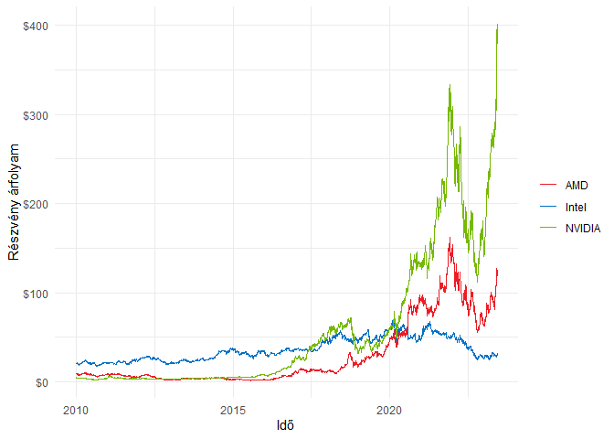

Budapesti lakásárak elemzése
================
Dittrich Levente
2023-06-08

- <a href="#kezdeti-beállítások" id="toc-kezdeti-beállítások">Kezdeti
  beállítások</a>
  - <a href="#használt-package-ek" id="toc-használt-package-ek">Használt
    package-ek</a>
  - <a href="#adatok-megszerzése" id="toc-adatok-megszerzése">Adatok
    megszerzése</a>
  - <a href="#adatok-átalakítása" id="toc-adatok-átalakítása">Adatok
    átalakítása</a>
- <a href="#adatvizualizáció"
  id="toc-adatvizualizáció">Adatvizualizáció</a>

Ebben a portfolió fejezetben azt vizsgálom meg, hogy az
[AMD](https://finance.yahoo.com/quote/AMD?p=AMD&.tsrc=fin-srch),
[NVIDIA](https://finance.yahoo.com/quote/NVDA?p=NVDA&.tsrc=fin-srch) és
[Intel](https://finance.yahoo.com/quote/INTC?p=INTC&.tsrc=fin-srch)
vállalatok részvényeinak árfolyamára fogok VECM vagy VAR modellt
illeszteni, attól függően, hogy van-e közös hosszútávú pályájuk.

Mindhárom vállalat székhelye a kaliforniai Santa Claraban található,
azonban nem csak az a közös bennük, hanem a tevékenységük is hasonló.
Ezek a vállalatok mind mikro- és grafikus proceszorokkal foglalkoznak
elsősorban. A napi gyakoriságú részvényadatokat a Yahoo Finance-ről
töltöm le, viszont egy meghatározott intervallumban, így
reprodukálhatóak lesznek eredményeim.

# Kezdeti beállítások

## Használt package-ek

``` r
library(quantmod)
library(tidyverse)
library(knitr)
```

Egy részvénynek egy napra több értékei is lehet, például az adott napi
maximum, minimum, a nyitó vagy záró értéke. A továbbiakban az egyes
részvények záró értékeivel fogok dolgozni.

## Adatok megszerzése

``` r
intel = getSymbols("INTC", src = "yahoo", auto.assign = F, from = "2010-01-01", to = "2023-06-01")
amd = getSymbols("AMD", src = "yahoo", auto.assign = F, from = "2010-01-01", to = "2023-06-01")
nvidia = getSymbols("NVDA", src = "yahoo", auto.assign = F, from = "2010-01-01", to = "2023-06-01")
```

## Adatok átalakítása

Érdemes az adatokat nem xts formátumban egyenként, hanem dataframe-ként
egyben tárolni, hogy később könnyebb legyen a munka.

``` r
df = data.frame(
  time = index(intel),
  intc = as.numeric(intel$INTC.Close),
  amd = as.numeric(amd$AMD.Close),
  nvda = as.numeric(nvidia$NVDA.Close)
)
rm(intel, amd, nvidia)
kable(head(df))
```

| time       |  intc |  amd |   nvda |
|:-----------|------:|-----:|-------:|
| 2010-01-04 | 20.88 | 9.70 | 4.6225 |
| 2010-01-05 | 20.87 | 9.71 | 4.6900 |
| 2010-01-06 | 20.80 | 9.57 | 4.7200 |
| 2010-01-07 | 20.60 | 9.47 | 4.6275 |
| 2010-01-08 | 20.83 | 9.43 | 4.6375 |
| 2010-01-11 | 20.95 | 9.14 | 4.5725 |

Az adatokat tartalmazó dataframe változói a következők:

| Változó neve | Leírás                                    | Mértékegység |
|:-------------|:------------------------------------------|:-------------|
| time         | Idő(az adott nap)                         | Dátum        |
| intc         | Az adott napi Intel részvény záró értéke  | \$           |
| amd          | Az adott napi AMD részvény záró értéke    | \$           |
| nvda         | Az adott napi NVIDIA részvény záró értéke | \$           |

# Adatvizualizáció

``` r
ggplot(df, aes(x = time))+
  geom_line(aes(y = intc, col = "Intel"))+
  geom_line(aes(y = amd, col = "AMD"))+
  geom_line(aes(y = nvda, col = "NVIDIA"))+
  scale_y_continuous(labels = scales::dollar_format())+
  scale_color_manual(values = c("#ED1C24", "#0071C5", "#76B900"))+
  theme_minimal()+
  theme(legend.title = element_blank())+
  labs(x = "Idő", y = "Részvény árfolyam")
```

<!-- -->
