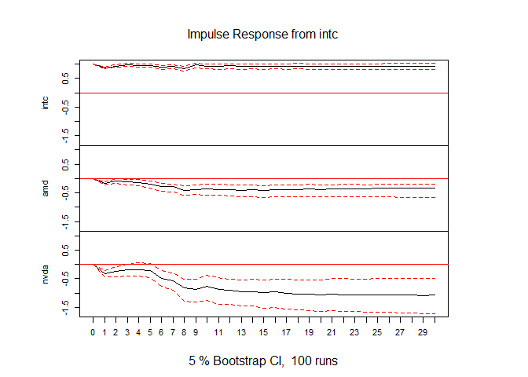
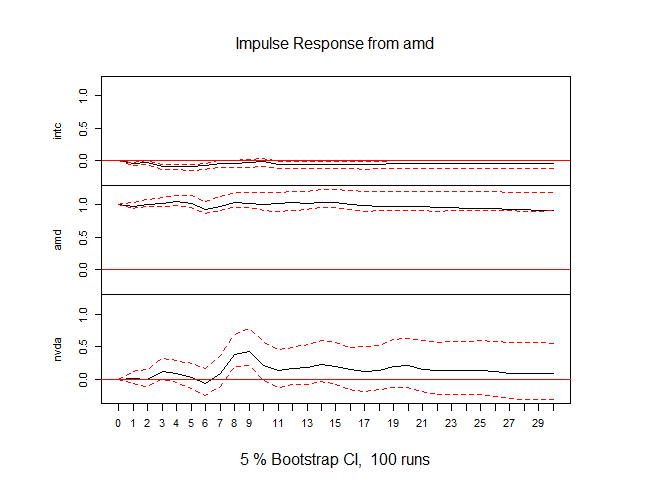
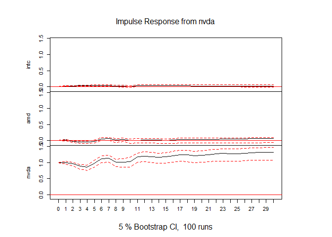

Budapesti lakásárak elemzése
================
Dittrich Levente
2023-06-16

- [Kezdeti beállítások](#kezdeti-beállítások)
  - [Használt package-ek](#használt-package-ek)
  - [Adatok megszerzése](#adatok-megszerzése)
  - [Adatok átalakítása](#adatok-átalakítása)
- [Adatvizualizáció](#adatvizualizáció)
- [Kointegréció tesztelése](#kointegréció-tesztelése)
- [Optimális késleltetés
  megtalálása](#optimális-késleltetés-megtalálása)
  - [Stacionaritás](#stacionaritás)
  - [Késleltetés meghatározása](#késleltetés-meghatározása)
- [Modellépítés](#modellépítés)
  - [Alapmodell](#alapmodell)
  - [Modellszűkítés](#modellszűkítés)
  - [Stabilitás tesztelése](#stabilitás-tesztelése)
- [Granger-okság](#granger-okság)
- [Impulzus-válaszfüggvények](#impulzus-válaszfüggvények)
- [Becslési variancia dekompozíció](#becslési-variancia-dekompozíció)

Ebben a portfolió fejezetben azt vizsgálom meg, hogy az
[AMD](https://finance.yahoo.com/quote/AMD?p=AMD&.tsrc=fin-srch),
[NVIDIA](https://finance.yahoo.com/quote/NVDA?p=NVDA&.tsrc=fin-srch) és
[Intel](https://finance.yahoo.com/quote/INTC?p=INTC&.tsrc=fin-srch)
vállalatok részvényeinak árfolyamára fogok VECM vagy VAR modellt
illeszteni, attól függően, hogy van-e közös hosszútávú pályájuk.

Mindhárom vállalat székhelye a kaliforniai Santa Claraban található,
azonban nem csak az a közös bennük, hanem a tevékenységük is hasonló.
Ezek a vállalatok mind mikro- és grafikus proceszorokkal foglalkoznak
elsősorban. A napi gyakoriságú részvényadatokat a Yahoo Finance-ről
töltöm le, viszont egy meghatározott intervallumban, így
reprodukálhatóak lesznek eredményeim.

# Kezdeti beállítások

## Használt package-ek

``` r
library(quantmod)
library(tidyverse)
library(knitr)
library(urca)
library(lmtest)
library(aTSA)
library(vars)
library(tsDyn)
library(aod)
```

Egy részvénynek egy napra több értékei is lehet, például az adott napi
maximum, minimum, a nyitó vagy záró értéke. A továbbiakban az egyes
részvények záró értékeivel fogok dolgozni.

## Adatok megszerzése

``` r
intel = getSymbols("INTC", src = "yahoo", auto.assign = F, from = "2010-01-01", to = "2023-06-01")
amd = getSymbols("AMD", src = "yahoo", auto.assign = F, from = "2010-01-01", to = "2023-06-01")
nvidia = getSymbols("NVDA", src = "yahoo", auto.assign = F, from = "2010-01-01", to = "2023-06-01")
```

## Adatok átalakítása

Érdemes az adatokat nem xts formátumban egyenként, hanem dataframe-ként
egyben tárolni, hogy később könnyebb legyen a munka.

``` r
df = data.frame(
  time = index(intel),
  intc = as.numeric(intel$INTC.Close),
  amd = as.numeric(amd$AMD.Close),
  nvda = as.numeric(nvidia$NVDA.Close)
)
rm(intel, amd, nvidia)
kable(head(df))
```

| time       |  intc |  amd |   nvda |
|:-----------|------:|-----:|-------:|
| 2010-01-04 | 20.88 | 9.70 | 4.6225 |
| 2010-01-05 | 20.87 | 9.71 | 4.6900 |
| 2010-01-06 | 20.80 | 9.57 | 4.7200 |
| 2010-01-07 | 20.60 | 9.47 | 4.6275 |
| 2010-01-08 | 20.83 | 9.43 | 4.6375 |
| 2010-01-11 | 20.95 | 9.14 | 4.5725 |

Az adatokat tartalmazó dataframe változói a következők:

| Változó neve | Leírás                                    | Mértékegység |
|:-------------|:------------------------------------------|:-------------|
| time         | Idő(az adott nap)                         | Dátum        |
| intc         | Az adott napi Intel részvény záró értéke  | \$           |
| amd          | Az adott napi AMD részvény záró értéke    | \$           |
| nvda         | Az adott napi NVIDIA részvény záró értéke | \$           |

3375 megfigyelés van mindhárom változóból, ez mindenképpen elegendő lesz
a modellépítéshez.

# Adatvizualizáció

``` r
ggplot(df, aes(x = time))+
  geom_line(aes(y = intc, col = "Intel"))+
  geom_line(aes(y = amd, col = "AMD"))+
  geom_line(aes(y = nvda, col = "NVIDIA"))+
  scale_y_continuous(labels = scales::dollar_format())+
  scale_color_manual(values = c("#ED1C24", "#0071C5", "#76B900"))+
  theme_minimal()+
  theme(legend.title = element_blank())+
  labs(x = "Idő", y = "Részvény árfolyam")
```

<!-- -->

Már a grafikonon is látszik, hogy valószínűleg nem stacionerek az
idősorok. Látható, hogy a kezdetben az NVIDIA és az AMD együtt mozgott,
ahogy az Intel is magasabb pályán, de hasonlóan. Ezt követően körülbelül
2015 Q4-től erőteljes emelkedésbe kezdett az NVIDIA, amit az AMD
nagyrészt lekövetett, azonban korántsem olyan meredeken. Az Intel is
növekedett ez idő alatt, de nem tűnik úgy, mintha együtt mozgott volna a
másik két céggel. Ez lehet akár azért is, mert ezidő tájt kezdődött el a
kriptobányászat már terjengeni a levegőben (de csak nagyon
szubkultúrális szinten ekkor még, [2017 decemerétől lesz világszinten
felkapott](https://trends.google.com/trends/explore?date=all&q=%2Fm%2F05p0rrx&hl=hu)),
ami nagyon videókártya-igényes tevékenység. Mindhárom cégnél 2021 végén
volt egy csúcspot, ami után csökkenni kezdett az árfolyamuk, majd 2022
Q4-től megint emelkedés látszott, az NVIDIA árfolyama a 2021-es csúcsát
is túlszárnyalta.

# Kointegréció tesztelése

Ahhoz, hogy tudjam, hogy VEC(Vector Error Correction) vagy VAR(Vector
AutoRegression) modellt kell-e használjak, meg kell állapítanom, hogy
van-e közös hosszútávú pályájuk az idősoroknak. Kointegráció esetén VEC
modell a megfelelő, míg ha nincs közös távú hosszútávú pályája az
idósoroknak, akkor VAR modellt kell alkalmazzak.

Erre egy *Johansen-tesztet* fogok végezni. A teszt érdekessége, hogy
több nullhipotézist is felvet. Ez esetben a nullhipotézisek a
következők, melyekben *r* a közös hosszútávú pályák száma:

- H0: $r = 0$ \| H1: $r > 0$
- H0: $r \le 1$ \| H1: $r > 1$
- H0: $r \le 2$ \| H1: $r > 2$

Mivel összesen 3 db idősorom van, ezért maximum 2 db közös hosszútávú
pálya lehetséges (a kódban ez a *K* paraméter).

``` r
johansen_test = ca.jo(df[,-1], type = "eigen",  K = 2, ecdet = "const", spec = "longrun")
summary(johansen_test)
```

    ## 
    ## ###################### 
    ## # Johansen-Procedure # 
    ## ###################### 
    ## 
    ## Test type: maximal eigenvalue statistic (lambda max) , without linear trend and constant in cointegration 
    ## 
    ## Eigenvalues (lambda):
    ## [1] 5.063385e-03 2.381383e-03 8.799114e-04 4.502479e-19
    ## 
    ## Values of teststatistic and critical values of test:
    ## 
    ##           test 10pct  5pct  1pct
    ## r <= 2 |  2.97  7.52  9.24 12.97
    ## r <= 1 |  8.04 13.75 15.67 20.20
    ## r = 0  | 17.12 19.77 22.00 26.81
    ## 
    ## Eigenvectors, normalised to first column:
    ## (These are the cointegration relations)
    ## 
    ##               intc.l2      amd.l2     nvda.l2  constant
    ## intc.l2    1.00000000   1.0000000   1.0000000  1.000000
    ## amd.l2     0.06608674  -1.0293819   1.2081244  2.332413
    ## nvda.l2   -0.40668645   0.4136885  -0.4548912 -1.247798
    ## constant -26.42227831 -27.1668824 -57.8211496  1.023926
    ## 
    ## Weights W:
    ## (This is the loading matrix)
    ## 
    ##              intc.l2        amd.l2       nvda.l2      constant
    ## intc.d  0.0004994377 -0.0007538154 -0.0008416566  1.275210e-18
    ## amd.d  -0.0004713206  0.0046726538 -0.0010653154  4.234973e-20
    ## nvda.d -0.0060660953  0.0048779829 -0.0023863493 -1.978401e-19

A teszt egy jobboldali próba, ez azt jelenti, hogy akkor tudjuk
elfogadni a nullhipotéziseket, ha az adott próbafüggvény kisebb vagy
egyenlő a kritikus értéknél. $H0: r = 0$ Minden szokványos
szignifikanciaszinten elfogadható. $H0: r \le 1$ Minden szokványos
szignifikanciaszinten elfogadható. $H0: r \le 2$ Minden szokványos
szignifikanciaszinten elfogadható.

Ilyen esetben én a kettő közös hosszútávú pályát venném kiindulópontnak,
amennyiben nem lesz szignifikáns ECT2, akkor megfontolom az egy
hosszútávú pályára váltást.

# Optimális késleltetés megtalálása

Meg kellene határozzam az optimális késleltetést a VEC modellhez. Ez
több lépésben fog megtörténni, először az idősorok stacionaritását kell
tesztelnem. Amennyiben van egységgyök az idősorban, akkor stacionerré
kell alakítanom őket majd mintha VAR modellhez keresném, meg kell
határozzam az optimális késleltetést az információs kritériumokat
felhasználva.

## Stacionaritás

Az erős stacionaritás azt jelenti, hogy az idősorok minden véges
dimenziós eloszlása eltolásinvariás. Ez egy olyan erős követelmény, amit
inkább a valószínűségszámításban használnak gyakran, azonban
ökonometriában túl szigorú követelmény, ezért szokás gyenge
stacionaritással dolgozni. Ez azt jelenti, hogy az idősor szórása és
várható értéke időben állandó. A stacionaritás teszteléséhez egy
Augmented Dickey-Fuller tesztet fogok végezni.

Az ADF teszt hipotézisei:

- H0: Az idősor nem stacioner, $\phi = 0$
- H1: Az idősor stacionárius, $\phi \neq 0$

A teszt nem csak egyféle módon végzi a tesztet, random-walkkal, valamint
random walkkal és trenddel is megnézi a stacionaritást.

``` r
adf.test(df$intc)
```

    ## Augmented Dickey-Fuller Test 
    ## alternative: stationary 
    ##  
    ## Type 1: no drift no trend 
    ##       lag    ADF p.value
    ##  [1,]   0 -0.459   0.512
    ##  [2,]   1 -0.346   0.544
    ##  [3,]   2 -0.379   0.535
    ##  [4,]   3 -0.405   0.527
    ##  [5,]   4 -0.386   0.533
    ##  [6,]   5 -0.388   0.532
    ##  [7,]   6 -0.345   0.545
    ##  [8,]   7 -0.383   0.534
    ##  [9,]   8 -0.336   0.547
    ## Type 2: with drift no trend 
    ##       lag   ADF p.value
    ##  [1,]   0 -2.02   0.320
    ##  [2,]   1 -1.78   0.417
    ##  [3,]   2 -1.85   0.387
    ##  [4,]   3 -1.93   0.358
    ##  [5,]   4 -1.87   0.379
    ##  [6,]   5 -1.87   0.381
    ##  [7,]   6 -1.80   0.409
    ##  [8,]   7 -1.86   0.383
    ##  [9,]   8 -1.73   0.434
    ## Type 3: with drift and trend 
    ##       lag   ADF p.value
    ##  [1,]   0 -2.23   0.479
    ##  [2,]   1 -1.70   0.704
    ##  [3,]   2 -1.87   0.632
    ##  [4,]   3 -2.02   0.566
    ##  [5,]   4 -1.92   0.610
    ##  [6,]   5 -1.92   0.611
    ##  [7,]   6 -1.74   0.689
    ##  [8,]   7 -1.91   0.617
    ##  [9,]   8 -1.65   0.727
    ## ---- 
    ## Note: in fact, p.value = 0.01 means p.value <= 0.01

``` r
adf.test(df$amd)
```

    ## Augmented Dickey-Fuller Test 
    ## alternative: stationary 
    ##  
    ## Type 1: no drift no trend 
    ##       lag   ADF p.value
    ##  [1,]   0 0.647   0.830
    ##  [2,]   1 0.720   0.851
    ##  [3,]   2 0.787   0.870
    ##  [4,]   3 0.813   0.878
    ##  [5,]   4 0.779   0.868
    ##  [6,]   5 0.774   0.867
    ##  [7,]   6 0.747   0.859
    ##  [8,]   7 0.610   0.819
    ##  [9,]   8 0.642   0.829
    ## Type 2: with drift no trend 
    ##       lag      ADF p.value
    ##  [1,]   0 -0.11653   0.944
    ##  [2,]   1 -0.04887   0.952
    ##  [3,]   2  0.01145   0.957
    ##  [4,]   3  0.03446   0.958
    ##  [5,]   4  0.00386   0.956
    ##  [6,]   5 -0.00259   0.955
    ##  [7,]   6 -0.03059   0.953
    ##  [8,]   7 -0.15106   0.939
    ##  [9,]   8 -0.12257   0.943
    ## Type 3: with drift and trend 
    ##       lag   ADF p.value
    ##  [1,]   0 -1.92   0.612
    ##  [2,]   1 -1.86   0.638
    ##  [3,]   2 -1.80   0.662
    ##  [4,]   3 -1.78   0.671
    ##  [5,]   4 -1.81   0.660
    ##  [6,]   5 -1.81   0.660
    ##  [7,]   6 -1.82   0.653
    ##  [8,]   7 -1.95   0.599
    ##  [9,]   8 -1.92   0.612
    ## ---- 
    ## Note: in fact, p.value = 0.01 means p.value <= 0.01

``` r
adf.test(df$nvda)
```

    ## Augmented Dickey-Fuller Test 
    ## alternative: stationary 
    ##  
    ## Type 1: no drift no trend 
    ##       lag  ADF p.value
    ##  [1,]   0 2.76    0.99
    ##  [2,]   1 2.83    0.99
    ##  [3,]   2 3.04    0.99
    ##  [4,]   3 3.25    0.99
    ##  [5,]   4 3.41    0.99
    ##  [6,]   5 3.07    0.99
    ##  [7,]   6 2.75    0.99
    ##  [8,]   7 2.54    0.99
    ##  [9,]   8 2.59    0.99
    ## Type 2: with drift no trend 
    ##       lag  ADF p.value
    ##  [1,]   0 2.04    0.99
    ##  [2,]   1 2.11    0.99
    ##  [3,]   2 2.31    0.99
    ##  [4,]   3 2.51    0.99
    ##  [5,]   4 2.66    0.99
    ##  [6,]   5 2.35    0.99
    ##  [7,]   6 2.06    0.99
    ##  [8,]   7 1.86    0.99
    ##  [9,]   8 1.92    0.99
    ## Type 3: with drift and trend 
    ##       lag    ADF p.value
    ##  [1,]   0 0.2083    0.99
    ##  [2,]   1 0.2819    0.99
    ##  [3,]   2 0.4803    0.99
    ##  [4,]   3 0.6804    0.99
    ##  [5,]   4 0.8161    0.99
    ##  [6,]   5 0.5466    0.99
    ##  [7,]   6 0.2765    0.99
    ##  [8,]   7 0.0869    0.99
    ##  [9,]   8 0.1436    0.99
    ## ---- 
    ## Note: in fact, p.value = 0.01 means p.value <= 0.01

Egyik idősor esetében sem lehet elutasítani a nullhipotézist, minden
idősorom stacionárius.

``` r
adf.test(diff(df$intc))
```

    ## Augmented Dickey-Fuller Test 
    ## alternative: stationary 
    ##  
    ## Type 1: no drift no trend 
    ##       lag   ADF p.value
    ##  [1,]   0 -68.1    0.01
    ##  [2,]   1 -42.0    0.01
    ##  [3,]   2 -32.5    0.01
    ##  [4,]   3 -29.2    0.01
    ##  [5,]   4 -26.1    0.01
    ##  [6,]   5 -25.2    0.01
    ##  [7,]   6 -21.9    0.01
    ##  [8,]   7 -22.2    0.01
    ##  [9,]   8 -19.1    0.01
    ## Type 2: with drift no trend 
    ##       lag   ADF p.value
    ##  [1,]   0 -68.0    0.01
    ##  [2,]   1 -42.0    0.01
    ##  [3,]   2 -32.5    0.01
    ##  [4,]   3 -29.2    0.01
    ##  [5,]   4 -26.1    0.01
    ##  [6,]   5 -25.2    0.01
    ##  [7,]   6 -21.9    0.01
    ##  [8,]   7 -22.2    0.01
    ##  [9,]   8 -19.1    0.01
    ## Type 3: with drift and trend 
    ##       lag   ADF p.value
    ##  [1,]   0 -68.1    0.01
    ##  [2,]   1 -42.0    0.01
    ##  [3,]   2 -32.5    0.01
    ##  [4,]   3 -29.2    0.01
    ##  [5,]   4 -26.1    0.01
    ##  [6,]   5 -25.2    0.01
    ##  [7,]   6 -22.0    0.01
    ##  [8,]   7 -22.2    0.01
    ##  [9,]   8 -19.1    0.01
    ## ---- 
    ## Note: in fact, p.value = 0.01 means p.value <= 0.01

``` r
adf.test(diff(df$amd))
```

    ## Augmented Dickey-Fuller Test 
    ## alternative: stationary 
    ##  
    ## Type 1: no drift no trend 
    ##       lag   ADF p.value
    ##  [1,]   0 -59.4    0.01
    ##  [2,]   1 -42.4    0.01
    ##  [3,]   2 -34.5    0.01
    ##  [4,]   3 -29.2    0.01
    ##  [5,]   4 -26.0    0.01
    ##  [6,]   5 -23.4    0.01
    ##  [7,]   6 -20.4    0.01
    ##  [8,]   7 -19.5    0.01
    ##  [9,]   8 -18.1    0.01
    ## Type 2: with drift no trend 
    ##       lag   ADF p.value
    ##  [1,]   0 -59.4    0.01
    ##  [2,]   1 -42.4    0.01
    ##  [3,]   2 -34.5    0.01
    ##  [4,]   3 -29.2    0.01
    ##  [5,]   4 -26.0    0.01
    ##  [6,]   5 -23.4    0.01
    ##  [7,]   6 -20.4    0.01
    ##  [8,]   7 -19.5    0.01
    ##  [9,]   8 -18.1    0.01
    ## Type 3: with drift and trend 
    ##       lag   ADF p.value
    ##  [1,]   0 -59.4    0.01
    ##  [2,]   1 -42.4    0.01
    ##  [3,]   2 -34.6    0.01
    ##  [4,]   3 -29.3    0.01
    ##  [5,]   4 -26.0    0.01
    ##  [6,]   5 -23.4    0.01
    ##  [7,]   6 -20.4    0.01
    ##  [8,]   7 -19.5    0.01
    ##  [9,]   8 -18.2    0.01
    ## ---- 
    ## Note: in fact, p.value = 0.01 means p.value <= 0.01

``` r
adf.test(diff(df$nvda))
```

    ## Augmented Dickey-Fuller Test 
    ## alternative: stationary 
    ##  
    ## Type 1: no drift no trend 
    ##       lag   ADF p.value
    ##  [1,]   0 -58.3    0.01
    ##  [2,]   1 -42.7    0.01
    ##  [3,]   2 -35.7    0.01
    ##  [4,]   3 -31.0    0.01
    ##  [5,]   4 -24.5    0.01
    ##  [6,]   5 -20.1    0.01
    ##  [7,]   6 -17.5    0.01
    ##  [8,]   7 -16.9    0.01
    ##  [9,]   8 -15.4    0.01
    ## Type 2: with drift no trend 
    ##       lag   ADF p.value
    ##  [1,]   0 -58.4    0.01
    ##  [2,]   1 -42.7    0.01
    ##  [3,]   2 -35.8    0.01
    ##  [4,]   3 -31.1    0.01
    ##  [5,]   4 -24.6    0.01
    ##  [6,]   5 -20.2    0.01
    ##  [7,]   6 -17.6    0.01
    ##  [8,]   7 -17.0    0.01
    ##  [9,]   8 -15.5    0.01
    ## Type 3: with drift and trend 
    ##       lag   ADF p.value
    ##  [1,]   0 -58.5    0.01
    ##  [2,]   1 -42.8    0.01
    ##  [3,]   2 -35.9    0.01
    ##  [4,]   3 -31.3    0.01
    ##  [5,]   4 -24.7    0.01
    ##  [6,]   5 -20.4    0.01
    ##  [7,]   6 -17.8    0.01
    ##  [8,]   7 -17.1    0.01
    ##  [9,]   8 -15.7    0.01
    ## ---- 
    ## Note: in fact, p.value = 0.01 means p.value <= 0.01

A differenciált idősorok már stacionerek, nincsen egységgyök a
modellben. Minden esetben a p-értékek 1% alatt vannak, a
nullhipotéziseket el lehet vetni.

## Késleltetés meghatározása

A differenciált idősorokat a dataframe-be lementem és így nézem meg az
optimális lag-okat.

``` r
df$d_intc = c(NA, diff(df$intc))
df$d_amd = c(NA, diff(df$amd))
df$d_nvda = c(NA, diff(df$nvda))

VARselect(df[-1,5:7], lag.max = 30)
```

    ## $selection
    ## AIC(n)  HQ(n)  SC(n) FPE(n) 
    ##     30     11      1     30 
    ## 
    ## $criteria
    ##               1        2        3        4        5        6        7        8
    ## AIC(n) 1.942677 1.937631 1.928481 1.926575 1.914196 1.898654 1.894745 1.880049
    ## HQ(n)  1.950526 1.951368 1.948105 1.952086 1.945595 1.935939 1.937918 1.929109
    ## SC(n)  1.964620 1.976033 1.983339 1.997891 2.001970 2.002886 2.015435 2.017196
    ## FPE(n) 6.977403 6.942288 6.879052 6.865954 6.781488 6.676903 6.650859 6.553831
    ##               9       10       11       12       13       14       15       16
    ## AIC(n) 1.873669 1.862212 1.849318 1.851519 1.849803 1.850782 1.848125 1.847108
    ## HQ(n)  1.928616 1.923046 1.916039 1.924127 1.928299 1.935164 1.938394 1.943265
    ## SC(n)  2.027273 2.032274 2.035838 2.054496 2.069238 2.086674 2.100475 2.115916
    ## FPE(n) 6.512151 6.437970 6.355498 6.369505 6.358591 6.364819 6.347937 6.341491
    ##              17       18       19       20       21       22       23       24
    ## AIC(n) 1.835616 1.829742 1.826520 1.827104 1.814510 1.800410 1.800547 1.801087
    ## HQ(n)  1.937660 1.937673 1.940339 1.946809 1.940103 1.931890 1.937914 1.944342
    ## SC(n)  2.120882 2.131465 2.144701 2.161742 2.165606 2.167963 2.184558 2.201556
    ## FPE(n) 6.269042 6.232334 6.212295 6.215932 6.138154 6.052224 6.053069 6.056355
    ##              25       26       27       28       29       30
    ## AIC(n) 1.799938 1.798898 1.798040 1.793943 1.785402 1.775901
    ## HQ(n)  1.949080 1.953926 1.958956 1.960746 1.958092 1.954479
    ## SC(n)  2.216865 2.232282 2.247882 2.260242 2.268159 2.275116
    ## FPE(n) 6.049416 6.043142 6.037980 6.013313 5.962195 5.905839

Mind az AIC, mind az FPE nagyon nagy lag-okat javasol. Ezeknél az
információs kritériumoknál szigorúbb Hannan-Quinn információs kritérium
a 11-es késleltetést preferálja, míg az annál is szigorúbb
Bayes-Schwartz értéke az 1-es késleltetésnél a legkisebb. Ebben az
esetben a Hannan-Quinn infromációs kritérium szerint fogok dönteni,
11-es késleletés lesz az alapmodellemben a kettő darab hosszútávú közös
pálya mellett.

# Modellépítés

## Alapmodell

``` r
alapmodell = VECM(df[,2:4], lag = 11, r = 2)
```

    ## Warning in lineVar(data, lag, r = r, include = include, model = "VECM", : Estimation of more than 1 coint relationship is not possible with estim '2OLS'. Switched to Johansen 'ML'

``` r
summary(alapmodell)
```

    ## #############
    ## ###Model VECM 
    ## #############
    ## Full sample size: 3375   End sample size: 3363
    ## Number of variables: 3   Number of estimated slope parameters 108
    ## AIC 6161.923     BIC 6835.188    SSR 46727.5
    ## Cointegrating vector (estimated by ML):
    ##            intc amd       nvda
    ## r1 1.000000e+00   0 -0.3736951
    ## r2 5.551115e-17   1 -0.7300483
    ## 
    ## 
    ##               ECT1                ECT2                Intercept         
    ## Equation intc -0.0003(0.0011)     0.0011(0.0012)      0.0207(0.0336)    
    ## Equation amd  0.0051(0.0022)*     -0.0063(0.0024)**   -0.1225(0.0664).  
    ## Equation nvda 0.0008(0.0048)      -0.0060(0.0051)     0.0109(0.1420)    
    ##               intc -1            amd -1              nvda -1            
    ## Equation intc -0.1306(0.0186)*** -0.0548(0.0136)***  0.0231(0.0064)***  
    ## Equation amd  -0.1616(0.0367)*** -0.0173(0.0268)     0.0145(0.0125)     
    ## Equation nvda -0.3299(0.0786)*** 0.0180(0.0573)      -0.0056(0.0268)    
    ##               intc -2            amd -2              nvda -2            
    ## Equation intc 0.0448(0.0188)*    0.0127(0.0136)      -0.0038(0.0064)    
    ## Equation amd  0.0531(0.0370)     0.0289(0.0269)      -0.0437(0.0126)*** 
    ## Equation nvda 0.0506(0.0792)     -0.0348(0.0575)     -0.0381(0.0269)    
    ##               intc -3             amd -3             nvda -3            
    ## Equation intc 0.0628(0.0187)***   -0.0568(0.0136)*** 0.0182(0.0064)**   
    ## Equation amd  -0.0388(0.0369)     0.0259(0.0269)     -0.0167(0.0126)    
    ## Equation nvda 0.0591(0.0789)      0.1425(0.0576)*    -0.0852(0.0270)**  
    ##               intc -4             amd -4              nvda -4            
    ## Equation intc -0.0224(0.0189)     -0.0102(0.0140)     -0.0010(0.0070)    
    ## Equation amd  -0.0307(0.0373)     0.0194(0.0276)      -0.0003(0.0139)    
    ## Equation nvda 0.0256(0.0798)      -0.0380(0.0592)     -0.0309(0.0297)    
    ##               intc -5             amd -5              nvda -5           
    ## Equation intc -0.0134(0.0189)     -0.0012(0.0140)     0.0068(0.0070)    
    ## Equation amd  -0.0464(0.0373)     -0.0083(0.0277)     0.0097(0.0139)    
    ## Equation nvda -0.0631(0.0798)     -0.0551(0.0592)     0.1148(0.0298)*** 
    ##               intc -6            amd -6              nvda -6            
    ## Equation intc -0.0627(0.0189)*** 0.0179(0.0140)      -0.0021(0.0071)    
    ## Equation amd  -0.0974(0.0372)**  -0.0889(0.0276)**   0.0746(0.0139)***  
    ## Equation nvda -0.2353(0.0796)**  -0.0825(0.0591)     0.1425(0.0298)***  
    ##               intc -7             amd -7             nvda -7           
    ## Equation intc 0.0143(0.0189)      0.0267(0.0140).    0.0017(0.0071)    
    ## Equation amd  -0.0244(0.0373)     0.0444(0.0276)     0.0110(0.0140)    
    ## Equation nvda -0.0986(0.0798)     0.1487(0.0590)*    0.0115(0.0299)    
    ##               intc -8            amd -8             nvda -8           
    ## Equation intc -0.0538(0.0189)**  0.0028(0.0140)     -0.0134(0.0071).  
    ## Equation amd  -0.1141(0.0373)**  0.0669(0.0276)*    -0.0349(0.0139)*  
    ## Equation nvda -0.2454(0.0798)**  0.2980(0.0590)***  -0.1075(0.0298)***
    ##               intc -9             amd -9              nvda -9            
    ## Equation intc 0.0963(0.0189)***   -0.0057(0.0140)     -0.0034(0.0071)    
    ## Equation amd  -0.0255(0.0372)     -0.0243(0.0277)     0.0211(0.0140)     
    ## Equation nvda -0.1041(0.0796)     0.0253(0.0592)      0.0301(0.0299)     
    ##               intc -10            amd -10             nvda -10           
    ## Equation intc -0.0051(0.0189)     0.0225(0.0140)      -0.0093(0.0071)    
    ## Equation amd  0.0421(0.0374)      -0.0027(0.0277)     -0.0429(0.0140)**  
    ## Equation nvda 0.1181(0.0800)      -0.2010(0.0592)***  0.0159(0.0299)     
    ##               intc -11            amd -11             nvda -11           
    ## Equation intc -0.0112(0.0188)     -0.0403(0.0141)**   0.0184(0.0071)**   
    ## Equation amd  -0.0388(0.0370)     0.0318(0.0278)      -0.0036(0.0140)    
    ## Equation nvda -0.0821(0.0792)     -0.0406(0.0595)     0.1108(0.0300)***

A közös hosszútávú pálya koefficiensei csak az AMD esetében
szignifikánsak. Ezek jelentése a következő az AMD esetében:

- ECT1: amennyiben az AMD elmozdul az első közös hosszútávú pályától,
  akkor a következő időszakban 0,51%-al a távolodik még.
- ECT2: amennyiben az AMD elmozdul a második közös hosszútávú pályától,
  akkor az elmozdulás 0,63%-át hozza be a következő időszakban.

Érdemes kiemelni a kontextus miatt, hogy az Intel a x86 CPU-k piacának
nagy részét az [Intel
dominálja](https://www.statista.com/statistics/735904/worldwide-x86-intel-amd-market-share/),
míg a diszkrét GPU-k piacának nagy részét az [NVIDIA
uralja](https://www.pcworld.com/article/1526632/intel-is-already-tied-with-amd-for-desktop-gpu-sales.html).
A laptopokat is beleértve szintén az [Intel a legnagyobb
szereplő](https://www.statista.com/statistics/754557/worldwide-gpu-shipments-market-share-by-vendor/)
a GPU piacon. Azért érdemes külön választani a diszkrét és integrált
GPU-k piacát, mivel a 2010-es évek végétől kezdődő kriptovaluta
bányászatra elsősorban dedikált, asztali videókártyákat használnak, ami
egy időben okozott is hiányt, mivel a bányászok rengeteg GPU-t
vásároltak fel a piacról.

Valószínűnek tartom, hogy a két hosszútávú közös pálya a CPU és GPU
piacokat jelenti. Ha a szignifikanciaszinttől függetlenül nézzük a
pályák koefficienseit, akkor látható, hogy az első pályától való
eltérésnél az Intel közeledik, míg az AMD és az NVIDIA távolodik a
következő időszakban. A második hosszútávú közös pályát nézve pont
fordított a helyzet: az eltérés hatására az Intel távolodik, míg az AMD
és az NVIDIA ledolgozza az eltérés egy részét. Feltevésem szerint az
első hosszútávú pálya a processzorgyártók hosszútávú pályája, míg a
második közös hosszútávú pálya a GPU gyártóké.

Visszatérve az alapmodellre, nagyon érdekes, hogy az előző időszaki
Intel árfolyam mindegyik részvényre negatív hatással van. Végig a 11
késleltetésig nagyrészt vannak szignifikáns együtthatók, egyedül a
négyes késleltetésnél nincsen egyik egyenletben sem szingifikáns
koefficiens.

## Modellszűkítés

A modellszelekció miatt megnéztem több, más paraméterű modellt, ezek
közül kettőt emelnék ki:

Az egyik modellben egy közös hosszútávú pálya van 11 késleltetéssel:

``` r
szukitett_modell1 = VECM(df[,2:4], lag = 11, r = 1)
summary(szukitett_modell1)
```

    ## #############
    ## ###Model VECM 
    ## #############
    ## Full sample size: 3375   End sample size: 3363
    ## Number of variables: 3   Number of estimated slope parameters 105
    ## AIC 6167.099     BIC 6822.002    SSR 46780.28
    ## Cointegrating vector (estimated by 2OLS):
    ##    intc        amd     nvda
    ## r1    1 -0.9303583 0.161078
    ## 
    ## 
    ##               ECT                 Intercept           intc -1           
    ## Equation intc 0.0006(0.0008)      -0.0093(0.0198)     -0.1307(0.0186)***
    ## Equation amd  0.0022(0.0015)      -0.0086(0.0390)     -0.1624(0.0368)***
    ## Equation nvda -0.0022(0.0032)     0.1341(0.0835)      -0.3326(0.0786)***
    ##               amd -1              nvda -1            intc -2           
    ## Equation intc -0.0537(0.0136)***  0.0222(0.0063)***  0.0449(0.0188)*   
    ## Equation amd  -0.0202(0.0268)     0.0173(0.0125)     0.0520(0.0370)    
    ## Equation nvda 0.0117(0.0573)      0.0001(0.0267)     0.0475(0.0792)    
    ##               amd -2              nvda -2             intc -3            
    ## Equation intc 0.0139(0.0136)      -0.0047(0.0063)     0.0628(0.0187)***  
    ## Equation amd  0.0258(0.0268)      -0.0408(0.0125)**   -0.0397(0.0369)    
    ## Equation nvda -0.0416(0.0574)     -0.0323(0.0268)     0.0559(0.0789)     
    ##               amd -3             nvda -3             intc -4            
    ## Equation intc -0.0556(0.0136)*** 0.0173(0.0064)**    -0.0227(0.0189)    
    ## Equation amd  0.0227(0.0269)     -0.0137(0.0125)     -0.0310(0.0373)    
    ## Equation nvda 0.1357(0.0575)*    -0.0793(0.0268)**   0.0238(0.0798)     
    ##               amd -4              nvda -4             intc -5            
    ## Equation intc -0.0092(0.0140)     -0.0017(0.0070)     -0.0136(0.0189)    
    ## Equation amd  0.0167(0.0276)      0.0020(0.0139)      -0.0467(0.0373)    
    ## Equation nvda -0.0437(0.0591)     -0.0264(0.0297)     -0.0649(0.0798)    
    ##               amd -5              nvda -5            intc -6           
    ## Equation intc -0.0002(0.0140)     0.0062(0.0070)     -0.0628(0.0189)***
    ## Equation amd  -0.0111(0.0276)     0.0121(0.0139)     -0.0978(0.0372)** 
    ## Equation nvda -0.0608(0.0591)     0.1194(0.0297)***  -0.2374(0.0796)** 
    ##               amd -6              nvda -6             intc -7            
    ## Equation intc 0.0189(0.0140)      -0.0027(0.0070)     0.0141(0.0189)     
    ## Equation amd  -0.0916(0.0276)***  0.0769(0.0139)***   -0.0249(0.0373)    
    ## Equation nvda -0.0880(0.0591)     0.1470(0.0298)***   -0.1006(0.0798)    
    ##               amd -7             nvda -7            intc -8           
    ## Equation intc 0.0277(0.0140)*    0.0010(0.0071)     -0.0540(0.0189)** 
    ## Equation amd  0.0416(0.0276)     0.0134(0.0139)     -0.1146(0.0373)** 
    ## Equation nvda 0.1428(0.0590)*    0.0161(0.0298)     -0.2474(0.0798)** 
    ##               amd -8             nvda -8            intc -9            
    ## Equation intc 0.0038(0.0140)     -0.0141(0.0070)*   0.0960(0.0189)***  
    ## Equation amd  0.0642(0.0276)*    -0.0325(0.0139)*   -0.0257(0.0372)    
    ## Equation nvda 0.2923(0.0590)***  -0.1030(0.0297)*** -0.1056(0.0796)    
    ##               amd -9              nvda -9             intc -10           
    ## Equation intc -0.0047(0.0140)     -0.0041(0.0071)     -0.0055(0.0189)    
    ## Equation amd  -0.0272(0.0276)     0.0234(0.0139).     0.0424(0.0374)     
    ## Equation nvda 0.0193(0.0591)      0.0346(0.0298)      0.1173(0.0800)     
    ##               amd -10             nvda -10            intc -11           
    ## Equation intc 0.0235(0.0140).     -0.0099(0.0071)     -0.0117(0.0188)    
    ## Equation amd  -0.0056(0.0276)     -0.0407(0.0139)**   -0.0385(0.0370)    
    ## Equation nvda -0.2071(0.0592)***  0.0202(0.0298)      -0.0826(0.0792)    
    ##               amd -11             nvda -11           
    ## Equation intc -0.0392(0.0141)**   0.0178(0.0071)*    
    ## Equation amd  0.0289(0.0278)      -0.0014(0.0140)    
    ## Equation nvda -0.0466(0.0595)     0.1151(0.0299)***

A másik modellben pedig megmaradt a kettő közös hosszútávú pálya,
azonban a késleltetést a Bayes-Schwartz IC által preferált 1-es
késleltetésre cseréltem.

``` r
szukitett_modell2 = VECM(df[,2:4], lag = 1, r = 2)
```

    ## Warning in lineVar(data, lag, r = r, include = include, model = "VECM", : Estimation of more than 1 coint relationship is not possible with estim '2OLS'. Switched to Johansen 'ML'

``` r
summary(szukitett_modell2)
```

    ## #############
    ## ###Model VECM 
    ## #############
    ## Full sample size: 3375   End sample size: 3373
    ## Number of variables: 3   Number of estimated slope parameters 18
    ## AIC 6467.342     BIC 6589.813    SSR 49258.62
    ## Cointegrating vector (estimated by ML):
    ##    intc          amd       nvda
    ## r1    1 2.775558e-17 -0.4007844
    ## r2    0 1.000000e+00 -0.8199959
    ## 
    ## 
    ##               ECT1                ECT2                Intercept          
    ## Equation intc -0.0004(0.0012)     0.0010(0.0011)      0.0257(0.0367)     
    ## Equation amd  0.0043(0.0024).     -0.0042(0.0021)*    -0.1002(0.0722)    
    ## Equation nvda -0.0010(0.0051)     -0.0039(0.0046)     0.0567(0.1561)     
    ##               intc -1            amd -1              nvda -1           
    ## Equation intc -0.1521(0.0183)*** -0.0596(0.0135)***  0.0247(0.0063)*** 
    ## Equation amd  -0.1756(0.0360)*** -0.0330(0.0266)     0.0235(0.0124).   
    ## Equation nvda -0.3148(0.0779)*** -0.0152(0.0575)     0.0141(0.0267)

A modellek információs kritériumai:

| Modell      | ECT | Lag | AIC               | BIC         |
|:------------|:----|:----|:------------------|:------------|
| Alap        | 2   | 11  | 6161.923 \*       | 6835.188    |
| Szűkített 1 | 1   | 11  | 6167.099          | 6822.002    |
| Szűkített 2 | 2   | 1   | 6467.342          | 6589.813 \* |
|             |     |     | \* *Legkisebb IC* |             |

Az AIC szerint az alapmodell a jobb, míg a BIC szerint az egy
késleltetésű, ami érthető is, mivel akkor drasztikusan csökken a bevont
változók száma. Mivel egyértelműen nem tudom eldönteni, hogy szűkítsem-e
a modellt, ezért amellett döntök, hogy meghagyom az alapmodellt végleges
modellnek, mert egészen a 11 lagig vannak szignifikáns magyarázó
változók.

## Stabilitás tesztelése

A modell staibilitásának tesztelésére először megvizsgálom, hogy a
hibatagok fehérzajok-e, majd azt is megnézem, hogy normális
eloszlásúak-e.

A Breusch-Godfrey teszt nullhipotézise szerint az $\hat{u_t}$-re felírt
segédregresszóból $R^2 = 0$, vagyis a VECM egyenleteinek hibatagjai
fehérzajok.

``` r
lapply(as.data.frame(resid(alapmodell)), function(i) bgtest(i ~ 1, order = 11))
```

    ## $intc
    ## 
    ##  Breusch-Godfrey test for serial correlation of order up to 11
    ## 
    ## data:  i ~ 1
    ## LM test = 0.4159, df = 11, p-value = 1
    ## 
    ## 
    ## $amd
    ## 
    ##  Breusch-Godfrey test for serial correlation of order up to 11
    ## 
    ## data:  i ~ 1
    ## LM test = 0.77727, df = 11, p-value = 1
    ## 
    ## 
    ## $nvda
    ## 
    ##  Breusch-Godfrey test for serial correlation of order up to 11
    ## 
    ## data:  i ~ 1
    ## LM test = 1.8261, df = 11, p-value = 0.999

Nagyon magasak a p-értékek, a nullhipotézist nem lehet elvetni egyik
esetben sem.

A hibatagok normális eloszlásának is megvizsgálatához egy Shapiro-Wilk
tesztet fogok alkalmazni. A teszt hipotézisei:

- H0: a hibatagok normális eloszlásúak
- H1: a hibatagok nem normális eloszlásúak

``` r
lapply(as.data.frame(resid(alapmodell)), function(i) shapiro.test(i))
```

    ## $intc
    ## 
    ##  Shapiro-Wilk normality test
    ## 
    ## data:  i
    ## W = 0.84243, p-value < 2.2e-16
    ## 
    ## 
    ## $amd
    ## 
    ##  Shapiro-Wilk normality test
    ## 
    ## data:  i
    ## W = 0.71304, p-value < 2.2e-16
    ## 
    ## 
    ## $nvda
    ## 
    ##  Shapiro-Wilk normality test
    ## 
    ## data:  i
    ## W = 0.61958, p-value < 2.2e-16

Mindegyik tesztben nagyon alacsony p-értékek jöttek ki, H0-t el lehet
vetni még 1%-os szignifikancia szint mellett is. Egyik egyenlet
hibatagja sem normális eloszlású.

# Granger-okság

A Granger-okság két idősor kapcsolatát vizsgálja, definíció szerint $X$
idősor Granger okozza $Y$ idősort, ha $X$ valamely múltja szignifikáns
hatéssal van $Y$ aktuális értékére.

A VEC modelleknél a Granger okság vizsgálata bonyolultabb, mint a VAR
modelleknél. Először is meg kell keressem, hogy az egyes egyenletek a
koefficinsek és a variancia-kovariancia táblázatban hol helyezkednek el.

``` r
coef = coef(alapmodell)
knitr::kable(coef, format = "html")
```

<table>
<thead>
<tr>
<th style="text-align:left;">
</th>
<th style="text-align:right;">
ECT1
</th>
<th style="text-align:right;">
ECT2
</th>
<th style="text-align:right;">
Intercept
</th>
<th style="text-align:right;">
intc -1
</th>
<th style="text-align:right;">
amd -1
</th>
<th style="text-align:right;">
nvda -1
</th>
<th style="text-align:right;">
intc -2
</th>
<th style="text-align:right;">
amd -2
</th>
<th style="text-align:right;">
nvda -2
</th>
<th style="text-align:right;">
intc -3
</th>
<th style="text-align:right;">
amd -3
</th>
<th style="text-align:right;">
nvda -3
</th>
<th style="text-align:right;">
intc -4
</th>
<th style="text-align:right;">
amd -4
</th>
<th style="text-align:right;">
nvda -4
</th>
<th style="text-align:right;">
intc -5
</th>
<th style="text-align:right;">
amd -5
</th>
<th style="text-align:right;">
nvda -5
</th>
<th style="text-align:right;">
intc -6
</th>
<th style="text-align:right;">
amd -6
</th>
<th style="text-align:right;">
nvda -6
</th>
<th style="text-align:right;">
intc -7
</th>
<th style="text-align:right;">
amd -7
</th>
<th style="text-align:right;">
nvda -7
</th>
<th style="text-align:right;">
intc -8
</th>
<th style="text-align:right;">
amd -8
</th>
<th style="text-align:right;">
nvda -8
</th>
<th style="text-align:right;">
intc -9
</th>
<th style="text-align:right;">
amd -9
</th>
<th style="text-align:right;">
nvda -9
</th>
<th style="text-align:right;">
intc -10
</th>
<th style="text-align:right;">
amd -10
</th>
<th style="text-align:right;">
nvda -10
</th>
<th style="text-align:right;">
intc -11
</th>
<th style="text-align:right;">
amd -11
</th>
<th style="text-align:right;">
nvda -11
</th>
</tr>
</thead>
<tbody>
<tr>
<td style="text-align:left;">
Equation intc
</td>
<td style="text-align:right;">
-0.0002887
</td>
<td style="text-align:right;">
0.0011336
</td>
<td style="text-align:right;">
0.0206647
</td>
<td style="text-align:right;">
-0.1306407
</td>
<td style="text-align:right;">
-0.0548261
</td>
<td style="text-align:right;">
0.0230933
</td>
<td style="text-align:right;">
0.0448493
</td>
<td style="text-align:right;">
0.0127055
</td>
<td style="text-align:right;">
-0.0038036
</td>
<td style="text-align:right;">
0.0627727
</td>
<td style="text-align:right;">
-0.0568353
</td>
<td style="text-align:right;">
0.0182126
</td>
<td style="text-align:right;">
-0.0224372
</td>
<td style="text-align:right;">
-0.0101869
</td>
<td style="text-align:right;">
-0.0010459
</td>
<td style="text-align:right;">
-0.0133879
</td>
<td style="text-align:right;">
-0.0012052
</td>
<td style="text-align:right;">
0.0068455
</td>
<td style="text-align:right;">
-0.0626564
</td>
<td style="text-align:right;">
0.0178798
</td>
<td style="text-align:right;">
-0.0020523
</td>
<td style="text-align:right;">
0.0143140
</td>
<td style="text-align:right;">
0.0266619
</td>
<td style="text-align:right;">
0.0016722
</td>
<td style="text-align:right;">
-0.0537747
</td>
<td style="text-align:right;">
0.0028080
</td>
<td style="text-align:right;">
-0.0134435
</td>
<td style="text-align:right;">
0.0963068
</td>
<td style="text-align:right;">
-0.0057387
</td>
<td style="text-align:right;">
-0.0034314
</td>
<td style="text-align:right;">
-0.0050543
</td>
<td style="text-align:right;">
0.0224868
</td>
<td style="text-align:right;">
-0.0092940
</td>
<td style="text-align:right;">
-0.0112408
</td>
<td style="text-align:right;">
-0.0402887
</td>
<td style="text-align:right;">
0.0184204
</td>
</tr>
<tr>
<td style="text-align:left;">
Equation amd
</td>
<td style="text-align:right;">
0.0051499
</td>
<td style="text-align:right;">
-0.0062809
</td>
<td style="text-align:right;">
-0.1224576
</td>
<td style="text-align:right;">
-0.1616359
</td>
<td style="text-align:right;">
-0.0173300
</td>
<td style="text-align:right;">
0.0144505
</td>
<td style="text-align:right;">
0.0530602
</td>
<td style="text-align:right;">
0.0289443
</td>
<td style="text-align:right;">
-0.0436750
</td>
<td style="text-align:right;">
-0.0387628
</td>
<td style="text-align:right;">
0.0259036
</td>
<td style="text-align:right;">
-0.0167112
</td>
<td style="text-align:right;">
-0.0307061
</td>
<td style="text-align:right;">
0.0194400
</td>
<td style="text-align:right;">
-0.0002677
</td>
<td style="text-align:right;">
-0.0464096
</td>
<td style="text-align:right;">
-0.0083417
</td>
<td style="text-align:right;">
0.0097302
</td>
<td style="text-align:right;">
-0.0973558
</td>
<td style="text-align:right;">
-0.0889312
</td>
<td style="text-align:right;">
0.0745588
</td>
<td style="text-align:right;">
-0.0244132
</td>
<td style="text-align:right;">
0.0443845
</td>
<td style="text-align:right;">
0.0110122
</td>
<td style="text-align:right;">
-0.1141019
</td>
<td style="text-align:right;">
0.0669227
</td>
<td style="text-align:right;">
-0.0348592
</td>
<td style="text-align:right;">
-0.0254881
</td>
<td style="text-align:right;">
-0.0242897
</td>
<td style="text-align:right;">
0.0210901
</td>
<td style="text-align:right;">
0.0420955
</td>
<td style="text-align:right;">
-0.0026819
</td>
<td style="text-align:right;">
-0.0429324
</td>
<td style="text-align:right;">
-0.0388037
</td>
<td style="text-align:right;">
0.0317651
</td>
<td style="text-align:right;">
-0.0036154
</td>
</tr>
<tr>
<td style="text-align:left;">
Equation nvda
</td>
<td style="text-align:right;">
0.0008111
</td>
<td style="text-align:right;">
-0.0059725
</td>
<td style="text-align:right;">
0.0108887
</td>
<td style="text-align:right;">
-0.3298534
</td>
<td style="text-align:right;">
0.0180384
</td>
<td style="text-align:right;">
-0.0055881
</td>
<td style="text-align:right;">
0.0506139
</td>
<td style="text-align:right;">
-0.0347773
</td>
<td style="text-align:right;">
-0.0380863
</td>
<td style="text-align:right;">
0.0590962
</td>
<td style="text-align:right;">
0.1424988
</td>
<td style="text-align:right;">
-0.0852230
</td>
<td style="text-align:right;">
0.0256136
</td>
<td style="text-align:right;">
-0.0379689
</td>
<td style="text-align:right;">
-0.0308900
</td>
<td style="text-align:right;">
-0.0630760
</td>
<td style="text-align:right;">
-0.0550647
</td>
<td style="text-align:right;">
0.1148210
</td>
<td style="text-align:right;">
-0.2352900
</td>
<td style="text-align:right;">
-0.0825450
</td>
<td style="text-align:right;">
0.1424642
</td>
<td style="text-align:right;">
-0.0985549
</td>
<td style="text-align:right;">
0.1486755
</td>
<td style="text-align:right;">
0.0114834
</td>
<td style="text-align:right;">
-0.2454085
</td>
<td style="text-align:right;">
0.2980281
</td>
<td style="text-align:right;">
-0.1075408
</td>
<td style="text-align:right;">
-0.1041250
</td>
<td style="text-align:right;">
0.0253479
</td>
<td style="text-align:right;">
0.0300942
</td>
<td style="text-align:right;">
0.1180754
</td>
<td style="text-align:right;">
-0.2010228
</td>
<td style="text-align:right;">
0.0158699
</td>
<td style="text-align:right;">
-0.0820594
</td>
<td style="text-align:right;">
-0.0406338
</td>
<td style="text-align:right;">
0.1107549
</td>
</tr>
</tbody>
</table>

Az első egyenelet az intc, majd az amd és az nvda követi.

``` r
vcov = vcov(alapmodell)
```

A Variancia-kovariancia táblázatban a \[1:36,1:36\] helyen az intc,
\[37:72,37:72\] helyen az amd és végül a \[73:108,73:108\] helyen az
nvda egyenlete van. A táblázatot nem szándékozom megjeleníteni, mivel
feleslegesen sok helyet foglalna el, azonban a Githubon található `.rmd`
futtatásával meg lehet tekinteni.

A Granger okság szerint az az okozó változó, ami időben előbb van. A
Granger-okság tesztelésére egy Wald-tesztet fogok használni.

- A teszt nullhipotézise szerint $X$ idősor nem Granger okozza $Y$
  idősort, $X$ idősor lagjai nem magyarázzák $Y$ idősor aktuális
  értékét.
- Az alternatív hipotézis szerint az $X$ idősor Granger okozza $Y$
  idősort.

Mivel a változók közötti Granger-okságot kell megállapítsam, ezért 3
változónál, 2 irányban ezért összesen 6 db Wald-tesztet kell végezzek.

``` r
# amd -> intel
wald.test(b = coef[1,],
          Sigma = vcov[1:36,1:36],
          Terms = c(5,8,11,14,17,20,23,26,29,32,35))
```

    ## Wald test:
    ## ----------
    ## 
    ## Chi-squared test:
    ## X2 = 54.3, df = 11, P(> X2) = 1e-07

``` r
# amd -> nvidia
wald.test(b = coef[3,],
          Sigma = vcov[73:108,73:108],
          Terms = c(5,8,11,14,17,20,23,26,29,32,35))
```

    ## Wald test:
    ## ----------
    ## 
    ## Chi-squared test:
    ## X2 = 54.0, df = 11, P(> X2) = 1.2e-07

``` r
# intel -> amd
wald.test(b = coef[2,],
          Sigma = vcov[37:72,37:72],
          Terms = c(4,7,10,13,16,19,22,25,28,31,34))
```

    ## Wald test:
    ## ----------
    ## 
    ## Chi-squared test:
    ## X2 = 46.7, df = 11, P(> X2) = 2.4e-06

``` r
# intel -> nvidia
wald.test(b = coef[3,],
          Sigma = vcov[73:108,73:108],
          Terms = c(4,7,10,13,16,19,22,25,28,31,34))
```

    ## Wald test:
    ## ----------
    ## 
    ## Chi-squared test:
    ## X2 = 42.9, df = 11, P(> X2) = 1.2e-05

``` r
# nvidia -> amd
wald.test(b = coef[2,],
          Sigma = vcov[37:72,37:72],
          Terms = c(6,9,12,15,18,21,24,27,30,33,36))
```

    ## Wald test:
    ## ----------
    ## 
    ## Chi-squared test:
    ## X2 = 67.0, df = 11, P(> X2) = 4.6e-10

``` r
# nvidia -> intel
wald.test(b = coef[1,],
          Sigma = vcov[1:36,1:36],
          Terms = c(6,9,12,15,18,21,24,27,30,33,36))
```

    ## Wald test:
    ## ----------
    ## 
    ## Chi-squared test:
    ## X2 = 35.9, df = 11, P(> X2) = 0.00018

Mindegyik egyenlet 1% alatt szignifikáns, el lehet vetni a
nullhipotézist minden esetben. Ez azt jelenti, hogy mindegyik idősor
Grager-okozza a másik kettőt. Ez a Granger-okság egy különös esete,
mivel az egyes idősorok késleltetései minden esetben magyarázzák a más
idősorok aktuális értékét.

# Impulzus-válaszfüggvények

Az impulzus-válaszfüggvények azt mutatják meg, hogy az egységnyi
szórásnyi sokk az egyik idősoron, akkor az hogyan cseng le önmagában és
az összes többi változóban.

``` r
plot(irf(alapmodell, impulse = "intl", response = "amd", n.ahead = 30, ortho = F))
```

<!-- --><!-- --><!-- -->

Az intc-ben bekövetkező sokk az amd-ben és az nvda-ban is szignifikáns
csökkenést okoz az első, illetve az 5-6. késleltetéstől minimum 30
lagig.

Az amd-ben bekövetkező sokk a 3-6. késleletésben minimális szingifikáns
csökkenést okoz, azonban a többi időszakban a 95%-os konfidenci
intervallumba beleesik a nulla, így ott feltehetőleg nincsen hatása. Az
nvda esetében a 8-9. lagban van szignifikáns növekedés az egységnyi
amd-ben bekövetkező sokk hatására, majd szintén nem szignifikáns a hatás
95%-on.

Az nvda-ban bekövetkező sokknak nincsen szingnifikáns hatása az intc-re
és amd-re.

# Becslési variancia dekompozíció

A becslési varianci dekompozíció azt mutatja meg, hogy az adott
eredményváltozónak a standrad becslési hibájának négyzetét mekkora
részben lehet magyarázni a modell többi változójával.

``` r
fevd(alapmodell, n.ahead = 11)
```

    ## $intc
    ##            intc          amd        nvda
    ##  [1,] 1.0000000 0.0000000000 0.000000000
    ##  [2,] 0.9971827 0.0006865115 0.002130831
    ##  [3,] 0.9974429 0.0005763217 0.001980786
    ##  [4,] 0.9939875 0.0019467483 0.004065718
    ##  [5,] 0.9919573 0.0033495778 0.004693152
    ##  [6,] 0.9902967 0.0038401597 0.005863190
    ##  [7,] 0.9896361 0.0036791040 0.006684774
    ##  [8,] 0.9896710 0.0032230879 0.007105905
    ##  [9,] 0.9900275 0.0030485902 0.006923939
    ## [10,] 0.9907985 0.0028721952 0.006329269
    ## [11,] 0.9915559 0.0026576227 0.005786458
    ## 
    ## $amd
    ##             intc       amd         nvda
    ##  [1,] 0.11952818 0.8804718 0.0000000000
    ##  [2,] 0.09832759 0.9013860 0.0002863849
    ##  [3,] 0.09629075 0.9029947 0.0007145420
    ##  [4,] 0.09213793 0.9065588 0.0013032612
    ##  [5,] 0.08837652 0.9098980 0.0017254469
    ##  [6,] 0.08454389 0.9138182 0.0016379393
    ##  [7,] 0.07954031 0.9182444 0.0022153276
    ##  [8,] 0.07552394 0.9216770 0.0027991069
    ##  [9,] 0.06959718 0.9278332 0.0025696409
    ## [10,] 0.06534546 0.9321202 0.0025343490
    ## [11,] 0.06222157 0.9354585 0.0023199263
    ## 
    ## $nvda
    ##             intc       amd      nvda
    ##  [1,] 0.11222172 0.4692537 0.4185246
    ##  [2,] 0.09138243 0.4820170 0.4266006
    ##  [3,] 0.08753041 0.4824345 0.4300351
    ##  [4,] 0.08768805 0.4905527 0.4217593
    ##  [5,] 0.08760342 0.4940358 0.4183607
    ##  [6,] 0.08693791 0.4935793 0.4194828
    ##  [7,] 0.08142992 0.4912073 0.4273628
    ##  [8,] 0.07685504 0.4960943 0.4270507
    ##  [9,] 0.07119233 0.5115857 0.4172219
    ## [10,] 0.06656733 0.5251726 0.4082601
    ## [11,] 0.06348658 0.5295718 0.4069416

Az intc becslési varianciájának ~99%-át lehet magyarázni a saját
késleltetésével, az amd és nvda elhanyagolható mértékben járul hozzá
ehhez a 11 késleltetésen keresztül.

Az amd becslési varianciájának 88-93%-át lehet magyarázni a saját
lagjával, a maradék 12-6%-ot az intel késleltetéseival, az nvda itt is
elhanyagolható mértékben szerepel.

Az nvda becslési varianciáját az első késleltetésben 11%-ban az intel,
46%-ban az amd és 41%-ban önmaga magyarázza. A további időszakokban az
amd magyarázó ereje tovább nő, egészen majdnem 53%-ig, az intc lecsökken
6%-ra, illetve az nvda is lecsökken minimálisan, 40%-ra.
